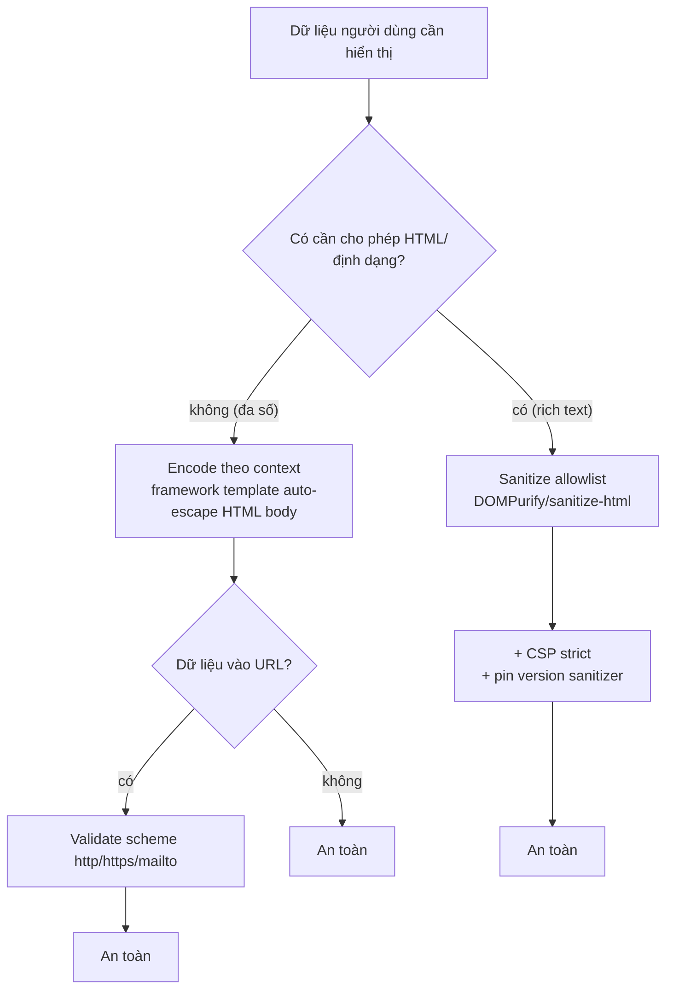
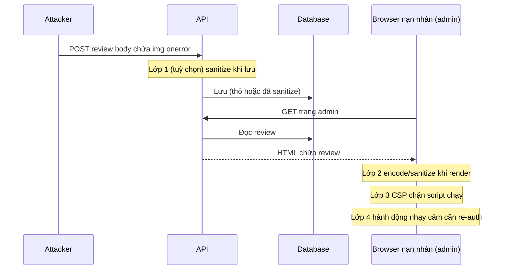

## Bối cảnh & vấn đề

Một sàn thương mại cho phép seller viết tên shop và mô tả sản phẩm. Một seller đặt tên shop là ``. Tên này được lưu vào DB, rồi hiển thị ở trang sản phẩm, trang tìm kiếm, và **trang quản trị nơi nhân viên duyệt shop**. Khi một admin mở danh sách shop chờ duyệt, đoạn script chạy trong phiên admin, với quyền admin, và gọi API đổi cấu hình payout về tài khoản attacker. Cookie admin là `HttpOnly` nên script không đọc được nó, nhưng điều đó không quan trọng: script chạy **trong origin của admin panel** nên nó gọi API thẳng, browser tự gắn cookie.

Đây là **XSS (Cross-Site Scripting)**: attacker chèn được mã chạy trong origin của bạn. Một khi script của attacker chạy trong trang, nó có mọi quyền mà JavaScript của bạn có: đọc DOM, gọi API thay user, đọc `localStorage`, keylog, đổi nội dung trang. Vì vậy XSS thường là bước đệm tới chiếm tài khoản, và nguy hiểm nhất khi nạn nhân là admin.

Bài này phân loại XSS theo *payload đi đường nào*, giải thích vì sao **output encoding theo context** mới là biện pháp chính (không phải chặn `<script>` ở input), chỉ ra các chỗ React vẫn dính dù mặc định đã escape, và chạy thật DOMPurify để sanitize rich text. CSP là lớp phòng thủ thứ hai, thuộc [bài 5](/tracks/web-security/learn/csp-headers).

**Interview angle:** câu "HttpOnly cookie chống được XSS không?" phân loại ứng viên ngay. Đáp: HttpOnly ngăn **đánh cắp** cookie, không ngăn script dùng cookie để gọi API trong origin đó.

## Khái niệm

### Stored XSS

**Stored (persistent) XSS**: payload được lưu lại (DB, file, cache) rồi phát cho mọi người xem. Ví dụ: comment, review, tên hiển thị, bio, tin nhắn chat, tên file. Nguy hiểm nhất vì một lần chèn ảnh hưởng nhiều nạn nhân, kể cả nạn nhân quyền cao (admin duyệt nội dung), và không cần lừa ai bấm link. Câu chuyện mở đầu là stored XSS.

### Reflected XSS

**Reflected XSS**: payload nằm trong request (query, path, header) và được server phản chiếu thẳng vào HTML của response, không lưu lại. Ví dụ `/search?q=<script>...</script>`: trang kết quả in lại `q` vào HTML. Cần lừa nạn nhân bấm một link có payload (qua email, tin nhắn, quảng cáo). Phạm vi hẹp hơn stored nhưng vẫn đủ để chiếm phiên của người bấm.

### DOM-based XSS

**DOM-based XSS**: lỗ hổng nằm hoàn toàn ở **client**. JavaScript đọc một nguồn không tin cậy (**source**: `location.hash`, `location.search`, `document.referrer`, `postMessage`, dữ liệu từ API) rồi ghi vào một **sink** nguy hiểm (`element.innerHTML`, `document.write`, `eval`, `new Function`, `setAttribute('href', ...)`). Server có thể không bao giờ thấy payload (phần sau dấu `#` không được gửi lên server), nên WAF và log phía server mù với loại này. Framework SPA làm DOM-based XSS phổ biến hơn vì phần lớn render diễn ra ở client.

### Output encoding theo context

Biện pháp **chính** chống XSS là **encode dữ liệu khi đưa ra output, theo đúng context**. Cùng một chuỗi phải encode khác nhau tuỳ nó nằm ở đâu:

- **HTML body** (`<div>HERE</div>`): encode `<`, `>`, `&` thành entity. `<script>` trở thành `&lt;script&gt;`, trình duyệt hiển thị dạng text.
- **HTML attribute** (`<input value="HERE">`): phải **luôn bọc attribute trong dấu nháy** và encode `"` (và `'`); nếu không, một attribute không nháy cho phép chèn `onfocus=...`.
- **JavaScript string** (`var x = "HERE"`): encode theo cú pháp JS, không chỉ HTML; an toàn nhất là không nhúng dữ liệu vào JS mà truyền qua `data-` attribute rồi đọc bằng `dataset`.
- **URL** (`<a href="HERE">`): validate scheme (chỉ `http/https/mailto`), encode query component; `javascript:` và `data:` URL là nguy hiểm.
- **CSS** và **HTML comment**: mỗi cái có quy tắc riêng.

Encode phải ở **lúc output**, nơi biết context, **không** ở lúc lưu. Encode lúc lưu gây double-encoding (tên "O'Brien" thành "O&#39;Brien" hiển thị sai) và sai khi dữ liệu được dùng ở context khác (xuất CSV, gửi email, render PDF). Lưu dữ liệu thô, encode khi render.

### Input validation và sanitization: vai trò khác nhau

**Input validation** (allowlist kiểu, độ dài, format) giảm bề mặt tấn công và bảo vệ business logic, nhưng **không** chống XSS triệt để: nhiều dữ liệu hợp lệ chứa ký tự đặc biệt (tên `O'Brien <3`, địa chỉ, công thức). Chặn `<script>` bằng denylist thì bị bypass bằng ``, `<svg onload>`, hoa thường lẫn lộn, mã hoá khác nhau. Validation là lớp bổ trợ, không thay thế encoding.

**Sanitization** chỉ cần khi bạn **buộc phải** cho phép HTML (rich text, mô tả có định dạng). Sanitizer phân tích HTML và chỉ giữ lại tag/attribute trong allowlist, bỏ `<script>`, `on*`, `javascript:`. DOMPurify là lựa chọn chuẩn.

## Cơ chế hoạt động

Sơ đồ cây quyết định: với mỗi chỗ dữ liệu người dùng ra output, chọn lớp phòng thủ nào:



Ý chính: mặc định là **encode**, sanitize là ngoại lệ cho rich text, và URL luôn cần validate scheme riêng vì encoding HTML không chặn `javascript:`. CSP phủ lên tất cả như lưới cuối.

Vòng đời một stored XSS và nơi mỗi lớp cắt được chuỗi tấn công:



## Ví dụ thực tế

### Đo thật: reflected, attribute, DOM-based trong Chrome 154

Server Express phục vụ bốn trang, Chrome 154 headless mở từng trang và báo liệu `alert(document.domain)` có chạy không:

```ts
app.get('/search-vuln', (req, res) => res.send(`<h1>Kết quả cho: ${req.query.q}</h1>`));          // no encoding
app.get('/search-safe', (req, res) => res.send(`<h1>Kết quả cho: ${esc(req.query.q)}</h1>`));      // HTML-encoded
app.get('/attr-wrong', (req, res) => res.send(`<input value=${esc(req.query.q)}>`));                // encoded but UNQUOTED
app.get('/dom', (_q, res) => res.send(`<div id=out></div><script>document.getElementById('out').innerHTML = decodeURIComponent(location.hash.slice(1));</script>`));
```

```text
reflected vuln : { fired: 'localhost', html: '<h1>Kết quả cho: </h1>' }
reflected safe : { fired: null,        html: '<h1>Kết quả cho: &lt;img src=x onerror=alert(document.domain)&gt;</h1>' }
unquoted attr  : { fired: '1',         html: '<input value="x" onfocus="alert(1)" autofocus="">' }
DOM-based      : { fired: 'localhost', html: '<div id="out"></div>...' }
```

Ba bài học. (1) Không encode → `alert` chạy (`fired: 'localhost'`). (2) HTML-encode đúng → payload hiển thị thành text, không chạy. (3) **Encode vẫn chưa đủ nếu context sai**: `/attr-wrong` có gọi `esc()` nhưng attribute **không bọc nháy**, nên input `x onfocus=alert(1) autofocus` tách thành các attribute mới và `alert` chạy. Đây là minh chứng "encoding phải đúng context": HTML entity encoding không chặn được attribute injection khi thiếu dấu nháy. (4) DOM-based: server chỉ gửi một `<div>` rỗng; payload nằm sau `#` (không tới server) và chạy vì client đọc `location.hash` ghi vào `innerHTML`.

### Đo thật: React 19 escape gì và không escape gì

```text
React 19.3.0
renderToString(<p>{''}</p>)
  -> <p>&lt;img src=x onerror=alert(1)&gt;</p>
renderToString(<a href="javascript:alert(1)">Website</a>)
  -> <a href="javascript:throw new Error('React has blocked a javascript: URL as a security precaution.')">Website</a>
renderToString(<a href=" JaVaScRiPt:alert(1)">Website2</a>)
  -> <a href="javascript:throw new Error('React has blocked a javascript: URL as a security precaution.')">
renderToString(<a href="data:text/html,<script>alert(1)</script>">data-url</a>)
  -> <a href="data:text/html,&lt;script&gt;alert(1)&lt;/script&gt;">data-url</a>
```

React auto-escape **text con** trong JSX (dòng đầu), đó là lý do app React ít dính XSS trong HTML body. React 19 còn **chặn `javascript:` URL** (kể cả viết lệch hoa thường và có khoảng trắng đầu), thay bằng một lệnh `throw` để không chạy; nhưng đây chỉ là cảnh báo/vô hiệu hoá, **không** phải sự cho phép dùng URL người dùng tuỳ tiện: `data:text/html` vẫn được giữ (chỉ escape dấu `<`), và bấm vào một số `data:`/`blob:` URL vẫn nguy hiểm. Vì vậy vẫn phải tự validate scheme cho URL người dùng. Các chỗ React **không** escape:

```tsx
<div dangerouslySetInnerHTML={{ __html: review.body }} />   // chèn HTML thô: stored XSS nếu chưa sanitize
<a href={profile.website}>Website</a>                        // data:/blob: URL vẫn có thể hại; validate scheme
ref.current.innerHTML = userHtml;                            // thao tác DOM trực tiếp, bỏ qua React
<Chart tooltipHtml={userText} />                             // thư viện bên thứ ba nhận HTML
```

### Đo thật: SSR nhúng state vào `<script>`

Một pattern phổ biến là nhúng state server xuống client qua `<script>window.__STATE__ = ...</script>`:

```text
naive  : <script>window.__STATE__={"bio":"</script><script>alert(1)</script>"}</script>
escaped: <script>window.__STATE__={"bio":"</script><script>alert(1)</script>"}</script>
```

`JSON.stringify` không escape `<`, nên một giá trị chứa `</script>` **đóng sớm thẻ script** và mở một thẻ mới của attacker. Fix: thay `<` bằng `<` (và nên cả `
`, `
`, `&`) trước khi nhúng. Nhiều framework (Next.js) tự làm việc này; nếu tự nhúng state, phải tự escape.

### Đo thật: DOMPurify 3.4.16 sanitize rich text

```ts
const cfg = { ALLOWED_TAGS: ['p', 'strong', 'em', 'a', 'ul', 'li'], ALLOWED_ATTR: ['href'] };
DOMPurify.sanitize(dirty, cfg);
```

```text
"<p>Hi <strong>there</strong></p>"  -> "<p>Hi <strong>there</strong></p>"
"<a href=\"javascript:alert(1)\">click</a>"                       -> "<a>click</a>"
"<svg><script>alert(1)</script></svg>"                           -> ""
"<p style=\"background:url(//evil)\" onclick=\"x()\">styled</p>"  -> "<p>styled</p>"
"<a href=\"https://ok.example\" target=\"_blank\">ok</a>"         -> "<a href=\"https://ok.example\">ok</a>"
```

DOMPurify giữ định dạng hợp lệ, bỏ ``, `javascript:` href, `<svg><script>`, `style` và `onclick`. Vì nó cần một DOM, phía server Node dùng `jsdom` (như lab này). Với link, bổ sung `rel="noopener nofollow"` qua hook `afterSanitizeAttributes`. Sanitize **khi lưu** để DB sạch **và** render qua component an toàn; pin version vì từng có **mutation XSS (mXSS)** bypass theo phiên bản (HTML được browser "sửa lại" sau khi sanitize, tạo ra tag thực thi). CSP strict trên trang hiển thị là lưới cuối nếu sanitizer bị bypass.

### Xử lý sự cố stored XSS trong admin (câu chuyện mở đầu)

Theo thứ tự cầm máu trước:

1. **Chặn lan**: xoá/khoá review độc, tìm payload tương tự trong DB (`WHERE body ILIKE '%onerror%'` và các mẫu khác), tạm tắt render HTML ở admin bằng feature flag.
2. **Thu hồi phiên**: `revoke` session của admin bị ảnh hưởng (và mọi admin đã mở trang đó), buộc đăng nhập lại.
3. **Khắc phục thiệt hại**: revert cấu hình payout, kiểm tra audit log các hành động nhạy cảm trong cửa sổ thời gian.
4. **Sửa gốc**: output encoding/sanitize ở nơi render; **strict CSP trên admin** (admin panel thường render HTML "cho đẹp" và ít được review bảo mật nhất); hành động nhạy cảm (đổi payout, đổi email) yêu cầu **re-authentication/step-up MFA**; cân nhắc tách admin sang origin riêng.

Vì sao step-up auth giới hạn thiệt hại ngay cả khi CSP thủng: script của attacker chạy được nhưng **không có** password/MFA của admin, nên không hoàn tất được hành động yêu cầu re-auth. Đó là lý do defense in depth: XSS không tự động thành "đổi payout".

## Trade-offs & lựa chọn thay thế

| Tình huống hiển thị | Cách đúng | Vì sao không chọn cách khác |
| --- | --- | --- |
| Text thường (tên, comment) | Framework auto-escape HTML body | Không cần sanitize; sanitize làm mất ký tự hợp lệ |
| URL người dùng | Validate scheme allowlist | Encode HTML không chặn `javascript:`/`data:` |
| Rich text (mô tả, bài viết) | DOMPurify allowlist, sanitize khi lưu + CSP | Cho phép HTML thô = stored XSS |
| Định dạng do user tạo | Structured format (Markdown no-raw-HTML, JSON editor) render bằng component | An toàn hơn HTML tự do, không cần innerHTML |
| State SSR xuống client | JSON escape `<` thành `<` | `JSON.stringify` thô phá thẻ `<script>` |
| Nội dung cần JS tuỳ biến (analytics tenant) | Sandbox iframe / origin riêng | Chạy JS trong origin chính = toàn quyền |

Khi tenant đòi nhúng JavaScript tuỳ biến (ví dụ snippet analytics): không bao giờ cho chạy trong origin chính. Lựa chọn là iframe `sandbox` ở một **origin riêng** (sandbox domain), hoặc chỉ cho cấu hình khai báo (chọn provider từ danh sách) thay vì code tự do, hoặc một CSP cho phép đúng domain analytics đó. Cho chạy JS tuỳ ý trong origin chính biến mọi tenant thành nguy cơ XSS cho tenant khác.

## Edge cases & failure modes

- **Context lồng nhau**: dữ liệu trong attribute `onclick` (HTML + JS cùng lúc), hoặc URL trong attribute. Cần encode nhiều lớp đúng thứ tự; tốt nhất là tránh (không nhúng dữ liệu vào handler inline).
- **mutation XSS (mXSS)**: HTML "sạch" theo sanitizer nhưng browser chuẩn hoá lại thành tag thực thi (thường qua `innerHTML` + namespace SVG/MathML). Pin version DOMPurify và render qua `TrustedHTML` khi có thể.
- **Attribute không nháy**: như lab cho thấy, encode đúng nhưng quên dấu nháy vẫn dính; template nên luôn bọc nháy.
- **SVG/HTML upload phục vụ cùng origin**: file SVG chứa `<script>` served từ origin chính chạy như trang của bạn (xem [bài upload](/tracks/web-security/learn/ssrf-redirects-uploads)).
- **Markdown cho raw HTML**: nhiều lib markdown mặc định cho HTML thô đi qua; phải tắt hoặc sanitize output.
- **Double-encoding sai**: encode lúc lưu rồi encode lại lúc render → hiển thị `&amp;lt;`; hoặc dữ liệu encode cho HTML lại dùng trong CSV/email.
- **DOM sink ẩn trong thư viện**: jQuery `.html()`, `$(userInput)`, template engine client, `v-html`, `dangerouslySetInnerHTML` sâu trong component.

## Pitfalls

- ❌ "HttpOnly cookie chống XSS" → ✅ HttpOnly chỉ chống đánh cắp cookie; script trong origin vẫn gọi API bằng cookie đó. XSS còn đọc DOM, keylog, đổi email.
- ❌ Chặn `<script>` ở input bằng denylist → ✅ output encoding theo context + sanitize cho rich text; denylist luôn bị bypass.
- ❌ Encode lúc lưu → ✅ lưu thô, encode lúc render (biết context), tránh double-encode và dùng sai context.
- ❌ `dangerouslySetInnerHTML` với markdown/rich text chưa sanitize → ✅ DOMPurify allowlist, pin version.
- ❌ `<a href={userUrl}>` không validate scheme → ✅ chỉ cho `http/https/mailto`; React chặn `javascript:` nhưng không chặn mọi `data:`.
- ❌ `JSON.stringify` state vào `<script>` → ✅ escape `<` thành `<`.
- ❌ Admin panel render HTML "cho tiện" không CSP → ✅ strict CSP + step-up auth; admin là mục tiêu giá trị nhất.

## Tóm tắt

- XSS = script attacker chạy trong origin của bạn → toàn quyền của JS trong trang; HttpOnly không cứu vì script dùng cookie qua API chứ không cần đọc nó.
- Stored (lưu DB, phát cho mọi người, nguy nhất với admin), reflected (trong URL, cần lừa bấm), DOM-based (client đọc source ghi vào sink, server không thấy).
- Biện pháp chính là **output encoding theo context**; encoding sai context (attribute không nháy) vẫn dính — đo thật trong Chrome 154.
- React auto-escape text và chặn `javascript:` URL, nhưng vẫn dính qua `dangerouslySetInnerHTML`, URL `data:`, innerHTML trực tiếp, thư viện, và JSON nhúng vào `<script>`.
- Rich text: DOMPurify allowlist, sanitize khi lưu + render an toàn, pin version (mXSS), CSP strict làm lưới cuối.
- Sự cố admin XSS: khoá payload, revoke session, revert, rồi sửa gốc bằng encode + CSP + step-up auth.
