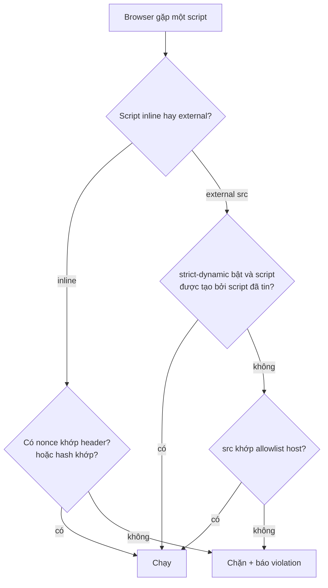
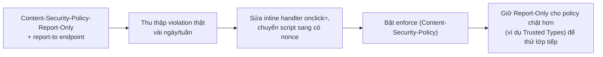

## Bối cảnh & vấn đề

[Bài XSS](/tracks/web-security/learn/xss) kết thúc bằng một nguyên tắc: output encoding là biện pháp chính, nhưng ở một codebase lớn, sẽ có lúc một chỗ render bị bỏ sót. Câu hỏi là: khi lỗ XSS lọt qua, điều gì ngăn script của attacker **thật sự chạy** hoặc **thật sự gửi dữ liệu ra ngoài**? Đó là việc của **Content Security Policy (CSP)** — lớp phòng thủ thứ hai, hoạt động ngay cả khi lớp đầu thủng.

CSP thường bị làm sai theo hai cách. Cách thứ nhất là đặt một policy quá lỏng (`script-src 'self' 'unsafe-inline'`) khiến nó gần như vô dụng. Cách thứ hai là đặt một allowlist domain dài (`script-src 'self' https://cdn.vendor.com https://analytics.example ...`) mà tin rằng nó an toàn, trong khi một trong các domain đó có JSONP endpoint hoặc chứa thư viện cũ, biến allowlist thành cửa sau. Ghi chú Notion về "CSP production" dùng allowlist + `style-src 'unsafe-inline'` và không có nonce chính là ví dụ của cách thứ hai (verify, và xem phần bypass).

Bài này đi qua CSP đúng (strict, dựa trên nonce + `strict-dynamic`), chứng minh bằng Chrome 154 vì sao nó mạnh hơn allowlist, mổ các kỹ thuật bypass, giới thiệu Trusted Types để chặn cả DOM XSS, rồi mở sang các header còn lại: clickjacking (`frame-ancestors`), HSTS và những gì TLS **không** bảo đảm.

**Interview angle:** câu "CSP thay thế output encoding được không?" kiểm tra tư duy lớp: không; CSP là defense in depth, giảm thiệt hại chứ không sửa lỗ hổng.

## Khái niệm

### CSP là gì và directive chính

**CSP** là một header (`Content-Security-Policy`) khai báo cho browser nguồn nào được phép tải/thực thi từng loại tài nguyên. Nó giảm thiểu XSS (giới hạn script được chạy), data injection, và clickjacking. Các directive hay dùng: `script-src` (JavaScript, quan trọng nhất cho XSS), `object-src` (plugin `<object>`/`<embed>`), `base-uri` (thẻ `<base>`), `frame-ancestors` (ai được nhúng trang này vào iframe), `form-action` (form submit đi đâu), `connect-src` (fetch/XHR/WebSocket), `img-src`, `style-src`, `default-src` (fallback cho các directive không khai báo).

### Allowlist vs strict CSP

**Allowlist CSP** liệt kê domain được phép: `script-src 'self' https://cdn.vendor.com`. Điểm yếu cố hữu: nếu bất kỳ domain nào trong danh sách có **JSONP endpoint** (`?callback=...` phản chiếu tên callback vào JS) hoặc host một thư viện có **script gadget** (AngularJS cũ cho phép template injection), attacker chèn một `<script src>` tới domain hợp lệ đó và chạy được code. Danh sách dài còn khó bảo trì và dễ thừa.

**Strict CSP** không tin domain mà tin **nonce** hoặc **hash**: `script-src 'nonce-{random}' 'strict-dynamic'; object-src 'none'; base-uri 'none'`. Mỗi response sinh một nonce ngẫu nhiên; chỉ `<script nonce="...">` có đúng nonce mới chạy. **`strict-dynamic`** nói với browser: "script đã được tin (có nonce) thì script nó tạo ra động (`document.createElement('script')`) cũng được tin, và **bỏ qua allowlist host**". Nhờ vậy loader hợp lệ vẫn load được module con mà không cần liệt kê domain, còn script attacker chèn qua HTML thì không có nonce nên bị chặn. web.dev khuyến nghị strict CSP chính vì nó không phụ thuộc danh sách domain.

Nonce phải **ngẫu nhiên mỗi response** và không bao giờ echo từ input. Nếu HTML được cache (CDN) và dùng chung một nonce, attacker đọc nonce trong HTML cache rồi gắn vào script của mình.

### Fallback cho browser cũ

Một policy strict thực tế thường viết: `script-src 'nonce-...' 'strict-dynamic' https: 'unsafe-inline'`. Trông mâu thuẫn, nhưng browser CSP3 (hiện đại) khi thấy nonce/`strict-dynamic` sẽ **bỏ qua** `https:` và `'unsafe-inline'`; chúng chỉ có tác dụng với browser rất cũ không hiểu nonce (ở đó policy suy biến về allowlist). Đây là cách giữ tương thích mà không hạ bảo mật trên browser hiện đại (verify hành vi theo trình duyệt mục tiêu).

### Trusted Types

CSP dựa trên nonce chặn script từ HTML, nhưng **DOM-based XSS** (JS của chính trang đọc source không tin cậy ghi vào `innerHTML`) thì nonce không đụng tới. **Trusted Types** (`require-trusted-types-for 'script'`) ép mọi phép gán vào các "injection sink" nguy hiểm (`innerHTML`, `script.src`, `eval`) phải là một đối tượng `TrustedHTML`/`TrustedScript` do một policy đã đăng ký tạo ra, thay vì một string thường. Gán string thường vào `innerHTML` **ném lỗi**. Điều này biến hàng trăm sink tiềm ẩn thành vài policy tập trung dễ audit. Chi phí: phải migrate code và thư viện để đi qua policy; nhiều thư viện hiện đại đã hỗ trợ.

### Clickjacking và frame-ancestors

**Clickjacking**: attacker nhúng trang của bạn vào iframe trong suốt (opacity 0) chồng lên trang của họ, lừa user bấm vào nút thật ("Xác nhận chuyển tiền", "Cấp quyền ứng dụng") trong khi tưởng đang bấm nút trên trang attacker. Phòng bằng CSP `frame-ancestors 'none'` (không ai nhúng được) hoặc `'self'` hoặc danh sách origin đối tác. `frame-ancestors` thay thế header cũ `X-Frame-Options: DENY` (vẫn có thể gửi kèm cho browser rất cũ). JS "frame-busting" không đáng tin (bypass được bằng `sandbox`). Khi **cần** cho nhúng (widget thanh toán, embed dashboard cho tenant B2B2C), allowlist đúng origin đối tác và cân nhắc hạn chế thao tác nhạy cảm trong frame.

### TLS và HSTS

**TLS/HTTPS** bảo đảm ba thứ: **confidentiality** (mã hoá trên đường truyền), **integrity** (không bị sửa giữa đường), **server authentication** (certificate do CA ký đúng domain). Nó **không** bảo vệ: dữ liệu khi đã ở server/log/DB, XSS/SQLi (lỗ hổng ở app, không ở đường truyền), endpoint bị compromise, user bị phishing trên domain khác trông giống, hay API logic sai. "Có HTTPS nên an toàn" là hiểu nhầm phổ biến (ghi chú Notion về replay attack nói đúng điểm này: TLS không bảo đảm *freshness*).

**HSTS** (`Strict-Transport-Security`) ép browser chỉ truy cập domain qua HTTPS trong `max-age` giây, chống **SSL stripping** (attacker ở giữa ép user về HTTP ở request đầu). Thêm **preload** (đăng ký vào danh sách của browser) chặn cả request HTTP **đầu tiên** trước khi user từng vào site — điều HSTS thường không làm được vì nó cần một response HTTPS để "học".

## Cơ chế hoạt động

Browser kiểm tra mỗi script theo CSP như sau:



Với strict CSP (`'nonce-...' 'strict-dynamic'`), nhánh allowlist gần như không dùng tới: script từ HTML phải có nonce, script động phải do script-đã-tin tạo ra. Script attacker chèn qua lỗ XSS không có nonce và không do script-đã-tin tạo, nên rơi vào `BLK`.

Quy trình rollout an toàn (không làm vỡ trang đang chạy):



`Content-Security-Policy-Report-Only` làm browser **chỉ báo cáo** vi phạm mà không chặn, nên ta thấy trước cái gì sẽ vỡ (script inline, `onclick=`, thư viện eval) rồi sửa, mới enforce.

## Ví dụ thực tế

### Đo thật: strict CSP trong Chrome 154

Server sinh nonce mỗi response, policy `script-src 'nonce-...' 'strict-dynamic'; object-src 'none'; base-uri 'none'`. Trang có một script hợp lệ (có nonce) tự tạo một script con `/lib.js`; và một tham số `?inject=...` mô phỏng lỗ XSS chèn HTML:

```text
strict, nonce + strict-dynamic child: { v: { trusted: true, lib: true }, dialog: null }
strict, injected inline <script>alert(1)</script>:
    console: "Executing inline script violates ... 'nonce-...' 'strict-dynamic'"   (alert KHÔNG chạy)
strict, injected <script src="/jsonp?callback=alert">:
    console: "Loading the script ... violates ... 'nonce-...'"                      (alert KHÔNG chạy)
```

Script có nonce chạy (`trusted: true`) và nhờ `strict-dynamic` nó load được `/lib.js` (`lib: true`) **mà không cần** liệt kê host. Hai payload tiêm qua "XSS" đều bị chặn: inline không có nonce, external cùng origin cũng không có nonce (strict-dynamic không áp cho script chèn thẳng vào HTML). Đây là lý do strict CSP mạnh: nó không quan tâm domain, chỉ quan tâm "script này có được tin không".

### Đo thật: allowlist bị bypass qua JSONP

Policy `script-src 'self'` (allowlist chính mình), trang có JSONP endpoint `/jsonp?callback=...`:

```text
allowlist 'self', injected <script>alert(1)</script>:
    console: "Executing inline script violates ... 'self'"     (chặn — đúng)
allowlist 'self', injected <script src="/jsonp?callback=alert(document.domain)//">:
    dialog: 'localhost'                                         (alert CHẠY — bypass!)
```

`'self'` chặn inline nhưng **cho phép** `<script src>` cùng origin. JSONP endpoint `/jsonp?callback=X` trả về `X({...})`, nên `callback=alert(document.domain)//` trả về `alert(document.domain)//(...)` — một script hợp lệ từ origin được allowlist. Đây chính xác là điểm yếu của allowlist mà strict CSP tránh được: với nonce, `<script src>` không nonce bị chặn bất kể origin.

### Đo thật: thiếu base-uri cho phép chiếm script tương đối

Policy `script-src 'nonce-...'` nhưng **không** có `base-uri`. Trang có `<script nonce src="app.js">` (đường dẫn tương đối). Attacker tiêm `<base href="http://attacker/">`:

```text
nonce but no base-uri, injected <base href="http://localhost:4051/">:
    dialog: 'base-uri hijack'
    window.appFrom: 'ATTACKER'
```

Thẻ `<base>` đổi gốc của mọi URL tương đối, nên `src="app.js"` bây giờ tải từ server attacker. Script attacker **không cần nonce** vì browser cho rằng đây chính là thẻ `<script>` hợp lệ của trang (nó có nonce, chỉ là nguồn bị đổi). Đó là lý do strict CSP luôn kèm `base-uri 'none'` (hoặc `'self'`). Tương tự, thiếu `object-src 'none'` để hở plugin, thiếu `form-action` để hở việc đổi đích submit.

### Đo thật: Trusted Types chặn DOM XSS sink

Policy `require-trusted-types-for 'script'`, trang gán string vào `innerHTML`:

```text
trusted types:
    console: "This document requires 'TrustedHTML' assignment. The action has been blocked."
    result: "TypeError: Failed to set the 'innerHTML' property on 'Element': This document requires 'TrustedHTML'"
```

Gán string thường vào `innerHTML` ném `TypeError` thay vì chèn HTML. Để code hợp lệ hoạt động, nó phải đi qua một policy đã đăng ký:

```js
// minh hoạ: một policy tập trung, nơi duy nhất được phép tạo TrustedHTML
const policy = trustedTypes.createPolicy('app-html', { createHTML: (s) => DOMPurify.sanitize(s) });
el.innerHTML = policy.createHTML(userHtml);   // string thô vẫn bị chặn; chỉ TrustedHTML qua
```

Giá trị: thay vì audit hàng trăm chỗ gán `innerHTML`, ta chỉ cần audit vài policy. Migrate React app thường cần `trusted-types-react` hoặc bật dần qua Report-Only.

### Đo thật: clickjacking và frame-ancestors

Một trang "nạn nhân" phục vụ trần (không header) và một bản dùng `helmet()`; trang attacker ở origin khác nhúng cả hai vào iframe:

```text
victim-open   => frame content: "<button>Confirm transfer</button>"   (nhúng được — clickjack!)
victim-helmet => ERR_BLOCKED_BY_RESPONSE, "localhost refused to connect"   (iframe bị chặn)
```

Trang không header bị nhúng và attacker đặt opacity thấp để lừa click. Trang helmet gửi `frame-ancestors 'self'` (và `X-Frame-Options: SAMEORIGIN`), nên browser từ chối hiển thị nó trong iframe của origin khác với `ERR_BLOCKED_BY_RESPONSE`.

### Bộ header helmet mặc định (đo thật)

`helmet()` v8.3 không cấu hình gì thêm trả về:

```text
content-security-policy: default-src 'self';base-uri 'self';font-src 'self' https: data:;form-action 'self';frame-ancestors 'self';img-src 'self' data:;object-src 'none';script-src 'self';script-src-attr 'none';style-src 'self' https: 'unsafe-inline';upgrade-insecure-requests
cross-origin-opener-policy: same-origin
cross-origin-resource-policy: same-origin
referrer-policy: no-referrer
strict-transport-security: max-age=31536000; includeSubDomains
x-content-type-options: nosniff
x-frame-options: SAMEORIGIN
x-permitted-cross-domain-policies: none
x-xss-protection: 0
```

helmet là điểm bắt đầu tốt, nhưng CSP mặc định của nó là `script-src 'self'` (allowlist, không nonce) — vẫn phải **tự cấu hình nonce** nếu muốn strict CSP. Chú ý `x-xss-protection: 0`: header `X-XSS-Protection` cũ (XSS Auditor) đã **deprecated** và từng tạo lỗ hổng, nên tắt (đặt `0`) là đúng. `Referrer-Policy` mặc định `no-referrer` khá chặt; nhiều app dùng `strict-origin-when-cross-origin` để giữ referrer cùng origin mà không lộ path/query ra ngoài.

### Bộ header nên đặt

```text
Strict-Transport-Security: max-age=63072000; includeSubDomains; preload
Content-Security-Policy: script-src 'nonce-...' 'strict-dynamic'; object-src 'none'; base-uri 'none'; frame-ancestors 'none'; form-action 'self'
X-Content-Type-Options: nosniff
Referrer-Policy: strict-origin-when-cross-origin
Permissions-Policy: camera=(), geolocation=(), microphone=()
```

`nosniff` chặn MIME sniffing (browser đoán kiểu file, có thể chạy một "ảnh" chứa HTML). `Permissions-Policy` tắt các API không dùng. COOP/COEP/CORP thêm khi cần cross-origin isolation (ví dụ dùng `SharedArrayBuffer`).

## Trade-offs & lựa chọn thay thế

| Lựa chọn CSP | Ưu | Nhược | Khi nào |
| --- | --- | --- | --- |
| Không có CSP | 0 công | Không có lớp 2 cho XSS | Không nên |
| Allowlist domain | Dễ hiểu ban đầu | Bypass qua JSONP/gadget, khó bảo trì | Trang tĩnh ít script bên thứ ba |
| Strict (nonce + strict-dynamic) | Không phụ thuộc domain, mạnh | Cần sinh nonce mỗi response, SSR động | Mặc định khuyến nghị cho app động |
| Hash cho script tĩnh | Không cần nonce, hợp CDN cache | Phải tính lại hash khi script đổi | Trang static-generated |
| + Trusted Types | Chặn cả DOM XSS | Cần migrate code/thư viện | App có nhiều DOM manipulation |

Chọn thế nào: với app render động (SSR), **strict CSP dựa trên nonce** là mặc định. Với trang static generated + cache CDN, nonce-per-response khó (HTML cache dùng chung nonce là lỗ hổng), nên dùng **hash** cho các script cố định, hoặc để framework tự xử lý (Next.js có cơ chế nonce qua middleware/`proxy.ts` ở bản mới — verify). Bật **Trusted Types** ở Report-Only trước, rồi enforce. HSTS luôn bật; cân nhắc preload chỉ khi chắc chắn toàn bộ domain và subdomain sẽ luôn HTTPS (preload khó gỡ).

## Edge cases & failure modes

- **Nonce bị cache**: HTML static-generated cache trên CDN dùng chung một nonce cho mọi user → attacker đọc nonce rồi dùng. Dùng hash cho trang cache, hoặc đảm bảo nonce sinh per-request (không cache HTML).
- **`'unsafe-inline'` lẫn trong policy**: nếu không có nonce/hash, `'unsafe-inline'` cho phép mọi inline script → CSP gần như vô dụng. Với nonce, browser CSP3 bỏ qua nó (fallback cho browser cũ).
- **Thiếu `base-uri`/`object-src`/`form-action`**: như lab, mỗi directive thiếu là một đường bypass.
- **Inline event handler**: `onclick=`, `onerror=` là inline script; strict CSP chặn chúng nên phải refactor sang `addEventListener`.
- **CSP chỉ ở một số route**: trang bị bỏ sót (admin, trang lỗi, email HTML) không có CSP là nơi XSS sống.
- **HSTS trên domain chưa sẵn sàng HTTPS toàn bộ**: `includeSubDomains` ép mọi subdomain HTTPS; một subdomain còn HTTP sẽ hỏng. Preload gỡ rất chậm.
- **TLS tạo cảm giác an toàn**: HTTPS không chống XSS/SQLi/logic; đừng dừng ở "có khoá xanh".

## Pitfalls

- ❌ `script-src 'self' 'unsafe-inline'` → ✅ bỏ `'unsafe-inline'`, dùng nonce/hash; `'unsafe-inline'` phá tác dụng CSP.
- ❌ Tin allowlist domain dài là an toàn → ✅ strict CSP (nonce + strict-dynamic); allowlist bị bypass qua JSONP/gadget trên domain hợp lệ.
- ❌ Quên `base-uri`/`object-src 'none'`/`form-action` → ✅ luôn kèm; thiếu `base-uri` cho phép chiếm script tương đối (đo thật).
- ❌ Dùng chung nonce cho HTML cache → ✅ nonce per-response hoặc hash cho trang tĩnh.
- ❌ CSP chỉ chặn `<script>`, bỏ qua DOM sink → ✅ thêm Trusted Types để chặn `innerHTML`/`eval`.
- ❌ Dựa JS frame-busting chống clickjacking → ✅ `frame-ancestors`; frame-busting bypass được.
- ❌ "Có HTTPS là đủ bảo mật" → ✅ TLS chỉ lo đường truyền; vẫn cần HSTS (chống SSL stripping) và toàn bộ lớp app.

## Tóm tắt

- CSP là lớp phòng thủ **thứ hai** cho XSS: khi encoding sót, CSP ngăn script chạy/gửi dữ liệu.
- Strict CSP = `script-src 'nonce-...' 'strict-dynamic'; object-src 'none'; base-uri 'none'`; mạnh hơn allowlist vì không phụ thuộc domain (đo thật trong Chrome 154).
- Allowlist bị bypass qua JSONP/gadget trên domain hợp lệ; thiếu `base-uri` cho phép `<base>` chiếm script tương đối.
- Trusted Types (`require-trusted-types-for 'script'`) chặn cả DOM-based XSS bằng cách ép sink nhận `TrustedHTML`.
- Rollout bằng Report-Only, sửa inline handler, rồi enforce; nonce phải ngẫu nhiên mỗi response.
- `frame-ancestors` chống clickjacking (thay `X-Frame-Options`); HSTS chống SSL stripping, preload chặn cả request HTTP đầu tiên; TLS không chống XSS/SQLi/logic.
