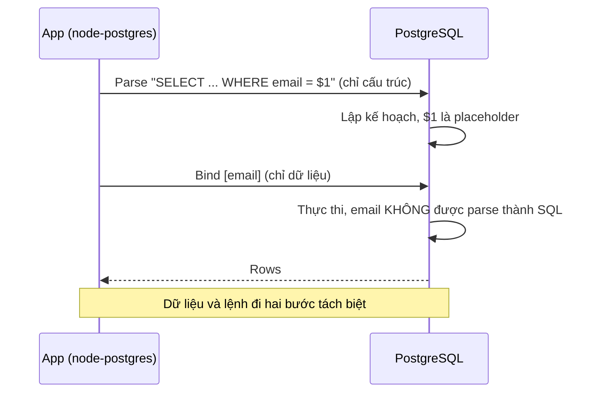
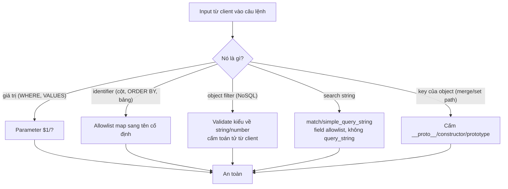

## Bối cảnh & vấn đề

Một team dùng ORM và tin rằng mình miễn nhiễm SQL injection. Đúng cho 95% query. Nhưng màn hình danh sách sản phẩm cho phép người dùng chọn cột sắp xếp, và cột đó không thể truyền làm tham số, nên một dev nối thẳng vào SQL: `ORDER BY ${sort} ${dir}`. Một attacker đặt `sort` bằng một biểu thức con truy vấn, và dù phần `WHERE name = $1` vẫn parameterized đàng hoàng, `ORDER BY` trở thành kênh để đọc dữ liệu từng ký tự (blind SQLi). "Dùng ORM" không cứu được, vì lỗ hổng nằm ở **identifier**, nơi parameter không áp dụng.

Injection là họ lỗ hổng rộng: SQL, NoSQL, OS command, LDAP, và — trong thế giới Node — cả **prototype pollution**, nơi dữ liệu người dùng "tiêm" vào `Object.prototype`. OWASP 2025 gộp XSS vào A05 Injection vì bản chất giống nhau: **dữ liệu bị diễn giải thành code/cấu trúc**. Cách chữa cũng chung một nguyên tắc: tách **dữ liệu** khỏi **lệnh**, và validate hình dạng input.

Bài này giải thích vì sao parameterized query là cách đúng (không phải escaping), vì sao identifier cần allowlist, và chạy thật trên Postgres 17 các biện pháp phòng thủ. Vì nội dung này là giáo dục phòng thủ, các ví dụ tập trung vào **cách chặn**; payload tấn công chỉ mô tả ở mức khái niệm.

**Interview angle:** "Team dùng TypeORM và khẳng định không thể SQLi. Bạn review những gì?" — raw query, QueryBuilder nối chuỗi, `ORDER BY` động, search/filter/report/export API. Biết chỗ ORM hở là tín hiệu kinh nghiệm.

## Khái niệm

### Vì sao injection xảy ra

Injection xảy ra khi input người dùng được **nối chuỗi** vào một câu lệnh (SQL, lệnh shell, truy vấn NoSQL) khiến input thay đổi **cấu trúc** câu lệnh thay vì chỉ là dữ liệu. `WHERE email = '${email}'` với `email` chứa dấu nháy đơn sẽ "thoát" khỏi chuỗi và phần còn lại được parse như SQL. Cùng cơ chế với OS command (`exec('convert ' + filename)`), LDAP filter, và XSS (dữ liệu thành HTML/JS).

### Parameterized query: tách lệnh khỏi dữ liệu

**Parameterized query** (prepared statement) gửi **câu lệnh** và **dữ liệu** tới DB qua hai kênh tách biệt: `SELECT * FROM users WHERE email = $1` cộng mảng `[email]`. DB **parse và lập kế hoạch câu lệnh trước**, với `$1` là một placeholder; giá trị `email` được đưa vào sau khi cấu trúc đã cố định, nên không thể trở thành SQL. Dù `email` là `' OR '1'='1`, nó chỉ là một chuỗi để so sánh bằng, không phải điều kiện.

Đây là lý do parameterized query mạnh hơn **escaping thủ công**. Escaping (thêm `\` trước dấu nháy) dễ sai: phụ thuộc charset, khác nhau giữa context số và chuỗi, không áp dụng cho identifier, và một lỗi nhỏ mở lại lỗ hổng. Parameterized query loại bỏ cả lớp vấn đề vì DB không bao giờ parse dữ liệu thành lệnh.

ORM an toàn **trừ khi** bạn dùng raw query nối chuỗi (`repository.query(\`... ${x}\`)`) hoặc QueryBuilder với điều kiện nối chuỗi (`.where(\`email = '${x}'\`)` thay vì `.where('email = :email', { email })`).

### Giới hạn: identifier không tham số hoá được

Placeholder chỉ dùng cho **giá trị** (value), không dùng cho **identifier** (tên bảng, tên cột, `ORDER BY`, `ASC/DESC`) hay từ khoá SQL. Không có cách nào viết `ORDER BY $1`. Vì vậy khi người dùng chọn cột sắp xếp, phải **allowlist**: ánh xạ giá trị từ client sang một tập tên cột cố định do bạn kiểm soát, và `dir` chỉ nhận `asc`/`desc`. Đây là nơi "đã parameterized" vẫn injectable nếu quên.

### NoSQL operator injection

Với MongoDB, filter là một **object**, và nếu body JSON của client được đưa thẳng vào filter, client gửi được **toán tử** thay vì giá trị: `{ "email": { "$ne": null } }` khớp mọi document, `{ "password": { "$gt": "" } }` bỏ qua so sánh. "Không dùng SQL" không có nghĩa không có injection. Cách chữa: validate **kiểu** input (ép về string với zod `z.string()`), bật `sanitizeFilter`/dùng `mongo-sanitize`, và không bao giờ đưa object từ client vào filter. Tra user theo email rồi verify hash bằng hàm constant-time, không query theo password.

### Search query injection (Elasticsearch)

Elasticsearch có `query_string` dùng cú pháp Lucene mạnh (toán tử boolean, wildcard, field selector `field:value`, range). Đưa input thô vào `query_string` cho phép người dùng viết truy vấn tuỳ ý: `*` quét mọi document, `tenant_id:*` lộ dữ liệu tenant khác nếu filter yếu, wildcard đầu chuỗi tốn tài nguyên (DoS). Dùng `match`/`multi_match`/`simple_query_string` với **field allowlist** thay vì `query_string`; tenant filter đặt ở `bool.filter` phía **server**, không từ client. Đây là trọng tâm của [câu hỏi CV về search đa tenant](/tracks/web-security/learn/injection).

### Prototype pollution

Trong JavaScript, mọi object kế thừa từ `Object.prototype`. Nếu code ghi vào một key do người dùng kiểm soát mà không lọc, key `__proto__` trỏ tới `Object.prototype`, nên ghi `obj['__proto__']['isAdmin'] = true` thêm thuộc tính `isAdmin` lên prototype của **mọi object** trong process. Sau đó `if (user.isAdmin)` thành true cho tất cả. Hàm "deep merge" hoặc "set nested path" tự viết là nơi hay dính; pollution đôi khi dẫn tới RCE qua **gadget** (một đoạn code đọc một property từ prototype rồi dùng nó làm option cho `child_process`, template engine). Cách chữa: bỏ qua key `__proto__`/`constructor`/`prototype`, dùng `Object.create(null)`/`Map` cho dữ liệu động, validate schema strict, và `node --disable-proto=delete`.

## Cơ chế hoạt động

Luồng của một parameterized query qua giao thức Postgres extended:



Cây quyết định khi một giá trị từ client đi vào query:



## Ví dụ thực tế

### Đo thật: parameter biến input thành dữ liệu (Postgres 17)

Chạy trên Postgres 17.11, node-postgres 8.23. Một giá trị chứa dấu nháy đơn, gửi qua parameter, chỉ là dữ liệu:

```ts
const r1 = await pool.query('SELECT id, email FROM users WHERE email = $1', ["o'brien@acme.test"]);
// -> param with quote -> 0 rows   (so sánh bằng với chuỗi literal, không lỗi cú pháp, không injection)
```

```text
param with quote -> 0 rows
```

Dấu nháy trong `o'brien` không phá câu lệnh: nó được so sánh như một ký tự bình thường. So với nối chuỗi, nơi dấu nháy sẽ "đóng" chuỗi SQL và phần sau bị parse thành lệnh.

### Đo thật: extended protocol từ chối nhiều câu lệnh

Khi query có parameter, node-postgres dùng extended protocol, vốn chỉ cho **một** câu lệnh:

```ts
await pool.query('SELECT $1::int AS a; SELECT 2', [1]);
// -> ERROR: cannot insert multiple commands into a prepared statement
```

```text
[1] -> ERROR: cannot insert multiple commands into a prepared statement
```

Đây là một lớp bảo vệ phụ: stacked query (`; DROP ...`) không chạy được khi có parameter. **Cảnh báo**: nó chỉ áp dụng khi bạn *dùng* parameter. Query **không** parameter (`pool.query('SELECT 1; SELECT 2')`) đi qua simple protocol và cho nhiều câu lệnh — đo thật:

```text
undefined -> ok, 2 results
[]        -> ok, 2 results
[1]       -> ERROR: cannot insert multiple commands into a prepared statement
```

Bài học: đừng dựa vào "Postgres chặn stacked query"; luôn parameterized.

### Đo thật: identifier cần allowlist

```ts
const SORTS = { created: 'created_at', price: 'price', name: 'name' };
function orderBy(sort, dir) {
  const col = SORTS[sort];                          // allowlist: map client value -> real column
  if (!col) throw new Error(`invalid sort "${sort}"`);
  const d = dir === 'asc' ? 'ASC' : 'DESC';         // dir constrained to two values
  return `ORDER BY ${col} ${d}, id ${d}`;           // + tie-breaker for stable paging
}
```

```text
sort=price          -> [{"name":"Mouse","price":"19"},{"name":"Keyboard","price":"49"}]
sort="name; anything" -> 400 invalid sort "name; anything"
```

Giá trị `sort` lạ bị từ chối ở app (400) trước khi tới DB, vì nó không nằm trong `SORTS`. Đây là fix cho endpoint "đã parameterized nhưng vẫn injectable" ở câu chuyện mở đầu và ở câu hỏi debug của track. Khi identifier không thể allowlist trước (hiếm), node-postgres có `pg.escapeIdentifier`:

```text
escapeIdentifier -> "weird""col"
```

nhưng allowlist luôn ưu tiên hơn escaping.

### Đo thật: validate kiểu chặn NoSQL operator và mass filter

Một schema zod `.strict()` loại bỏ cả operator injection lẫn field thừa, trước khi dữ liệu chạm filter:

```ts
const Login = z.object({ email: z.string().email().max(254), password: z.string().min(1).max(256) }).strict();
```

```text
{"email":"alice@acme.test","password":"pw"}          -> ok
{"email":{"$ne":null},"password":"pw"}               -> email: invalid_type
{"email":"a@b.co","password":"pw","role":"admin"}    -> (root): unrecognized_keys
```

Object `{ $ne: null }` bị chặn vì `email` phải là string; field thừa `role` bị `.strict()` từ chối. Cùng một validation vừa chặn NoSQL injection vừa chặn mass assignment (xem [bài access control](/tracks/web-security/learn/access-control)). Đây là lý do validate **hình dạng** input là một trong những biện pháp "loại cả lớp lỗi".

### Đo thật: prototype pollution và merge an toàn

`JSON.parse` tạo `__proto__` thành một **own property** chứ không phải setter, nên nó lọt qua `Object.keys`. Merge an toàn phải lọc key:

```ts
const FORBIDDEN = new Set(['__proto__', 'constructor', 'prototype']);
function safeMerge(target, src) {
  for (const key of Object.keys(src)) {
    if (FORBIDDEN.has(key)) continue;                 // drop dangerous keys
    const v = src[key];
    if (v && typeof v === 'object' && !Array.isArray(v)) {
      if (!Object.hasOwn(target, key) || typeof target[key] !== 'object') target[key] = Object.create(null);
      safeMerge(target[key], v);
    } else target[key] = v;
  }
  return target;
}
```

```text
JSON.parse keeps __proto__ as own key: [ 'theme', '__proto__' ]
merged prefs: {"theme":"dark"} | ({}).flag = undefined
```

Body `{"theme":"dark","__proto__":{"flag":true}}` không làm ô nhiễm prototype: `({}).flag` vẫn `undefined`. Bổ sung: `node --disable-proto=delete` xoá hẳn `__proto__` accessor (`({}).__proto__` trả `undefined`) mà `Object.getPrototypeOf` vẫn hoạt động; và một merge/clone từ thư viện đã vá, hoặc dùng `structuredClone`/`Map`.

## Trade-offs & lựa chọn thay thế

| Tình huống | Cách đúng | Cách sai thường gặp |
| --- | --- | --- |
| Giá trị trong WHERE/VALUES | Parameter `$1`/`?` | Nối chuỗi, escaping thủ công |
| Cột sắp xếp/lọc động | Allowlist map sang tên cột | `ORDER BY ${sort}` |
| ORM raw/QueryBuilder | `.where('x = :p', { p })` | `.where(\`x = '${p}'\`)` |
| Filter MongoDB | Validate kiểu, cấm operator | Đưa `req.body` vào filter |
| Search người dùng | `match`/`simple_query_string` + field allowlist | `query_string` với input thô |
| Merge/set nested từ body | Lọc `__proto__`, `Object.create(null)` | deep merge ngây thơ |
| Giảm thiệt hại | DB user least privilege | App chạy bằng superuser |

Nguyên tắc chọn: luôn ưu tiên biện pháp **loại cả lớp lỗi** — parameterized query, schema validation strict — hơn là vá từng payload. WAF có thể bắt một số payload SQLi nhưng không thay thế parameterized query (bypass được bằng encoding, và không hiểu `ORDER BY` động). Least privilege (bài [threat model](/tracks/web-security/learn/threat-model-owasp)) là lớp giảm thiệt hại độc lập: nếu injection lọt, role không có DDL hạn chế được hậu quả.

## Edge cases & failure modes

- **"Đã parameterized" nhưng identifier nối chuỗi**: `ORDER BY`, `LIMIT` từ biểu thức, tên bảng động cho multi-tenant. Allowlist tất cả.
- **Simple protocol cho stacked query**: query không parameter trong node-postgres cho nhiều câu lệnh; một bug nối chuỗi ở đó nguy hiểm hơn.
- **ILIKE với wildcard người dùng**: `ILIKE '%' || q || '%'` không dùng index (full scan, DoS) và `%`/`_` trong `q` là wildcard; escape nếu muốn tìm literal, giới hạn độ dài `q`.
- **NoSQL trong aggregation/`$where`**: `$where` chạy JavaScript trên server Mongo — cực nguy hiểm, tránh hoàn toàn.
- **Prototype pollution gián tiếp**: qua query string parser (`qs` với `?a[__proto__][x]=1`), qua merge config, qua `JSON.parse` + set path.
- **Elasticsearch `query_string` lọt qua review**: trông "tiện cho search nâng cao" nhưng mở cú pháp Lucene cho người dùng.
- **ORM tự nối cho tính năng động**: một số ORM build `IN (...)` hoặc `ORDER BY` từ input mà không parameterize đúng; kiểm tra SQL sinh ra.

## Pitfalls

- ❌ Nối chuỗi input vào SQL (kể cả "chỉ số") → ✅ parameter `$1`; cast kiểu không thay thế được parameter.
- ❌ Tin ORM miễn nhiễm → ✅ kiểm raw query, QueryBuilder nối chuỗi, `ORDER BY` động, search/export API.
- ❌ `ORDER BY ${sort}` → ✅ allowlist map sang tên cột cố định + `dir` chỉ asc/desc + tie-breaker.
- ❌ Đưa `req.body` thẳng vào filter MongoDB → ✅ validate kiểu, cấm operator, `sanitizeFilter`.
- ❌ `query_string` với input người dùng → ✅ `match`/`simple_query_string` + field allowlist; tenant filter ở server.
- ❌ deep merge/set path không lọc key → ✅ cấm `__proto__`/`constructor`/`prototype`, `Object.create(null)`.
- ❌ Dựa vào "Postgres chặn stacked query" → ✅ luôn parameterized; simple protocol cho nhiều câu lệnh.

## Tóm tắt

- Injection = input bị diễn giải thành code/cấu trúc; parameterized query tách **lệnh** khỏi **dữ liệu** nên input không bao giờ thành SQL (đo thật: dấu nháy chỉ là dữ liệu).
- Parameter không dùng cho **identifier** (ORDER BY, tên cột); phải allowlist — đây là chỗ "đã parameterized" vẫn injectable.
- Extended protocol chặn stacked query *khi có parameter*; query không parameter đi simple protocol và cho nhiều câu lệnh.
- NoSQL: client gửi object operator (`$ne`) nếu body vào thẳng filter; validate kiểu (zod string) chặn cả injection lẫn mass filter.
- Elasticsearch: dùng `match`/`simple_query_string` + field allowlist, không `query_string`; tenant filter đặt ở server.
- Prototype pollution: `JSON.parse` tạo `__proto__` own key; lọc `__proto__`/`constructor`/`prototype`, `Object.create(null)`, `--disable-proto=delete`.
