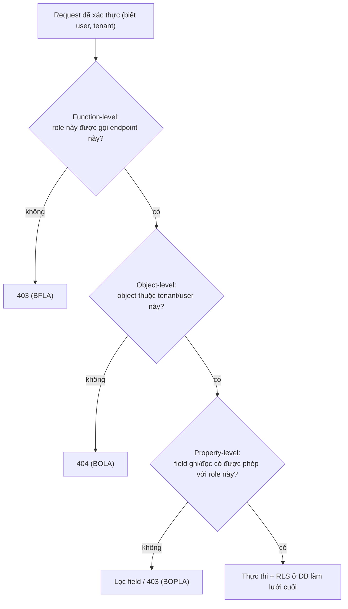
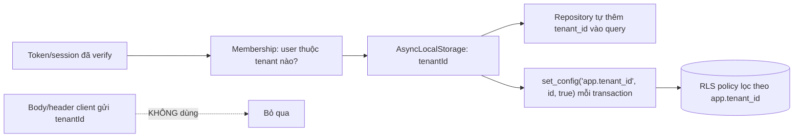

## Bối cảnh & vấn đề

`GET /api/orders/1043` trả về một đơn hàng. Endpoint có middleware `requireAuth`, nên code review duyệt. Nhưng `requireAuth` chỉ trả lời "người này đã đăng nhập chưa", không trả lời "đơn 1043 có phải của người này không". Đổi `1043` thành `1042` trả về đơn của người khác, kèm địa chỉ và số điện thoại. Không có exploit tinh vi, chỉ là một con số bị đổi.

Đây là **Broken Access Control**, đứng **#1** trong OWASP Top 10 cả 2021 lẫn 2025, và **API1 (BOLA)** trong OWASP API Security Top 10:2023. Nó phổ biến vì ba lý do: middleware authentication làm dev tưởng "đã bảo mật"; check quyền ở **object level** phải viết trong **từng query** nên dễ quên một chỗ; và scanner tự động khó phát hiện vì cần hiểu "ai sở hữu cái gì". Đổi sang UUID không phải fix (chỉ làm ID khó đoán hơn, không ngăn một user đã biết ID xem object).

Bài này gom cả nhóm access control: **BOLA** (object), **BFLA** (function), **BOPLA/mass assignment** (property), tenant isolation nhiều lớp, và cách xử lý khi dữ liệu đã rò giữa tenant. Mọi ví dụ chạy thật trên Postgres 17, gồm Row-Level Security và cái bẫy pooled connection mà nhiều người vấp.

**Interview angle:** "Bạn làm sao đảm bảo không endpoint nào ship mà thiếu check quyền?" là câu CV cốt lõi. Câu trả lời mạnh có: deny by default, check 2 tầng, test tự động cross-tenant.

## Khái niệm

### BOLA / IDOR (object level)

**IDOR** (Insecure Direct Object Reference) và **BOLA** (Broken Object Level Authorization) là cùng một lỗi với hai tên: API nhận một object id từ client và trả/sửa object đó **mà không kiểm tra** user hiện tại có quyền với **chính object đó**. Fix là **scope query theo owner/tenant**: `WHERE id = $1 AND tenant_id = $2 AND customer_id = $3`, hoặc một policy tập trung (`findOwnedOrThrow`). Trả **404** thay vì 403 khi object không thuộc về user, để không xác nhận object tồn tại (tránh lộ thông tin).

UUID **không** phải giải pháp: nếu một user biết UUID của object người khác (qua link chia sẻ, log, response khác), họ vẫn truy cập được nếu thiếu check. UUID chỉ giảm khả năng *đoán* ID, không thay thế authorization.

### BFLA (function level)

**BFLA** (Broken Function Level Authorization, API5:2023): một endpoint hoặc hành động chỉ dành cho role cao (admin, staff) nhưng không kiểm tra role. Ví dụ `POST /admin/refunds` quên guard, hoặc một method của endpoint chung (`DELETE /users/:id`) không check vai trò. Khác BOLA (về *object* của ai), BFLA là về *chức năng* ai được gọi. Fix: mỗi route khai báo permission; guard toàn cục từ chối route không khai báo.

### BOPLA / mass assignment (property level)

**BOPLA** (Broken Object Property Level Authorization, API3:2023) gộp hai lỗi property-level: **mass assignment** (ghi) và **excessive data exposure** (đọc). Mass assignment: framework bind nguyên body vào model, nên client gửi thêm field không được phép (`role`, `isVerified`, `tenantId`, `price`, `balance`) và chúng được ghi. Excessive data exposure: response trả nguyên entity, lộ `passwordHash`, `mfaSecret`, internal id. Fix cho cả hai: **allowlist DTO** — schema strict cho input, response DTO chọn field cho output. Không bao giờ `data: req.body`, không bao giờ `res.json(entity)`.

### Deny by default

**Deny by default** nghĩa là trạng thái mặc định khi không chắc chắn là **từ chối**, không phải cho qua. Áp dụng cho access control: mỗi route phải **khai báo** permission cần có; route không khai báo thì guard từ chối (hoặc fail khi boot/test), thay vì ngầm cho qua. Điều này biến "quên thêm check" từ một lỗ hổng im lặng thành một lỗi ồn ào bắt được sớm.

### Tenant isolation nhiều lớp

Trong SaaS shared-database, một lỗi của một dev không được phép làm rò dữ liệu giữa tenant. Defense in depth cần các lớp **độc lập**:

1. **Tenant context** lấy từ nguồn tin cậy (token/membership đã verify), lưu trong `AsyncLocalStorage`; **không** nhận `tenantId` từ body/header client.
2. **Data access layer** tự thêm `tenant_id` vào mọi query (ORM middleware/extension); lint cấm raw query ngoài layer.
3. **DB**: Row-Level Security lọc theo `app.tenant_id`; composite key `(tenant_id, id)` để không tham chiếu chéo.
4. **Cache/search/storage**: key prefix theo tenant, index filter bắt buộc, S3 prefix + IAM condition.
5. **Test** cross-tenant tự động cho mọi endpoint.
6. **Detect**: log tenant của dữ liệu trả về so với tenant của request, alert khi lệch.

### Row-Level Security

**RLS** (Postgres) gắn một **policy** vào bảng sao cho mọi câu lệnh tự động bị lọc theo một điều kiện, ví dụ `tenant_id = current_setting('app.tenant_id')`. Kể cả khi app quên `WHERE tenant_id`, DB vẫn chỉ trả row của tenant hiện tại. Đây là lớp cuối cùng, chạy ngay cả khi lớp app thủng. Hai điều phải cẩn thận: RLS **không** áp cho superuser/owner bảng (phải dùng role thường), và với **connection pool**, biến `app.tenant_id` phải set **per-transaction** (`set_config(..., true)`), vì nếu set ở mức session nó **rò sang request tiếp theo** dùng chung connection đó.

## Cơ chế hoạt động

Hai câu hỏi authorization mà mọi request cần trả lời, theo thứ tự:



Ba tầng F/O/P ứng với BFLA/BOLA/BOPLA. Nhiều lỗ hổng là do chỉ làm tầng F (check role ở route) mà bỏ tầng O (object của ai). RLS nằm sau cùng: ngay cả khi ba tầng app sai, DB vẫn lọc.

Luồng tenant context an toàn, nhấn mạnh nguồn của `tenantId`:



## Ví dụ thực tế

### Đo thật: scoped lookup trả 404 cho object của tenant khác

```ts
async function findOwnedOrder(ctx, id) {
  const r = await db.query(
    'SELECT id, total FROM orders WHERE id = $1 AND tenant_id = $2 AND customer_id = $3',
    [id, ctx.tenantId, ctx.userId]);
  return r.rows[0] ?? null;      // null -> 404, không tiết lộ object có tồn tại
}
```

```text
alice (acme, user 2) GET /orders/1 -> { id: 1, total: '68' }
alice GET /orders/2 -> 404          (đơn 2 thuộc tenant globex)
```

Alice xem được đơn của mình (1), nhận 404 cho đơn của tenant khác (2). Đây là fix cho câu hỏi debug Prisma `findUnique({ where: { id } })` của track: đổi sang `findFirst({ where: { id, tenantId, customerId } })` và dùng response DTO thay vì `include` trả nguyên entity.

### Đo thật: mass assignment và response DTO

Endpoint "cập nhật profile" nguy hiểm: `data: req.body` + `res.json(entity)`.

```ts
// an toàn: allowlist input, chọn field output
const UpdateProfile = z.object({ displayName: z.string().max(80), avatarUrl: z.string().url().optional() }).strict();
app.patch('/me', async (req, res) => {
  const input = UpdateProfile.parse(req.body);                    // rejects { role: 'ADMIN', tenantId: ... }
  const user = await users.update(req.user.id, input);
  res.json({ id: user.id, displayName: user.displayName, avatarUrl: user.avatarUrl }); // no passwordHash/mfaSecret
});
```

Cùng kết quả như [bài injection](/tracks/web-security/learn/injection): `.strict()` từ chối field thừa (`role`, `tenantId`), nên attacker không tự nâng mình thành admin, và response chỉ có field công khai. Khi cần cho admin sửa `status`/`role` còn user thường thì không: tách field theo role (một schema cho admin, một cho user) hoặc một endpoint admin riêng có check quyền + audit log.

### Đo thật: RLS làm lưới cuối (Postgres 17)

Bật RLS trên `orders`, policy theo `app.tenant_id`, app dùng role thường `app_rw`:

```sql
ALTER TABLE orders ENABLE ROW LEVEL SECURITY;
CREATE POLICY tenant_isolation ON orders
  USING (tenant_id = nullif(current_setting('app.tenant_id', true), ''));
```

```text
RLS acme, SELECT * (quên WHERE)                 -> [{"id":1,"tenant_id":"acme"}]
RLS no tenant set                               -> []
RLS superuser (postgres), RLS enabled           -> 2 rows
```

Dù câu lệnh **quên** `WHERE tenant_id`, RLS chỉ trả row của `acme`. Khi không set tenant, `nullif(current_setting(...), '')` là NULL và policy loại hết (fail-closed). Nhưng **superuser bỏ qua RLS** (2 rows) — đó là lý do app phải chạy bằng role thường, không phải `postgres`/owner. Lưu ý `current_setting('app.tenant_id', true)` trả `''` (không phải NULL) khi chưa set trên connection đã dùng, nên dùng `nullif(..., '')` (đây là một chỉnh đã ghi trong Notion corrections của track multi-tenancy).

### Đo thật: bẫy pooled connection

RLS chỉ an toàn nếu tenant set **per-transaction**. Nếu set ở mức session (`set_config(..., false)`), nó rò sang request sau dùng chung connection:

```text
session-level set_config('app.tenant_id', 'acme', false), next request (no tenant set) -> [{"id":1,"tenant_id":"acme"}]
```

Request thứ hai **không** set tenant nhưng vẫn thấy dữ liệu `acme`, vì connection trong pool giữ lại setting của request trước. Cách đúng: bọc mỗi request trong một transaction và dùng `set_config('app.tenant_id', $1, true)` (tham số thứ ba `true` = local, chỉ sống trong transaction):

```ts
const c = await pool.connect();
try {
  await c.query('BEGIN');
  await c.query("SELECT set_config('app.tenant_id', $1, true)", [ctx.tenantId]);  // local = reset khi COMMIT
  const r = await c.query('SELECT id FROM orders');     // RLS lọc theo tenant
  await c.query('COMMIT');
  return r.rows;
} finally { c.release(); }
```

Đây là câu follow-up kinh điển của câu hỏi design tenant isolation: "RLS với connection pool — làm sao tenant setting không rò sang request sau?". Đáp: `SET LOCAL`/`set_config(..., true)` trong transaction, hoặc `DISCARD ALL`/reset khi trả connection.

### Đo thật: coupon redemption race

Câu hỏi CV checkout: coupon dùng một lần, nhưng 20 request song song. Cách "check rồi update" thua race; cách "conditional UPDATE" thắng:

```ts
// race: đọc used, so sánh, rồi update — hai request cùng đọc used=0
async function naive() { const c = await read(); if (c.used >= c.max_uses) return false; await update(c.id); return true; }
// atomic: điều kiện nằm trong UPDATE, DB serialize
async function atomic() {
  const r = await db.query("UPDATE coupons SET used = used + 1 WHERE code = $1 AND used < max_uses RETURNING id", ['WELCOME10']);
  return r.rowCount === 1;
}
```

```text
check-then-update : max_uses=1, succeeded=15, coupons.used=15    (hỏng: 15 người dùng được 1 coupon)
conditional UPDATE: max_uses=1, succeeded=1,  coupons.used=1     (đúng)
```

20 request song song: cách naive cho **15** người dùng thành công vì nhiều request cùng đọc `used=0` trước khi ai kịp update; cách atomic chỉ cho **1**, vì điều kiện `used < max_uses` và phép tăng nằm trong một câu `UPDATE` được DB serialize. Thêm unique constraint `(coupon_id, user_id)` để chặn một user redeem nhiều lần. Đây cũng là một phần của access control theo nghĩa rộng: kiểm soát *ai được làm gì, bao nhiêu lần*.

### Đo thật: deny-by-default route registry

Mỗi route khai báo permission; một check lúc boot/CI liệt kê route thiếu khai báo:

```ts
function route(method, path, opts, handler) {
  registry.push({ method, path, ...opts });
  const guard = (req, res, next) => {
    if (opts.public) return next();
    if (!opts.permission) return res.status(500).json({ error: 'route has no permission declared' }); // deny by default
    const role = getRole(req);
    if (!can(role, opts.permission)) return res.status(403).end();
    next();
  };
  app[method](path, guard, handler);
}
route('post', '/admin/refunds', {}, handler);   // BUG: forgot permission
```

```text
routes without permission: [ 'POST /admin/refunds' ]
customer GET /orders/:id     -> 200
customer GET /admin/tenants  -> 403
customer POST /admin/refunds -> 500   (deny by default: thiếu khai báo -> không cho qua)
```

Route quên khai báo permission bị test boot bắt (`routes without permission`) và request thật nhận 500 thay vì ngầm cho qua. Một test sweep gọi mọi route bằng user quyền thấp và user tenant khác, kỳ vọng 403/404, là cách bắt BOLA/BFLA trên **toàn bộ** endpoint thay vì từng cái.

### Sự cố: khách tenant A thấy đơn tenant B

Xử lý như **data breach** tiềm năng, không phải bug thường (câu hỏi scenario của track):

1. **Giờ đầu — contain**: xác minh (request id, screenshot); tắt endpoint/tính năng nghi ngờ bằng feature flag; flush cache nghi ngờ; lưu bằng chứng (log, cache dump); báo security/legal (nghĩa vụ thông báo trong thời hạn luật định nếu PII lộ).
2. **Root cause thường gặp**: cache key thiếu `tenant_id`, query thiếu `tenant_id`, tenant context rò giữa request (biến module-level, hoặc pooled connection như trên), job nền chạy không có tenant context, search index filter thiếu, CDN cache response có cookie.
3. **Scope impact**: nếu log không ghi tenant của dữ liệu trả về, phải tái dựng từ log request + mã nguồn tại thời điểm đó, và xác định cửa sổ thời gian. Đây là lý do lớp 6 (log tenant của response) quan trọng.
4. **Sau**: fix + test cross-tenant, thêm lớp còn thiếu (RLS, cache key helper), postmortem.

## Trade-offs & lựa chọn thay thế

| Quyết định | Phương án | Khi nào |
| --- | --- | --- |
| Object không thuộc user | Trả 404 | Mặc định (không lộ tồn tại) |
| | Trả 403 | Khi user biết object tồn tại là hợp lệ (danh sách chung) |
| Nơi check object-level | Service/repository | Gần dữ liệu, khó quên, tái dùng |
| | Controller | Dễ quên khi có nhiều entry point |
| Tenant isolation | Shared DB + RLS | Đa số SaaS; rẻ, một DB |
| | Schema/DB per tenant | Compliance cứng, tenant lớn, blast radius nhỏ |
| Phân quyền | RBAC (role) | Đa số; đơn giản |
| | ABAC/ReBAC | Quan hệ phức tạp (chia sẻ tài liệu, tổ chức lồng nhau) |

Nơi đặt check object-level (controller/service/repository): đặt ở **service hoặc repository** gần dữ liệu nhất là an toàn hơn, vì mọi entry point (REST, GraphQL, job nền, gRPC) đều đi qua đó, khó quên. Controller-only là nguồn BOLA khi thêm entry point mới. RLS là lớp bổ sung, không thay thế check ở app (vì app cần logic phức tạp hơn "cùng tenant": staff xem được mọi đơn trong tenant, customer chỉ xem đơn của mình).

## Edge cases & failure modes

- **Pooled connection rò tenant**: set session-level thay vì transaction-local; request sau thấy dữ liệu request trước (đo thật). Luôn `SET LOCAL`/`set_config(..., true)`.
- **Superuser/owner bỏ qua RLS**: app chạy bằng `postgres` hoặc owner bảng thì RLS vô hiệu. Dùng role thường, cân nhắc `FORCE ROW LEVEL SECURITY` cho owner.
- **Job nền không có tenant context**: cron, consumer Kafka, webhook handler chạy ngoài request scope nên `AsyncLocalStorage` rỗng; phải truyền tenant tường minh.
- **Mass assignment qua nested**: `.strict()` ở top level nhưng object con không strict; validate sâu.
- **BFLA ẩn trong method**: `GET /users/:id` có guard nhưng `PATCH` cùng path thì không.
- **Cache/search quên tenant**: data đúng ở DB nhưng cache key hoặc ES filter thiếu tenant → rò qua tầng khác.
- **Race ngoài coupon**: cùng pattern với rút tiền, đặt chỗ, tồn kho; check-then-act không atomic đều dính.
- **IDOR qua reference gián tiếp**: file URL ký, export link, invoice PDF chứa id object người khác.

## Pitfalls

- ❌ Chỉ `requireAuth`/check role ở route → ✅ thêm object-level + tenant ở service/repository (BOLA là #1).
- ❌ "Dùng UUID nên không bị IDOR" → ✅ UUID chỉ khó đoán; vẫn phải check quyền với object.
- ❌ `data: req.body` / `res.json(entity)` → ✅ allowlist DTO cho input, response DTO cho output (BOPLA).
- ❌ Nhận `tenantId` từ body/header client → ✅ lấy từ token/membership đã verify, lưu trong `AsyncLocalStorage`.
- ❌ RLS set `app.tenant_id` ở session với pool → ✅ `set_config(..., true)` trong transaction; nếu không rò sang request sau.
- ❌ App chạy bằng superuser với RLS → ✅ role thường; superuser bỏ qua RLS.
- ❌ Coupon/tồn kho "đọc rồi update" → ✅ conditional UPDATE atomic + unique constraint.
- ❌ Route không khai báo permission ngầm cho qua → ✅ deny by default + test boot liệt kê route thiếu.

## Tóm tắt

- Broken Access Control là #1 OWASP; BOLA (object của ai), BFLA (chức năng ai gọi), BOPLA (property nào ghi/đọc) là ba mặt của nó.
- Fix BOLA: scope query theo `(id, tenant_id, owner_id)`, trả 404; UUID không phải fix (đo thật: 404 cho đơn tenant khác).
- Fix BOPLA: allowlist DTO input + response DTO output; không `req.body`, không `res.json(entity)`.
- Tenant isolation nhiều lớp độc lập: context từ token (không từ body), repository tự scope, RLS, cache/search prefix, test cross-tenant, detect lệch.
- RLS là lưới cuối nhưng superuser bỏ qua và pooled connection rò nếu set session-level; dùng role thường + `set_config(..., true)` trong transaction.
- Deny by default: route khai báo permission, test boot bắt route thiếu; race (coupon) cần conditional UPDATE atomic.
