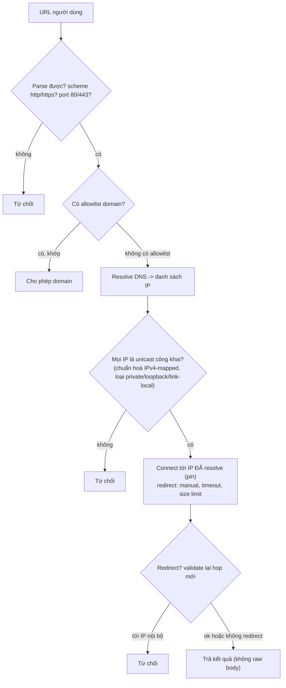
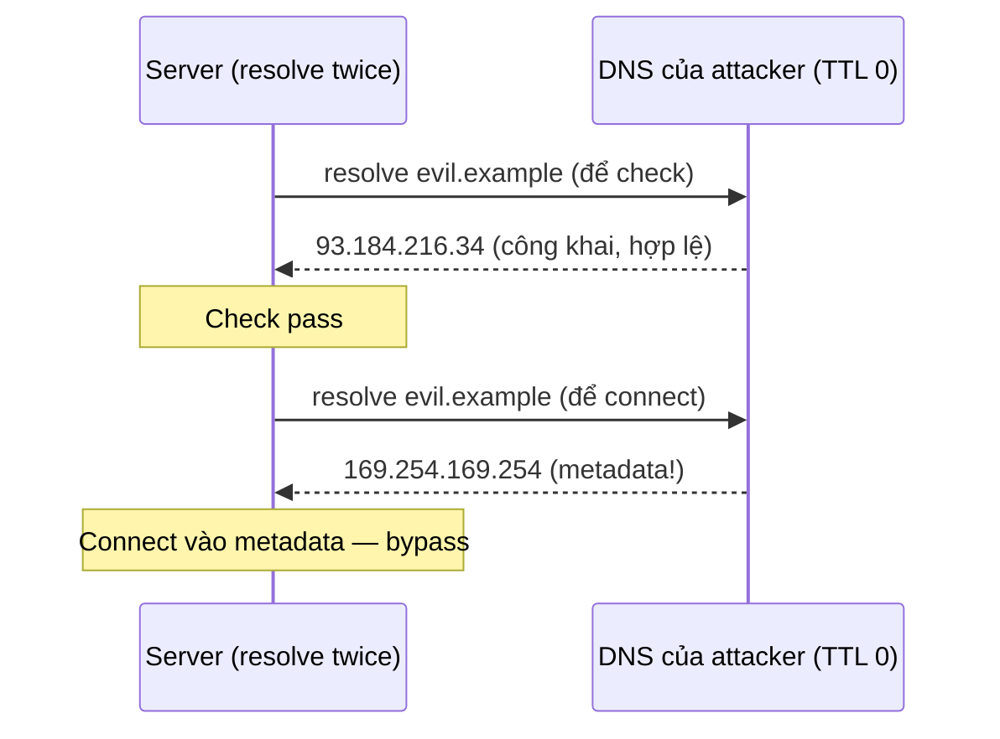

## Bối cảnh & vấn đề

Một tính năng "link preview" nhận URL người dùng dán vào, server fetch URL đó và trả về tiêu đề + một đoạn nội dung. Trông vô hại. Nhưng server chạy trên EC2, và một attacker dán `http://169.254.169.254/latest/meta-data/iam/security-credentials/`. Server ngoan ngoãn gọi vào địa chỉ **cloud metadata**, trả về credential IAM tạm thời của instance. Với credential đó, attacker thao tác tài nguyên AWS trong quyền của role gắn vào instance. Không có gì "bị hack" theo nghĩa thông thường; server chỉ làm đúng việc được bảo: fetch một URL.

Đây là **SSRF (Server-Side Request Forgery)**: server bị lừa gửi request tới URL do attacker chọn. Nó đặc biệt nguy hiểm trên cloud vì mạng nội bộ chứa những thứ tin tưởng request từ bên trong: metadata service (credential), database không auth, Redis/Elasticsearch mở, admin panel nội bộ. OWASP 2025 gộp SSRF vào **A01 Broken Access Control** vì bản chất là truy cập tài nguyên mà người gửi request không có quyền, đi qua server làm trung gian.

Bài này gộp ba lỗ hổng cùng họ "server bị điều khiển để đi tới nơi không nên": SSRF, **open redirect** (gửi user tới nơi không nên), và **file upload** (nhận file độc). Điểm chung: validate chuỗi một cách ngây thơ là chưa đủ. Mọi guard dưới đây chạy thật trong Node 24.

**Interview angle:** "Validate hostname string đủ chưa? Cho hai cách bypass." Đáp: không đủ — IP dạng thập phân/hex/IPv4-mapped IPv6 vượt qua regex, và DNS rebinding đổi IP sau khi check.

## Khái niệm

### SSRF và vì sao cloud làm nó nguy hiểm

SSRF xảy ra ở mọi tính năng server fetch URL do người dùng cung cấp: **webhook** (bạn gọi URL khách hàng đăng ký), **link preview**, **import from URL**, **PDF/HTML renderer** (nhúng ảnh/CSS từ URL), **image proxy**, **SSO/OIDC metadata**. Attacker đổi URL đích để trỏ vào:

- **Cloud metadata**: `169.254.169.254` (AWS/GCP/Azure) → credential, user-data (có thể chứa secret).
- **Mạng nội bộ**: `http://10.0.0.5:6379` (Redis), `http://localhost:9200/_cat/indices` (Elasticsearch), admin panel chỉ nghe nội bộ.
- **Cổng/scheme khác**: `file://`, `gopher://` (một số client), port scan nội bộ.

**Full-read SSRF** (server trả nội dung fetch về cho attacker) nguy hơn **blind SSRF** (chỉ gây side effect). Link preview trả `raw` body là full-read.

### Vì sao validate hostname string là chưa đủ

Một guard "chặn `localhost`, `127.0.0.1`, `169.254.169.254`" bằng so khớp chuỗi thất bại vì cùng một địa chỉ viết được nhiều cách: `127.0.0.1` = `2130706433` (thập phân) = `0x7f.1` (hex) = `[::ffff:127.0.0.1]` (IPv4-mapped IPv6) = `localhost` (DNS). Và **DNS rebinding**: attacker điều khiển DNS của `evil.example` trả về một IP công khai lúc bạn **check**, rồi đổi sang `169.254.169.254` lúc bạn **connect** (TTL 0). Vì vậy guard đúng phải: **resolve DNS**, kiểm tra **IP đã resolve** (chuẩn hoá về dạng chính tắc, gồm IPv4-mapped IPv6), và **connect bằng chính IP đã kiểm tra** (pin IP) để check và connect không lệch nhau.

### Các lớp phòng thủ SSRF

Theo OWASP SSRF Cheat Sheet, xếp lớp: (1) **allowlist** domain/scheme nếu tính năng cho phép (webhook tới domain đã đăng ký); (2) nếu phải cho URL tuỳ ý, **resolve + chặn IP private/loopback/link-local/ULA/IPv4-mapped** và **pin IP**; (3) chỉ `http/https`, chỉ port 80/443; (4) **không follow redirect mù** (`redirect: 'manual'`, validate lại từng hop); (5) timeout + giới hạn kích thước; (6) không trả raw body; (7) chạy fetcher trong **network segment egress-only** không có đường vào nội bộ; (8) bật **IMDSv2** (token qua PUT, hop limit) để metadata khó bị đọc qua SSRF.

### Open redirect

**Open redirect**: endpoint nhận một tham số đích (`?next=...`) và redirect tới đó mà không validate, nên attacker tạo link `https://shop.com/login?next=https://evil.example`. User thấy domain thật `shop.com`, đăng nhập, rồi bị đưa sang trang phishing giống hệt ("phiên hết hạn, nhập lại password"). Nguy hiểm hơn khi kết hợp OAuth: open redirect trên domain đã đăng ký có thể dùng để **rò authorization code/token** nếu redirect_uri validation lỏng. Guard `startsWith('/')` không đủ vì `//evil.example` (protocol-relative) và `/\evil.example` (một số browser chuẩn hoá `\` thành `/`) đều bắt đầu bằng `/`.

### File upload

File upload mở nhiều rủi ro: file thực thi (webshell nếu server chạy file trong thư mục upload), **stored XSS** qua SVG/HTML served từ cùng origin, **path traversal** trong tên file (`../../etc/...`), zip/decompression bomb, file quá lớn (DoS), phát tán malware cho user khác, XXE qua file XML/Office, EXIF lộ vị trí. Controls: giới hạn size/số lượng; validate **magic bytes** (không tin extension/Content-Type); tên file random (UUID); lưu ở object storage **không thực thi**; serve từ **domain riêng** (sandbox domain) với `Content-Disposition: attachment` + `nosniff`; scan AV async; re-encode ảnh (strip EXIF); authorization khi download.

## Cơ chế hoạt động

Luồng của một SSRF-safe fetcher:



Mấu chốt là **pin IP**: check và connect dùng **cùng một** IP, để DNS rebinding (đổi IP giữa hai bước) không có tác dụng. Với Node, làm bằng custom `lookup` trong `http.Agent` trả về IP đã kiểm tra.

Vì sao DNS rebinding bypass "resolve rồi check" thông thường:



Nếu code resolve một lần để check rồi để thư viện HTTP resolve **lại** khi connect, hai lần resolve cho hai IP khác nhau. Pin IP (connect vào đúng IP đã check) đóng khe này.

## Ví dụ thực tế

### Đo thật: SSRF URL guard (Node 24, ipaddr.js)

```ts
async function checkOutboundUrl(raw) {
  const u = new URL(raw);                                     // throws on garbage
  if (!['http:', 'https:'].includes(u.protocol)) return { ok: false, why: `scheme ${u.protocol}` };
  if (u.port && !['80', '443'].includes(u.port)) return { ok: false, why: `port ${u.port}` };
  const host = u.hostname.replace(/^\[|\]$/g, '');
  const addrs = ipaddr.isValid(host) ? [{ address: host }] : await lookup(host, { all: true });
  for (const { address } of addrs) {
    let ip = ipaddr.parse(address);
    if (ip.kind() === 'ipv6' && ip.isIPv4MappedAddress()) ip = ip.toIPv4Address();   // unwrap ::ffff:x
    if (ip.range() !== 'unicast') return { ok: false, why: `${address} is ${ip.range()}` };   // reject private/loopback/linkLocal
  }
  return { ok: true, pinTo: addrs[0].address };               // connect to THIS ip
}
```

```text
https://example.com/a             {"ok":true,"pinTo":"104.20.23.154"}
http://169.254.169.254/...        {"ok":false,"why":"169.254.169.254 is linkLocal"}
http://2130706433/                {"ok":false,"why":"127.0.0.1 is loopback"}       (decimal form)
http://0x7f.1/                    {"ok":false,"why":"127.0.0.1 is loopback"}       (hex form)
http://[::ffff:127.0.0.1]/        {"ok":false,"why":"::ffff:7f00:1 is loopback"}   (IPv4-mapped)
http://localhost/                 {"ok":false,"why":"::1 is loopback"}
http://10.0.0.5:6379/             {"ok":false,"why":"port 6379"}
file:///etc/passwd                {"ok":false,"why":"scheme file:"}
http://192.168.1.1/               {"ok":false,"why":"192.168.1.1 is private"}
```

`ipaddr.js` chuẩn hoá mọi cách viết (thập phân `2130706433`, hex `0x7f.1`, IPv4-mapped `::ffff:127.0.0.1`) về dạng chính tắc rồi phân loại range, nên các bypass dạng chuỗi đều bị bắt. `pinTo` là IP mà fetcher thật sẽ connect vào. Fetcher hoàn chỉnh dùng IP này trong custom `lookup` của agent, đặt `redirect: 'manual'`, timeout và giới hạn byte, và không trả raw body. IMDSv2 là lớp bổ sung ở phía AWS.

### Đo thật: open redirect — startsWith('/') bị bypass

```ts
const APP = 'https://shop.example';
function safeNext(next) {
  try { const u = new URL(next, APP); return u.origin === APP ? u.pathname + u.search + u.hash : '/'; }
  catch { return '/'; }
}
```

```text
input "/orders/7?tab=2"     startsWith('/')=true   new URL origin=https://shop.example   safeNext -> /orders/7?tab=2
input "//evil.example/login" startsWith('/')=true  new URL origin=https://evil.example   safeNext -> /
input "/\\evil.example"      startsWith('/')=true  new URL origin=https://evil.example   safeNext -> /
input "https://evil.example" startsWith('/')=false new URL origin=https://evil.example   safeNext -> /
input "javascript:alert(1)"  startsWith('/')=false new URL origin=null                   safeNext -> /
```

`//evil.example` và `/\evil.example` đều **bắt đầu bằng `/`** nhưng `new URL(next, APP)` cho origin `https://evil.example` — chúng là protocol-relative URL, không phải path nội bộ. Guard đúng không so chuỗi mà **parse rồi so origin** với `APP`. Chỉ các đích cùng origin mới được redirect; còn lại về `/`. Và `res.redirect('//evil.example')` của Express 5 thật sự ghi `Location: //evil.example` (đo thật), nên browser đi tới `evil.example` — đó là lý do không bao giờ redirect thẳng giá trị client. An toàn hơn nữa: lưu `next` trong server session/state, client chỉ gửi một **key** trong allowlist.

### Đo thật: upload — magic bytes thay vì extension

```ts
const SIGS = [['image/png', [0x89, 0x50, 0x4e, 0x47]], ['image/jpeg', [0xff, 0xd8, 0xff]], ['application/pdf', [0x25, 0x50, 0x44, 0x46]]];
const sniff = (buf) => SIGS.find(([, s]) => s.every((b, i) => buf[i] === b))?.[0] ?? 'unknown';
```

```text
avatar.png                 -> image/png
avatar.png (really SVG)    -> unknown     (extension nói .png nhưng nội dung là SVG+script)
cv.pdf                     -> application/pdf
```

File tên `avatar.png` nhưng nội dung là `<svg ...><script>` bị phát hiện là `unknown` (không khớp magic bytes ảnh), nên bị từ chối thay vì được served như ảnh rồi chạy script. Extension và `Content-Type` do client đặt nên không đáng tin. Sau khi xác định kiểu, ảnh nên được **re-encode** (qua sharp/ImageMagick) để vừa strip EXIF vừa loại payload ẩn, lưu với tên UUID ở object storage, và served từ **domain riêng** với `Content-Disposition: attachment` + `X-Content-Type-Options: nosniff`.

## Trade-offs & lựa chọn thay thế

| Tính năng | Cách an toàn nhất | Khi nào chấp nhận lỏng hơn |
| --- | --- | --- |
| Webhook (URL khách đăng ký) | Allowlist domain đã verify ownership | Không bao giờ bỏ qua SSRF guard |
| URL tuỳ ý (import, preview) | Resolve + chặn private + pin IP + egress-only | Nếu chạy trong segment cách ly hoàn toàn khỏi nội bộ |
| Redirect sau login | Key trong allowlist route | Same-origin path (parse + so origin) |
| Upload ảnh | Magic bytes + re-encode + sandbox domain | Ảnh đã qua xử lý tin cậy |
| Metadata AWS | IMDSv2 + hop limit + chặn 169.254.169.254 | — |

Chọn thế nào: nếu tính năng chỉ cần một tập domain cố định (webhook tới đối tác đã đăng ký), **allowlist** là mạnh và đơn giản nhất. Chỉ khi buộc phải cho URL tuỳ ý mới dùng resolve + pin IP, và ngay cả khi đó nên **chạy fetcher trong một network segment egress-only** để kể cả guard sót thì không có đường vào nội bộ (defense in depth). Với redirect, lưu đích phía server và cho client chọn bằng key luôn an toàn hơn validate URL do client gửi.

## Edge cases & failure modes

- **DNS rebinding**: TTL 0, IP đổi giữa check và connect. Pin IP (connect vào IP đã check) mới chặn; resolve hai lần không đủ.
- **Redirect chain**: domain hợp lệ `302` sang `http://169.254.169.254`. `redirect: 'manual'` + validate lại mỗi hop.
- **IPv6 và các dạng viết**: `[::ffff:127.0.0.1]`, `[::1]`, `0x7f.1`, `2130706433`, `017700000001` (octal). Chuẩn hoá bằng thư viện, đừng tự regex.
- **Metadata biến thể**: GCP/Azure dùng `169.254.169.254` với header riêng; chặn range link-local phủ chung.
- **SVG/HTML upload cùng origin**: served từ origin chính thì script chạy như trang bạn; dùng sandbox domain + `attachment`.
- **Path traversal tên file**: `../../` hoặc null byte; luôn đặt tên UUID, không dùng tên client.
- **Zip/decompression bomb**: giải nén có giới hạn kích thước và tỉ lệ nén.
- **Open redirect qua encoding**: `/%2F%2Fevil` được một số layer decode thành `//evil`; parse sau khi decode hoặc dùng allowlist key.

## Pitfalls

- ❌ Validate hostname bằng so khớp chuỗi → ✅ resolve DNS, chuẩn hoá IP (gồm IPv4-mapped), chặn range private/loopback/link-local, pin IP.
- ❌ `fetch(url, { redirect: 'follow' })` cho URL người dùng → ✅ `redirect: 'manual'`, validate lại mỗi hop.
- ❌ Trả raw body của URL fetch → ✅ chỉ trích xuất field cần (title), không trả nguyên nội dung (full-read SSRF).
- ❌ `next.startsWith('/')` cho redirect → ✅ `new URL(next, APP)` và so `origin === APP`, hoặc key allowlist.
- ❌ Tin extension/`Content-Type` của file upload → ✅ magic bytes + re-encode; tên UUID.
- ❌ Serve upload từ origin chính → ✅ sandbox domain + `Content-Disposition: attachment` + `nosniff`.
- ❌ Quên IMDSv2 → ✅ bật IMDSv2 + hop limit; là lớp bổ sung khi SSRF guard sót.

## Tóm tắt

- SSRF: server bị lừa fetch URL nội bộ/metadata (`169.254.169.254` → credential IAM); nguy nhất trên cloud, OWASP 2025 gộp vào A01.
- Validate hostname string không đủ: IP thập phân/hex/IPv4-mapped và DNS rebinding vượt qua (đo thật). Phải resolve, chuẩn hoá IP, chặn range, và **pin IP** khi connect.
- Lớp: allowlist domain nếu được, chỉ http/https + port 80/443, `redirect: manual`, timeout + size limit, không raw body, egress-only segment, IMDSv2.
- Open redirect: `startsWith('/')` bị `//evil.example` và `/\evil.example` bypass; parse rồi so origin, hoặc key allowlist.
- Upload: magic bytes (không tin extension), re-encode ảnh (strip EXIF), tên UUID, serve từ sandbox domain với `attachment` + `nosniff`.
