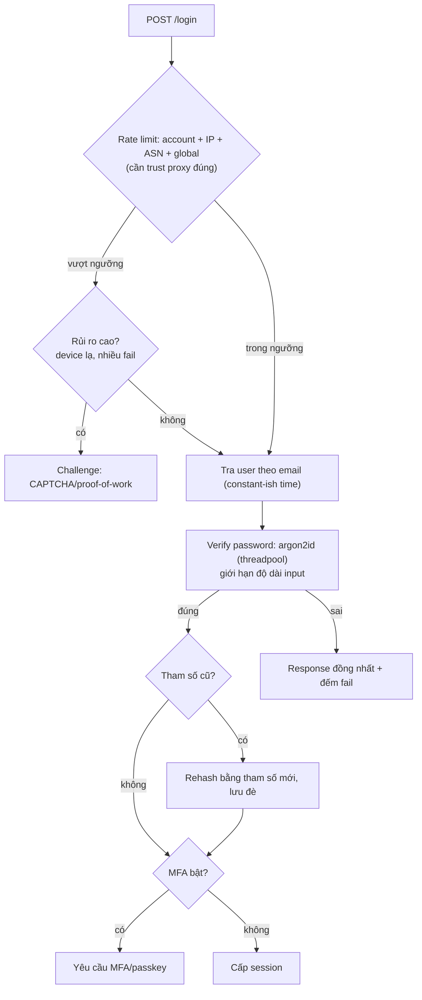
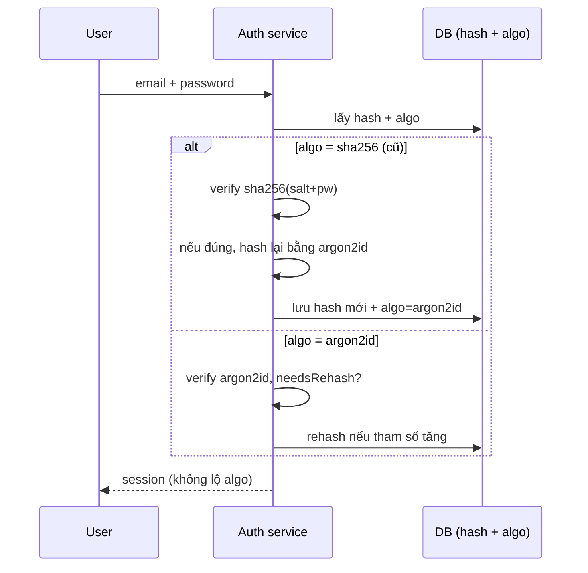

## Bối cảnh & vấn đề

Một công ty bị lộ bảng `users` qua một lỗ SQL injection. May là password được hash. Không may, hash là **SHA-256 kèm salt**. Attacker tải bảng về và chạy một GPU: SHA-256 nhanh tới mức tính được hàng tỷ hash mỗi giây, nên với một danh sách password phổ biến và các biến thể, phần lớn password yếu bị crack trong vài giờ. Salt chỉ ngăn rainbow table và việc crack hàng loạt cùng lúc; nó **không** làm chậm từng lần thử. Hàm hash nhanh là bạn của attacker.

Password là một trong những chỗ mà "đúng về mặt kỹ thuật" (có hash, có salt) vẫn sai nghiêm trọng. Bài này giải thích vì sao password cần **hàm chậm, memory-hard**, cho tham số cụ thể đo thật trên phần cứng thật, rồi mở sang lớp bảo vệ **xung quanh** login: rate limit (và cái bẫy `trust proxy` khiến rate limit vô dụng hoặc chặn nhầm), credential stuffing, MFA, và OAuth account linking — nơi một sai sót cho phép chiếm tài khoản trước khi nạn nhân kịp đăng ký.

**Interview angle:** "Hash password cost tương tác với DoS của login thế nào?" Đáp: hash chậm tốn CPU server; attacker gửi password rất dài hoặc spam login làm cạn CPU → giới hạn độ dài input, rate limit, chạy hash trong threadpool.

## Khái niệm

### Vì sao không dùng hash nhanh cho password

Các hàm hash thông thường (SHA-256, SHA-1, MD5) được thiết kế để **nhanh** — tốt cho checksum và chữ ký, tệ cho password. Nhanh nghĩa là attacker thử được rất nhiều ứng viên mỗi giây. Password cần **password hashing function** được thiết kế để **chậm có kiểm soát** và tốt nhất là **memory-hard** (tốn nhiều RAM, làm GPU/ASIC khó song song hoá):

- **argon2id** (ưu tiên): memory-hard, chống cả GPU lẫn side-channel.
- **scrypt**: memory-hard, có sẵn trong Node core.
- **bcrypt**: lâu đời, ổn định, nhưng có bẫy 72 byte.
- **PBKDF2**: khi cần tuân thủ FIPS; không memory-hard nên cần iteration rất cao.

Thư viện **tự sinh salt** (random per-password) và **nhúng tham số vào chuỗi hash** (`$argon2id$v=19$m=19456,t=2,p=1$salt$hash`), nên có thể tăng cost sau này và rehash.

### Tham số (theo OWASP Password Storage)

- **argon2id**: tối thiểu **m=19 MiB (19456 KiB), t=2, p=1**; hoặc các cặp tương đương (m=47104 t=1, m=12288 t=3...).
- **scrypt**: **N=2^17, r=8, p=1** (hoặc N=2^16 r=8 p=2...).
- **bcrypt**: cost **≥ 10**, càng cao càng tốt trong giới hạn hiệu năng.
- **PBKDF2-HMAC-SHA256**: **600.000** iteration (SHA-512: 210.000).

Nguyên tắc chung: tune cost để một hash mất **vài trăm ms** trên phần cứng production thật (cân bằng giữa an toàn và throughput login). Số cụ thể phụ thuộc máy, nên phải đo — phần dưới đo trên Apple M1.

### Bẫy bcrypt 72 byte

bcrypt chỉ dùng **72 byte đầu** của input; phần sau bị bỏ. Hệ quả: passphrase dài hoặc chứa ký tự Unicode (mỗi ký tự nhiều byte) bị cắt, nên hai password khác nhau ở phần sau byte 72 lại có **cùng** hash. Một số implementation còn dừng ở null byte. Nếu muốn **pre-hash** (SHA để vượt giới hạn độ dài), phải **base64-encode** kết quả trước khi đưa vào bcrypt để tránh null byte; OWASP khuyến nghị `bcrypt(base64(hmac-sha384(password, pepper)), salt, cost)`. argon2id và scrypt không có giới hạn này.

### Pepper và rehash khi login

**Pepper** là một secret **không** lưu cùng DB (nằm trong KMS/env), thêm vào trước khi hash; nếu chỉ DB bị lộ mà pepper không lộ, hash khó crack hơn. Pepper là tuỳ chọn, và phải xoay được. **Rehash khi login**: khi tham số chuẩn tăng (hoặc chuyển thuật toán), lần user đăng nhập thành công, verify bằng tham số cũ rồi hash lại bằng tham số mới và lưu đè. Đây cũng là cách **migrate SHA-256 cũ sang argon2id không cần buộc reset**: lưu `algo` của mỗi hash; khi user login, verify theo algo cũ, nếu đúng thì rehash bằng argon2id. (Một cách khác là hash-of-hash: `argon2(sha256(pw))` cho mọi bản ghi cũ ngay, rồi xử lý dần.)

### Rate limit nhiều chiều và trust proxy

Chống brute force/credential stuffing cần rate limit **nhiều chiều**: per account, per IP, per IP range/ASN, và global; backoff tăng dần thay vì **khoá cứng** account (khoá cứng cho attacker DoS nạn nhân bằng cách cố tình nhập sai). Điều kiện tiên quyết: biết đúng IP client. Sau một reverse proxy/ALB, IP thật nằm trong `X-Forwarded-For`, nhưng header này **client gửi được**. Express dùng setting `trust proxy` để quyết định tin bao nhiêu hop; sai setting dẫn tới hai lỗi đối nghịch: không trust → mọi user chung IP của LB (chặn nhầm cả hệ thống); trust `true` → lấy IP ngoài cùng của `X-Forwarded-For` do client đặt (attacker đổi header mỗi request = bucket mới, bypass). Đúng là trust đúng **số hop** (`trust proxy = 1` cho một ALB).

### Credential stuffing và MFA

**Credential stuffing**: attacker dùng danh sách username/password rò rỉ từ site khác (vì người dùng tái sử dụng password) để thử đăng nhập hàng loạt. Khác brute force (đoán password của một account), credential stuffing thử nhiều account với password "thật" từ breach. Dấu hiệu: tỉ lệ fail cao, nhiều username khác nhau, user agent đồng dạng, từ nhiều IP (residential proxy). Phòng: breached-password check (HIBP k-anonymity khi đăng ký/đổi), rate limit đa chiều, challenge có điều kiện (CAPTCHA/proof-of-work) khi rủi ro cao, và gốc rễ là **MFA/passkey** (password đúng vẫn không đủ). Response đồng nhất (không lộ "email không tồn tại") và thời gian phản hồi gần giống để chống user enumeration.

### OAuth account linking

Thêm "đăng nhập bằng Google" cạnh email/password mở một lỗ nếu linking sai. Định danh user của Google là **`sub`** (subject id ổn định), **không phải email** (email đổi được, và "email_verified" có thể false). Lỗ **pre-account takeover**: attacker đăng ký trước bằng email nạn nhân (chưa verify); khi nạn nhân login bằng Google với cùng email và hệ thống **auto-link theo email**, tài khoản nạn nhân bị gộp vào tài khoản attacker đã tạo. An toàn: lưu `user_identities(provider, provider_sub, user_id)`, chỉ auto-link khi `email_verified = true` và có chính sách rõ, tốt hơn là yêu cầu user đang đăng nhập (hoặc xác nhận password/OTP) để link; verify ID token đầy đủ (`iss`, `aud`, `exp`, chữ ký, `nonce`), `state` chống CSRF; multi-tenant vẫn cần membership.

## Cơ chế hoạt động

Một login endpoint phòng thủ nhiều lớp, theo thứ tự request đi qua:



Luồng rehash khi login (migrate không cần reset):



## Ví dụ thực tế

### Đo thật: chi phí hash trên Apple M1 (Node 24)

```text
Apple M1 | Node v24.21.0
sha256 (1 CPU core, JS loop)                  940,726 hashes/s
argon2id m=19MiB t=2 p=1 (OWASP min)             27.5 ms/hash
argon2id m=64MiB t=3 p=1                         144.2 ms/hash
bcrypt cost 10                                    71.9 ms/hash
bcrypt cost 12                                   307.0 ms/hash
scrypt N=2^17 r=8 p=1                            301.9 ms/hash
PBKDF2-HMAC-SHA256 600k                           77.0 ms/hash

encoded hash: $argon2id$v=19$m=19456,p=1,t=2$4xFX...$r75/...
verify ok: true | needsRehash vs m=64MiB,t=3: true
```

Con số nói lên tất cả: một core tính **~940.000 SHA-256/giây** (và một GPU tính nhanh hơn hàng nghìn lần), trong khi một hash argon2id OWASP-min mất **27,5 ms** — chênh lệch nhiều bậc độ lớn, đó là toàn bộ ý nghĩa của "slow hash". bcrypt cost 10 (~72 ms) và cost 12 (~307 ms) cho thấy mỗi +1 cost gấp đôi thời gian. `needsRehash` trả `true` khi hash cũ (m=19MiB) so với chuẩn mới (m=64MiB), đúng tín hiệu để rehash khi login. Chuỗi hash tự chứa tham số (`m=19456,t=2,p=1`) và salt, nên không cần lưu riêng.

### Đo thật: bẫy bcrypt 72 byte

```text
bcrypt: hash(72 x "a" + suffix1) verifies "72 x a + DIFFERENT": true
Vietnamese passphrase chars = 72 UTF-8 bytes = 104
```

Hash của `("a"×72 + "SECRET-SUFFIX-1")` **verify đúng** với `("a"×72 + "DIFFERENT")`: bcrypt bỏ mọi byte sau 72, nên phần suffix không ảnh hưởng. Và một passphrase tiếng Việt 72 **ký tự** là 104 **byte** UTF-8, tức phần sau byte 72 bị cắt. Với passphrase dài hoặc Unicode, dùng argon2id/scrypt, hoặc pre-hash `base64(hmac-sha384(pw))` trước bcrypt.

### Đo thật: trust proxy sau ALB

Một ALB giả lập nối thêm IP peer vào `X-Forwarded-For` (như AWS ALB), gửi 5 request mỗi lần đổi `X-Forwarded-For` do "client" đặt, với `rateLimit({ limit: 3 })`:

```text
trust proxy = false -> ::1 | ::1 | ::1 | 429 | 429
   (ValidationError: X-Forwarded-For set but trust proxy is false)
trust proxy = true  -> 198.51.100.0 | 198.51.100.1 | 198.51.100.2 | 198.51.100.3 | 198.51.100.4
   (ValidationError: trust proxy is true -> trivially bypass IP rate limiting)
trust proxy = 1     -> 203.0.113.7 | 203.0.113.7 | 203.0.113.7 | 429 | 429
```

Ba hành vi. `trust proxy = false`: `req.ip` là IP của LB (`::1`), nên **mọi user chung một bucket** — request thứ 4 bị 429 dù đến từ "IP" khác (chặn nhầm cả hệ thống). `trust proxy = true`: Express lấy IP ngoài cùng bên trái của `X-Forwarded-For` do **client** đặt, nên mỗi request là một IP mới và **không bao giờ** bị rate limit (bypass hoàn toàn). `trust proxy = 1`: Express bỏ qua đúng một hop (ALB) và lấy IP peer thật (`203.0.113.7`), nên rate limit hoạt động đúng (429 từ request thứ 4). express-rate-limit 8 thậm chí **cảnh báo** cả hai cấu hình sai (`ERR_ERL_UNEXPECTED_X_FORWARDED_FOR`, `ERR_ERL_PERMISSIVE_TRUST_PROXY`). Đây là câu hỏi gotcha của track; đáp án là trust đúng số hop, hoặc danh sách subnet proxy, và key theo nhiều chiều (account, token, IP).

Lưu ý IPv6: một "IP" IPv6 thực ra là một /64 (hoặc /56) cấp cho một người dùng, nên rate limit theo IPv6 đơn lẻ vô dụng (attacker có 2^64 địa chỉ); key theo /64 prefix.

### Credential stuffing lúc 2 giờ sáng (scenario)

Login fail rate nhảy từ 2% lên 85%, 30k attempt/phút từ hàng nghìn IP:

- **Đêm nay**: xác nhận là stuffing (nhiều username khác nhau, ít lặp, user agent đồng dạng); bật challenge theo rủi ro; rate limit theo ASN/IP range + global; chặn ở WAF/CDN bot management; đảm bảo không làm sập login của user thật; **theo dõi số login thành công bất thường** (tài khoản đã bị chiếm).
- **Tuần này**: với account đăng nhập thành công từ traffic tấn công → buộc reset password/revoke session, notify user; bật/khuyến khích MFA, passkey; breached-password check; device/IP anomaly detection; review response không lộ user tồn tại; postmortem.
- Câu khó "phân biệt login thành công thật vs của attacker": dựa vào device fingerprint mới, vị trí/ASN bất thường, hành vi sau login (đổi email/password ngay), và so với lịch sử của chính account đó.

## Trade-offs & lựa chọn thay thế

| Quyết định | Phương án A | Phương án B | Ghi chú |
| --- | --- | --- | --- |
| Password hash | argon2id | bcrypt | argon2id memory-hard; bcrypt ổn nhưng bẫy 72 byte |
| | | PBKDF2 | chỉ khi cần FIPS; iteration rất cao |
| Chống brute force | Backoff tăng dần | Khoá cứng account | Khoá cứng = attacker DoS nạn nhân |
| Chống bot login | MFA/passkey (gốc) | CAPTCHA (lớp) | MFA mạnh hơn; CAPTCHA chặn bot tự động, không chặn farm người |
| MFA UX | Bắt buộc mọi login | Adaptive/risk-based | Adaptive giảm friction, bắt buộc cho admin/seller |
| Rate limit key | Nhiều chiều (account+IP+ASN) | Chỉ IP | IP đơn dễ bypass qua residential proxy |
| OAuth link | Theo `sub` + xác nhận | Auto-link theo email | Auto-link theo email → pre-account takeover |

Về CAPTCHA (reCAPTCHA): nó đánh giá "request này có phải người không" từng lượt, còn rate limit chặn khối lượng; cần cả hai vì farm người thật qua mặt CAPTCHA nhưng vướng rate limit, bot chậm rãi qua mặt rate limit nhưng vướng CAPTCHA. reCAPTCHA free tới **10.000 assessment/tháng** ở tier Essentials (verify; tài liệu Google đã đổi mô hình pricing — Notion ghi "1 triệu/tháng" là theo mô hình cũ, xem Notion corrections). CAPTCHA không thay rate limit/MFA; nó là một lớp. Về MFA vs conversion: phương án giữa là **adaptive MFA** (chỉ challenge khi device lạ, hành động nhạy cảm), passkey (nhanh hơn OTP), bắt buộc cho admin/tenant owner, tuỳ chọn cho buyer; nêu rủi ro bằng tiền (account takeover → fraud, chargeback, support).

## Edge cases & failure modes

- **Hash DoS**: attacker gửi password rất dài (1 MB) để tốn CPU hash. Giới hạn độ dài input (ví dụ 128 byte) **trước** khi hash; chạy hash trong threadpool (argon2 native) để không block event loop.
- **Khoá cứng bị lợi dụng**: attacker cố tình nhập sai password của nạn nhân để khoá họ. Dùng backoff + risk-based, không khoá vĩnh viễn theo account.
- **IPv6 rate limit vô dụng theo địa chỉ đơn**: key theo /64 prefix.
- **trust proxy sai**: chặn nhầm cả hệ thống (false) hoặc bypass hoàn toàn (true); đo thật ở trên.
- **User enumeration**: thời gian phản hồi khác khi user tồn tại (có hash) vs không (không hash); luôn chạy một hash giả để thời gian gần bằng nhau.
- **OAuth email đổi**: user đổi email Google → nếu link theo email thì mất liên kết; link theo `sub` bền vững.
- **Breached password ngay sau khi đổi**: password mới nằm trong breach mới; check tại thời điểm đặt và định kỳ.
- **MFA bypass qua "remember device" quá rộng**: token nhớ device bị đánh cắp bỏ qua MFA lâu dài; giới hạn thời gian và gắn device.

## Pitfalls

- ❌ Hash password bằng SHA-256/MD5 (kể cả có salt) → ✅ argon2id/scrypt/bcrypt; salt không làm chậm từng lần thử.
- ❌ Dùng bcrypt cho passphrase dài/Unicode không để ý 72 byte → ✅ argon2id, hoặc pre-hash `base64(hmac-sha384(pw))`.
- ❌ Khoá cứng account sau N lần sai → ✅ backoff + rate limit đa chiều; khoá cứng để attacker DoS nạn nhân.
- ❌ `app.set('trust proxy', true)` sau ALB → ✅ trust đúng số hop (`1`) hoặc subnet proxy; `true` cho client spoof IP.
- ❌ Rate limit chỉ theo IP → ✅ account + IP + ASN + global; IPv6 theo /64.
- ❌ Auto-link OAuth theo email → ✅ link theo `sub`, yêu cầu đang đăng nhập/OTP; chống pre-account takeover.
- ❌ Hash password không giới hạn độ dài input → ✅ giới hạn trước khi hash, chạy trong threadpool (chống DoS).

## Tóm tắt

- SHA-256 nhanh (~940k hash/s một core) nên không dùng cho password; salt chỉ chặn rainbow table, không làm chậm từng lần thử.
- Dùng argon2id (m=19MiB t=2 p=1 tối thiểu), scrypt (N=2^17), bcrypt (cost ≥10, bẫy 72 byte), PBKDF2 600k (FIPS); tune để ~vài trăm ms; rehash khi login để migrate không cần reset.
- bcrypt chỉ dùng 72 byte đầu (đo thật: suffix khác vẫn verify); passphrase Unicode dễ vượt 72 byte.
- Rate limit đa chiều + trust proxy đúng số hop; `false` chặn nhầm cả hệ thống, `true` cho client spoof IP (đo thật sau ALB).
- Credential stuffing: breached-password check, rate limit theo ASN, challenge có điều kiện, MFA/passkey là gốc; theo dõi login *thành công* bất thường.
- OAuth link theo `sub` không theo email, verify ID token đầy đủ, chống pre-account takeover.
