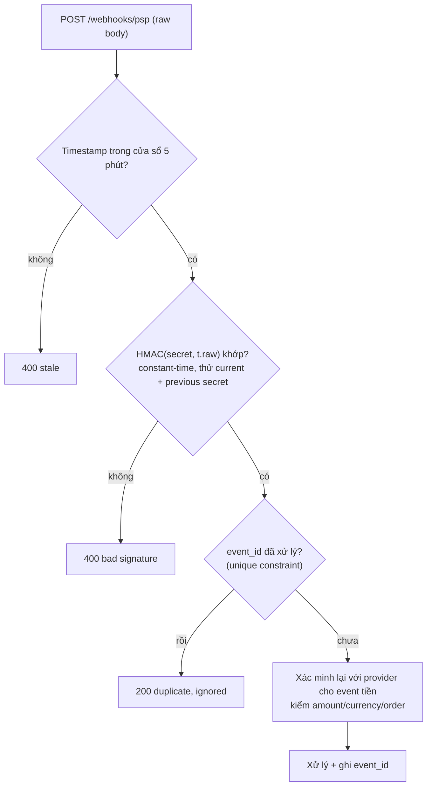
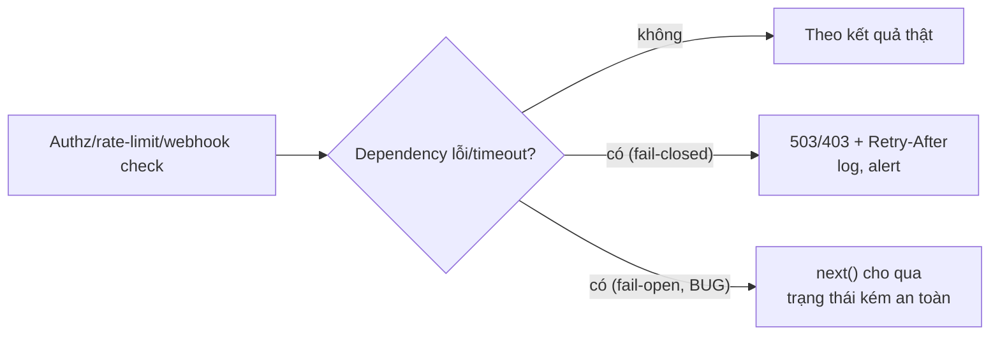

## Bối cảnh & vấn đề

Một API Node.js chạy ổn định nhiều tháng, rồi một ngày latency p99 nhảy vọt và health check bắt đầu fail — không có traffic tăng đột biến, không có deploy. Nguyên nhân: một endpoint validate "tên hiển thị" bằng một regex tự viết `^(\w+\s?)*$`. Một người dùng (hoặc bot) gửi một chuỗi 30 ký tự không khớp, và regex rơi vào **backtracking mũ**: nó thử hàng tỷ cách ghép, tốn hàng giây CPU, và vì Node chạy một luồng, **event loop bị chặn** — cả process ngừng phục vụ mọi request khác trong lúc đó.

Đây là **ReDoS (Regular Expression Denial of Service)**, một trường hợp của **API4:2023 Unrestricted Resource Consumption**: một request nhỏ tiêu tốn tài nguyên khổng lồ. Bài này đi qua các "lỗ tài nguyên" của một API Node (ReDoS, body/page size, chi phí bên thứ ba), rồi sang ba chủ đề hardening khác: webhook (chống replay bằng timestamp + dedupe), timing attack (so sánh constant-time), và **fail-open** — khi lỗi đẩy hệ thống vào trạng thái kém an toàn (OWASP 2025 thêm hẳn A10 Mishandling of Exceptional Conditions cho nhóm này). Kết thúc bằng checklist cho API public. Mọi thứ đo thật trong Node 24.

**Interview angle:** "Tìm ReDoS trong production khi triệu chứng chỉ là event loop lag thế nào?" Đáp: đo event loop delay (`perf_hooks.monitorEventLoopDelay`), lấy CPU profile lúc spike, tìm regex trong stack, map về input.

## Khái niệm

### ReDoS và event loop

Regex "nguy hiểm" có **backtracking thảm hoạ**: các nhóm lồng nhau với lượng từ không xác định (`(a+)+`, `(\w+\s?)*`, nhiều `.*`) khiến engine thử số cách ghép tăng theo hàm mũ với độ dài input, khi input *gần khớp nhưng không khớp*. Node chạy JavaScript trên **một luồng**, nên một regex chạy 2 giây chặn **toàn bộ** event loop: mọi request khác, timer, I/O callback đều phải chờ. Một request độc làm sập cả service. ReDoS hay nằm ở validate email/URL/phone tự viết và ở regex xử lý input người dùng.

### Các "lỗ tài nguyên" khác

ReDoS chỉ là một dạng. Danh sách cần kiểm cho API4: JSON body khổng lồ (thiếu `limit`), page size không giới hạn (`?limit=1000000`), GraphQL query depth/complexity, upload không giới hạn, zip/decompression bomb, `argon2`/`bcrypt` với password 1 MB, `Array(n)` từ input, và **chi phí bên thứ ba** (mỗi request gọi SMS/email/AI tốn tiền — không quota thì attacker đốt tiền của bạn). Nguyên tắc: **giới hạn ở mọi chiều** (size, count, depth, time, cost), và rate limit + quota theo tenant.

### Webhook và replay

Một webhook ký bằng HMAC chứng minh **nguồn gốc + toàn vẹn** (ai có secret mới ký được, payload không bị sửa), nhưng **không** chứng minh **thời điểm/duy nhất**. Attacker bắt được một webhook "payment succeeded" hợp lệ và **gửi lại** (replay) nhiều lần; chữ ký vẫn đúng. Thiếu ba thứ: **timestamp** trong phần được ký + từ chối ngoài cửa sổ (ví dụ 5 phút, như Stripe `t=...,v1=...`); **dedupe theo event id** (unique constraint → idempotent); và với event quan trọng, **xác minh lại với provider** (gọi API lấy payment theo id, kiểm số tiền/currency/order khớp). Chữ ký phải verify trên **raw body** (không phải JSON đã parse rồi serialize lại, vì thứ tự field và khoảng trắng đổi làm chữ ký sai), và so sánh **constant-time**.

### Timing attack và constant-time compare

So sánh secret bằng `===` dừng ở byte khác đầu tiên, nên thời gian phản hồi lộ "tiền tố đúng tới đâu" — qua nhiều mẫu, attacker đoán dần secret. Chỗ cần **constant-time**: webhook HMAC signature, API key, CSRF token, reset-password token, OTP. Dùng `crypto.timingSafeEqual`, vốn yêu cầu **hai buffer cùng độ dài** (nếu khác độ dài nó ném lỗi — nên so sánh *hash* của hai giá trị, hoặc kiểm độ dài trước). Timing còn ở mức logic: login trả nhanh khi user không tồn tại (không hash) → user enumeration; chạy một hash giả để thời gian gần bằng nhau. Tốt hơn nữa: lưu **hash** của token (như password) và tra theo hash.

### Fail-open vs fail-closed

OWASP 2025 thêm **A10 Mishandling of Exceptional Conditions**: hệ thống gặp lỗi rồi rơi vào trạng thái **kém an toàn** thay vì an toàn. Ví dụ fail-open trong Node: authorization service timeout → middleware `catch` rồi `next()` (cho qua); rate limiter Redis lỗi → bỏ qua cho mọi endpoint kể cả login/OTP; lỗi verify webhook signature bị nuốt, vẫn xử lý; feature flag service down → default bật tính năng beta cho mọi người; stack trace/SQL error trả về client. Nguyên tắc: **deny by default** khi quyết định bảo mật không chắc chắn; xử lý lỗi tập trung (trả body generic, log chi tiết server-side); test đường lỗi (fault injection). Fail-open đôi khi **đúng** (rate limiter của một read API không nhạy cảm nên ưu tiên availability), nhưng phải là **quyết định có chủ đích**, ghi lại, không phải một `catch` vô tình.

## Cơ chế hoạt động

Webhook verify chống cả giả mạo lẫn replay:



Fail-open vs fail-closed khi một dependency bảo mật lỗi:



## Ví dụ thực tế

### Đo thật: backtracking mũ chặn event loop

```ts
const slow = /^(\w+\s?)*$/;       // catastrophic backtracking
const fixed = /^\w+(?:\s\w+)*$/;  // linear, same intent
```

```text
n=18 1.7 ms
n=20 6.8 ms
n=22 28.0 ms
n=24 109.0 ms
n=26 450.1 ms
n=28 1720.3 ms

/^\w+(?:\s\w+)*$/  (fixed)  <0.05 ms cho mọi n

during a 307 ms regex window, a 10 ms timer fired 1 times
```

Thời gian của regex xấu **gấp đôi mỗi khi input dài thêm 2 ký tự** (6.8 → 28 → 109 → 450 → 1720 ms): đó là hàm mũ. Một input 28 ký tự đã chặn 1,7 giây. Dòng cuối chứng minh event loop bị chặn: trong cửa sổ 307 ms, một timer lẽ ra chạy mỗi 10 ms chỉ chạy được **1 lần** thay vì ~30 lần. Regex `fixed` (dùng non-capturing group có cấu trúc rõ) cho cùng ý nghĩa nhưng chạy tuyến tính, <0,05 ms. Fix: viết lại regex không backtracking, dùng validator đã kiểm chứng (zod `.email()`), lint (`eslint-plugin-regexp`/`safe-regex`), hoặc engine tuyến tính. V8 có engine không backtracking (experimental):

```text
--enable-experimental-regexp-engine, flag /l:  n=5000 chạy 0.43 ms
```

Với flag `/l`, cùng pattern trên input 5000 ký tự chạy 0,43 ms — engine tuyến tính không bao giờ backtrack (đánh đổi: không hỗ trợ backreference/lookbehind). Dùng cho pattern đến từ người dùng.

### Đo thật: webhook với timestamp + dedupe (Postgres 17)

```ts
const SECRETS = ['whsec_current', 'whsec_previous'];       // rotation window
function verify(header, raw, now = Math.floor(Date.now() / 1000)) {
  const { t, v1 } = parse(header);
  if (Math.abs(now - Number(t)) > 300) return 'stale timestamp';
  const given = Buffer.from(v1 ?? '', 'hex');
  const ok = SECRETS.some(s => { const exp = createHmac('sha256', s).update(`${t}.${raw}`).digest(); return given.length === exp.length && timingSafeEqual(given, exp); });
  return ok ? 'ok' : 'bad signature';
}
// dedupe: INSERT ... ON CONFLICT DO NOTHING on event_id (PRIMARY KEY)
```

```text
fresh, signed                     200 {"status":"processed"}
same event again (retry/replay)   200 {"status":"duplicate, ignored"}
captured last month               400 {"error":"stale timestamp"}
re-serialized JSON (spaces)       400 {"error":"bad signature"}
signed with previous secret       200 {"status":"processed"}
```

Năm trường hợp: event mới được xử lý; gửi lại cùng event id bị dedupe (idempotent, không xử lý hai lần); webhook bắt từ tháng trước bị từ chối vì timestamp ngoài cửa sổ (chống replay cũ); body serialize lại (thêm khoảng trắng) làm chữ ký sai — đó là lý do verify trên **raw body**, không parse rồi stringify; và event ký bằng secret cũ (previous) vẫn chấp nhận trong cửa sổ rotation. Lưu ý trong Express phải lấy raw body (`express.raw()`) **trước** khi `express.json()` parse.

### Đo thật: timingSafeEqual cần cùng độ dài

```text
timingSafeEqual(Buffer('abc'), Buffer('abcd'))
  -> ERR_CRYPTO_TIMING_SAFE_EQUAL_LENGTH: Input buffers must have the same byte length
```

`timingSafeEqual` ném lỗi khi độ dài khác nhau (và chính độ dài đã là một kênh rò). Vì vậy kiểm `given.length === expected.length` trước (như trong webhook verify), hoặc so sánh **hash** của hai giá trị (luôn cùng độ dài). Với reset-password token: lưu `sha256(token)` trong DB và tra theo hash, vừa constant-time vừa không lộ token nếu DB bị đọc.

### Đo thật: fail-open vs fail-closed

Một policy service luôn timeout; hai middleware xử lý khác nhau:

```ts
const authzFailOpen = async (req, res, next) => {
  try { if (!(await policyService.check(req))) return res.status(403).end(); next(); }
  catch (err) { next(); }                                    // BUG: swallow -> allow
};
const authzFailClosed = async (req, res, next) => {
  try { if (!(await policyService.check(req))) return res.status(403).end(); next(); }
  catch (err) { res.status(503).set('Retry-After', '5').json({ error: 'authorization unavailable' }); }
};
```

```text
[fail-open]   swallowed: ETIMEDOUT policy-svc
DELETE /a/products/9 -> 200 {"deleted":true}       (cho qua dù không authorize được!)
[fail-closed] denied: ETIMEDOUT policy-svc
DELETE /b/products/9 -> 503 {"error":"authorization unavailable"}

GET /boom -> 500 {"error":"internal_error","requestId":"f7de7b9d"}
   (server log: relation "prodcuts" does not exist at character 15)
```

Cùng lỗi timeout, fail-open **xoá sản phẩm** (200) vì nuốt exception rồi `next()`; fail-closed từ chối (503 + `Retry-After`). Và `GET /boom` cho thấy central error handler: client nhận body generic (`internal_error` + requestId) trong khi chi tiết SQL error chỉ vào **log server** — không trả stack trace/SQL ra ngoài (tránh lộ cấu trúc, một dạng A10).

### Checklist API public cho đối tác

Từ edge tới DB:

- **Edge**: TLS 1.2+ only, HSTS, WAF, DDoS protection, request size limit.
- **AuthN**: OAuth 2.0 client credentials hoặc API key có scope + **hash lưu DB** + rotation; mTLS cho đối tác lớn.
- **AuthZ**: scope per endpoint (BFLA), object-level + tenant (BOLA), deny by default.
- **Input**: schema validation strict (OpenAPI/zod), giới hạn page size/array length, content-type check.
- **Output**: response DTO, không lộ internal id/stack trace, error format thống nhất.
- **Abuse**: rate limit + quota per client, idempotency key cho POST, business-flow protection.
- **Ops**: inventory API/version (API9), deprecation policy, audit log, alerting, secret scanning, dependency scanning, pentest trước launch.
- **Outbound**: webhook ký HMAC + timestamp, SSRF-safe.

Ba thứ không launch mà thiếu: authentication + authorization đúng (BOLA là #1), rate limit/quota (chống abuse và DoS), và input validation (chặn cả lớp injection). Thiếu một trong ba là lỗ hổng có thể khai thác ngay.

## Trade-offs & lựa chọn thay thế

| Vấn đề | Cách đúng | Đánh đổi |
| --- | --- | --- |
| Regex từ input | Pattern tuyến tính / validator đã kiểm chứng / engine /l | /l mất backreference/lookbehind |
| Body/page size | Giới hạn cứng + pagination keyset | Cần client xử lý paging |
| Webhook replay | timestamp + dedupe + re-verify provider | Thêm bảng event, gọi API |
| So sánh secret | `timingSafeEqual` / so hash | Phải lo độ dài bằng nhau |
| Rate limiter lỗi | Fail-closed cho login/OTP | Có thể chặn nhầm khi Redis chập chờn |
| | Fail-open cho read API | Mất bảo vệ tạm thời khi down |
| Lỗi nội bộ | Body generic + log chi tiết | Khó debug từ client (dùng requestId) |

Quyết định fail-open/closed phải **tường minh** theo endpoint: login, OTP, thanh toán, thay đổi quyền → fail-closed; read API không nhạy cảm, recommendation, analytics → fail-open + alert là chấp nhận được. Ghi quyết định này ở code (comment/config) để không ai "sửa nhầm" thành ngược lại. Với webhook, Notion ghi đúng khi nói idempotency key + nonce + timestamp + Redis dedupe; bổ sung là verify trên raw body và re-verify với provider cho event tiền.

## Edge cases & failure modes

- **ReDoS ẩn trong thư viện**: không chỉ regex của bạn; một dependency validate input bằng regex xấu. `npm audit` và kiểm thư viện parse.
- **Event loop lag không rõ nguồn**: dùng `monitorEventLoopDelay` + CPU profile; ReDoS hiện ra là thời gian trong regex.
- **Webhook raw body bị mất**: `express.json()` chạy trước làm mất raw body → chữ ký luôn sai; cấu hình `express.raw()` cho route webhook.
- **Dedupe không atomic**: hai webhook trùng tới cùng lúc; dùng unique constraint + `ON CONFLICT`, không "check rồi insert".
- **timingSafeEqual ném lỗi độ dài**: không bọc try/catch hoặc không kiểm độ dài → crash hoặc rò qua error.
- **Fail-open vô tình**: `catch { next() }` ở middleware auth; hoặc rate limiter `catch` rồi bỏ qua. Review mọi `catch` trong đường bảo mật.
- **Stack trace ra client**: handler mặc định của framework trả lỗi chi tiết ở dev mode bật nhầm trên prod.
- **Quota bên thứ ba**: không giới hạn gọi SMS/AI → attacker đốt tiền; quota theo tenant + alert chi phí.

## Pitfalls

- ❌ Validate bằng regex tự viết có nhóm lồng + lượng từ → ✅ pattern tuyến tính/validator đã kiểm chứng; ReDoS chặn cả event loop.
- ❌ Không giới hạn body/page size/depth → ✅ giới hạn mọi chiều + quota theo tenant.
- ❌ Webhook chỉ verify chữ ký → ✅ thêm timestamp (cửa sổ) + dedupe event id + re-verify provider cho event tiền.
- ❌ Verify chữ ký trên JSON đã parse lại → ✅ verify trên raw body.
- ❌ So sánh token bằng `===` → ✅ `timingSafeEqual` (cùng độ dài) hoặc so hash; lưu hash của token.
- ❌ `catch { next() }` trong đường authz/rate-limit → ✅ fail-closed cho quyết định bảo mật; fail-open phải tường minh.
- ❌ Trả stack trace/SQL error ra client → ✅ body generic + requestId, log chi tiết server-side.

## Tóm tắt

- ReDoS: regex backtracking mũ chặn event loop một luồng (đo thật: n=28 → 1,7 s, timer 10 ms chỉ chạy 1 lần); dùng pattern tuyến tính/validator/engine /l.
- API4 Resource Consumption: giới hạn body, page size, depth, upload, và chi phí bên thứ ba ở mọi chiều.
- Webhook chống replay: timestamp trong cửa sổ + dedupe event id + verify raw body + re-verify provider; hỗ trợ rotation hai secret (đo thật).
- Timing: `timingSafeEqual` cần cùng độ dài (so hash là an toàn); chạy hash giả chống user enumeration; lưu hash của token.
- A10 Fail-open: `catch { next() }` cho qua khi authz/rate-limit lỗi (đo thật xoá sản phẩm); deny by default, fail-open phải tường minh, body lỗi generic + log server.
- API public: auth + authz đúng, rate limit/quota, input validation là ba thứ không thể thiếu khi launch.
