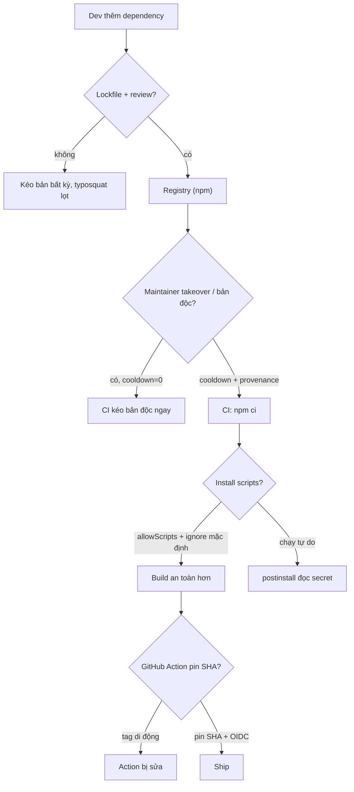
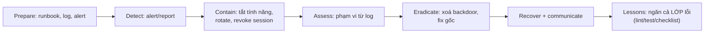

## Bối cảnh & vấn đề

Một package nhỏ mà dự án của bạn phụ thuộc gián tiếp (qua 4 lớp dependency) bị compromise: maintainer bị lừa mất token npm, attacker publish một bản vá nhỏ có thêm một `postinstall` script đọc biến môi trường và gửi về server của họ. Mọi CI chạy `npm install` trong vài giờ sau đó — gồm cả CI của bạn — thực thi script đó và gửi đi các secret trong môi trường build. Bạn không viết dòng code nào sai; bạn chỉ `npm install` như mọi ngày. Năm 2025 chứng kiến nhiều vụ như vậy trên npm, có vụ worm tự lan qua chính token npm của nạn nhân.

Đây là **Software Supply Chain Failures**, được OWASP 2025 nâng thành **A03** (mở rộng từ "Vulnerable and Outdated Components") vì phần lớn code chạy trong production của bạn là code **người khác viết**. Bài này đi qua các kiểu tấn công supply chain và biện pháp cụ thể trong CI/repo, rồi sang hai chủ đề "sau sự cố": **security logging** (ghi đủ để điều tra mà không lộ secret/PII) và **incident response** (cách phản ứng và cách kể lại trong phỏng vấn). Các biện pháp npm chạy thật trên npm 11.

**Interview angle:** "Một package bạn phụ thuộc bị compromise 2 giờ trước. Làm gì ngay?" Đáp: xác định có kéo bản độc chưa (lockfile diff), pin/revert về version an toàn, rotate secret CI có thể đã lộ, kiểm tra postinstall, thông báo.

## Khái niệm

### Các kiểu tấn công supply chain

- **Typosquatting**: package tên gần giống (`expresss`, `lodahs`) để lừa cài nhầm.
- **Maintainer account takeover**: chiếm tài khoản maintainer (phishing, token lộ) rồi publish bản độc của package thật — nguy hiểm nhất vì người dùng tin package đó.
- **Install scripts** (`preinstall`/`postinstall`): chạy **tự động** khi cài, đọc env/token, cài backdoor. Đây là kênh thực thi chính của nhiều vụ.
- **Dependency confusion**: package nội bộ (`@company/utils`) trùng tên với một package public; trình cài kéo bản public (version cao hơn) thay vì bản nội bộ.
- **CI/Action compromise**: một GitHub Action bị sửa tag (`@v3` trỏ tới commit độc), hoặc CI secret bị lộ qua build của PR từ fork.

### Kiểm soát trong repo và CI

- **Commit lockfile** (`package-lock.json`) và dùng **`npm ci`** (cài đúng lockfile, fail nếu lệch) thay vì `npm install` trong CI.
- **Tắt install scripts mặc định**: npm hiện đại **chặn install script theo mặc định** và cần phê duyệt tường minh (`allowScripts` trong `package.json`); pnpm có allowlist build scripts. Chỉ bật cho package thực sự cần (native build).
- **Review dependency mới**: tuổi package, số maintainer, có install script không, download trend; **Dependabot/Renovate có cooldown** vài ngày để tránh kéo bản vừa bị compromise.
- **Scoped registry** cho package nội bộ (chống dependency confusion).
- **`npm audit signatures`/provenance**: npm provenance gắn một attestation (ký qua Sigstore, build trên CI công khai) chứng minh package được build từ source nào — verify được nguồn gốc.
- **Pin GitHub Action theo commit SHA** (không theo tag di động); CI token quyền tối thiểu; **trusted publishing (OIDC)** thay token dài hạn; tách secret khỏi build của PR từ fork; SBOM.

### Security logging

Log phải đủ để **điều tra** một sự cố nhưng **không lộ** secret/PII. Ghi **sự kiện bảo mật**: login thành công/thất bại, đổi password/MFA, thay đổi quyền, truy cập bị từ chối (403), thao tác admin, export dữ liệu — kèm user id, tenant id, IP, user agent, **correlation id** (để nối các log của một request/flow). **Không log**: password, token/JWT, session id, API key, số thẻ, OTP, full request body; PII tối thiểu (mask email/số điện thoại). Redaction phải ở **logger** (pino `redact` paths), không trông vào từng dev nhớ. Log tamper-resistant (gửi ra hệ thống tập trung, quyền ghi riêng), retention theo compliance, và **alert** trên pattern tấn công — OWASP 2025 đổi tên A09 thành "Logging and **Alerting** Failures" vì log mà không ai nhìn thì vô dụng.

### Log injection

Nếu log là text và một field (username) chứa ký tự xuống dòng, attacker "chèn" được một dòng log giả (`\n2026-10-01 INFO login success user=admin`) để đánh lừa người đọc hoặc công cụ phân tích. **Structured logging** (JSON) chống việc này vì giá trị được escape trong một field, không thể tạo ra một bản ghi mới.

### Incident response

Quy trình chuẩn (NIST-style): **Prepare → Detect → Contain → Eradicate → Recover → Lessons learned**. Trong thực tế, thứ tự ưu tiên lúc sự cố là **contain trước** (cầm máu: tắt tính năng, rotate key, revoke session), rồi **assess** (phạm vi bằng log), rồi **eradicate + recover**, cuối cùng **postmortem** không đổ lỗi. Điểm then chốt cho senior: không chỉ fix **một bug** mà ngăn **cả lớp** lỗi (thêm lint, test, template, checklist) để nó không tái diễn ở chỗ khác.

## Cơ chế hoạt động

Supply chain: các điểm chèn độc và biện pháp tương ứng:



Incident response lifecycle:



## Ví dụ thực tế

### Đo thật: npm ci phát hiện lockfile lệch

```text
$ npm i ms@2.1.2 --save-exact     (lockfile: ms 2.1.2)
$ npm pkg set dependencies.ms=2.1.3   (package.json nói 2.1.3, lockfile vẫn 2.1.2)
$ npm ci
npm error `npm ci` can only install packages when your package.json and
npm error package-lock.json ... are in sync.
npm error Invalid: lock file's ms@2.1.2 does not satisfy ms@2.1.3
```

`npm ci` **từ chối** khi `package.json` và lockfile lệch, thay vì âm thầm resolve một version mới (điều `npm install` làm). Trong CI, điều này đảm bảo bạn cài **đúng** cây dependency đã review, không phải một version mới bị thay giữa chừng. `npm audit signatures` xác minh chữ ký registry:

```text
$ npm audit signatures
audited 1 package ... 1 package has a verified registry signature
```

### Đo thật: install scripts bị chặn mặc định

npm 11 chặn install script của dependency theo mặc định và liệt kê cái bị bỏ qua:

```text
$ npm i esbuild
npm warn install-scripts 1 package has install scripts not yet covered by allowScripts:
npm warn install-scripts   esbuild@0.28.2 (postinstall: node install.js)

$ npm install-scripts approve esbuild
Approved esbuild:
  added esbuild@0.28.2
$ node -p "require('./package.json').allowScripts"
{ 'esbuild@0.28.2': true }
```

Script của `esbuild` **không chạy** cho tới khi được phê duyệt tường minh, và phê duyệt được ghi vào `allowScripts` trong `package.json` (pin theo version đã review). Một package độc thêm `postinstall` sẽ **không tự chạy** khi cài, cho bạn cơ hội review trước. Đây là biện pháp mạnh nhất chống kênh install-script — kênh mà nhiều vụ 2025 dùng. (Phiên bản npm cũ chưa có cơ chế này; `npm install --ignore-scripts` là cách thủ công — verify theo phiên bản npm của bạn.)

### Đo thật: pino redaction

```ts
const logger = pino({ redact: { paths: ['req.headers.authorization', 'req.headers.cookie', '*.password', '*.token', 'card.number'], censor: '[REDACTED]' } });
```

```text
{"req":{"method":"POST","url":"/login","headers":{"authorization":"[REDACTED]","cookie":"[REDACTED]","user-agent":"curl/8"}},"body":{"email":"alice@acme.test","password":"[REDACTED]"},"msg":"login attempt"}
{"user":{"id":42,"token":"[REDACTED]"},"card":{"number":"[REDACTED]","last4":"4242"},"msg":"payment"}
{"nested":{"deeper":{"password":"still-here"}},"msg":"wildcard is one level only"}
```

`authorization`, `cookie`, `password`, `token`, `card.number` bị thay bằng `[REDACTED]` tại logger, nên dev không phải nhớ mask từng chỗ. Nhưng dòng cuối là một **cảnh báo**: wildcard `*.password` chỉ khớp **một** cấp (`body.password`), không khớp `nested.deeper.password`. Phải khai báo path đúng cấu trúc hoặc dùng redact sâu; đừng giả định một wildcard phủ mọi độ sâu.

### Đo thật: log injection

```text
--- plain-text logger:
2026-10-01T09:59:59Z WARN login failed user=bob
2026-10-01T10:00:00Z INFO login success user=admin      <- dòng này do ATTACKER chèn qua username
--- structured:
{"level":40,"event":"auth.login_failed","username":"bob\n2026-10-01T10:00:00Z INFO login success user=admin","msg":"login failed"}
```

Với logger text, một username chứa `\n2026-... INFO login success user=admin` tạo ra một **dòng log giả** trông như một lần đăng nhập admin thành công — đánh lừa người điều tra. Với structured logging, cùng giá trị đó nằm gọn trong field `username` (ký tự `\n` được escape), không tạo được bản ghi mới. Đây là một lý do nữa để dùng JSON log.

### Kể một sự cố trong phỏng vấn (STAR)

Câu behavioral "kể về một security issue bạn tìm/fix":

- **S/T**: hệ thống nào, loại lỗ hổng (IDOR, lộ secret, XSS...), ai phát hiện, mức độ.
- **A**: contain trước (feature flag/rotate), đánh giá phạm vi bằng log, fix gốc, review các chỗ tương tự, giao tiếp với stakeholder.
- **R**: thời gian khắc phục, có/không dữ liệu bị lộ, thay đổi quy trình (test, lint, checklist).
- **Reflection**: điều sẽ làm khác, cách ngăn **cả lớp** lỗi.

Với câu "refactor legacy phát hiện lỗ hổng": nhấn mạnh **characterization test trước** (chụp lại hành vi hiện tại), fix theo hướng **tương thích** (giữ response shape, thêm check bên trong), rollout sau feature flag, theo dõi 403/lỗi, và xử lý client phụ thuộc hành vi không an toàn (thông báo + deprecation window thay vì đổi đột ngột). Điền số liệu thật của bạn (số endpoint, số chỗ tương tự đã quét).

## Trade-offs & lựa chọn thay thế

| Quyết định | Phương án | Khi nào |
| --- | --- | --- |
| Cài trong CI | `npm ci` (lockfile cứng) | Luôn, cho build tái lập |
| Install scripts | Chặn mặc định + allowScripts | Mặc định npm mới; chỉ bật cho native build |
| Cập nhật dependency | Renovate/Dependabot + cooldown | Tránh kéo bản vừa compromise |
| Package nội bộ | Scoped registry | Chống dependency confusion |
| GitHub Action | Pin SHA + OIDC | Thay token dài hạn + tag di động |
| Redaction | Ở logger (pino redact) | Luôn; không trông vào dev |
| Log format | Structured JSON | Chống log injection, dễ query/alert |
| Fail-open/closed cho sự cố | Contain trước, fix gốc sau | Luôn |

Về logging, nội dung Notion liệt kê đúng (không log password/token/card, mask, audit, SIEM); bổ sung cho senior là **alerting** (A09:2025) và **log injection** qua structured logging. Về GDPR right-to-erasure: khi user yêu cầu xoá, dữ liệu trong **log** cũng phải xử lý — đó là lý do nên mask/giảm PII trong log từ đầu, vì xoá PII rải rác trong log tập trung rất khó; thiết kế log để chứa id tham chiếu thay vì PII thô.

## Edge cases & failure modes

- **Transitive dependency**: lỗ hổng nằm ở dependency của dependency; lockfile và SBOM giúp thấy toàn bộ cây, `overrides` để ép version an toàn.
- **CVE không có bản vá**: kiểm reachability (code bạn có gọi hàm lỗi không), bù bằng biện pháp khác (WAF, tắt tính năng), ghi quyết định + ngày xem lại.
- **Install script cần thiết bị chặn**: native module (`argon2`, `bcrypt`, `esbuild`) cần build; approve tường minh từng cái sau review.
- **Redaction sót vì wildcard một cấp**: `*.password` không phủ nested sâu (đo thật); khai báo path đúng.
- **Log injection qua field khác**: không chỉ username; mọi field text từ user. Structured log phủ chung.
- **Log quá nhiều thành lộ**: log full body "để debug" làm lộ PII/secret; log có chọn lọc.
- **Secret trong CI log**: echo biến môi trường, hoặc tool in `process.env` khi lỗi; mask trong CI + không log env.
- **Xoá commit tưởng xong** (xem [bài crypto-secrets](/tracks/web-security/learn/crypto-secrets)): rotate trước, dọn history sau.

## Pitfalls

- ❌ `npm install` trong CI, không commit lockfile → ✅ commit lockfile + `npm ci` (fail khi lệch).
- ❌ Để install scripts chạy tự do → ✅ chặn mặc định + allowScripts; approve từng package sau review.
- ❌ Cập nhật dependency ngay khi có bản mới → ✅ cooldown để tránh bản vừa compromise.
- ❌ Pin GitHub Action theo tag (`@v3`) → ✅ pin theo commit SHA + OIDC thay token dài hạn.
- ❌ Redaction trông vào từng dev nhớ mask → ✅ redact ở logger; nhưng kiểm wildcard chỉ một cấp.
- ❌ Log text thường → ✅ structured JSON (chống log injection, alert được).
- ❌ Log full body/token/PII "để debug" → ✅ log sự kiện bảo mật + correlation id, mask PII.
- ❌ Sự cố: fix một bug rồi thôi → ✅ ngăn cả lớp (lint/test/checklist), postmortem không đổ lỗi.

## Tóm tắt

- Supply chain (A03:2025): typosquat, maintainer takeover, install scripts, dependency confusion, Action compromise — code production phần lớn là của người khác.
- Kiểm soát: lockfile + `npm ci` (fail khi lệch), install scripts chặn mặc định + allowScripts, cooldown, scoped registry, pin Action theo SHA + OIDC, provenance/SBOM (đo thật npm 11).
- Logging: ghi sự kiện bảo mật + correlation id, **không** log secret/PII, redact ở logger (nhưng wildcard chỉ một cấp — đo thật), structured JSON chống log injection, alert trên pattern (A09:2025).
- Incident response: contain trước (tắt tính năng, rotate, revoke), assess bằng log, eradicate + recover, postmortem; ngăn cả **lớp** lỗi, không chỉ một bug.
- Phỏng vấn: kể theo STAR, nhấn vào phạm vi, giao tiếp, và thay đổi quy trình; refactor legacy thì characterization test + fix tương thích + deprecation window.
- Package bị compromise: kiểm lockfile đã kéo chưa, pin/revert, rotate secret CI, kiểm postinstall, thông báo.
