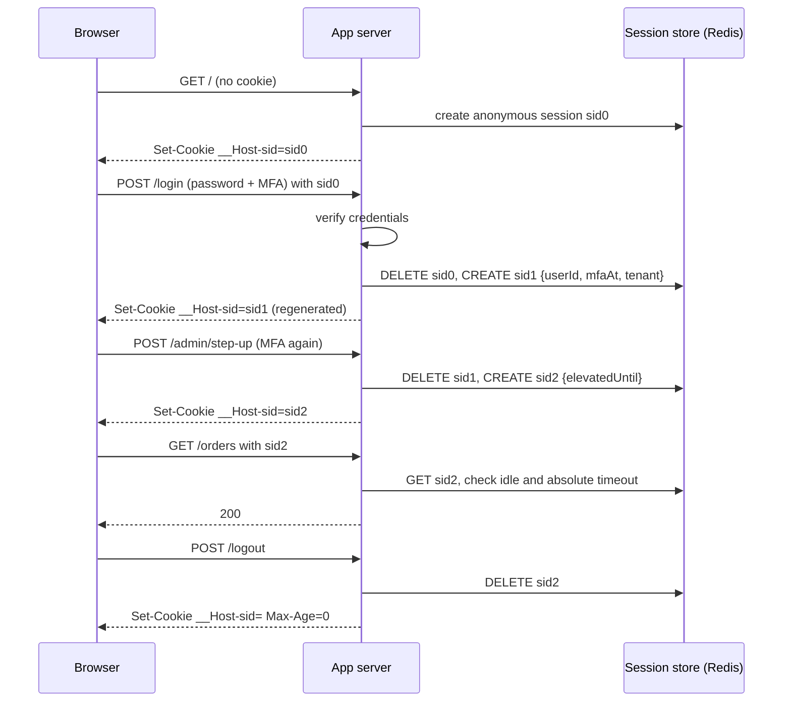
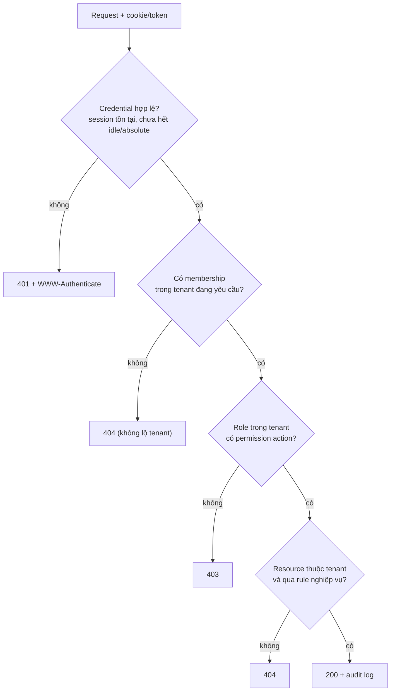

## Bối cảnh & vấn đề

Một nền tảng bán lẻ multi-tenant có hai cửa hàng: tenant A (chuỗi cà phê) và tenant B (chuỗi sách). Lan là quản lý cửa hàng ở tenant A. Cô đăng nhập hợp lệ: đúng password, đúng mã MFA, server cấp session. Sau đó Lan mở DevTools, đổi số trong URL từ `/orders/1042/refund` thành `/orders/2077/refund`. Order 2077 thuộc tenant B. API kiểm tra "user đã đăng nhập chưa" và "user có permission `order.refund` không": cả hai đều đúng. Tiền được hoàn cho một đơn của công ty khác.

Không có gì sai ở bước đăng nhập. Lỗi nằm ở chỗ hệ thống trả lời đúng câu hỏi "**bạn là ai**" nhưng chưa bao giờ hỏi "**bạn được làm gì với resource cụ thể này, trong tenant nào**". OWASP xếp lỗi này (Broken Object Level Authorization, BOLA) đứng đầu API Security Top 10 2023. Phần lớn sự cố auth thật trong production nằm ở authorization, không nằm ở form login.

Bài này đặt nền cho cả track: phân biệt authentication với authorization, cách một request "mang theo" danh tính (session cookie, token, API key), vòng đời của session và những chỗ hay hỏng (session fixation, logout chỉ xoá cookie), và khi nào chọn session thay vì JWT. Các bài sau đi sâu vào JWT ([bài 2](/tracks/auth-identity/learn/jwt-signing-verification)), OAuth/OIDC ([bài 4](/tracks/auth-identity/learn/oauth2-roles-grants)) và authorization model ([bài 11](/tracks/auth-identity/learn/authorization-models)).

## Khái niệm

### Authentication (AuthN) và authorization (AuthZ)

**Authentication** là quá trình xác minh danh tính: password, passkey, mã OTP, đăng nhập qua Google bằng OIDC. Kết quả của nó là một **principal**: một định danh ổn định (`user_id`, hoặc `service-account-inventory-job`) kèm vài thuộc tính đã được xác minh (đã MFA chưa, đăng nhập lúc nào). Authentication chỉ xảy ra một lần mỗi phiên; sau đó mỗi request chỉ cần chứng minh "tôi là principal đã xác thực lúc nãy" bằng một credential ngắn hạn (session id, token).

**Authorization** là quyết định principal đó có được thực hiện **action X** trên **resource Y** trong **context Z** hay không. Ba thành phần đều quan trọng: action (`order.refund`), resource cụ thể (order 2077, không phải "order" nói chung), và context (tenant hiện tại, giờ làm việc, mức tiền). Authorization chạy trên **mọi request** và thường ở nhiều tầng: gateway kiểm tra token còn hạn, service kiểm tra permission, query kiểm tra resource thuộc tenant.

Câu chuyện của Lan là ví dụ kinh điển: authentication thành công, authorization phải thất bại vì order không thuộc tenant của cô. Nếu chỉ có route-level check (`requirePermission('order.refund')`), lỗ hổng vẫn còn nguyên.

**Interview angle:** interviewer muốn nghe ví dụ "đăng nhập đúng nhưng không được phép" gắn với object-level và tenant, không chỉ "user thường không vào được trang admin".

### 401, 403 và 404

HTTP có hai mã dành riêng cho chuyện này, và tên của chúng gây nhầm lẫn. **401 Unauthorized** (RFC 9110) thực chất nghĩa là "**unauthenticated**": request không có credential, hoặc credential hỏng/hết hạn. Server nên kèm header `WWW-Authenticate` cho biết scheme (`Bearer`, `Basic`). Client nhận 401 thì nên refresh token hoặc đăng nhập lại.

**403 Forbidden** nghĩa là server biết bạn là ai, nhưng bạn không được phép. Đăng nhập lại không giúp gì. Client không nên retry.

**404 Not Found** được dùng thay 403 khi việc tiết lộ "resource này tồn tại" đã là rò rỉ. Nếu Lan gọi `/orders/2077` và nhận 403, cô biết order 2077 tồn tại ở đâu đó; nhận 404 thì không. Quy ước phổ biến: resource ngoài tenant của bạn → 404 (với bạn nó không tồn tại); resource trong tenant nhưng bạn thiếu quyền → 403 (bạn thấy nó trong danh sách, nên giấu không có nghĩa). GitHub làm đúng như vậy với private repo.

**Interview angle:** câu follow-up thường là "khi nào trả 404 thay 403?". Trả lời theo tiêu chí "tiết lộ sự tồn tại có hại không", và nhắc rằng log nội bộ vẫn phải ghi lý do thật (`deny: cross-tenant`).

### Session server-side

**Session** là trạng thái đăng nhập lưu ở server (Redis, database), được tra bằng một **session id** ngẫu nhiên mà browser giữ trong cookie. Session id không mang thông tin gì: nó chỉ là khoá tra cứu, thường 128 bit entropy trở lên. Dữ liệu thật (`userId`, thời điểm MFA, tenant đang chọn) nằm ở server.

Vì state ở server, session có ba tính chất quý: **revoke tức thì** (xoá bản ghi là xong, request sau bị 401), **không lộ dữ liệu** (cookie không chứa claims), và **thay đổi tức thì** (đổi role trong session là có hiệu lực ngay). Cái giá: mỗi request cần một lookup (Redis ~0,2–1 ms trong cùng AZ), và khi scale ngang, mọi instance phải dùng **chung một session store** (không dùng memory store của từng process).

```text
Browser                                  Server                         Redis
Cookie: __Host-sid=k3J9...ZQ  ──────▶   GET sess:k3J9...ZQ  ─────────▶  {"userId":"lan","mfaAt":1790822000,"tenant":"tenant_a"}
```

**Interview angle:** "sessions don't scale" là red flag. Một Redis cluster phục vụ hàng trăm nghìn lookup/giây; vấn đề thật là cross-region và dependency, không phải throughput.

### Cookie flags

Cookie mang session id phải được bảo vệ, vì ai có nó là có phiên. Các thuộc tính quan trọng:

- **`HttpOnly`**: JavaScript không đọc được (`document.cookie` không thấy). XSS không thể lấy cookie mang ra máy khác, dù vẫn có thể gửi request từ chính trang bị XSS.
- **`Secure`**: chỉ gửi qua HTTPS.
- **`SameSite=Lax`** (mặc định của Chrome khi không khai báo) hoặc `Strict`: browser không gửi cookie trong request cross-site kiểu POST từ trang khác, giảm CSRF. `None` bắt buộc đi kèm `Secure` và chỉ dùng khi thật sự cần cross-site.
- **Prefix `__Host-`**: browser chỉ chấp nhận cookie nếu có `Secure`, `Path=/` và **không có `Domain`**. Nhờ đó một subdomain bị chiếm (`blog.shop.com`) không thể ghi đè cookie của `shop.com`, một vector quan trọng của session fixation.
- **`Max-Age`/`Expires`**: không đặt thì là session cookie (mất khi đóng browser, tuỳ browser khôi phục tab). Timeout thật phải nằm ở server.

```http
Set-Cookie: __Host-sid=k3J9...ZQ; Path=/; Secure; HttpOnly; SameSite=Lax
```

**Interview angle:** "JWT trong cookie" vẫn là cookie: vẫn tự động gửi theo request, nên vẫn cần chống CSRF. Chọn JWT không miễn bạn khỏi CSRF, chọn header `Authorization` mới miễn (nhưng khi đó token phải nằm trong JS, xem [bài 7](/tracks/auth-identity/learn/browser-tokens-bff-dpop)).

### Session fixation

**Session fixation** xảy ra khi attacker cài trước một session id **mà attacker biết** vào browser nạn nhân, rồi chờ nạn nhân đăng nhập. Nếu server giữ nguyên session id khi đăng nhập (chỉ gắn `userId` vào session hiện có), session id đó trở thành "đã xác thực", và attacker dùng nó luôn. Cách cài: cookie ghi từ subdomain có lỗ hổng, session id trong URL (`;jsessionid=` thời xưa), máy dùng chung.

Cách chữa đơn giản và bắt buộc: **regenerate session id** ngay sau khi xác thực thành công. Session cũ bị huỷ, nội dung cần giữ (giỏ hàng) được chép sang session mới. Làm lại tương tự mỗi khi **mức đặc quyền thay đổi**: step-up MFA, đổi role, admin impersonate user, chuyển từ "khách" sang "đã thanh toán".

**Interview angle:** câu hỏi "session nên làm gì khi login, đổi quyền, logout" kiểm tra bạn có nghĩ theo vòng đời không. Ba động từ: regenerate, regenerate, destroy server-side.

### Session vs JWT stateless

**JWT stateless** đặt claims (`sub`, `tenant`, `roles`, `exp`) vào chính token và ký lại; server verify bằng key mà không cần tra cứu. Điều này hấp dẫn khi có nhiều service hoặc đối tác cần xác minh token độc lập. Đổi lại, token **khó revoke** trước `exp` (không có gì để xoá), claims **stale** (đổi role thì token cũ vẫn mang role cũ), token to hơn session id nhiều lần (500–1.500 byte so với ~40 byte), và payload ai cũng đọc được ([bài 2](/tracks/auth-identity/learn/jwt-signing-verification)).

Với web app cổ điển (browser, cùng site với backend, một backend chính), **session cookie** thường là lựa chọn đơn giản và an toàn hơn. JWT phù hợp cho **access token gọi API** giữa nhiều service, hoặc khi resource server do bên khác vận hành. Nhiều hệ thống thật dùng cả hai: browser giữ session cookie với BFF, BFF giữ access token JWT để gọi API ([bài 7](/tracks/auth-identity/learn/browser-tokens-bff-dpop)).

**Interview angle:** follow-up kinh điển: "nếu dùng JWT, logout khỏi mọi thiết bị ngay lập tức thế nào?". Mọi đáp án tức thì đều đưa state quay lại (denylist, version), xem [bài 3](/tracks/auth-identity/learn/token-lifecycle-revocation).

### API key

**API key** là một secret dài hạn đại diện cho một **ứng dụng/integration** (không phải một người), dùng cho đối tác gọi server-to-server. Nó giống password của máy: không hết hạn trừ khi bạn đặt, không có MFA, nên thiết kế phải bù lại bằng scope hẹp, rotation và giám sát.

Thiết kế tốt có các phần: **prefix nhận dạng** (`sk_live_`, `sk_test_`) để người và công cụ secret scanning nhận ra, phân biệt môi trường; phần **random ≥ 128 bit**; server chỉ lưu **hash** (SHA-256 là đủ vì key có entropy cao, khác password); hiển thị **một lần** lúc tạo; lưu `last4`, `created_by`, `last_used_at`; key gắn với **tenant + scope** (`orders:read`), tuỳ chọn IP allowlist; cho phép **hai key active song song** để rotate không downtime; rate limit theo key; đăng ký pattern với chương trình secret scanning (GitHub) để key bị push lên public repo được báo/thu hồi tự động.

**Interview angle:** "vì sao SHA-256 nhanh đủ cho API key nhưng không đủ cho password?" Password có entropy thấp (người chọn), brute force offline nhanh nếu hash nhanh; API key 192 bit ngẫu nhiên thì không thể brute force dù hash nhanh tới đâu.

### Basic authentication

**HTTP Basic** gửi `Authorization: Basic base64(user:password)` trên **mọi** request. Base64 là encoding, không phải mã hoá, nên chỉ chấp nhận được qua TLS. Không có logout thực sự (browser cache credential theo realm), không MFA, password đi qua mọi tầng proxy và log. Hiện chỉ hợp cho công cụ nội bộ đơn giản hoặc như một cách truyền `client_id:client_secret` tới token endpoint (OAuth `client_secret_basic`).

| Credential | Mang gì | Revoke | Hợp cho |
| --- | --- | --- | --- |
| Session cookie | id ngẫu nhiên, state ở server | Tức thì (xoá record) | Web app cùng site |
| JWT access token | claims đã ký | Khó trước `exp` | API nhiều service |
| Opaque token | id, tra qua introspection | Tức thì | API cần revoke nhanh |
| API key | secret dài hạn | Tức thì (xoá hash) | Đối tác server-to-server |
| Basic auth | user:password mỗi request | Đổi password | Công cụ nội bộ, client auth |

## Cơ chế hoạt động

Vòng đời một session đúng chuẩn đi qua năm sự kiện, mỗi sự kiện có một hành động bắt buộc với session id:



Diễn giải từng điểm:

1. **Trước đăng nhập**, session ẩn danh có thể tồn tại (giỏ hàng, CSRF token). Nó không đáng tin vì ai cũng có thể tạo ra hoặc bị cài sẵn.
2. **Sau khi xác thực**, server huỷ `sid0` và tạo `sid1` mới. Đây là điểm chặn session fixation: id mà attacker biết không bao giờ trở thành "đã xác thực".
3. **Khi đặc quyền tăng** (step-up MFA để vào trang thanh toán, impersonation), tạo `sid2`. Một id bị lộ ở mức thấp không tự động mang mức cao.
4. **Mỗi request** kiểm tra hai timeout: **idle timeout** (vd 30 phút không hoạt động) và **absolute timeout** (vd 12 giờ kể từ đăng nhập, bất kể hoạt động). Cả hai phải được kiểm ở **server** bằng timestamp trong session, không dựa vào hạn cookie, vì client có thể giữ cookie lâu hơn.
5. **Logout** xoá session **ở server**, rồi mới clear cookie. Chỉ xoá cookie thì ai đã copy session id (log, máy khác) vẫn dùng được.

Ngoài ra, **đổi password** hoặc "đăng xuất khỏi mọi thiết bị" cần huỷ **mọi** session của user; muốn làm được, store phải có index `user → sessions` (Redis set `user_sessions:{id}`), vì key session tra theo id ngẫu nhiên không cho phép tìm theo user.

Quyết định authorization cho mỗi request đi sau bước xác thực session, theo thứ tự từ rẻ đến đắt:



Thứ tự này phản ánh nguyên tắc: kiểm tra danh tính (401) trước, rồi ngữ cảnh tenant, rồi quyền theo action, rồi object-level. Bỏ bất kỳ tầng nào là mở một lớp lỗ hổng; câu chuyện của Lan là thiếu tầng cuối.

## Ví dụ thực tế

### Session fixation trên express-session

Chạy trên Node 24.21, Express 5.2.1, express-session 1.19.0. Hai route đăng nhập: một route chỉ gắn `userId` vào session hiện có, một route gọi `req.session.regenerate()`:

```ts
app.use(session({ name: "sid", secret: "dev-only-secret", resave: false, saveUninitialized: true,
  cookie: { httpOnly: true, sameSite: "lax" } }));
app.post("/login-buggy", (req, res) => { req.session.userId = req.body.user; res.send("ok"); });
app.post("/login", (req, res, next) =>
  req.session.regenerate((err) => {
    if (err) return next(err);
    req.session.userId = req.body.user;           // set identity only on the NEW session
    res.send("ok");
  }));

// attack: get a session id, plant it in the victim's browser, victim logs in, attacker reuses the id
const planted = sid(await fetch(base));
await fetch(base + route, { method: "POST", headers: { cookie: `sid=${planted}` }, body: "user=victim" });
const attacker = await (await fetch(base, { headers: { cookie: `sid=${planted}` } })).text();
```

```text
/login-buggy planted=s:t51Nsuj2XGFv… after-login set-cookie=(none) attacker sees: "hello victim"
/login       planted=s:1ffNUjNq1cnK… after-login set-cookie=s:EdumkMB_aIau… attacker sees: "hello anonymous"
```

Ở route lỗi, server không phát cookie mới sau đăng nhập; id mà attacker cài trở thành phiên của nạn nhân. Ở route đúng, id mới được phát, id cũ bị huỷ, attacker chỉ còn một phiên ẩn danh. Lưu ý thêm: production phải có `secure: true`, store chung (Redis), và tên cookie có prefix `__Host-`.

### API key: tạo, lưu hash, tra cứu

```ts
import { randomBytes, createHash, timingSafeEqual } from "node:crypto";
const newKey = (env: "live" | "test") => {
  const key = `sk_${env}_${randomBytes(24).toString("base64url")}`;          // 192-bit random part
  return { key, row: { prefix: key.slice(0, 11), hash: createHash("sha256").update(key).digest("hex"), last4: key.slice(-4) } };
};
const { key, row } = newKey("live");
const lookup = (presented: string) =>
  timingSafeEqual(createHash("sha256").update(presented).digest(), Buffer.from(row.hash, "hex"));
console.log(/sk_(live|test)_[A-Za-z0-9_-]{32}(?![A-Za-z0-9_-])/.test(`const k = "${key}"`));
```

```text
shown once to the developer: sk_live_Svxu8pVsd_FwH2L2emcpdRLB7WnRwsB-
stored row: { prefix: 'sk_live_Svx', hash: 'ba15b90086569c26cb2b4562240d18a6f3d06e2e93555e1d3c1c4d6110539cb9', last4: 'wsB-' }
valid key -> true | tampered -> false
regex for secret scanning: true
```

DB chỉ có hash: một bản dump DB không cho attacker dùng được key nào. `prefix` giúp UI hiển thị "sk_live_Svx…wsB-" để người dùng biết key nào là key nào. Trong thực tế, lookup tra theo `hash` (cột unique có index) thay vì so một hàng như ví dụ; so sánh constant-time chỉ cần khi so trực tiếp chuỗi bí mật. Một chi tiết nhỏ từ lần chạy: regex dùng `\b` ở cuối bị sai khi key kết thúc bằng `-` (base64url có `-` và `_`), nên cần lookahead như trên.

### 401/403/404 trong một handler

```ts
router.post("/t/:tenantId/orders/:id/refund", async (req, res) => {
  const principal = await authenticate(req);                       // session or token
  if (!principal) return res.status(401).set("WWW-Authenticate", 'Bearer realm="shop"').end();
  const membership = await memberships.find(principal.userId, req.params.tenantId);
  if (!membership) return res.status(404).end();                   // don't reveal the tenant exists
  if (!membership.permissions.has("order.refund")) return res.status(403).end();
  const order = await orders.findById(req.params.id, { tenantId: membership.tenantId });
  if (!order) return res.status(404).end();                        // other tenant's order = not found
  await refunds.create(order, principal);
  audit.log({ actor: principal.userId, tenant: membership.tenantId, action: "order.refund", order: order.id });
  res.json({ ok: true });
});
```

(minh hoạ) Mỗi tầng trả một mã khác nhau và có lý do riêng. Chi tiết schema membership ở [bài 12](/tracks/auth-identity/learn/multi-tenant-authorization).

## Trade-offs & lựa chọn thay thế

| Tiêu chí | Session cookie + Redis | JWT stateless (cookie hoặc header) | Opaque token + introspection |
| --- | --- | --- | --- |
| Revoke | Tức thì | Chờ `exp` hoặc thêm denylist | Tức thì |
| Lookup mỗi request | 1 (Redis) | 0 (verify chữ ký) | 1 (AS, có cache) |
| Kích thước trên wire | ~40 byte | 300–1.500 byte | ~40 byte |
| Lộ thông tin | Không | Payload đọc được | Không |
| Nhiều service độc lập verify | Cần gọi về session service | Dễ (JWKS) | Cần gọi AS |
| CSRF | Cần (cookie) | Cần nếu ở cookie | Tuỳ nơi lưu |
| Độ phức tạp | Thấp | Trung bình (key, rotation, revoke) | Trung bình |

Chọn thế nào: web app server-rendered hoặc SPA cùng site với một backend chính → **session cookie**, thêm store dùng chung. Nhiều microservice cần biết user là ai → **access token ngắn hạn** (JWT) phát bởi một AS, và browser vẫn có thể chỉ giữ session cookie với BFF. Cần revoke tức thì cho mọi request (ngân hàng, admin) → session hoặc opaque token. Đối tác server-to-server ít người dùng → API key là đủ; đối tác lớn, nhiều scope, muốn token ngắn hạn → OAuth client credentials ([bài 4](/tracks/auth-identity/learn/oauth2-roles-grants)).

## Edge cases & failure modes

- **Redis session store chết**: mọi request trả 401, toàn bộ user "bị logout". Cần Redis HA (replica + failover), và quyết định rõ fail-closed (an toàn) hay degrade (cho phép đọc với cache ngắn). Đừng fallback về memory store của từng pod: user sẽ bị logout ngẫu nhiên khi load balancer đổi pod.
- **Hai tab cùng regenerate**: một tab đăng nhập lại trong khi tab khác đang gửi request bằng id cũ → request đó 401. Thường chấp nhận được; với SPA, xử lý 401 bằng cách reload phiên.
- **Session lớn**: nhét cả danh sách permission, giỏ hàng lớn vào session làm mỗi request đọc vài chục KB từ Redis. Giữ session nhỏ, tra quyền từ cache riêng ([bài 12](/tracks/auth-identity/learn/multi-tenant-authorization)).
- **Đổi password không huỷ session khác**: attacker đã có session vẫn ở lại sau khi nạn nhân đổi password. Cần index `user → sessions` để huỷ tất cả (tuỳ chọn giữ session hiện tại).
- **Absolute timeout thiếu**: session sliding (gia hạn mỗi request) có thể sống vô hạn nếu có một script giữ phiên. Đặt trần tuyệt đối.
- **API key lộ trên GitHub**: nếu không có secret scanning và `last_used_at`, bạn chỉ phát hiện khi hoá đơn tăng. Cần alert theo vị trí/IP lạ và quy trình auto-revoke.
- **Cookie `Domain=.shop.com`**: mọi subdomain đọc/ghi được; một subdomain marketing bị chiếm là đủ để cài session id. Dùng `__Host-` cho cookie phiên.

## Pitfalls

- ❌ Chỉ kiểm tra "đã đăng nhập" và permission ở route → ✅ kiểm tra thêm resource thuộc tenant/owner trong query; đó là nơi BOLA xảy ra.
- ❌ Trả 403 cho resource của tenant khác → ✅ trả 404 khi việc tiết lộ sự tồn tại có hại, log lý do thật ở server.
- ❌ Gắn `userId` vào session hiện có khi login → ✅ `regenerate()` rồi mới gắn; làm lại khi step-up hay impersonate.
- ❌ Logout bằng cách xoá cookie ở client → ✅ xoá bản ghi session ở server, rồi clear cookie.
- ❌ "Sessions không scale, JWT luôn tốt hơn" → ✅ chọn theo nhu cầu revoke, số service verify và nơi chạy client.
- ❌ Lưu API key plaintext, hiển thị lại được → ✅ lưu SHA-256, hiển thị một lần, có prefix và `last4`.
- ❌ API key gắn với tài khoản cá nhân nhân viên → ✅ gắn với app/integration và tenant; nhân viên nghỉ việc không làm gãy tích hợp.
- ❌ Tin cookie hết hạn là session hết hạn → ✅ idle và absolute timeout kiểm ở server.

## Tóm tắt

- AuthN trả lời "bạn là ai" (một lần mỗi phiên), AuthZ trả lời "được làm action gì trên resource nào trong tenant nào" (mọi request). Sự cố thật thường ở AuthZ object-level.
- 401 = chưa/không xác thực được; 403 = xác thực rồi nhưng không được phép; 404 = giấu sự tồn tại của resource ngoài phạm vi.
- Session server-side: id ngẫu nhiên trong cookie `__Host-`, `HttpOnly`, `Secure`, `SameSite`; revoke tức thì, cần store dùng chung.
- Vòng đời: regenerate khi login và khi tăng đặc quyền, idle + absolute timeout ở server, logout xoá server-side, đổi password huỷ mọi session.
- Session cookie là mặc định hợp lý cho web app cùng site; JWT hợp cho access token giữa nhiều service; JWT trong cookie vẫn cần chống CSRF.
- API key: prefix + ≥128 bit random, lưu hash, scope + tenant, hai key song song để rotate, rate limit, secret scanning.
