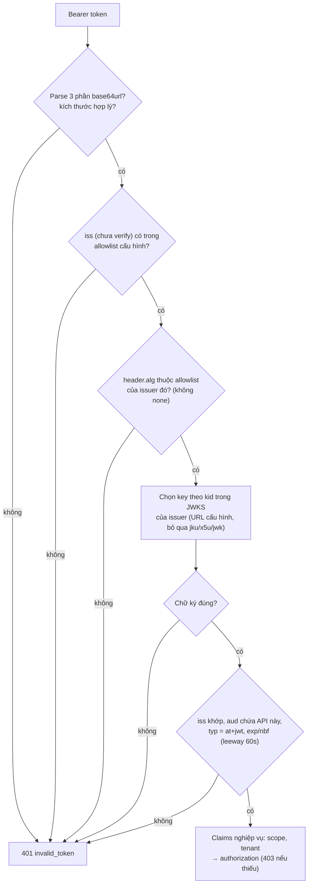
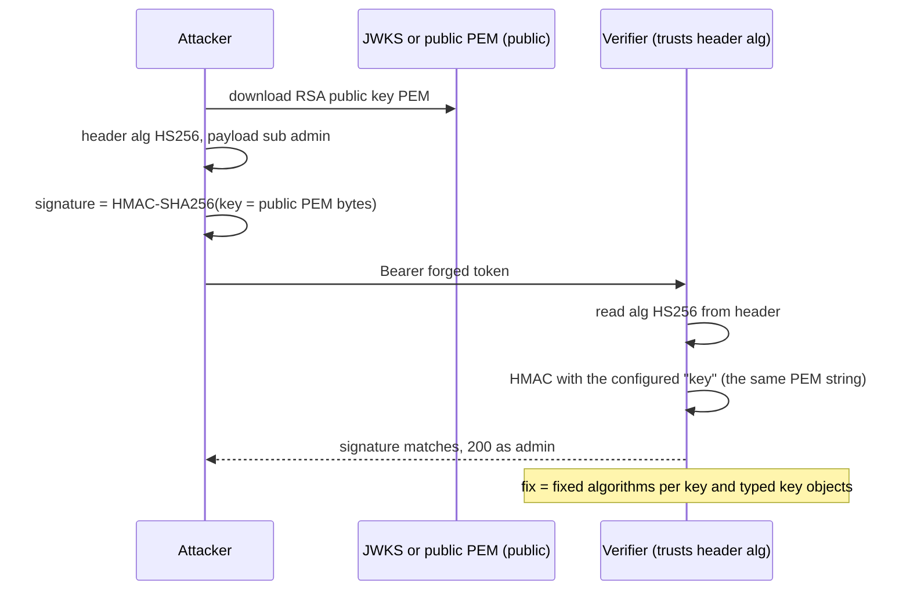

## Bối cảnh & vấn đề

Một team có gateway verify JWT, và 8 service phía sau. Để "đỡ tốn CPU", các service phía sau chỉ `jwt.decode()` token mà gateway đã chuyển tiếp, đọc `sub`, `tid`, `roles` rồi chạy tiếp. Sáu tháng sau, một lỗ SSRF trong service xuất báo cáo cho phép attacker gửi request HTTP tới bất kỳ địa chỉ nội bộ nào. Attacker tự tạo một token `{"sub":"admin","roles":["owner"]}`, không cần ký, gửi thẳng tới service billing (không qua gateway). Billing decode, thấy `owner`, và cho xuất toàn bộ hoá đơn của mọi tenant.

JWT là định dạng token phổ biến nhất trong hệ thống hiện đại, và cũng là nơi tập trung nhiều lỗi kinh điển nhất: dùng `decode` thay `verify`, tin trường `alg` trong header, quên `aud`, lấy key từ URL trong token, để đồng hồ lệch. Hầu hết các lỗi này không phải lỗi thuật toán mật mã mà là lỗi **cách dùng**: verifier tin vào dữ liệu do attacker kiểm soát.

Bài này giải thích JWT từ cấu trúc tới chữ ký, so sánh thuật toán ký bằng số đo thật, chạy lại các tấn công kinh điển trên thư viện thật để thấy phiên bản nào chặn được gì, và kết thúc bằng một checklist verify dùng cho mọi resource server.

## Khái niệm

### JWT, JWS và JWE

**JWT** (RFC 7519) là một định dạng để chở **claims** (các mệnh đề về một chủ thể, dạng JSON) một cách gọn, an toàn cho URL. Bản thân JWT chỉ định nghĩa claims; phần bảo vệ do hai chuẩn khác đảm nhận. **JWS** (RFC 7515) **ký** dữ liệu: ai cũng đọc được, nhưng không ai sửa được mà không làm hỏng chữ ký. **JWE** (RFC 7516) **mã hoá**: chỉ người có key mới đọc được. Khi người ta nói "JWT", gần như luôn là JWS dạng compact.

Dạng compact gồm ba phần base64url nối bằng dấu chấm: `header.payload.signature`. **Header** cho biết thuật toán (`alg`), loại token (`typ`) và key nào đã ký (`kid`). **Payload** chứa claims. **Signature** được tính trên chuỗi `base64url(header) + "." + base64url(payload)`. Base64url chỉ là encoding: ai có token đều đọc được header và payload chỉ bằng một dòng code.

```ts
const [h, p] = token.split(".");
JSON.parse(Buffer.from(p, "base64url").toString());   // anyone can read the claims
```

Hệ quả thực tế: không để PII nhạy cảm, secret, hay thông tin nội bộ (tên bảng, ID nội bộ dễ đoán) trong payload. Nếu thật sự cần claims bí mật, dùng JWE (hiếm khi cần) hoặc **opaque token** (chuỗi ngẫu nhiên, tra ở server).

**Interview angle:** câu "payload JWT có mã hoá không?" là câu lọc nhanh. Câu trả lời mạnh nói thêm: chữ ký chỉ chứng minh **integrity + nguồn gốc**, không chứng minh token còn hợp lệ về nghiệp vụ (user có thể đã bị khoá sau khi token được cấp).

### Registered claims

RFC 7519 định nghĩa một số claim có nghĩa chuẩn; verifier phải hiểu và kiểm tra chúng:

- **`iss`** (issuer): ai phát hành, thường là URL của authorization server. Verifier so khớp **chính xác** với issuer đã cấu hình.
- **`sub`** (subject): định danh chủ thể, duy nhất **trong phạm vi issuer**. Khoá user đúng là cặp `(iss, sub)`.
- **`aud`** (audience): token dành cho ai. Một API phải từ chối token không có tên mình trong `aud` ([bài 8](/tracks/auth-identity/learn/service-identity-propagation)).
- **`exp`**, **`nbf`**, **`iat`**: hết hạn, chưa có hiệu lực trước, phát hành lúc (giây Unix).
- **`jti`**: id duy nhất của token, dùng cho denylist hoặc chống replay.

Ngoài ra có claims của OIDC (`nonce`, `auth_time`, `acr`, `amr`), của RFC 9068 cho access token (`client_id`, `scope`), và claims riêng (`tid`, `roles`). Header `typ` có giá trị chuẩn để phân loại token: RFC 9068 dùng `at+jwt` cho access token; kiểm tra `typ` giúp chặn việc dùng nhầm ID token làm access token.

**Interview angle:** "vì sao nhét email và danh sách role vào access token là trade-off?" Token to lên ở mọi request, lộ thông tin cho mọi bên cầm token, và role **stale** tới khi hết hạn.

### Thuật toán ký: HMAC, RSA, ECDSA, EdDSA

**HS256** (HMAC-SHA256) dùng **một secret chung** để ký và verify. Nhanh, chữ ký ngắn (32 byte). Nhưng mọi bên có thể verify cũng có thể **ký**. Vì vậy HS256 chỉ hợp khi issuer và verifier là **cùng một** service (hoặc cùng một ranh giới tin cậy). Secret phải có entropy ≥ 256 bit; secret như `"secret"` hay tên công ty bị brute force offline trong vài phút với hashcat.

**RS256** (RSA PKCS#1 v1.5 + SHA-256, key ≥ 2048 bit) dùng **private key** để ký và **public key** để verify. Verifier chỉ cần public key (công khai qua JWKS), nên hợp khi nhiều service hoặc đối tác cùng verify. Ký chậm (~0,7 ms), verify nhanh, chữ ký to (256 byte).

**ES256** (ECDSA P-256) và **EdDSA** (Ed25519) cũng bất đối xứng nhưng key và chữ ký nhỏ hơn nhiều (64 byte). ECDSA cần nonce ngẫu nhiên tốt khi ký (lỗi nonce từng làm lộ private key ở nhiều hệ thống); EdDSA **deterministic** nên tránh được bẫy đó. Kiểm tra IdP và thư viện có hỗ trợ không trước khi chọn.

Nguyên tắc quan trọng hơn chọn thuật toán: **một key gắn với đúng một thuật toán**, và verifier có **allowlist** thuật toán cố định, không đọc từ token.

**Interview angle:** "vì sao cho phép cả HS256 và RS256 cho cùng một key là nguy hiểm?" → algorithm confusion, phần dưới.

### Tấn công `alg: none`

JWS cho phép `alg: "none"` (Unsecured JWS): không có chữ ký. Attacker sửa header thành `none`, thay payload tuỳ ý, để trống phần chữ ký. Một verifier "tin header" sẽ đọc `alg`, thấy `none`, và chấp nhận token không ký. Tấn công này nổi tiếng từ 2015 (nhiều thư viện bị), và vẫn xuất hiện trong code tự viết hoặc wrapper "linh hoạt".

### Algorithm confusion (RS256 → HS256)

Server ký bằng RSA. Public key là công khai (JWKS, file PEM trong repo). Attacker tạo token với `alg: HS256` và ký HMAC **bằng chính chuỗi public key PEM làm secret**. Nếu verifier chọn thuật toán theo header và dùng cùng "key" cho mọi thuật toán (thường vì key được truyền dưới dạng chuỗi/Buffer chung), nó sẽ tính HMAC bằng public key và thấy khớp. Kết quả: token tự ký hợp lệ.

Lỗi tồn tại vì key không được **gắn kiểu**: một chuỗi PEM có thể bị hiểu là secret HMAC. Thư viện hiện đại chặn bằng cách dùng key object có kiểu (`KeyObject` asymmetric không được dùng cho HMAC), RFC 8725 yêu cầu verifier xác định trước thuật toán cho mỗi key.

**Interview angle:** câu "vì sao 2026 vẫn còn?" chờ ba ý: code tự viết/wrapper cũ, `algorithms` lấy từ cấu hình "cho phép tất cả", key lưu dạng chuỗi không gắn thuật toán. Và cách chứng minh đã chặn: test âm tính trong CI.

### Tấn công qua `kid`, `jku`, `x5u`, `jwk`

Header JWT là **dữ liệu của attacker** cho tới khi chữ ký được verify, nhưng verifier lại cần header để chọn key. Đây là nơi sinh lỗi:

- **`jku`/`x5u`**: URL tới JWKS hoặc certificate. Verifier "tiện" fetch key từ URL trong token → attacker trỏ về JWKS của họ, ký bằng key của họ, token hợp lệ. Cộng thêm SSRF vì server fetch URL do attacker chọn.
- **`jwk`**: token mang luôn public key để verify chính nó. Chấp nhận là tự sát (trừ DPoP proof, nơi key nhúng là có chủ đích và được ràng buộc riêng, [bài 7](/tracks/auth-identity/learn/browser-tokens-bff-dpop)).
- **`kid` injection**: `kid` được dùng để tra key bằng SQL (`kid: "x' UNION SELECT 'secret'--"`) hoặc đọc file (`kid: "../../../dev/null"` → key rỗng; HMAC với key rỗng thì attacker cũng tính được).

Cách đúng: key chỉ đến từ **JWKS URL cấu hình sẵn cho issuer** đã biết; bỏ qua `jku`/`x5u`/`jwk` trong token; `kid` chỉ là khoá tra trong một map đã load sẵn; khi có nhiều issuer, chọn issuer theo cấu hình (allowlist) trước rồi mới chọn JWKS tương ứng.

**Interview angle:** "service nhận token từ ba IdP, chọn JWKS thế nào cho an toàn?" → map tĩnh `issuer → jwks_uri`, đọc `iss` chưa verify chỉ để chọn mục trong map, rồi verify lại `iss` sau khi có chữ ký hợp lệ.

### Clock skew và leeway

`exp`, `nbf`, `iat` là thời điểm tuyệt đối, so với đồng hồ của verifier. Nếu đồng hồ pod chậm hơn IdP 20 giây, token vừa phát có `nbf` "ở tương lai" và bị từ chối ("jwt not active"). Nếu đồng hồ pod nhanh, token hết hạn sớm hơn dự kiến ("jwt expired"). Thường gặp trên VM resume từ suspend, container trên host không chạy NTP, laptop dev.

Chữa ở gốc: NTP/chrony (hoặc dịch vụ time sync của cloud) trên mọi node, và monitor clock offset. Ở verifier: **leeway** nhỏ (`clockTolerance` 30–60 giây). Không "chữa" bằng leeway vài phút hay vài giờ: leeway cũng là cửa sổ chấp nhận token đã hết hạn.

## Cơ chế hoạt động

Resource server nhận `Authorization: Bearer <jwt>` và phải đi qua các bước theo đúng thứ tự. Thứ tự quan trọng: mọi thứ trước khi chữ ký được xác minh đều là dữ liệu không đáng tin, chỉ được dùng để **chọn** cấu hình, không được dùng để **quyết định**.



Giải thích từng bước:

1. **Parse** và giới hạn kích thước (token 50 KB là dấu hiệu tấn công hoặc lỗi cấu hình). Token hỏng → 401.
2. **Chọn issuer**: đọc `iss` khi chưa verify, nhưng chỉ để tra trong map cấu hình. Issuer lạ → 401 ngay, không fetch gì.
3. **Allowlist `alg`** theo issuer. `none` không bao giờ nằm trong danh sách. Một key một họ thuật toán.
4. **Chọn key** theo `kid` từ JWKS của issuer đó (đã cache; refetch khi gặp `kid` lạ, có cooldown, [bài 6](/tracks/auth-identity/learn/oidc-id-token-jwks)).
5. **Verify chữ ký**. Chỉ từ đây payload mới đáng tin.
6. **Claims chuẩn**: `iss` khớp chính xác, `aud` chứa tên API này, `typ` đúng loại, `exp`/`nbf` với leeway nhỏ.
7. **Claims nghiệp vụ** và authorization: scope, tenant, object-level. Thiếu quyền là 403, không phải 401.

Algorithm confusion là ví dụ rõ nhất của việc để header quyết định thay cho cấu hình:



Verifier không làm sai phép tính nào; nó chỉ để **attacker chọn thuật toán**. Với allowlist `['RS256']` hoặc key object có kiểu RSA, bước thứ năm thất bại ngay.

Thư viện tốt (`jose.jwtVerify`) làm bước 3–6 trong một lời gọi nếu bạn **truyền đủ tham số** (`issuer`, `audience`, `algorithms`, `typ`, `clockTolerance`). Thiếu tham số nào thì bước đó bị bỏ qua mà không có cảnh báo.

## Ví dụ thực tế

### So sánh thuật toán ký: kích thước và tốc độ

Node 24.21, jose 6.2.12, Apple Silicon. Ký cùng một bộ claims (`sub`, `tid`, `scope`, `iss`, `aud`, `iat`, `exp`), đo trung bình 2.000 lần:

```ts
for (const alg of ["HS256", "RS256", "ES256", "EdDSA"]) {
  const key = alg === "HS256" ? new TextEncoder().encode("x".repeat(32))
    : await jose.generateKeyPair(alg, alg === "EdDSA" ? { crv: "Ed25519" } : {});
  const mk = () => new jose.SignJWT(claims).setProtectedHeader({ alg, kid: "k1" })
    .setIssuer("https://idp.example.com").setAudience("orders-api").setIssuedAt().setExpirationTime("10m").sign(priv);
  // ... time 2000 x mk() and 2000 x jwtVerify(t, pub, { issuer, audience, algorithms: [alg] })
}
```

```text
HS256  token=268 chars  sig= 43 chars  sign=   35µs  verify=  30µs
RS256  token=567 chars  sig=342 chars  sign=  666µs  verify=  44µs
ES256  token=311 chars  sig= 86 chars  sign=   74µs  verify= 125µs
EdDSA  token=311 chars  sig= 86 chars  sign=   65µs  verify= 144µs
```

RS256 làm token dài gấp đôi (chữ ký 342 ký tự base64url) và ký chậm gấp ~10 lần, nhưng verify rất nhanh; vì resource server chỉ verify, RS256 vẫn ổn. ES256/EdDSA cho token ngắn nhất trong nhóm bất đối xứng; verify chậm hơn RSA một chút nhưng vẫn ~0,1 ms, không đáng kể so với một query DB. Con số tuyệt đối khác trên máy khác; tỷ lệ thì ổn định.

### Chạy lại alg none và algorithm confusion

Cùng một cặp key RSA 2048; attacker có public key PEM. Hai token độc: một token `alg: none`, một token HS256 ký bằng **public key PEM** làm HMAC secret. Thử trên jsonwebtoken 8.5.1, 9.0.3 và jose 6.2.12:

```ts
const none = `${b64({ alg: "none", typ: "JWT" })}.${b64(evil)}.`;
const h = b64({ alg: "HS256", typ: "JWT" }), p = b64(evil);
const confused = `${h}.${p}.${createHmac("sha256", pubPem).update(`${h}.${p}`).digest("base64url")}`;

tryIt("jwt.decode(none)", () => jwt9.decode(none));
tryIt("v8 verify(confused, pubPem)  [no algorithms option]", () => jwt8.verify(confused, pubPem));
tryIt("v8 verify(confused, pubPem, ['RS256','HS256'])", () => jwt8.verify(confused, pubPem, { algorithms: ["RS256", "HS256"] }));
tryIt("v9 verify(confused, pubPem, ['RS256','HS256'])", () => jwt9.verify(confused, pubPem, { algorithms: ["RS256", "HS256"] }));
await jose.jwtVerify(confused, await jose.importSPKI(pubPem, "RS256"));
```

```text
jwt.decode(none)  [no verification at all]                 ACCEPTED sub=admin
v9 verify(none, pubPem)                                    rejected: jwt signature is required
v8 verify(none, pubPem)                                    rejected: jwt signature is required
v8 verify(confused, pubPem)  [no algorithms option]        rejected: invalid algorithm
v8 verify(confused, pubPem, ['RS256','HS256'])             ACCEPTED sub=admin
v9 verify(confused, pubPem, ['RS256','HS256'])             rejected: secretOrPublicKey must be a symmetric key when using HS256
v9 verify(confused, pubPem, ['RS256'])                     rejected: invalid algorithm
jose jwtVerify(none)                                       rejected: ERR_JOSE_NOT_SUPPORTED alg none is not supported either by JOSE or your javascript runtime
jose jwtVerify(confused)                                   rejected: undefined CryptoKey instances must be of type "secret" for the HS256 algorithm
```

Đọc kết quả:

- `jwt.decode` **chấp nhận mọi thứ** vì nó không verify. Đây là lỗi của câu chuyện mở bài, và là lỗi phổ biến nhất ngoài đời.
- Cả hai bản jsonwebtoken đều từ chối `none` khi có key.
- jsonwebtoken 8.5.1 **không** bị confusion khi không truyền `algorithms` và key là PEM dạng SPKI (`BEGIN PUBLIC KEY`): nó suy ra danh sách RS/ES/PS từ dạng key. Nó **bị** khi `algorithms` chứa cả RS256 và HS256 (CVE-2022-23541). Bản 9 kiểm tra kiểu key và chặn.
- jose từ chối ngay vì key đã được import với kiểu asymmetric.

Bài học: "đã nâng cấp thư viện" giúp nhiều, nhưng thứ bảo vệ chắc chắn là **allowlist đúng một thuật toán** và **key có kiểu**. Đưa hai token độc này vào test của CI để chứng minh API từ chối chúng.

### Sửa middleware decode

```ts
import { createRemoteJWKSet, jwtVerify } from "jose";
const JWKS = createRemoteJWKSet(new URL("https://idp.example.com/.well-known/jwks.json"));

export async function auth(req, res, next) {
  const [scheme, token] = (req.headers.authorization ?? "").split(" ");
  if (scheme !== "Bearer" || !token) return res.status(401).set("WWW-Authenticate", "Bearer").end();
  try {
    const { payload } = await jwtVerify(token, JWKS, {
      issuer: "https://idp.example.com", audience: "billing-api",
      algorithms: ["RS256"], typ: "at+jwt", clockTolerance: 60,
    });
    req.user = { id: payload.sub, tenantId: payload.tid as string };   // roles: look up, don't trust stale claims
    next();
  } catch {
    res.status(401).set("WWW-Authenticate", 'Bearer error="invalid_token"').end();
  }
}
```

(minh hoạ, cấu trúc đã chạy ở các ví dụ khác) So với bản lỗi: `verify` thay `decode`, issuer/audience/algorithms/typ cố định, lỗi trả 401 có `WWW-Authenticate`. Ngay cả khi gateway đã verify, service vẫn verify (zero trust): service vẫn có thể bị gọi thẳng trong mạng nội bộ hoặc qua SSRF. Nếu không muốn verify lại ở mỗi hop, phương án là JWT nội bộ ký bởi gateway kèm mTLS ([bài 8](/tracks/auth-identity/learn/service-identity-propagation)).

### Clock skew: leeway cứu được gì, mở ra gì

IdP nhanh hơn pod 20 giây; token có `iat = nbf = now_idp`:

```ts
for (const tol of [0, 30]) await jose.jwtVerify(t, publicKey, { issuer: iss, audience: "orders-api", algorithms: ["ES256"], clockTolerance: tol });
// a token that expired 10 seconds ago
for (const tol of [0, 60]) await jose.jwtVerify(old, publicKey, { ..., clockTolerance: tol });
```

```text
clockTolerance=0s -> ERR_JWT_CLAIM_VALIDATION_FAILED: "nbf" claim timestamp check failed
clockTolerance=30s -> ok
expired 10s ago, clockTolerance=0s -> ERR_JWT_EXPIRED: "exp" claim timestamp check failed
expired 10s ago, clockTolerance=60s -> ok (accepted!)
```

Leeway 30 giây chữa được lệch 20 giây. Cùng leeway đó (60 giây) cũng chấp nhận token đã hết hạn 10 giây trước. Đó là lý do leeway chỉ nên vài chục giây, còn lệch lớn hơn phải chữa bằng NTP. Payload cũng in ra được bằng base64url decode, đúng như phần khái niệm:

```text
{ alg: 'ES256' } { sub: 'u1', iss: 'https://idp.example.com', aud: 'orders-api', iat: 1790822030, nbf: 1790822030, exp: 1790822330 }
```

## Trade-offs & lựa chọn thay thế

| Thuật toán | Key | Ai ký được | Chữ ký | Hợp khi | Bẫy |
| --- | --- | --- | --- | --- | --- |
| HS256 | Secret chung ≥ 256 bit | Mọi bên verify | 32 byte | Issuer = verifier | Secret yếu bị brute force; chia sẻ cho nhiều service = ai cũng ký được |
| RS256 | RSA ≥ 2048 | Chỉ private key | 256 byte | Nhiều verifier, tương thích rộng nhất | Token to, ký chậm |
| PS256 | RSA-PSS | Chỉ private key | 256 byte | Yêu cầu FAPI/compliance | Ít thư viện cũ hỗ trợ |
| ES256 | P-256 | Chỉ private key | 64 byte | Token nhỏ, mobile | Nonce xấu làm lộ key (thư viện tốt xử lý) |
| EdDSA | Ed25519 | Chỉ private key | 64 byte | Hệ thống mới | Hỗ trợ IdP/thư viện chưa đều (verify) |

Chọn thế nào: một service tự phát và tự verify token của mình (ví dụ một session token nội bộ) → HS256 với secret mạnh trong secrets manager là đủ. Có IdP và nhiều resource server → bất đối xứng, publish qua JWKS. RS256 là mặc định an toàn về tương thích; ES256/EdDSA khi muốn token nhỏ và chắc chắn mọi verifier hỗ trợ. Quan trọng hơn thuật toán: allowlist cố định, key rotation có overlap, và JWKS từ cấu hình.

So với JWT, **opaque token** (chuỗi ngẫu nhiên + introspection) tránh được toàn bộ nhóm lỗi trong bài này, đổi lại một lookup mỗi request; trade-off này ở [bài 3](/tracks/auth-identity/learn/token-lifecycle-revocation).

## Edge cases & failure modes

- **Token rất lớn**: role/group dài làm token vượt giới hạn header của proxy (thường 8–16 KB tổng header) → 431 hoặc 400 khó hiểu. Đừng nhét danh sách quyền vào token.
- **`aud` là chuỗi hoặc mảng**: RFC 7519 cho phép cả hai; code tự viết `payload.aud === "api"` sai khi `aud` là mảng. Dùng thư viện.
- **`exp` dạng mili giây**: issuer tự viết đặt `exp` bằng `Date.now()` (ms) → token "sống" 50.000 năm. Kiểm tra `exp - iat` có hợp lý không.
- **Key rotation**: `kid` mới chưa có trong cache → 401 hàng loạt ([bài 6](/tracks/auth-identity/learn/oidc-id-token-jwks)).
- **TTL quá ngắn cộng skew**: token 60 giây và lệch 30 giây thì một nửa token bị từ chối. Refresh chủ động trước `exp` (còn 60 giây) thay vì chờ 401.
- **Leeway cấu hình bằng phút**: ai đó đặt `clockTolerance: "1h"` để "hết lỗi" → token hết hạn còn dùng được một giờ.
- **Thư viện khác nhau giữa service**: một service Java chấp nhận thứ mà service Node từ chối; bộ test âm tính chung (alg none, confusion, aud sai, hết hạn) chạy trên mọi service.

## Pitfalls

- ❌ `jwt.decode()` vì "gateway đã verify" → ✅ `verify` ở mọi service, hoặc tin header nội bộ chỉ khi có mTLS và gateway ký lại.
- ❌ `jwt.verify(token, key)` không có `algorithms` → ✅ allowlist đúng một thuật toán cho mỗi key.
- ❌ Chấp nhận `jku`/`x5u`/`jwk` trong token → ✅ JWKS URL từ cấu hình theo issuer.
- ❌ Dùng `kid` để query DB/đọc file → ✅ `kid` chỉ tra trong map key đã load.
- ❌ Không kiểm tra `aud`, `iss`, `typ` → ✅ truyền đủ tham số cho `jwtVerify`.
- ❌ HS256 với secret `"secret"` dùng chung cho 8 service → ✅ bất đối xứng; mỗi service chỉ có public key.
- ❌ Để PII hay quyền chi tiết trong payload → ✅ claims tối thiểu, tra quyền lúc request.
- ❌ Tăng leeway để "fix" lỗi `nbf` → ✅ chữa NTP, leeway ≤ 60 giây, monitor clock offset.

## Tóm tắt

- JWT thường là JWS: `header.payload.signature` base64url; ký chứ không mã hoá, ai cũng đọc được payload.
- Chữ ký chứng minh integrity và nguồn gốc, không chứng minh user còn được phép.
- Verify theo thứ tự: issuer allowlist → alg allowlist → key theo `kid` từ JWKS cấu hình → chữ ký → `iss`/`aud`/`typ`/`exp`/`nbf` → authorization.
- HS256 chỉ khi issuer là verifier; nhiều verifier dùng RS256/ES256/EdDSA qua JWKS.
- `alg: none` và RS→HS confusion chỉ thành công khi verifier tin header hoặc key không có kiểu; jsonwebtoken 8.5.1 bị khi allowlist chứa cả RS256 và HS256, bản 9 và jose chặn.
- Header là dữ liệu của attacker: bỏ qua `jku`/`x5u`/`jwk`, không dùng `kid` để query.
- Clock skew chữa bằng NTP; leeway 30–60 giây; leeway lớn là cửa cho token hết hạn.
