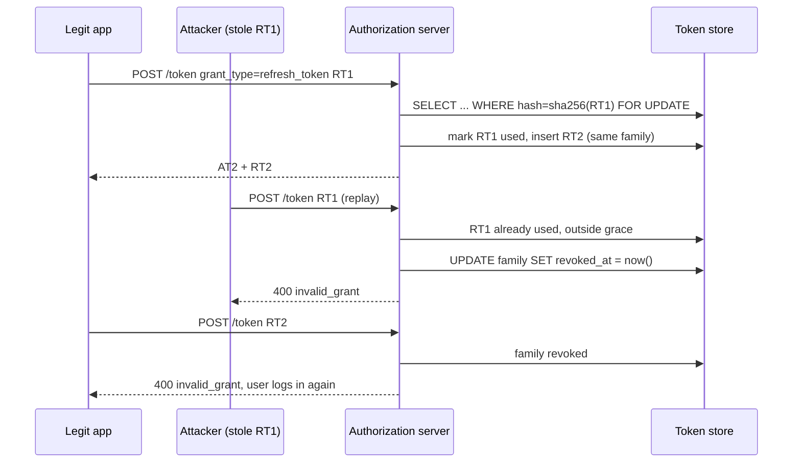
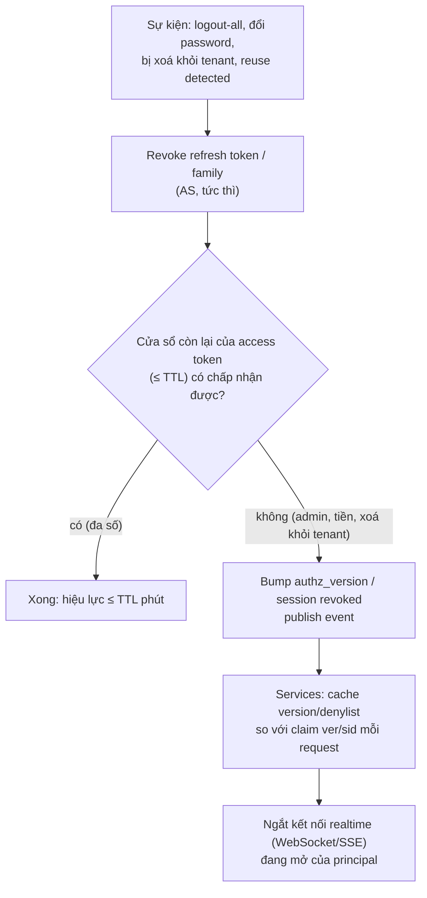

## Bối cảnh & vấn đề

Một app mobile phát access token JWT sống 24 giờ, không có refresh token. Product thích vì "user không bao giờ bị đá ra trong ngày". Rồi ba chuyện xảy ra trong cùng một quý. Một SDK analytics ghi nhầm header `Authorization` vào log và log được gửi sang một vendor; mọi token trong log dùng được thêm tới 24 giờ. Một khách hàng doanh nghiệp xoá nhân viên vừa nghỉ việc khỏi tenant, nhưng người đó vẫn xem dữ liệu cả buổi chiều. Và security team hỏi "làm sao logout một user khỏi mọi thiết bị ngay bây giờ?", câu trả lời là "không làm được".

Ba sự cố có cùng gốc: token mang quyền mà hệ thống **không thể rút lại** cho tới khi nó tự hết hạn, và hạn đó quá dài. Giải pháp chuẩn tách credential làm hai: **access token** ngắn hạn, gửi tới nhiều API; **refresh token** dài hạn, chỉ gửi tới authorization server, và mỗi lần dùng là một cơ hội kiểm tra lại. Nhưng refresh token lại là một secret dài hạn khác cần bảo vệ: rotation, reuse detection, lưu hash, và các race condition làm user "bị logout ngẫu nhiên".

Bài này đi qua vòng đời token từ lúc cấp tới lúc bị thu hồi, cài rotation + reuse detection thật trên Postgres, đo mặc định của Keycloak, và so sánh các cách revoke JWT.

## Khái niệm

### Access token và vì sao nó phải ngắn

**Access token** là credential client gắn vào mỗi request tới **resource server** (`Authorization: Bearer ...`). Nó đi qua nhiều nơi: gateway, nhiều service, proxy, log, đôi khi cả code JS trong browser. Mỗi nơi là một cơ hội lộ. Nếu là JWT, resource server verify bằng chữ ký mà không hỏi ai, nên một khi đã lộ, token hợp lệ tới `exp` bất kể điều gì xảy ra sau đó.

Vì vậy TTL của access token chính là **cửa sổ lạm dụng tối đa** khi lộ, và cũng là **độ trễ revoke** mặc định. Mức phổ biến là 5–15 phút. Ngắn hơn (1 phút) làm tăng tải token endpoint và nhạy cảm với clock skew; dài hơn (giờ) làm cửa sổ revoke quá lớn.

### Refresh token: credential chỉ nói chuyện với AS

**Refresh token** (RFC 6749 §1.5) dùng để xin access token mới mà không bắt user đăng nhập lại. Điểm khác biệt quan trọng: nó **chỉ được gửi tới authorization server** (token endpoint), không bao giờ tới resource server. Ít nơi nhìn thấy hơn thì ít lộ hơn.

Lợi ích thứ hai, ít được nhắc nhưng quan trọng hơn: mỗi lần refresh, AS **kiểm tra lại trạng thái**: user còn active không, còn membership trong tenant không, có bị đổi password hay revoke session không, có cần step-up MFA không. Access token ngắn + refresh có kiểm tra = quyền được "làm mới" mỗi 5–15 phút.

Refresh token cũng phải được bảo vệ: lưu trong HttpOnly cookie hoặc secure storage của OS (Keychain, Keystore), không localStorage; có **absolute lifetime** (vd 30 ngày) và **idle timeout**; với public client (SPA, mobile) thì **rotation** hoặc **sender-constrained** (DPoP), như RFC 9700 §4.14 yêu cầu.

**Interview angle:** "AS nên kiểm tra lại gì ở mỗi lần refresh?" → user/tenant status, membership, session còn sống, password changed sau thời điểm cấp, reuse của chính RT, và chính sách MFA.

### Rotation và token family

**Refresh token rotation**: mỗi lần refresh, AS cấp một RT **mới** và vô hiệu RT vừa dùng. Mọi RT sinh ra từ cùng một lần đăng nhập thuộc một **family** (chuỗi). Bản thân rotation không ngăn attacker dùng RT bị đánh cắp; nó tạo ra một **tín hiệu**: một RT chỉ hợp lệ một lần, nên nếu một RT đã dùng xuất hiện lại, chắc chắn có hai bên đang giữ cùng một chuỗi.

**Reuse detection**: khi một RT đã được đánh dấu `used` bị gửi lại, AS coi family đã bị lộ và **revoke cả family**. Cả attacker lẫn user thật đều phải đăng nhập lại; user thật mất một lần đăng nhập, attacker mất quyền truy cập.

Chi tiết hay bị hiểu sai: nếu attacker refresh **trước** user thật, attacker nhận RT mới hợp lệ và có thể tiếp tục refresh cho tới khi user thật dùng lại RT cũ của họ. Phát hiện chỉ xảy ra khi bên thứ hai dùng RT đã tiêu. Vì vậy rotation phải đi kèm absolute lifetime ngắn vừa phải và tín hiệu khác (thiết bị, IP).

**Interview angle:** câu hỏi bẫy "rotation có nghĩa là attacker chỉ dùng được RT một lần?" Không: attacker dùng được tới khi bên kia lộ diện. Ví dụ chạy thật ở dưới.

### Race condition và grace period

Rotation nghiêm ngặt gây false positive. Hai tab cùng hết hạn access token và refresh cùng lúc bằng **cùng** RT: request đầu thắng, request sau bị coi là reuse, cả family bị revoke, user bị đá ra. Mobile còn tệ hơn: app gửi refresh, server rotate xong, response mất trên mạng 3G; app không nhận được RT mới và thử lại bằng RT cũ, bị coi là reuse.

Ba cách giảm: **grace period** ngắn (vài giây) trong đó RT vừa dùng được chấp nhận lại (Auth0 gọi là reuse interval; Keycloak có `refreshTokenMaxReuse`), **đồng bộ refresh ở client** (một lock hoặc `BroadcastChannel` giữa các tab, một promise refresh dùng chung trong axios interceptor), hoặc đưa refresh về **một nơi** (BFF, [bài 7](/tracks/auth-identity/learn/browser-tokens-bff-dpop)). Grace period nới lỏng bảo mật một chút: trong vài giây đó, attacker cũng dùng lại được.

### Revocation của JWT

JWT stateless không có gì để "xoá". Mọi cách revoke tức thì đều **đưa state quay lại**, khác nhau ở chỗ state nằm đâu và nhỏ bao nhiêu:

- **TTL ngắn + revoke refresh token**: không thêm state ở resource server; chấp nhận cửa sổ bằng TTL. Đủ cho đa số hành động.
- **Denylist theo `jti`**: lưu id các token bị thu hồi trong Redis với TTL bằng thời gian còn lại của token. Chỉ lưu token bị revoke (rất ít), nhưng mọi request phải tra.
- **`token_version` / `session_id`**: token mang `ver` hoặc `sid`; DB/cache giữ version hiện tại của user hoặc trạng thái session. "Logout mọi thiết bị", đổi password, đổi quyền → tăng version, mọi token cũ thành vô hiệu. Revoke theo user/session thay vì từng token.
- **Opaque token + introspection** (RFC 7662): resource server hỏi AS mỗi request (cache vài giây). Revoke tức thì, đổi lại AS thành dependency nóng.
- **Event-driven**: phát `user.revoked`/`membership.removed` qua message bus để các service cập nhật cache denylist/version.

### Opaque token, introspection và phantom token

**Opaque token** là chuỗi ngẫu nhiên không mang thông tin; chỉ AS biết nó nghĩa là gì. Resource server gọi **introspection endpoint** để hỏi: `active`, `sub`, `scope`, `exp`, `client_id`. Ưu: revoke tức thì, không lộ claims, token nhỏ. Nhược: mỗi request (hoặc mỗi cache miss) một round trip tới AS; AS sập là mọi API sập.

**Phantom token** kết hợp hai bên: client bên ngoài chỉ có opaque token; **gateway** introspect (cache ngắn) rồi đổi thành **JWT nội bộ** ngắn hạn cho các service phía sau. Bên ngoài được revoke nhanh và không lộ claims; bên trong được verify local nhanh.

## Cơ chế hoạt động

### Rotation + reuse detection



Các điểm mấu chốt trong sơ đồ:

1. RT được tra bằng **hash** (SHA-256 của chuỗi random ≥ 256 bit). DB bị dump không cho attacker RT dùng được.
2. `FOR UPDATE` khoá hàng RT trong transaction, để hai request đồng thời không cùng thấy `used_at IS NULL` và cùng rotate thành công (lost update).
3. Đánh dấu RT cũ và tạo RT mới trong **cùng transaction**; nếu tạo RT mới thất bại, RT cũ không bị tiêu.
4. Reuse → revoke **family**, không chỉ RT đó, vì không biết bên nào là attacker.
5. Access token còn sống (AT2) vẫn dùng được tới `exp` trừ khi có cơ chế revoke access token (denylist theo `sid`/`jti`). Đây là lý do access token phải ngắn.

### Quyết định revoke khi có sự kiện



Sơ đồ nói một điều đơn giản: revoke refresh token luôn làm, và nó rẻ. Câu hỏi còn lại là cửa sổ TTL của access token có chấp nhận được không. Nếu không, phải thêm state (version/denylist) mà resource server tra mỗi request, và đừng quên kết nối realtime: WebSocket xác thực lúc mở kết nối và không bao giờ nhìn lại token.

## Ví dụ thực tế

### Rotation + reuse detection trên Postgres 17

Schema và hàm refresh (Node 24, pg 8.23, PostgreSQL 17.11 trong Docker):

```sql
CREATE TABLE token_families (id uuid PRIMARY KEY, user_id text NOT NULL, revoked_at timestamptz,
  absolute_expires_at timestamptz NOT NULL);
CREATE TABLE refresh_tokens (
  id uuid PRIMARY KEY, family_id uuid NOT NULL REFERENCES token_families(id),
  token_hash bytea UNIQUE NOT NULL, parent_id uuid, used_at timestamptz, expires_at timestamptz NOT NULL);
```

```ts
async function refresh(raw: string, { graceSec = 0 } = {}) {
  const c = await pool.connect();
  try {
    await c.query("BEGIN");
    const { rows: [rt] } = await c.query(
      `SELECT t.*, f.revoked_at, f.absolute_expires_at FROM refresh_tokens t
         JOIN token_families f ON f.id = t.family_id
        WHERE t.token_hash = $1 FOR UPDATE OF t`, [sha(raw)]);
    if (!rt) { await c.query("ROLLBACK"); return "invalid_grant (unknown)"; }
    if (rt.revoked_at) { await c.query("ROLLBACK"); return "invalid_grant (family revoked)"; }
    if (rt.expires_at < new Date() || rt.absolute_expires_at < new Date()) { await c.query("ROLLBACK"); return "invalid_grant (expired)"; }
    if (rt.used_at) {
      const age = (Date.now() - rt.used_at.getTime()) / 1000;
      if (age <= graceSec) { const next = await issue(c, rt.family_id); await c.query("COMMIT"); return { rt: next, note: "inside grace" }; }
      await c.query("UPDATE token_families SET revoked_at = now() WHERE id = $1", [rt.family_id]);
      await c.query("COMMIT");
      return "invalid_grant (REUSE DETECTED -> family revoked)";
    }
    await c.query("UPDATE refresh_tokens SET used_at = now() WHERE id = $1", [rt.id]);
    const next = await issue(c, rt.family_id);          // 32 random bytes, stored as sha256
    await c.query("COMMIT");
    return { rt: next };
  } finally { c.release(); }
}
```

Năm kịch bản (production nên kiểm thêm user còn active và membership còn hiệu lực trước khi phát token mới):

```text
--- 1. normal rotation
refresh(RT1)                                   ok -> new RT JOaAySlA…
refresh(RT2)                                   ok -> new RT DcOzQ26v…
--- 2. attacker replays a used token
legit: refresh(RT1)                            ok -> new RT vY2DuX4_…
attacker: refresh(RT1)                         invalid_grant (REUSE DETECTED -> family revoked)
legit: refresh(RT2)                            invalid_grant (family revoked)
--- 3. two tabs refresh the same RT at the same time, no grace
tab A                                          ok -> new RT q4sfrYuU…
tab B                                          invalid_grant (REUSE DETECTED -> family revoked)
next refresh by the winning tab                invalid_grant (family revoked)
--- 4. same race, grace = 5s
tab A                                          ok -> new RT 0BucCru3…
tab B                                          ok -> new RT -eNaJ-gQ… (reused 0.00s after rotation, inside grace)
--- 5. DB leak: what the table stores
[ { token_hash: 'eaebb75ff39f05fc044c2f5f33d011e6a38db7ddc9aedfcdb5f74bedf491d417', used: true }, ... ]
```

Kịch bản 3 là "random logout" mà user mobile than phiền: hai request song song, `FOR UPDATE` tuần tự hoá chúng, request thứ hai thấy `used_at` và revoke cả family, kể cả RT vừa cấp cho tab thắng. Kịch bản 4 với grace 5 giây cho cả hai tab qua. Không có `FOR UPDATE`, cả hai request có thể cùng thấy `used_at IS NULL` và cùng tạo RT mới: không ai bị đá ra, nhưng reuse detection cũng không còn đáng tin.

Attacker refresh trước, user thật đến sau:

```text
--- attacker refreshes FIRST with a stolen RT1
attacker: refresh(RT1)                         ok -> new RT Y76XPyhb…
attacker: refresh(RT2) 10 min later            ok -> new RT F96MJsPv…
legit app wakes up: refresh(RT1)               invalid_grant (REUSE DETECTED -> family revoked)
attacker: refresh(RT3)                         invalid_grant (family revoked)
```

Attacker dùng được **nhiều lần** cho tới khi app thật thức dậy và dùng RT1. Sau đó cả chuỗi chết, gồm cả RT3 của attacker.

### Handler refresh có lỗi (rotation giả)

```ts
app.post("/auth/refresh", async (req, res) => {
  const rt = await db.refreshToken.findUnique({ where: { token: req.body.refreshToken } });
  if (!rt || rt.expiresAt < new Date()) return res.sendStatus(401);
  const newRt = randomToken();
  await db.refreshToken.create({ data: { token: newRt, userId: rt.userId, expiresAt: addDays(new Date(), 30) } });
  res.json({ accessToken: signAccess(rt.userId), refreshToken: newRt });
});
```

Đối chiếu với bản đúng ở trên, handler này có năm lỗi: RT cũ **không bị đánh dấu** nên mọi RT từng cấp vẫn dùng được 30 ngày (rotation chỉ là tên gọi); lưu **plaintext** nên DB leak là mất mọi phiên; mỗi lần refresh **gia hạn 30 ngày** nên phiên vô hạn (thiếu `absolute_expires_at` theo family); không kiểm tra user còn active/còn membership; không transaction/lock. "Random logout" mà đội mobile báo thường xuất hiện **sau khi** sửa rotation cho đúng (kịch bản 3), nên bản sửa phải đi kèm grace period hoặc serialize refresh ở client.

### Mặc định thật của Keycloak 26.4.7

Tạo realm `shop`, client public `spa` (PKCE S256), user `alice`; đọc cấu hình realm mặc định qua Admin API:

```text
{ "revokeRefreshToken": false, "refreshTokenMaxReuse": 0, "ssoSessionIdleTimeout": 1800, "ssoSessionMaxLifespan": 36000, "accessTokenLifespan": 300 }
```

Chạy Authorization Code + PKCE lấy token, rồi refresh hai lần bằng **cùng** RT:

```text
### fresh login, refresh RT1 (no code replay) -> 200 ok
### [default realm, revokeRefreshToken=false] refresh RT1 AGAIN -> 200 ok, new tokens issued (old RT still valid)
```

Mặc định Keycloak **có** phát RT mới mỗi lần refresh nhưng **không** vô hiệu RT cũ: không có reuse detection. Bật `revokeRefreshToken: true` (max reuse 0):

```text
### [revokeRefreshToken=true] RT1 -> 200 | RT1 again -> 400 Maximum allowed refresh token reuse exceeded | RT2 (legit) -> 400 Session doesn't have required client
```

Khi bật, reuse làm Keycloak gỡ client session, nên RT2 hợp lệ của user cũng chết: đúng hành vi reuse detection. Đây là cấu hình realm, nên cần bật có chủ đích (verify với version bạn chạy).

### Introspection và logout trên Keycloak

```text
### introspect live AT -> {"active":true,"client_id":"spa","username":"alice","scope":"openid profile email","exp":1790822630,"token_type":"Bearer"}
### logout -> 204 | introspect same AT -> {"active":false}
```

Sau logout, introspection trả `active: false` ngay lập tức. Cùng access token đó, nếu API verify **local** bằng JWKS, vẫn được chấp nhận tới `exp` (5 phút). Đây chính là trade-off JWT vs introspection.

### Denylist và token_version (minh hoạ)

```ts
// on logout-all / password change / removed from tenant
await redis.incr(`authz_ver:${tenantId}:${userId}`);                 // invalidates every token with an older ver
await redis.set(`deny:sid:${sid}`, "1", "EX", accessTokenTtlSec);    // or kill one session

// in every service, after jwtVerify
const current = Number(await cachedGet(`authz_ver:${p.tid}:${p.sub}`) ?? 0); // L1 cache 1-2s + Redis
if ((p.ver as number) < current || (await cachedGet(`deny:sid:${p.sid}`))) throw new Unauthorized("revoked");
```

Chi phí: một lookup Redis mỗi request (thường che bằng cache in-process 1–2 giây, nên revoke có hiệu lực trong ≤ 2 giây thay vì tức thì). So với TTL 10 phút, đó là SLA revoke khác hẳn.

## Trade-offs & lựa chọn thay thế

| Cách | Độ trễ revoke | Chi phí mỗi request | Phụ thuộc | Hợp khi |
| --- | --- | --- | --- | --- |
| TTL ngắn (5–10') + revoke RT | ≤ TTL | 0 | Không | Mặc định cho đa số hành động |
| Denylist `jti` | ~cache TTL | 1 lookup (cache) | Redis | Revoke vài token cụ thể |
| `token_version` / `sid` | ~cache TTL | 1 lookup (cache) | Redis/DB | Logout-all, đổi quyền, xoá khỏi tenant |
| Opaque + introspection | Tức thì (hoặc cache vài giây) | 1 call AS | AS luôn sống | API bên ngoài, ngân hàng, admin |
| Phantom token | Tức thì ở gateway | 1 call AS ở gateway | AS + gateway | Platform nhiều microservice |
| Event-driven | Giây | 0 (cache local) | Message bus | Nhiều service, cần đồng bộ cache |

**Với 20 microservice**: JWT verify local cho độ trễ thấp và cho phép platform chạy tiếp vài phút nếu IdP sập (token còn hạn vẫn hợp lệ, nhưng không ai refresh hay đăng nhập mới được). Opaque mọi nơi biến AS thành điểm chết chung. Phantom token cho cả hai: một điểm introspect ở gateway (cache ngắn), JWT nội bộ phía sau. Khi một nhân viên bị xoá khỏi tenant, chọn `authz_version` của membership (tác động đúng một người, một tenant) cộng revoke refresh token; nói rõ SLA "revoke có hiệu lực ≤ N giây".

## Edge cases & failure modes

- **Response refresh bị mất** (mobile, mạng chập chờn): server đã rotate, client giữ RT cũ, lần thử lại bị coi là reuse. Grace period vài giây hoặc idempotency key cho refresh.
- **Nhiều tab, nhiều request song song**: chỉ một refresh được chạy; các request còn lại chờ promise refresh chung (interceptor có queue).
- **Absolute lifetime thiếu**: sliding refresh làm phiên vô hạn. Đặt `absolute_expires_at` theo family (vd 30 ngày) và bắt đăng nhập lại.
- **Clock skew giữa AS và DB**: `used_at = now()` ở DB, so với `Date.now()` ở app; lệch vài giây làm grace period sai. Dùng một nguồn thời gian (tính tuổi trong SQL).
- **Reuse alert hàng loạt**: nhiều family bị reuse trong cùng một giờ là dấu hiệu nguồn lộ chung (XSS, extension độc, log chứa token, SDK bên thứ ba), không phải vài user xui.
- **Redis denylist chết**: fail-open (bỏ qua denylist) mở lại token đã revoke; fail-closed làm mọi request 401. Quyết định theo mức nhạy cảm của endpoint.
- **WebSocket/SSE sống lâu**: token đã revoke nhưng kết nối mở từ trước vẫn nhận dữ liệu. Ngắt kết nối khi nhận event revoke, hoặc yêu cầu re-auth định kỳ trên kết nối.
- **IdP sập với JWT**: request có token hợp lệ vẫn chạy tới `exp`; refresh và login mới thất bại. Sau TTL, toàn bộ user mất phiên; TTL quyết định "bao lâu thì sự cố IdP thành sự cố toàn hệ thống".

## Pitfalls

- ❌ Access token 24 giờ, không refresh → ✅ 5–15 phút + refresh token có kiểm tra lại trạng thái.
- ❌ "Rotation" nhưng không vô hiệu RT cũ → ✅ đánh dấu `used_at` trong cùng transaction tạo RT mới.
- ❌ Lưu RT plaintext → ✅ lưu SHA-256; RT là random ≥ 256 bit nên hash nhanh là đủ.
- ❌ Mỗi lần refresh gia hạn thêm 30 ngày → ✅ absolute lifetime theo family + idle timeout.
- ❌ Rotation nghiêm ngặt mà client refresh song song → ✅ grace period vài giây và/hoặc serialize refresh ở client/BFF.
- ❌ Tin Keycloak mặc định đã có reuse detection → ✅ bật `revokeRefreshToken` có chủ đích và test lại (verify).
- ❌ Đặt permission chi tiết trong access token rồi ngạc nhiên vì đổi quyền không có hiệu lực → ✅ tra quyền từ cache có invalidation ([bài 12](/tracks/auth-identity/learn/multi-tenant-authorization)).
- ❌ Revoke chỉ refresh token khi user bị xoá khỏi tenant → ✅ thêm `authz_version`/denylist cho access token còn sống, và ngắt kết nối realtime.

## Tóm tắt

- Access token đi tới nhiều nơi nên phải ngắn (5–15'); TTL chính là cửa sổ lạm dụng và độ trễ revoke mặc định.
- Refresh token chỉ tới AS; mỗi lần refresh là một lần kiểm tra lại user, tenant, session.
- Rotation + reuse detection theo family: RT dùng một lần, reuse → revoke cả family; attacker đi trước vẫn dùng được tới khi bên kia lộ diện.
- Cài đúng: lưu hash, `FOR UPDATE` + một transaction, absolute lifetime, grace period vài giây cho race.
- Keycloak 26.4 mặc định không revoke RT cũ; bật `revokeRefreshToken` nếu muốn reuse detection (verify).
- Revoke JWT tức thì luôn cần state: denylist `jti`, `token_version`/`sid`, hoặc opaque + introspection; phantom token gộp ưu điểm hai bên.
- Khi xoá người khỏi tenant: revoke RT, bump version của membership, ngắt WebSocket, và nói rõ SLA revoke.
