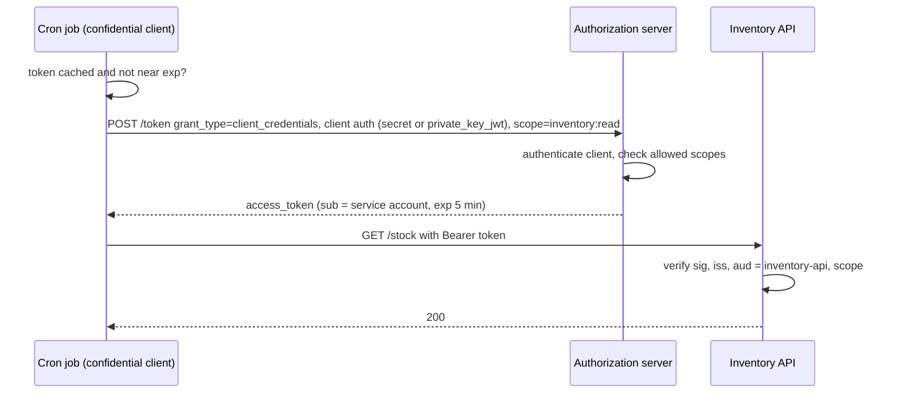
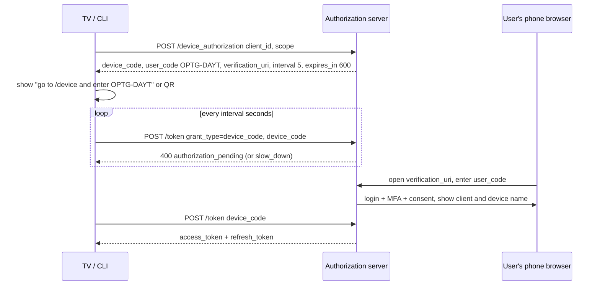

## Bối cảnh & vấn đề

Năm 2008, muốn một app in ảnh đọc album trên Flickr của bạn, cách phổ biến là **đưa password Flickr cho app in ảnh**. App lưu password, đăng nhập thay bạn, và có toàn quyền: đọc, xoá ảnh, đổi password, đọc tin nhắn. Muốn thu hồi thì phải đổi password, làm gãy mọi app khác đang dùng nó. App bị hack thì password của hàng triệu người bị lộ, kèm theo mọi trang web họ dùng chung password.

**OAuth 2.0** (RFC 6749, 2012) ra đời để thay thế mô hình "password anti-pattern" này. User không đưa password cho app nữa. Thay vào đó, user đăng nhập **ở nơi giữ tài khoản** (Flickr/Google) và đồng ý cho app một **quyền hạn chế** ("chỉ đọc album"), thời hạn hạn chế, có thể thu hồi riêng. App nhận một **access token** đại diện cho đúng quyền đó.

Điều quan trọng nhất cần nhớ ngay từ đầu: OAuth là framework **ủy quyền** (delegated authorization): "client được phép làm gì thay user". Nó không định nghĩa "user là ai". Việc dùng OAuth thuần để làm login sinh ra cả một nhóm lỗ hổng, và đó là lý do OpenID Connect ra đời ([bài 6](/tracks/auth-identity/learn/oidc-id-token-jwks)). Bài này đi qua vai trò, scope, và các grant type: cái nào dùng khi nào, cái nào đã bị loại và vì sao.

## Khái niệm

### Bốn vai trò

RFC 6749 định nghĩa bốn vai trò. Lấy ví dụ "app lập lịch họp của bạn đọc Google Calendar của người dùng":

- **Resource owner**: người dùng, chủ của lịch. Họ là người có quyền đồng ý.
- **Client**: app lập lịch của bạn, muốn đọc lịch **thay mặt** user. Client có `client_id`, và nếu chạy trên server thì có credential riêng (secret, private key).
- **Authorization server (AS)**: Google Accounts. Xác thực user, hiển thị màn hình đồng ý (consent), phát token.
- **Resource server (RS)**: Google Calendar API. Nhận access token, kiểm tra nó, trả dữ liệu.

Trong hệ thống của chính bạn, các vai trò thường được map như sau: Keycloak/Auth0/Cognito là AS; các API (orders, billing) là resource server; SPA, mobile app, BFF, cron job là client. Một service có thể vừa là resource server (nhận request) vừa là client (gọi service khác).

**Interview angle:** "OAuth trả lời câu hỏi gì?" → client được làm gì thay user, qua scope. "User là ai" là việc của OIDC.

### Client public và confidential

**Confidential client** giữ được secret: chạy trên server bạn kiểm soát (BFF, backend, cron job). **Public client** không giữ được secret: SPA (code tải về browser), mobile app (APK/IPA giải nén được), CLI phân phối cho người dùng. Bất cứ "secret" nào nhúng trong public client đều coi như công khai.

Phân loại này quyết định flow và biện pháp bảo vệ: public client bắt buộc dùng PKCE ([bài 5](/tracks/auth-identity/learn/authorization-code-pkce)) và refresh token phải rotate hoặc sender-constrained; confidential client xác thực với AS bằng secret, `private_key_jwt` hoặc mTLS.

### Scope, role và permission

Ba khái niệm hay bị trộn:

- **Scope** (OAuth): giới hạn những gì **client** được user/AS ủy quyền: `orders:read`, `calendar.readonly`. Scope là **trần của client**, không phải quyền của user. User đồng ý cho app bên thứ ba `orders:read` thì app đó không thể refund, dù user là admin.
- **Role**: nhóm permission gán cho **user**, thường trong phạm vi một tenant: `store_manager`.
- **Permission**: một action cụ thể trên một loại resource: `order.refund`.

Quyết định cuối cùng là **giao** của ba lớp: scope của token ∩ permission của user trong tenant hiện tại ∩ rule trên object cụ thể. Ví dụ: Lan là `store_manager` ở tenant A (có `order.refund`), dùng app báo cáo bên thứ ba được cấp `orders:read` → app đó gọi refund bị 403 vì thiếu scope; Lan tự gọi từ admin app (có scope `orders:write`) cho order của tenant B → 404 vì object-level.

**Interview angle:** "có nên encode role thành scope trong access token?" Có thể cho first-party app đơn giản, nhưng scope là ý niệm "ủy quyền cho client" và cố định lúc cấp token; role thay đổi theo tenant và theo thời gian. Nhồi role vào scope làm token stale và lẫn lộn hai mô hình.

### Authorization Code grant

Flow chuẩn cho mọi client có user: client redirect user tới AS, user đăng nhập và đồng ý, AS redirect về client với một **code** ngắn hạn, client đổi code lấy token qua kênh back-channel. Với PKCE, nó an toàn cho cả public client. Chi tiết từng tham số ở [bài 5](/tracks/auth-identity/learn/authorization-code-pkce).

### Client Credentials grant

Dành cho **machine-to-machine không có user**: cron job đồng bộ tồn kho, service A gọi service B cho tác vụ hệ thống, đối tác tích hợp server-side. Client tự xác thực với AS bằng credential của chính nó và nhận access token đại diện cho **chính client** (`sub` là service account). Không có refresh token (cứ xin token mới) và không có ID token (không có user).

Bảo mật xoay quanh credential dài hạn của client. **Client secret** là shared secret: cần secrets manager, rotation, và mỗi client một secret. Tốt hơn là **`private_key_jwt`** (RFC 7523): client giữ private key, ký một JWT ngắn hạn (`iss = sub = client_id`, `aud = token endpoint`, `jti`, `exp`) gửi kèm request; AS chỉ cần public key, nên DB của AS bị lộ không làm lộ credential, và assertion có hạn vài phút nên khó replay. Hoặc **mTLS** (RFC 8705) khi đã có PKI. Thêm: scope tối thiểu cho mỗi client, `aud` đúng API, token ngắn và **cache tái sử dụng** tới gần hết hạn (đừng xin token mới cho mỗi request: AS sẽ thành nút cổ chai).

Client Credentials **không** dùng để hành động thay user. Nếu service cần làm việc thay user, dùng token của user hoặc token exchange ([bài 8](/tracks/auth-identity/learn/service-identity-propagation)).

### Device Authorization Grant

**RFC 8628** cho thiết bị không có browser tốt hoặc khó nhập liệu: Smart TV, CLI, IoT, máy POS. Thiết bị xin AS một cặp `device_code` (bí mật, của thiết bị) và `user_code` (ngắn, dễ gõ), hiển thị "Vào example.com/activate và nhập OPTG-DAYT" (hoặc QR của `verification_uri_complete`). User mở trang đó trên điện thoại, đăng nhập, đồng ý. Trong lúc đó thiết bị **poll** token endpoint theo `interval`, nhận `authorization_pending`, `slow_down` (poll quá nhanh, phải tăng interval thêm 5 giây), và cuối cùng là token hoặc `access_denied`/`expired_token`.

Rủi ro chính là **device code phishing**: attacker tự bắt đầu một flow trên thiết bị của họ, gửi `user_code` cho nạn nhân kèm lời dụ ("nhập mã này để nhận quà"); nạn nhân đăng nhập và cấp quyền cho thiết bị của attacker. Giảm thiểu: trang xác nhận hiển thị rõ tên client và thiết bị, TTL của code ngắn, chỉ bật device grant cho client thật sự cần, cảnh báo khi đăng nhập qua device flow từ vị trí khác thường.

### Implicit và Password grant: vì sao bị loại

**Implicit grant** trả access token thẳng trong **URL fragment** (`#access_token=...`) sau redirect. Nó tồn tại vì năm 2012 browser chưa có CORS phổ biến, SPA không gọi được token endpoint khác origin. Cái giá: token lộ qua history, extension, referrer, log; không có client authentication; không gắn được với client (token injection); không có refresh token an toàn. CORS và PKCE đã làm lý do tồn tại biến mất.

**Resource Owner Password Credentials (ROPC)** cho client nhận **password** của user rồi gửi tới AS. Nó đưa lại đúng anti-pattern mà OAuth sinh ra để loại bỏ: client thấy password, không hỗ trợ MFA/SSO/passkey/consent, và dạy user nhập password vào app khác. Nó chỉ được đưa vào RFC 6749 như một lối chuyển tiếp cho legacy.

**RFC 9700** (OAuth 2.0 Security BCP, tháng 1/2025): implicit **SHOULD NOT**, ROPC **MUST NOT**. **OAuth 2.1** (vẫn là IETF draft, verify trạng thái) gộp các khuyến nghị này: bỏ implicit và password grant khỏi chuẩn, PKCE bắt buộc cho authorization code, redirect URI so khớp **chính xác**, không gửi bearer token trong query string, refresh token của public client phải sender-constrained hoặc rotate.

**Interview angle:** "một mobile app legacy vẫn dùng password grant, migrate thế nào?" → Auth Code + PKCE qua system browser (AppAuth), chạy song song hai luồng sau feature flag, bật trước cho version app mới, đặt hạn chót cho version cũ, đo tỷ lệ login theo grant.

## Cơ chế hoạt động

### Luồng Client Credentials



Job kiểm tra cache trước: token còn hạn thì dùng lại. Khi xin token, client tự xác thực; AS chỉ cấp scope nằm trong danh sách được phép cho client đó. API verify như mọi access token khác: chữ ký, `iss`, `aud`, scope. Không có bước người dùng nào.

### Luồng Device Authorization



Hai kênh tách nhau: thiết bị chỉ giữ `device_code` và poll; người dùng xác thực trên một thiết bị có browser đầy đủ (MFA, passkey dùng được). `slow_down` là cách AS bảo thiết bị giãn nhịp poll; thiết bị phải tăng interval chứ không retry ngay.

## Ví dụ thực tế

### Client Credentials trên Keycloak 26.4.7

Client `inventory-job` là confidential, bật service account:

```bash
curl -s -X POST http://localhost:58080/realms/shop/protocol/openid-connect/token \
  -d grant_type=client_credentials -d client_id=inventory-job -d client_secret=s3cr3t-inventory
```

```text
### client_credentials -> 200 access_token,expires_in,refresh_expires_in,token_type,not-before-policy,scope
{"aud":"account","azp":"inventory-job","sub":"f906939f-0c79-4426-ab1f-aacb9d4410f3","preferred_username":"service-account-inventory-job","scope":"profile email","exp":1790822629,"iat":1790822329}
```

Ba quan sát: không có `refresh_token` và `id_token` (đúng với grant); `sub` là service account, không phải user; và `aud` mặc định là `account` (client quản lý tài khoản của Keycloak), không phải API bạn định gọi. Một API kiểm tra `aud = inventory-api` sẽ từ chối token này cho tới khi bạn thêm **audience mapper** cho client. Đây là cấu hình bắt buộc khi dùng Keycloak, không phải lỗi ([bài 8](/tracks/auth-identity/learn/service-identity-propagation)).

### Device Authorization Grant trên Keycloak

Client public `tv-app` bật device grant:

```bash
curl -s -X POST http://localhost:58080/realms/shop/protocol/openid-connect/auth/device -d client_id=tv-app -d scope=openid
curl -s -X POST http://localhost:58080/realms/shop/protocol/openid-connect/token \
  -d client_id=tv-app -d grant_type=urn:ietf:params:oauth:grant-type:device_code -d device_code=$DC   # twice, back to back
```

```text
{ "device_code": "aVFP-v48Ch…", "user_code": "OPTG-DAYT", "verification_uri": "http://localhost:58080/realms/shop/device",
  "verification_uri_complete": "http://localhost:58080/realms/shop/device?user_code=OPTG-DAYT", "expires_in": 600, "interval": 5 }
{"error":"authorization_pending","error_description":"The authorization request is still pending"}
{"error":"slow_down","error_description":"Slow down"}
```

Poll lần hai ngay sau lần một (chưa đủ 5 giây) nhận `slow_down`. Một chi tiết thú vị khi chạy: client `spa` có cấu hình bắt buộc PKCE S256 cũng bị Keycloak đòi `code_challenge_method` ở device endpoint (`Missing parameter: code_challenge_method`), nên phải dùng một client riêng cho thiết bị (verify hành vi theo version).

### Client authentication bằng private_key_jwt (minh hoạ)

```ts
import * as jose from "jose";
const { privateKey } = await jose.generateKeyPair("ES256");      // public key registered at the AS (JWKS URL)
const assertion = await new jose.SignJWT({})
  .setProtectedHeader({ alg: "ES256", kid: "inventory-job-2026-10" })
  .setIssuer("inventory-job").setSubject("inventory-job")
  .setAudience("https://auth.example.com/oauth2/token")
  .setJti(crypto.randomUUID()).setIssuedAt().setExpirationTime("60s").sign(privateKey);
await fetch("https://auth.example.com/oauth2/token", { method: "POST", body: new URLSearchParams({
  grant_type: "client_credentials", scope: "inventory:read",
  client_assertion_type: "urn:ietf:params:oauth:client-assertion-type:jwt-bearer", client_assertion: assertion }) });
```

AS lưu public key (hoặc JWKS URL của client), không lưu secret nào. Assertion sống 60 giây và có `jti` để AS chống replay.

## Trade-offs & lựa chọn thay thế

| Grant | Có user? | Client | Kênh token | Trạng thái 2026 | Dùng cho |
| --- | --- | --- | --- | --- | --- |
| Authorization Code + PKCE | Có | Mọi loại | Back-channel | Khuyến nghị | Web, SPA, mobile, BFF |
| Client Credentials | Không | Confidential | Back-channel | Khuyến nghị | M2M, cron, tích hợp server |
| Device Authorization | Có | Thường public | Back-channel (poll) | Khuyến nghị cho thiết bị | TV, CLI, IoT |
| Refresh Token | (đã có) | Mọi loại | Back-channel | Dùng với rotation/DPoP | Gia hạn phiên |
| Implicit | Có | Public | URL fragment | SHOULD NOT (RFC 9700) | Không dùng |
| ROPC (password) | Có | Mọi loại | Back-channel | MUST NOT (RFC 9700) | Không dùng (chỉ test lab) |
| Token Exchange (RFC 8693) | Có/không | Confidential | Back-channel | Chuẩn mở rộng | Service đổi token theo audience |

| Client authentication | Secret ở AS | Replay | Vận hành |
| --- | --- | --- | --- |
| `client_secret_basic`/`post` | Có (hash hoặc plaintext) | Secret dài hạn | Đơn giản, cần rotate |
| `private_key_jwt` | Chỉ public key | Assertion ngắn + `jti` | Cần quản lý key, JWKS |
| mTLS (`tls_client_auth`) | Chỉ cert/CA | Gắn với kết nối TLS | Cần PKI, hợp server-to-server |

Chọn thế nào: có người dùng → Authorization Code + PKCE, không ngoại lệ. Không có người dùng → Client Credentials với `private_key_jwt` nếu AS hỗ trợ, secret trong secrets manager nếu không. Thiết bị nhập liệu kém → Device grant. Còn thấy Implicit hay ROPC trong hệ thống → đưa vào kế hoạch migrate ngay.

## Edge cases & failure modes

- **Xin token cho mỗi request** (client credentials): token endpoint nhận hàng nghìn request/giây, bị rate limit, job thất bại hàng loạt. Cache token tới khi còn ~60 giây.
- **Secret rotation làm gãy job**: đổi secret ở AS trước khi deploy job mới. Hỗ trợ hai secret song song trong giai đoạn chuyển.
- **Scope quá rộng cho service account**: `inventory-job` có `*` vì "cho nhanh", bị lộ thì attacker làm được mọi thứ. Mỗi client một danh sách scope tối thiểu.
- **Device flow bị dùng cho phishing**: đăng nhập thành công từ một quốc gia khác với vị trí thiết bị; hiển thị tên thiết bị/client trên trang xác nhận và cảnh báo.
- **Poll không tôn trọng interval**: thiết bị bị `slow_down` liên tục hoặc bị chặn. Mỗi lần `slow_down`, cộng 5 giây vào interval (RFC 8628 §3.5).
- **Consent bị bỏ qua cho third-party**: first-party app có thể bỏ màn consent, app bên thứ ba thì không; cấu hình nhầm làm user không biết mình cấp quyền gì.
- **Scope check bằng `includes`** trên chuỗi: `"analytics:read".includes("read")` là true. So khớp chính xác sau khi tách bằng khoảng trắng ([bài 8](/tracks/auth-identity/learn/service-identity-propagation)).

## Pitfalls

- ❌ Dùng OAuth access token để "biết user là ai" → ✅ dùng OIDC ID token cho login.
- ❌ Coi scope là quyền của user → ✅ scope là trần của client; quyền user kiểm tra riêng theo tenant.
- ❌ Nhúng client secret vào SPA/mobile → ✅ public client + PKCE; secret chỉ ở confidential client.
- ❌ Client Credentials để làm việc "thay user" → ✅ token của user hoặc token exchange.
- ❌ ROPC trong production vì "login form đẹp hơn" → ✅ Auth Code + PKCE, tuỳ biến giao diện trang login của AS.
- ❌ Implicit cho SPA mới → ✅ Auth Code + PKCE hoặc BFF.
- ❌ Device grant bật cho mọi client → ✅ chỉ client thiết bị cần, trang xác nhận hiển thị rõ client.

## Tóm tắt

- OAuth 2.0 là ủy quyền: client làm gì thay user, qua scope; không định nghĩa danh tính.
- Bốn vai trò: resource owner, client, authorization server, resource server.
- Public client không giữ secret → PKCE; confidential client xác thực bằng secret, `private_key_jwt` hoặc mTLS.
- Scope ∩ permission của user trong tenant ∩ rule object = quyết định cuối cùng.
- Có user → Authorization Code + PKCE; M2M → Client Credentials (cache token); TV/CLI → Device grant (poll theo interval, chống phishing code).
- RFC 9700: Implicit SHOULD NOT, ROPC MUST NOT; OAuth 2.1 (draft) gộp PKCE bắt buộc, exact redirect URI, refresh token sender-constrained hoặc rotate.
- Keycloak mặc định đặt `aud: account` cho token; cần audience mapper nếu API kiểm tra `aud`.
