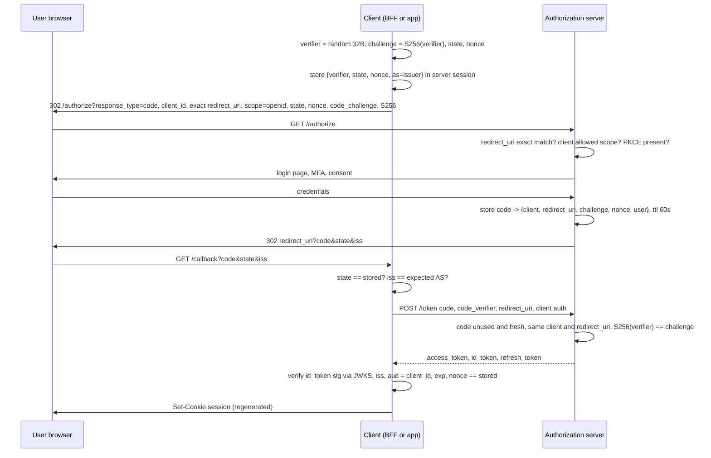

## Bối cảnh & vấn đề

Một app mobile bán hàng đăng nhập bằng OAuth, redirect về `myshop://callback`. Team không dùng PKCE vì "app là của mình, có client secret nhúng sẵn". Một nhà nghiên cứu bảo mật cài thêm một app "đèn pin" lên cùng điện thoại Android, app này cũng khai báo xử lý scheme `myshop://`. Khi người dùng đăng nhập, Android hỏi "mở bằng app nào?", hoặc tệ hơn, chọn app đèn pin. App độc nhận URL `myshop://callback?code=...`, lấy client secret từ chính APK của shop (giải nén là thấy), đổi code lấy token, và có toàn quyền tài khoản người dùng.

Authorization Code là flow chuẩn cho mọi client có người dùng, nhưng nó an toàn hay không phụ thuộc vào từng tham số nhỏ: `state`, `nonce`, `code_challenge`, `redirect_uri` so khớp thế nào, code dùng mấy lần, `iss` có được kiểm tra không. Mỗi tham số chặn một tấn công cụ thể, và bỏ một tham số là mở lại đúng tấn công đó.

Bài này đi qua flow từng bước trên Keycloak thật, giải thích mỗi tham số được tạo ở đâu, được kiểm ở đâu và chống lại cái gì.

## Khái niệm

### Authorization code

**Authorization code** là một chuỗi ngắn hạn, dùng **một lần**, AS trả về qua redirect của browser sau khi user đăng nhập và đồng ý. Code không phải token: nó chỉ là "phiếu" để client đổi lấy token qua **back-channel** (POST trực tiếp từ client tới token endpoint, có TLS, có client authentication nếu confidential). Thiết kế hai bước này giữ token **không bao giờ đi qua URL**: thứ duy nhất đi qua browser là code, và code vô dụng nếu thiếu phần bằng chứng ở bước đổi.

RFC 6749 §4.1.2 khuyến nghị code sống tối đa 10 phút; thực tế các AS dùng 30–60 giây. Code phải dùng một lần; nếu bị dùng lại, AS **nên** revoke các token đã cấp từ code đó (RFC 6749 §10.5), vì việc dùng lại cho thấy code đã lộ.

### PKCE

**PKCE** (RFC 7636, "pixy") ràng buộc code với **chính instance client** đã bắt đầu flow. Client sinh `code_verifier`: chuỗi ngẫu nhiên 43–128 ký tự (thường 32 byte random base64url). Ở bước authorize, client gửi `code_challenge = BASE64URL(SHA256(code_verifier))` và `code_challenge_method=S256`. Ở bước đổi code, client gửi `code_verifier` gốc. AS tính lại SHA-256 và so với challenge đã lưu cùng code.

Attacker chặn được code (app độc cùng scheme, log, referrer, proxy) nhưng không có verifier, vì verifier chưa bao giờ rời client. Hash một chiều nên biết challenge cũng không suy ra verifier. PKCE cũng chống **code injection**: attacker lấy code của chính họ nhét vào callback của nạn nhân; client của nạn nhân gửi verifier của nạn nhân, không khớp challenge của attacker, AS từ chối.

Method `plain` (challenge = verifier) chỉ dành cho client không tính được SHA-256; ngày nay không có lý do dùng. RFC 9700 yêu cầu public client **MUST** dùng PKCE và khuyến nghị cả confidential client dùng; OAuth 2.1 (draft) bắt buộc PKCE cho mọi authorization code flow.

**Interview angle:** "confidential client đã có secret thì PKCE thêm gì?" → secret xác thực **client**, không xác thực **instance flow**. Không có PKCE, attacker có code của nạn nhân có thể nhét vào phiên của chính họ trên client hợp lệ (code injection), và client hợp lệ dùng secret của nó đổi code đó giùm attacker. PKCE gắn code với verifier trong phiên của người khởi tạo.

### `state`

**`state`** là giá trị ngẫu nhiên client tạo, lưu vào phiên browser (cookie/session server-side), gửi kèm authorize và nhận lại nguyên vẹn ở callback. Client so sánh: khác thì từ chối. Nó chống **CSRF ở redirect**: attacker bắt đầu flow bằng tài khoản của họ, lấy code, rồi lừa nạn nhân mở `https://app/callback?code=<code của attacker>`. Không có `state`, app của nạn nhân hoàn tất login vào **tài khoản attacker** (login CSRF), và mọi thứ nạn nhân nhập sau đó (thẻ, địa chỉ) nằm trong tài khoản attacker. Biến thể nguy hiểm hơn: "liên kết tài khoản Google" bị gắn vào tài khoản sai.

`state` cũng thường mang dữ liệu như return URL; khi đó lưu dữ liệu ở server và chỉ đặt một id ngẫu nhiên trong `state`, hoặc ký nó, để attacker không biến nó thành open redirect.

### `nonce`

**`nonce`** (OIDC) là giá trị ngẫu nhiên client gửi trong authorize và AS **chép vào ID token**. Client kiểm tra `nonce` trong ID token khớp với giá trị đã lưu cho phiên này. Nó gắn **ID token** với request, chống ID token bị replay hoặc nhét vào phiên khác. Bắt buộc cho implicit/hybrid flow, khuyến nghị cho code flow.

Ba giá trị nhìn giống nhau nhưng bảo vệ ba thứ khác nhau: `state` bảo vệ **callback** khỏi CSRF, PKCE bảo vệ **code** ở bước đổi token, `nonce` bảo vệ **ID token**. RFC 9700 §2.1 cho phép client dựa vào PKCE thay cho `state` để chống CSRF nếu chắc chắn AS hỗ trợ PKCE, nhưng thực tế dùng cả ba là rẻ và đơn giản (verify phạm vi cho phép trong BCP).

### Redirect URI và exact match

**`redirect_uri`** là nơi AS gửi code. Nếu attacker điều khiển được nơi đó, họ nhận code. AS phải so `redirect_uri` trong request với danh sách đã đăng ký bằng **so khớp chuỗi chính xác** (RFC 9700 §4.1, OAuth 2.1). So khớp prefix, wildcard hay regex đều đã gây ra lỗ hổng thật: prefix cho qua `.../callback/../promo?next=...` kết hợp một open redirect; đăng ký không có path thì `https://shop.example.com.evil.com` cũng khớp prefix. Ngoại lệ duy nhất có trong chuẩn: native app dùng loopback `http://127.0.0.1:{port}` được phép port động (RFC 8252 §7.3).

### Mix-up attack và `iss`

Khi một client tích hợp **nhiều AS** (Google, Microsoft, một AS của đối tác), **mix-up attack** lừa client gửi code nhận được từ AS thật tới token endpoint của **AS do attacker điều khiển** (vì client nhầm response đến từ AS nào). Attacker có được code và có thể đổi nó ở AS thật. **RFC 9207** thêm tham số `iss` vào authorization response; client kiểm tra `iss` khớp với AS mà nó đã gửi request tới (lưu cùng `state`). Keycloak gửi `iss` và quảng bá `authorization_response_iss_parameter_supported: true`, như ví dụ chạy thật bên dưới.

### Native app redirect

App mobile có ba cách nhận redirect (RFC 8252): **custom URI scheme** (`myshop://`, app nào cũng có thể đăng ký trùng), **claimed HTTPS** (Android App Links, iOS Universal Links: OS chỉ giao URL cho app đã chứng minh sở hữu domain qua file `assetlinks.json`/`apple-app-site-association`), và **loopback** cho desktop app. Flow phải mở trong **system browser** (Custom Tabs, `ASWebAuthenticationSession`), không phải WebView nhúng: WebView cho app đọc được mọi thứ user gõ (password, OTP), không chia sẻ phiên SSO với browser, và dạy user nhập password vào app.

## Cơ chế hoạt động



Mỗi kiểm tra nằm ở đâu:

1. **Client trước khi redirect** tạo verifier, `state`, `nonce` và lưu chúng **phía server** (session ẩn danh hoặc cookie tạm đã ký, `HttpOnly`, `SameSite=Lax` để cookie đi theo redirect top-level về callback). Lưu cả issuer mong đợi để kiểm `iss`.
2. **AS ở `/authorize`** kiểm `redirect_uri` khớp chính xác, `client_id` tồn tại, scope được phép, có `code_challenge` (nếu client bắt buộc PKCE).
3. **AS khi phát code** lưu code cùng challenge, redirect_uri, client, nonce và user; TTL ngắn.
4. **Client ở callback** kiểm `state` (chống CSRF) và `iss` (chống mix-up). Không khớp → dừng, không gọi token endpoint.
5. **AS ở `/token`** kiểm code chưa dùng và chưa hết hạn, đúng client đã nhận code, `redirect_uri` giống hệt ở authorize, `SHA256(verifier) == challenge`. Code được đánh dấu đã dùng; dùng lại → revoke những gì đã cấp.
6. **Client sau khi nhận token** verify ID token (chữ ký, `iss`, `aud = client_id`, `exp`, `nonce`) rồi **regenerate** session và đăng nhập user ([bài 1](/tracks/auth-identity/learn/sessions-credentials)).

## Ví dụ thực tế

### PKCE: kiểm bằng test vector của RFC

```ts
import { createHash, randomBytes } from "node:crypto";
const challenge = (v: string) => createHash("sha256").update(v).digest("base64url");
console.log("RFC 7636 verifier ->", challenge("dBjftJeZ4CVP-mB92K27uhbUJU1p1r_wW1gFWFOEjXk"));   // Appendix B
const v = randomBytes(32).toString("base64url");
console.log("fresh verifier", v, `(${v.length} chars) -> challenge`, challenge(v));
```

```text
RFC 7636 verifier -> E9Melhoa2OwvFrEMTJguCHaoeK1t8URWbuGJSstw-cM
fresh verifier bh9ZXuQI8pHSUSIBx557WX2xtWa8narM7UJ0w3HkwF8 (43 chars) -> challenge 4YsKrfs7WaB4iZFX2_wRFXaU0V4CBAh0adgZnVH0MEA
```

Kết quả khớp đúng giá trị trong Appendix B của RFC 7636: đây là cách nhanh nhất để test code PKCE tự viết. 32 byte random cho đúng 43 ký tự, mức tối thiểu của spec.

### Toàn bộ flow trên Keycloak 26.4.7

Realm `shop`, client public `spa` có `pkce.code.challenge.method = S256`, redirect URI đăng ký `http://localhost:3000/callback`. Script Node 24 đóng vai browser (giữ cookie, submit form login) và client:

```ts
const verifier = b64u(randomBytes(32)), challenge = b64u(createHash("sha256").update(verifier).digest());
const state = b64u(randomBytes(16)), nonce = b64u(randomBytes(16));
const q = new URLSearchParams({ response_type: "code", client_id: "spa", redirect_uri: REDIRECT, scope: "openid email",
  state, nonce, code_challenge: challenge, code_challenge_method: "S256" });
const r1 = await fetch(`${disc.authorization_endpoint}?${q}`, { redirect: "manual" });     // login page + cookies
const r2 = await fetch(formAction, { method: "POST", redirect: "manual", headers: { cookie }, body: "username=alice&password=alice-pass" });
const loc = new URL(r2.headers.get("location")!);                                          // the callback
```

Discovery cho biết những gì AS hỗ trợ:

```text
discovery: { issuer: 'http://localhost:58080/realms/shop', ..., code_challenge_methods_supported: [ 'plain', 'S256' ],
  authorization_response_iss_parameter_supported: true, backchannel_logout_supported: true }
```

Callback và các phép thử ở token endpoint:

```text
callback: http://localhost:3000/callback { state: 'KGTottCVHYZsTbXMxJBcjg', session_state: '0fb93874-…', iss: 'http://localhost:58080/realms/shop', code: '3be1c82b-a34…' }
state matches: true
token with WRONG verifier -> 400 { error: 'invalid_grant', error_description: 'PKCE verification failed: Code mismatch' }
token with right verifier -> 200 [ 'access_token', 'expires_in', 'refresh_expires_in', 'refresh_token', 'token_type', 'id_token', 'not-before-policy', 'session_state', 'scope' ]
same code again -> 400 { error: 'invalid_grant', error_description: 'Code not valid' }
```

Và authorize **không** có `code_challenge`:

```text
### authorize without code_challenge -> 302 http://localhost:3000/callback?error=invalid_request&error_description=Missing+parameter%3A+code_challenge_method&state=O7I6e87vK6u0DJzS8_7vEg&iss=http%3A%2F%2Flocalhost%3A58080%2Frealms%2Fshop
```

Đọc kết quả: callback có `iss` (RFC 9207) để client kiểm chống mix-up. Verifier sai bị từ chối dù code đúng: đây là thứ chặn app đèn pin trong câu chuyện mở bài. Code dùng lần hai bị từ chối, và (chạy thêm) refresh token cấp từ lần đổi đầu tiên cũng bị vô hiệu ngay sau lần replay:

```text
### code replay -> 400 Code not valid | then refresh with the RT from the first exchange -> 400 Session doesn't have required client
```

Keycloak làm đúng khuyến nghị RFC 6749 §10.5: code bị dùng lại thì thu hồi những gì đã cấp từ nó.

### Redirect URI: prefix vs exact

```ts
const registered = ["https://shop.example.com/callback"];
const prefix = (u: string) => registered.some((a) => u.startsWith(a));
const exact = (u: string) => registered.includes(u);
const loose = ["https://shop.example.com"];                 // a client that registered only the origin
```

```text
prefix=true  prefix(no-path reg)=true  exact=true  https://shop.example.com/callback
prefix=true  prefix(no-path reg)=true  exact=false https://shop.example.com/callback/../promo?next=https://evil.com
prefix=true  prefix(no-path reg)=true  exact=false https://shop.example.com/callback?next=//evil.com
prefix=false prefix(no-path reg)=true  exact=false https://shop.example.com.evil.com/cb
https://shop.example.com/promo?next=https://evil.com
```

Dòng cuối là cách browser chuẩn hoá URL thứ hai: `/callback/../promo` thành `/promo`. Nếu `/promo` có open redirect theo tham số `next`, code (nằm trong query của redirect) đi tiếp tới `evil.com`, hoặc lộ qua header `Referer` khi trang tải tài nguyên bên ngoài. Client đăng ký chỉ origin còn tệ hơn: domain của attacker `shop.example.com.evil.com` khớp prefix và nhận code trực tiếp.

Keycloak (redirect URI đăng ký không wildcard) từ chối cả ba biến thể:

```text
200  http://localhost:3000/callback
400 Invalid parameter: redirect_uri http://localhost:3000/callback/../promo
400 Invalid parameter: redirect_uri http://localhost:3000/callback?next=//evil.com
400 Invalid parameter: redirect_uri http://localhost:3000.evil.com/callback
```

Keycloak vẫn cho phép wildcard (`http://localhost:3000/*`) nếu admin cấu hình như vậy, và nhiều hướng dẫn (kể cả ghi chú Keycloak của tác giả) dùng wildcard cho tiện. Wildcard đưa lại đúng lớp lỗ hổng trên; production chỉ đăng ký URI đầy đủ.

### Preview deployment không cần wildcard (minh hoạ)

Mỗi PR có domain riêng (`pr-123.preview.shop.dev`), không thể đăng ký trước. Thay vì wildcard: dùng **một** callback cố định trên domain ổn định (`auth.preview.shop.dev/callback`), lưu return URL (preview domain) trong state phía server, sau khi login thì chuyển phiên sang preview bằng một one-time token ngắn hạn; hoặc đăng ký redirect URI qua API của IdP trong pipeline tạo preview và xoá khi đóng PR.

## Trade-offs & lựa chọn thay thế

| Tham số | Tạo ở | Kiểm ở | Chống | Thiếu thì |
| --- | --- | --- | --- | --- |
| `state` | Client | Client, ở callback | CSRF ở redirect, login CSRF | Nạn nhân đăng nhập vào tài khoản attacker |
| `code_challenge`/`verifier` | Client | AS, ở token endpoint | Code interception, code injection | Code bị chặn là đổi được token |
| `nonce` | Client | Client, trong ID token | ID token replay/injection | ID token cũ nhét được vào phiên mới |
| `redirect_uri` exact | Đăng ký trước | AS, ở authorize và token | Code gửi tới nơi attacker kiểm soát | Code rò qua open redirect/domain giả |
| `iss` (RFC 9207) | AS | Client, ở callback | Mix-up giữa nhiều AS | Code gửi nhầm token endpoint của attacker |
| Code một lần + TTL ngắn | AS | AS | Replay code | Code bị lộ dùng được nhiều lần |

| Kiểu redirect cho mobile | Ai nhận được | Đánh giá |
| --- | --- | --- |
| Custom scheme `myshop://` | Mọi app đăng ký cùng scheme | Chỉ an toàn khi có PKCE |
| Claimed HTTPS (App Links/Universal Links) | Chỉ app đã verify domain | Khuyến nghị |
| Loopback `127.0.0.1:{port}` | Process đang listen port | Cho desktop/CLI |

Chọn thế nào: luôn dùng cả `state`, PKCE (S256) và `nonce` (khi có OIDC) vì chúng rẻ và chồng lớp cho nhau. Mobile dùng claimed HTTPS + PKCE + system browser; không nhúng secret vào app. Với client tích hợp nhiều IdP, kiểm `iss` ở callback hoặc dùng redirect URI riêng cho từng IdP.

## Edge cases & failure modes

- **Cookie lưu `state`/verifier bị chặn**: `SameSite=Strict` làm cookie không đi theo redirect từ AS về (cross-site) → mọi callback "state mismatch". Dùng `Lax` cho cookie tạm của flow.
- **User mở hai tab đăng nhập**: tab thứ hai ghi đè `state`/verifier của tab đầu nếu chỉ lưu một bộ → tab đầu thất bại. Lưu theo khoá `state` (nhiều flow song song).
- **Back button sau login**: browser load lại callback với code đã dùng → `invalid_grant`. Callback nên redirect ngay sang trang đích (PRG) và xử lý lỗi này nhẹ nhàng.
- **Clock skew khi verify ID token** ở bước cuối: xem [bài 2](/tracks/auth-identity/learn/jwt-signing-verification).
- **PKCE downgrade**: AS chấp nhận `code_verifier` ở token endpoint dù authorize không có challenge, hoặc ngược lại bỏ qua challenge đã lưu. AS phải bắt buộc verifier khi code được tạo với challenge, và từ chối verifier khi không có challenge (RFC 9700 §2.1.1, verify chi tiết).
- **Redirect URI khác nhau một ký tự** (slash cuối, http vs https, port): exact match từ chối; đó là đúng, sửa cấu hình thay vì nới lỏng matching.
- **Embedded WebView**: Google và nhiều IdP chặn đăng nhập trong WebView; SSO với browser không hoạt động.

## Pitfalls

- ❌ Bỏ PKCE vì "đã có client secret" → ✅ PKCE cho mọi client; secret không bảo vệ khỏi code injection và không tồn tại thật ở public client.
- ❌ `code_challenge_method=plain` → ✅ `S256`.
- ❌ So khớp redirect URI bằng prefix/wildcard/regex → ✅ exact string match; loopback cho native là ngoại lệ có chuẩn.
- ❌ Không kiểm `state` ở callback → ✅ so với giá trị đã lưu phía server, dùng một lần.
- ❌ Nhận ID token nhưng không kiểm `nonce` → ✅ kiểm và xoá nonce khỏi phiên sau khi dùng.
- ❌ Custom scheme cho mobile, không PKCE → ✅ claimed HTTPS + PKCE + system browser.
- ❌ Bỏ qua `iss` khi tích hợp nhiều IdP → ✅ kiểm `iss` theo RFC 9207 hoặc redirect URI riêng mỗi IdP.

## Tóm tắt

- Authorization code đi qua browser, token đi qua back-channel; code ngắn hạn, dùng một lần, replay thì AS thu hồi token đã cấp (Keycloak làm vậy).
- PKCE: `challenge = BASE64URL(SHA256(verifier))`, S256; verifier không rời client nên code bị chặn là vô dụng; chống cả interception lẫn injection.
- `state` chống CSRF ở callback, PKCE bảo vệ code, `nonce` bảo vệ ID token; dùng cả ba.
- Redirect URI so khớp chính xác; prefix cộng một open redirect là đủ rò code.
- `iss` trong authorization response (RFC 9207) chống mix-up khi có nhiều AS.
- Mobile: claimed HTTPS redirect, system browser, PKCE, không nhúng secret.
