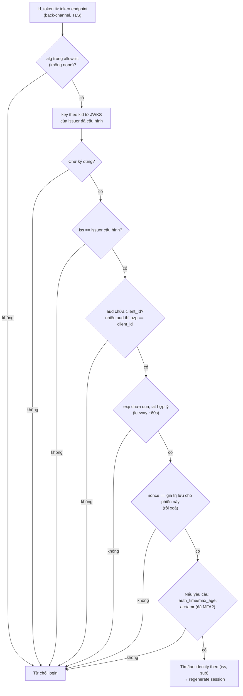
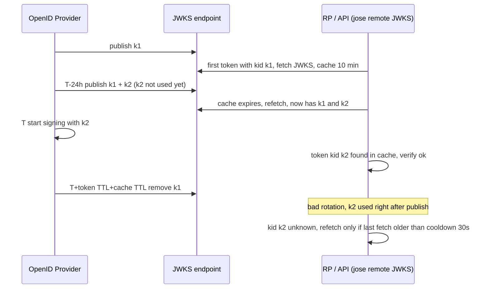

## Bối cảnh & vấn đề

Đầu những năm 2010, nhiều app làm "Đăng nhập bằng Facebook" như sau: frontend chạy OAuth, nhận **access token** của Facebook, gửi nó cho backend; backend gọi Graph API `/me` bằng token đó, lấy `id` và đăng nhập user có `id` tương ứng. Nghe hợp lý. Vấn đề: access token của Facebook không ghi nó được cấp **cho app nào**. Một app quiz độc hại thu access token của người dùng nó (họ tự nguyện đăng nhập chơi quiz), rồi gửi chính token đó tới backend của app bạn. Backend gọi `/me`, thấy đúng `id` của nạn nhân, và đăng nhập attacker vào tài khoản nạn nhân. Đây là **token substitution / confused deputy**.

OAuth chỉ nói "người cầm token này được gọi API X". Nó không có định dạng chuẩn cho "ai vừa đăng nhập", không ràng buộc token với client, và mỗi provider trả thông tin user một kiểu. **OpenID Connect** (OIDC, 2014) là lớp mỏng chuẩn hoá danh tính trên OAuth 2.0: một **ID token** dạng JWT đã ký, có `aud` là client của bạn và `nonce` gắn với request; discovery để tự cấu hình; JWKS để lấy key verify; userinfo endpoint chuẩn.

Bài này giải thích ID token, cách verify nó, discovery và JWKS (kèm mô phỏng key rotation thật với jose), và áp vào trường hợp phổ biến nhất: Sign in with Google.

## Khái niệm

### OIDC thêm gì lên OAuth

OIDC tái dùng flow của OAuth (thường là Authorization Code + PKCE, [bài 5](/tracks/auth-identity/learn/authorization-code-pkce)) và thêm:

- Scope **`openid`**: báo đây là request OIDC; có nó thì AS trả thêm `id_token`. Scope chuẩn khác: `profile`, `email`, `address`, `phone`, `offline_access` (xin refresh token).
- **ID token**: JWT ký bởi **OpenID Provider (OP)**, dành cho **Relying Party (RP)** (app của bạn) đọc.
- **UserInfo endpoint**: gọi bằng access token để lấy thêm claims chuẩn.
- **Discovery** (`/.well-known/openid-configuration`) và **JWKS** (`jwks_uri`).
- Các chuẩn đi kèm: session management và logout (RP-initiated, front-channel, back-channel, [bài 9](/tracks/auth-identity/learn/sso-saml-federation)), dynamic client registration.

Thuật ngữ: **OP** = authorization server có OIDC (Google, Entra ID, Keycloak, Okta); **RP** = client dùng OP để đăng nhập.

**Interview angle:** "login bằng OAuth thuần nguy hiểm vì sao?" → access token không dành cho client đọc và không có audience là client, nên token cấp cho app khác đem sang app bạn vẫn "hợp lệ". ID token có `aud = client_id` và `nonce`.

### ID token

**ID token** là JWT với các claim bắt buộc: `iss` (OP), `sub` (định danh user, duy nhất và ổn định trong phạm vi `iss`), `aud` (chứa `client_id` của RP), `exp`, `iat`; thêm `nonce` nếu request có gửi, `auth_time` khi có `max_age`, `acr`/`amr` (mức xác thực, phương thức: `pwd`, `mfa`, `hwk`), `azp` (authorized party) khi có nhiều audience. Có thể kèm claims profile như `email`, `email_verified`, `name`.

ID token là **bằng chứng một sự kiện xác thực** gửi cho client: "user `sub` vừa đăng nhập ở OP `iss`, cho client `aud`, lúc `auth_time`". Client verify nó, rồi tạo **session của riêng client** (cookie). ID token không phải session và không phải access token.

### ID token khác access token

| | ID token | Access token |
| --- | --- | --- |
| Audience | Client (`aud = client_id`) | Resource server/API |
| Ai đọc | Client đọc và verify | Client coi là **opaque**, chỉ gắn vào header; API đọc |
| Định dạng | Luôn là JWT | JWT (RFC 9068, `typ: at+jwt`) hoặc opaque |
| Dùng để | Biết ai vừa đăng nhập, tạo session | Gọi API |
| Gửi cho API? | Không | Có |

Sai lầm thường gặp: gửi ID token làm bearer cho API của mình ("nó cũng là JWT có chữ ký mà"); client parse access token để lấy thông tin user (access token có thể đổi định dạng bất cứ lúc nào, và nó không dành cho client); API chấp nhận ID token vì chữ ký hợp lệ. API chặn được ID token bằng cách kiểm `aud` (ID token có `aud = client_id`, không phải tên API) và `typ` (`at+jwt` theo RFC 9068; Keycloak dùng `typ` trong payload: `Bearer` vs `ID`).

### Discovery

OP công bố một JSON tại `{issuer}/.well-known/openid-configuration`: `issuer`, `authorization_endpoint`, `token_endpoint`, `userinfo_endpoint`, `jwks_uri`, `end_session_endpoint`, thuật toán hỗ trợ, `code_challenge_methods_supported`... RP chỉ cần cấu hình **issuer** và `client_id`; còn lại tự đọc. Quy tắc quan trọng: giá trị `issuer` trong document phải **đúng bằng** issuer bạn cấu hình (OIDC Discovery §4.3), và mọi ID token phải có `iss` đúng bằng giá trị đó.

### JWKS và `kid`

**JWKS** (JSON Web Key Set, RFC 7517) là danh sách public key của OP, mỗi key có `kid`, `kty`, `alg`, `use`. Header ID token có `kid` cho biết key nào đã ký. RP tải JWKS, cache, chọn key theo `kid`, verify.

**Key rotation** đúng cách có hai phía. OP: publish key mới vào JWKS **trước** khi dùng nó để ký (vài giờ tới vài ngày), sau đó mới chuyển sang ký bằng key mới, và giữ key cũ trong JWKS tới khi mọi token ký bằng nó đã hết hạn (ít nhất bằng TTL dài nhất của token, cộng thời gian cache JWKS của RP). Google luôn publish hai key song song. RP: cache JWKS có TTL, khi gặp `kid` lạ thì **refetch một lần**, có **cooldown** để attacker gửi hàng loạt `kid` rác không ép bạn gọi OP liên tục. Không hardcode public key.

**Interview angle:** "vì sao JWKS URL phải lấy từ cấu hình, không từ token?" Token do ai cũng tạo được trước khi verify; nếu token chọn được JWKS, attacker chọn JWKS của họ ([bài 2](/tracks/auth-identity/learn/jwt-signing-verification)).

### Định danh user bằng `(iss, sub)`

`sub` chỉ duy nhất **trong phạm vi một issuer**: `sub` "12345" ở Google và "12345" ở Entra ID là hai người khác nhau. Khoá định danh đúng là cặp `(iss, sub)`, lưu trong một bảng `identities` tách khỏi `users`. **Email** không phải khoá: email đổi được, có thể chưa verify, có thể được tái cấp cho người khác (công ty cấp lại địa chỉ của nhân viên cũ), và một số IdP cho phép user tự đặt `email` mà không verify. Dùng email để tự động liên kết tài khoản mở ra account takeover ([bài 10](/tracks/auth-identity/learn/mfa-passkeys-account-linking)).

## Cơ chế hoạt động

### Verify ID token

Đây là checklist của OIDC Core §3.1.3.7, theo thứ tự:



Diễn giải: khi nhận ID token qua token endpoint trong code flow, kênh đã được TLS bảo vệ, nhưng vẫn phải verify chữ ký vì ID token có thể bị lưu, chuyển tiếp, hoặc đến từ frontend (Google Identity Services). Thứ tự giống [bài 2](/tracks/auth-identity/learn/jwt-signing-verification), cộng thêm `nonce` và các claim về mức xác thực. Bước cuối dùng `(iss, sub)` để tra bảng identities, không dùng email.

### Key rotation qua JWKS



Rotation đúng không bao giờ làm RP thấy `kid` lạ, vì key mới đã nằm trong cache trước khi được dùng. Refetch-on-unknown-kid là lưới an toàn cho rotation khẩn cấp (key bị lộ) hoặc OP làm sai; cooldown giới hạn tần suất refetch, nên trong 30 giây đầu sau một lần fetch, `kid` mới vẫn bị từ chối.

## Ví dụ thực tế

### Discovery và JWKS của Google (lấy thật ngày 2026-10-01)

```bash
curl -s https://accounts.google.com/.well-known/openid-configuration | jq '{issuer, jwks_uri, id_token_signing_alg_values_supported, code_challenge_methods_supported}'
curl -sI https://www.googleapis.com/oauth2/v3/certs | grep -i cache-control
curl -s https://www.googleapis.com/oauth2/v3/certs | jq '[.keys[] | {kid, alg, kty, use}]'
```

```text
{ "issuer": "https://accounts.google.com", "jwks_uri": "https://www.googleapis.com/oauth2/v3/certs",
  "id_token_signing_alg_values_supported": [ "RS256" ], "code_challenge_methods_supported": [ "plain", "S256" ] }
cache-control: public, max-age=22704, must-revalidate, no-transform
[ { "kid": "943a3a5d7d919625a454e489b75c29adab57acba", "alg": "RS256", "kty": "RSA", "use": "sig" },
  { "kid": "f10f87405a979c1df36df26606734f33cd85c271", "alg": "RS256", "kty": "RSA", "use": "sig" } ]
```

Google publish **hai** key cùng lúc (overlap cho rotation) và cho phép cache ~6,3 giờ. Allowlist cho Google chỉ cần `RS256`. Google ghi chú rằng `iss` của ID token có thể là `https://accounts.google.com` **hoặc** `accounts.google.com` (verify theo tài liệu Google), nên cấu hình issuer cho Google phải chấp nhận đúng hai giá trị này, không nới lỏng hơn.

### ID token và access token từ Keycloak 26.4.7

Từ flow Authorization Code + PKCE ở [bài 5](/tracks/auth-identity/learn/authorization-code-pkce), decode payload hai token:

```text
access_token claims: { iss: 'http://localhost:58080/realms/shop', aud: 'account', azp: 'spa', typ: 'Bearer',
  scope: 'openid profile email', exp: 1790822600, iat: 1790822300, sid: '595ee0ab-…',
  realm_access: { roles: [ 'offline_access', 'default-roles-shop', 'uma_authorization' ] } }
id_token claims: { iss: 'http://localhost:58080/realms/shop', aud: 'spa', azp: 'spa', typ: 'ID',
  sub: 'f528031a-0774-43cf-b63c-c08bb5187665', nonce: '6ZArqRAYQHglv2M13kpePw', email: 'alice@shop.test',
  email_verified: true, at_hash: 'LGRS2MamlYyvZzBaU2P3JQ', sid: '595ee0ab-…' }
access_token header: { alg: 'RS256', typ: 'JWT', kid: 'HbVOVYTdOnTrI-Sde3VaZ3AeP6knqzmOYz7YR7NYjjI' }
```

```ts
const JWKS = jose.createRemoteJWKSet(new URL(disc.jwks_uri));
const { payload } = await jose.jwtVerify(tokens.id_token, JWKS, { issuer: disc.issuer, audience: "spa", algorithms: ["RS256"] });
if (payload.nonce !== session.nonce) throw new Error("nonce mismatch");
```

```text
id_token verified; nonce check would compare 6ZArqRAYQHglv2M13kpePw with the nonce stored for login #2
```

ID token có `aud: 'spa'` (client) và `nonce`; access token có `aud: 'account'`. Một API kiểm `aud` đúng tên mình sẽ từ chối **cả hai** token này cho tới khi bạn thêm audience mapper, đó là điều nên có. Keycloak ghi loại token trong claim `typ` (`Bearer`/`ID`) chứ không theo `typ: at+jwt` ở header như RFC 9068; khi dùng Keycloak, phân biệt bằng `aud` và claim `typ`. `at_hash` cho phép client kiểm access token đi cùng đúng là cặp với ID token (bắt buộc ở hybrid flow).

### Mô phỏng rotation: remote JWKS vs key hardcode

Một server JWKS cục bộ, verifier dùng `createRemoteJWKSet` (jose 6.2.12; mặc định `cacheMaxAge` 10 phút, `cooldownDuration` 30 giây, không đọc `Cache-Control`), so với một verifier "copy key một lần". Bản chạy này đặt cooldown 2 giây để thấy hiệu ứng nhanh:

```ts
const JWKS = jose.createRemoteJWKSet(url, { cooldownDuration: 2_000, cacheMaxAge: 600_000 });
const hardcoded = k1.publicKey;
await check("t=0   token(k1)", await sign(k1));
published = [k1, k2];                                  // IdP rotates WITHOUT pre-publishing
await check("t=0   IdP signs with k2 immediately", await sign(k2));
await sleep(2100);
await check("t=2.1s after cooldown: token(k2)", await sign(k2));
```

```text
t=0   token(k1)                              remoteJWKS=ok                           hardcoded=ok                             jwks_fetches=1
t=0   token(k1) again (cached)               remoteJWKS=ok                           hardcoded=ok                             jwks_fetches=1
t=0   IdP signs with k2 immediately          remoteJWKS=ERR_JWKS_NO_MATCHING_KEY     hardcoded=ERR_JWS_SIGNATURE_VERIFICATION_FAILED jwks_fetches=1
t=0   k3 appears seconds later (cooldown)    remoteJWKS=ERR_JWKS_NO_MATCHING_KEY     hardcoded=ERR_JWS_SIGNATURE_VERIFICATION_FAILED jwks_fetches=1
t=2.1s after cooldown: token(k2)             remoteJWKS=ok                           hardcoded=ERR_JWS_SIGNATURE_VERIFICATION_FAILED jwks_fetches=2
t=2.1s token(k3)                             remoteJWKS=ok                           hardcoded=ERR_JWS_SIGNATURE_VERIFICATION_FAILED jwks_fetches=2
```

Ba bài học từ lần chạy: (1) key hardcode **không bao giờ** hồi phục, cần deploy lại; (2) remote JWKS hồi phục sau cooldown với **một** lần fetch; (3) trong cửa sổ cooldown (mặc định 30 giây kể từ lần fetch trước), `kid` mới vẫn bị từ chối. Nếu IdP rotate không có overlap đúng lúc vừa có một lần fetch, bạn sẽ thấy tối đa 30 giây 401.

### Sự cố "no matching key found" lúc 10:05

IdP rotate lúc 10:00, mọi API trả 401 từ 10:05. Các nguyên nhân khả dĩ, theo thứ tự hay gặp: verifier **cache JWKS vô thời hạn** (tự viết, đọc một lần lúc khởi động) hoặc hardcode public key; không refetch khi gặp `kid` lạ; JWKS bị cache ở **CDN/proxy** với TTL dài; IdP dùng key mới **ngay** khi publish (không overlap) hoặc **gỡ** key cũ ngay (token cũ còn hạn bị từ chối); cooldown/TTL cấu hình quá dài. Độ trễ 5 phút thường là dấu hiệu access token TTL: token cũ (k1) vẫn chạy được tới khi hết hạn, token mới (k2) thất bại.

Chữa ngay: flush cache JWKS/restart verifier, hoặc nhờ IdP tạm ký lại bằng key cũ nếu còn. Chữa lâu dài: thư viện JWKS có cache + refetch-on-unknown-kid + cooldown; quy trình rotation của IdP publish key mới trước N giờ (≥ TTL cache JWKS của mọi RP) và giữ key cũ ≥ TTL token dài nhất; metric 401 theo **lý do** (`no_matching_key`, `expired`, `bad_audience`) để biết ngay; chạy thử rotation trên staging.

### Sign in with Google: flow, kiểm tra, mapping (minh hoạ)

Hai cách tích hợp phổ biến. **Authorization Code + PKCE phía server** (BFF/backend làm client): bạn kiểm soát `state`, `nonce`, nhận refresh token Google nếu cần gọi Google API. **Google Identity Services** (nút "Sign in with Google"/One Tap): frontend nhận thẳng ID token (credential) và POST cho backend; backend verify ID token, không có code flow. Cách thứ hai đơn giản nhưng ID token đi qua frontend, nên backend phải verify đủ và chống CSRF cho endpoint nhận credential (GIS dùng double-submit cookie `g_csrf_token`, verify).

```ts
const GOOGLE = jose.createRemoteJWKSet(new URL("https://www.googleapis.com/oauth2/v3/certs"));
const { payload: g } = await jose.jwtVerify(idToken, GOOGLE, {
  issuer: ["https://accounts.google.com", "accounts.google.com"], audience: GOOGLE_CLIENT_ID, algorithms: ["RS256"] });
if (g.nonce !== expectedNonce) throw new Unauthorized();                 // when you sent one
if (requireWorkspace && g.hd !== "acme.com") throw new Forbidden();      // hd = Workspace domain, not a security boundary alone
const identity = await identities.findOrCreate({ iss: "https://accounts.google.com", sub: g.sub }, {
  email: g.email, emailVerified: g.email_verified === true });
// a brand new identity gets a user but NO tenant membership until invited/approved
```

Kiểm `hd` một mình không đủ để giới hạn công ty: `hd` chỉ có khi tài khoản thuộc Google Workspace của domain đó; tài khoản Gmail cá nhân không có `hd`, nên phải **bắt buộc** `hd` tồn tại và đúng, không chỉ "nếu có thì đúng". Và vẫn cần membership trong tenant: thuộc domain không có nghĩa là thuộc tenant. Token Google chỉ lưu khi thật sự cần gọi Google API; refresh token của Google lưu mã hoá (KMS).

## Trade-offs & lựa chọn thay thế

| Quyết định | Phương án A | Phương án B | Ghi chú |
| --- | --- | --- | --- |
| Lấy thông tin user | Claims trong ID token | Gọi UserInfo | ID token: không thêm round trip; UserInfo: dữ liệu mới nhất, ID token gọn |
| Tích hợp Google | Code + PKCE phía server | Google Identity Services (ID token ở frontend) | Server-side kiểm soát nhiều hơn, cần khi gọi Google API |
| Verify key | Remote JWKS (cache + refetch) | Key hardcode/cấu hình tĩnh | Tĩnh chỉ khi rotation hiếm và có quy trình deploy kèm |
| Cache JWKS | TTL ngắn (vài phút) | TTL dài (giờ) | Ngắn: rotation khẩn cấp nhanh; dài: ít phụ thuộc OP |
| Khoá user | `(iss, sub)` | Email | Email chỉ là thuộc tính, không phải khoá |
| Nhiều IdP | Một broker (Keycloak/Auth0) | App nói chuyện trực tiếp với từng IdP | Broker: app chỉ biết một issuer ([bài 9](/tracks/auth-identity/learn/sso-saml-federation)) |

Chọn thế nào: app có backend → code flow phía server, verify ID token đầy đủ, tạo session cookie. Chỉ cần đăng nhập Google đơn giản, không gọi Google API → GIS cũng được, miễn backend verify như trên. Luôn dùng thư viện OIDC/JWKS đã kiểm chứng (`openid-client`, `jose`, Spring Security, AppAuth) thay vì tự parse.

## Edge cases & failure modes

- **Issuer có/không có slash cuối**: `https://idp/realms/shop` khác `https://idp/realms/shop/`; so khớp chính xác làm login thất bại ngay sau khi đổi cấu hình. Copy issuer từ discovery.
- **Issuer khác nhau giữa mạng trong và ngoài**: Keycloak trong Docker phát `iss = http://keycloak:8080/...` cho request nội bộ và `http://localhost:8080/...` cho browser → API thấy `iss` sai. Cấu hình `KC_HOSTNAME` cố định.
- **Nhiều audience**: `aud: ["spa", "orders-api"]` thì phải kiểm `azp == client_id`.
- **`email_verified` vắng mặt hoặc false**: đừng dùng email đó để liên kết hay gửi link đặt lại password.
- **JWKS endpoint chậm/sập**: lần verify đầu sau khi cache hết hạn bị treo. Có timeout (jose mặc định 5 giây) và chấp nhận dùng cache cũ thêm một lúc (stale-if-error) nếu thư viện cho phép.
- **Attacker spam `kid` ngẫu nhiên**: không có cooldown thì mỗi request kéo theo một lần fetch JWKS → tự DDoS OP. Cooldown và rate limit.
- **ID token hết hạn sau khi login**: bình thường. ID token không cần còn hạn sau khi đã tạo session; đừng "refresh ID token" để giữ phiên.
- **`id_token_hint` ở logout** dùng ID token đã hết hạn: hợp lệ theo spec RP-Initiated Logout (verify với OP cụ thể).

## Pitfalls

- ❌ Login bằng access token gọi `/me` → ✅ OIDC, verify ID token với `aud = client_id` và `nonce`.
- ❌ Gửi ID token cho API làm bearer → ✅ API nhận access token có `aud` là API; chặn ID token bằng `aud`/`typ`.
- ❌ Client parse access token để lấy thông tin user → ✅ dùng ID token hoặc UserInfo.
- ❌ Bỏ kiểm `nonce` → ✅ kiểm và xoá sau khi dùng.
- ❌ Hardcode public key của IdP → ✅ remote JWKS có cache, refetch theo `kid`, cooldown.
- ❌ Khoá user bằng email hoặc chỉ bằng `sub` → ✅ `(iss, sub)` trong bảng identities.
- ❌ Giới hạn Workspace bằng "nếu có `hd` thì phải đúng" → ✅ bắt buộc `hd` tồn tại và đúng, cộng membership tenant.

## Tóm tắt

- OIDC = OAuth 2.0 + ID token, scope `openid`, UserInfo, discovery, JWKS, chuẩn logout.
- ID token dành cho client (`aud = client_id`), bằng chứng một lần đăng nhập; access token dành cho API, client coi là opaque.
- Verify ID token: alg allowlist → key theo `kid` từ JWKS của issuer cấu hình → chữ ký → `iss` → `aud`/`azp` → `exp`/`iat` → `nonce` → `acr`/`auth_time` nếu cần.
- Định danh user bằng `(iss, sub)`, không bằng email.
- Rotation đúng: OP publish trước, giữ key cũ đủ lâu; RP cache JWKS, refetch khi gặp `kid` lạ, có cooldown (jose: 30 giây, cache 10 phút).
- Key hardcode không bao giờ hồi phục sau rotation; 401 hàng loạt sau rotation gần như luôn là cache/hardcode/không overlap.
- Google: issuer chấp nhận hai dạng, chỉ RS256, `hd` phải bắt buộc nếu giới hạn Workspace, user mới chưa có membership tenant.
