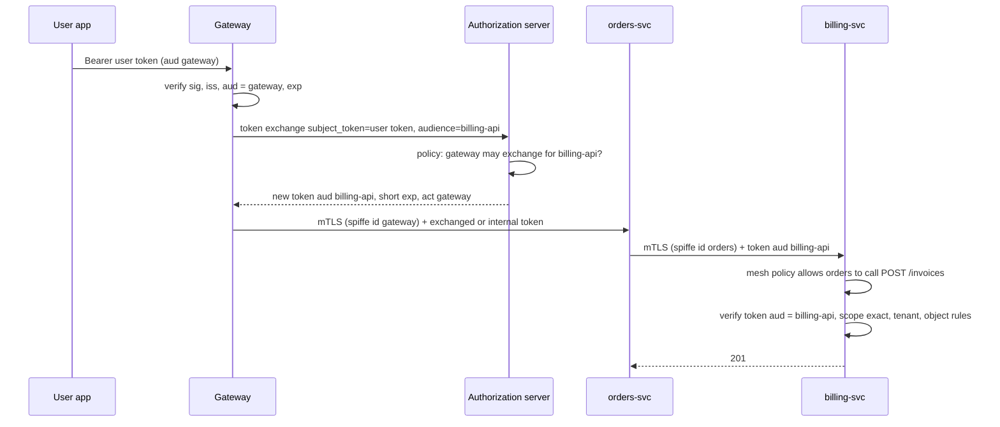
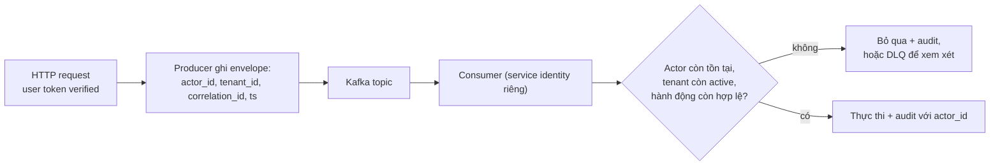

## Bối cảnh & vấn đề

Một platform có hai API dùng chung một IdP: `analytics-api` (dashboard báo cáo) và `billing-api` (hoá đơn, hoàn tiền). Một vendor tích hợp dashboard được cấp token có `aud: analytics-api`, `scope: analytics:read`. Một ngày, log billing cho thấy vendor đó đọc hoá đơn của khách. Không có lỗ hổng nào ở IdP: billing verify chữ ký, kiểm `iss`, rồi kiểm "scope có chứa `read` không". Token của analytics có chữ ký đúng, issuer đúng, và chuỗi `analytics:read` chứa `read`.

Khi một hệ thống có nhiều resource server, câu hỏi "token này hợp lệ không" không còn đủ. Phải hỏi "token này **dành cho tôi** không", "**ai** đang gọi tôi (service nào)", và "đang hành động **thay mặt ai** (user nào)". Ba câu hỏi đó tương ứng với `aud`, service identity (mTLS, client credentials), và identity propagation (forward token, token exchange, JWT nội bộ). Trộn chúng lại là nguồn gốc của confused deputy: một service hợp lệ bị lợi dụng để làm điều mà người gọi thật không được phép.

## Khái niệm

### Audience và confused deputy

**`aud`** liệt kê resource server mà token dành cho. Mỗi API phải kiểm tên mình nằm trong `aud`. Thiếu bước này, mọi access token hợp lệ của cùng IdP (cấp cho API khác, cho app bên thứ ba, thậm chí ID token nếu cùng key) đều được chấp nhận: đó là **token substitution**. Một service nhận được token của user (analytics) mà bị compromise có thể dùng chính token đó gọi billing: billing trở thành **confused deputy**, làm việc với thẩm quyền mà người gọi thật không nên có.

**Scope** cũng phải so khớp **chính xác**. Theo RFC 6749, `scope` là danh sách cách nhau bởi khoảng trắng; tách ra rồi so phần tử. `scope.includes("read")` trên chuỗi khớp cả `analytics:read`, `unread`, `readonly-admin`.

Muốn token có đúng audience, client phải nói với AS nó định gọi API nào: **resource indicators** (RFC 8707, tham số `resource=https://billing.example.com`), hoặc tham số `audience` riêng của IdP (Auth0), hoặc audience mapper theo client (Keycloak). Kiểm thêm `typ: at+jwt` (RFC 9068) để loại ID token.

### Forward token của user

Cách đơn giản nhất để service A gọi service B thay mặt user: A **chuyển tiếp nguyên access token** của user. B verify như bình thường và biết user là ai. Vấn đề: token phải có `aud` chứa cả B (hoặc một audience rộng kiểu "internal-apis", tức là mọi service chấp nhận mọi token), và B nhận **toàn bộ** quyền của token, kể cả scope chỉ dành cho A. Nếu A bị compromise, mọi token đi qua A dùng được ở mọi service. Hợp với hệ thống nhỏ, ít service, cùng một ranh giới tin cậy.

### Token exchange (RFC 8693)

**Token exchange** cho A đổi token của user (`subject_token`) lấy một token **mới** từ AS: `aud` hẹp (chỉ B), scope hẹp, thời hạn ngắn. Token mới có thể mang claim **`act`** (actor) ghi "A đang hành động thay `sub`", để B và audit log thấy cả user lẫn service trung gian. AS là nơi áp chính sách: A có được phép đổi token cho audience B không (`may_act`, policy theo client).

Lợi ích: least privilege từng hop, audit rõ, B không phải tin mọi thứ A nhận được. Cái giá: thêm một round trip tới AS ở mỗi hop (cache theo user + audience trong thời hạn token), và AS phải hỗ trợ (Keycloak có "standard token exchange" từ bản 26.2, verify).

### JWT nội bộ ký bởi gateway

**Internal signed context**: gateway verify token bên ngoài (hoặc introspect opaque token), rồi phát một **JWT nội bộ** rất ngắn (30–60 giây) chứa `sub`, `tenant`, các quyền đã resolve, ký bằng key nội bộ; service phía sau verify JWT nội bộ (một JWKS nội bộ) thay vì token bên ngoài. Kết hợp với **mTLS** giữa service để biết hop trước là ai. Đây là phantom token ([bài 3](/tracks/auth-identity/learn/token-lifecycle-revocation)) áp vào bên trong.

Cái tuyệt đối tránh: header `X-User-Id: 42` **không ký**, mà service tin vì "chỉ gateway gọi được tôi". SSRF, một pod bị chiếm, hay một lỗi network policy là đủ để ai cũng gửi được header đó.

### Service identity: ai đang gọi tôi

Độc lập với "thay mặt user nào", mỗi request giữa service cần trả lời "service nào đang gọi". Ba phương án trên Kubernetes:

- **Shared secret/API key nội bộ**: đơn giản; nhưng dài hạn, khó rotate, thường dùng chung nhiều service, không có identity rõ ràng (ai có secret cũng "là" service đó).
- **mTLS qua service mesh** (Istio, Linkerd): mỗi workload có một **SPIFFE ID** (`spiffe://cluster.local/ns/shop/sa/orders`) trong certificate ngắn hạn (vài giờ), tự cấp và tự xoay; mã hoá in-transit; **AuthorizationPolicy** viết theo identity ("chỉ `orders` được gọi `payments` `POST /charges`"). Chi phí: vận hành mesh, sidecar hoặc ambient.
- **OAuth client credentials / workload identity federation**: service lấy JWT có `aud` và scope từ AS (hoặc dùng token của Kubernetes service account đổi lấy token cloud, như IRSA/Workload Identity). Hợp khi gọi qua ranh giới cluster, sang cloud API, sang đối tác.

Thực tế thường kết hợp: mTLS cho "ai đang gọi" (service identity), token user đã exchange cho "thay mặt ai", và authorization ở trong service (object-level). Đây là tinh thần **zero trust** (NIST SP 800-207): không tin mạng nội bộ chỉ vì nó là nội bộ.

### Identity trong event bất đồng bộ

Kafka event được xử lý vài giây tới vài giờ sau khi user hành động; access token của user lúc đó có thể đã hết hạn. Consumer **không** nên tái dùng token user. Thay vào đó, **producer** (đã xác thực request) ghi vào envelope `actor_id`, `tenant_id`, `correlation_id`, thời điểm; consumer hành động với **service identity của chính nó** và authorize dựa trên dữ liệu event **cộng trạng thái hiện tại** (user còn tồn tại? tenant còn active?). Nếu một hành động sau đó cần quyền của user (gửi email thay user), consumer kiểm lại quyền ở thời điểm xử lý.

## Cơ chế hoạt động

### Ba hop với token exchange và mTLS



Mỗi hop có hai bằng chứng độc lập: **certificate mTLS** (service nào đang gọi, mesh kiểm bằng AuthorizationPolicy) và **token** (thay mặt user nào, với quyền gì, cho audience nào). Billing vẫn tự làm authorization object-level; gateway chỉ làm coarse-grained (token hợp lệ, scope tồn tại).

### Event bất đồng bộ



Consumer không có token user, và không cần. Thông tin "ai đã yêu cầu" đi trong envelope do producer ghi sau khi đã authorize; consumer kiểm lại trạng thái hiện tại vì thế giới có thể đã thay đổi giữa lúc ghi và lúc đọc.

## Ví dụ thực tế

### Billing chấp nhận token của analytics

jose 6.2.12, cùng một IdP key cho ba token: một của analytics, một ID token, một của billing. Verifier lỗi (không `audience`, scope `includes`) so với verifier đúng:

```ts
async function buggy(t: string) {
  const { payload } = await jose.jwtVerify(t, idp.publicKey, { issuer: iss, algorithms: ["RS256"] });
  if (!payload.scope?.toString().includes("read")) throw new Error("forbidden");
  return "ALLOWED";
}
async function fixed(t: string) {
  const { payload } = await jose.jwtVerify(t, idp.publicKey, { issuer: iss, audience: "billing-api", typ: "at+jwt", algorithms: ["RS256"] });
  if (!String(payload.scope ?? "").split(" ").includes("billing:read")) throw new Error("forbidden: missing billing:read");
  return "ALLOWED";
}
```

```text
analytics token (aud=analytics-api, scope=analytics:read) | buggy: ALLOWED                      | fixed: rejected (ERR_JWT_CLAIM_VALIDATION_FAILED)
ID token (aud=spa, typ=JWT)                            | buggy: rejected (forbidden)         | fixed: rejected (ERR_JWT_CLAIM_VALIDATION_FAILED)
billing token (aud=billing-api, scope=billing:read)    | buggy: ALLOWED                      | fixed: ALLOWED
```

Token của analytics qua được bản lỗi nhờ cả hai bug: thiếu `aud` và `includes("read")` khớp chuỗi con. ID token bị bản lỗi chặn chỉ **tình cờ** (nó không có scope); nếu ID token có claim `scope` hoặc nếu check là `!payload.scope || ...`, nó cũng qua. Bản đúng kiểm `aud`, `typ` và scope chính xác.

### Token exchange trên Keycloak 26.4.7

Client `gateway` (confidential, bật `standard.token.exchange.enabled`), có audience mapper để `billing-api` nằm trong `aud` của token user. Token user (lab dùng password grant chỉ để lấy token nhanh, không dùng ở production):

```text
{"aud":["billing-api","account"],"azp":"gateway","scope":"openid profile email"}
```

Đổi lấy token chỉ cho `billing-api`:

```bash
curl -s -d client_id=gateway -d client_secret=s3cr3t-gw \
  -d grant_type=urn:ietf:params:oauth:grant-type:token-exchange \
  -d subject_token=$UT -d subject_token_type=urn:ietf:params:oauth:token-type:access_token \
  -d audience=billing-api http://localhost:58080/realms/shop/protocol/openid-connect/token
```

```text
{"expires_in":300,"refresh_expires_in":0,"token_type":"Bearer","not-before-policy":0,"session_state":"0d7de09d-…","scope":"openid profile email","issued_token_type":"urn:ietf:params:oauth:token-type:access_token"}
{"aud":"billing-api","azp":"gateway","sub":"f528031a-0774-43cf-b63c-c08bb5187665","scope":"openid profile email","act":null}
```

Token mới có `aud` **chỉ** `billing-api` (đã bỏ `account`), cùng `sub` của Alice, `azp: gateway`. Keycloak không phát claim `act` trong chế độ này (delegation với `act` không có ở standard token exchange, verify), nên audit "ai hành động thay ai" phải dựa vào `azp`. Xin audience không nằm trong token gốc:

```text
{"error":"invalid_request","error_description":"Requested audience not available: orders-api"}
```

AS từ chối mở rộng audience: token exchange chỉ **thu hẹp**, không nâng quyền.

### Mesh policy theo service identity (minh hoạ)

```yaml
apiVersion: security.istio.io/v1
kind: AuthorizationPolicy
metadata: { name: payments-allow-orders, namespace: shop }
spec:
  selector: { matchLabels: { app: payments } }
  action: ALLOW
  rules:
    - from: [{ source: { principals: ["cluster.local/ns/shop/sa/orders"] } }]
      to: [{ operation: { methods: ["POST"], paths: ["/charges"] } }]
```

Kèm `PeerAuthentication` mode `STRICT` để mọi kết nối vào `payments` bắt buộc mTLS. Policy này trả lời "service nào"; payments vẫn phải kiểm token user cho "thay mặt ai".

### Envelope của Kafka event (minh hoạ)

```ts
type Envelope<T> = {
  eventId: string; type: "order.refund_requested"; occurredAt: string;
  tenantId: string; actor: { type: "user" | "service"; id: string }; correlationId: string;
  data: T;
};
// consumer
async function handle(e: Envelope<{ orderId: string; amount: number }>) {
  const actor = await users.find(e.actor.id);
  if (!actor || !(await memberships.isActive(actor.id, e.tenantId))) return audit.skip(e, "actor no longer valid");
  await refunds.execute(e.data, { tenantId: e.tenantId, requestedBy: actor.id, by: "refund-worker" });
}
```

Nếu user bị xoá giữa lúc gửi và lúc xử lý, consumer bỏ qua (hoặc đưa vào DLQ để người xem), ghi audit. Quyết định nghiệp vụ (vẫn hoàn tiền cho đơn đã duyệt hay không) là của product, nhưng phải được quyết định có chủ đích.

## Trade-offs & lựa chọn thay thế

| Truyền danh tính user | Least privilege | Round trip thêm | Audit "ai qua ai" | Hợp khi |
| --- | --- | --- | --- | --- |
| Forward token | Thấp (B nhận đủ quyền) | 0 | Chỉ user | Ít service, cùng ranh giới tin cậy |
| Token exchange | Cao (aud, scope hẹp) | 1 tới AS/hop (cache) | User + client (`act`/`azp`) | Nhiều team, ranh giới rõ |
| JWT nội bộ + mTLS | Trung bình–cao | 0 (gateway ký) | User + hop (mTLS) | Platform có gateway trung tâm |
| Header không ký | Không có | 0 | Không đáng tin | Không bao giờ |

| Service identity | Rotation | Authorization theo identity | Chi phí |
| --- | --- | --- | --- |
| Shared secret | Thủ công, khó | Không rõ ràng | Thấp |
| Mesh mTLS (SPIFFE) | Tự động, cert vài giờ | AuthorizationPolicy | Vận hành mesh |
| Client credentials / workload identity | Token ngắn, secret/key cần rotate | Scope, `aud` | AS là dependency |

Chọn thế nào: trong một cluster có mesh → mTLS cho service identity, cộng JWT nội bộ hoặc token exchange cho user identity. Không có mesh → client credentials với `private_key_jwt` cho service, forward token có `aud` đúng cho hệ thống nhỏ. Qua ranh giới tổ chức hay cloud → token exchange hoặc workload identity federation. Event bất đồng bộ → actor trong envelope, consumer dùng identity của chính nó.

## Edge cases & failure modes

- **Audience rộng "internal"**: một token dùng được ở mọi service, nên một service bị chiếm là mọi service bị chiếm. Audience theo từng API.
- **Token hết hạn giữa chuỗi gọi dài** (job 10 phút gọi nhiều service bằng token user 5 phút): hop cuối 401. Dùng token exchange có thời hạn phù hợp, hoặc chuyển sang service identity + actor như event.
- **AS sập làm token exchange sập**: mọi hop cần AS. Cache token đã exchange theo `(user, audience)` tới gần hết hạn, timeout ngắn, và quyết định fail-closed cho endpoint nhạy cảm.
- **mTLS STRICT bật trước khi mọi service có sidecar**: kết nối từ service chưa vào mesh bị từ chối. Bật PERMISSIVE trước, đo, rồi STRICT.
- **Event replay sau nhiều ngày**: actor đã nghỉ việc, tenant đã huỷ; consumer kiểm trạng thái hiện tại trước khi hành động.
- **Clock skew giữa service**: JWT nội bộ 30 giây cộng lệch 20 giây là thất bại ngẫu nhiên; NTP và leeway nhỏ ([bài 2](/tracks/auth-identity/learn/jwt-signing-verification)).

## Pitfalls

- ❌ Không kiểm `aud` vì "cùng IdP" → ✅ mỗi API kiểm tên mình trong `aud`, cộng `typ` để loại ID token.
- ❌ `scope.includes("read")` → ✅ tách khoảng trắng, so khớp phần tử chính xác.
- ❌ Header `X-User-Id` không ký giữa service → ✅ JWT nội bộ ký hoặc token exchange, kèm mTLS.
- ❌ Client credentials của service để làm việc thay user → ✅ token user (forward/exchange) cho "thay mặt ai", service identity cho "ai gọi".
- ❌ Consumer Kafka dùng lại token user trong event → ✅ actor trong envelope, consumer dùng identity riêng và kiểm trạng thái hiện tại.
- ❌ Gateway authorize xong là đủ → ✅ gateway coarse-grained, service vẫn làm object-level.

## Tóm tắt

- Ba câu hỏi riêng: token dành cho ai (`aud`), service nào đang gọi (mTLS/client credentials), thay mặt user nào (token user/exchange).
- Thiếu `aud` → token substitution, confused deputy; scope phải so khớp chính xác; `typ: at+jwt` loại ID token.
- Forward token đơn giản nhưng B nhận đủ quyền; token exchange (RFC 8693) thu hẹp audience/scope, Keycloak 26.4 từ chối mở rộng audience.
- JWT nội bộ ký bởi gateway + mTLS là lựa chọn phổ biến; header không ký là lỗ hổng.
- Mesh mTLS cho service identity tự xoay (SPIFFE) và AuthorizationPolicy theo identity.
- Event bất đồng bộ mang actor/tenant trong envelope; consumer kiểm trạng thái hiện tại thay vì tái dùng token.
