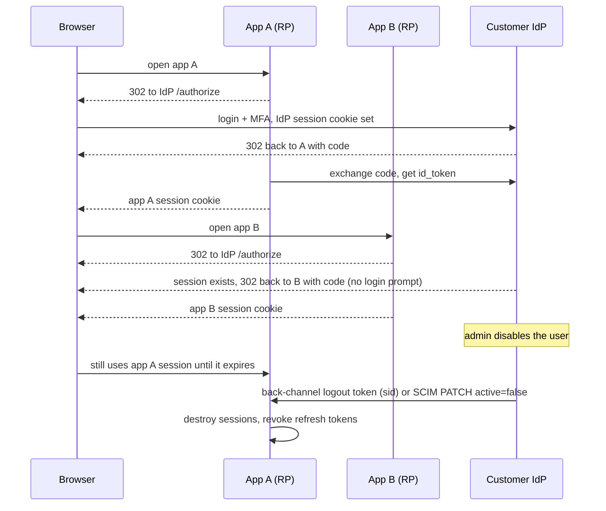
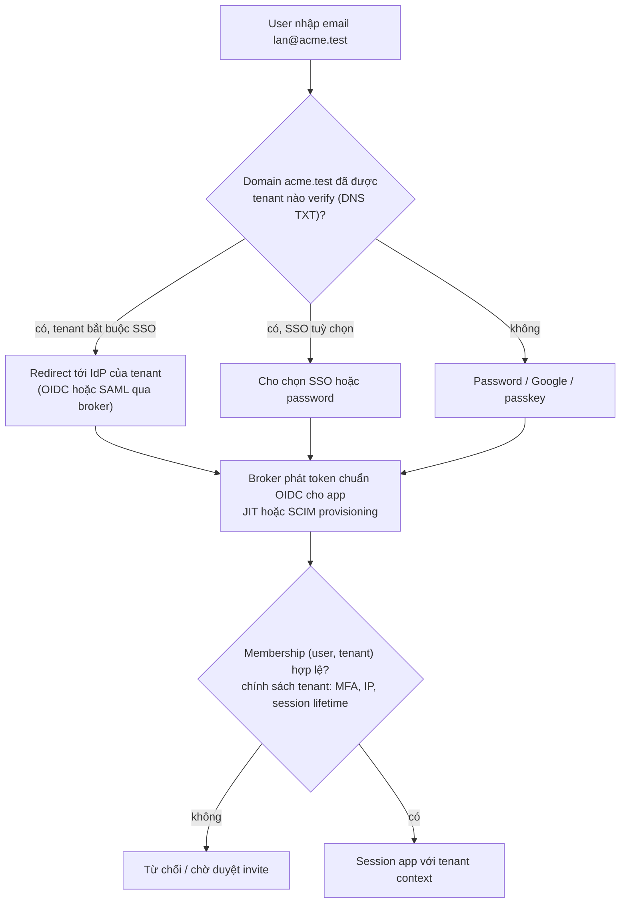

## Bối cảnh & vấn đề

Một SaaS quản lý ca làm việc bán cho chuỗi bán lẻ. Khách hàng lớn đầu tiên hỏi: "Nhân viên của chúng tôi đăng nhập bằng Entra ID của công ty được không? Khi chúng tôi nghỉ việc ai đó, họ phải mất quyền ngay." Khách thứ hai dùng Okta và chỉ hỗ trợ SAML. Khách thứ ba là chuỗi nhỏ, nhân viên dùng email/password hoặc Google. Và một người dùng có thể vừa là quản lý ở chuỗi A (qua SSO của A) vừa là khách mời ở chuỗi B.

Đây là bài toán **federation** của B2B: ứng dụng của bạn không còn là nơi duy nhất quyết định "user là ai". Danh tính đến từ nhiều IdP, qua nhiều giao thức, và vòng đời tài khoản (tạo, khoá, xoá) nằm ở hệ thống của khách. Những câu hỏi khó không nằm ở bước login mà ở bước **kết thúc**: nhân viên bị khoá ở IdP thì còn dùng được app bao lâu? Logout ở app có logout khỏi IdP không? Logout ở IdP có đá user khỏi app không?

Bài này đi qua SSO, SAML so với OIDC, các kiểu logout, các lựa chọn khi dùng Keycloak cho multi-tenant, một thiết kế login B2B hoàn chỉnh, và hai quyết định cấp kiến trúc: migrate từ auth tự viết và build vs buy.

## Khái niệm

### Single Sign-On

**SSO** cho phép user đăng nhập **một lần** ở **IdP** (Okta, Entra ID, Google Workspace, Keycloak) và vào nhiều ứng dụng (RP trong OIDC, SP trong SAML) mà không nhập lại credential. Cơ chế: app redirect user sang IdP; IdP có **session riêng** (cookie trên domain IdP); nếu session còn, IdP cấp ngay ID token hoặc SAML assertion mà không hỏi lại; mỗi app tạo **session cục bộ** của nó.

Hệ quả quan trọng: có ít nhất **ba** thứ có vòng đời riêng: session ở IdP, session ở mỗi app, và token đã cấp (access/refresh). Khoá user ở IdP chỉ chặn **lần đăng nhập tiếp theo**; session app đang sống và refresh token đã cấp vẫn chạy tiếp cho tới khi hết hạn, trừ khi có cơ chế đẩy sự kiện. Nhiều hướng dẫn nói "logout ở một app thường logout khỏi mọi app"; thực tế điều đó chỉ đúng khi đã cấu hình single logout, và không đáng tin nếu chỉ dựa vào front-channel.

**Interview angle:** "nhân viên bị khoá ở IdP công ty, họ dùng app của bạn được bao lâu?" Trả lời bằng con số: tối đa = thời gian session app còn lại (hoặc TTL access token + tới lần refresh tiếp theo), trừ khi có SCIM deprovisioning hoặc back-channel logout. Rồi nói cách thu hẹp.

### SAML 2.0

**SAML 2.0** (OASIS, 2005) là chuẩn SSO dựa trên XML. IdP phát một **assertion** XML ký bằng **XML-DSig**, chứa `Issuer`, `Subject/NameID`, `Conditions` (`NotBefore`, `NotOnOrAfter`, `AudienceRestriction`), `SubjectConfirmationData` (`Recipient`, `InResponseTo`, `NotOnOrAfter`) và attribute. Assertion thường đi qua browser bằng **HTTP-POST binding** (form tự submit tới ACS URL của SP). SP và IdP trao đổi **metadata** XML (entity ID, endpoint, certificate).

SAML vẫn phổ biến vì enterprise đã có nó (ADFS, Okta, Entra ID, PingFederate) và nhiều khách B2B **yêu cầu** SAML trong hợp đồng. OIDC dùng JSON/JWT, có discovery, hợp mobile/SPA/API, và dễ cài đúng hơn nhiều.

### Các bẫy của SAML

- **XML Signature Wrapping (XSW)**: XML-DSig ký một element theo ID; attacker chèn một assertion giả vào chỗ khác trong tài liệu sao cho verifier kiểm chữ ký của element thật nhưng **logic nghiệp vụ đọc** element giả. Nghiên cứu "On Breaking SAML" (2012) phá được 11/14 framework phổ biến lúc đó.
- **Chấp nhận assertion không ký**, hoặc chỉ kiểm chữ ký của Response mà không kiểm assertion bên trong (và ngược lại).
- **Không kiểm điều kiện**: `Audience` (assertion cho SP khác), `Recipient` (ACS khác), `NotOnOrAfter` (hết hạn), `InResponseTo` (không gắn với request của mình).
- **Replay**: không lưu ID assertion đã dùng trong khoảng hiệu lực.
- **XXE/parser**: parser XML cho phép external entity.
- **IdP-initiated SSO**: IdP gửi assertion mà SP chưa hề yêu cầu (user bấm icon app trong portal Okta). Không có `InResponseTo` để đối chiếu, nên SP không phân biệt được assertion "được gửi cho đúng phiên browser này" với assertion attacker chuyển tiếp: mở ra login CSRF và replay. Giảm thiểu: hiệu lực rất ngắn, lưu ID đã dùng, kiểm RelayState, hoặc chuyển thành SP-initiated (nhận xong redirect ngược lại IdP với AuthnRequest mới).

Bài học chung: không tự parse SAML. Dùng broker hoặc thư viện trưởng thành, cập nhật thường xuyên; ngay cả thư viện phổ biến cũng có lỗ hổng bypass chữ ký định kỳ (ví dụ các CVE của `xml-crypto` năm 2025, verify).

### Ba kiểu logout của OIDC

- **RP-Initiated Logout**: app xoá session của mình rồi redirect browser tới `end_session_endpoint` của OP kèm `id_token_hint` và `post_logout_redirect_uri` (đã đăng ký). OP kết thúc session SSO. Cần thiết để "logout" thật sự: chỉ xoá session app thì lần sau bấm login, IdP cấp token ngay vì session SSO còn.
- **Front-Channel Logout**: OP render một trang chứa iframe tới `frontchannel_logout_uri` của từng RP để mỗi RP xoá session. Phụ thuộc browser: **chặn third-party cookie** làm iframe không mang cookie session của RP, nên ngày càng không đáng tin.
- **Back-Channel Logout**: OP gửi **POST server-to-server** một **logout token** (JWT ký, có `iss`, `aud`, `iat`, `jti`, `events` chứa `http://schemas.openid.net/event/backchannel-logout`, và `sid` và/hoặc `sub`, không có `nonce`) tới `backchannel_logout_uri` của RP. RP verify như ID token, tìm session theo `sid`/`sub` và huỷ. Đáng tin nhất, đòi hỏi RP lưu mapping `sid → session` (với JWT stateless: bump `token_version` hoặc denylist theo `sid`).

Đi kèm: revoke refresh token (RFC 7009) khi logout; access token JWT còn sống tới `exp` ([bài 3](/tracks/auth-identity/learn/token-lifecycle-revocation)).

### Provisioning: JIT và SCIM

**JIT provisioning** tạo user lần đầu họ đăng nhập qua SSO, từ claims/attributes. Đơn giản nhưng chỉ biết user **khi họ login**: không biết ai bị xoá. **SCIM 2.0** (RFC 7643/7644) cho IdP của khách **đẩy** thay đổi tới app của bạn qua REST: tạo, cập nhật, `active: false`, xoá user và group. SCIM là cách đúng để deprovision tức thì: nhận `PATCH active=false` thì huỷ session, revoke token, xoá membership.

### Keycloak cho multi-tenant: realm vs organization

**Realm** là một không gian cô lập hoàn toàn: user, client, IdP federation, theme, chính sách password riêng. **Realm per tenant** cho cô lập mạnh nhất và cho tenant cấu hình SSO riêng, nhưng số realm lớn (hàng trăm, hàng nghìn) làm admin console, khởi động, cache và migration cấu hình nặng lên đáng kể (verify giới hạn khuyến nghị theo version), và một người làm ở nhiều tenant phải có nhiều tài khoản.

**Organizations** (GA từ Keycloak 26, verify) mô hình tenant **trong một realm**: một organization có member, domain email, và IdP riêng; login **identity-first** (nhập email, Keycloak chọn IdP theo domain); token có claim `organization` khi xin scope `organization`. Một user thuộc nhiều organization tự nhiên. Cô lập yếu hơn realm (chung chính sách realm, chung client). Phổ biến: single realm + organizations cho đa số tenant; realm riêng cho khách enterprise đặc biệt (data residency, yêu cầu cô lập hợp đồng). Authorization chi tiết (resource-level) vẫn nên ở app; Keycloak lo authentication và role thô.

## Cơ chế hoạt động

### SSO giữa hai app và giới hạn của deprovisioning



Lần login thứ hai không có màn hình đăng nhập vì session IdP còn sống: đó là SSO. Khi admin khoá user, IdP **không** tự động chạm được vào session của app; chỉ có hai đường: back-channel logout (OIDC) hoặc SCIM (provisioning), hoặc chờ session app/TTL token hết hạn.

### Login B2B: identity-first và home realm discovery



Email chỉ dùng để **định tuyến**, không phải để định danh. Domain phải được tenant **chứng minh sở hữu** (bản ghi DNS TXT) để tenant A không "claim" `gmail.com` hay domain của tenant B và cướp luồng login. Sau khi IdP xác thực, app vẫn kiểm membership của chính nó.

## Ví dụ thực tế

### Keycloak 26.4.7: discovery cho logout và Organizations

Discovery của realm `shop`:

```text
end_session_endpoint: 'http://localhost:58080/realms/shop/protocol/openid-connect/logout'
backchannel_logout_supported: true
frontchannel_logout_supported: true
```

RP-initiated logout (POST với refresh token, kiểu server-side) rồi introspect access token cũ:

```text
### logout -> 204 | introspect same AT -> {"active":false}
```

Bật Organizations trên realm, tạo organization `acme` với domain `acme.test`, thêm Alice làm member, xin token với scope `organization`:

```bash
curl -X PUT -H "$A" -H 'content-type: application/json' $KC/admin/realms/shop -d '{"organizationsEnabled":true}'
curl -H "$A" -H 'content-type: application/json' $KC/admin/realms/shop/organizations \
  -d '{"name":"acme","alias":"acme","enabled":true,"domains":[{"name":"acme.test","verified":false}]}'
curl -H "$A" -H 'content-type: application/json' $KC/admin/realms/shop/organizations/$ORG/members -d "\"$ALICE_ID\""
```

```text
enable orgs 204
create org 201
add member 201
{"organization":["acme"],"scope":"openid profile organization email"}
```

Token mang claim `organization: ["acme"]`. App dùng claim này làm **gợi ý** tenant, nhưng vẫn tra membership và role trong DB của app ([bài 12](/tracks/auth-identity/learn/multi-tenant-authorization)): claim là snapshot lúc cấp token. Realm này cũng có sẵn client scope `saml_organization` cho client SAML.

### Xử lý back-channel logout token (minh hoạ)

```ts
app.post("/oidc/backchannel-logout", express.urlencoded(), async (req, res) => {
  try {
    const { payload } = await jose.jwtVerify(req.body.logout_token, IDP_JWKS, {
      issuer: IDP_ISSUER, audience: CLIENT_ID, algorithms: ["RS256"], maxTokenAge: "2m" });
    const events = payload.events as Record<string, unknown> | undefined;
    if (!events?.["http://schemas.openid.net/event/backchannel-logout"] || "nonce" in payload) return res.sendStatus(400);
    if (!(await jtiStore.addIfAbsent(payload.jti as string, 120))) return res.sendStatus(400);   // replay
    if (payload.sid) await sessions.destroyByIdpSid(payload.sid as string);
    else if (payload.sub) await sessions.destroyAllForIdentity(IDP_ISSUER, payload.sub as string);
    res.set("Cache-Control", "no-store").sendStatus(200);
  } catch { res.sendStatus(400); }
});
```

Muốn `destroyByIdpSid` hoạt động, lúc login phải lưu `sid` của ID token cạnh session của app. Với JWT stateless, thay `destroy` bằng bump version/denylist.

### Kế hoạch migrate: HS256 tự viết → OIDC provider

Hiện trạng: 8 service dùng chung một secret HS256, token 24 giờ, không refresh. Rủi ro: mọi service **ký** được token (một service bị chiếm là giả được mọi user), không revoke, cửa sổ 24 giờ. Kế hoạch không big-bang:

1. Dựng IdP (managed hoặc Keycloak), cấu hình client cho web (BFF), mobile (public + PKCE), service (client credentials).
2. Thư viện auth dùng chung cho 8 service chấp nhận **hai issuer**: chọn key theo `iss` từ map cấu hình (HS256 secret cũ cho issuer cũ, JWKS cho issuer mới), allowlist thuật toán riêng cho từng issuer. Không bao giờ cho một key nhận cả HS và RS ([bài 2](/tracks/auth-identity/learn/jwt-signing-verification)).
3. Client mới đăng nhập qua OIDC sau feature flag theo client/tenant; access token 5–10 phút + refresh rotation.
4. Migrate user: import password hash nếu IdP hỗ trợ định dạng (bcrypt thường được), hoặc **lazy migration** (user login lần đầu qua IdP, IdP gọi API cũ xác thực password rồi lưu hash mới).
5. Đo: tỷ lệ request theo issuer, tỷ lệ 401 theo lý do, theo phiên bản app mobile. Có rollback (tắt flag).
6. Khi traffic issuer cũ ~0 (và hạn hỗ trợ app mobile cũ đã qua), tắt issuer cũ, **rotate** secret cũ để token rò rỉ cũng chết.

### Build vs buy: khung quyết định

Tiêu chí cần cân: yêu cầu enterprise (SAML, SCIM, organizations), số MAU và **mô hình giá** (managed rẻ ở quy mô nhỏ, đắt nhanh ở B2C lớn), data residency và compliance, tuỳ biến UX login, năng lực vận hành (Keycloak cần HA, DB, upgrade theo lịch release, vá bảo mật), lock-in (export được password hash không?), SLA. Kết luận thường gặp: **không tự viết IdP** (reset password, MFA, brute-force protection, account recovery, tuân thủ OIDC là khối việc lớn và dễ sai); managed (Auth0, Okta, Cognito, Entra External ID) khi team nhỏ và cần nhanh; Keycloak khi cần self-host, kiểm soát chi phí hoặc tuỳ biến sâu và có người vận hành; tự viết **authorization** nghiệp vụ. Luôn đặt app sau chuẩn OIDC (không gọi SDK riêng của vendor khắp nơi) để có đường rút lui khi giá tăng.

## Trade-offs & lựa chọn thay thế

| Tiêu chí | OIDC | SAML 2.0 |
| --- | --- | --- |
| Định dạng | JSON, JWT | XML, XML-DSig |
| Cấu hình | Discovery tự động | Trao đổi metadata XML |
| Mobile/SPA/API | Tốt | Kém (thiết kế cho browser POST) |
| Độ khó cài đúng | Thấp hơn | Cao (XSW, canonicalization) |
| Phổ biến ở enterprise | Ngày càng nhiều | Rất phổ biến, hay bắt buộc trong hợp đồng |
| Logout | RP-initiated, front/back-channel | SLO (front/back), hỗ trợ không đều |

| Keycloak cho multi-tenant | Realm per tenant | Single realm + Organizations |
| --- | --- | --- |
| Cô lập | Mạnh nhất | Theo organization, chung chính sách realm |
| Tenant tự cấu hình SSO | Có, đầy đủ | IdP theo organization |
| User ở nhiều tenant | Nhiều tài khoản | Một tài khoản, nhiều membership |
| Vận hành ở hàng nghìn tenant | Nặng (verify) | Nhẹ hơn |

| Logout | Đáng tin | Phụ thuộc | Cần ở RP |
| --- | --- | --- | --- |
| RP-initiated | Cao (cho IdP session) | Browser redirect | `id_token_hint`, post-logout URI |
| Front-channel | Thấp, giảm dần | Third-party cookie | Iframe endpoint |
| Back-channel | Cao | Mạng OP → RP | Endpoint, mapping `sid → session` |
| SCIM deprovision | Cao | IdP khách hỗ trợ SCIM | SCIM server |

Chọn thế nào: app mới, khách tự do → OIDC; khách yêu cầu SAML → đặt một **broker** (Keycloak, Auth0, WorkOS) nói SAML với khách và OIDC với app, để app chỉ biết một giao thức. Logout: luôn RP-initiated + back-channel, cộng SCIM cho khách enterprise; không dựa vào front-channel.

## Edge cases & failure modes

- **IdP của khách sập**: user của tenant đó không đăng nhập được. Ghi rõ trong SLA; có **break-glass** admin (tài khoản local có MFA mạnh, giám sát chặt) cho tenant.
- **User vừa thuộc domain SSO của A vừa là khách mời ở B**: identity-first theo domain đẩy họ sang IdP của A. Cho phép chọn tenant trước, hoặc định tuyến theo invite, và tách identity (cùng email, hai `(iss, sub)` khác nhau).
- **Tenant claim domain của người khác**: không verify DNS thì tenant A cấu hình `gmail.com` là domain SSO. Chỉ domain đã verify mới được bắt buộc SSO.
- **Certificate SAML hết hạn**: IdP đổi cert, SP chưa cập nhật metadata → mọi login thất bại. Hỗ trợ hai cert song song, đọc metadata URL định kỳ, alert trước ngày hết hạn.
- **Clock skew với SAML** `NotOnOrAfter` thường chỉ vài phút; lệch đồng hồ làm assertion "hết hạn" ngay.
- **Back-channel logout tới RP sau firewall**: OP không gọi được vào; cần endpoint public có xác thực bằng chữ ký logout token.
- **JIT không có deprovision**: user bị xoá ở IdP vẫn tồn tại ở app mãi mãi; cần SCIM hoặc kiểm tra định kỳ "lần login cuối".

## Pitfalls

- ❌ Tin rằng khoá user ở IdP là đủ → ✅ SCIM hoặc back-channel logout, TTL ngắn, nói rõ SLA revoke.
- ❌ Tự parse SAML bằng thư viện XML → ✅ broker hoặc thư viện SAML trưởng thành, cập nhật thường xuyên.
- ❌ Chấp nhận IdP-initiated SAML mặc định → ✅ tắt nếu không cần; nếu bắt buộc, hiệu lực ngắn, lưu ID, chuyển thành SP-initiated.
- ❌ Logout chỉ xoá session app → ✅ RP-initiated logout tới IdP và revoke refresh token.
- ❌ Dựa vào front-channel logout → ✅ back-channel, lưu mapping `sid`.
- ❌ Realm per tenant cho hàng nghìn tenant nhỏ → ✅ single realm + organizations, realm riêng cho trường hợp đặc biệt.
- ❌ Bắt buộc SSO theo domain chưa verify → ✅ DNS TXT verification.
- ❌ Migrate auth bằng big-bang cutover → ✅ hai issuer song song, feature flag, đo theo issuer, rotate secret cũ khi xong.

## Tóm tắt

- SSO dựa trên session ở IdP; mỗi app có session riêng; khoá user ở IdP không tự huỷ session app.
- SAML: XML assertion ký XML-DSig; bẫy chính là signature wrapping, thiếu kiểm Audience/Recipient/NotOnOrAfter/InResponseTo, replay, IdP-initiated.
- OIDC logout: RP-initiated (kết thúc session IdP), front-channel (kém tin cậy vì third-party cookie), back-channel (logout token JWT với `sid`/`sub`, tin cậy nhất).
- SCIM cho deprovision tức thì; JIT chỉ biết user lúc login.
- Keycloak: realm per tenant cô lập mạnh nhưng nặng ở quy mô lớn; Organizations (26.x) cho single realm, identity-first theo domain, claim `organization`.
- B2B: identity-first, domain verify bằng DNS, broker nói SAML/OIDC với khách và OIDC với app, app vẫn kiểm membership.
- Migrate auth không big-bang: hai issuer, flag, lazy password migration, rotate secret cũ. Không tự viết IdP; tự viết authorization.
