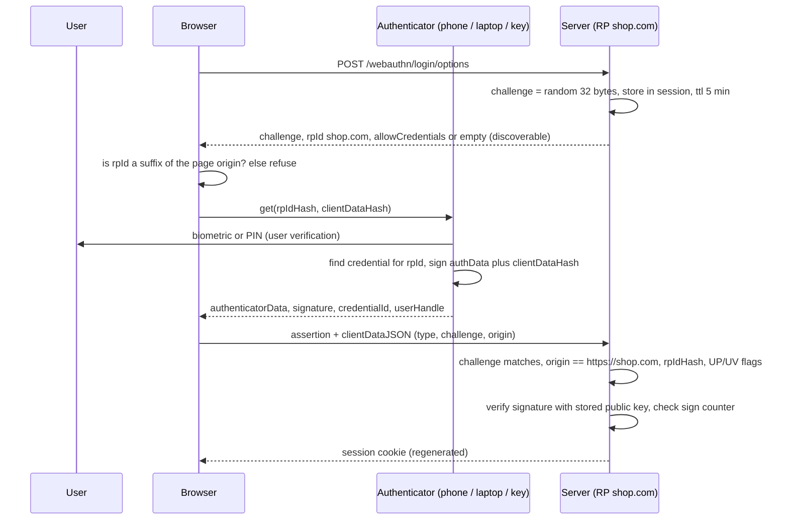
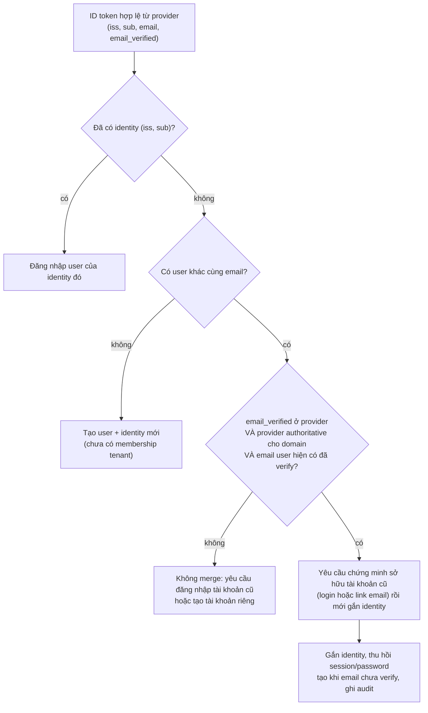

## Bối cảnh & vấn đề

Một sàn thương mại điện tử bật MFA bằng SMS OTP cho mọi tài khoản và thấy tỷ lệ chiếm tài khoản (account takeover, ATO) giảm mạnh trong ba tháng. Rồi nó tăng trở lại. Attacker chuyển sang **phishing real-time**: email "đơn hàng bị giữ" dẫn tới `shop-login.help`, một reverse proxy (kiểu Evilginx) chuyển tiếp mọi thứ tới site thật. Nạn nhân nhập password, site thật gửi SMS, nạn nhân nhập OTP vào trang giả, proxy chuyển tiếp OTP trong vài giây và lấy luôn session cookie. Với những tài khoản giá trị cao, attacker còn làm **SIM swap**: thuyết phục nhà mạng chuyển số sang SIM của họ.

Cùng lúc đó, một lỗ khác xuất hiện ở tính năng "Đăng nhập bằng Google": attacker đăng ký trước tài khoản bằng **email của nạn nhân** với password của attacker (sàn không bắt verify email ngay). Khi nạn nhân "Sign in with Google" lần đầu, hệ thống thấy email trùng và **tự động gộp** vào tài khoản có sẵn. Attacker vẫn đăng nhập được bằng password, và giờ thấy mọi đơn hàng, địa chỉ, thẻ đã lưu của nạn nhân.

Hai câu chuyện cùng một thông điệp: thêm "một yếu tố nữa" chưa đủ; yếu tố đó phải **không chuyển tiếp được** (phishing-resistant), và việc gắn danh tính từ nhiều nguồn phải dựa trên bằng chứng sở hữu, không dựa trên email trùng nhau. Bài này đi qua các loại factor, cơ chế của passkey/WebAuthn, cách rollout passkey cho user hiện có, và quy tắc account linking.

## Khái niệm

### Các nhóm factor

**MFA** yêu cầu ít nhất hai factor thuộc **nhóm khác nhau**: **something you know** (password, PIN), **something you have** (điện thoại, security key, app TOTP), **something you are** (vân tay, khuôn mặt). Hai password không phải MFA. Biometric hiện đại hầu như không gửi lên server; nó dùng để **mở khoá** một authenticator trên thiết bị (private key trong Secure Enclave/TPM), nên thực chất là "something you have, unlocked by something you are".

Điều quan trọng hơn số factor là factor đó chống được tấn công nào. NIST SP 800-63B phân biệt authenticator **phishing-resistant** (gắn với origin hoặc kênh, không chuyển tiếp được) với phần còn lại, và xếp OTP qua mạng điện thoại (SMS, voice) vào nhóm **restricted** (verify chi tiết trong bản 800-63-4).

### SMS OTP, TOTP và push

**SMS OTP** yếu vì nhiều lý do độc lập: **SIM swap** và port số, chặn tín hiệu SS7, malware đọc SMS trên Android, và quan trọng nhất là **phishing real-time**: mã chỉ là 6 chữ số, người dùng gõ được vào bất kỳ trang nào, proxy chuyển tiếp trong thời hạn hiệu lực. **TOTP** (RFC 6238, app Authenticator) loại được SIM swap và SS7 vì secret nằm trong app, nhưng vẫn là 6 chữ số gõ tay, vẫn **phishable** y hệt. **Push notification** ("Bạn có đang đăng nhập không? Có/Không") bị **MFA fatigue**: attacker spam yêu cầu tới khi nạn nhân bấm "Có"; number matching giảm được nhưng vẫn chuyển tiếp được.

Tất cả đều có chung một điểm yếu: **secret hoặc mã do con người chuyển** từ thiết bị này sang trang web, và con người không phân biệt được trang thật với trang giả.

### WebAuthn và passkey

**WebAuthn** (W3C) là API của browser để dùng **public-key credential**. Khi **đăng ký**, authenticator (điện thoại, laptop, security key) tạo một **cặp key riêng cho RP ID** (domain của site, ví dụ `shop.com`), giữ private key, trả public key + credential id cho server. Khi **đăng nhập**, server gửi một **challenge** ngẫu nhiên; browser ghép challenge cùng **origin thật của trang** vào `clientDataJSON`; authenticator kiểm tra RP ID, yêu cầu user verify (biometric/PIN), rồi ký `authenticatorData || SHA256(clientDataJSON)`. Server kiểm chữ ký bằng public key, kiểm `origin`, `challenge`, `rpIdHash` (SHA-256 của RP ID trong authenticatorData), các flag (UP: user present, UV: user verified), và counter.

**Passkey** là tên gọi phổ thông của FIDO2/WebAuthn credential dùng thay password, thường **synced** qua iCloud Keychain, Google Password Manager hay trình quản lý password, nên có trên mọi thiết bị của user.

### Vì sao passkey chống được phishing

Hai cơ chế độc lập. Thứ nhất, **browser** chỉ cho một trang dùng credential có RP ID là **domain của chính trang đó** (hoặc domain cha đăng ký được): `shop-login.help` không thể yêu cầu credential của `shop.com`, nên authenticator không có gì để ký. Thứ hai, ngay cả khi proxy cố chuyển tiếp challenge thật, **origin trong `clientDataJSON` do browser điền**, không phải trang web, và nằm trong dữ liệu được ký: server thấy `origin: https://shop-login.help` và từ chối. Không có mã nào để người dùng gõ nhầm chỗ, và không có secret dùng chung nào nằm ở server để bị lộ trong một vụ rò rỉ DB (server chỉ có public key).

**Interview angle:** "vì sao proxy phishing chuyển tiếp được TOTP mà không chuyển tiếp được passkey assertion?" → TOTP là chuỗi không gắn với origin; assertion WebAuthn ký trên origin do browser ghi và RP ID do browser kiểm.

### Synced và device-bound

**Synced passkey** được backup và đồng bộ qua nhà cung cấp: user đổi điện thoại không mất credential, nên recovery dễ; đổi lại, an toàn của credential phụ thuộc vào tài khoản cloud (iCloud/Google) của user. **Device-bound** (security key YubiKey, một số platform authenticator) không rời phần cứng: assurance cao hơn, hợp cho admin và nhân viên; mất key là mất credential, nên luôn cần đăng ký ít nhất hai key. Authenticator data có flag **BE** (backup eligible) và **BS** (backup state) cho server biết credential có được đồng bộ không, để áp chính sách khác nhau (verify hỗ trợ theo nền tảng).

### Account pre-hijacking và account linking

**Account pre-hijacking** (Sudhodanan & Paverd, 2022) là nhóm tấn công trong đó attacker tạo hoặc chuẩn bị tài khoản **trước khi nạn nhân đăng ký**, rồi chờ nạn nhân "kích hoạt" nó. Biến thể kinh điển là **classic-federated merge** ở câu chuyện mở bài: tài khoản password chưa verify email + social login cùng email → auto-merge → attacker giữ đường vào bằng password. Biến thể khác: IdP cho phép user tự đặt `email` không verify (một số tenant Entra ID trước đây cho app đa tenant đọc `email` là thuộc tính có thể sửa, sự cố được gọi là "nOAuth" năm 2023) → attacker đặt email của nạn nhân trong IdP của họ và đăng nhập vào app tin `email`.

Quy tắc an toàn: khoá định danh là `(iss, sub)` trong bảng `identities`, **không** phải email; chỉ tự động liên kết khi email **đã verify ở cả hai phía** và provider là **authoritative** cho domain đó (Google cho `@gmail.com`, Workspace cho domain đã verify); an toàn nhất là yêu cầu user **đăng nhập tài khoản hiện có** (hoặc xác nhận qua link gửi tới email) trước khi gắn identity mới; tài khoản password chưa verify email thì không bao giờ được merge, và khi liên kết, vô hiệu hoá password/session của trạng thái chưa verify.

## Cơ chế hoạt động

### Đăng nhập bằng passkey



Hai chốt chống phishing nằm ở bước browser kiểm RP ID với origin của trang, và ở bước server kiểm `origin` trong `clientDataJSON` (được ký). Challenge dùng một lần và có hạn chống replay. Counter tăng dần giúp phát hiện credential bị nhân bản ở authenticator device-bound; synced passkey thường gửi counter 0, nên counter 0 phải được chấp nhận.

### Liên kết tài khoản khi đăng nhập social lần đầu



Email chỉ đóng vai trò **gợi ý** "có thể đây là cùng một người". Quyết định gắn danh tính cần bằng chứng sở hữu tài khoản cũ. Nhánh an toàn nhất (bước P) có thể bỏ qua chỉ khi cả ba điều kiện verify đều đúng và rủi ro của sản phẩm thấp.

## Ví dụ thực tế

### TOTP: kiểm bằng test vector RFC 6238

```ts
import { createHmac } from "node:crypto";
function totp(secret: Buffer, t: number, digits = 6, step = 30) {
  const c = Buffer.alloc(8); c.writeBigUInt64BE(BigInt(Math.floor(t / step)));
  const h = createHmac("sha1", secret).update(c).digest(); const o = h[h.length - 1] & 0xf;
  return String((h.readUInt32BE(o) & 0x7fffffff) % 10 ** digits).padStart(digits, "0");
}
console.log("TOTP RFC 6238 T=59 ->", totp(Buffer.from("12345678901234567890"), 59, 8), "(expected 94287082)");
```

```text
TOTP RFC 6238 T=59 -> 94287082 (expected 94287082)
```

Thuật toán đơn giản: HMAC của bộ đếm thời gian (30 giây), cắt động (dynamic truncation) lấy 6–8 chữ số. Toàn bộ "bảo mật" là secret chung giữa app và server, và mã ra chỉ là một chuỗi số không mang thông tin gì về trang web nó được nhập vào. Đó là lý do TOTP phishable.

### Mô phỏng assertion WebAuthn: origin binding

Mô phỏng rút gọn (dữ liệu thật của authenticator dùng CBOR/COSE và browser tự tạo `clientDataJSON`; ở đây tạo tay để thấy logic kiểm tra), chạy bằng `node:crypto` trên Node 24 với key P-256:

```ts
function authenticatorGetAssertion(rpId: string, clientDataJSON: string, counter: number) {
  const flags = Buffer.from([0x05]);                                  // UP + UV
  const cnt = Buffer.alloc(4); cnt.writeUInt32BE(counter);
  const authData = Buffer.concat([sha(rpId), flags, cnt]);           // rpIdHash | flags | signCount
  return { authData, sig: sign("sha256", Buffer.concat([authData, sha(clientDataJSON)]), privateKey) };
}
function serverVerify({ authData, sig, clientDataJSON }, expected) {
  const cd = JSON.parse(clientDataJSON);
  if (cd.type !== "webauthn.get") return "reject: type";
  if (cd.challenge !== expected.challenge) return "reject: challenge mismatch";
  if (cd.origin !== "https://shop.com") return `reject: origin ${cd.origin}`;
  if (!authData.subarray(0, 32).equals(sha("shop.com"))) return "reject: rpIdHash";
  if (!(authData[32] & 0x04)) return "reject: user not verified";
  if (!verify("sha256", Buffer.concat([authData, sha(clientDataJSON)]), publicKey, sig)) return "reject: bad signature";
  // counter check: reject if counter != 0 and counter <= stored
  return "ACCEPT";
}
```

```text
legit login on shop.com         ACCEPT
phishing site relays challenge  reject: origin https://shop-login.evil
replay old assertion            reject: challenge mismatch
```

Trang phishing chuyển tiếp đúng challenge thật, nhưng browser của nạn nhân ghi origin của trang phishing vào `clientDataJSON`, và dữ liệu đó nằm dưới chữ ký: server từ chối. (Trong thực tế bước này còn không xảy ra, vì browser từ chối cho `shop-login.evil` dùng credential của RP ID `shop.com`.) Assertion cũ không dùng được với challenge mới. Production dùng thư viện đã kiểm chứng như SimpleWebAuthn thay vì tự parse CBOR.

### Rollout passkey cho 5 triệu user (thiết kế)

Bảng lưu credential:

```sql
CREATE TABLE webauthn_credentials (
  id bytea PRIMARY KEY,                       -- credential id
  user_id uuid NOT NULL REFERENCES users(id),
  public_key bytea NOT NULL,                  -- COSE key
  sign_count bigint NOT NULL DEFAULT 0,
  transports text[],                          -- internal, hybrid, usb, nfc, ble
  backup_eligible boolean NOT NULL, backup_state boolean NOT NULL,
  aaguid uuid, nickname text,
  created_at timestamptz NOT NULL DEFAULT now(), last_used_at timestamptz
);
CREATE INDEX ON webauthn_credentials (user_id);
```

Kế hoạch theo giai đoạn: (1) **enroll mềm**: đề nghị tạo passkey ngay sau một lần đăng nhập thành công hoặc sau checkout, và trong trang bảo mật; không ép. (2) **Login UX**: **conditional UI** (`navigator.credentials.get({ mediation: "conditional" })` cùng ô input `autocomplete="username webauthn"`): browser gợi ý passkey ngay trong autofill của ô username, user chưa có passkey vẫn thấy form bình thường; identifier-first để biết user có passkey không. (3) **RP ID** là domain gốc (`shop.com`) để dùng được trên `www.` và `m.`; đổi RP ID sau này là mất toàn bộ credential. (4) **Recovery**: passkey synced giảm số ca mất; recovery bằng email + step-up (kiểm thiết bị quen, thời gian chờ) và **không được yếu hơn** đường đăng nhập chính, nếu không attacker sẽ đi qua recovery. (5) **Đo**: tỷ lệ enroll, tỷ lệ login bằng passkey, thời gian đăng nhập, số ticket "quên password", tỷ lệ ATO. (6) Sau một thời gian, cho user tự **tắt password** (passwordless thật); chừng nào password còn, phishing password + OTP vẫn còn đường.

## Trade-offs & lựa chọn thay thế

| Factor | Phishing-resistant | SIM swap | Recovery | UX | Ghi chú |
| --- | --- | --- | --- | --- | --- |
| SMS/voice OTP | Không | Bị | Dễ | Quen thuộc | NIST: restricted (verify) |
| Email OTP/link | Không | Không bị | Dễ | Chậm | Phụ thuộc bảo mật email |
| TOTP app | Không | Không bị | Khó (mất máy) | Trung bình | Tốt hơn SMS, vẫn phishable |
| Push + number matching | Một phần | Không bị | Theo app | Tốt | MFA fatigue nếu không có number matching |
| Passkey synced | Có | Không bị | Dễ (cloud) | Rất tốt | An toàn theo tài khoản cloud |
| Security key device-bound | Có | Không bị | Cần key dự phòng | Cần mang key | Cho admin, nhân viên |

Chọn thế nào: người dùng phổ thông → passkey synced làm đường chính, OTP qua email/TOTP làm dự phòng; đừng ép SMS là factor duy nhất. Admin, nhân viên vận hành, tài khoản có quyền tiền → bắt buộc phishing-resistant (security key hoặc passkey), hai key, không fallback SMS. Account linking → mặc định không auto-merge; chỉ auto-link với provider authoritative và email verify cả hai phía.

## Edge cases & failure modes

- **User mất mọi thiết bị có passkey**: recovery quyết định độ an toàn thật. Recovery yếu (chỉ cần trả lời câu hỏi bảo mật) xoá sạch lợi ích của passkey.
- **RP ID sai**: đăng ký với RP ID `login.shop.com` thì không dùng được trên `shop.com`. Chọn domain gốc từ đầu.
- **Counter đi lùi**: với device-bound là dấu hiệu nhân bản; với synced thì thường luôn 0. Chính sách phải phân biệt, không khoá nhầm user hợp lệ.
- **Phishing chuyển sang đường fallback**: có passkey nhưng trang login vẫn cho "dùng password + SMS" → attacker chọn đường đó. Theo thời gian, giới hạn fallback cho user đã có passkey.
- **Cross-device (hybrid) login** bằng QR: điện thoại và máy tính cần Bluetooth gần nhau để chống relay từ xa; môi trường doanh nghiệp tắt Bluetooth làm luồng này thất bại.
- **Email đổi chủ**: công ty cấp lại `lan@acme.com` cho người mới; tài khoản cũ khoá theo email sẽ rơi vào tay người mới. Khoá theo `(iss, sub)`.
- **Provider cho email chưa verify** (`email_verified` false hoặc vắng): không dùng email đó để link hay gửi reset password.

## Pitfalls

- ❌ Coi SMS OTP là MFA đủ mạnh cho mọi tài khoản → ✅ phishing-resistant cho tài khoản giá trị cao; SMS chỉ là dự phòng.
- ❌ Nghĩ TOTP chống được phishing → ✅ TOTP chống SIM swap, không chống proxy real-time.
- ❌ Tự parse CBOR/COSE và attestation → ✅ thư viện như SimpleWebAuthn, kiểm `origin`, `rpIdHash`, challenge, UV.
- ❌ Recovery bằng câu hỏi bảo mật → ✅ recovery không yếu hơn đường chính (step-up, thời gian chờ, thiết bị quen).
- ❌ Auto-merge tài khoản theo email trùng → ✅ khoá `(iss, sub)`, chứng minh sở hữu tài khoản cũ trước khi gắn.
- ❌ Tin claim `email` của mọi IdP → ✅ chỉ tin khi `email_verified` và provider authoritative cho domain.
- ❌ Đổi RP ID khi đổi domain → ✅ chọn RP ID ổn định từ đầu; đổi là bắt mọi user đăng ký lại.

## Tóm tắt

- MFA cần factor khác nhóm; điều quan trọng hơn là factor có phishing-resistant không.
- SMS OTP yếu (SIM swap, SS7, malware, proxy real-time); TOTP tốt hơn nhưng vẫn phishable; push bị MFA fatigue.
- WebAuthn: cặp key riêng cho RP ID, challenge ngẫu nhiên, chữ ký trên `authenticatorData || SHA256(clientDataJSON)`; server kiểm origin, challenge, rpIdHash, UV.
- Phishing-resistant vì browser kiểm RP ID và tự ghi origin vào dữ liệu được ký; server chỉ có public key.
- Synced passkey: recovery dễ; device-bound: assurance cao, cần key dự phòng.
- Rollout: enroll mềm, conditional UI, RP ID gốc, recovery không yếu hơn đường chính, đo ATO và ticket, tiến tới bỏ password.
- Account linking: khoá `(iss, sub)`, không auto-merge theo email; email verify cả hai phía và chứng minh sở hữu tài khoản cũ.
