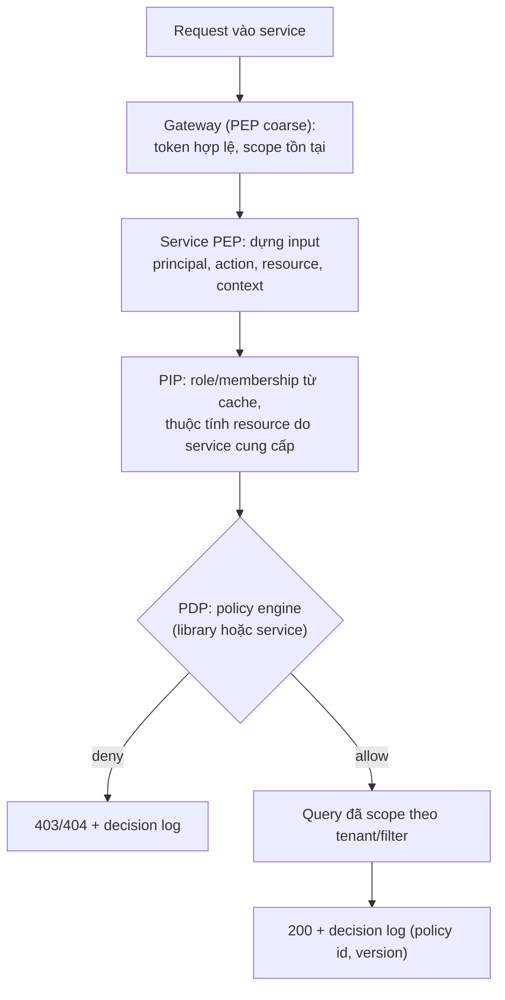
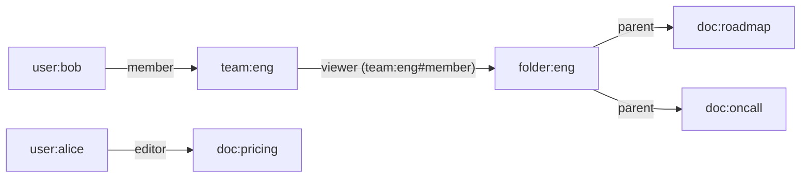

## Bối cảnh & vấn đề

Phiên bản đầu của một hệ thống bán lẻ có ba role: `admin`, `manager`, `staff`, và code rải `if (user.role === "admin" || user.role === "manager")` ở 140 chỗ. Năm sau, khách hàng muốn "quản lý cửa hàng chỉ được hoàn tiền dưới 5 triệu, và chỉ cho đơn của cửa hàng mình". Team tạo `manager_store3_under5m`, rồi `manager_store7_under5m`... sau một quý có 400 role. Rồi tới tính năng chia sẻ báo cáo: "Lan chia sẻ báo cáo cho team kế toán, và ai trong thư mục Finance cũng xem được". Không có role nào biểu diễn được điều đó.

Ba yêu cầu này tương ứng với ba mô hình authorization. **RBAC** (role → permission) đủ cho "ai có loại quyền gì". **ABAC** (điều kiện trên thuộc tính) cho "chỉ khi cửa hàng khớp và số tiền dưới hạn mức". **ReBAC** (quan hệ) cho "chia sẻ, thừa kế qua thư mục, thành viên của nhóm". Chọn sai mô hình là nguồn gốc của **role explosion** hoặc của những điều kiện ad-hoc không ai audit nổi.

Bài này giải thích ba mô hình, chạy thử chúng trên Cedar và OpenFGA, so sánh các policy engine, rồi đi vào hai vấn đề production: authorization cho list/search, và kiến trúc authorization cho nhiều microservice. Phần multi-tenant (role theo membership) ở [bài 12](/tracks/auth-identity/learn/multi-tenant-authorization).

## Khái niệm

### RBAC

**RBAC** (Role-Based Access Control) gán **role** cho user, role gồm nhiều **permission**, và code kiểm tra **permission**. Điểm then chốt nằm ở câu cuối: `can(user, "order.refund")` thay vì `user.role === "admin"`. Khi kiểm permission, đổi quyền của một role (cho `manager` thêm `order.refund`) chỉ là một dòng dữ liệu; khi kiểm tên role, đó là một lần sửa 140 chỗ và một đợt deploy. Kiểm tên role còn làm code "biết" về cấu trúc tổ chức, và mọi role mới phải được thêm vào mọi `if`.

Schema tối thiểu: `roles(id, key)`, `permissions(key)`, `role_permissions(role_id, permission_key)`, `user_roles(user_id, role_id)`. Mở rộng phổ biến: role hierarchy (role kế thừa permission của role khác), group (gán role cho nhóm), và quan trọng nhất cho SaaS: role theo **tenant** (`user_roles` có `tenant_id`, [bài 12](/tracks/auth-identity/learn/multi-tenant-authorization)).

```ts
// avoid: if (user.role === "admin" || user.role === "manager")
if (!(await authz.can(ctx, "order.refund"))) throw new ForbiddenError();
```

RBAC dễ hiểu, dễ audit ("ai có `order.refund`?" là một query join), nhưng **bùng nổ role** khi có điều kiện ("chỉ store 3", "dưới 5 triệu").

### ABAC

**ABAC** (Attribute-Based Access Control) ra quyết định bằng **rule** trên thuộc tính của **principal** (phòng ban, hạn mức), **resource** (store, số tiền, trạng thái), **action**, và **context** (giờ, IP, thiết bị, đã MFA chưa). Ví dụ: `principal ∈ resource.store.managers ∧ resource.amount ≤ principal.refundLimit ∧ resource.status ≠ "settled_90d"`. Một rule thay cho 400 role.

Đổi lại, ABAC khó trả lời câu hỏi ngược: "ai có thể refund đơn ở store 3?" không còn là một query, vì quyền phụ thuộc thuộc tính của từng đơn. Policy cũng dễ trở thành code khó đọc nếu không có ngôn ngữ chuyên dụng. Cách trả lời auditor: liệt kê principal có thể thoả rule (những người thuộc nhóm managers của store 3) kèm điều kiện ("với đơn ≤ hạn mức của họ"), hoặc dùng engine có công cụ phân tích policy (Cedar có thể kiểm tính chất của policy).

### ReBAC và Zanzibar

**ReBAC** (Relationship-Based Access Control) suy ra quyền từ **quan hệ** giữa các object, biểu diễn như một đồ thị. **Zanzibar** (Google, 2019), hệ thống authorization phía sau Drive, Calendar, YouTube, lưu quan hệ dạng **tuple** `object#relation@subject`: `doc:roadmap#parent@folder:eng`, `folder:eng#viewer@team:eng#member`, `team:eng#member@user:bob`. Một **namespace configuration** (authorization model) định nghĩa relation được suy ra thế nào: `viewer` của doc = viewer trực tiếp ∪ `editor` ∪ `viewer` của `parent`. API chính: **Check** ("bob có phải viewer của doc:roadmap?"), **Expand** (ai có relation), **ListObjects/LookupResources** (doc nào bob xem được), **Write** (thêm/xoá tuple).

**New enemy problem**: Alice gỡ Bob khỏi ACL của thư mục, rồi thêm tài liệu nhạy cảm vào. Nếu lần check quyền của Bob đọc từ một replica **cũ hơn** lần gỡ ACL, Bob thấy tài liệu mới: hai sự kiện được xử lý sai thứ tự. Zanzibar giải bằng **zookie**: lúc sửa nội dung, client lấy một consistency token; lúc check, yêu cầu đánh giá ở snapshot ít nhất mới bằng token đó. OpenFGA có tham số consistency (`HIGHER_CONSISTENCY`), SpiceDB có `ZedToken` (verify chi tiết theo version).

ReBAC tự nhiên cho sharing, hierarchy sâu (org → workspace → project → doc), nhóm lồng nhau. Chi phí: một hệ thống nữa để vận hành, tuple phải **đồng bộ** với DB nghiệp vụ (dual write → outbox), thêm latency mỗi check, và list filtering khó hơn.

### Policy engine

**Policy engine** tách logic authorization ra khỏi code nghiệp vụ, để policy có thể được viết, test, review và versioning riêng:

- **OPA** (Open Policy Agent, CNCF graduated) với ngôn ngữ **Rego**: general-purpose, dùng cho cả Kubernetes admission, API authz, CI policy. Mạnh, nhưng Rego khó học; chạy sidecar, daemon hoặc library (WASM); **partial evaluation** biến policy thành điều kiện để dịch sang SQL.
- **Cedar** (AWS, open source): ngôn ngữ chuyên cho authorization (RBAC + ABAC), cú pháp `permit/forbid ... when { ... }` dễ đọc, `forbid` luôn thắng `permit`, có công cụ **phân tích/verify** policy; SDK Rust với binding WASM cho JS; Amazon Verified Permissions là bản managed.
- **Casbin**: thư viện nhúng nhiều ngôn ngữ (node-casbin), model **PERM** cấu hình được (RBAC, RBAC with domains cho tenant, ABAC), policy lưu DB qua adapter. Đơn giản, latency rất thấp.
- **OpenFGA/SpiceDB**: ReBAC theo kiểu Zanzibar, chạy như service riêng.

### PDP, PEP và kiến trúc phân tán

**PDP** (Policy Decision Point) là nơi ra quyết định allow/deny; **PEP** (Policy Enforcement Point) là nơi chặn request và gọi PDP (middleware trong mỗi service, gateway). **PIP** (Policy Information Point) cung cấp dữ liệu (role, thuộc tính) cho PDP; **PAP** là nơi quản lý policy. Với nhiều service, câu hỏi là PDP nằm **trong** từng service (library + policy/data được phân phối, như OPA bundle, Cedar policy store, Casbin + DB) hay là **một service trung tâm** (OpenFGA, authz service tự viết). Library nhúng: latency micro giây, chạy được khi trung tâm sập, nhưng dữ liệu phải được đẩy tới và có thể stale. Service trung tâm: nhất quán, một nguồn sự thật, thêm một hop mạng, cần cache, timeout và chiến lược fail-closed.

## Cơ chế hoạt động

### Một request đi qua các tầng authorization



Gateway chỉ lọc những gì rẻ và chung (token, scope). Quyết định chi tiết cần thuộc tính của resource (store, số tiền), mà chỉ service sở hữu dữ liệu mới có, nên PEP nằm trong service. PDP trả về quyết định kèm lý do (policy nào), được ghi vào **decision log** cho audit.

### ReBAC check qua đồ thị tuple



Check "bob viewer doc:roadmap": doc:roadmap có `parent` là folder:eng; viewer của doc gồm viewer của parent; viewer của folder:eng gồm thành viên team:eng; bob là member → allow. Xoá tuple `team:eng#member@user:bob` thì đường đi biến mất, mọi doc trong thư mục không còn xem được, không cần sửa từng doc.

## Ví dụ thực tế

### ABAC với Cedar 4.13 (WASM trong Node 24)

```text
permit (principal, action == Action::"refund", resource is Order)
when { principal in resource.store.managers && resource.amount <= principal.refundLimit };
forbid (principal, action == Action::"refund", resource is Order)
when { resource.status == "settled_90d" };
```

```ts
import * as cedar from "@cedar-policy/cedar-wasm/nodejs";
const r = cedar.isAuthorized({
  principal: { type: "User", id: "lan" }, action: { type: "Action", id: "refund" },
  resource: { type: "Order", id }, context: {}, policies: { staticPolicies: policies }, entities });
// entities: lan (refundLimit 5,000,000) in Group store3-managers; orders o1..o4 with store, amount, status
```

```text
cedar-wasm 4.13.0
o1 allow  reason=["policy0"]
o2 deny  reason=[]
o3 deny  reason=[]
o4 deny  reason=["policy1"]
```

o1 (store 3, 1,2 triệu) được phép bởi `policy0`. o2 (9 triệu, quá hạn mức) và o3 (store 7) bị từ chối vì **không** policy nào cho phép (deny mặc định, `reason` rỗng). o4 (store 3, 200 nghìn) thoả `permit` nhưng bị `forbid` (`policy1`) chặn vì đã quyết toán 90 ngày: trong Cedar, `forbid` luôn thắng. `reason` cho biết policy nào quyết định, rất hữu ích cho decision log.

### ReBAC với OpenFGA 1.21.0

Model (JSON tương đương DSL): `team.member`, `folder.viewer = [user, team#member] or owner`, `doc.viewer = [user] or editor or viewer from parent`. Tuple và kết quả check:

```bash
curl -X POST $F/stores/$STORE/write -d '{"writes":{"tuple_keys":[
 {"user":"user:bob","relation":"member","object":"team:eng"},
 {"user":"team:eng#member","relation":"viewer","object":"folder:eng"},
 {"user":"folder:eng","relation":"parent","object":"doc:roadmap"},
 {"user":"folder:eng","relation":"parent","object":"doc:oncall"},
 {"user":"user:alice","relation":"editor","object":"doc:pricing"}]}}'
```

```text
{"check":"user:bob viewer doc:roadmap","allowed":true}
{"check":"user:bob viewer doc:pricing","allowed":false}
{"check":"user:alice viewer doc:pricing","allowed":true}
{"check":"user:alice editor doc:roadmap","allowed":false}
{"objects":["doc:oncall","doc:roadmap"]}
--- delete tuple user:bob member team:eng
{"check":"user:bob viewer doc:roadmap","allowed":false}
```

Bob xem được roadmap qua ba bước quan hệ; Alice là editor của pricing nên cũng là viewer. `list-objects` trả hai doc Bob xem được: đây là API dùng cho list endpoint. Gỡ Bob khỏi team là đủ để mất quyền với mọi doc trong thư mục.

### List endpoint: policy thành filter (Postgres 17)

200.000 đơn, Lan chỉ được xem đơn của store `s2`, `s4` trong tenant A (bảng `staff_store_access`):

```sql
SELECT o.id, o.store_id, o.amount FROM orders2 o
WHERE o.tenant_id = 'tenant_a'
  AND o.store_id IN (SELECT store_id FROM staff_store_access WHERE user_id = 'lan' AND tenant_id = 'tenant_a')
ORDER BY o.created_at DESC LIMIT 20;
```

```text
 Limit (actual rows=20 loops=1)
   ->  Sort (actual rows=20 loops=1)
         Sort Key: o.created_at DESC
         Sort Method: top-N heapsort  Memory: 26kB
         ->  Nested Loop (actual rows=40000 loops=1)
               ->  Seq Scan on staff_store_access (actual rows=2 loops=1)
               ->  Bitmap Heap Scan on orders2 o (actual rows=20000 loops=2)
                     ->  Bitmap Index Scan on orders2_tenant_id_store_id_created_at_idx (actual rows=20000 loops=2)
 Execution Time: 37.788 ms
 visible_to_lan = 40000, whole_tenant = 100000
```

Policy được dịch thành điều kiện SQL, nên phân trang và count đúng ngay từ DB: count phải dùng **cùng** filter (40.000, không phải 100.000), nếu không UI lộ "có 100.000 kết quả". Plan đọc 40.000 dòng rồi top-N sort (38 ms); với nhiều store hơn hoặc bảng lớn hơn, cần index/thiết kế phân trang phù hợp (keyset theo `created_at`, hoặc `UNION ALL` mỗi store rồi merge). So với cách sai "load hết rồi check từng dòng bằng `can()`": 100.000 lần gọi PDP cho một trang, và phân trang hỏng (trang có ít hơn 20 dòng).

### PEP trong service (minh hoạ)

```ts
async function authorize(ctx: Ctx, action: string, resource: { type: string; id: string; attrs: object }) {
  const principal = await pip.principal(ctx.userId, ctx.tenantId);        // roles, limits from cache
  const decision = pdp.isAuthorized({ principal, action, resource, context: { mfa: ctx.mfa, ip: ctx.ip } });
  decisionLog.write({ ...decision, policyVersion: pdp.version, requestId: ctx.requestId });
  if (decision.decision !== "allow") throw resource.attrs.tenantId !== ctx.tenantId ? new NotFound() : new Forbidden();
}
```

## Trade-offs & lựa chọn thay thế

| Mô hình | Biểu diễn | "Ai có quyền X?" | Điều kiện động | Sharing/hierarchy | Bẫy |
| --- | --- | --- | --- | --- | --- |
| RBAC | role → permission | Dễ (join) | Kém → role explosion | Kém | Check tên role trong code |
| ABAC | rule trên thuộc tính | Khó | Tốt | Trung bình | Policy khó đọc, khó audit |
| ReBAC | đồ thị tuple | Expand/List | Hạn chế (OpenFGA có conditions) | Rất tốt | Đồng bộ tuple, vận hành thêm |

| Engine | Mô hình | Triển khai | Điểm mạnh | Hợp khi |
| --- | --- | --- | --- | --- |
| Code + bảng tự viết | RBAC theo tenant | Trong service | Đơn giản, không dependency | Một vài service, RBAC + vài điều kiện |
| Casbin | RBAC/domains/ABAC | Library | Latency thấp, cấu hình model | Node monolith/ít service |
| Cedar | RBAC + ABAC | Library (WASM) hoặc AVP managed | Dễ đọc, forbid thắng, phân tích được | Nhiều team viết policy, cần audit |
| OPA/Rego | General-purpose | Sidecar/library/WASM | Một engine cho K8s + API, partial eval | Platform team, policy-as-code toàn tổ chức |
| OpenFGA/SpiceDB | ReBAC | Service riêng | Sharing, hierarchy, ListObjects | Docs/workspace kiểu Google Drive |

Chọn thế nào: **RBAC làm nền**, kiểm permission chứ không kiểm role. Thêm **ABAC** cho vài action có điều kiện (refund, approve, export). Chuyển sang **ReBAC** khi có chia sẻ tới user/nhóm và hierarchy sâu. Với một platform Node multi-tenant điển hình: bảng membership + role theo tenant trong DB và một hàm `can()` (hoặc Casbin RBAC with domains) là đủ; khi nhiều team/nhiều service cần một nguồn luật có audit → Cedar hoặc OPA; khi sharing phức tạp → OpenFGA. Tiêu chí: latency, dữ liệu nằm đâu (data locality), testability, ai viết policy.

**Thiết kế cho 15 microservice**: tách PDP/PEP; phân phối policy (git → CI test → bundle có version) và dữ liệu (role/membership qua event từ identity service vào cache local) tới library PDP trong mỗi service để latency thấp và chịu được trung tâm sập; resource attributes do service sở hữu cung cấp lúc check; coarse ở gateway, fine trong service; decision log tập trung; rollout policy mới bằng **shadow mode** (đánh giá cả policy cũ và mới, log khác biệt, chưa enforce) rồi bật dần.

## Edge cases & failure modes

- **PDP trung tâm chậm/sập**: mọi request chờ; cần timeout ngắn, cache quyết định hoặc input, và fail-closed cho action nhạy cảm (fail-open chỉ cho đọc ít rủi ro, có chủ đích).
- **Dữ liệu authorization stale**: role đã bị gỡ nhưng cache của service còn; đặt TTL bằng cửa sổ revoke chấp nhận được và invalidate qua event ([bài 12](/tracks/auth-identity/learn/multi-tenant-authorization)).
- **Tuple ReBAC lệch DB nghiệp vụ**: tạo doc trong DB nhưng ghi tuple thất bại → owner không xem được doc của mình. Outbox pattern, job đối soát.
- **New enemy**: check trên replica cũ sau khi gỡ quyền; dùng consistency token hoặc mức nhất quán cao hơn cho thao tác ngay sau thay đổi ACL.
- **ListObjects trả hàng chục nghìn id**: `WHERE id IN (...)` khổng lồ; giới hạn, kết hợp filter thô ở DB, hoặc đồng bộ ACL vào search index (denormalized `allowed_principals`).
- **Search/aggregation lộ dữ liệu**: count, facet, gợi ý autocomplete chạy không có filter quyền; mọi truy vấn đọc đều phải mang filter.
- **Policy deploy lỗi chặn mọi người**: không có test và shadow mode, một `forbid` sai là sự cố toàn hệ thống.

## Pitfalls

- ❌ `if (user.role === "admin")` khắp nơi → ✅ `can(ctx, "order.refund")`, role chỉ là dữ liệu.
- ❌ Tạo role mới cho mỗi điều kiện → ✅ RBAC nền + ABAC cho điều kiện.
- ❌ Load hết dữ liệu rồi lọc theo quyền trong app → ✅ dịch policy thành filter (SQL, ES query, partial evaluation), count dùng cùng filter.
- ❌ Chỉ authorize ở gateway → ✅ object-level trong service sở hữu dữ liệu.
- ❌ Dual write DB + tuple không có đối soát → ✅ outbox và job reconcile.
- ❌ Policy engine không có test → ✅ policy-as-code trong git, unit test cho allow/deny, shadow mode trước khi enforce.
- ❌ Không có decision log → ✅ log quyết định kèm policy id/version cho audit và debug.

## Tóm tắt

- RBAC: user → role → permission; kiểm permission, không kiểm tên role; bùng nổ role khi có điều kiện.
- ABAC: rule trên thuộc tính principal/resource/context; linh hoạt, khó trả lời "ai có quyền".
- ReBAC/Zanzibar: tuple `object#relation@subject`, model suy ra relation, Check/Expand/ListObjects; new enemy giải bằng consistency token.
- Cedar: `permit/forbid when`, forbid thắng; OpenFGA: ReBAC service; Casbin: library, RBAC with domains; OPA: general-purpose Rego.
- List/search: biến policy thành filter trong query; count/facet dùng cùng filter.
- Nhiều service: PDP/PEP tách, policy và dữ liệu phân phối tới service, coarse ở gateway, fine trong service, decision log, shadow mode khi đổi policy.
