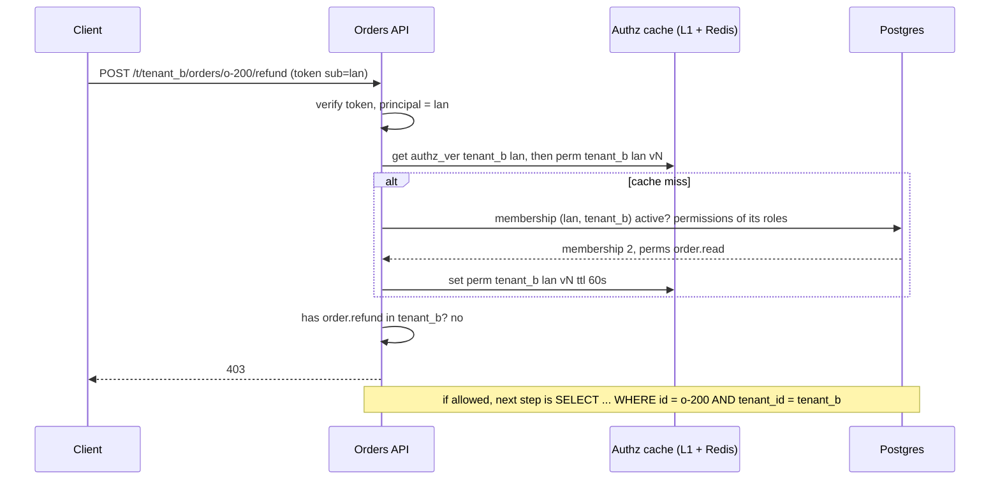
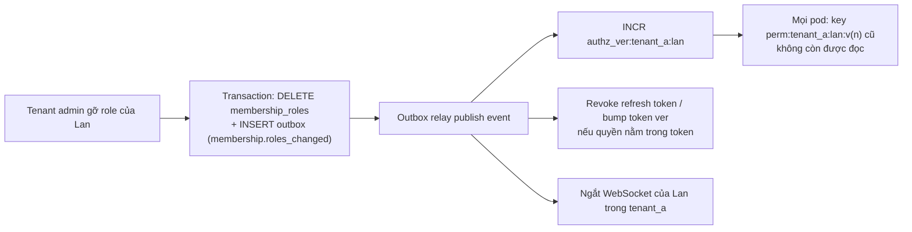

## Bối cảnh & vấn đề

Bảng `users` của một nền tảng bán lẻ có cột `role`. Lúc đầu mỗi user chỉ thuộc một công ty nên không sao. Rồi Lan, quản lý ở chuỗi cà phê (tenant A), được chuỗi sách (tenant B) mời vào xem báo cáo. Cột `role` chỉ có một giá trị: nếu là `store_manager` thì Lan thành quản lý ở cả B; nếu là `viewer` thì cô mất quyền ở A. Team "chữa" bằng cách tính quyền là **hợp** của mọi role ở mọi tenant. Ba tuần sau, Lan hoàn tiền nhầm một đơn của tenant B: cô có `order.refund` "ở đâu đó", và endpoint refund không kiểm order thuộc tenant nào.

Multi-tenant authorization có hai lớp phải đúng cùng lúc: **quyền theo tenant** (role thuộc về quan hệ giữa một user và một tenant, không thuộc về user), và **object-level** (resource được tra trong phạm vi tenant hiện tại). Thêm hai câu hỏi vận hành: tenant hiện tại đến từ đâu mà user không tự đổi được, và khi admin đổi role, bao lâu thì có hiệu lực.

Bài này thiết kế schema, chạy thử lỗi refund chéo tenant và bản sửa trên Postgres, bàn các cách mang tenant context, cache quyền có version, và trường hợp B2B2C (staff và customer cùng hệ thống). Các mô hình RBAC/ABAC/ReBAC tổng quát ở [bài 11](/tracks/auth-identity/learn/authorization-models).

## Khái niệm

### Membership: role thuộc về quan hệ user–tenant

**Membership** là bản ghi `(user_id, tenant_id, status)` nói "user này thuộc tenant này". Role gắn vào **membership**, không vào user: `membership_roles(membership_id, role_id)`. Một user toàn cục (`users`, định danh bằng `identities(iss, sub)`, [bài 6](/tracks/auth-identity/learn/oidc-id-token-jwks)) có thể có nhiều membership, mỗi cái một bộ role. Lan có membership ở A với `store_manager` và ở B với `viewer`; quyền hiệu lực của cô **luôn tính trong một tenant cụ thể**.

`status` của membership (`active`, `invited`, `suspended`, `removed`) là nơi revoke: xoá Lan khỏi tenant B là đổi một bản ghi, không đụng tới tài khoản toàn cục của cô ở A.

### Role hệ thống và custom role theo tenant

**Role hệ thống** (`owner`, `admin`, `viewer`) do platform định nghĩa, dùng chung: `roles.tenant_id IS NULL`. **Custom role** do tenant tự tạo (`refund_clerk` của tenant B): `roles.tenant_id = 'tenant_b'`. Ràng buộc bắt buộc: custom role của B **không bao giờ** được gán cho membership của A. Ràng buộc này nên nằm ở DB (composite foreign key + trigger/check), không chỉ ở code, vì mọi đường ghi (admin tool, script migration, API) đều phải tôn trọng nó.

Một ràng buộc khác là chống **privilege escalation**: ai được gán role nào. Tenant admin không được tự gán cho mình permission mà chỉ platform operator có (`platform.impersonate`), và một `manager` không được gán `owner`. Quy tắc phổ biến: chỉ gán được role có tập permission là **tập con** của permission người gán đang có; một số permission được đánh dấu `platform_only` và không bao giờ xuất hiện trong role do tenant tạo.

### Object-level authorization (BOLA)

**BOLA** (Broken Object Level Authorization) là khi API kiểm "user có quyền loại action này" nhưng không kiểm "trên object cụ thể này". Trong multi-tenant, dạng phổ biến nhất là truy vấn resource chỉ bằng id (`findById(id)`) thay vì bằng `(id, tenant_id)`. Cách chữa hệ thống: mọi repository đọc/ghi nhận `tenantId` bắt buộc trong chữ ký hàm; lớp dưới cùng có thể thêm **Row-Level Security** của Postgres (`USING (tenant_id = current_setting('app.tenant_id'))`) làm lưới an toàn; và test tự động gọi mọi endpoint bằng user của tenant khác với id của tenant này, mong đợi 404.

### Tenant context: token, header hay URL

Mỗi request phải biết "đang làm việc trong tenant nào". Có ba nguồn, và quy tắc chung là: **nguồn nào cũng được, miễn server luôn kiểm membership**.

- **Token per tenant** (claim `tid`, đổi tenant là xin token mới qua AS): server tin claim vì AS đã kiểm membership lúc cấp. Thêm một round trip khi đổi tenant; claim stale tới khi token hết hạn; nhiều tab nhiều tenant cần nhiều token.
- **URL** (`/t/{tenantId}/orders` hoặc subdomain `acme.app.com`): rõ ràng, bookmark và deep link tự nhiên, mỗi tab một tenant; server kiểm membership `(user, tenant từ URL)` mỗi request (có cache).
- **Header** (`X-Tenant-Id`): linh hoạt cho API; cũng phải kiểm membership. Với cookie-based session, header custom còn giúp chống CSRF một phần.

Sai lầm chung: tin tenant từ client (header/URL/body) mà **không** kiểm membership. User chỉ cần đổi một ký tự. Với token có `tid`, sai lầm là để client tự chọn `tid` lúc xin token mà AS không kiểm.

### Cache quyền và invalidation

Tính permission hiệu lực của `(user, tenant)` cần join 3–4 bảng; làm mỗi request thì tốn 1–15 ms tuỳ hạ tầng. Cache là cần, nhưng cache sai là lỗ hổng: quyền đã bị gỡ vẫn còn. Nguyên tắc:

- Cache **input của quyết định** (tập permission của `(user, tenant)`, kèm version), không cache từng quyết định `(user, resource, action)`: ít key, dễ invalidate.
- Key chứa **tenant** và **version**: `perm:{tenant}:{user}:v{n}`. Đổi role, đổi membership, đổi `role_permissions` → **bump version** (`INCR authz_ver:{tenant}:{user}`, hoặc version của role khi một role có 50.000 người giữ); key cũ tự thành vô hiệu, không cần tìm và xoá.
- Hai tầng: in-process (TTL vài giây) + Redis. TTL tối đa chính là cửa sổ revoke chấp nhận được.
- **Fail-closed** cho action nhạy cảm khi cache và DB đều lỗi; không cache kết quả "deny vì lỗi".
- Object-level (resource thuộc tenant) vẫn kiểm trong query, không cache.

### B2B2C: staff và customer

Nền tảng **B2B2C** có hai quần thể: **staff** của tenant (quản lý, nhân viên) và **customer** của tenant (người mua trên storefront). Chúng khác nhau về rủi ro và mô hình quyền: staff có role trong tenant, cần MFA, làm việc trên admin app; customer chỉ có quyền trên **dữ liệu của chính mình** (ownership: đơn của tôi, địa chỉ của tôi), đăng nhập trên storefront. Cùng một email có thể là customer ở tenant A và staff ở tenant B.

Cách tách phổ biến: hai **audience** (và có thể hai client/issuer hoặc hai realm/user pool) cho admin API và storefront API; claim/`user_type` hoặc membership kind (`staff` vs `customer`) trong bảng membership; admin API **từ chối** mọi token có audience storefront; MFA bắt buộc cho staff; ownership check cho customer (`WHERE customer_id = $me`).

## Cơ chế hoạt động

### Resolve quyền hiệu lực cho một request



Tenant đến từ URL, nhưng quyền chỉ được tính trên **membership của (lan, tenant_b)**. Nếu có permission, bước tiếp theo vẫn là tra order **trong** tenant_b: order của tenant khác trả 404.

### Invalidation khi đổi role



Version là thứ làm invalidation rẻ: không cần biết pod nào đang cache gì. Outbox bảo đảm event không bị mất nếu publish thất bại sau khi commit. Nếu một role có 50.000 người giữ đổi permission, bump **version của role** (key chứa version của mọi role mà membership có, hoặc một `tenant_authz_ver` chung) thay vì 50.000 lần INCR.

## Ví dụ thực tế

### Schema và ràng buộc chống gán chéo tenant (Postgres 17.11)

```sql
CREATE TABLE memberships (
  id serial PRIMARY KEY, user_id text NOT NULL REFERENCES users, tenant_id text NOT NULL REFERENCES tenants,
  status text NOT NULL DEFAULT 'active', UNIQUE (user_id, tenant_id), UNIQUE (id, tenant_id));
CREATE TABLE roles (id serial PRIMARY KEY, tenant_id text NULL REFERENCES tenants, key text NOT NULL,
  UNIQUE NULLS NOT DISTINCT (tenant_id, key));                          -- NULL = system role
CREATE TABLE role_permissions (role_id int REFERENCES roles, permission_key text, PRIMARY KEY (role_id, permission_key));
CREATE TABLE membership_roles (
  membership_id int NOT NULL, tenant_id text NOT NULL, role_id int NOT NULL REFERENCES roles,
  PRIMARY KEY (membership_id, role_id),
  FOREIGN KEY (membership_id, tenant_id) REFERENCES memberships (id, tenant_id));   -- tenant_id must be the membership's
CREATE FUNCTION check_role_tenant() RETURNS trigger LANGUAGE plpgsql AS $$
BEGIN
  IF NOT EXISTS (SELECT 1 FROM roles r WHERE r.id = NEW.role_id AND (r.tenant_id IS NULL OR r.tenant_id = NEW.tenant_id)) THEN
    RAISE EXCEPTION 'role % does not belong to tenant %', NEW.role_id, NEW.tenant_id;
  END IF; RETURN NEW;
END $$;
CREATE TRIGGER membership_roles_tenant BEFORE INSERT OR UPDATE ON membership_roles FOR EACH ROW EXECUTE FUNCTION check_role_tenant();
```

Dữ liệu: Lan có membership 1 (tenant_a, `store_manager` có `order.refund`, `order.read`) và membership 2 (tenant_b, `viewer` chỉ có `order.read`); role 3 là custom `refund_clerk` của tenant_b.

```text
--- buggy: permissions across ALL memberships of lan
 order.read
 order.refund
--- fixed: permissions of lan IN tenant_b
 order.read
--- object lookup scoped by tenant (tenant_a context, asking for a tenant_b order)
(0 rows)
--- assign tenant_b custom role to the tenant_a membership
ERROR:  role 3 does not belong to tenant tenant_a
--- lie about tenant_id to pass the trigger
ERROR:  insert or update on table "membership_roles" violates foreign key constraint "membership_roles_membership_id_tenant_id_fkey"
DETAIL:  Key (membership_id, tenant_id)=(1, tenant_b) is not present in table "memberships".
```

Query lỗi (không lọc `tenant_id`) cho Lan `order.refund` "toàn cục"; query đúng chỉ cho `order.read` ở tenant_b. Lookup order theo `(id, tenant_id)` trả 0 dòng thay vì order của tenant khác. Hai ràng buộc bổ sung cho nhau: trigger chặn gán custom role của B cho membership của A; nếu ai đó "khai" `tenant_id = tenant_b` để qua trigger, composite foreign key bắt vì membership 1 không thuộc tenant_b. Không có `UNIQUE (id, tenant_id)` trên memberships thì composite FK không tạo được.

### Sửa endpoint refund chéo tenant

```ts
// before: permissions across all memberships, order loaded by id only
router.post("/orders/:id/refund", requireAuth, requirePermission("order.refund"), async (req, res) => {
  const order = await orders.findById(req.params.id);
  await payments.refund(order.paymentId, order.total);
  res.json({ ok: true });
});

// after
router.post("/t/:tenantId/orders/:id/refund", requireAuth, async (req, res) => {
  const m = await memberships.active(req.user.id, req.params.tenantId);          // 404 if not a member
  if (!m) return res.sendStatus(404);
  const perms = await authzCache.permissions(m);                                  // (user, tenant) scoped, versioned
  if (!perms.has("order.refund")) return res.sendStatus(403);
  const order = await orders.findById(req.params.id, { tenantId: m.tenantId });   // tenant-scoped query
  if (!order) return res.sendStatus(404);
  if (order.status !== "paid" || order.total > m.refundLimit) return res.sendStatus(403);  // business rule (ABAC)
  await payments.refund(order.paymentId, order.total, { idempotencyKey: `refund:${order.id}` });
  audit.log({ actor: req.user.id, tenant: m.tenantId, action: "order.refund", order: order.id });
  res.json({ ok: true });
});
```

(minh hoạ) Bốn lớp theo đúng thứ tự: membership → permission trong tenant → object trong tenant → rule nghiệp vụ, cộng audit. Để bắt lớp lỗi này tự động, viết một test "cross-tenant matrix": với mỗi route có tham số id, tạo resource ở tenant A, gọi bằng user chỉ có membership ở B, mong đợi 404.

### RBAC with domains bằng Casbin 5.51 (cùng ý tưởng, dạng library)

```text
[request_definition] r = sub, dom, obj, act
[policy_definition]  p = sub, dom, obj, act
[role_definition]    g = _, _, _
[matchers] m = g(r.sub, p.sub, r.dom) && r.dom == p.dom && r.obj == p.obj && r.act == p.act
p, store_manager, tenant_a, order, refund
p, viewer, tenant_b, order, read
g, lan, store_manager, tenant_a
g, lan, viewer, tenant_b
```

```text
lan tenant_a order refund -> true
lan tenant_b order refund -> false
lan tenant_b order read -> true
roles of lan in tenant_b: [ 'viewer' ]
```

`g = _, _, _` là role **có domain**: gán role cho user trong một tenant. Đây là cùng mô hình membership, dưới dạng policy của Casbin; object-level vẫn phải kiểm ở query.

### Cache có version: đo thật

Node 24 → Postgres 17 trong Docker Desktop (macOS, qua port forwarding nên mỗi round trip chậm hơn nhiều so với trong cùng VPC), query permission của `(lan, tenant_a)`; cache in-process có key chứa version:

```ts
async function permissions(userId: string, tenantId: string) {
  const v = versions.get(`${tenantId}:${userId}`) ?? 0;            // Redis INCR authz_ver:{tenant}:{user} in production
  const key = `${tenantId}:${userId}:v${v}`;
  const hit = l1.get(key); if (hit && hit.exp > Date.now()) return { perms: hit.perms, src: "cache" };
  const { rows } = await pool.query(Q, [userId, tenantId]);
  const perms = new Set(rows.map((r) => r.permission_key));
  l1.set(key, { perms, exp: Date.now() + 5000 });
  return { perms, src: "db" };
}
```

```text
db query avg ms    14.408
cached lookup avg ms 0.0007
before change: cache [ 'order.read', 'order.refund' ]
after DB change, no bump: cache [ 'order.read', 'order.refund' ] <- stale up to TTL
after version bump: db []
```

Con số 14 ms phản ánh môi trường lab (Docker Desktop trên macOS) nhiều hơn là Postgres; trong cùng AZ, query này thường 1–3 ms. Dù vậy, khác biệt bậc độ lớn với cache là thật. Quan trọng hơn: gỡ role trong DB mà **không** bump version thì cache vẫn trả quyền cũ tới hết TTL; bump version làm lần đọc tiếp theo đi thẳng xuống DB và thấy quyền rỗng. Đây là cơ chế cho câu "đổi role bao lâu thì có hiệu lực": bằng thời gian lan truyền event (thường < 1 giây), không phải bằng TTL.

## Trade-offs & lựa chọn thay thế

| Nguồn tenant context | Server tin vì | Đổi tenant | Nhiều tab nhiều tenant | Rủi ro chính |
| --- | --- | --- | --- | --- |
| Claim `tid` trong token | AS kiểm membership lúc cấp | Xin token mới | Cần nhiều token | Claim stale tới `exp` |
| URL `/t/{id}` hoặc subdomain | Kiểm membership mỗi request | Đổi URL | Tự nhiên | Quên kiểm membership |
| Header `X-Tenant-Id` | Kiểm membership mỗi request | Đổi header | Tuỳ client | Quên kiểm, header bị proxy làm rơi |

| Nơi đặt quyền | Độ tươi | Chi phí/request | Kích thước token |
| --- | --- | --- | --- |
| Permission trong JWT | Stale tới `exp` | 0 | Lớn, tăng theo số quyền |
| Cache `(user, tenant)` có version | Gần tức thì (event) | ~µs (L1), ~0,3 ms (Redis) | Nhỏ |
| Query DB mỗi request | Tức thì | 1–15 ms | Nhỏ |

Chọn thế nào: tenant trong **URL** + kiểm membership có cache là mặc định linh hoạt nhất cho web app (deep link, nhiều tab); token per tenant hợp khi các resource server nằm ngoài tầm kiểm soát và cần tin token tuyệt đối. Quyền **không** để trong token (chỉ `sub`, có thể `tid`); tính từ cache có version. Custom role theo tenant với ràng buộc ở DB. B2B2C: audience riêng cho admin API và storefront API, membership có `kind`, MFA bắt buộc cho staff.

## Edge cases & failure modes

- **Hai tab hai tenant**: với tenant trong URL, mỗi tab độc lập; với `tid` trong token dùng chung một cookie, tab sau đè tab trước, request của tab đầu chạy sai tenant. Đừng lưu "tenant hiện tại" trong session dùng chung nếu cho phép nhiều tab.
- **Role phổ biến đổi permission** (50.000 membership): INCR từng key quá chậm; dùng version theo role hoặc theo tenant.
- **Event mất**: commit DB xong mà publish thất bại → cache không bao giờ được invalidate tới hết TTL. Outbox + TTL làm giới hạn trên.
- **Membership `suspended` nhưng session vẫn mở**: kiểm `status` trong cùng query lấy permission, và bump version khi đổi status.
- **Tenant bị xoá/đóng băng**: mọi membership của nó phải vô hiệu; kiểm trạng thái tenant cùng chỗ với membership.
- **Search index không có tenant filter**: Elasticsearch trả kết quả của tenant khác vì query quên filter; dùng filtered alias/index theo tenant hoặc bọc client bắt buộc `tenant_id`.
- **Token customer gọi admin API**: nếu admin API chỉ kiểm chữ ký và `iss`, token storefront cùng issuer qua được; kiểm `aud` và `kind` của membership.
- **Platform operator impersonate**: phải là permission riêng, có lý do, có thời hạn, ghi audit, và regenerate session ([bài 1](/tracks/auth-identity/learn/sessions-credentials)).

## Pitfalls

- ❌ Cột `role` trên bảng `users` → ✅ role trên membership `(user, tenant)`.
- ❌ Tính permission trên mọi membership của user → ✅ chỉ membership của tenant hiện tại.
- ❌ `findById(id)` → ✅ `findById(id, { tenantId })`, RLS làm lưới an toàn, test cross-tenant tự động.
- ❌ Tin `X-Tenant-Id` hoặc `/t/{id}` mà không kiểm membership → ✅ kiểm mỗi request (có cache).
- ❌ Ràng buộc custom role chỉ ở code → ✅ composite FK + trigger ở DB.
- ❌ Cache quyết định theo `(user, resource, action)` không version → ✅ cache permission theo `(user, tenant)` với version, invalidate qua event.
- ❌ Tenant admin gán được mọi permission → ✅ chỉ gán tập con quyền mình có, permission `platform_only` không gán được.
- ❌ Staff và customer dùng chung audience → ✅ audience riêng, admin API từ chối token storefront.

## Tóm tắt

- Role thuộc membership `(user, tenant)`; quyền hiệu lực luôn tính trong một tenant cụ thể.
- Custom role có `tenant_id`; ràng buộc chống gán chéo tenant đặt ở DB (composite FK + trigger), đã chạy thật.
- Bốn lớp mỗi request: membership → permission trong tenant → object trong tenant → rule nghiệp vụ, rồi audit.
- Tenant context từ token, URL hay header đều được, miễn server kiểm membership; URL hợp với nhiều tab và deep link.
- Cache permission theo `(user, tenant)` có version, bump qua event/outbox; TTL là giới hạn trên của cửa sổ revoke; fail-closed cho action nhạy cảm.
- Chống privilege escalation: chỉ gán role là tập con quyền của người gán; permission platform-only.
- B2B2C: tách audience/membership kind cho staff và customer, MFA cho staff, ownership cho customer.
