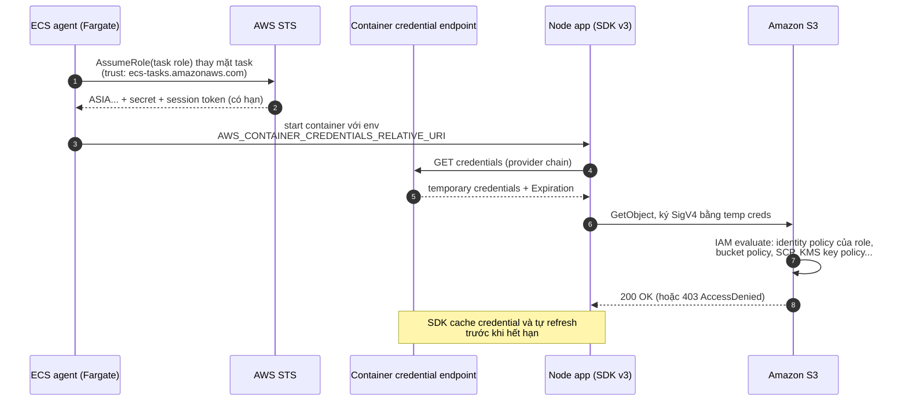

## Bối cảnh & vấn đề

Một team deploy API Node.js lên ECS. Để "cho chạy được trước", một dev tạo IAM user `api-prod`, gắn `AmazonS3FullAccess`, rồi copy `AWS_ACCESS_KEY_ID` và `AWS_SECRET_ACCESS_KEY` vào file `.env`, file này lại được bake vào Docker image. Sáu tháng sau, image được push nhầm lên một registry public để demo cho đối tác. Trong vòng vài giờ, bot quét registry tìm thấy key. Key này **không bao giờ hết hạn**, có quyền trên **mọi bucket** của account, và không ai nhớ nó còn được dùng ở đâu nên không dám xoá ngay.

Ba lỗi chồng lên nhau: (1) workload dùng **long-term credential** thay vì credential tạm thời; (2) quyền quá rộng (`s3:*` trên `*`) thay vì least privilege; (3) secret nằm trong artifact (image) thay vì được cấp lúc chạy. IAM có câu trả lời cho cả ba: **role + STS** cho workload, policy hẹp theo **action + resource + condition**, và các credential provider tự động (ECS task role, EKS Pod Identity, EC2 instance profile qua IMDSv2) để code không bao giờ cầm key dài hạn.

Bài này dựng nền cho cả track: IAM là câu hỏi mở màn của gần như mọi buổi phỏng vấn AWS, và là lớp mà mọi lớp khác (VPC, S3, KMS, SQS) phụ thuộc vào. Thứ tự đánh giá policy khi có SCP, permission boundary và cross-account nằm ở [bài 2](/tracks/aws/learn/policy-evaluation-governance).

## Khái niệm

### Principal, request và "ai được làm gì trên cái gì"

Mọi lời gọi AWS API (từ console, CLI, SDK) là một **request** đã được ký bằng **SigV4** (Signature Version 4: thuật toán ký HMAC dùng secret key). Request có bốn thành phần IAM quan tâm: **principal** (ai gọi: một user, một role session, một service như `cloudfront.amazonaws.com`), **action** (`s3:GetObject`), **resource** (ARN của thứ bị tác động) và **context** (IP nguồn, giờ, tag, VPC endpoint, có MFA không...). IAM so request với các **policy** (tài liệu JSON) để quyết định Allow hay Deny.

**ARN** (Amazon Resource Name) là định danh toàn cục: `arn:aws:s3:::acme-reports` (bucket), `arn:aws:s3:::acme-reports/reports/a.csv` (object), `arn:aws:iam::111122223333:role/api-task-role` (role). Phần account và region trống ở S3 vì tên bucket là duy nhất toàn cầu. Nắm cấu trúc ARN là điều kiện để viết policy đúng: rất nhiều lỗi AccessDenied đến từ ARN sai kiểu tài nguyên.

**Interview angle:** khi được hỏi "IAM hoạt động thế nào", trả lời bằng bốn thành phần principal/action/resource/condition và "mặc định là deny" cho thấy bạn có mental model, không chỉ thuộc tên service.

### IAM user, IAM group, IAM role

**IAM user** là identity lâu dài đại diện cho một người hoặc một ứng dụng, có thể có password (đăng nhập console) và tối đa hai **access key** dài hạn (`AKIA...`). Access key không tự hết hạn; nó chỉ chết khi bạn vô hiệu hoá hoặc xoá nó. Đó là lý do user là loại identity rủi ro nhất.

**IAM group** chỉ là một tập user để gắn policy chung (nhóm `developers` gắn policy đọc CloudWatch). Group **không phải principal**: không đăng nhập được, không assume được, không xuất hiện trong trường `Principal` của resource policy. Group cũng không lồng nhau.

**IAM role** là identity **không có credential dài hạn**. Role có hai policy quan trọng: **trust policy** nói *ai được phép trở thành role này*, và **permissions policy** nói *khi đã là role thì được làm gì*. Một principal được trust gọi `sts:AssumeRole` (hoặc service tự gọi thay bạn) và nhận về **temporary credentials**: bộ ba `AccessKeyId` (bắt đầu bằng `ASIA`), `SecretAccessKey`, `SessionToken`, có thời hạn (mặc định 1 giờ). Hết hạn thì credential vô dụng, kể cả khi bị lộ.

Với người thật, best practice hiện tại là **IAM Identity Center** (SSO): người đăng nhập qua IdP công ty, chọn permission set, và nhận credential tạm thời của một role trong account đích. IAM user chỉ còn cho các trường hợp đặc biệt (một số tích hợp bên thứ ba chưa hỗ trợ role, break-glass).

**Interview angle:** câu "Node API trên ECS nên dùng identity nào" có đáp án là **task role**; red flag lớn nhất là "tạo IAM user rồi để key trong `.env`".

### Temporary credentials và STS

**STS** (Security Token Service) là service phát hành credential tạm thời. Các API chính: `AssumeRole` (principal AWS assume role), `AssumeRoleWithWebIdentity` (đổi một OIDC token, ví dụ từ GitHub Actions hay EKS service account, lấy credential), `AssumeRoleWithSAML` (đổi SAML assertion), `GetSessionToken` (user lấy session tạm, thường để kèm MFA).

Thời hạn session do caller xin (`DurationSeconds`), bị chặn bởi `MaxSessionDuration` của role (từ 1 tới 12 giờ). Ngoại lệ đáng nhớ: **role chaining** (dùng credential của một role để assume role khác) bị giới hạn tối đa **1 giờ** (verify). Mỗi session có **role session name**, xuất hiện trong ARN `arn:aws:sts::111122223333:assumed-role/api-task-role/<session-name>` và trong CloudTrail, nên audit vẫn biết "ai" đứng sau role.

Lưu ý: credential tạm thời không thể bị "thu hồi" từng cái một qua STS. Muốn vô hiệu hoá các session đang sống của một role, bạn gắn một policy Deny có điều kiện `aws:TokenIssueTime` nhỏ hơn thời điểm hiện tại (console gọi là "Revoke active sessions"). Đây là chi tiết quan trọng khi xử lý sự cố ([bài 2](/tracks/aws/learn/policy-evaluation-governance)).

**Interview angle:** interviewer hay hỏi tiếp "credential tạm thời bị lộ thì sao" — câu trả lời: thời hạn ngắn giới hạn thiệt hại, và revoke bằng Deny theo `aws:TokenIssueTime`.

### Trust policy và permissions policy

**Trust policy** là một **resource-based policy** gắn trên chính role; trường `Principal` liệt kê ai được assume, kèm `Condition` để siết. Ví dụ trust cho ECS task:

```json
{
  "Version": "2012-10-17",
  "Statement": [{
    "Effect": "Allow",
    "Principal": { "Service": "ecs-tasks.amazonaws.com" },
    "Action": "sts:AssumeRole",
    "Condition": {
      "ArnLike": { "aws:SourceArn": "arn:aws:ecs:ap-southeast-1:111122223333:*" },
      "StringEquals": { "aws:SourceAccount": "111122223333" }
    }
  }]
}
```

**Permissions policy** (identity-based policy gắn vào role) quyết định quyền sau khi assume. Hai policy độc lập: trust policy rộng mà permissions hẹp thì ai cũng thành role được nhưng chẳng làm được gì nhiều; trust policy hẹp mà permissions rộng thì chỉ đúng service/người đó có quyền rộng.

Khi một principal AWS (user/role) assume role **cùng account**, cần: identity policy của caller cho phép `sts:AssumeRole` trên ARN role **hoặc** trust policy nêu đích danh ARN caller (trust policy là resource policy nên tự nó có thể cấp, verify chi tiết theo docs). Khi **khác account**, cần **cả hai**: caller có `sts:AssumeRole` trong identity policy và trust policy ở account đích cho phép caller. Với bên thứ ba (SaaS giám sát assume role vào account bạn), thêm `sts:ExternalId` để chống **confused deputy**: kẻ tấn công không thể lừa SaaS assume role của *bạn* thay cho họ, vì họ không biết ExternalId riêng của bạn. Với service principal, `aws:SourceArn`/`aws:SourceAccount` đóng vai trò tương tự.

**Interview angle:** "trust policy vs permissions policy" là câu kiểm tra bạn đã thật sự cấu hình role hay chỉ bấm wizard; nhắc confused deputy + ExternalId là điểm cộng senior.

### Least privilege và resource type của từng action

**Least privilege** là cấp đúng action, đúng resource, đúng điều kiện cần thiết. Phần dễ sai nhất là **resource**: mỗi action chỉ áp dụng cho một số **resource type** nhất định, ghi trong bảng "Actions, resources, and condition keys" của từng service. Với S3: `s3:ListBucket` là action trên **bucket** (`arn:aws:s3:::acme-reports`), còn `s3:GetObject`/`s3:PutObject` là action trên **object** (`arn:aws:s3:::acme-reports/*`). ARN `bucket/*` không match bucket, nên policy gom cả hai vào một statement với `Resource: bucket/*` sẽ làm `ListObjectsV2` bị implicit deny trong khi `GetObject` chạy được.

Siết thêm bằng **condition key**: `s3:prefix` cho `ListBucket` (chỉ liệt kê một prefix), `s3:x-amz-server-side-encryption` (bắt buộc SSE-KMS), `aws:SourceVpce` (chỉ qua VPC endpoint của bạn), và **policy variable** như `${aws:PrincipalTag/tenant_id}` để một policy dùng chung cho mọi tenant mà mỗi session chỉ ghi được vào prefix của tenant mình (session tag được truyền lúc `AssumeRole`).

Công cụ: **IAM Access Analyzer** (validate policy, tìm quyền không dùng, generate policy từ CloudTrail), **last accessed data** để cắt action không dùng, và **IAM Policy Simulator** (trên console) để thử. Trong bài này dùng một simulator mã nguồn mở chạy local để có output thật mà không cần account.

**Interview angle:** câu debug "GetObject chạy, ListObjects AccessDenied" kiểm tra đúng một điều: bạn có biết action gắn với resource type không. Red flag là "đổi Resource thành `*`".

### Task role, execution role và credential provider chain

Trên ECS có hai role thường bị nhầm. **Task execution role** là quyền của **ECS agent** (hạ tầng) để chuẩn bị task: kéo image từ ECR (`ecr:GetAuthorizationToken`, `ecr:BatchGetImage`), ghi log vào CloudWatch Logs, và đọc secret từ Secrets Manager/Parameter Store khi bạn khai báo `secrets` trong task definition để inject thành biến môi trường. **Task role** là quyền của **code bạn** khi chạy: đọc bucket, gửi message SQS, gọi DynamoDB.

Vì thế, nếu DB password được inject qua `secrets` của task definition, người cần `secretsmanager:GetSecretValue` là **execution role** (agent đọc secret trước khi container chạy). Nếu app tự gọi Secrets Manager lúc runtime (để nhận rotation không cần restart), người cần quyền là **task role**.

Code không cần biết credential ở đâu: **default credential provider chain** của AWS SDK v3 lần lượt thử biến môi trường, file `~/.aws`, SSO, web identity token file (EKS IRSA), **container credential endpoint** (ECS/EKS Pod Identity, qua biến `AWS_CONTAINER_CREDENTIALS_RELATIVE_URI` hoặc `_FULL_URI`), rồi **IMDS** (EC2). Credential tạm thời được cache và tự refresh trước khi hết hạn. Hệ quả thực tế: `new S3Client({})` không truyền key gì cả là cách viết đúng trên ECS.

**Interview angle:** follow-up "role nào cần `GetSecretValue` khi inject secret thành env var" là câu phân loại ứng viên đã vận hành ECS thật.

### IMDSv2, IRSA và EKS Pod Identity

Trên EC2, credential của **instance profile** (role gắn vào instance) được phát qua **Instance Metadata Service** ở `169.254.169.254`. IMDSv1 trả credential cho bất kỳ GET nào, nên một lỗ **SSRF** (server-side request forgery: app bị lừa gọi URL do kẻ tấn công chọn) là đủ để đánh cắp credential, đúng kịch bản của vụ Capital One 2019. **IMDSv2** bắt buộc một bước `PUT /latest/api/token` để lấy session token rồi gửi kèm header `X-aws-ec2-metadata-token` cho mọi GET; SSRF thông thường chỉ điều khiển được GET và không đặt được header tuỳ ý, nên bị chặn. Thêm **hop limit = 1** (TTL của gói trả lời) để container chạy trong instance (thêm một hop mạng) không với tới IMDS.

Trên EKS, cách sai là để mọi pod dùng role của **node** (mọi pod trên node có chung quyền rộng nhất). Cách đúng: **EKS Pod Identity** (agent trên node phát credential theo service account, cấu hình bằng *pod identity association*, trust principal `pods.eks.amazonaws.com`) hoặc **IRSA** (IAM Roles for Service Accounts: pod nhận projected OIDC token và SDK gọi `AssumeRoleWithWebIdentity`, trust policy điều kiện trên `sub = system:serviceaccount:<ns>:<sa>`). Mỗi service account một role, least privilege theo workload.

**Interview angle:** "IMDSv2 chống SSRF thế nào" muốn nghe hai ý: PUT lấy token (SSRF thường chỉ GET) và hop limit 1 (container không với tới).

## Cơ chế hoạt động

Luồng dưới đây là những gì xảy ra khi một Node API trên ECS Fargate gọi `GetObject` lần đầu, từ lúc task khởi động tới lúc S3 trả object.



Diễn giải từng bước: ECS (không phải code của bạn) assume task role, và chỉ làm được vì trust policy của role cho phép `ecs-tasks.amazonaws.com`. Credential được đưa cho container qua một endpoint nội bộ thay vì biến môi trường chứa key; biến môi trường chỉ chứa **đường dẫn** tới endpoint. SDK v3 tự tìm thấy endpoint trong provider chain, lấy credential, và ký mọi request. Khi request tới S3, phía AWS mới đánh giá policy: role có Allow cho action/resource không, bucket policy có Deny không, SCP của Organization có chặn không, và nếu object mã hoá SSE-KMS thì key policy có cho `kms:Decrypt` không. Credential sắp hết hạn thì SDK gọi lại endpoint; app không bao giờ phải restart để "đổi key".

Điểm thiết kế quan trọng: **nơi giữ secret dài hạn duy nhất là AWS**. Code, image, biến môi trường đều không có gì đáng giá để đánh cắp; thứ lộ ra (nếu có) là credential sống vài giờ.

## Ví dụ thực tế

### Chạy policy qua IAM simulator local

Các output dưới đây chạy thật bằng `@cloud-copilot/iam-simulate` 0.1.173 (thư viện mô phỏng IAM evaluation mã nguồn mở, Node 24.21), không dùng account AWS. Simulator là mô hình của IAM, không phải IAM thật; với quyết định quan trọng vẫn kiểm bằng IAM Policy Simulator hoặc Access Analyzer trên account thật.

```ts
import { runSimulation, type Simulation } from "@cloud-copilot/iam-simulate";

const role = "arn:aws:iam::111122223333:role/report-worker";
const buggy = { name: "worker", policy: { Version: "2012-10-17", Statement: [
  { Effect: "Allow", Action: ["s3:GetObject", "s3:ListBucket"], Resource: "arn:aws:s3:::acme-reports/*" },
] } };
const fixed = { name: "worker", policy: { Version: "2012-10-17", Statement: [
  { Sid: "List", Effect: "Allow", Action: "s3:ListBucket", Resource: "arn:aws:s3:::acme-reports",
    Condition: { StringLike: { "s3:prefix": "reports/t-42/*" } } },
  { Sid: "Read", Effect: "Allow", Action: "s3:GetObject", Resource: "arn:aws:s3:::acme-reports/reports/t-42/*" },
] } };

const req = (action: string, resource: string, ctx: Record<string, string> = {}) =>
  ({ principal: role, action, resource: { accountId: "111122223333", resource }, contextVariables: ctx });

const r = await runSimulation({ identityPolicies: [buggy], serviceControlPolicies: [], resourceControlPolicies: [],
  request: req("s3:ListBucket", "arn:aws:s3:::acme-reports", { "s3:prefix": "reports/t-42/" }) } as Simulation, {});
console.log(r.resultType === "single" ? r.overallResult : r);
```

```text
# aws-014 ListBucket vs GetObject
buggy  GetObject reports/t-42/a.csv              -> Allowed
buggy  ListBucket acme-reports                   -> ImplicitlyDenied
fixed  ListBucket prefix reports/t-42/           -> Allowed
fixed  ListBucket prefix reports/t-99/           -> ImplicitlyDenied
```

Đúng như câu debug: policy gom chung làm `GetObject` chạy còn `ListBucket` bị **implicit deny** (không có statement nào match, chứ không phải bị Deny). Bản sửa tách hai statement theo resource type, và dùng `s3:prefix` để liệt kê chỉ được prefix của tenant `t-42`.

### Least privilege cho upload avatar, và prefix theo tenant

```json
{
  "Version": "2012-10-17",
  "Statement": [{
    "Effect": "Allow",
    "Action": "s3:PutObject",
    "Resource": "arn:aws:s3:::acme-uploads/avatars/${aws:PrincipalTag/tenant_id}/*"
  }]
}
```

```text
# aws-002 avatar least privilege (policy cố định avatars/*)
PutObject avatars/u1.png                         -> Allowed
PutObject invoices/x.pdf                         -> ImplicitlyDenied
DeleteObject avatars/u1.png                      -> ImplicitlyDenied
# policy variable theo session tag tenant_id
tag tenant=t-42 -> avatars/t-42/a.png            -> Allowed
tag tenant=t-42 -> avatars/t-99/a.png            -> ImplicitlyDenied
```

Policy cố định `avatars/*` chặn ghi sang prefix khác và chặn xoá. Policy dùng `${aws:PrincipalTag/tenant_id}` cho phép một role phục vụ mọi tenant: khi backend assume role với session tag `tenant_id=t-42` (`AssumeRole` có tham số `Tags`, trust policy phải cho `sts:TagSession`), session đó chỉ ghi được dưới `avatars/t-42/`. Trong thực tế đa số app kiểm tra tenant ở tầng API rồi ký presigned URL với key do server sinh ([bài 7](/tracks/aws/learn/s3-cloudfront)); session tag là lớp phòng thủ thứ hai khi muốn IAM tự chặn.

### SDK lấy credential thế nào: container endpoint và IMDSv2

Một HTTP server local đóng giả endpoint credential của ECS và IMDS; SDK v3 (`@aws-sdk/credential-providers`, cùng bộ 3.1144) được trỏ vào nó qua biến môi trường mà ECS/EC2 thật cũng dùng:

```ts
import { fromContainerMetadata, fromInstanceMetadata } from "@aws-sdk/credential-providers";

process.env.AWS_CONTAINER_CREDENTIALS_FULL_URI = `http://127.0.0.1:${port}/v2/credentials/abc-123`;
const c = await fromContainerMetadata()();          // ECS / EKS Pod Identity path

process.env.AWS_EC2_METADATA_SERVICE_ENDPOINT = `http://127.0.0.1:${port}`;
const i = await fromInstanceMetadata()();           // EC2 IMDS path
```

```text
## ECS: container credential endpoint
  [endpoint] GET /v2/credentials/abc-123 token=no auth=no
  resolved ASIAEXAMPLETEMPKEY expires 2026-10-01T08:40:06.038Z (temporary: has sessionToken = true)
## EC2: IMDSv2 (PUT token, then GET with token)
  [endpoint] PUT /latest/api/token token=no auth=no
  [endpoint] GET /latest/meta-data/iam/security-credentials/ token=yes auth=no
  [endpoint] GET /latest/meta-data/iam/security-credentials/app-instance-role token=yes auth=no
  resolved ASIAEXAMPLETEMPKEY
```

Hai điều nhìn thấy được: (1) credential nhận về luôn có `sessionToken` và `Expiration`, tức là tạm thời; (2) SDK v3 mặc định dùng **IMDSv2**: luôn `PUT` lấy token trước, mọi `GET` sau đó mang header token. Endpoint giả trả 401 nếu thiếu token, giống instance bật `HttpTokens=required`. Bắt buộc IMDSv2 trên instance có sẵn:

```bash
aws ec2 modify-instance-metadata-options --instance-id i-0abc123 \
  --http-tokens required --http-put-response-hop-limit 1 --http-endpoint enabled   # minh hoạ
```

### Task role và execution role bằng CDK (minh hoạ)

```ts
import * as ecs from "aws-cdk-lib/aws-ecs";
import * as s3 from "aws-cdk-lib/aws-s3";
import * as sm from "aws-cdk-lib/aws-secretsmanager";

const taskDef = new ecs.FargateTaskDefinition(this, "Api", { cpu: 512, memoryLimitMiB: 1024 });
taskDef.addContainer("api", {
  image: ecs.ContainerImage.fromEcrRepository(repo, "1.42.0"),
  secrets: { DATABASE_PASSWORD: ecs.Secret.fromSecretsManager(dbSecret, "password") }, // -> execution role gets GetSecretValue
  logging: ecs.LogDrivers.awsLogs({ streamPrefix: "api" }),                            // -> execution role gets logs:PutLogEvents
});
uploadsBucket.grantPut(taskDef.taskRole, "avatars/*");                                  // -> task role: s3:PutObject on avatars/*
```

CDK tự phân quyền đúng role: `secrets` và log driver cấp quyền cho **execution role**, còn `grantPut` cấp cho **task role**. Đọc template sinh ra (`cdk synth`) là cách nhanh để học policy JSON tương ứng.

## Trade-offs & lựa chọn thay thế

| Cách cấp quyền | Credential | Phạm vi | Khi nào dùng | Rủi ro chính |
|---|---|---|---|---|
| IAM user + access key | Dài hạn (`AKIA`) | Theo user | Hệ thống bên thứ ba chưa hỗ trợ role, break-glass | Lộ là dùng được mãi; rotate thủ công |
| IAM Identity Center (SSO) | Tạm thời, theo permission set | Người, đa account | Mọi người dùng thật | Phụ thuộc IdP; cần break-glass |
| ECS task role | Tạm thời qua container endpoint | Mỗi task definition | Container trên ECS/Fargate | Role dùng chung cho nhiều service |
| EKS Pod Identity / IRSA | Tạm thời theo service account | Mỗi service account | Pod trên EKS | Dùng nhầm role của node |
| EC2 instance profile | Tạm thời qua IMDS | Cả instance | App trên EC2 | IMDSv1 + SSRF; container trên instance thừa hưởng quyền |
| OIDC federation (CI) | Tạm thời theo job | Repo/branch/env | GitHub Actions, GitLab CI | Condition `sub` quá rộng |

Chọn theo nguyên tắc: **người** thì SSO, **workload** thì role gắn với đơn vị deploy nhỏ nhất (task, service account), **CI** thì OIDC ([bài 2](/tracks/aws/learn/policy-evaluation-governance)). IAM user chỉ khi không còn cách nào khác, và khi đó key phải có chủ sở hữu, có rotation, có alarm khi dùng từ IP lạ.

Về độ hạt của role: một role cho mỗi service (task definition) là mặc định tốt. Gom nhiều service vào một role làm blast radius lớn (service A bị RCE thì có quyền của B). Ngược lại, role cho từng tenant thường quá nhiều để quản lý; dùng session tag + policy variable như ví dụ trên khi thật sự cần IAM chặn theo tenant.

## Edge cases & failure modes

- **Credential hết hạn giữa job dài**: SDK tự refresh credential từ provider; nhưng nếu bạn tự gọi `AssumeRole` và giữ credential trong biến, job 3 giờ với session 1 giờ sẽ gặp `ExpiredToken`. Dùng `fromTemporaryCredentials` của SDK (tự refresh) thay vì cache tay.
- **Presigned URL chết sớm**: URL ký bằng credential tạm thời hết hạn khi session hết hạn, dù `expiresIn` dài hơn ([bài 7](/tracks/aws/learn/s3-cloudfront)).
- **Role chaining 1 giờ**: Lambda (đã là role session) assume tiếp một role khác với `DurationSeconds: 7200` bị lỗi vì chaining giới hạn 1 giờ (verify).
- **Eventual consistency của IAM**: policy mới tạo hoặc sửa có thể mất vài giây mới có hiệu lực toàn cầu; script IaC tạo role rồi dùng ngay đôi khi gặp AccessDenied thoáng qua. Retry có backoff.
- **Quá giới hạn kích thước policy**: managed policy tối đa 6.144 ký tự, inline policy của role có tổng giới hạn riêng (verify). Policy liệt kê hàng trăm ARN nên chuyển sang wildcard có cấu trúc hoặc tag-based (ABAC).
- **IMDS hop limit**: tăng hop limit lên 2 để container trên EC2 (Docker bridge) dùng được IMDS là đánh đổi bảo mật; trên ECS EC2 launch type nên dùng task role và chặn container truy cập IMDS.
- **Service-linked role**: một số service tạo role riêng (`AWSServiceRoleForECS`); xoá hay sửa nó làm service hỏng theo cách khó đoán.

## Pitfalls

- ❌ Access key trong `.env`, Dockerfile hoặc biến môi trường của task definition → ✅ task role / Pod Identity / instance profile; code dùng `new S3Client({})` và để provider chain lo phần còn lại.
- ❌ `AmazonS3FullAccess` "cho chạy được đã" → ✅ viết policy theo action + resource + condition ngay từ đầu, dùng Access Analyzer để generate từ CloudTrail rồi siết.
- ❌ Gom `s3:ListBucket` và `s3:GetObject` vào một statement với `bucket/*` → ✅ tách theo resource type; ListBucket dùng ARN bucket và `s3:prefix`.
- ❌ Đổi `Resource` thành `*` khi gặp AccessDenied → ✅ đọc thông báo lỗi (AWS ngày càng ghi rõ policy type nào chặn), tra bảng actions/resources của service.
- ❌ Nhầm task role với execution role → ✅ agent cần execution role (ECR, logs, secrets inject); code cần task role.
- ❌ Trust policy cho `"AWS": "*"` hoặc cả account bên thứ ba mà không có `sts:ExternalId` → ✅ principal cụ thể + ExternalId / `aws:SourceArn`.
- ❌ Để IMDSv1 bật trên EC2 → ✅ `HttpTokens=required`, hop limit 1, và chặn IMDSv1 bằng SCP/`ec2:MetadataHttpTokens` condition.
- ❌ Pod EKS dùng role của node → ✅ Pod Identity hoặc IRSA, một service account một role.

## Tóm tắt

- Mọi request AWS = principal + action + resource + context; mặc định deny, cần một Allow khớp.
- User có key dài hạn; group chỉ để gom user; role không có key, được assume qua STS để nhận credential tạm thời (`ASIA...` + session token + hạn).
- Trust policy = ai được trở thành role; permissions policy = role được làm gì. Bên thứ ba thì thêm `sts:ExternalId` chống confused deputy.
- Mỗi action có resource type riêng: `ListBucket` trên bucket ARN, `GetObject` trên `bucket/*`. Condition key và policy variable để siết theo prefix/tenant.
- ECS: execution role cho agent (ECR, logs, inject secret), task role cho code. SDK v3 tự lấy credential qua provider chain.
- EC2 bắt buộc IMDSv2 + hop limit 1 để chống SSRF; EKS dùng Pod Identity/IRSA, không dùng role của node.
- Người dùng thật đăng nhập qua Identity Center; IAM user chỉ còn cho ngoại lệ.
