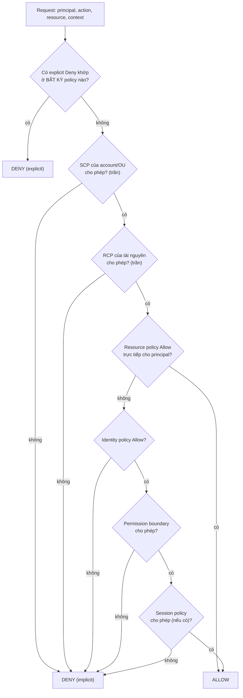

## Bối cảnh & vấn đề

Một developer có `AdministratorAccess` trong account `prod`, nhưng lệnh `aws ec2 run-instances --region eu-west-1` vẫn trả `UnauthorizedOperation ... with an explicit deny in a service control policy`. Cùng tuần, một team khác than: "bucket policy đã cho account analytics đọc rồi mà vẫn AccessDenied". Và một bạn junior hỏi: "em có quyền `iam:CreateRole` mà sao tạo role không được?".

Cả ba đều là cùng một câu hỏi: **IAM gộp nhiều loại policy lại thế nào**. Một request trong một tổ chức thật không chỉ bị kiểm bởi policy gắn trên user/role; nó còn đi qua **SCP** và **RCP** của AWS Organizations, **permission boundary**, **session policy**, **resource-based policy** (bucket policy, trust policy, KMS key policy), và nếu đi xuyên account thì phải được **cả hai phía** đồng ý. Không nắm thứ tự này, người ta sửa bừa (thêm `*`, gỡ guardrail) và tạo lỗ hổng.

Bài này đi qua thuật toán đánh giá, rồi dùng nó cho ba việc thực tế mà interviewer hay hỏi: bỏ access key khỏi CI bằng **OIDC federation**, thiết kế **multi-account** với guardrail cho công ty 30 kỹ sư, và **phản ứng sự cố** khi key admin bị đẩy lên GitHub public. Phần nền về principal/role/STS ở [bài 1](/tracks/aws/learn/iam-identities-roles).

## Khái niệm

### Các loại policy và vai trò "cấp quyền" hay "đặt trần"

IAM có sáu loại policy, chia làm hai nhóm. Nhóm **cấp quyền (grant)**: **identity-based policy** (gắn vào user/group/role) và **resource-based policy** (gắn vào tài nguyên: bucket policy, SQS queue policy, KMS key policy, role trust policy). Nhóm **đặt trần (guardrail)**: **SCP** (service control policy, áp lên principal trong account thành viên của Organization), **RCP** (resource control policy, áp lên tài nguyên trong account thành viên, ra mắt cuối 2024), **permission boundary** (trần cho một user/role cụ thể) và **session policy** (trần truyền vào lúc `AssumeRole`/federation cho riêng session đó).

Điểm then chốt: policy nhóm trần **không bao giờ cấp quyền**. Một SCP `Allow s3:*` không làm ai có quyền đọc S3; nó chỉ nói "trong account này, S3 là thứ được phép cấp". Quyền hiệu lực là **giao** của các trần, sau đó cần ít nhất một Allow từ nhóm grant, và cuối cùng bất kỳ **explicit Deny** nào ở bất kỳ đâu cũng thắng.

Hai ngoại lệ hay gặp: SCP **không** áp lên management account của Organization (vì thế không chạy workload ở đó), và SCP không áp lên service-linked role.

**Interview angle:** câu "SCP cấp quyền cho account" là red flag kinh điển; câu trả lời tốt dùng từ "ceiling" hoặc "guardrail".

### Implicit deny, explicit deny và Allow

Mặc định mọi request là **implicit deny** (không có gì cho phép). Một statement `"Effect": "Allow"` khớp principal/action/resource/condition sẽ chuyển thành Allow, trừ khi có một statement `"Effect": "Deny"` khớp, khi đó là **explicit deny** và không gì vượt qua được. Phân biệt hai loại deny có giá trị khi debug: thông báo lỗi hiện đại của AWS ghi rõ "no identity-based policy allows" (implicit, thiếu Allow) hay "with an explicit deny in a service control policy" (bị guardrail chặn, đừng thêm Allow mà đi hỏi team platform).

**Interview angle:** "Allow ở policy này có thắng Deny ở policy kia không?" — không bao giờ.

### Permission boundary và session policy

**Permission boundary** là một managed policy gắn vào user/role làm trần: quyền hiệu lực = identity policy ∩ boundary. Use case chính là **ủy quyền an toàn**: team platform cho developer quyền `iam:CreateRole`, nhưng kèm điều kiện `iam:PermissionsBoundary` bắt buộc role mới phải gắn boundary `dev-boundary`. Nhờ đó developer tự tạo role cho Lambda của mình mà không thể tạo một role admin để leo thang đặc quyền (privilege escalation).

**Session policy** truyền vào `AssumeRole` (tham số `Policy`/`PolicyArns`) để thu hẹp quyền cho riêng session: ví dụ một broker service assume role chung rồi truyền session policy chỉ cho prefix của một tenant.

**Interview angle:** follow-up "vì sao platform team bắt gắn boundary khi cho tạo role" muốn nghe đúng chữ "privilege escalation".

### Cross-account: cả hai phía phải đồng ý

Khi principal ở account A gọi tài nguyên ở account B, IAM đánh giá **hai lần**: phía A cần identity policy cho phép action trên ARN của B (và SCP của A không chặn), phía B cần resource policy cho phép principal của A (và RCP của B không chặn). Thiếu một trong hai là deny. Với tài nguyên không có resource policy (đa số service), cách duy nhất là A **assume một role ở B** (trust policy của role ở B cho phép A).

Trong **cùng account** thì khác: resource policy nêu đích danh principal là đủ, không cần identity policy (với một số tinh chỉnh khi có permission boundary hoặc principal là role session, verify trong docs "Policy evaluation logic").

Các condition key hữu ích cho cross-account: `aws:PrincipalOrgID` (chỉ cho principal thuộc Organization của mình, thay vì liệt kê từng account), `aws:SourceArn`/`aws:SourceAccount` (khi principal là service), `aws:ResourceOrgID` (chặn ghi ra bucket ngoài tổ chức, chống data exfiltration).

**Interview angle:** "bucket policy cho account kia rồi mà vẫn AccessDenied" — kiểm tra identity policy phía bên gọi, SCP phía gọi, và nếu object mã hoá KMS thì key policy.

### OIDC federation cho CI/CD

Thay vì lưu access key làm secret của repo, GitHub Actions có thể xin một **OIDC token** (JWT ký bởi `token.actions.githubusercontent.com`) mô tả job: repo, branch, environment. AWS tin token này nhờ **IAM OIDC identity provider** bạn tạo trong account. Job gọi `sts:AssumeRoleWithWebIdentity` với token, trust policy của role kiểm tra `aud = sts.amazonaws.com` và **`sub`** (ví dụ `repo:acme/shop:environment:prod`), STS trả credential sống vài chục phút.

Lợi ích: không còn secret dài hạn để lộ, quyền theo từng repo/branch/environment, và CloudTrail ghi session name theo run. Rủi ro lớn nhất là **condition `sub` quá rộng** (`repo:acme/*` hoặc thiếu hẳn): bất kỳ repo nào (kể cả fork, PR từ ngoài, tuỳ cấu hình) cũng assume được role deploy prod.

**Interview angle:** red flag là "rotate key 90 ngày một lần" như đáp án cuối; đáp án đúng là xoá hẳn key.

### AWS Organizations, OU, Identity Center và Control Tower

**AWS Organizations** gom nhiều account dưới một management account, chia thành **OU** (organizational unit) để gắn SCP/RCP theo nhóm. Mô hình khuyến nghị: OU **Security** (account log archive, account audit/security tooling), OU **Infrastructure** (shared networking, CI/CD), OU **Workloads** chia **prod/non-prod**, OU **Sandbox** (thử nghiệm, có budget cứng). **IAM Identity Center** kết nối IdP công ty (Google Workspace, Entra ID, Okta) và cấp **permission set** theo vai trò cho từng account. **Control Tower** dựng sẵn landing zone này kèm guardrail (controls) phổ biến.

Lý do dùng nhiều account: account là **ranh giới cô lập mạnh nhất** của AWS (quota, IAM, billing, blast radius). Lỗi IAM ở dev không chạm được prod; hoá đơn tách theo account; xoá cả một sandbox là sạch.

**Interview angle:** câu thiết kế multi-account thường kết thúc bằng "dev cần quyền admin tạm thời trong prod lúc sự cố" — câu trả lời: break-glass permission set có thời hạn, phê duyệt, ghi log, alarm khi dùng.

## Cơ chế hoạt động

Thuật toán rút gọn cho một request **trong cùng account** (cross-account thêm một lượt đánh giá phía tài nguyên):



Đọc sơ đồ theo thứ tự: Deny tường minh được kiểm trước và thắng tuyệt đối. Rồi tới các trần của Organization: SCP (phía principal) và RCP (phía tài nguyên). Sau đó cần **ít nhất một Allow**: nếu resource policy cấp trực tiếp cho principal trong cùng account thì đủ; nếu không, phải có identity policy Allow, và identity policy đó còn bị cắt bởi permission boundary và session policy. Sơ đồ là bản rút gọn; AWS docs có các nhánh chi tiết hơn (ví dụ resource policy cấp cho role ARN thay vì role session ARN thì vẫn bị boundary/session policy giới hạn, verify).

Với **cross-account**, hãy hình dung chạy sơ đồ hai lần: lượt phía account gọi (SCP của A + identity policy của principal) và lượt phía account tài nguyên (RCP của B + resource policy). Cả hai cùng Allow mới qua.

## Ví dụ thực tế

### Chạy các lớp evaluation qua simulator

Output thật từ `@cloud-copilot/iam-simulate` 0.1.173 trên Node 24.21 (không dùng account AWS; simulator là mô hình, không phải IAM thật):

```ts
const admin = { name: "AdministratorAccess", policy: { Version: "2012-10-17",
  Statement: [{ Effect: "Allow", Action: "*", Resource: "*" }] } };
const boundary = [{ name: "s3-only-boundary", policy: { Version: "2012-10-17",
  Statement: [{ Effect: "Allow", Action: "s3:*", Resource: "*" }] } }];
const denyOtherRegions = { name: "DenyOtherRegions", policy: { Version: "2012-10-17", Statement: [{
  Effect: "Deny",
  NotAction: ["iam:*", "sts:*", "organizations:*", "cloudfront:*", "route53:*", "support:*"],
  Resource: "*",
  Condition: { StringNotEquals: { "aws:RequestedRegion": ["ap-southeast-1", "us-east-1"] } },
}] } };

await runSimulation({ identityPolicies: [admin], permissionBoundaryPolicies: boundary,
  serviceControlPolicies: fullAccessScp, resourceControlPolicies: [],
  request: { principal: dev, action: "iam:CreateRole", resource: roleArn, contextVariables: {} } }, {});
```

```text
# aws-015 evaluation layers
admin + boundary(s3:*) -> iam:CreateRole         -> ImplicitlyDenied
admin + boundary(s3:*) -> s3:GetObject           -> Allowed
admin + SCP region -> RunInstances ap-southeast-1 -> Allowed
admin + SCP region -> RunInstances eu-west-1     -> ExplicitlyDenied
no identity policy + SCP allow s3:* -> GetObject -> ImplicitlyDenied
admin + explicit Deny DeleteObject               -> ExplicitlyDenied
# cross-account
x-acct identity only                             -> ImplicitlyDenied
x-acct bucket policy only                        -> ImplicitlyDenied
x-acct both                                      -> Allowed
# same-account resource policy only
same-acct bucket policy only (role ARN)          -> Allowed
```

Từng dòng ứng với một khái niệm: `AdministratorAccess` bị boundary `s3:*` cắt nên không tạo được role (implicit deny, vì boundary không "Allow" IAM); SCP chặn region trả **explicit** deny ngay cả với admin, còn region được phép thì chạy; SCP `Allow s3:*` một mình không cấp gì; một Deny tường minh thắng `Action: "*"`. Phần cross-account cho thấy đúng quy tắc "cả hai phía": chỉ identity policy hoặc chỉ bucket policy đều bị từ chối, có cả hai mới Allow. Trong cùng account, bucket policy nêu đích danh role là đủ.

`NotAction` trong SCP chặn region là mẫu thật trong docs Organizations: các service toàn cầu (IAM, CloudFront, Route 53...) có endpoint ở `us-east-1`, nên phải được miễn trừ, nếu không bạn khoá cả việc quản lý IAM.

### GitHub Actions deploy bằng OIDC, không có access key

Trust policy của role deploy prod (Terraform, minh hoạ):

```hcl
resource "aws_iam_openid_connect_provider" "github" {
  url            = "https://token.actions.githubusercontent.com"
  client_id_list = ["sts.amazonaws.com"]
}

data "aws_iam_policy_document" "deploy_prod_trust" {
  statement {
    actions = ["sts:AssumeRoleWithWebIdentity"]
    principals {
      type        = "Federated"
      identifiers = [aws_iam_openid_connect_provider.github.arn]
    }
    condition {
      test     = "StringEquals"
      variable = "token.actions.githubusercontent.com:aud"
      values   = ["sts.amazonaws.com"]
    }
    condition {
      test     = "StringEquals"            # exact match, not StringLike "repo:acme/*"
      variable = "token.actions.githubusercontent.com:sub"
      values   = ["repo:acme/shop:environment:prod"]
    }
  }
}

resource "aws_iam_role" "deploy_prod" {
  name                 = "gha-deploy-prod"
  assume_role_policy   = data.aws_iam_policy_document.deploy_prod_trust.json
  max_session_duration = 3600
}
```

Workflow:

```yaml
permissions:
  id-token: write     # allow the job to request an OIDC token
  contents: read
jobs:
  deploy:
    runs-on: ubuntu-latest
    environment: prod  # sub becomes repo:acme/shop:environment:prod; add required reviewers on this environment
    steps:
      - uses: aws-actions/configure-aws-credentials@v4
        with:
          role-to-assume: arn:aws:iam::111122223333:role/gha-deploy-prod
          aws-region: ap-southeast-1
      - run: aws sts get-caller-identity
```

Output mong đợi của bước cuối (minh hoạ, không chạy trên account thật):

```text
{
  "UserId": "AROAEXAMPLEID:GitHubActions",
  "Account": "111122223333",
  "Arn": "arn:aws:sts::111122223333:assumed-role/gha-deploy-prod/GitHubActions"
}
```

Tách quyền theo môi trường bằng **nhiều role**: `gha-preview` (trust `sub` = `repo:acme/shop:pull_request`, chỉ deploy stack preview trong account dev) và `gha-deploy-prod` (trust `environment:prod`, environment có required reviewers). PR từ fork không bao giờ có `environment:prod`.

### Giờ đầu tiên khi access key admin bị lộ

Thứ tự đúng là **cầm máu trước, điều tra sau**. Các lệnh dưới là minh hoạ:

```bash
# 1) Deactivate immediately (keeps the key ID for forensics), then delete later
aws iam update-access-key --user-name ci-legacy --access-key-id AKIAEXAMPLE --status Inactive

# 2) Kill sessions already minted from it: deny anything issued before now
aws iam put-user-policy --user-name ci-legacy --policy-name revoke-older-sessions --policy-document '{
  "Version": "2012-10-17",
  "Statement": [{ "Effect": "Deny", "Action": "*", "Resource": "*",
    "Condition": { "DateLessThan": { "aws:TokenIssueTime": "2026-10-01T03:00:00Z" } } }]
}'

# 3) What did the key do? (CloudTrail event history covers 90 days of management events per region)
aws cloudtrail lookup-events --lookup-attributes AttributeKey=AccessKeyId,AttributeValue=AKIAEXAMPLE \
  --start-time 2026-09-30T00:00:00Z --max-results 50 --query 'Events[].[EventTime,EventName,AwsRegion]'
```

Sau đó: tìm **persistence** kẻ tấn công tạo (IAM user/key/role mới, Lambda, EC2 ở region lạ, key pair, trust policy bị sửa để cho account ngoài), kiểm tra billing và GuardDuty findings, quét **mọi region** (attacker hay chạy đào coin ở region bạn không dùng). Xoá commit khỏi git history là vô nghĩa với secret đã public: coi như lộ vĩnh viễn. AWS có thể tự gắn policy `AWSCompromisedKeyQuarantine` khi phát hiện key public, nhưng đừng dựa vào nó. Postmortem trả lời "vì sao tồn tại key admin dài hạn": chuyển người sang Identity Center, CI sang OIDC, bật **push protection/secret scanning**, và SCP chặn tạo access key.

### Guardrail SCP cho landing zone

```json
{
  "Version": "2012-10-17",
  "Statement": [
    { "Sid": "NoLeavingOrg", "Effect": "Deny", "Action": "organizations:LeaveOrganization", "Resource": "*" },
    { "Sid": "ProtectAuditTrail", "Effect": "Deny",
      "Action": ["cloudtrail:StopLogging", "cloudtrail:DeleteTrail", "guardduty:DeleteDetector", "config:StopConfigurationRecorder"],
      "Resource": "*" },
    { "Sid": "NoIamUserKeys", "Effect": "Deny", "Action": ["iam:CreateUser", "iam:CreateAccessKey"], "Resource": "*",
      "Condition": { "ArnNotLike": { "aws:PrincipalArn": "arn:aws:iam::*:role/platform-breakglass" } } },
    { "Sid": "RequireImdsV2", "Effect": "Deny", "Action": "ec2:RunInstances",
      "Resource": "arn:aws:ec2:*:*:instance/*",
      "Condition": { "StringNotEquals": { "ec2:MetadataHttpTokens": "required" } } }
  ]
}
```

SCP này gắn ở OU Workloads, bên cạnh SCP chặn region. Mỗi statement bảo vệ một thứ mà nếu bị tắt thì các lớp bảo mật khác mất tác dụng (log, detector), hoặc chặn một thói quen xấu (key dài hạn, IMDSv1). Ngoại lệ cho role break-glass phải có alarm khi được dùng.

## Trade-offs & lựa chọn thay thế

| Cơ chế | Áp lên | Cấp quyền? | Ai quản | Dùng để |
|---|---|---|---|---|
| Identity policy | User/group/role | Có | Team sở hữu workload | Quyền hằng ngày |
| Resource policy | Bucket, queue, key, role trust | Có | Chủ tài nguyên | Cross-account, service principal |
| SCP | Principal trong account/OU | Không (trần) | Platform/security | Chặn region, bảo vệ log, cấm key |
| RCP | Tài nguyên trong account/OU | Không (trần) | Platform/security | "Không ai ngoài org đọc bucket/KMS của ta" |
| Permission boundary | Một user/role | Không (trần) | Platform giao cho dev | Ủy quyền tạo role an toàn |
| Session policy | Một session | Không (trần) | Code gọi AssumeRole | Thu hẹp theo tenant/job |

Một account hay nhiều account? Một account với nhiều VPC rẻ hơn về vận hành ban đầu nhưng mọi lỗi IAM đều có blast radius toàn công ty, quota dùng chung, và billing khó tách. Với 30 kỹ sư và có prod thật, nhiều account (ít nhất: management, log archive, security, shared/CI, dev, staging, prod, sandbox) là mặc định hợp lý; chi phí là networking (Transit Gateway hoặc VPC sharing) và truy cập cross-account phức tạp hơn. Control Tower giảm công dựng ban đầu nhưng áp đặt cấu trúc; Terraform/`org-formation` tự dựng linh hoạt hơn và tốn công hơn.

## Edge cases & failure modes

- **SCP chặn region khoá luôn service toàn cầu** nếu quên `NotAction` cho IAM/STS/CloudFront/Route 53/Support.
- **SCP không áp lên management account**: chạy workload ở management account là đứng ngoài mọi guardrail.
- **KMS key policy**: object SSE-KMS cross-account cần bucket policy **và** key policy cho phép `kms:Decrypt`; quên key policy là AccessDenied khó hiểu ([bài 10](/tracks/aws/learn/secrets-kms-cognito)).
- **Policy variable sai kiểu**: `${aws:username}` không tồn tại với role session; dùng `${aws:PrincipalTag/...}` hoặc `${aws:userid}`.
- **Condition trên key không có trong request**: `StringNotEquals` với key vắng mặt được coi là khớp; dùng `...IfExists` hoặc `Null` cẩn thận. Ví dụ `aws:SourceVpce` không có khi gọi từ internet.
- **Eventual consistency**: sửa SCP/policy có thể mất vài giây mới có hiệu lực mọi nơi.
- **OIDC thumbprint/provider**: AWS hiện không cần thumbprint cho GitHub (dùng trust store của chính nó, verify); provider tạo nhầm audience làm mọi job lỗi `InvalidIdentityToken`.
- **Revoke sessions** chỉ chặn session phát hành trước mốc thời gian; kẻ tấn công còn key thì vẫn tạo session mới, nên phải vô hiệu hoá key trước.

## Pitfalls

- ❌ "SCP Allow s3:* là đủ để đọc S3" → ✅ SCP chỉ là trần; vẫn cần identity hoặc resource policy Allow.
- ❌ Gỡ guardrail khi thấy "explicit deny in a service control policy" → ✅ đó là chặn có chủ đích; hỏi team platform hoặc dùng quy trình ngoại lệ.
- ❌ Bucket policy cho account khác rồi nghĩ là xong → ✅ phía gọi cũng cần identity policy; nếu dùng KMS, key policy cũng phải cho.
- ❌ Trust policy OIDC dùng `StringLike repo:acme/*` hoặc thiếu `sub` → ✅ `StringEquals` đúng repo + environment/branch; role riêng cho prod.
- ❌ Rotate access key định kỳ như giải pháp cuối cho CI → ✅ OIDC, không còn key.
- ❌ Khi key lộ thì điều tra trước rồi mới tắt key → ✅ vô hiệu hoá ngay, revoke sessions, rồi điều tra CloudTrail ở mọi region.
- ❌ Cho developer `iam:*` để họ tự tạo role → ✅ cho `iam:CreateRole` kèm điều kiện bắt buộc permission boundary.
- ❌ Chạy workload ở management account → ✅ management account chỉ cho billing/Organizations; workload ở account thành viên.

## Tóm tắt

- Thứ tự: explicit Deny thắng tất cả → các trần (SCP, RCP, permission boundary, session policy) phải cho phép → cần ít nhất một Allow từ identity hoặc resource policy.
- SCP/RCP/boundary/session policy không cấp quyền; chỉ giới hạn. SCP không áp lên management account.
- Cross-account cần cả hai phía: identity policy bên gọi và resource/trust policy bên đích; trong cùng account resource policy có thể tự đủ.
- Permission boundary cho phép ủy quyền tạo role mà không leo thang đặc quyền.
- CI dùng OIDC + `AssumeRoleWithWebIdentity`, trust policy siết `aud` và `sub` chính xác.
- Multi-account theo OU (Security, Infrastructure, Workloads prod/non-prod, Sandbox), Identity Center cho người, SCP bảo vệ log và chặn key dài hạn.
- Key lộ: vô hiệu hoá ngay, revoke session theo `aws:TokenIssueTime`, CloudTrail mọi region, gỡ persistence, rồi sửa gốc rễ.
