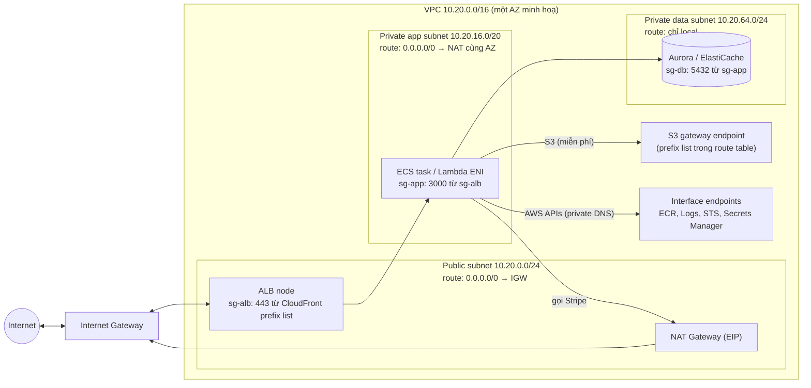

## Bối cảnh & vấn đề

Ba tin nhắn Slack trong cùng một tháng của một team mới lên AWS. Thứ nhất: "Lambda gắn VPC gọi Stripe timeout, bỏ VPC thì chạy, em đã đặt nó ở public subnet rồi mà". Thứ hai: "Hoá đơn tháng này NAT Gateway 2.400 USD, nhiều hơn cả RDS". Thứ ba: "em mở NACL inbound 443 rồi nhưng client vẫn không nhận được response".

Cả ba đến từ cùng một lỗ hổng kiến thức: không có mental model về **gói tin đi đâu** trong VPC. Một subnet "public" không phải vì nó có tên public; NAT Gateway tính tiền theo **từng GB** chứ không chỉ theo giờ; NACL là **stateless** nên chiều về cũng phải mở. Bài này dựng mental model đó: VPC, subnet, route table, Internet Gateway, NAT, Security Group, NACL, VPC endpoint, rồi áp vào thiết kế VPC 3 AZ cho một platform Node/Next.js và các quyết định chi phí (NAT, endpoint, public IPv4).

## Khái niệm

### VPC, subnet và Availability Zone

**VPC** (Virtual Private Cloud) là một mạng riêng ảo trong một region, có dải địa chỉ **CIDR** (ví dụ `10.20.0.0/16`, tức 65.536 địa chỉ). VPC trải trên mọi **AZ** (Availability Zone: một hoặc nhiều data center độc lập về điện/mạng trong region). **Subnet** là một lát CIDR của VPC và thuộc **đúng một AZ**; muốn chịu được mất một AZ thì mỗi tầng phải có subnet ở ít nhất hai AZ.

AWS giữ lại **5 địa chỉ mỗi subnet**: địa chỉ mạng (`.0`), router của VPC (`.1`), DNS (`.2`), dự phòng (`.3`) và địa chỉ cuối. Một `/24` vì thế chỉ có 251 IP dùng được. Chọn CIDR cũng là quyết định dài hạn: CIDR trùng với mạng công ty hoặc VPC khác sẽ chặn đường peering/Transit Gateway/VPN sau này.

**Interview angle:** nói "mỗi subnet thuộc đúng một AZ" và "chọn CIDR không trùng để còn peering" cho thấy bạn đã thiết kế, không chỉ dùng VPC mặc định.

### Route table, Internet Gateway và "public subnet"

Mỗi subnet gắn với một **route table**: danh sách "đích → next hop". Mọi route table có sẵn route `local` (mọi IP trong VPC đến được nhau). **Internet Gateway (IGW)** là cửa ra internet của VPC. Một subnet là **public** khi và chỉ khi route table của nó có `0.0.0.0/0 → igw-...`. Không có checkbox "public" nào cả.

Có route tới IGW vẫn chưa đủ: instance/ENI còn cần **public IPv4** (auto-assign hoặc Elastic IP) để IGW làm 1:1 NAT giữa private IP và public IP. Không có public IP thì gói tin ra không có địa chỉ trả về hợp lệ. Đây chính là chìa khoá của câu Lambda: **Lambda gắn VPC không bao giờ có public IP**, kể cả khi đặt trong public subnet, nên route tới IGW vô dụng và kết nối ra Stripe treo đến timeout.

**Private subnet** không có route tới IGW. Muốn đi ra internet, nó route `0.0.0.0/0 → nat-...` tới một **NAT Gateway** nằm trong public subnet.

**Interview angle:** red flag là "public subnet là subnet có dải IP public". Câu trả lời đúng bắt đầu bằng "route table".

### NAT Gateway

**NAT Gateway** cho tài nguyên trong private subnet **khởi tạo kết nối ra ngoài** (gọi Stripe, kéo package) mà internet không thể khởi tạo kết nối vào. Nó là managed, tự scale, nhưng **thuộc một AZ**: một NAT cho cả ba AZ vừa là single point of failure (AZ đó chết thì hai AZ kia mất internet), vừa phát sinh phí **cross-AZ data transfer**. Thiết kế HA là một NAT mỗi AZ, route table của mỗi private subnet trỏ NAT **cùng AZ**.

Chi phí có hai phần: **theo giờ mỗi NAT** và **theo GB dữ liệu xử lý** (khoảng 0,045 USD/giờ và 0,045 USD/GB ở us-east-1, verify theo region). Phần theo GB mới là thứ làm hoá đơn bùng nổ: kéo image ECR, upload/download S3, đẩy log ra ngoài, gọi DynamoDB... nếu đi qua NAT đều bị tính mỗi GB, dù đích là service AWS ngay trong region.

**Interview angle:** câu "NAT là dòng đắt nhất hoá đơn" muốn nghe quy trình: đo (Flow Logs, metric `BytesOutToDestination`, Cost Explorer theo usage type) rồi mới cắt (endpoint, NAT theo AZ).

### Security Group và Network ACL

**Security Group (SG)** là firewall gắn vào **ENI** (network interface: của EC2, ECS task awsvpc, Lambda trong VPC, RDS, ALB). SG **stateful**: cho chiều đi thì chiều về tự được phép. SG **chỉ có rule allow**, mọi rule được xét cùng lúc (khớp bất kỳ allow nào là qua), và nguồn có thể là **một SG khác** (`sg-db` allow 5432 từ `sg-app`), nên rule không phụ thuộc IP task đang thay đổi liên tục.

**Network ACL (NACL)** gắn vào **subnet**, **stateless**: chiều về là một gói tin độc lập phải được rule cho phép, thường là **ephemeral port** 1024–65535 (port phía client). NACL có cả **allow và deny**, rule đánh số và xét **theo thứ tự tăng dần, match đầu tiên thắng**. Đó là lý do câu "mở inbound 443 mà response vẫn fail": thiếu rule outbound cho ephemeral port (với server) hoặc inbound ephemeral (với client).

Day-to-day dùng SG; NACL để default allow-all và chỉ thêm deny thô (chặn một dải IP đang tấn công) hoặc để tách tầng theo yêu cầu compliance. Chặn IP cụ thể thì SG không làm được (không có deny); dùng NACL hoặc WAF.

**Interview angle:** "SG có deny được một IP không?" — không; dùng NACL hoặc WAF.

### VPC endpoint: gateway và interface

**VPC endpoint** cho tài nguyên trong VPC gọi service AWS mà không đi qua IGW/NAT. Có hai loại. **Gateway endpoint** chỉ cho **S3 và DynamoDB**: nó là một **target trong route table** (prefix list của service), **miễn phí**, nhưng chỉ dùng được từ trong chính VPC (không qua peering, Transit Gateway, VPN hay Direct Connect). **Interface endpoint** (PrivateLink) tạo **ENI có private IP** trong subnet của bạn cho hầu hết service AWS (ECR, CloudWatch Logs, STS, Secrets Manager, SQS...) và service của bên thứ ba; tính **theo giờ mỗi AZ + theo GB** (khoảng 0,01 USD/giờ/AZ và 0,01 USD/GB, verify), được bảo vệ bằng SG, và bật **private DNS** để SDK tự đi qua endpoint mà không đổi code.

Cả hai hỗ trợ **endpoint policy** (resource policy gắn trên endpoint), ví dụ chỉ cho đi tới bucket của tổ chức, chống exfiltration. Ngược lại, bucket policy có thể yêu cầu `aws:SourceVpce` để chỉ nhận request qua endpoint của bạn.

**Interview angle:** follow-up "6 interface endpoint × 3 AZ có đáng không" là bài toán chi phí: phí cố định của endpoint so với phí GB của NAT bạn tiết kiệm được.

### Public IPv4 không còn miễn phí

Từ **01/02/2024**, AWS tính phí **mọi public IPv4** (khoảng 0,005 USD/giờ, tức ~3,65 USD/tháng mỗi IP), dù đang gắn hay không; trước đó chỉ Elastic IP không gắn mới bị tính. Mọi thứ có public IP đều cộng tiền: task Fargate ở public subnet bật public IP, mỗi node của ALB, NAT Gateway, EC2 bastion. **Public IP Insights** trong VPC IPAM giúp đếm. Hướng xử lý: workload ở private subnet, tắt auto-assign public IP, dùng endpoint, và cân nhắc **IPv6/dual-stack** với **egress-only Internet Gateway** (IPv6 đi ra được mà không nhận kết nối vào).

**Interview angle:** "đặt Fargate ở public subnet để khỏi trả NAT" từng là mẹo tiết kiệm; giờ phải tính lại cả phí IPv4 lẫn rủi ro bảo mật (task có thể bị truy cập trực tiếp nếu SG sai).

## Cơ chế hoạt động

Sơ đồ dưới là VPC 3 tầng ở một AZ (lặp lại cho AZ b, c), với các đường đi của gói tin:



Giải thích theo luồng. **Vào**: request từ internet tới ALB qua IGW; ALB nằm ở public subnet và có public IP. ALB chuyển request tới task theo private IP; SG `sg-app` chỉ nhận port 3000 từ `sg-alb`, nên dù ai biết IP task cũng không gọi thẳng được. **Ra internet**: task gọi Stripe, gói tin theo route `0.0.0.0/0 → NAT` của app subnet; NAT dịch sang Elastic IP của nó và đi qua IGW; response quay về NAT rồi về task (NAT ghi nhớ kết nối). **Ra service AWS**: lưu lượng S3 khớp prefix list của gateway endpoint (route cụ thể hơn `0.0.0.0/0`), đi thẳng tới S3 không qua NAT; lời gọi ECR/Logs/STS được private DNS phân giải về IP của interface endpoint trong VPC. **Data tier**: route table chỉ có `local`, không ra được internet, chỉ nhận 5432 từ `sg-app`.

Cùng sơ đồ trả lời được câu debug "task trong private subnet không ra internet" theo thứ tự: route table của subnet có `0.0.0.0/0 → nat`? NAT ở public subnet có route tới IGW? NAT ở trạng thái available và có EIP? SG outbound của task cho phép? NACL hai chiều (gồm ephemeral)? DNS của VPC (`enableDnsSupport`, `enableDnsHostnames`) bật? Và với Lambda: function có thật sự ở private subnet không.

## Ví dụ thực tế

### Lập kế hoạch CIDR cho VPC 3 AZ

Script chia `10.20.0.0/16` thành 3 tầng × 3 AZ (chạy thật, Node 24):

```ts
const plan: [string, number][] = [];
for (const tier of [["public", 24], ["app", 20], ["data", 24]] as const)
  for (const az of ["a", "b", "c"]) plan.push([`${tier[0]}-${az}`, tier[1]]);
for (const [name, prefix] of plan) {
  const size = 2 ** (32 - prefix); cursor = align(cursor, size);
  console.log(name.padEnd(11), `${str(cursor)}/${prefix}`.padEnd(17), String(size - 5).padStart(6));
  cursor += size;
}
```

```text
subnet      cidr              usable  (AWS reserves .0 .1 .2 .3 and broadcast)
public-a    10.20.0.0/24         251
public-b    10.20.1.0/24         251
public-c    10.20.2.0/24         251
app-a       10.20.16.0/20       4091
app-b       10.20.32.0/20       4091
app-c       10.20.48.0/20       4091
data-a      10.20.64.0/24        251
data-b      10.20.65.0/24        251
data-c      10.20.66.0/24        251
used up to 10.20.66.255 of 10.20.255.255 -> 26.2% of the /16
```

App subnet để `/20` vì trong mode `awsvpc` **mỗi task Fargate chiếm một ENI, tức một IP**; cộng thêm Hyperplane ENI của Lambda, interface endpoint, và IP tạm khi rolling deploy (task cũ và mới cùng sống). Một `/24` (251 IP) với 150 task chạy và deploy 100% max-healthy là đủ để scale-out thất bại với lỗi hết IP. Chừa 74% không gian còn lại cho tầng mới, EKS (mỗi pod một IP với VPC CNI) hoặc mở rộng.

### Terraform cho một AZ (minh hoạ)

```hcl
resource "aws_subnet" "app_a" {
  vpc_id                  = aws_vpc.main.id
  cidr_block              = "10.20.16.0/20"
  availability_zone       = "ap-southeast-1a"
  map_public_ip_on_launch = false
}
resource "aws_nat_gateway" "a" {
  allocation_id = aws_eip.nat_a.id
  subnet_id     = aws_subnet.public_a.id          # NAT lives in the PUBLIC subnet
}
resource "aws_route_table" "app_a" {
  vpc_id = aws_vpc.main.id
  route {
    cidr_block     = "0.0.0.0/0"
    nat_gateway_id = aws_nat_gateway.a.id         # same-AZ NAT
  }
}
resource "aws_vpc_endpoint" "s3" {
  vpc_id            = aws_vpc.main.id
  service_name      = "com.amazonaws.ap-southeast-1.s3"
  vpc_endpoint_type = "Gateway"
  route_table_ids   = [aws_route_table.app_a.id, aws_route_table.app_b.id, aws_route_table.app_c.id]
}
resource "aws_security_group_rule" "db_from_app" {
  type                     = "ingress"
  from_port                = 5432
  to_port                  = 5432
  protocol                 = "tcp"
  security_group_id        = aws_security_group.db.id
  source_security_group_id = aws_security_group.app.id   # SG-to-SG, not CIDR
}
```

### Lambda gọi Stripe timeout: chẩn đoán từ cấu hình

```text
Lambda: VpcConfig subnets = [subnet-pub-a, subnet-pub-b]   # route 0.0.0.0/0 -> igw-123
        SecurityGroup sg-lambda: outbound all
No NAT Gateway in the VPC.
```

Lập luận: SG outbound mở, route tới IGW có, nhưng ENI Hyperplane của Lambda chỉ có private IP; IGW không NAT cho địa chỉ không có public IP, gói tin không bao giờ có đường về, lời gọi treo tới timeout của function. Sửa: đưa function vào **private subnet** có route tới **NAT Gateway mỗi AZ**; hoặc **không gắn VPC** nếu function không cần chạm tài nguyên private (Lambda không gắn VPC có internet sẵn). Nếu function chỉ gọi S3/DynamoDB/Secrets Manager thì endpoint thay cho NAT. Đối tác cần whitelist IP cố định thì IP đó là **Elastic IP của NAT Gateway** (mỗi AZ một IP, đưa cả ba cho đối tác).

### NAT đắt: tính trước khi cắt

Phép tính chạy thật với giá list us-east-1 (verify trước khi trích dẫn):

```ts
const natFixed = 3 * 0.045 * 730, natData = 5 * 1024 * 0.045;   // 3 NAT, 5 TB/month processed
const ifep = 6 * 3 * 0.01 * 730;                                 // 6 interface endpoints in 3 AZs
```

```text
## aws-018: NAT vs endpoints, 3 AZ, 5 TB/month to S3+ECR
3 NAT GW hours $99 + processing 5 TB $230 = $329
with S3 gateway endpoint (free) for 80% of bytes -> NAT processing $46
6 interface endpoints x 3 AZ = $131/month fixed (+$0.01/GB)
## aws-053: public IPv4
one public IPv4 = $3.65/month; 40 Fargate tasks with public IP = $146/month
```

Bài học: **gateway endpoint cho S3 luôn đáng** (miễn phí, cắt phần lớn GB). Lưu ý layer image ECR thật ra được tải từ S3, nên S3 gateway endpoint cắt cả phần đó, nhưng bạn vẫn cần interface endpoint `ecr.api` + `ecr.dkr` nếu muốn bỏ hẳn NAT cho việc pull image. Interface endpoint có phí cố định ~7,3 USD/AZ/tháng mỗi cái; 6 cái × 3 AZ = 131 USD/tháng, chỉ đáng khi GB đi qua NAT tới các service đó đủ lớn, hoặc khi yêu cầu bảo mật là "không đi qua internet". Điều tra trước bằng Flow Logs:

```sql
-- Athena over VPC Flow Logs: top destinations by bytes leaving through the NAT ENI (minh hoạ)
SELECT dstaddr, sum(bytes)/1e9 AS gb
FROM vpc_flow_logs
WHERE interface_id = 'eni-0natgatewayxxxx' AND action = 'ACCEPT'
GROUP BY dstaddr ORDER BY gb DESC LIMIT 20;
```

## Trade-offs & lựa chọn thay thế

| Lựa chọn | Ưu | Nhược | Khi nào |
|---|---|---|---|
| NAT Gateway mỗi AZ | HA, không cross-AZ | Phí giờ × 3 + phí GB | Prod |
| Một NAT Gateway | Rẻ hơn | Mất AZ đó = mất egress; cross-AZ phí | Dev/staging |
| NAT instance (EC2) | Rẻ ở tải thấp | Tự vận hành, tự HA, băng thông theo instance | Lab, ngân sách cực thấp |
| Workload ở public subnet + public IP | Không trả NAT | Phí IPv4, bề mặt tấn công lớn | Hầu như không còn đáng |
| S3/DynamoDB gateway endpoint | Miễn phí, private | Chỉ trong VPC đó | Luôn bật |
| Interface endpoint | Private, có SG, cho mọi service | Phí giờ/AZ + GB | GB lớn tới service đó, hoặc compliance |
| IPv6 + egress-only IGW | Không phí IPv4, không NAT cho IPv6 | Đích phải hỗ trợ IPv6; vận hành dual-stack | Platform mới, nhiều egress |
| Security Group | Stateful, SG-to-SG | Không có deny | Mặc định |
| NACL | Deny, theo subnet | Stateless, dễ quên ephemeral | Chặn thô, compliance |

Chọn: prod dùng NAT mỗi AZ + gateway endpoint luôn bật + interface endpoint cho những service có GB lớn (thường ECR, Logs) hoặc theo yêu cầu bảo mật. Dev có thể dùng một NAT. Tách tầng bằng SG-to-SG; NACL giữ mặc định trừ khi có lý do cụ thể.

## Edge cases & failure modes

- **Hết IP trong subnet**: Fargate/EKS scale-out lỗi `ResourceInitializationError`/"insufficient free addresses"; rolling deploy tạm cần gấp đôi IP. Sửa: subnet lớn hơn, thêm secondary CIDR cho VPC, hoặc prefix delegation (EKS).
- **NAT Gateway bị giới hạn kết nối đồng thời tới cùng một đích** (khoảng 55.000 kết nối mỗi IP đích, verify): hàng nghìn task gọi cùng một API ngoài có thể gặp `ErrorPortAllocation`; thêm EIP cho NAT hoặc dùng connection pooling/keep-alive.
- **AZ của NAT chết** khi chỉ có một NAT: mọi private subnet mất egress dù compute vẫn sống.
- **Gateway endpoint không dùng được qua peering/VPN**: on-prem gọi S3 qua VPN phải dùng S3 interface endpoint.
- **Private DNS của interface endpoint** chỉ hoạt động khi VPC bật `enableDnsSupport` và `enableDnsHostnames`; tắt là SDK vẫn đi qua NAT mà không ai biết.
- **NACL quên ephemeral port**: kết nối thiết lập được một chiều, timeout khó hiểu; đặc biệt khi NACL chặn outbound 1024–65535.
- **SG reference qua peering**: tham chiếu SG xuyên VPC chỉ được trong một số trường hợp (peering cùng region, verify); qua Transit Gateway thường phải dùng CIDR.
- **Overlapping CIDR**: hai VPC cùng `10.0.0.0/16` không peering được; phải NAT hoặc PrivateLink.

## Pitfalls

- ❌ Đặt Lambda/ECS task vào public subnet để "có internet" → ✅ private subnet + NAT; Lambda không bao giờ có public IP.
- ❌ RDS ở public subnet với `0.0.0.0/0:5432` để debug → ✅ data subnet không route ra internet, SG chỉ từ `sg-app`; debug qua SSM Session Manager port forwarding.
- ❌ Một NAT Gateway cho 3 AZ ở prod → ✅ một NAT mỗi AZ, route cùng AZ.
- ❌ Kéo image ECR và upload S3 qua NAT → ✅ S3 gateway endpoint (miễn phí) + ECR interface endpoint nếu GB lớn.
- ❌ SG rule theo CIDR của subnet app → ✅ SG-to-SG reference; IP task thay đổi liên tục.
- ❌ Mở NACL inbound 443 rồi nghĩ là xong → ✅ NACL stateless: mở outbound ephemeral 1024–65535.
- ❌ Subnet `/24` cho tầng app chạy Fargate → ✅ `/20` hoặc lớn hơn; tính cả IP tạm lúc deploy.
- ❌ Bỏ qua phí public IPv4 → ✅ tắt auto-assign public IP, đếm bằng Public IP Insights.

## Tóm tắt

- Subnet thuộc một AZ; public khi route table có `0.0.0.0/0 → IGW`, và ENI còn cần public IP.
- Private subnet đi ra qua NAT Gateway ở public subnet; NAT thuộc một AZ, tính theo giờ và theo GB.
- Lambda trong VPC không có public IP: cần private subnet + NAT, hoặc đừng gắn VPC.
- SG: stateful, chỉ allow, gắn ENI, tham chiếu SG khác. NACL: stateless, allow + deny, theo thứ tự, gắn subnet, nhớ ephemeral port.
- Gateway endpoint (S3, DynamoDB) miễn phí qua route table; interface endpoint là ENI tính phí giờ/AZ + GB, có SG và private DNS.
- VPC 3 AZ: public (ALB, NAT), app (task, `/20`), data (DB, chỉ local); SG theo tầng.
- Từ 02/2024 mọi public IPv4 tốn phí; đặt workload ở private subnet, cân nhắc IPv6.
