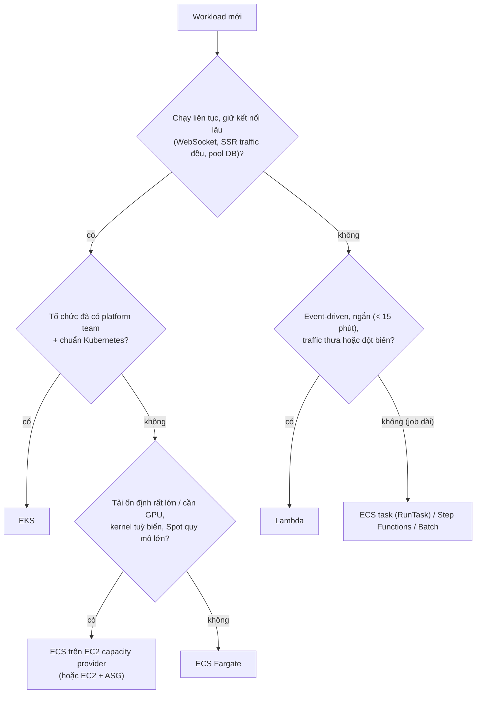
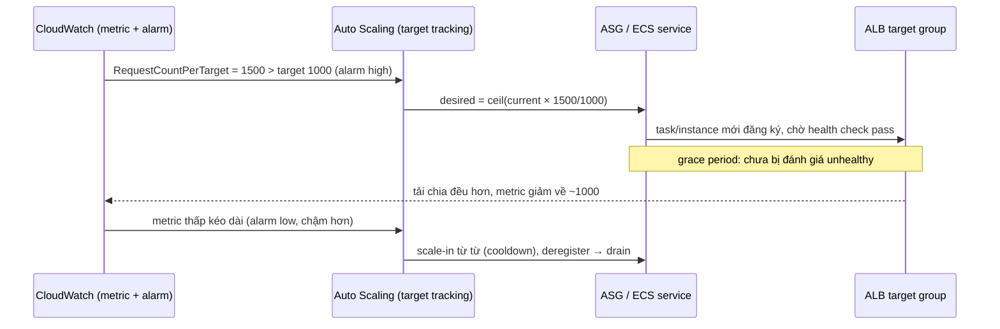

## Bối cảnh & vấn đề

Một startup 6 kỹ sư có storefront Next.js, API Node/Express, vài job nền (gửi email, sinh thumbnail, đồng bộ đơn hàng). CTO đọc blog và muốn "lên Kubernetes cho chuyên nghiệp". Một kỹ sư khác muốn "serverless hết, khỏi quản server". Ba tháng sau, team EKS dành nửa thời gian để nâng cấp cluster, sửa CNI và cert-manager; còn team serverless-hết thì vật lộn với cold start trên trang sản phẩm, connection storm tới Postgres và hoá đơn API Gateway vượt xa dự tính khi traffic ổn định lên 200 RPS.

Không có lựa chọn compute nào "đúng" một cách tuyệt đối. Mỗi lựa chọn là một hợp đồng: **bạn giao cho AWS phần nào của việc vận hành**, đổi lại **bạn chấp nhận giới hạn nào** (thời gian chạy, mô hình kết nối, độ trễ khởi động, mức tuỳ biến) và **trả tiền theo đơn vị nào** (giờ máy, vCPU-giây, request). Bài này dạy cách nói về các hợp đồng đó, từ shared responsibility tới autoscaling, và có một phép tính chi phí thật để trả lời câu "khi nào không nên serverless-first".

## Khái niệm

### Shared responsibility model

AWS chịu trách nhiệm **"security OF the cloud"**: data center, phần cứng, mạng vật lý, hypervisor, và phần managed của từng service. Bạn chịu **"security IN the cloud"**: IAM, cấu hình, dữ liệu, mã hoá, network rule, code. Ranh giới **dịch lên** khi service càng managed.

Với **EC2**, bạn patch OS, cấu hình SSH (hay tốt hơn là tắt SSH và dùng SSM Session Manager), cài agent, harden kernel, quản AMI. Với **Fargate**, AWS lo host và OS chạy container; bạn vẫn lo **image** (CVE trong base image `node:22`, dependency npm), task role, SG, secret. Với **Lambda** managed runtime, AWS còn patch cả runtime Node (minor/security); bạn lo code, dependency, quyền, cấu hình; nhưng chuyển major runtime (Node 20 → 22) khi runtime cũ deprecated vẫn là việc của bạn. Ở **mọi** mô hình, IAM, dữ liệu và cấu hình public access luôn là của bạn: bucket public bị lộ dữ liệu là lỗi của khách hàng, không phải của AWS.

**Interview angle:** follow-up "ai chịu trách nhiệm khi bucket public lộ dữ liệu" có đáp án ngắn: bạn; AWS cung cấp Block Public Access, bạn phải bật.

### EC2 và Auto Scaling Group

**EC2** là máy ảo: bạn chọn instance type (họ `m`/`c`/`r`/`t`, Graviton `g`), AMI, ổ EBS, và trả theo giây (Linux) khi chạy. **Auto Scaling Group (ASG)** giữ số instance trong khoảng `[min, max]` với `desired` hiện tại, phân bổ đều qua các AZ, tạo instance từ **launch template**, và **thay instance unhealthy**.

Health check mặc định của ASG là **EC2 status check** (máy còn sống ở mức hypervisor/OS). Một process Node bị crash hoặc treo trong khi OS vẫn chạy sẽ không bị phát hiện. Bật **ELB health check** để ASG dùng kết quả health check của target group: instance "sống nhưng app chết" bị đánh dấu unhealthy và thay thế. **Health check grace period** cho instance mới thời gian boot (cài agent, warm cache) trước khi bị đánh giá, tránh vòng lặp "vừa lên đã bị kill". Rollout AMI mới dùng **instance refresh** (thay dần theo tỉ lệ healthy tối thiểu).

**Interview angle:** câu "ASG thay instance khi nào" có bẫy: không bật ELB health check thì app chết vẫn được giữ lại.

### Scaling policy: target tracking, step, scheduled, predictive

**Target tracking** giữ một metric quanh mục tiêu, như bộ điều nhiệt: "CPU trung bình 50%" hay `ALBRequestCountPerTarget = 1000`. Auto Scaling tự tạo CloudWatch alarm và tính số instance cần thêm/bớt; scale-out nhanh, scale-in thận trọng. **Step scaling** gắn hành động với các ngưỡng alarm (CPU > 70% thêm 2, > 85% thêm 4). **Scheduled scaling** cho đỉnh biết trước (flash sale 20:00). **Predictive scaling** học chu kỳ từ lịch sử và scale trước. ECS service dùng **Application Auto Scaling** trên `desiredCount` với cùng các loại policy.

Chọn metric là phần khó. Node API phần lớn thời gian **chờ I/O** (DB, API ngoài): CPU có thể chỉ 20% trong khi event loop lag cao và latency p99 tăng vọt vì DB chậm. Scale theo CPU khi đó không thêm task; còn nếu nút cổ chai là DB thì thêm task chỉ làm DB tệ hơn. Metric tốt hơn cho API là **request count per target** hoặc một custom metric phản ánh tải (concurrent request, event loop lag), kèm giới hạn `max` để không nhấn chìm downstream.

**Interview angle:** "vì sao CPU là metric sai cho Node API I/O-bound" — đây là câu phân biệt người đã vận hành autoscaling thật.

### ECS và Fargate

**ECS** (Elastic Container Service) là orchestrator của AWS: **task definition** mô tả container (image, CPU/memory, port, role, log, secret), **service** giữ N task chạy, thay task chết, đăng ký vào target group của ALB, rolling deploy (hoặc blue/green qua CodeDeploy/ECS native). **Fargate** là capacity serverless cho ECS (và EKS): bạn khai báo CPU/memory của task, AWS lo máy. Trả theo **vCPU-giờ + GB-giờ** khi task chạy.

ECS ít khái niệm hơn Kubernetes nhiều: không có control plane để nâng cấp, không có CNI để chọn, IAM gắn trực tiếp vào task. Khi Fargate đắt so với tải ổn định lớn, dùng **ECS trên EC2 capacity provider** (ASG do ECS quản) với Savings Plans/Spot, đổi lại phải quản AMI và bin-packing.

**Interview angle:** follow-up "khi nào chuyển từ Fargate sang EC2 capacity provider" muốn nghe: tải ổn định lớn, cần GPU/instance đặc biệt, hoặc muốn Spot/RI ở quy mô mà phần chênh lệch đáng công vận hành.

### Lambda

**Lambda** chạy function theo **event** (HTTP qua API Gateway/function URL, SQS, S3, EventBridge, schedule). Mỗi **execution environment** xử lý **một request tại một thời điểm**; nhiều request đồng thời thì nhiều environment. Trả theo **số request + GB-giây** (memory × thời gian chạy), scale về 0. Đổi lại: timeout tối đa 15 phút, payload đồng bộ 6 MB, cold start, mô hình kết nối DB khó (mỗi environment một kết nối), WebSocket phải đi qua API Gateway. Chi tiết ở [bài 5](/tracks/aws/learn/lambda-deep-dive).

**Interview angle:** nói được "một environment = một request đồng thời" là nền cho mọi câu về concurrency và connection storm.

### EKS

**EKS** là Kubernetes managed control plane (trả phí cluster theo giờ), node là EC2 (managed node group, Karpenter) hoặc Fargate. Ưu: chuẩn Kubernetes, portable, ecosystem (Argo CD, operator, service mesh), hợp tổ chức nhiều team đã có platform team. Nhược: bạn vẫn vận hành nhiều thứ: nâng version cluster đều đặn (mỗi minor có thời hạn hỗ trợ chuẩn, sau đó tính phí extended support, verify), add-on (VPC CNI, CoreDNS, kube-proxy), ingress controller, autoscaler, RBAC ánh xạ IAM.

**Interview angle:** red flag là "Kubernetes luôn là lựa chọn chuyên nghiệp"; câu trả lời senior nói về **chi phí vận hành** và **năng lực team**.

## Cơ chế hoạt động

Cây quyết định thực dụng cho một workload mới:



Cây này không phải luật; nó thể hiện các câu hỏi đúng theo thứ tự quan trọng: (1) **mô hình chạy**: process sống lâu giữ state kết nối hay function ngắn theo sự kiện; (2) **năng lực tổ chức**: ai vận hành, đã có chuẩn chưa; (3) **kinh tế**: tải ổn định lớn thì đơn giá theo giờ máy thắng đơn giá theo request. Thực tế phổ biến cho team nhỏ-vừa là **lai**: ECS Fargate cho web/API, Lambda cho glue event-driven (S3 trigger, SQS worker, cron).

Autoscaling theo target tracking hoạt động như một vòng điều khiển:



Scale-out được thiết kế nhanh và scale-in chậm vì cái giá của thiếu capacity (lỗi, latency) lớn hơn cái giá của thừa vài phút. Target mới chỉ nhận traffic sau khi health check pass, nên thời gian boot và grace period quyết định tốc độ phản ứng thật.

## Ví dụ thực tế

### Break-even Lambda vs Fargate: API 200 RPS, 100 ms

Script chạy thật với giá list us-east-1 (Lambda x86 0,0000166667 USD/GB-s + 0,20 USD/1M request; Fargate 0,04048 USD/vCPU-h + 0,004445 USD/GB-h; ALB 0,0225 USD/h + 0,008 USD/LCU-h; HTTP API 1 USD/1M; verify trước khi trích dẫn):

```ts
const req = 200 * S, gbs = req * 0.1 * 0.5;                  // 200 RPS, 100 ms, 512 MB
const lambda = gbs * P.lambdaGbS_x86 + req * P.lambdaReq, apigw = req * P.httpApiReq;
const task = (vcpu: number, gb: number) => (vcpu * P.fargateVcpuH + gb * P.fargateGbH) * H;
const fargate = 4 * task(1, 2), alb = P.albH * H + 10 * P.lcuH * H;
```

```text
## aws-060: API at 200 RPS, 100 ms avg, 512 MB
requests/month = 526M, concurrency ~ 20
Lambda compute+requests = $543  (+ HTTP API ~$526) = $1069
Fargate 4 x (1 vCPU, 2 GB) = $144  + ALB (~10 LCU) $75 = $219
    1 RPS: Lambda+HTTP API $   5 vs Fargate 2 tasks (0.5 vCPU,1 GB)+ALB $64
    5 RPS: Lambda+HTTP API $  27 vs Fargate 2 tasks (0.5 vCPU,1 GB)+ALB $64
   20 RPS: Lambda+HTTP API $ 107 vs Fargate 2 tasks (0.5 vCPU,1 GB)+ALB $64
   50 RPS: Lambda+HTTP API $ 267 vs Fargate 2 tasks (0.5 vCPU,1 GB)+ALB $64
```

Đọc kết quả: concurrency chỉ ~20 (200 × 0,1 s), một process Node xử lý được hàng trăm request đồng thời chờ I/O, nên 4 task Fargate (2 mỗi AZ cho HA) là dư. Với 200 RPS ổn định, Lambda + HTTP API đắt gấp ~5 lần (HTTP API có bậc giá giảm sau 300M request, nên con số thật hơi thấp hơn ~1.050 USD). Điểm hoà vốn với cấu hình tối thiểu nằm khoảng **10–15 RPS trung bình**: dưới đó Lambda rẻ hơn (scale về 0), trên đó container chạy liên tục rẻ hơn. Phép tính bỏ qua: Compute Savings Plans (giảm cả hai), Graviton, CloudFront cache (giảm request chạm origin), và **chi phí con người** (vận hành container vs vận hành nhiều function), thứ thường lớn hơn chênh lệch hoá đơn ở quy mô nhỏ.

### ECS service với target tracking theo request (CDK, minh hoạ)

```ts
const service = new ecs.FargateService(this, "Api", {
  cluster, taskDefinition: taskDef, desiredCount: 2,
  minHealthyPercent: 100, maxHealthyPercent: 200,
  circuitBreaker: { rollback: true },                      // auto-rollback a failing deploy
  healthCheckGracePeriod: Duration.seconds(60),
});
const tg = listener.addTargets("Api", { port: 3000, targets: [service],
  healthCheck: { path: "/healthz", healthyHttpCodes: "200", interval: Duration.seconds(10) },
  deregistrationDelay: Duration.seconds(30) });
const scaling = service.autoScaleTaskCount({ minCapacity: 2, maxCapacity: 20 });
scaling.scaleOnRequestCount("Rps", { requestsPerTarget: 1000, targetGroup: tg });
scaling.scaleOnSchedule("FlashSale", { schedule: appscaling.Schedule.cron({ hour: "12", minute: "45" }), minCapacity: 10 });
```

`maxCapacity: 20` là trần có chủ đích để bảo vệ DB; `minCapacity: 2` giữ một task mỗi AZ. Flash sale 20:00 giờ Việt Nam là 13:00 UTC, nên lịch scale-up đặt 12:45 UTC.

### ASG với ELB health check (Terraform, minh hoạ)

```hcl
resource "aws_autoscaling_group" "api" {
  min_size                  = 2
  max_size                  = 12
  vpc_zone_identifier       = [aws_subnet.app_a.id, aws_subnet.app_b.id, aws_subnet.app_c.id]
  target_group_arns         = [aws_lb_target_group.api.arn]
  health_check_type         = "ELB"     # replace instances whose app fails the ALB check
  health_check_grace_period = 120
  launch_template {
    id      = aws_launch_template.api.id
    version = "$Latest"
  }
}
resource "aws_autoscaling_policy" "rps" {
  autoscaling_group_name = aws_autoscaling_group.api.name
  policy_type            = "TargetTrackingScaling"
  target_tracking_configuration {
    predefined_metric_specification {
      predefined_metric_type = "ALBRequestCountPerTarget"
      resource_label         = "${aws_lb.main.arn_suffix}/${aws_lb_target_group.api.arn_suffix}"
    }
    target_value = 1000
  }
}
```

## Trade-offs & lựa chọn thay thế

| | EC2 + ASG | ECS Fargate | ECS on EC2 | Lambda | EKS |
|---|---|---|---|---|---|
| Bạn vận hành | OS, AMI, agent, app | Image, app | AMI, ASG, app | Code | Cluster version, add-on, node, app |
| Đơn vị trả tiền | Giờ instance | vCPU/GB-giờ task | Giờ instance | Request + GB-giây | Cluster/giờ + node |
| Scale về 0 | Không | Không (service) | Không | Có | Không |
| Khởi động | Phút | ~30–60 s | Giây (nếu còn chỗ) | ms (warm) / trăm ms–giây (cold) | Giây–phút |
| Giới hạn chạy | Không | Không | Không | 15 phút, 6 MB sync | Không |
| Kết nối dài, WebSocket | Tốt | Tốt | Tốt | Qua API Gateway WS | Tốt |
| Hợp với | Kiểm soát OS, workload đặc thù | Web/API, team nhỏ-vừa | Tải lớn ổn định, Spot | Event-driven, traffic thưa | Nhiều team, chuẩn K8s |

Khi nào **không** nên serverless-first: tải cao ổn định (đơn giá request đắt hơn container chạy liên tục như phép tính trên); p99 nhạy cold start (storefront SSR); job dài hơn 15 phút; real-time nhiều kết nối (Socket.IO); workload nặng DB connection; team chưa có observability phân tán (debug chuỗi function + queue khó hơn một service). Ngược lại serverless rất hợp: traffic thưa/đột biến, glue event-driven, cron, prototype, team nhỏ muốn ít vận hành. Câu trả lời senior là **không tôn giáo**: chọn theo workload và tính **tổng chi phí** (tiền + công vận hành + thời gian ra thị trường).

## Edge cases & failure modes

- **Scale-out quá nhanh đè chết DB**: target tracking thêm task theo request, mỗi task mở pool 20 kết nối; 20 task × 20 = 400 kết nối > `max_connections`. Đặt `maxCapacity` theo khả năng downstream, dùng RDS Proxy.
- **Scale-in giết request đang chạy**: không có deregistration delay/graceful shutdown thì scale-in tạo 502 ([bài 6](/tracks/aws/learn/load-balancing-ecs-deploys)).
- **Health check grace period quá ngắn**: task mới bị kill trước khi app sẵn sàng → vòng lặp restart.
- **Health check sâu (gọi DB)**: DB chậm làm **mọi** target unhealthy cùng lúc; ALB khi tất cả target unhealthy sẽ "fail open" gửi tới tất cả (verify), nhưng ASG/ECS vẫn có thể thay hàng loạt.
- **Fargate thiếu capacity** ở một AZ/kiến trúc (hiếm, rõ hơn với Spot): service không đạt desired; phân bổ nhiều AZ, có capacity provider dự phòng.
- **Lambda account concurrency dùng chung**: một function chạy loạn ăn hết quota 1.000 (account mới còn thấp hơn), các function khác bị throttle ([bài 5](/tracks/aws/learn/lambda-deep-dive)).
- **EKS cluster quá hạn hỗ trợ**: chi phí extended support tăng và add-on không tương thích; nâng version là việc định kỳ phải có lịch.

## Pitfalls

- ❌ "Kubernetes cho chuyên nghiệp" với 3–5 service và team 6 người → ✅ ECS Fargate; EKS khi có platform team và nhu cầu thật.
- ❌ Serverless hết kể cả API tải ổn định 200 RPS → ✅ container cho đường nóng ổn định, Lambda cho event-driven; làm phép tính break-even.
- ❌ ASG chỉ dùng EC2 status check → ✅ `health_check_type = "ELB"` để thay instance có app chết.
- ❌ Scale Node API theo CPU → ✅ request count per target hoặc metric latency/concurrency; luôn có trần `max`.
- ❌ Nghĩ Fargate/Lambda là "AWS lo bảo mật" → ✅ image, dependency, IAM, cấu hình vẫn là của bạn.
- ❌ Không có grace period và circuit breaker → ✅ grace period ≥ thời gian khởi động, `circuitBreaker.rollback = true`.
- ❌ So sánh chi phí chỉ bằng hoá đơn → ✅ cộng công vận hành, thời gian on-call, tốc độ giao tính năng.

## Tóm tắt

- Shared responsibility: AWS lo "of the cloud"; bạn lo "in the cloud". Càng managed, ranh giới càng dịch lên, nhưng IAM, dữ liệu, cấu hình luôn là của bạn.
- EC2 + ASG: kiểm soát cao nhất, vận hành nhiều nhất; bật ELB health check và grace period.
- Target tracking giữ metric quanh mục tiêu; với Node I/O-bound, dùng request count per target thay vì CPU; luôn có trần.
- ECS Fargate là mặc định tốt cho web/API Node/Next.js của team nhỏ-vừa; EC2 capacity provider khi tải lớn ổn định.
- Lambda hợp event-driven và traffic thưa; ở 200 RPS ổn định nó đắt hơn container nhiều lần.
- EKS khi tổ chức có chuẩn Kubernetes và platform team; chi phí thật là vận hành.
- Hỗn hợp container + Lambda là bình thường; quyết định theo workload và tổng chi phí.
