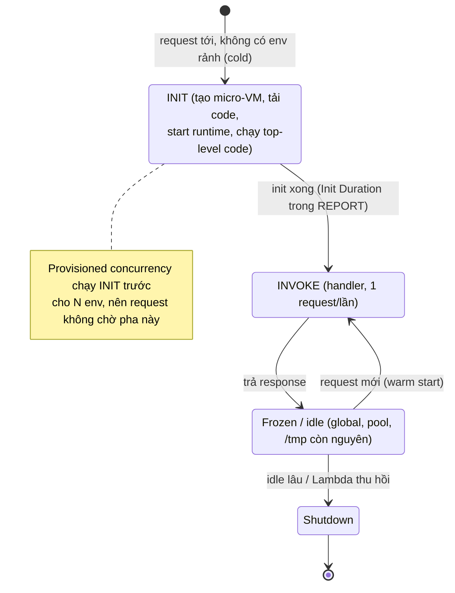
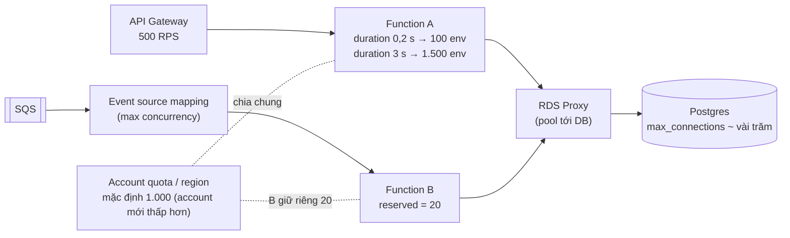

## Bối cảnh & vấn đề

Một API sản phẩm chạy trên Lambda sau API Gateway, test thì ổn. Ngày khai trương, traffic lên 500 RPS. Database Postgres bắt đầu trả `sorry, too many clients already`, latency p99 nhảy lên 3 giây theo từng đợt, và cuối tuần team phát hiện một function thumbnail đã tự gọi chính nó hàng triệu lần vì ghi output vào đúng bucket kích hoạt nó.

Cả ba sự cố đều không phải "bug Lambda". Chúng là hệ quả trực tiếp của **mô hình thực thi** Lambda: mỗi request đồng thời cần một **execution environment** riêng; environment mới phải **khởi tạo** (cold start); code ngoài handler sống qua nhiều invocation; và Lambda scale theo event mà không biết downstream chịu được bao nhiêu. Hiểu mô hình này thì trả lời được hầu hết câu Lambda trong phỏng vấn: cold start, concurrency, kết nối DB, giới hạn và chi phí. So sánh Lambda với các lựa chọn compute khác ở [bài 4](/tracks/aws/learn/compute-choices).

## Khái niệm

### Execution environment và vòng đời INIT / INVOKE / SHUTDOWN

**Execution environment** là một micro-VM (Firecracker) cô lập chứa runtime Node, code của bạn, layer, và `/tmp`. Vòng đời có ba pha. **INIT**: tải code, khởi động runtime, chạy **init code** (mọi thứ ở top-level module: `import`, `new S3Client()`, đọc config, mở pool DB). **INVOKE**: gọi handler cho một event; một environment chỉ xử lý **một invocation tại một thời điểm**. **SHUTDOWN**: environment bị thu hồi sau một thời gian idle (không công bố, thường vài phút tới vài chục phút, verify) hoặc khi Lambda cân bằng lại.

Sau INVOKE đầu tiên, environment được **tái sử dụng** cho các invocation sau (warm start): biến global vẫn còn, kết nối đã mở vẫn còn, file trong `/tmp` vẫn còn. Đây vừa là công cụ tối ưu (tạo client một lần), vừa là nguồn bug (state rò rỉ giữa request, pool tạo trong handler tích tụ kết nối).

**Interview angle:** câu "code đặt ngoài handler chạy khi nào" có đáp án: một lần mỗi environment, trong INIT.

### Cold start

**Cold start** xảy ra khi request tới mà không có environment rảnh: lần đầu deploy, sau idle, hoặc khi **scale out** (traffic tăng, cần thêm environment). Thời gian gồm: tạo micro-VM, tải package, khởi động runtime, và **init code**. Với Node, phần bạn kiểm soát là init code: số module phải `require` (bundle càng lớn càng chậm), import nặng (SDK v2 toàn bộ, ORM lớn), gọi mạng lúc init (lấy secret, warm cache), và **memory** (CPU tỉ lệ thuận với memory; 1.769 MB tương đương một vCPU theo docs).

Lambda gắn VPC từng có cold start rất tệ vì tạo ENI mỗi environment; từ 2019 Lambda dùng **Hyperplane ENI** chia sẻ theo subnet + SG nên chi phí đó gần như mất đi (vẫn mất thời gian lúc tạo/sửa function). Từ **01/08/2025**, AWS **tính tiền cả INIT phase** cho function on-demand dùng managed runtime (trước đó INIT của managed runtime gần như miễn phí), nên cold start giờ cũng là chi phí, không chỉ là latency.

Đo cold start: log `REPORT` có `Init Duration` chỉ xuất hiện ở invocation cold; trace X-Ray/OTel tách được segment `Initialization`.

**Interview angle:** tách "cold start" khỏi "code chậm" bằng `Init Duration` trong log là điều interviewer muốn nghe trước mọi giải pháp.

### Concurrency, quota và tốc độ scale

**Concurrency** là số environment đang xử lý đồng thời, xấp xỉ theo định luật Little: `concurrency ≈ RPS × thời gian xử lý trung bình (giây)`. 500 RPS × 0,2 s = 100; nhưng nếu DB chậm làm duration lên 3 s thì cùng 500 RPS cần 1.500.

Account có quota concurrency **mỗi region** dùng chung cho mọi function: mặc định 1.000, xin tăng được tới hàng chục nghìn; docs hiện ghi rõ **account mới có quota thấp hơn** và được nâng tự động theo usage (verify trong Service Quotas). Mỗi function còn có giới hạn **tốc độ scale**: thêm tối đa 1.000 environment mỗi 10 giây. Vượt quota thì **throttle**: invocation đồng bộ nhận `429 TooManyRequestsException`, invocation bất đồng bộ và event source (SQS) được retry.

**Interview angle:** follow-up "DB chậm làm duration từ 200 ms lên 3 s thì sao" muốn nghe chuỗi: concurrency × 15 → throttle toàn account → chi phí GB-giây × 15 → DB nhận gấp 15 lần kết nối, càng chậm hơn (vòng xoáy).

### Reserved concurrency và provisioned concurrency

**Reserved concurrency** làm hai việc cùng lúc: **dành riêng** N concurrency cho một function (lấy từ pool account, function khác không chiếm được) và đặt **trần** N cho function đó. Dùng để bảo vệ downstream (worker ghi DB tối đa 20 đồng thời) và cô lập function quan trọng khỏi function chạy loạn. Đặt `0` là cách "tắt khẩn cấp" một function.

**Provisioned concurrency** giữ sẵn N environment **đã chạy xong INIT**, nên N request đồng thời đầu tiên không bao giờ cold start. Tính phí theo thời gian bật kể cả khi không dùng; gắn vào version/alias; scale theo lịch hoặc theo utilization bằng Application Auto Scaling. So với "ping giữ ấm" bằng schedule: ping chỉ giữ ấm **một** environment (một ping = một invocation), không giúp khi traffic cần 50 environment, và không đảm bảo gì.

**Interview angle:** "provisioned concurrency vs scheduled ping" — provisioned đảm bảo N environment init sẵn; ping chỉ giữ một, là mẹo cũ.

### Kết nối database từ Lambda

Mỗi environment là một process riêng, nên nó có pool riêng. Pool `max: 10` × 300 environment = 3.000 kết nối tiềm năng, trong khi Postgres `db.r6g.large` thường cấu hình vài trăm. Tệ hơn, tạo `new Pool()` **trong handler** thì mỗi invocation mở pool mới và không đóng; environment warm tích tụ kết nối cho tới khi bị thu hồi.

Cách đúng: tạo client **ngoài handler**, `max: 1` (environment chỉ xử lý một request mỗi lúc nên không cần hơn), và đặt **RDS Proxy** giữa Lambda và DB. RDS Proxy giữ một pool kết nối tới DB và **multiplex** nhiều kết nối client lên đó (theo transaction), hỗ trợ IAM auth, và giữ kết nối client khi DB failover. Lưu ý **connection pinning**: client làm gì đó gắn state vào phiên (`SET` biến session, prepared statement kiểu cũ, temp table, advisory lock...) thì Proxy phải "ghim" kết nối DB cho client đó, mất lợi ích multiplex. Thêm **reserved concurrency** như trần cứng.

**Interview angle:** red flag là chỉ "tăng `max_connections`"; đáp án tốt có ba lớp: client ngoài handler + RDS Proxy + reserved concurrency.

### Các limit cắn app Node/Next.js

Số liệu theo trang Quotas hiện tại (verify): **timeout tối đa 15 phút**; **memory 128 MB tới 10.240 MB**; `/tmp` từ 512 MB tới 10.240 MB; **payload đồng bộ 6 MB** mỗi chiều request/response, **response streaming** tới 200 MB, invocation **bất đồng bộ 1 MB**; package zip **50 MB** khi upload trực tiếp và **250 MB giải nén** (gồm layer), **container image tới 10 GB**; biến môi trường tổng 4 KB; 5 layer.

Hệ quả thiết kế: upload/download file lớn đi qua **S3 presigned URL**, không qua function; response lớn dùng streaming; job dài chuyển sang **Step Functions** (chia bước) hoặc **ECS RunTask**; đặt sau API Gateway REST thì còn giới hạn ~29 s integration timeout và 10 MB payload của API Gateway. WebSocket không giữ được trong function; dùng API Gateway WebSocket API.

**Interview angle:** câu "chạy Socket.IO trên Lambda được không" — không hợp: không giữ được kết nối lâu, mỗi message một invocation qua API Gateway WebSocket, cần store ngoài cho connection ID.

### Recursive loop

Function xử lý `s3:ObjectCreated` ở `uploads/` rồi ghi thumbnail vào **cùng bucket, cùng prefix** sẽ sinh event mới, gọi lại chính nó, mãi mãi, scale theo concurrency. Lambda có **recursive loop detection** cho một số nguồn (SQS, SNS, và S3 theo docs mới, verify) và dừng sau khoảng 16 lần lặp trong một chuỗi, nhưng đừng phụ thuộc vào nó: chuỗi không mang trace header hoặc đi qua nguồn không được hỗ trợ (DynamoDB Stream → Lambda → ghi lại cùng bảng, EventBridge rule bắt chính event mình phát) vẫn lặp.

**Interview angle:** follow-up "setup event-driven nào khác cũng lặp" — DynamoDB Streams ghi lại bảng, SNS → Lambda → publish cùng topic, EventBridge rule match event do chính target phát.

## Cơ chế hoạt động

Vòng đời một execution environment và chỗ cold start rơi vào:



Mỗi environment đi qua INIT đúng một lần. Request tới khi mọi environment hiện có đang bận thì Lambda tạo environment mới, tức một cold start nữa; đó là lý do cold start xuất hiện **mỗi lần scale out**, không chỉ sau idle. Giữa các invocation, environment bị "đóng băng": timer và socket không chạy, nên kết nối TCP có thể bị phía DB/NAT đóng trong lúc đông lạnh; client phải chịu được kết nối chết khi tỉnh lại (validate, retry một lần).

Concurrency và quota trong hệ thống đầy đủ:



Function A không có reserved concurrency nên chiếm từ phần chung; khi duration tăng, nó có thể ăn hết quota, làm cả các function khác bị throttle. Function B có reserved 20 nên luôn có 20 slot và không bao giờ vượt 20, tức không bao giờ gửi quá 20 kết nối đồng thời tới DB. RDS Proxy là lớp đệm cuối cùng giữa số environment dao động và số kết nối cố định của DB.

## Ví dụ thực tế

### Connection storm: pool trong handler vs ngoài handler

Mô phỏng chạy thật trên Postgres 17 (Docker) với `pg` 8.23.1, Node 24.21: 20 "environment" (mỗi cái một module scope, xử lý tuần tự như Lambda), 5 đợt invocation:

```ts
function envBad() {      // the buggy handler from aws-022
  return async () => { const pool = new pg.Pool({ ...cfg, max: 10 }); await pool.query("select 1"); };
}
function envGood() {     // init phase: once per environment
  const pool = new pg.Pool({ ...cfg, max: 1, idleTimeoutMillis: 0 });
  return async () => { await pool.query("select 1"); };
}
```

```text
pool inside handler            wave 1 | invocations 20 | open connections =  20
pool inside handler            wave 2 | invocations 40 | open connections =  40
pool inside handler            wave 3 | invocations 60 | open connections =  60
pool inside handler            wave 4 | invocations 80 | open connections =  80
pool inside handler            wave 5 | invocations 100 | open connections =  99 | 1 failed: sorry, too many clients already
pool outside handler, max 1    wave 1 | invocations 20 | open connections =  20
pool outside handler, max 1    wave 2 | invocations 40 | open connections =  20
pool outside handler, max 1    wave 3 | invocations 60 | open connections =  20
pool outside handler, max 1    wave 4 | invocations 80 | open connections =  20
pool outside handler, max 1    wave 5 | invocations 100 | open connections =  20
max_connections = 100
```

Bản lỗi tăng tuyến tính theo **số invocation**, không theo concurrency: chỉ với 20 environment, 100 invocation đã chạm `max_connections = 100` và bắt đầu từ chối. Bản đúng giữ cố định **một kết nối mỗi environment**. Ngay cả bản đúng vẫn tỉ lệ với concurrency, nên ở 500 environment vẫn cần RDS Proxy hoặc reserved concurrency.

Handler đã sửa:

```ts
import { Pool } from "pg";
import type { APIGatewayProxyHandlerV2 } from "aws-lambda";

const pool = new Pool({ connectionString: process.env.DATABASE_URL, max: 1, connectionTimeoutMillis: 2000 });

export const handler: APIGatewayProxyHandlerV2 = async (event) => {
  const id = event.pathParameters?.id;
  if (!id) return { statusCode: 400, body: "missing id" };
  const { rows } = await pool.query("SELECT id, name, price FROM products WHERE id = $1", [id]);
  return rows[0] ? { statusCode: 200, body: JSON.stringify(rows[0]) } : { statusCode: 404, body: "not found" };
};
```

### Concurrency và chi phí khi downstream chậm

```text
500 RPS × 0.2 s = 100 concurrent environments   -> GB-s/month (512 MB) ≈ 500×2.63M×0.2×0.5 = 131M
500 RPS × 3.0 s = 1,500 concurrent environments -> exceeds default 1,000 quota -> 429 throttling
                                                  and GB-s × 15 for the requests that do run
```

Duration tăng 15 lần làm concurrency và tiền compute tăng 15 lần trong khi số request không đổi. Đây là lý do Lambda + DB chậm là vòng xoáy: DB chậm → nhiều environment → nhiều kết nối → DB càng chậm. Cầu dao: reserved concurrency trên function, timeout ngắn khi gọi DB, và RDS Proxy.

### Đọc log REPORT để tách cold start (minh hoạ)

```text
REPORT RequestId: 3f1c... Duration: 41.20 ms Billed Duration: 42 ms Memory Size: 1024 MB Max Memory Used: 168 MB
REPORT RequestId: 9a07... Duration: 38.75 ms Billed Duration: 40 ms Memory Size: 1024 MB Max Memory Used: 170 MB
REPORT RequestId: c2d4... Duration: 47.03 ms Billed Duration: 1210 ms Memory Size: 1024 MB Max Memory Used: 165 MB Init Duration: 1162.48 ms
```

Dòng thứ ba là cold start: `Init Duration` 1,16 s (và từ 08/2025 phần INIT nằm trong `Billed Duration`). Query bằng CloudWatch Logs Insights:

```sql
filter @type = "REPORT"
| stats count(*) as invocations, count(@initDuration) as coldStarts,
        pct(@duration, 99) as p99, avg(@initDuration) as avgInit by bin(5m)
```

Nếu p99 trùng với các bin có `coldStarts` cao, thủ phạm là cold start; nếu p99 cao mà không có cold start, nhìn vào handler và downstream (trace).

### Giảm init cost: import theo client, bundle, lazy

```ts
// ❌ heavy: pulls every service client into the init phase
// import AWS from "aws-sdk";
// ✅ SDK v3: import only the client you use
import { S3Client, GetObjectCommand } from "@aws-sdk/client-s3";
const s3 = new S3Client({});

let pdf: typeof import("pdf-lib") | undefined;          // lazy-load a rarely used heavy dependency
export const handler = async (event: { kind: string }) => {
  if (event.kind === "invoice") pdf ??= await import("pdf-lib");
  // ...
};
```

Trên máy local (không phải Lambda), import `@aws-sdk/client-s3` 3.1144 sau khi disk cache ấm mất ~50–65 ms và nạp 29 file; bundle bằng esbuild 0.28 còn 1 file 560 KB nhưng thời gian ấm gần như bằng nhau. Lần chạy đầu (disk lạnh) thì 260 ms tới hơn 2 s, rất nhiễu. Bài học trung thực: lợi ích bundle rõ nhất khi **tải từ disk lạnh và có hàng trăm file** (node_modules đầy đủ của Next.js), và phải đo trên Lambda thật bằng `Init Duration`, không đo trên laptop.

### Chặn vòng lặp S3 → Lambda (SAM, minh hoạ)

```yaml
ThumbnailFn:
  Type: AWS::Serverless::Function
  Properties:
    ReservedConcurrentExecutions: 20          # hard ceiling even if a loop happens
    Events:
      Upload:
        Type: S3
        Properties:
          Bucket: !Ref UploadsBucket
          Events: s3:ObjectCreated:*
          Filter:
            S3Key:
              Rules:
                - { Name: prefix, Value: uploads/ }   # output goes to a DIFFERENT bucket (or thumbs/)
```

Thêm alarm trên metric `Invocations` của function (bất thường so với số upload) và budget alarm.

## Trade-offs & lựa chọn thay thế

| Vấn đề | Giải pháp | Đổi lại |
|---|---|---|
| Cold start trên route nóng | Provisioned concurrency (có thể theo lịch) | Trả tiền khi idle |
| Cold start nói chung | Bundle nhỏ, lazy import, tăng memory | Công build; memory tăng tiền/GB-s (nhưng chạy nhanh hơn) |
| Cold start không chấp nhận được | Cache ở CloudFront (static/ISR), hoặc chạy SSR trên Fargate | Mất scale-to-zero |
| Kết nối DB | RDS Proxy + client ngoài handler + `max: 1` | Phí Proxy theo vCPU/ACU của DB; pinning |
| Bảo vệ downstream | Reserved concurrency, SQS max concurrency | Throttle khi đạt trần (cần retry/queue) |
| Job > 15 phút | Step Functions, ECS RunTask | Thêm thành phần |
| Payload lớn | S3 presigned URL, response streaming | Luồng phức tạp hơn |

Với p99 của SSR Next.js: nếu traffic ổn định và p99 là SLO, đặt SSR trên container (Fargate) sau CloudFront thường rẻ và ổn định hơn provisioned concurrency đủ lớn để phủ đỉnh. Quy đổi bằng tiền: provisioned concurrency N environment × GB × giờ bật, so với số task Fargate cần cho cùng đỉnh ([bài 4](/tracks/aws/learn/compute-choices)).

## Edge cases & failure modes

- **Kết nối chết sau khi environment đóng băng**: NAT Gateway đóng kết nối idle sau 350 giây (verify), DB/Proxy cũng có idle timeout; invocation tiếp theo gặp `ECONNRESET`. Dùng keepalive, validate connection, hoặc retry một lần cho lỗi kết nối.
- **State rò rỉ giữa invocation**: biến global (`let currentTenant`) giữ giá trị của request trước; luôn gán lại từ event.
- **`/tmp` đầy** do không dọn file giữa các invocation warm.
- **Async invocation nhân đôi**: invocation bất đồng bộ retry 2 lần khi lỗi (mặc định) và có thể giao trùng; handler phải idempotent.
- **Timeout của function < timeout downstream**: function bị kill khi query vẫn chạy trên DB; đặt statement timeout ngắn hơn function timeout.
- **Throttle lan rộng**: một function không có reserved concurrency ăn hết quota account; các API khác trả 429.
- **INIT bị timeout**: init dài hơn 10 giây (với on-demand) bị khởi động lại trong pha invoke (verify chi tiết); đừng làm việc nặng trong init.

## Pitfalls

- ❌ Tạo `Pool`/client trong handler → ✅ tạo ngoài handler, `max: 1`, RDS Proxy cho DB quan hệ.
- ❌ Chỉ tăng `max_connections` khi gặp "too many connections" → ✅ giảm số kết nối nguồn (Proxy, reserved concurrency).
- ❌ Ping theo lịch để "giữ ấm" → ✅ provisioned concurrency cho route thật sự nhạy; hoặc cache/đổi compute.
- ❌ Gửi file 20 MB qua API Gateway → Lambda → ✅ presigned URL lên S3.
- ❌ Ghi output vào cùng bucket/prefix kích hoạt function → ✅ bucket/prefix khác + reserved concurrency + alarm invocations.
- ❌ Đo cold start trên laptop → ✅ `Init Duration` trong REPORT log và trace trên môi trường thật.
- ❌ Không đặt reserved concurrency cho worker ghi DB → ✅ trần theo khả năng DB.
- ❌ Bỏ qua chi phí INIT → ✅ từ 08/2025 INIT được tính tiền; init nhẹ vừa nhanh vừa rẻ.

## Tóm tắt

- Một execution environment xử lý một request mỗi lúc; INIT chạy top-level code một lần, các invocation warm tái dùng global/kết nối.
- Cold start xảy ra khi scale out hoặc sau idle; đo bằng `Init Duration`; giảm bằng init nhẹ, bundle, memory, provisioned concurrency.
- Concurrency ≈ RPS × duration; quota account mỗi region (mặc định 1.000, account mới thấp hơn); vượt là throttle.
- Reserved concurrency = dành riêng + trần; provisioned = environment init sẵn, tính tiền khi idle.
- DB: client ngoài handler, `max: 1`, RDS Proxy, reserved concurrency; tránh pinning.
- Limit chính: 15 phút, 6 MB sync (streaming 200 MB, async 1 MB), 10 GB memory, 250 MB zip giải nén / 10 GB image.
- S3 trigger ghi lại cùng bucket là vòng lặp đốt tiền; tách đích, filter prefix, đặt trần.
