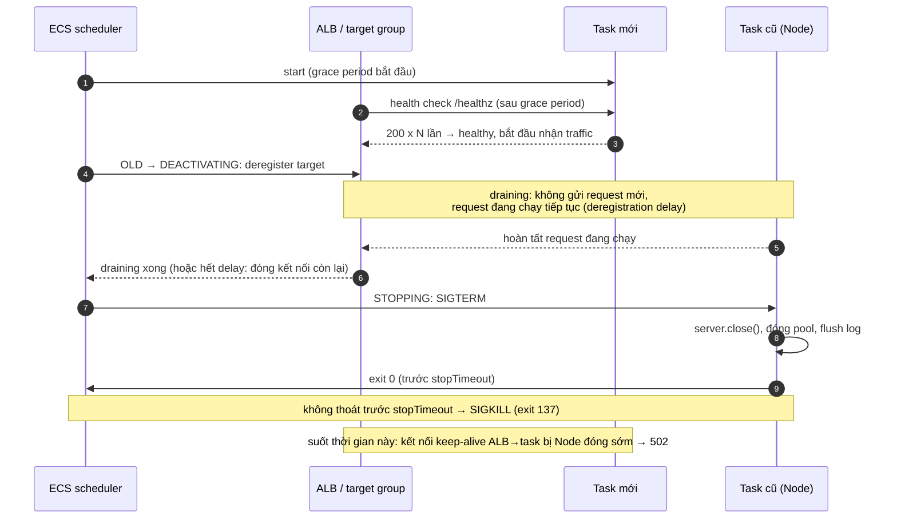
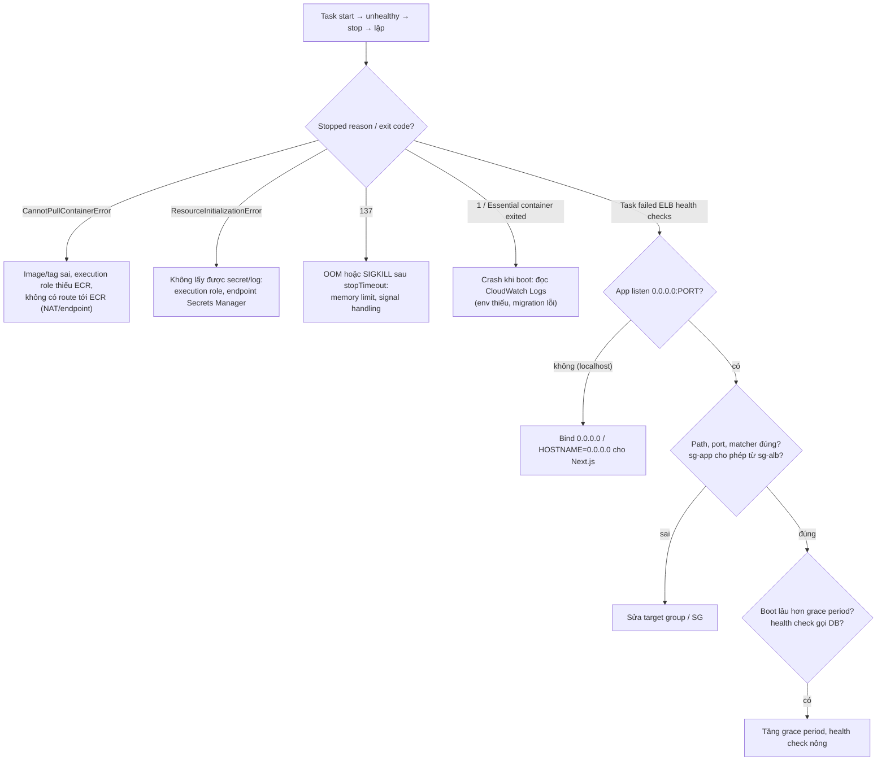

## Bối cảnh & vấn đề

Ba sự cố quen thuộc khi một team chuyển Next.js + Express lên ECS sau ALB. Deploy đầu tiên: task chạy, log ghi "listening on 3000", nhưng ALB đánh dấu unhealthy, ECS kill task, tạo task mới, lặp mãi. Tuần sau: mỗi lần deploy, khoảng 0,5% request trả **502 Bad Gateway** trong một hai phút. Tháng sau: khách hàng doanh nghiệp đòi whitelist một IP cố định cho API, và partner muốn API key với quota riêng.

Ba câu chuyện này nằm ở **ranh giới giữa load balancer và process Node**: health check gọi vào đâu, khi nào ALB ngừng gửi traffic, ai đóng kết nối keep-alive trước, signal nào tới process. Bài này giải thích ALB, NLB, API Gateway khác nhau ở đâu và chọn cái nào; rồi đi vào vòng đời deploy trên ECS đủ chi tiết để không còn 502; cuối cùng là hai vấn đề vận hành: migration DB trong pipeline và lớp real-time nhiều kết nối.

## Khái niệm

### ALB: load balancer tầng 7

**ALB** (Application Load Balancer) hiểu HTTP/HTTPS, HTTP/2, gRPC và WebSocket. Một **listener** (ví dụ 443 với cert ACM) có các **rule** route theo host, path, header, query, method tới **target group** (tập ECS task theo IP, EC2 instance, Lambda). ALB làm được redirect, fixed response, sticky session (cookie), xác thực OIDC/Cognito trước khi request tới app, và gắn **WAF** trực tiếp. ALB có node ở mỗi AZ bạn bật, mỗi node có IP **thay đổi** theo thời gian, vì vậy client phải dùng DNS name.

Trả tiền theo giờ + **LCU** (Load Balancer Capacity Unit, đo theo kết nối mới, kết nối đang mở, băng thông, số rule xử lý). Với Next.js và REST API, ALB (thường đứng sau CloudFront) là mặc định.

**Interview angle:** ALB phù hợp HTTP; nói được "route theo host/path để strangler-fig migrate dần" là điểm cộng ([bài 12](/tracks/aws/learn/cost-reference-architecture)).

### NLB: load balancer tầng 4

**NLB** (Network Load Balancer) làm việc ở TCP/UDP/TLS: không đọc HTTP, nên không route theo path. Đổi lại: chịu hàng triệu kết nối, latency rất thấp, **IP tĩnh mỗi AZ** (có thể gắn Elastic IP), giữ nguyên **client IP**, và là thành phần bắt buộc để expose service qua **PrivateLink** (endpoint service). Dùng khi: protocol không phải HTTP (MQTT, game, Postgres proxy), khách hàng cần whitelist IP cố định, hoặc cung cấp service riêng tư cho VPC khác.

Câu "khách muốn IP cố định cho API sau ALB" có ba hướng: NLB với EIP đặt trước ALB (NLB hỗ trợ target type ALB), **Global Accelerator** (hai IP anycast tĩnh toàn cầu, trỏ tới ALB), hoặc đưa khách hàng qua PrivateLink. Đừng whitelist IP của ALB: chúng thay đổi.

**Interview angle:** biết rằng ALB không có IP tĩnh và đưa ra Global Accelerator/NLB là câu trả lời đúng.

### API Gateway: REST API và HTTP API

**API Gateway** là API front door được quản lý hoàn toàn, trả tiền **theo request**. **REST API** (đời đầu) giàu tính năng: usage plan + API key (quota/throttle theo khách hàng), request validation, transformation, caching, WAF, private API (chỉ gọi từ VPC), edge/regional. **HTTP API** rẻ và nhanh hơn, có JWT authorizer native, nhưng ít tính năng hơn (không usage plan/API key). Cả hai tích hợp Lambda native, gọi được HTTP backend hoặc qua VPC link tới ALB/NLB private.

Giới hạn cần nhớ (verify): payload tối đa khoảng **10 MB**; integration timeout mặc định **29 giây** (REST API cho Regional/private có thể xin tăng, đổi lại giảm throttle quota; HTTP API tối đa 30 giây); throttle mặc định account khoảng 10.000 RPS. Theo request nên ở traffic lớn ổn định thì đắt hơn ALB rõ rệt.

**Interview angle:** câu "rate limit theo tenant cho partner API" thường dẫn tới usage plan + API key của REST API, hoặc WAF rate-based rule theo header, hoặc rate limit ở app với Redis ([caching](/tracks/caching/learn/redis-core)).

### Health check, grace period và circuit breaker

ALB gửi health check tới **target group**: path (`/healthz`), port, interval, timeout, ngưỡng healthy/unhealthy, và **matcher** (mã HTTP chấp nhận). ECS lắng nghe kết quả: task unhealthy bị dừng và thay thế. **`healthCheckGracePeriodSeconds`** của ECS service cho task mới khoảng thời gian bỏ qua health check ALB (app đang chạy migration nhẹ, warm cache). **Deployment circuit breaker** theo dõi deploy: nếu task mới liên tục fail, nó dừng deploy và (nếu bật rollback) quay lại task definition trước.

Health check nên trả lời câu "**process này có nhận request được không**" (liveness/readiness nông), không phải "toàn bộ hệ thống có khoẻ không". Health check gọi DB/Redis biến một sự cố DB thành sự cố toàn bộ fleet: mọi task cùng fail, ECS thay hết, task mới cũng fail vì DB vẫn chậm. Kiểm tra phụ thuộc nên nằm ở endpoint riêng cho monitoring, với cảnh báo, không gắn vào cơ chế thay task.

**Interview angle:** follow-up "ALB health check có nên gọi DB không" — không cho liveness; giải thích kịch bản cascade.

### Graceful shutdown, deregistration delay và keep-alive

Khi ECS dừng một task thuộc service có ALB (deploy, scale-in), task đi qua các trạng thái theo docs "task lifecycle": **DEACTIVATING** (ECS **deregister** target khỏi target group; ALB ngừng gửi request **mới** và đợi **deregistration delay**, mặc định 300 giây, cho request đang chạy hoàn tất) rồi mới tới **STOPPING** (agent gửi **SIGTERM**, sau `stopTimeout`, mặc định 30 giây và tối đa 120 giây, mà process chưa thoát thì **SIGKILL**, exit code 137). Tức là trên ECS, SIGTERM tới **sau** khi drain. (Trên Kubernetes thì khác: gỡ endpoint và SIGTERM xảy ra song song, nên mới có mẫu "ngủ vài giây trước khi đóng" ở `preStop`.)

Vậy 502 khi deploy trên ECS đến từ đâu? (1) **Keep-alive mismatch**, thủ phạm số một: ALB giữ kết nối tới target idle tới **60 giây** (idle timeout mặc định) và tái sử dụng chúng, còn Node đóng kết nối idle sau `server.keepAliveTimeout` (mặc định **5 giây**); nếu Node đóng đúng lúc ALB gửi request mới trên kết nối đó, ALB nhận RST hoặc FIN và trả 502. Deploy làm số kết nối mới/đóng tăng vọt nên lỗi lộ rõ hơn, nhưng nó xảy ra cả lúc bình thường. Sửa: `keepAliveTimeout` **lớn hơn** idle timeout của ALB (65 s > 60 s), `headersTimeout` lớn hơn nữa. (2) **Request dài hơn deregistration delay**: hết delay, ALB đóng kết nối còn lại và request dở bị lỗi. (3) Process **không bắt hoặc không nhận được SIGTERM** (Node chạy PID 1 không có handler không chết theo mặc định; shell bọc ngoài không forward signal) nên bị SIGKILL; việc dọn dẹp (flush log, đóng pool, commit offset) bị cắt. (4) Task mới bị đánh dấu unhealthy vì **grace period** quá ngắn, làm số task khoẻ tạm thời giảm.

**Interview angle:** nói được cơ chế keep-alive race (ai đóng trước) tách người từng debug 502 thật khỏi người chỉ đọc checklist.

### Migration như one-off task

**Rolling deploy** nghĩa là task cũ và task mới chạy **cùng lúc** trên **cùng schema**. Vì vậy migration phải **backward compatible** (expand/contract): thêm cột nullable, deploy code ghi cả hai, backfill, chuyển đọc, rồi mới xoá cột cũ ở release sau ([zero-downtime migrations](/tracks/sql-postgres/learn/zero-downtime-migrations)). Về cơ chế chạy: không chạy migration trong entrypoint của mọi task (N task cùng migrate là race và lock), mà chạy **một lần** như **ECS one-off task** (`aws ecs run-task` với cùng image, command `migrate`) trong private subnet, pipeline chờ exit code 0 rồi mới cập nhật service.

**Interview angle:** follow-up "đổi tên cột đang dùng không downtime" — không `RENAME`; thêm cột mới, dual-write, backfill, chuyển đọc, xoá cũ.

### Lớp real-time: WebSocket trên ECS sau ALB

Socket.IO giữ **kết nối dài**; ALB hỗ trợ WebSocket native. Nhiều node thì cần **adapter** (Redis/ElastiCache pub/sub hoặc Redis Streams adapter) để `io.to(room).emit()` tới được client đang ở node khác. Nếu cho phép HTTP long-polling fallback thì cần **sticky session** (các request polling của một client phải về cùng node); chỉ dùng transport `websocket` thì bỏ được sticky. Scale theo **số kết nối và memory**, không theo CPU. Idle timeout của ALB phải lớn hơn chu kỳ ping của Socket.IO (mặc định 25 s) để kết nối không bị cắt.

Lựa chọn managed: **API Gateway WebSocket API** (tính theo phút kết nối + message, kết nối tối đa **2 giờ**, idle 10 phút, verify; bạn phải tự lưu connection ID), **AppSync Events**, hoặc **IoT Core**.

**Interview angle:** câu "sau mỗi deploy 50k client reconnect cùng lúc" — reconnect có backoff + jitter, deploy từ từ (min healthy cao, ít task mỗi đợt), server gửi tín hiệu reconnect trước khi tắt với độ trễ ngẫu nhiên.

## Cơ chế hoạt động

Chuỗi sự kiện khi ECS thay một task trong rolling deploy, và chỗ 502 có thể chen vào:



Các con số phải khớp: **request dài nhất** < **deregistration delay** (để drain trọn vẹn), và việc dọn dẹp sau SIGTERM < **stopTimeout** (để process tự thoát chứ không bị kill). Đặt deregistration delay 30–60 s thay vì 300 s mặc định nếu request của bạn ngắn, để deploy nhanh. Keep-alive là bài toán độc lập nhưng cùng triệu chứng: nó gây 502 cả khi không deploy.

Khi task không bao giờ healthy, đi theo cây chẩn đoán:



Thứ tự này quan trọng vì mỗi bước loại trừ một lớp: hạ tầng (pull image, secret), process (crash, OOM), mạng (bind, SG, port), rồi mới tới timing. Red flag trong phỏng vấn là "xem log" mà không có giả thuyết theo thứ tự.

## Ví dụ thực tế

### App bind 127.0.0.1: health check từ bên ngoài thất bại

Chạy thật trong Docker (Node 22 alpine): container `app` listen trên `HOST`, một container khác cùng network gọi vào như ALB:

```js
const host = process.env.HOST;
require("node:http").createServer((q, r) => r.end("healthy")).listen(3000, host);
```

```text
app binds 127.0.0.1 -> 'ALB' health check from another container:
   HTTP 000
   connection failed (exit 7)
app binds 0.0.0.0 -> 'ALB' health check from another container:
   HTTP 200
```

`127.0.0.1` chỉ nhận kết nối từ chính network namespace của container; ALB gọi qua ENI của task nên bị từ chối. Next.js standalone đọc biến `HOSTNAME`; một số base image đặt `HOSTNAME` thành tên container, nên đặt rõ `HOSTNAME=0.0.0.0`.

### SIGTERM: exec form, shell form và `--init`

Chạy thật bằng `docker stop -t 5` (gửi SIGTERM, đợi 5 s rồi SIGKILL), giống ECS `stopTimeout`:

```js
// s.js: graceful
process.on("SIGTERM", () => { console.log("SIGTERM received, closing server");
  server.close(() => { console.log("in-flight finished, exit 0"); process.exit(0); }); });
```

```text
CMD: node s.js -> docker stop took 0s, exit code 0
   listening pid 1
   SIGTERM received, closing server
   in-flight finished, exit 0
CMD: sh -c "node s.js; echo bye" -> docker stop took 6s, exit code 137
   listening pid 8
CMD: node nohandler.js -> docker stop took 5s, exit code 137
   listening pid 1
CMD: --init node nohandler.js -> docker stop took 0s, exit code 143
   listening pid 7
```

Bốn bài học: (1) exec form (`CMD ["node", "s.js"]`) cho Node làm PID 1 và nhận SIGTERM; (2) shell bọc ngoài không exec được lệnh (có `; echo bye`) giữ PID 1, **không forward** SIGTERM, Node chạy tiếp tới khi bị SIGKILL (137); (3) Node PID 1 **không có handler** cũng không chết khi SIGTERM (kernel bỏ qua default action cho PID 1), nên chờ hết timeout rồi 137; (4) `--init` (tini) làm PID 1 và forward signal, process chết với 143 (SIGTERM) nhưng không có graceful shutdown. Trên ECS bật `initProcessEnabled` trong `linuxParameters` để có tini. Một thử nghiệm phụ: `sh -c "echo boot; node s.js"` trên busybox vẫn exec Node làm PID 1, nên kết quả phụ thuộc shell; đừng dựa vào nó.

### Keep-alive race: Node 24 đóng kết nối idle sau ~6 giây

Mô phỏng ALB: giữ một kết nối keep-alive, idle, rồi gửi request thứ hai trên cùng socket:

```js
server.keepAliveTimeout = keepAliveTimeout;
// req1 -> wait IDLE ms -> req2 on the same socket
```

```text
node v24.21.0 default keepAliveTimeout = 5000 headersTimeout = 60000
keepAliveTimeout=5000ms req1: HTTP/1.1 200 OK
  after 6000ms idle req2: NO RESPONSE (socket closed by server at 6015ms) -> ALB would return 502
keepAliveTimeout=65000ms req1: HTTP/1.1 200 OK
  after 6000ms idle req2: HTTP/1.1 200 OK
```

Chạy thêm với idle 5.500 ms thì req2 vẫn thành công: Node 24 có `server.keepAliveTimeoutBuffer` mặc định **1.000 ms**, nên socket thực sự đóng sau ~6 s chứ không phải 5 s. Vẫn kém xa 60 s của ALB. Cấu hình đúng:

```ts
const server = app.listen(Number(process.env.PORT ?? 3000), "0.0.0.0");
server.keepAliveTimeout = 65_000;   // > ALB idle timeout (60 s)
server.headersTimeout = 66_000;     // > keepAliveTimeout

app.get("/healthz", (_req, res) => res.status(200).end());   // shallow liveness
process.on("SIGTERM", () => {
  // On ECS the target is already deregistered and drained when SIGTERM arrives.
  // On Kubernetes, sleep a few seconds here first (endpoint removal races SIGTERM).
  server.close(async () => { await pool.end(); process.exit(0); });
  server.closeIdleConnections();                           // Node 18.2+: drop idle keep-alive sockets now
  setTimeout(() => process.exit(1), 25_000).unref();       // hard stop before ECS stopTimeout (30 s)
});
```

Kiểm chứng trước production: chạy load test (k6/autocannon) liên tục trong lúc deploy trên staging, đếm 502 trong ALB access log và metric `HTTPCode_ELB_5XX_Count`.

### Migration như one-off task trong pipeline (minh hoạ)

```bash
TASK_ARN=$(aws ecs run-task --cluster prod --task-definition orders-api:142 \
  --launch-type FARGATE --count 1 \
  --network-configuration 'awsvpcConfiguration={subnets=[subnet-app-a,subnet-app-b],securityGroups=[sg-app],assignPublicIp=DISABLED}' \
  --overrides '{"containerOverrides":[{"name":"api","command":["npm","run","migrate"]}]}' \
  --query 'tasks[0].taskArn' --output text)
aws ecs wait tasks-stopped --cluster prod --tasks "$TASK_ARN"
EXIT=$(aws ecs describe-tasks --cluster prod --tasks "$TASK_ARN" --query 'tasks[0].containers[0].exitCode' --output text)
[ "$EXIT" = "0" ] || { echo "migration failed ($EXIT)"; exit 1; }
aws ecs update-service --cluster prod --service orders-api --task-definition orders-api:142
```

Migration đặt `lock_timeout` (ví dụ 5 s) và `statement_timeout` để không khoá bảng production lâu, index tạo `CONCURRENTLY`. Rollback là rollback **code** (schema vẫn tương thích), không phải chạy migration down.

## Trade-offs & lựa chọn thay thế

| | ALB | NLB | API Gateway REST | API Gateway HTTP |
|---|---|---|---|---|
| Tầng | L7 HTTP/gRPC/WebSocket | L4 TCP/UDP/TLS | L7 managed API | L7 managed API |
| Route | Host/path/header | Port | Resource/method | Route |
| IP tĩnh | Không | Có (EIP/AZ) | Không | Không |
| Auth tích hợp | OIDC/Cognito | Không | IAM, Cognito, Lambda authorizer | JWT, Lambda, IAM |
| Throttle/quota theo khách | Không (WAF rate rule) | Không | Usage plan + API key | Throttle theo route |
| Giới hạn | Idle timeout cấu hình được | Rất cao | ~10 MB, 29 s (verify) | ~10 MB, 30 s |
| Giá | Giờ + LCU | Giờ + NLCU | Theo request (cao nhất) | Theo request (rẻ hơn REST) |
| Hợp với | Container chạy liên tục | Non-HTTP, IP tĩnh, PrivateLink | Partner API, Lambda | API Lambda đơn giản |

Chọn: container Node/Next.js chạy liên tục → **ALB** (sau CloudFront). API serverless bằng Lambda, cần JWT → **HTTP API**. Partner API cần API key + quota + request validation → **REST API**. Non-HTTP hoặc IP tĩnh → **NLB** (hoặc Global Accelerator trước ALB). Real-time 50k kết nối: Socket.IO trên Fargate + ALB + Redis adapter khi team đã có Socket.IO và muốn kiểm soát; API Gateway WebSocket khi muốn managed và chấp nhận giới hạn 2 giờ/kết nối và giá theo message.

## Edge cases & failure modes

- **Deregistration delay quá dài** (mặc định 300 s) làm deploy chậm; **quá ngắn** cắt request dài (upload, export). Đặt theo request dài nhất thực tế.
- **Tất cả target unhealthy**: ALB fail-open gửi tới mọi target (verify), nhưng ECS vẫn thay task; health check nông tránh được kịch bản này.
- **OOM 137** bị nhầm với SIGKILL do timeout: xem `stoppedReason` ("OutOfMemoryError: Container killed due to memory usage") và metric memory.
- **WebSocket bị cắt sau 60 s** khi không có traffic: tăng idle timeout của ALB hoặc giữ heartbeat ngắn hơn.
- **Reconnect storm**: 50k client reconnect trong vài giây sau deploy làm Redis adapter và auth backend quá tải; backoff + jitter phía client, deploy theo đợt nhỏ.
- **Migration chạy hai lần** (pipeline retry): migration tool phải có bảng lock/version (Prisma, Knex, Flyway đều có).
- **API Gateway timeout 29 s** với SSR/report chậm: trả 504 dù backend vẫn chạy; chuyển sang async (job + poll) hoặc ALB.

## Pitfalls

- ❌ App/Next.js listen `localhost` trong container → ✅ `0.0.0.0` (Next.js: `HOSTNAME=0.0.0.0`).
- ❌ `CMD npm start` hoặc shell form bọc Node → ✅ exec form `CMD ["node", "server.js"]`, hoặc `initProcessEnabled`.
- ❌ `process.exit()` ngay khi SIGTERM → ✅ `server.close()`, đóng pool, flush log, thoát trước `stopTimeout`; trên Kubernetes thêm vài giây chờ trước khi đóng.
- ❌ Để `keepAliveTimeout` mặc định 5 s sau ALB 60 s → ✅ 65 s và `headersTimeout` 66 s.
- ❌ Health check gọi DB/Redis → ✅ liveness nông; dependency check ở endpoint monitoring riêng.
- ❌ Migration trong entrypoint của mọi task → ✅ one-off task chạy trước update-service, migration tương thích ngược.
- ❌ Whitelist IP của ALB cho khách hàng → ✅ NLB + EIP hoặc Global Accelerator.
- ❌ Scale Socket.IO theo CPU → ✅ theo số kết nối/memory; Redis adapter; reconnect có jitter.

## Tóm tắt

- ALB cho HTTP/WebSocket với route L7; NLB cho TCP/UDP, IP tĩnh, PrivateLink; API Gateway cho API managed tính theo request (REST nhiều tính năng, HTTP rẻ hơn).
- Task restart vòng lặp: đi theo stopped reason → log → bind/port/SG → grace period → health check nông.
- Trên ECS: deregister + drain (DEACTIVATING) rồi mới SIGTERM (STOPPING); request dài nhất < deregistration delay, dọn dẹp < stopTimeout.
- Keep-alive: Node mặc định 5 s (+1 s buffer ở Node 24) < ALB 60 s; đặt `keepAliveTimeout` 65 s.
- Migration: one-off ECS task trước khi đổi service; expand/contract vì code cũ và mới chạy cùng lúc.
- Real-time: Socket.IO trên Fargate + ALB + Redis adapter, scale theo kết nối, reconnect có jitter; hoặc API Gateway WebSocket.
