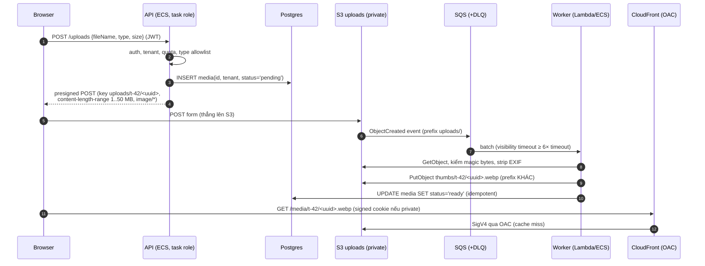

## Bối cảnh & vấn đề

API Express nhận ảnh sản phẩm 30 MB qua `multer`, giữ trong memory rồi stream lên S3. Mười người upload cùng lúc là pod chạm giới hạn memory; đặt sau API Gateway thì vấp giới hạn payload ~10 MB; đặt sau Lambda thì vấp 6 MB. Team chuyển sang presigned URL, nhưng ba tháng sau phát hiện bucket chứa vài file 2 GB và vài file `.html` mà ai đó dùng để phát tán phishing dưới domain của công ty. Cùng lúc, team frontend chuyển CloudFront từ OAI sang OAC và mọi asset trả **403**.

S3 là service "dễ dùng sai": API đơn giản, nhưng các quyết định nhỏ (ký header nào, ai chọn key, resource ARN của bucket hay object, storage class nào) có hệ quả lớn về bảo mật và chi phí. Bài này đi qua upload trực tiếp từ browser (presigned PUT/POST), mô hình consistency và conditional writes, CloudFront đứng trước S3 và ALB cho Next.js, lỗi OAC 403, storage class và lifecycle, rồi ghép thành một pipeline upload multi-tenant. Quyền IAM nền tảng ở [bài 1](/tracks/aws/learn/iam-identities-roles).

## Khái niệm

### Bucket, object, key và các endpoint

**Bucket** là container có tên duy nhất toàn cầu, nằm ở một region. **Object** là dữ liệu + metadata, định danh bằng **key** (chuỗi bất kỳ; dấu `/` chỉ là quy ước, S3 không có thư mục thật). Một object tối đa 5 TB; một lần `PUT` tối đa **5 GB**, lớn hơn phải dùng **multipart upload** (khuyến nghị từ ~100 MB). **Block Public Access** ở mức account và bucket nên luôn bật; mặc định bucket mới đã bật và ACL bị tắt (Object Ownership = bucket owner enforced).

S3 có **REST endpoint** (`bucket.s3.region.amazonaws.com`, hỗ trợ SigV4, OAC) và **website endpoint** (`bucket.s3-website-region.amazonaws.com`, chỉ HTTP, dành cho static website public, không dùng được với OAC). Nhầm hai endpoint là một nguồn 403 phổ biến.

**Interview angle:** biết giới hạn 5 GB/PUT và multipart cho file lớn là kiến thức nền; biết website endpoint không dùng OAC là điểm cộng.

### Presigned URL: PUT và POST

**Presigned URL** là URL chứa chữ ký **SigV4** được tạo bằng credential của **server** (role của app), cho phép người cầm URL làm **đúng một thao tác** (`PUT`/`GET` một key) trong thời hạn `expiresIn` (tối đa 7 ngày với SigV4; nếu ký bằng credential tạm thời thì URL chết khi session hết hạn). Quyền thực tế của URL = quyền của credential đã ký tại thời điểm dùng. Browser upload thẳng lên S3, API server không chạm vào byte nào: không tốn memory/bandwidth, không vướng giới hạn payload.

**Presigned PUT** chỉ khoá được những gì nằm trong chữ ký: method, bucket, key, và các header được ký. Nó **không** giới hạn được kích thước (ngoài việc ký `Content-Length` cố định). Mặc định, SDK v3 chỉ ký header `host`, nên `ContentType` truyền vào `PutObjectCommand` **không** được ép: client gửi `text/html` vẫn thành công (xem ví dụ chạy thật bên dưới). Muốn ép phải truyền `signableHeaders: new Set(["content-type"])`.

**Presigned POST** dùng **POST policy**: một tài liệu JSON có điều kiện, được ký, gửi kèm form multipart. Điều kiện gồm `content-length-range` (min/max byte), `starts-with $Content-Type image/`, key chính xác hoặc prefix, metadata bắt buộc. S3 từ chối upload vi phạm (`EntityTooLarge`, `AccessDenied`). Đây là cách đúng khi cần giới hạn kích thước.

Nguyên tắc chung: server **xác thực** (user, tenant, quota) trước khi ký; **server sinh key** (`uploads/<tenantId>/<uuid>`), không nhận path từ client; thời hạn ngắn (vài phút); và coi file vừa upload là **chưa tin cậy** cho tới khi được xử lý.

**Interview angle:** follow-up "giới hạn kích thước file với presigned upload thế nào" có đáp án: presigned POST với `content-length-range`; PUT không làm được.

### Strong consistency và conditional writes

Từ **12/2020**, S3 có **strong read-after-write consistency** cho mọi PUT, DELETE và LIST ở mọi region, không tốn thêm phí: ghi xong thì GET/HEAD/LIST ngay sau đó thấy phiên bản mới. Trước đó, overwrite và delete chỉ eventually consistent; nhiều khoá học cũ vẫn dạy sai. Lưu ý phạm vi: thay đổi **cấu hình bucket** (policy, versioning, lifecycle) vẫn có thể lan truyền chậm.

Strong consistency **không** phải locking: hai writer cùng PUT một key thì **last writer wins**, update của người kia mất. S3 có **conditional writes** (2024): `If-None-Match: *` chỉ tạo khi key chưa tồn tại (412 nếu đã có), `If-Match: <ETag>` chỉ ghi đè khi ETag hiện tại khớp, cho phép optimistic concurrency kiểu compare-and-swap.

**Interview angle:** "hai worker ghi cùng key" → last writer wins; dùng `If-Match`/`If-None-Match` hoặc key duy nhất cho mỗi lần ghi.

### CloudFront: distribution, behavior, cache policy

**CloudFront** là CDN: một **distribution** có nhiều **origin** (S3, ALB, HTTP bất kỳ) và nhiều **cache behavior** khớp theo path pattern (`/_next/static/*`, `/images/*`, mặc định `*`). Mỗi behavior có **cache policy** (cái gì vào **cache key**: header, cookie, query string; TTL min/default/max) và **origin request policy** (cái gì **forward** tới origin nhưng không vào cache key). Tách hai thứ này là chìa khoá: forward cookie session tới ALB mà không đưa nó vào cache key thì cache vô dụng cho trang cá nhân hoá... còn đưa vào cache key thì mỗi user một bản cache.

Với Next.js: `/_next/static/*` có hash trong tên file nên cache rất dài (immutable); trang SSR/ISR tôn trọng `Cache-Control` từ app (`s-maxage`, `stale-while-revalidate`); API thường không cache. TLS cho CloudFront dùng cert **ACM ở us-east-1** (bất kể region của origin). **WAF** gắn vào distribution. Chi tiết HTTP caching ở [bài caching](/tracks/caching/learn/http-cdn-caching).

**Interview angle:** follow-up "sau deploy, HTML cũ tham chiếu JS chunk 404" — giữ asset của build cũ trên S3 một thời gian (không xoá khi deploy), deploy asset trước HTML, HTML cache ngắn.

### OAC và bảo vệ origin

**Origin Access Control (OAC)** cho CloudFront ký request tới S3 bằng SigV4 với principal service `cloudfront.amazonaws.com`. Bucket giữ **private**; bucket policy chỉ cho `cloudfront.amazonaws.com` với điều kiện `AWS:SourceArn` = ARN của **đúng distribution**. OAC thay thế **OAI** (Origin Access Identity, legacy): OAC hỗ trợ SSE-KMS, mọi region, và request ghi (PUT/DELETE) khi cần.

Lỗi 403 sau khi chuyển OAI → OAC thường do: `Resource` trong bucket policy là **bucket ARN** thay vì **`bucket/*`** (GetObject là action trên object), sai distribution ID trong `SourceArn`, origin vẫn là website endpoint, object mã hoá **SSE-KMS** mà key policy chưa cho `cloudfront.amazonaws.com` `kms:Decrypt`, hoặc origin chưa gắn OAC. Ngoài ra S3 trả **403 thay vì 404** cho object không tồn tại khi caller không có `s3:ListBucket`, để không tiết lộ key nào tồn tại; dễ nhầm với lỗi quyền.

Với origin ALB: chặn truy cập thẳng bằng SG của ALB chỉ cho **CloudFront managed prefix list** (`com.amazonaws.global.cloudfront.origin-facing`), thêm một custom header bí mật mà ALB rule kiểm tra, hoặc dùng **VPC origin** (CloudFront tới ALB private, không cần ALB public, verify).

**Interview angle:** follow-up "khi nào cấp `s3:ListBucket` cho CloudFront" — khi muốn object thiếu trả 404 thật (ví dụ để custom error page 404 hoạt động), chấp nhận lộ việc key có tồn tại hay không.

### Storage class và lifecycle

**Storage class** đánh đổi giá lưu trữ với giá truy xuất và thời gian lưu tối thiểu: **Standard** (truy cập thường xuyên); **Intelligent-Tiering** (tự chuyển tier theo pattern truy cập, phí monitoring nhỏ mỗi object, không phí retrieval; hợp khi không đoán được pattern); **Standard-IA / One Zone-IA** (ít truy cập, phí retrieval mỗi GB, lưu tối thiểu 30 ngày, tính tối thiểu 128 KB mỗi object; One Zone mất dữ liệu nếu AZ mất); **Glacier Instant Retrieval** (truy xuất ms, lưu tối thiểu 90 ngày), **Glacier Flexible Retrieval** (phút tới giờ) và **Glacier Deep Archive** (tới 12–48 giờ, rẻ nhất, lưu tối thiểu 180 ngày). Số ngày tối thiểu và giá: verify theo docs hiện tại.

**Lifecycle rule** tự động: chuyển class theo tuổi object, xoá object hết hạn, `NoncurrentVersionExpiration` cho version cũ (khi bật versioning), và **`AbortIncompleteMultipartUpload`** (các part upload dở bị tính tiền vô hình nếu không dọn). Bẫy: object nhỏ (< 128 KB) và lưu ngắn hạn làm IA/Glacier **đắt hơn** Standard; với versioning bật, "xoá" chỉ tạo **delete marker**, các version cũ vẫn tính tiền.

**Interview angle:** follow-up "versioning bật, đã xoá file mà bill vẫn tăng" — version cũ và delete marker; cần lifecycle cho noncurrent version.

## Cơ chế hoạt động

Pipeline upload + thumbnail cho app multi-tenant:



Từng quyết định có lý do. API không chạm byte file, chỉ quyết định **ai** được upload **cái gì** vào **đâu**, và ghi bản ghi `pending` trước để có thể theo dõi. Presigned POST ép kích thước và content-type ở chính S3. Event đi qua **SQS** thay vì trigger Lambda trực tiếp để có buffer, retry, DLQ và kiểm soát concurrency ([bài 9](/tracks/aws/learn/messaging)). Worker kiểm tra **nội dung thật** (magic bytes, không tin extension hay Content-Type do client khai), xoá EXIF (vị trí GPS trong ảnh điện thoại), ghi ra **prefix khác** để không tự kích hoạt lại ([vòng lặp ở bài 5](/tracks/aws/learn/lambda-deep-dive)). Cập nhật trạng thái là **idempotent** vì S3 event và SQS đều at-least-once: xử lý cùng object hai lần chỉ ghi đè cùng một thumbnail. Ảnh được phục vụ qua CloudFront với OAC; ảnh private dùng **CloudFront signed URL/cookie** (khác presigned URL của S3).

## Ví dụ thực tế

Các output dưới đây chạy thật trên **MinIO** (`bitnamilegacy/minio`, build DEVELOPMENT.2025-05-24, kiểm chữ ký SigV4 đầy đủ) và **LocalStack 4.0.3** (community), với AWS SDK v3 3.1144, Node 24.21. Emulator không phải S3 thật; chỗ nào hành vi có thể khác được ghi chú.

### Presigned PUT: Content-Type không được ép nếu không ký

```ts
import { S3Client, PutObjectCommand } from "@aws-sdk/client-s3";
import { getSignedUrl } from "@aws-sdk/s3-request-presigner";

const s3 = new S3Client({ requestChecksumCalculation: "WHEN_REQUIRED" });
for (const opts of [{ expiresIn: 300 }, { expiresIn: 300, signableHeaders: new Set(["content-type"]) }]) {
  const url = await getSignedUrl(s3, new PutObjectCommand({ Bucket: "acme-uploads", Key: `u/${crypto.randomUUID()}.png`, ContentType: "image/png" }), opts);
  // PUT with image/png, then with text/html
}
```

```text
signableHeaders: default -> X-Amz-SignedHeaders = host
   PUT Content-Type image/png -> 200
   PUT Content-Type text/html -> 200
signableHeaders: [content-type] -> X-Amz-SignedHeaders = content-type;host
   PUT Content-Type image/png -> 200
   PUT Content-Type text/html -> 403 SignatureDoesNotMatch
expired URL (1s, used after 2.5s) -> 403 AccessDenied
```

Mặc định chỉ `host` được ký: client upload `text/html` vào một URL bạn "định" dành cho PNG. Thêm `signableHeaders` thì chữ ký bao `content-type` và lệch là `SignatureDoesNotMatch`. URL quá hạn trả `AccessDenied`. Cùng URL nhận cả thân 60 MB (thử thật trên MinIO): presigned PUT không giới hạn kích thước.

### Bẫy checksum mặc định của SDK v3 trong presigned URL

```text
{} checksum in URL: true -> PUT 1 KB: 400 Value for x-amz-checksum-crc32 header is invalid.
{"requestChecksumCalculation":"WHEN_REQUIRED"} checksum in URL: false -> PUT 1 KB: 200
```

Từ đầu 2025, SDK v3 bật **default data integrity protection**: presigner đưa `x-amz-checksum-crc32` (tính trên thân **rỗng** lúc ký) và `x-amz-sdk-checksum-algorithm` vào URL. LocalStack 4.0.3 từ chối upload thật với lỗi trên; MinIO bỏ qua. S3 thật cũng có báo cáo lỗi tương tự trên các issue của SDK (verify với version bạn dùng). Cách an toàn cho presigned upload: tạo client ký với `requestChecksumCalculation: "WHEN_REQUIRED"`, hoặc chủ động tính checksum của file ở client và ký nó.

### Presigned POST với `content-length-range`

```ts
import { createPresignedPost } from "@aws-sdk/s3-presigned-post";

const post = await createPresignedPost(s3, {
  Bucket: "acme-uploads", Key: `uploads/t-42/${crypto.randomUUID()}`,
  Conditions: [["content-length-range", 1, 5 * 1024 * 1024], ["starts-with", "$Content-Type", "image/"]],
  Fields: { "Content-Type": "image/png" }, Expires: 300,
});
// browser: <form method="post" action={post.url}> with post.fields + file (file field LAST)
```

```text
policy: [["content-length-range",1,5242880],["starts-with","$Content-Type","image/"],{"Content-Type":"image/png"},{"bucket":"acme-uploads"},{"X-Amz-Algorithm":"AWS4-HMAC-SHA256"},...,{"key":"uploads/t-42/9159f3c1-..."}]
POST 1024 B, image/png -> 204
POST 6291456 B, image/png -> 400 EntityTooLarge
POST 1024 B, text/html -> 403 AccessDenied
```

File 6 MB vượt trần 5 MB bị `EntityTooLarge`; content-type sai bị từ chối. Ghi chú: LocalStack 4.0.3 **không** ép `content-length-range` (nhận cả file 6 MB), nên đừng tin một test chỉ chạy trên LocalStack cho logic này.

### Conditional writes chống lost update

Chạy trên LocalStack 4.0.3:

```ts
await s3.send(new PutObjectCommand({ Bucket, Key: "reports/2026-09.csv", Body: who, IfNoneMatch: "*" }));
const h = await s3.send(new HeadObjectCommand({ Bucket, Key }));
await s3.send(new PutObjectCommand({ Bucket, Key, Body: "v2 by A", IfMatch: h.ETag }));
await s3.send(new PutObjectCommand({ Bucket, Key, Body: "v2 by B", IfMatch: h.ETag }));   // stale ETag
```

```text
worker-A created reports/2026-09.csv
worker-B -> PreconditionFailed 412
A updated with If-Match "f9b7de8bb380743c7f1b4aa0e1512c33"
B with stale ETag -> PreconditionFailed 412
read-after-write: v2 by A
```

Worker B không ghi đè được báo cáo A vừa tạo, và không ghi đè được update của A khi cầm ETag cũ: B phải đọc lại, merge, rồi thử lại. GET ngay sau PUT thấy bản mới (strong consistency).

### Bucket policy OAC: bucket ARN vs `bucket/*`

Chạy qua `@cloud-copilot/iam-simulate` 0.1.173 (mô hình IAM, không phải S3 thật):

```text
OAC Resource=bucket ARN                          -> ImplicitlyDenied
OAC Resource=bucket/*                            -> Allowed
OAC Resource=bucket/*, other distribution        -> ImplicitlyDenied
```

Policy đúng:

```json
{
  "Version": "2012-10-17",
  "Statement": [{
    "Sid": "AllowCloudFrontOAC",
    "Effect": "Allow",
    "Principal": { "Service": "cloudfront.amazonaws.com" },
    "Action": "s3:GetObject",
    "Resource": "arn:aws:s3:::acme-web/*",
    "Condition": { "StringEquals": { "AWS:SourceArn": "arn:aws:cloudfront::111122223333:distribution/EDFDVBD6EXAMPLE" } }
  }]
}
```

### CloudFront cho Next.js (CDK, minh hoạ)

```ts
const dist = new cloudfront.Distribution(this, "Web", {
  defaultBehavior: {                                       // SSR/ISR/API -> ALB
    origin: new origins.LoadBalancerV2Origin(alb, { protocolPolicy: cloudfront.OriginProtocolPolicy.HTTPS_ONLY,
      customHeaders: { "X-Origin-Verify": originSecret } }),
    cachePolicy: cloudfront.CachePolicy.USE_ORIGIN_CACHE_CONTROL_HEADERS_QUERY_STRINGS,
    originRequestPolicy: cloudfront.OriginRequestPolicy.ALL_VIEWER_EXCEPT_HOST_HEADER,
    allowedMethods: cloudfront.AllowedMethods.ALLOW_ALL,
  },
  additionalBehaviors: {
    "/_next/static/*": {                                    // hashed, immutable
      origin: origins.S3BucketOrigin.withOriginAccessControl(assets),
      cachePolicy: cloudfront.CachePolicy.CACHING_OPTIMIZED,
    },
  },
  certificate: certUsEast1,                                 // ACM cert must be in us-east-1
  webAclId: wafArn,
});
```

### Lifecycle cho uploads và logs (minh hoạ)

```json
{
  "Rules": [
    { "ID": "uploads-tiering", "Filter": { "Prefix": "uploads/" }, "Status": "Enabled",
      "Transitions": [{ "Days": 0, "StorageClass": "INTELLIGENT_TIERING" }],
      "NoncurrentVersionExpiration": { "NoncurrentDays": 30 },
      "AbortIncompleteMultipartUpload": { "DaysAfterInitiation": 7 } },
    { "ID": "logs", "Filter": { "Prefix": "logs/" }, "Status": "Enabled",
      "Transitions": [{ "Days": 30, "StorageClass": "GLACIER_IR" }, { "Days": 90, "StorageClass": "DEEP_ARCHIVE" }],
      "Expiration": { "Days": 400 } }
  ]
}
```

## Trade-offs & lựa chọn thay thế

| Cách upload | Giới hạn size | Ép content-type | Server tốn tài nguyên | Khi nào |
|---|---|---|---|---|
| Qua API (multer/stream) | Theo API/proxy | Có (server kiểm) | Cao | File nhỏ, cần xử lý đồng bộ |
| Presigned PUT | Không (trừ ký Content-Length) | Chỉ khi ký `content-type` | Không | Đơn giản, client tin cậy hơn |
| Presigned POST (policy) | Có, `content-length-range` | Có, điều kiện policy | Không | Upload công khai từ browser |
| Multipart + presigned từng part | Có (server ký N part) | Có | Thấp | File > 100 MB, resume được |
| Identity pool → credential tạm cho client | Theo IAM | Theo IAM condition | Không | App mobile gọi S3 trực tiếp |

| Storage class | Hợp với | Bẫy |
|---|---|---|
| Standard | Truy cập thường xuyên | Đắt nhất cho dữ liệu nguội |
| Intelligent-Tiering | Pattern không đoán được | Phí monitoring mỗi object (object rất nhỏ thì không đáng) |
| Standard-IA / One Zone-IA | Ít truy cập, cần ngay | Phí retrieval, tối thiểu 30 ngày và 128 KB |
| Glacier IR / Flexible / Deep Archive | Lưu trữ dài hạn | Tối thiểu 90/90/180 ngày, retrieval chậm dần (verify) |

## Edge cases & failure modes

- **Multipart upload dở**: part đã upload bị tính tiền cho tới khi abort; lifecycle `AbortIncompleteMultipartUpload` là bắt buộc.
- **Presigned URL ký bằng credential tạm thời** hết hạn sớm hơn `expiresIn` khi session hết hạn.
- **Clock skew**: máy ký lệch giờ làm URL "chưa có hiệu lực" hoặc hết hạn sớm (`RequestTimeTooSkewed`).
- **S3 event at-least-once và có thể đến muộn/không theo thứ tự**: worker idempotent, dùng `sequencer` trong event nếu cần thứ tự cho cùng key.
- **Prefix nóng**: S3 chịu khoảng 3.500 PUT và 5.500 GET mỗi giây **mỗi prefix** (verify) và tự chia partition khi tải tăng; tăng đột ngột có thể gặp `503 SlowDown` tạm thời, retry có backoff.
- **CloudFront cache key quá rộng** (forward mọi header/cookie) làm cache hit ratio gần 0 và mọi request đổ về origin.
- **Invalidation** tốn tiền sau 1.000 path miễn phí mỗi tháng và không tức thì; đặt tên file có hash thay vì invalidate.
- **SSE-KMS + CloudFront**: thiếu key policy cho `cloudfront.amazonaws.com` là 403 cho mọi object mã hoá.

## Pitfalls

- ❌ Bucket public-write cho upload → ✅ presigned POST có policy, bucket private + Block Public Access.
- ❌ Cho client chọn key → ✅ server sinh `uploads/<tenantId>/<uuid>`; tenant lấy từ token, không từ body.
- ❌ Tin `ContentType` trong `PutObjectCommand` là đã ép → ✅ ký `content-type` qua `signableHeaders`, hoặc dùng POST policy, và luôn kiểm magic bytes khi xử lý.
- ❌ Dùng presigned PUT rồi mong giới hạn kích thước → ✅ presigned POST `content-length-range`.
- ❌ Bucket policy OAC với `Resource: arn:aws:s3:::bucket` → ✅ `bucket/*` cho `s3:GetObject`.
- ❌ Bucket public để CloudFront đọc, hoặc dùng OAI cho cấu hình mới → ✅ OAC, bucket private.
- ❌ Worker ghi thumbnail vào cùng prefix bị trigger → ✅ prefix/bucket khác.
- ❌ Bật versioning mà không có lifecycle cho noncurrent version → ✅ `NoncurrentVersionExpiration`.
- ❌ Chuyển mọi thứ sang IA để "tiết kiệm" → ✅ tính object size và thời gian lưu; Intelligent-Tiering khi không chắc.

## Tóm tắt

- Presigned URL cho browser upload/download thẳng S3 bằng quyền của server, trong thời gian ngắn; server sinh key, xác thực trước khi ký.
- Presigned PUT không giới hạn size và mặc định không ký Content-Type; presigned POST với policy ép được cả hai.
- SDK v3 mới đưa checksum mặc định vào presigned URL; dùng `requestChecksumCalculation: "WHEN_REQUIRED"` cho presigner.
- S3 strongly consistent từ 12/2020 nhưng không có lock; conditional writes (`If-None-Match`, `If-Match`) chống lost update.
- CloudFront: behavior theo path, cache policy (cache key) tách khỏi origin request policy (forward); cert ACM ở us-east-1.
- OAC: bucket private, policy cho `cloudfront.amazonaws.com` trên `bucket/*` với `AWS:SourceArn`; KMS key policy nếu SSE-KMS.
- Storage class và lifecycle: Intelligent-Tiering cho uploads không đoán được, Glacier cho log cũ, luôn abort multipart dở và expire noncurrent version.
