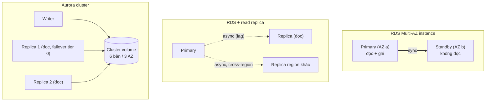
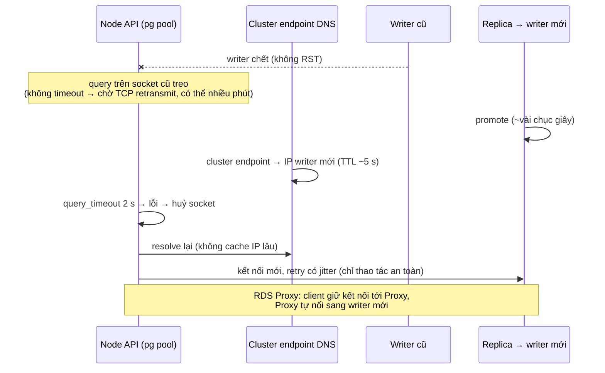

## Bối cảnh & vấn đề

Một sàn thương mại điện tử chạy Aurora PostgreSQL. 20:05 tối flash sale, instance writer gặp lỗi phần cứng, Aurora failover sang một reader trong khoảng 30 giây; console ghi "failover completed". Nhưng API Node trả lỗi suốt **bảy phút**: request treo, pool báo timeout lấy kết nối, rồi một làn sóng retry làm writer mới quá tải. Trong cùng tuần, team báo cáo chuyển query report sang read replica và người dùng than "vừa lưu xong mà không thấy". Và một team mới định dùng DynamoDB cho module đơn hàng vì "scale vô hạn", rồi nhận ra không trả lời được câu "doanh thu theo danh mục tuần này".

Cả ba là câu hỏi kiến trúc dữ liệu kinh điển trên AWS: **availability khác scale đọc**, **DB failover nhanh không có nghĩa app hồi phục nhanh**, và **chọn database theo access pattern chứ không theo quảng cáo**. Bài này giải thích RDS Multi-AZ, read replica, kiến trúc Aurora, cơ chế failover và phía client, mô hình DynamoDB, rồi ElastiCache. Nội dung Postgres nội tại (replication, pooling) ở [track SQL/Postgres](/tracks/sql-postgres/learn/replication-scaling); DynamoDB modeling chi tiết hơn ở [track NoSQL](/tracks/nosql-search/learn/dynamodb-keys-query).

## Khái niệm

### RDS Multi-AZ (DB instance): availability, không phải scale

**RDS Multi-AZ instance deployment** giữ một **standby đồng bộ** ở AZ khác: mỗi write được ghi ở cả primary và standby (block-level, đồng bộ) trước khi commit trả về. Standby **không phục vụ đọc**. Khi primary hỏng, bị patch, hay AZ gặp sự cố, RDS **failover**: đổi bản ghi DNS của endpoint sang standby; thường mất khoảng **60–120 giây** (verify). Mục đích duy nhất là **availability**; đổi lại write latency tăng nhẹ (đồng bộ qua AZ) và bạn trả tiền cho một instance không phục vụ traffic.

**Multi-AZ DB cluster** (cho RDS MySQL và PostgreSQL) là ngoại lệ: một writer và **hai reader standby đọc được** ở ba AZ, replication dùng cơ chế semi-synchronous, failover thường nhanh hơn (dưới khoảng 35 giây theo docs, verify). Câu "standby không đọc được" chỉ đúng với Multi-AZ instance.

**Interview angle:** red flag là "Multi-AZ tăng gấp đôi khả năng đọc"; câu trả lời đúng phân biệt instance vs DB cluster.

### Read replica: scale đọc, bất đồng bộ

**Read replica** nhận replication **bất đồng bộ** (với Postgres là streaming replication), nên luôn có **replica lag** (thường dưới một giây, có thể lên phút khi replica quá tải hoặc writer ghi dồn). Replica phục vụ đọc, có thể **cross-region** (đọc gần user, hoặc làm DR), và có thể **promote** thủ công thành DB độc lập. Read replica không tự failover cho primary của RDS (khác Aurora).

Hệ quả "vừa lưu không thấy": user ghi vào primary, request sau đọc từ replica chưa kịp nhận. Cách xử lý: **read-your-writes** (đọc từ primary trong vài giây sau khi user đó ghi, theo cookie hoặc session flag), route theo loại query (màn hình vừa sửa đọc primary, report đọc replica), hoặc chờ replica đạt LSN của write (phức tạp hơn).

**Interview angle:** follow-up về "vừa lưu không thấy" muốn nghe từ "replica lag" và một chiến lược read-your-writes cụ thể.

### Aurora: tách compute và storage

**Aurora** (MySQL/PostgreSQL-compatible) tách **compute** (instance writer và tới **15 Aurora Replica**) khỏi **storage** phân tán: volume chia thành các segment 10 GB, mỗi segment có **6 bản sao trên 3 AZ**; write được xác nhận khi đạt quorum 4/6, read cần 3/6. Writer **chỉ gửi log record** xuống storage (không ghi page đầy đủ), storage tự áp log thành page. Replica đọc **cùng volume**, nên không cần replication dữ liệu riêng; lag thường chỉ vài chục ms (chỉ cần làm mới cache). Storage tự tăng tới 128 TiB (verify theo engine version).

Vì replica dùng chung storage, **Aurora Replica vừa phục vụ đọc vừa là failover target**: failover chỉ là promote một replica (theo **promotion tier**) và đổi DNS của **cluster endpoint** (writer), thường dưới 30–60 giây (verify). Các endpoint: **cluster endpoint** (luôn trỏ writer), **reader endpoint** (cân bằng giữa replica), custom endpoint, instance endpoint.

Tính năng thêm: **Global Database** (replication cross-region ở tầng storage, lag thường dưới một giây, phục vụ DR), **fast clone** (copy-on-write, tạo DB test từ prod trong phút), **Serverless v2** (scale ACU theo tải, nay từ **0 tới 256 ACU** với auto-pause trên version mới theo docs hiện tại), và hai cấu hình storage: **Standard** (trả theo I/O) và **I/O-Optimized** (không phí I/O, giá compute/storage cao hơn; AWS gợi ý chuyển khi chi phí I/O vượt khoảng 25% tổng chi phí Aurora, verify).

**Interview angle:** câu "khi nào Aurora đáng giá" muốn nghe: nhiều replica đọc, failover nhanh, storage lớn tăng dần, DR cross-region; còn DB nhỏ, tải ổn định thì RDS thường rẻ hơn.

### Failover nhìn từ phía client

DB failover nhanh không giúp gì nếu **client** không nhận ra. Các lý do app lỗi lâu hơn DB: (1) **DNS cache**: endpoint đổi IP nhưng resolver/process giữ IP cũ theo TTL (Aurora endpoint TTL khoảng 5 giây, nhưng client có thể cache lâu hơn); (2) **kết nối chết không được phát hiện**: writer cũ biến mất mà không gửi RST, các socket trong pool "treo" chờ response cho tới khi TCP retransmission của OS bỏ cuộc (có thể tới **15 phút** trên Linux mặc định); request mượn kết nối đó treo theo; (3) **pool cạn**: mọi kết nối treo, request mới chờ lấy kết nối; (4) **thundering herd**: khi hồi phục, mọi client retry cùng lúc không jitter.

Sửa ở client: timeout ở mọi tầng (`connectionTimeoutMillis`, `query_timeout`/`statement_timeout`), **TCP keepalive**, validate kết nối khi mượn, retry có **exponential backoff + jitter** chỉ cho lỗi transient và chỉ cho thao tác an toàn (idempotent). Sửa ở hạ tầng: **RDS Proxy** (giữ kết nối từ client, tự chuyển sang writer mới, không phụ thuộc DNS của client; AWS công bố giảm thời gian failover đáng kể), hoặc driver nhận biết topology (**AWS Advanced NodeJS Wrapper** theo dõi topology cluster và chuyển kết nối nhanh). Và **diễn tập**: `aws rds failover-db-cluster` trên staging, hoặc AWS FIS, thay vì đợi sự cố thật.

**Interview angle:** follow-up "request nào an toàn để tự retry sau failover" — đọc và write idempotent (có idempotency key); write không idempotent mà không biết đã commit hay chưa thì không retry mù.

### DynamoDB: thiết kế theo access pattern

**DynamoDB** là key-value/document store serverless: mỗi item có **partition key** (băm để chọn partition vật lý) và tuỳ chọn **sort key** (sắp xếp trong partition). Đọc hiệu quả là `GetItem` (đúng một key) và `Query` (một partition key, điều kiện trên sort key, sắp xếp tăng/giảm); `Scan` đọc cả bảng, tránh trong production. **GSI** (global secondary index) là bảng phụ với key khác, cập nhật bất đồng bộ (đọc eventually consistent). Latency ổn định vài ms ở mọi quy mô; chế độ **on-demand** (trả theo request) hoặc **provisioned** (RCU/WCU + auto scaling).

Giới hạn quan trọng: item tối đa **400 KB**; `Query` trả tối đa **1 MB** mỗi trang (phân trang bằng `LastEvaluatedKey`); transaction tối đa **100 item** (verify); mỗi partition khoảng **3.000 RCU / 1.000 WCU**, nên **hot partition** (partition key cardinality thấp, ví dụ `tenantId` với một tenant khổng lồ hoặc ngày hôm nay) bị throttle dù bảng còn dư capacity. Không có join, không có ad-hoc query; câu hỏi mới thường nghĩa là index mới hoặc pipeline sang hệ khác (OpenSearch, S3 + Athena).

**Interview angle:** follow-up thiết kế key cho "orders của customer mới nhất trước" và "order theo id" — xem ví dụ chạy thật bên dưới.

### ElastiCache

**ElastiCache** cung cấp **Valkey / Redis OSS** (cấu trúc dữ liệu phong phú, replication, Multi-AZ automatic failover, persistence tuỳ chọn) và **Memcached** (đơn giản, multi-threaded, không replication), cùng **ElastiCache Serverless** (tự scale, tính theo dữ liệu lưu + ECPU). Dùng trong app Node cho cache-aside, session, rate limiting, distributed lock, Socket.IO adapter, leaderboard.

Quyết định quan trọng: **cluster mode** (sharding theo 16.384 hash slot; client phải hỗ trợ cluster, lệnh multi-key phải cùng slot, dùng hash tag `{tenant:42}`); **Multi-AZ với automatic failover** (replica ở AZ khác được promote; replication async nên mất vài write gần nhất); **in-transit encryption (TLS) + AUTH/RBAC**; đặt trong private data subnet. Cache **không phải source of truth**. Chi tiết Redis ở [track caching](/tracks/caching/learn/redis-core).

**Interview angle:** follow-up "primary failover, app lỗi 30 giây" — client phải bật retry có backoff, xử lý `MOVED`/`READONLY`, timeout ngắn, và app phải degrade được khi cache vắng (đọc DB có giới hạn).

## Cơ chế hoạt động

Ba mô hình HA/scale đặt cạnh nhau:



Multi-AZ instance sao chép đồng bộ tới một standby chỉ để chờ thay thế. Read replica sao chép bất đồng bộ để có thêm nơi đọc, chấp nhận lag. Aurora không sao chép dữ liệu giữa instance: mọi instance đọc cùng một volume đã được nhân bản ở tầng storage, nên replica vừa đọc được vừa promote nhanh.

Dòng thời gian một failover Aurora và chỗ client có thể làm nó dài ra:



Phần DB làm (promote, đổi DNS) mất vài chục giây. Phần client quyết định tổng thời gian lỗi: không có timeout thì request treo theo TCP; không resolve lại DNS thì nối vào IP cũ; retry đồng loạt thì đè writer mới. Mỗi mũi tên bên phía App là một cấu hình bạn kiểm soát.

## Ví dụ thực tế

### Kết nối treo khi writer "biến mất": có và không có timeout

Mô phỏng chạy thật: Postgres 17 (Docker), `pg` 8.23.1, Node 24.21; một TCP proxy đứng giữa, đến lúc "failover" thì ngừng chuyển gói tin (black-hole, không RST), giống IP writer cũ không còn trả lời:

```ts
const cases = {
  "no timeouts (defaults)": new pg.Pool({ ...base, max: 2 }),
  "query_timeout 2s + connectionTimeoutMillis 2s + keepAlive": new pg.Pool({ ...base, max: 2,
    query_timeout: 2000, connectionTimeoutMillis: 2000, keepAlive: true, keepAliveInitialDelayMillis: 1000 }),
};
for (const p of Object.values(cases)) await p.query("select 1");   // warm the pools
blackhole = true;                                                   // writer fails over
```

```text
writer fails over: old IP now black-holes packets
no timeouts (defaults)                                       -> STILL HANGING after 15s (would wait for OS TCP timeout, often minutes) (15.0s)
query_timeout 2s + connectionTimeoutMillis 2s + keepAlive    -> error: Connection terminated due to connection timeout (2.0s)
```

Pool mặc định của `pg` không có timeout nào: query treo vô hạn trên socket chết, đó chính là "bảy phút" trong câu chuyện. Pool có timeout lỗi nhanh sau 2 giây, huỷ socket, và lần thử sau mở kết nối mới (tới writer mới qua DNS đã cập nhật). Lỗi nhanh + retry có kiểm soát luôn tốt hơn treo. Cấu hình pool production gợi ý:

```ts
const pool = new pg.Pool({
  host: process.env.DB_HOST,               // cluster endpoint (or RDS Proxy endpoint)
  max: 10,
  connectionTimeoutMillis: 2_000,
  idleTimeoutMillis: 30_000,
  query_timeout: 5_000,                    // client-side guard
  statement_timeout: 4_000,                // server-side, cancels the query on Postgres
  keepAlive: true, keepAliveInitialDelayMillis: 10_000,
});
pool.on("error", (err) => log.warn({ err }, "idle client error"));   // don't crash on dead idle sockets
```

### DynamoDB: key design cho đơn hàng

Chạy thật trên **DynamoDB Local 3.3.1** với `@aws-sdk/lib-dynamodb` 3.1144. Bảng `shop` với `PK`/`SK` và một GSI `GSI1PK`/`GSI1SK`:

```ts
await ddb.send(new PutCommand({ TableName: "shop", Item: {
  PK: `ORDER#${id}`, SK: "META",                       // access pattern 1: get order by id
  GSI1PK: `CUST#${cust}`, GSI1SK: `ORDER#${at}#${id}`, // access pattern 2: orders of a customer by time
  total, at } }));

const byId = await ddb.send(new GetCommand({ TableName: "shop", Key: { PK: "ORDER#o-1003", SK: "META" } }));
const recent = await ddb.send(new QueryCommand({ TableName: "shop", IndexName: "GSI1",
  KeyConditionExpression: "GSI1PK = :c", ExpressionAttributeValues: { ":c": "CUST#c-7" },
  ScanIndexForward: false, Limit: 2 }));               // newest first
```

```text
get order o-1003: 300 2026-09-29T12:00:00Z
customer c-7 newest first (limit 2): [ 'o-1002 2026-09-30T08:15:00Z', 'o-1001 2026-09-28T10:00:00Z' ] LastEvaluatedKey? true
```

Hai access pattern, hai lời gọi `O(1)` theo partition: `GetItem` theo id, `Query` trên GSI theo customer với sort key bắt đầu bằng timestamp ISO 8601 (sắp xếp chuỗi = sắp xếp thời gian), `ScanIndexForward: false` cho mới nhất trước, và `LastEvaluatedKey` để phân trang. Câu "doanh thu theo danh mục tuần này" không có key nào phục vụ: cần một pattern khác (bảng aggregate cập nhật qua Streams) hoặc đưa dữ liệu sang hệ phân tích. Đó là lúc Aurora (SQL ad-hoc) thắng.

### Read-your-writes với replica (minh hoạ)

```ts
const writer = new pg.Pool({ host: process.env.DB_WRITER_HOST });
const reader = new pg.Pool({ host: process.env.DB_READER_HOST });   // Aurora reader endpoint

export function dbFor(req: Request) {
  const wroteAt = Number(req.cookies["last_write_at"] ?? 0);
  return Date.now() - wroteAt < 5_000 ? writer : reader;            // read your own writes for 5 s
}
// after a successful write: res.cookie("last_write_at", String(Date.now()), { httpOnly: true, maxAge: 5_000 })
```

### Diễn tập failover (minh hoạ)

```bash
aws rds failover-db-cluster --db-cluster-identifier shop-prod-staging --target-db-instance-identifier shop-staging-r1
aws rds describe-events --source-type db-cluster --duration 30 \
  --query 'Events[].[Date,Message]' --output table
```

Đo song song: tỉ lệ lỗi và p99 của API (load test chạy liên tục), thời gian từ "failover started" tới khi API hết lỗi. Mục tiêu là thời gian lỗi của app ≈ thời gian failover của DB.

## Trade-offs & lựa chọn thay thế

| Nhu cầu | Lựa chọn | Đổi lại |
|---|---|---|
| Sống sót khi mất AZ (RDS) | Multi-AZ instance | Trả tiền standby không phục vụ; failover ~1–2 phút |
| HA + đọc được standby | Multi-AZ DB cluster (MySQL/PG) | Ba instance; giới hạn instance class/tính năng (verify) |
| Scale đọc | Read replica / Aurora Replica | Replica lag; logic read-your-writes |
| Failover nhanh, nhiều replica, storage lớn | Aurora | Giá cao hơn RDS cho DB nhỏ; một số extension/version trễ hơn |
| DR cross-region | Aurora Global Database / cross-region replica | Chi phí region thứ hai; promote có quy trình |
| Tải dao động mạnh, dev/test | Aurora Serverless v2 (0–256 ACU) | Resume từ 0 ACU mất thời gian; ACU-hour đắt hơn instance ổn định |
| Key-value quy mô lớn, pattern biết trước | DynamoDB | Không join, query mới cần index mới; hot partition |
| Cache, session, rate limit | ElastiCache Valkey/Redis | Không phải source of truth; failover mất write gần nhất |

**DynamoDB hay Aurora?** Chọn DynamoDB khi access pattern rõ và ổn định, cần latency ổn định ở quy mô rất lớn hoặc muốn serverless hoàn toàn: session, giỏ hàng, idempotency key, event store, feature flag, đếm. Chọn Aurora khi domain giàu quan hệ và câu hỏi thay đổi: đơn hàng, hoá đơn, cấu hình tenant, báo cáo vận hành. Nhiều hệ thống dùng cả hai: Aurora cho dữ liệu nghiệp vụ, DynamoDB cho các bảng truy cập theo key ở throughput cao.

## Edge cases & failure modes

- **Replica lag tăng vọt** khi chạy migration lớn hoặc batch update trên writer; report đọc dữ liệu cũ hàng phút. Theo dõi `ReplicaLag` (RDS) / `AuroraReplicaLag`.
- **Failover trong transaction**: transaction đang mở bị huỷ; client nhận lỗi kết nối và không biết commit đã xảy ra chưa nếu lỗi tới đúng lúc commit. Dùng idempotency key để retry an toàn.
- **Reader endpoint cân bằng theo kết nối, không theo query**: pool giữ kết nối lâu thì phân bổ lệch; tạo lại kết nối định kỳ hoặc dùng custom endpoint.
- **Serverless v2 resume từ 0 ACU** mất vài giây tới hàng chục giây cho kết nối đầu tiên (verify); không dùng min 0 cho prod nhạy latency.
- **DynamoDB hot partition**: throttle `ProvisionedThroughputExceededException` dù tổng capacity còn; thêm suffix ngẫu nhiên vào key (write sharding) hoặc đổi key.
- **GSI throttle ngược lên bảng chính**: GSI thiếu capacity làm write vào bảng bị throttle.
- **ElastiCache cluster mode**: lệnh multi-key khác slot lỗi `CROSSSLOT`; dùng hash tag.
- **Storage Aurora không tự co lại hoàn toàn** trên version cũ sau khi xoá dữ liệu lớn (verify: version mới hỗ trợ dynamic resizing).

## Pitfalls

- ❌ "Multi-AZ để scale đọc" → ✅ Multi-AZ instance là HA; scale đọc bằng replica (trừ Multi-AZ DB cluster).
- ❌ Chuyển report sang replica mà không xử lý lag → ✅ read-your-writes cho màn hình vừa ghi; report chấp nhận lag.
- ❌ Pool `pg` không timeout → ✅ `connectionTimeoutMillis`, `query_timeout`, `statement_timeout`, keepalive.
- ❌ Retry ngay, không jitter, cho mọi lỗi → ✅ chỉ lỗi transient, backoff + jitter, chỉ thao tác idempotent.
- ❌ Chưa bao giờ test failover → ✅ diễn tập định kỳ trên staging, đo thời gian lỗi của app.
- ❌ Chọn DynamoDB vì "scale vô hạn" khi chưa biết access pattern → ✅ liệt kê access pattern trước; không rõ thì dùng SQL.
- ❌ `Scan` trong đường request → ✅ `Query`/`GetItem` theo key; pattern mới thì thêm GSI.
- ❌ Coi ElastiCache là nơi lưu dữ liệu duy nhất → ✅ cache có thể mất dữ liệu khi failover/eviction; source of truth ở DB.

## Tóm tắt

- Multi-AZ instance = standby đồng bộ không đọc được, chỉ để HA; Multi-AZ DB cluster có hai standby đọc được.
- Read replica = async, có lag, để scale đọc và DR; cần chiến lược read-your-writes.
- Aurora tách compute/storage (6 bản/3 AZ); replica dùng chung volume nên vừa đọc vừa là failover target; tới 15 replica, Global Database, Serverless v2 0–256 ACU.
- App lỗi lâu hơn DB failover vì DNS cache, socket chết không timeout, pool cạn, retry đồng loạt; sửa bằng timeout, keepalive, RDS Proxy/driver nhận topology, retry có jitter, và diễn tập.
- DynamoDB: thiết kế key theo access pattern (PK/SK, GSI), item 400 KB, tránh Scan và hot partition.
- ElastiCache Valkey/Redis: cluster mode, Multi-AZ failover, TLS; cache không phải source of truth.
