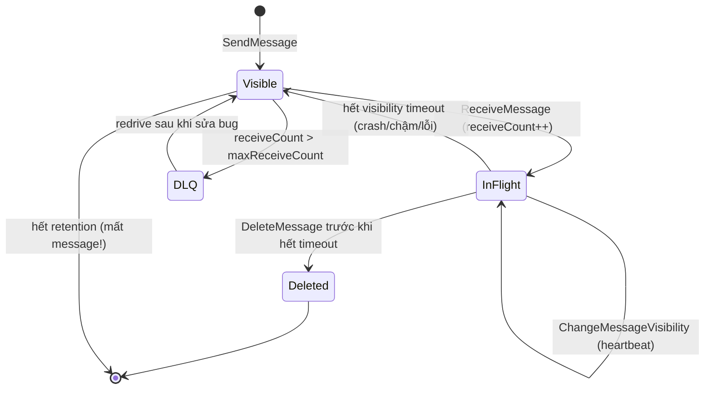
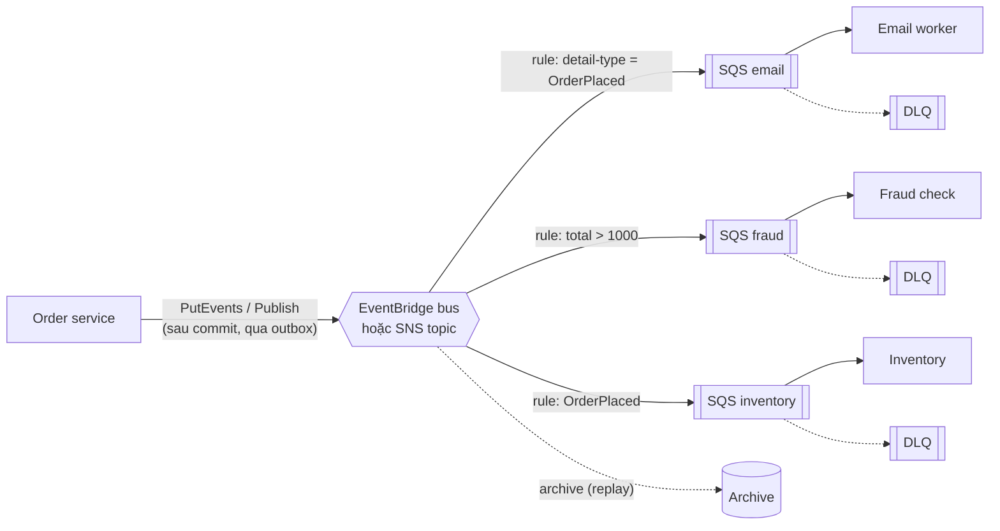

## Bối cảnh & vấn đề

Một worker Lambda đọc hàng đợi `payments` và gọi Stripe để charge khách hàng. Đa số ngày mọi thứ ổn; nhưng vào giờ cao điểm, support nhận phàn nàn "bị trừ tiền hai lần". Log cho thấy cùng một `paymentIntentId` được xử lý bởi hai invocation cách nhau 30 giây. Cấu hình: function timeout 60 s, queue visibility timeout 30 s, batch size 10, không có DLQ. Khi một message lỗi định dạng xuất hiện, cả batch được thử lại mãi và chín khoản đã charge được charge lại mỗi lần.

Đây không phải lỗi của SQS. SQS standard được thiết kế **at-least-once**: nó đảm bảo không mất message bằng cách sẵn sàng giao lại. Hệ thống đúng phải được xây **trên** giả định đó: visibility timeout đúng, xử lý lỗi theo từng message, DLQ cho poison message, và quan trọng nhất là consumer **idempotent**. Bài này đi qua cơ chế SQS, FIFO, cấu hình SQS → Lambda, chẩn đoán backlog, rồi so sánh SNS, EventBridge và Kafka (MSK). Lý thuyết messaging tổng quát (delivery semantics, outbox) ở [track Kafka](/tracks/messaging-kafka).

## Khái niệm

### SQS và visibility timeout

**SQS** là hàng đợi pull: producer `SendMessage`, consumer `ReceiveMessage` (nên dùng **long polling** `WaitTimeSeconds` tới 20 s để giảm request rỗng). Khi consumer nhận message, SQS **không xoá** nó mà **ẩn** nó khỏi các consumer khác trong khoảng **visibility timeout** (mặc định 30 s, tối đa 12 giờ). Consumer xử lý xong phải gọi `DeleteMessage` với receipt handle. Nếu hết visibility timeout mà chưa delete (consumer crash, xử lý chậm, quên delete), message **hiện lại** và được giao cho consumer khác: xử lý **lần nữa**.

Job dài hơn ước lượng thì gia hạn bằng **`ChangeMessageVisibility`** như một heartbeat (mỗi N giây đặt lại timeout), thay vì đặt visibility timeout rất lớn cho mọi message (crash thật thì message phải chờ rất lâu mới được thử lại). Message có retention tối đa 14 ngày (mặc định 4), kích thước tối đa **1 MiB** theo docs hiện tại (trước 2025 là 256 KB, nhiều tài liệu vẫn ghi 256 KB; verify), payload lớn hơn lưu S3 và gửi con trỏ.

**Interview angle:** câu định nghĩa visibility timeout nên kết thúc bằng hệ quả: "vì vậy consumer phải idempotent".

### Dead-letter queue và `maxReceiveCount`

Mỗi lần message được nhận, `ApproximateReceiveCount` tăng. **Redrive policy** trên queue nguồn chỉ định một **DLQ** và **`maxReceiveCount`**: vượt số lần nhận đó thì SQS chuyển message sang DLQ thay vì giao lại mãi. Không có DLQ, một **poison message** (dữ liệu hỏng, bug chỉ xảy ra với input đó) sẽ quay vòng tới hết retention, tốn tiền, và với Lambda batch còn kéo theo cả batch. Với Lambda event source, docs khuyến nghị `maxReceiveCount` **ít nhất 5** để throttle tạm thời không đẩy message tốt vào DLQ. Alarm trên `ApproximateNumberOfMessagesVisible` của DLQ, và có quy trình **redrive** (chuyển lại queue nguồn sau khi sửa bug).

**Interview angle:** follow-up "`maxReceiveCount` liên quan DLQ thế nào" — đó là ngưỡng chuyển; chọn nó cân bằng giữa chịu lỗi tạm thời và cô lập poison message nhanh.

### Standard vs FIFO

**Standard queue**: throughput gần như không giới hạn, **at-least-once**, thứ tự **best-effort** (có thể đảo). **FIFO queue** (tên kết thúc `.fifo`): giữ thứ tự **trong mỗi `MessageGroupId`**, **deduplication** trong cửa sổ **5 phút** theo `MessageDeduplicationId` (hoặc content-based: SHA-256 của body), và throughput có quota (300 thao tác/s mỗi API, 3.000 message/s khi batch 10; **high throughput mode** cao hơn nhiều, tuỳ region, verify).

Cái giá của FIFO: trong một group, message tiếp theo **không được giao** khi message trước còn đang in-flight (chưa delete hoặc chưa hết visibility timeout), nên một message kẹt **chặn cả group** (head-of-line blocking). Chọn group ID sai (một group cho tất cả) là mất toàn bộ parallelism; chọn đúng là theo thực thể cần thứ tự, ví dụ `orderId`. Và quan trọng: dedup của FIFO chỉ chống **producer gửi trùng** trong 5 phút; nó **không** chống consumer xử lý lại khi visibility timeout hết. AWS gọi FIFO là "exactly-once processing" nhưng consumer vẫn phải idempotent cho side effect bên ngoài (charge thẻ).

**Interview angle:** red flag là "chuyển sang FIFO là hết duplicate".

### SQS → Lambda: event source mapping

Với Lambda, bạn không tự poll: **event source mapping** (ESM) poll queue, gom **batch** (tới 10 message với FIFO, tới 10.000 với standard khi có batch window), invoke function, và **xoá** các message khi function trả thành công. Mặc định, function ném lỗi thì **cả batch** quay lại queue sau visibility timeout. Bật **`ReportBatchItemFailures`** và trả `{ batchItemFailures: [{ itemIdentifier: messageId }] }` để chỉ message lỗi quay lại.

Docs yêu cầu function timeout ≤ visibility timeout (ESM từ chối cấu hình ngược) và **khuyến nghị visibility timeout ít nhất 6 lần function timeout** (cộng batch window nếu có), để Lambda còn chỗ retry khi bị throttle. ESM scale số poller theo backlog: bắt đầu với 5 batch đồng thời, thêm tới khoảng 300 invocation mỗi phút, tối đa 1.250 invocation đồng thời ở chế độ mặc định (verify; có **provisioned mode** scale nhanh hơn). **Maximum concurrency** của ESM giới hạn số invocation mà queue đó tạo ra, mềm hơn reserved concurrency (không gây throttle-retry lặp).

**Interview angle:** câu debug "charge hai lần" có bốn ý theo thứ tự quan trọng: idempotency, visibility timeout vs function timeout, partial batch failure, DLQ.

### Idempotency

**Idempotent** nghĩa là xử lý cùng message nhiều lần cho cùng kết quả như một lần. Cần một **idempotency key** ổn định gắn với ý định nghiệp vụ (ví dụ `paymentIntentId`, không phải `messageId` vì producer retry có thể tạo message mới cho cùng ý định). Lưu key ở nơi có **ghi có điều kiện**: unique constraint trong Postgres (`INSERT ... ON CONFLICT DO NOTHING`), DynamoDB `ConditionExpression: attribute_not_exists(PK)`, và tốt nhất là **trong cùng transaction** với side effect nội bộ. Với side effect bên ngoài (Stripe), dùng luôn **idempotency key của provider** (`Idempotency-Key` header) để chính provider từ chối charge lặp.

**Interview angle:** follow-up "key là gì, lưu ở đâu" — key từ nghiệp vụ, lưu với ghi có điều kiện, và key của payment provider.

### SNS, EventBridge và Kafka

**SNS** là pub/sub **push**: publish một lần vào topic, SNS đẩy tới mọi **subscription** (SQS, Lambda, HTTP/S, email, SMS, Firehose). **Filter policy** trên subscription lọc theo message attribute hoặc body. Throughput rất cao, latency thấp; không lưu message (trừ FIFO topic có archive). Mẫu bền nhất là **SNS → nhiều SQS**: mỗi consumer có queue riêng, buffer, retry, DLQ độc lập.

**EventBridge** là **event bus** route theo **nội dung**: event có cấu trúc `source`, `detail-type`, `detail`; **rule** dùng event pattern (prefix, numeric range, exists, anything-but) để chọn target (Lambda, SQS, Step Functions, API destination HTTP, bus account khác). Có **archive & replay**, **schema registry**, tích hợp sẵn event của AWS service và SaaS, và **EventBridge Scheduler** (cron/one-time job). Đổi lại: quota throughput PutEvents theo region (cao nhưng hữu hạn, verify) và latency thường cao hơn SNS.

**Kinesis / MSK (Kafka)** là **log** có thứ tự theo partition, **retention dài** và **replay theo offset**, nhiều **consumer group** độc lập đọc cùng dữ liệu. Cần khi ordering + replay + throughput lớn quan trọng (event sourcing, CDC, analytics stream). **MSK provisioned** giữ nguyên semantics Kafka, bạn sizing broker/storage/partition và nâng version; **MSK Serverless** ít vận hành hơn nhưng có quota (throughput, số partition, retention) cần kiểm tra trước (verify).

**Interview angle:** "khi nào MSK thay vì SNS+SQS" — khi cần replay theo offset, nhiều consumer group, ordering theo key ở throughput cao, hoặc đã có code Kafka cần migrate ít rủi ro.

## Cơ chế hoạt động

Vòng đời một message trong SQS với redrive:



Mọi đường dẫn tới "xử lý lại" đều đi qua cạnh `InFlight → Visible`: consumer không xoá kịp. Visibility timeout ngắn hơn thời gian xử lý biến **mọi** message chậm thành duplicate. DLQ cắt vòng lặp vô hạn. Message hết retention mà chưa xử lý là **mất**, nên alarm trên tuổi message cũ nhất quan trọng hơn alarm trên độ dài queue.

Kiến trúc fan-out bền cho event `OrderPlaced`:



Publisher không biết ai tiêu thụ. Mỗi consumer có queue riêng nên một consumer chậm hay chết không ảnh hưởng consumer khác, có retry và DLQ riêng. Event nên được publish **sau commit**, tốt nhất qua **transactional outbox**, để không có event cho đơn hàng không tồn tại hoặc đơn hàng không có event.

## Ví dụ thực tế

Các output dưới đây chạy thật trên **ElasticMQ 1.7.1** (server tương thích API SQS) với `@aws-sdk/client-sqs` 3.1144 và **DynamoDB Local 3.3.1**, Node 24.21. ElasticMQ không phải SQS thật; logic visibility/redrive/FIFO của nó bám API SQS.

### Visibility timeout ngắn hơn thời gian xử lý → xử lý 3 lần → DLQ

```ts
const q = (await sqs.send(new CreateQueueCommand({ QueueName: "payments", Attributes: {
  VisibilityTimeout: "2",
  RedrivePolicy: JSON.stringify({ deadLetterTargetArn: dlqArn, maxReceiveCount: 3 }) } }))).QueueUrl!;
await sqs.send(new SendMessageCommand({ QueueUrl: q, MessageBody: JSON.stringify({ paymentIntentId: "pi_123", amount: 4900 }) }));
// worker receives, "charges", but takes longer than 2 s and never deletes in time
```

```text
## visibility timeout 2s, worker takes 3s, never deletes in time
0.1s received 7232d78f receiveCount=1 -> charge(pi_123)
2.2s received 7232d78f receiveCount=2 -> charge(pi_123)
4.3s received 7232d78f receiveCount=3 -> charge(pi_123)
11.5s nothing visible
11.5s DLQ has: [ '{"paymentIntentId":"pi_123","amount":4900}' ]
```

Cùng một message (cùng ID) được giao ba lần, mỗi lần "charge" lại, rồi vượt `maxReceiveCount` và vào DLQ. Không có idempotency, khách bị trừ ba lần. Đây là kịch bản thu nhỏ của config 30 s / 60 s trong câu hỏi.

### Heartbeat cho job dài

```ts
const m = (await sqs.send(new ReceiveMessageCommand({ QueueUrl: q, WaitTimeSeconds: 5 }))).Messages![0];
for (let i = 0; i < 3; i++) {
  await sleep(1500);
  await sqs.send(new ChangeMessageVisibilityCommand({ QueueUrl: q, ReceiptHandle: m.ReceiptHandle!, VisibilityTimeout: 2 }));
}
await sqs.send(new DeleteMessageCommand({ QueueUrl: q, ReceiptHandle: m.ReceiptHandle! }));
```

```text
## heartbeat with ChangeMessageVisibility
13.0s heartbeat 1: other consumer sees 0 message(s)
14.5s heartbeat 2: other consumer sees 0 message(s)
16.0s heartbeat 3: other consumer sees 0 message(s)
16.0s deleted after 4.5s of work, no duplicate
```

Job 4,5 s với visibility timeout 2 s không bị giao lại vì mỗi 1,5 s nó gia hạn. Nếu worker crash, heartbeat dừng và message hiện lại sau tối đa 2 s.

### FIFO: dedup và chặn theo group

```ts
for (const [g, ev, dedup] of [["order-1","created","o1-created"], ["order-2","created","o2-created"],
  ["order-1","paid","o1-paid"], ["order-1","paid","o1-paid"], ["order-1","shipped","o1-shipped"]])
  await sqs.send(new SendMessageCommand({ QueueUrl: f, MessageBody: `${g}:${ev}`, MessageGroupId: g, MessageDeduplicationId: dedup }));
```

```text
send order-1:created dedup=o1-created -> seq 0 id 7315263c
send order-2:created dedup=o2-created -> seq 1 id c02d8347
send order-1:paid dedup=o1-paid -> seq 2 id 14d54dd7
send order-1:paid dedup=o1-paid -> seq 2 id 14d54dd7
send order-1:shipped dedup=o1-shipped -> seq 4 id 61923f20
receive #1 (no delete): [
  'order-1:created',
  'order-1:paid',
  'order-1:shipped',
  'order-2:created'
]
receive #2 while #1 in flight: []
```

Lần gửi trùng `o1-paid` trả về **cùng message ID và sequence**: bị dedup, chỉ một bản vào queue. Thứ tự trong `order-1` được giữ. Khi batch đầu còn in-flight (chưa delete), lần nhận thứ hai không lấy được gì của các group đó: nếu `order-1:created` kẹt (worker treo), mọi event tiếp theo của `order-1` chờ theo. Với 1 triệu đơn mỗi ngày, `MessageGroupId = orderId` cho thứ tự theo đơn và parallelism theo số đơn đang hoạt động.

### Handler SQS → Lambda: partial batch response + idempotency

```ts
import type { SQSHandler, SQSBatchResponse } from "aws-lambda";

export const handler = async (event: Parameters<SQSHandler>[0]): Promise<SQSBatchResponse> => {
  const batchItemFailures: { itemIdentifier: string }[] = [];
  for (const r of event.Records) {
    try { await charge(JSON.parse(r.body)); }
    catch (err) { log.error({ err, messageId: r.messageId }); batchItemFailures.push({ itemIdentifier: r.messageId }); }
  }
  return { batchItemFailures };          // requires FunctionResponseTypes: [ReportBatchItemFailures]
};
```

Mô phỏng logic (chạy thật, Node 24): batch ba message, `m2` có amount âm (poison):

```text
## all-or-nothing handler (no idempotency): retried 3 times
   charge calls: 3 pi_1,pi_1,pi_1 -> pi_1 charged 3 times, pi_3 never
## partial batch response + idempotency
   m1: charged
   m2: FAILED invalid amount
   m3: charged
   returned {"batchItemFailures":[{"itemIdentifier":"m2"}]} -> only m2 goes back to the queue
   redelivery of m2 (receiveCount 2..3) keeps failing -> DLQ after maxReceiveCount
   redelivery of m1 by visibility-timeout race:
   m1: duplicate-skipped
   total real charges: 2
```

Handler all-or-nothing gặp poison ở giữa batch: `pi_1` bị charge mỗi lần retry, `pi_3` không bao giờ tới lượt. Bản partial batch chỉ trả `m2` về queue; khi `m1` bị giao lại do race visibility timeout, idempotency bỏ qua nó.

### Idempotency bằng ghi có điều kiện trên DynamoDB

Chạy thật trên DynamoDB Local 3.3.1:

```ts
await ddb.send(new TransactWriteCommand({ TransactItems: [
  { Put: { TableName: "shop", Item: { PK: `IDEMP#${paymentIntentId}`, SK: "CHARGE", status: "done" },
           ConditionExpression: "attribute_not_exists(PK)" } },
  { Put: { TableName: "shop", Item: { PK: `LEDGER#${paymentIntentId}`, SK: `ATTEMPT#${attempt}`, amount: 4900 } } },
] }));
```

```text
attempt 1: charged
attempt 2: TransactionCanceledException -> skip, already processed (ConditionalCheckFailed,None)
attempt 3: TransactionCanceledException -> skip, already processed (ConditionalCheckFailed,None)
ledger rows for pi_123: 1
```

Bản ghi idempotency và bút toán ledger được ghi **cùng transaction**: lần đầu thành công, các lần sau điều kiện thất bại và cả transaction bị huỷ, ledger chỉ có một dòng. Gọi Stripe thì gửi kèm `Idempotency-Key: pi_123` để chính Stripe trả lại kết quả lần đầu thay vì charge lại.

### Config đã sửa (SAM, minh hoạ)

```yaml
ChargeWorker:
  Type: AWS::Serverless::Function
  Properties:
    Timeout: 60
    ReservedConcurrentExecutions: 20            # protect Stripe rate limits and the DB
    Events:
      Queue:
        Type: SQS
        Properties:
          Queue: !GetAtt PaymentsQueue.Arn
          BatchSize: 10
          FunctionResponseTypes: [ReportBatchItemFailures]
          ScalingConfig: { MaximumConcurrency: 20 }
PaymentsQueue:
  Type: AWS::SQS::Queue
  Properties:
    VisibilityTimeout: 360                      # >= 6 x function timeout
    RedrivePolicy: { deadLetterTargetArn: !GetAtt PaymentsDLQ.Arn, maxReceiveCount: 5 }
```

### Chẩn đoán backlog tăng

Triệu chứng: `ApproximateAgeOfOldestMessage` tăng đều, Lambda có `Throttles`. Xem theo thứ tự: `Duration` tăng (downstream chậm → concurrency tăng → chạm reserved/max concurrency hoặc quota account); `Errors` tăng và cùng message ID lặp trong log (poison không có DLQ); `ConcurrentExecutions` dính trần. Sửa theo nguyên nhân: DLQ + partial batch cho poison; tối ưu handler hoặc batch lớn hơn + batching window khi overhead per-invoke lớn; **chỉ tăng concurrency khi downstream chịu được**; nếu downstream chết thì **ngắt mạch** (tạm tắt ESM, `aws lambda update-event-source-mapping --no-enabled`) thay vì đốt retry vào một DB đang ngã. Nâng concurrency khi DB là nút cổ chai chỉ biến backlog trong queue (an toàn, rẻ) thành quá tải trong DB (sự cố).

## Trade-offs & lựa chọn thay thế

| | SQS standard | SQS FIFO | SNS | EventBridge | Kinesis / MSK |
|---|---|---|---|---|---|
| Mô hình | Queue pull, 1 consumer/message | Queue có thứ tự theo group | Pub/sub push | Event bus route theo nội dung | Log partition, nhiều consumer group |
| Thứ tự | Best-effort | Theo `MessageGroupId` | Không (trừ FIFO topic) | Không | Theo partition/key |
| Dedup | Không | 5 phút | Không (trừ FIFO) | Không | Không (idempotent producer của Kafka chống trùng khi gửi) |
| Replay | Không | Không | Không | Archive & replay | Theo offset, retention dài |
| Throughput | Gần như vô hạn | Quota (high throughput mode cao hơn) | Rất cao | Quota PutEvents/region | Theo shard/partition |
| Hợp với | Work queue, buffer | Workflow theo thực thể cần thứ tự | Fan-out đơn giản | Event giữa domain, SaaS, schedule | Stream, CDC, analytics, Kafka sẵn có |

**SNS hay EventBridge cho `OrderPlaced`?** SNS khi cần fan-out đơn giản, throughput rất cao, latency thấp, filter đơn giản. EventBridge khi muốn route theo nội dung phong phú, nhiều target loại khác nhau, archive/replay, schema registry, cross-account bus, hoặc nhận event AWS/SaaS. Cả hai đều at-least-once; đặt SQS riêng trước mỗi consumer.

**MSK, MSK Serverless hay viết lại sang SNS/SQS/EventBridge** khi migrate một hệ đang dùng Kafka? Lift sang **MSK** (hoặc Confluent Cloud) trước thường ít rủi ro nhất: giữ partition, ordering theo key, consumer group, replay; code gần như không đổi. **MSK Serverless** nếu throughput/partition/retention nằm trong quota. Viết lại sang SNS/SQS/EventBridge làm **mất replay theo offset** (archive chỉ một phần), đổi mô hình ordering, phải viết lại producer/consumer và idempotency, tức migrate hai lần cùng lúc. Ổn định trên MSK rồi mới cân nhắc service nào đáng chuyển sang SQS. Chạy consumer cũ và mới song song mà không xử lý đôi: hai consumer group khác nhau nhưng side effect đi qua cùng idempotency store, hoặc chuyển dần theo partition/tenant với một cờ quyết định ai "sở hữu" side effect.

## Edge cases & failure modes

- **Lambda timeout < xử lý thực tế**: function bị kill, message không bị xoá, hiện lại sau visibility timeout, lặp tới DLQ; tăng timeout hoặc chia nhỏ việc.
- **Throttle của Lambda làm tăng receive count**: ESM nhận message rồi không invoke được; `maxReceiveCount` thấp đẩy message tốt vào DLQ. Docs khuyến nghị ≥ 5.
- **FIFO group kẹt**: một message lỗi lặp trong group chặn mọi message sau nó cho tới khi vào DLQ; DLQ của FIFO cũng phải là FIFO.
- **Message > 1 MiB** (giới hạn hiện tại, trước đây 256 KB): dùng S3 + con trỏ (extended client pattern); SNS/EventBridge có giới hạn payload riêng nhỏ hơn hoặc khác, kiểm tra khi fan-out (verify).
- **Retention hết**: message mất im lặng; alarm `ApproximateAgeOfOldestMessage` gần retention.
- **SNS → HTTP endpoint chết**: SNS retry theo delivery policy rồi bỏ; với SNS → SQS thì không có vấn đề này (SQS bền).
- **EventBridge rule bắt event do chính target phát** tạo vòng lặp; dùng `source` riêng và pattern chặt.
- **Ordering giả**: publish từ nhiều instance không có thứ tự toàn cục; chỉ có thứ tự trong group/partition.

## Pitfalls

- ❌ Visibility timeout < function timeout → ✅ ≥ 6× function timeout (+ batch window).
- ❌ Không có DLQ → ✅ redrive policy, `maxReceiveCount` ≥ 5 cho Lambda, alarm và quy trình redrive.
- ❌ Throw cả batch khi một message lỗi → ✅ `ReportBatchItemFailures` + `batchItemFailures`.
- ❌ "FIFO thì không có duplicate" → ✅ FIFO dedup phía gửi trong 5 phút; consumer vẫn idempotent.
- ❌ Dùng `messageId` làm idempotency key → ✅ key nghiệp vụ (`paymentIntentId`) + ghi có điều kiện + idempotency key của provider.
- ❌ Một `MessageGroupId` cho mọi message → ✅ group theo thực thể cần thứ tự (`orderId`).
- ❌ Tăng concurrency khi DB là nút cổ chai → ✅ giữ backlog trong queue, giới hạn concurrency, ngắt mạch khi downstream chết.
- ❌ Alarm chỉ trên độ dài queue → ✅ alarm trên tuổi message cũ nhất (thứ người dùng cảm nhận).
- ❌ Viết lại Kafka sang SQS cùng lúc với migrate lên AWS → ✅ lift sang MSK trước, tối ưu sau.

## Tóm tắt

- SQS standard là at-least-once: message bị ẩn trong visibility timeout, không delete kịp thì giao lại; consumer phải idempotent.
- `ChangeMessageVisibility` làm heartbeat cho job dài; DLQ với `maxReceiveCount` cô lập poison message.
- FIFO: thứ tự trong `MessageGroupId`, dedup phía gửi 5 phút, head-of-line blocking trong group; không thay idempotency.
- SQS → Lambda: visibility ≥ 6× timeout, partial batch response, DLQ, max concurrency/reserved concurrency để bảo vệ downstream.
- Idempotency: key nghiệp vụ, ghi có điều kiện cùng transaction, idempotency key của payment provider.
- SNS = fan-out push; EventBridge = route theo nội dung, archive/replay, scheduler; đặt SQS riêng trước mỗi consumer.
- Kafka/MSK khi cần replay theo offset, consumer group, ordering theo key; migrate bằng lift sang MSK trước.
