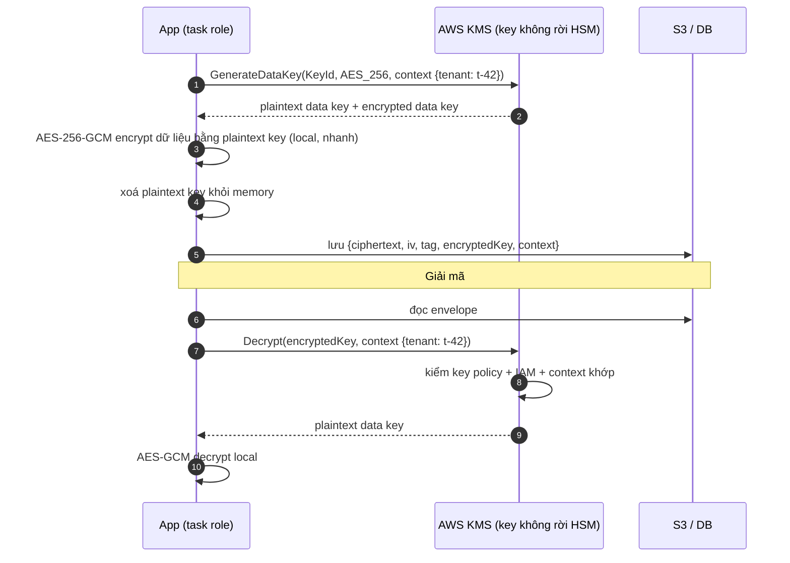
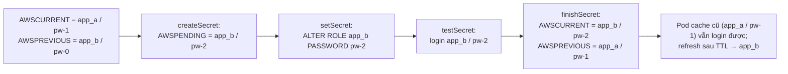

## Bối cảnh & vấn đề

Một platform 15 service, ba môi trường. Secret nằm rải rác: `.env` trong repo private, biến môi trường đặt tay trong console ECS, vài cái trong Parameter Store không mã hoá. Đợt audit yêu cầu xoay vòng (rotate) mật khẩu DB 90 ngày một lần; lần rotate đầu tiên làm API lỗi xác thực 20 phút vì các pod vẫn giữ mật khẩu cũ. Cùng lúc, một Lambda báo `AccessDeniedException` khi `kms:Decrypt` dù role có `kms:*`, và team storefront hỏi có nên dùng Cognito cho đăng nhập của khách hàng các tenant doanh nghiệp không.

Ba chủ đề này gắn với nhau: **nơi giữ secret** (Secrets Manager, Parameter Store), **cách mã hoá** (KMS, envelope encryption, key policy) và **danh tính người dùng cuối** (Cognito, JWT). Bài này giải thích từng cái, chạy thật rotation và envelope encryption trên môi trường local, rồi ghép thành thiết kế secret/config cho nhiều service và môi trường. Danh tính của workload (role, STS) ở [bài 1](/tracks/aws/learn/iam-identities-roles); OAuth/OIDC sâu hơn ở [track auth](/tracks/auth-identity).

## Khái niệm

### Secrets Manager

**AWS Secrets Manager** lưu secret (chuỗi hoặc JSON), mã hoá bằng KMS, kiểm soát bằng IAM + resource policy, ghi CloudTrail mỗi lần đọc. Điểm khác biệt chính là **rotation tự động**: một Lambda rotation chạy theo lịch qua bốn bước `createSecret` (sinh secret mới, gắn nhãn `AWSPENDING`), `setSecret` (đặt nó vào DB/dịch vụ), `testSecret` (thử đăng nhập), `finishSecret` (chuyển `AWSCURRENT` sang version mới, version cũ thành `AWSPREVIOUS`). AWS có template rotation cho RDS/Aurora/Redshift/DocumentDB, và RDS còn có **managed master password** (RDS tự quản secret của master user trong Secrets Manager).

Thêm: resource policy cho **cross-account**, **replicate** secret sang region khác (DR), và giá **theo secret mỗi tháng + theo 10.000 API call** (khoảng 0,40 USD/secret/tháng, verify).

**Interview angle:** nói được bốn bước rotation và nhãn `AWSCURRENT`/`AWSPREVIOUS` cho thấy bạn hiểu vì sao rotation có thể không gây downtime.

### Parameter Store và AppConfig

**SSM Parameter Store** lưu tham số phân cấp (`/prod/orders-api/db_host`), kiểu `String`, `StringList` hoặc `SecureString` (mã hoá KMS). **Standard tier** miễn phí, giá trị tối đa 4 KB; **advanced tier** 8 KB, có policy hết hạn, tính phí (verify). Không có rotation tích hợp. `GetParametersByPath` đọc cả một nhánh, hợp cho config theo service.

**AppConfig** dành cho **feature flag và config động**: rollout dần theo phần trăm, validator (JSON schema/Lambda) trước khi áp dụng, tự rollback khi CloudWatch alarm kêu. Dùng cho thứ đổi thường xuyên và có thể gây sự cố (bật tính năng, giới hạn rate).

Thực tế phổ biến: **DB credential và API key bên thứ ba** → Secrets Manager; **config không nhạy cảm** (URL, tên bucket) → Parameter Store `String`; **feature flag** → AppConfig; secret đơn giản ít đổi với ngân sách chặt → Parameter Store `SecureString`.

**Interview angle:** câu chọn chỗ lưu nên nêu ba tiêu chí: có cần rotation, có cần cross-account/replication, và chi phí theo số secret × số service.

### Rotation không downtime: single user vs alternating users

**Single-user rotation** đổi mật khẩu của **cùng một user DB**. Giữa lúc `setSecret` đổi mật khẩu trên DB và lúc mọi client đọc lại secret, client đang cache mật khẩu cũ sẽ mở kết nối mới thất bại. Kết nối đã mở vẫn sống (Postgres không kiểm lại mật khẩu), nên lỗi lộ ra khi pool mở kết nối mới hoặc pod mới khởi động.

**Alternating-users rotation** có hai user (`app_a`, `app_b`) cùng quyền; mỗi lần rotate đặt mật khẩu mới cho user **đang không dùng** rồi chuyển `AWSCURRENT` sang nó. Client cache bản cũ vẫn đăng nhập được bằng user cũ (mật khẩu của nó không đổi trong lần rotate này) cho tới khi refresh. Lần rotate sau quay lại user kia. Kết hợp với client **cache secret có TTL** (vài phút) và **refresh khi gặp lỗi xác thực**, rotation hoàn toàn trong suốt.

**Interview angle:** follow-up "app nhận mật khẩu đã rotate mà không restart và không có làn sóng lỗi" — alternating users + cache TTL + refresh-on-auth-failure.

### KMS và key policy

**AWS KMS** quản lý **KMS key** (trước gọi là CMK): key material được tạo và dùng trong HSM, không bao giờ rời KMS dưới dạng plaintext. Mọi thao tác (`Encrypt`, `Decrypt`, `GenerateDataKey`, `Sign`) là API call có kiểm IAM và log CloudTrail. Ba loại: **AWS owned** (vô hình với bạn), **AWS managed** (`aws/s3`, policy cố định), **customer managed** (bạn sở hữu policy, rotation, xoá có thời gian chờ 7–30 ngày).

**Key policy** là resource policy **bắt buộc** của mọi KMS key và là "cửa chính": IAM policy chỉ có hiệu lực với key nếu key policy **cho phép account dùng IAM** (statement mặc định `"Principal": {"AWS": "arn:aws:iam::111122223333:root"}`, `kms:*`). Nếu key policy không có statement đó và không nêu role của bạn, thì `kms:*` trong identity policy của Lambda vô dụng: đó là đáp án của câu `AccessDeniedException`. Kiểm thêm: grant, SCP/RCP chặn, **encryption context** không khớp, key ở region khác, key bị disable/pending deletion, và với cross-account thì cả hai phía.

**Interview angle:** "role có `kms:*` mà vẫn deny" — kiểm key policy trước tiên.

### Envelope encryption

`Encrypt` trực tiếp chỉ nhận tối đa **4 KB** plaintext và mỗi lần là một network call. Với dữ liệu lớn dùng **envelope encryption**: gọi `GenerateDataKey` nhận về **data key** dưới hai dạng, plaintext và bản đã mã hoá bởi KMS key; mã hoá dữ liệu **local** bằng plaintext data key (AES-256-GCM); **xoá** plaintext data key khỏi memory; lưu bản mã hoá của data key **cạnh** ciphertext. Giải mã: `Decrypt` bản mã hoá của data key (một call KMS) rồi giải dữ liệu local. S3 SSE-KMS, EBS, RDS đều làm vậy bên dưới.

**Encryption context** là cặp key-value không bí mật được ràng buộc vào ciphertext (dùng như AAD): giải mã phải đưa đúng context, nếu không KMS từ chối. Nó vừa chống "đem ciphertext của tenant A đi giải với danh nghĩa tenant B", vừa xuất hiện trong CloudTrail để audit, vừa dùng được trong condition của key policy (`kms:EncryptionContext:tenant`).

**Interview angle:** giải thích vì sao envelope encryption tồn tại (giới hạn 4 KB, latency, chi phí API, key không rời HSM) quan trọng hơn thuộc tên API.

### Cognito: user pool và identity pool

**Cognito user pool** là directory + authentication: đăng ký, đăng nhập, MFA, quên mật khẩu, **managed login/hosted UI**, federation với Google/Apple/SAML/OIDC; sau khi xác thực cấp **ID token**, **access token** (JWT, mặc định sống 1 giờ) và **refresh token** theo chuẩn OIDC. **Identity pool** (federated identities) làm việc khác: đổi một identity (từ user pool hoặc IdP khác, hoặc khách vãng lai) lấy **temporary AWS credentials** qua STS, để client gọi thẳng AWS (upload S3, IoT, Location).

Cho B2B2C multi-tenant: mỗi doanh nghiệp có thể muốn **federation** riêng (SAML/OIDC của họ); `tenant_id` cần nằm trong token (custom attribute, hoặc **pre-token-generation Lambda** thêm claim vào access token); và phải cân nhắc giới hạn tuỳ biến UI, quota API, khả năng migrate (password hash không export được; migrate dần bằng **user migration Lambda trigger**), lock-in. So sánh với Auth0/Okta CIC, Keycloak tự host, hoặc IdP nội bộ.

API verify JWT của Cognito: chữ ký qua **JWKS** (`https://cognito-idp.<region>.amazonaws.com/<poolId>/.well-known/jwks.json`), `iss` đúng pool, `exp`, **`token_use`** (`access` cho API, không nhận ID token), và **`client_id`** (access token) hoặc `aud` (ID token) thuộc danh sách app client được phép.

**Interview angle:** follow-up "mang tenant id trong token và ép ở API" — claim từ pre-token-generation, API lấy tenant **từ token đã verify**, không từ header/body, và đối chiếu với tài nguyên được truy cập.

## Cơ chế hoạt động

Envelope encryption, mã hoá và giải mã:



Mỗi object chỉ tốn **một** call KMS mỗi chiều, bất kể kích thước dữ liệu; dữ liệu không bao giờ đi qua KMS. Quyền giải mã được kiểm ở bước `Decrypt`: ai đọc được ciphertext trên S3 nhưng không có quyền KMS (hoặc sai context) thì vẫn không đọc được dữ liệu. Đây là lý do "mã hoá bằng KMS" thêm một lớp kiểm soát truy cập độc lập với quyền S3.

Rotation alternating users:



Không có thời điểm nào mà secret đang được client dùng bị vô hiệu hoá: user cũ giữ nguyên mật khẩu trong suốt vòng rotate này và chỉ bị đổi ở vòng **sau**, khi mọi client đã refresh từ lâu.

## Ví dụ thực tế

### Rotation: single user vs alternating users

Chạy thật: **LocalStack 4.0.3** (Secrets Manager) + Postgres 17 (Docker) + `pg` 8.23.1. App "cache" secret lúc khởi động; ta mô phỏng bước `setSecret` + `PutSecretValue`, rồi thử đăng nhập bằng bản cache:

```ts
const cached = JSON.parse((await sm.send(new GetSecretValueCommand({ SecretId: name }))).SecretString!);
if (mode === "single-user") { next = { username: "app_a", password: "pw-2" }; await admin.query("ALTER ROLE app_a PASSWORD 'pw-2'"); }
else                        { next = { username: "app_b", password: "pw-2" }; await admin.query("ALTER ROLE app_b PASSWORD 'pw-2'"); }
await sm.send(new PutSecretValueCommand({ SecretId: name, SecretString: JSON.stringify(next) }));   // new AWSCURRENT
console.log("pod with cached secret:", cached.username, "->", await login(cached));
```

```text
## single-user rotation
  pod with cached secret (not refreshed yet): app_a -> password authentication failed for user "app_a"
  AWSPREVIOUS: app_a | AWSCURRENT: app_a -> refreshed pod login: ok
## alternating-users rotation
  pod with cached secret (not refreshed yet): app_a -> ok
  AWSPREVIOUS: app_a | AWSCURRENT: app_b -> refreshed pod login: ok
```

Single-user: mọi pod chưa refresh sẽ lỗi xác thực ngay khi mở kết nối mới, đúng "20 phút lỗi" trong câu chuyện. Alternating: pod cũ vẫn đăng nhập được, pod đã refresh dùng user mới. `PutSecretValue` tự đẩy version cũ sang `AWSPREVIOUS`.

Client cache với refresh-on-auth-failure:

```ts
let cache: { v: DbSecret; at: number } | undefined;
async function getDbSecret(force = false): Promise<DbSecret> {
  if (!force && cache && Date.now() - cache.at < 5 * 60_000) return cache.v;   // 5 min TTL
  const r = await sm.send(new GetSecretValueCommand({ SecretId: process.env.DB_SECRET_ID }));
  cache = { v: JSON.parse(r.SecretString!), at: Date.now() };
  return cache.v;
}
async function connect() {
  try { return await open(await getDbSecret()); }
  catch (e: any) {
    if (e.code === "28P01") return open(await getDbSecret(true));             // invalid_password -> refetch once
    throw e;
  }
}
```

### Envelope encryption với encryption context

Chạy thật trên LocalStack 4.0.3 (KMS) với `@aws-sdk/client-kms` 3.1144 và `node:crypto`:

```ts
const dk = await kms.send(new GenerateDataKeyCommand({ KeyId, KeySpec: "AES_256", EncryptionContext: { tenant: "t-42" } }));
const iv = randomBytes(12);
const c = createCipheriv("aes-256-gcm", dk.Plaintext!, iv);
const ciphertext = Buffer.concat([c.update(report), c.final()]);
const envelope = { encryptedKey: Buffer.from(dk.CiphertextBlob!).toString("base64"), iv, tag: c.getAuthTag(), ciphertext };
dk.Plaintext!.fill(0);                                   // drop the plaintext data key
// later
const { Plaintext } = await kms.send(new DecryptCommand({ CiphertextBlob: encryptedKey, EncryptionContext: { tenant: "t-42" } }));
```

```text
Encrypt 5000 B directly -> ValidationException | 1 validation error detected: Value at 'plaintext' failed to satisfy constraint: Member mus
data 1080000 B -> ciphertext 1080000 B, wrapped data key 116 B, KMS calls: 1
Decrypt with context {"tenant":"t-42"} -> ok, equal=true
Decrypt with context {"tenant":"t-99"} -> InvalidCiphertextException
```

`Encrypt` trực tiếp 5.000 byte bị từ chối (giới hạn 4.096 byte). Envelope mã hoá ~1 MB với một call KMS, data key đã bọc chỉ 116 byte. Giải mã với context sai tenant bị từ chối: dữ liệu tenant t-42 không thể được giải "nhân danh" t-99 dù ai đó copy ciphertext. Trong production dùng **AWS Encryption SDK** thay vì tự ghép (nó lo định dạng envelope, cache data key, nhiều key).

### Key policy tối thiểu cho một service (minh hoạ)

```json
{
  "Version": "2012-10-17",
  "Statement": [
    { "Sid": "EnableIAMPolicies", "Effect": "Allow",
      "Principal": { "AWS": "arn:aws:iam::111122223333:root" }, "Action": "kms:*", "Resource": "*" },
    { "Sid": "OrdersApiUseKeyForItsTenantData", "Effect": "Allow",
      "Principal": { "AWS": "arn:aws:iam::111122223333:role/orders-api-task" },
      "Action": ["kms:Decrypt", "kms:GenerateDataKey"], "Resource": "*",
      "Condition": { "StringEquals": { "kms:ViaService": "s3.ap-southeast-1.amazonaws.com" } } }
  ]
}
```

Statement đầu "bật" IAM policy cho key (không có nó, chỉ principal nêu trong key policy mới dùng được key, và bạn có thể tự khoá mình ra ngoài). Statement thứ hai cấp trực tiếp cho task role và chỉ khi gọi **thông qua S3** (`kms:ViaService`).

### Verify JWT kiểu Cognito

Chạy thật với `jose` 6.2.12: tạo cặp khoá RS256 và JWKS local (đóng vai Cognito), ký các token khác nhau, rồi chạy hàm verify của API:

```ts
async function verifyAccessToken(token: string) {
  const { payload } = await jwtVerify(token, JWKS, { issuer: ISS, algorithms: ["RS256"] });   // signature, iss, exp
  if (payload.token_use !== "access") throw new Error(`token_use=${payload.token_use}, expected access`);
  if (payload.client_id !== CLIENT_ID) throw new Error(`client_id=${payload.client_id} not allowed`);
  const tenant = payload["custom:tenant_id"] ?? payload["tenant_id"];
  if (!tenant) throw new Error("missing tenant claim");
  return { sub: payload.sub, tenant };
}
// prod: const JWKS = createRemoteJWKSet(new URL(`${ISS}/.well-known/jwks.json`));
```

```text
valid access token               -> OK {"sub":"u-1","tenant":"t-42"}
ID token sent as access token    -> REJECT  token_use=id, expected access
token from another app client    -> REJECT  client_id=evil-client not allowed
token from another user pool     -> REJECT ERR_JWT_CLAIM_VALIDATION_FAILED unexpected "iss" claim value
expired token                    -> REJECT ERR_JWT_EXPIRED "exp" claim timestamp check failed
```

Bốn loại token sai đều bị chặn, mỗi cái bởi một kiểm tra khác nhau. Thiếu kiểm `token_use` là lỗi thường gặp: ID token (dành cho client hiển thị thông tin user) bị dùng để gọi API. Thiếu kiểm `client_id` thì token của một app khác trong cùng pool cũng gọi được API. Thư viện `aws-jwt-verify` của AWS gói sẵn các kiểm tra này.

### Thiết kế secret/config cho 15 service × 3 môi trường

- **Tách account theo môi trường** (dev/staging/prod, [bài 2](/tracks/aws/learn/policy-evaluation-governance)): secret prod nằm trong account prod, dev không bao giờ đọc được.
- **Đặt tên theo phân cấp** `/<env>/<service>/<name>` (Parameter Store) và `prod/orders-api/db` (Secrets Manager); task role của mỗi service chỉ đọc đúng prefix của nó:

```json
{ "Effect": "Allow", "Action": ["secretsmanager:GetSecretValue"],
  "Resource": "arn:aws:secretsmanager:ap-southeast-1:111122223333:secret:prod/orders-api/*" }
```

- **KMS key riêng theo môi trường** (hoặc theo domain nhạy cảm), key policy giới hạn role.
- **Inject**: ECS `secrets` (execution role đọc lúc start, đơn giản, cần restart để nhận rotation) hoặc **app fetch runtime + cache TTL** (task role đọc, nhận rotation không restart). Không log secret, không bake vào image, không truyền qua build arg.
- **Rotation**: alternating users cho DB; alarm khi rotation Lambda lỗi. API key bên thứ ba không hỗ trợ "hai key cùng hiệu lực": rotate trong cửa sổ bảo trì ngắn, deploy secret mới trước rồi revoke cũ ngay, hoặc bọc bằng proxy nội bộ giữ key ở một nơi.
- **Local dev**: secret dev riêng (hoặc LocalStack), không bao giờ copy secret prod về máy.
- **Phát hiện lộ**: secret scanning + push protection trên repo; CloudTrail cho `GetSecretValue` bất thường.

## Trade-offs & lựa chọn thay thế

| | Secrets Manager | Parameter Store (SecureString) | AppConfig | Biến môi trường trong task def |
|---|---|---|---|---|
| Rotation | Có (Lambda, template RDS) | Không | Không (không phải secret store) | Không |
| Cross-account / replicate | Có | Hạn chế | Có (deploy) | Không |
| Kích thước | 64 KB (verify) | 4 KB standard / 8 KB advanced | Lớn hơn | 4 KB tổng (Lambda) |
| Giá | Theo secret + API call | Standard miễn phí | Theo request/config | Miễn phí |
| Hợp với | DB credential, API key | Config + secret ít đổi | Feature flag, config động có rollback | Config không nhạy cảm |

| Cognito user pool | Auth0 / Okta CIC | Keycloak tự host |
|---|---|---|
| Rẻ ở quy mô lớn, tích hợp AWS (ALB, API Gateway, identity pool) | Tuỳ biến cao, nhiều tính năng B2B (organizations), hỗ trợ tốt | Toàn quyền, không lock-in |
| Tuỳ biến UI/luồng hạn chế hơn, migrate khó | Đắt theo MAU | Bạn vận hành, vá bảo mật, HA |

Chọn: Cognito hợp B2C quy mô lớn trên AWS với nhu cầu chuẩn; B2B2C với nhiều doanh nghiệp cần SSO riêng và tổ chức phức tạp thì so sánh kỹ với IdP chuyên dụng; tự host khi có yêu cầu chủ quyền dữ liệu và đội vận hành.

## Edge cases & failure modes

- **Rotation Lambda trong VPC không gọi được Secrets Manager** (không NAT/endpoint) → rotation treo ở `AWSPENDING`; cần interface endpoint hoặc NAT.
- **Throttle API**: mỗi request gọi `GetSecretValue` thì đụng quota và tốn tiền; luôn cache (AWS có caching client cho Secrets Manager và Lambda extension).
- **KMS throttle**: mỗi object SSE-KMS là một call KMS; workload đọc S3 cực lớn có thể chạm quota request KMS; bật **S3 Bucket Key** để giảm call.
- **Xoá KMS key** làm mọi dữ liệu mã hoá bằng nó không thể khôi phục; KMS bắt buộc thời gian chờ 7–30 ngày, alarm trên `ScheduleKeyDeletion`.
- **Key policy tự khoá**: bỏ statement root và không ai còn quyền quản key; phải mở case với AWS support.
- **JWKS rotation**: Cognito đổi khoá ký; client cache JWKS vĩnh viễn sẽ lỗi; dùng thư viện tự refresh khi gặp `kid` lạ.
- **Access token không thu hồi được tức thì** (JWT tự chứa): revoke refresh token, giữ access token ngắn, kiểm `jti`/trạng thái user cho thao tác nhạy cảm.
- **ECS `secrets` inject lúc start**: rotate secret mà không restart task thì task giữ giá trị cũ mãi.

## Pitfalls

- ❌ Secret trong `.env` của repo hoặc image → ✅ Secrets Manager/Parameter Store, đọc bằng role.
- ❌ Single-user rotation cho DB đang có nhiều client cache → ✅ alternating users + cache TTL + refresh khi lỗi xác thực.
- ❌ Gọi `GetSecretValue` mỗi request → ✅ cache trong memory, refresh định kỳ.
- ❌ Role có `kms:*` nên nghĩ là đủ → ✅ key policy phải cho phép (statement root hoặc nêu role), kiểm encryption context và grant.
- ❌ `Encrypt` trực tiếp cho file lớn → ✅ envelope encryption (`GenerateDataKey`), hoặc AWS Encryption SDK.
- ❌ API chấp nhận ID token → ✅ kiểm `token_use = access`, `client_id`, `iss`, `exp`, chữ ký JWKS.
- ❌ Lấy tenant từ header `X-Tenant-Id` → ✅ từ claim của token đã verify, đối chiếu với tài nguyên.
- ❌ Dùng chung một KMS key và một secret cho mọi môi trường → ✅ tách theo account/môi trường, least privilege theo prefix.

## Tóm tắt

- Secrets Manager: secret có rotation 4 bước (`AWSPENDING` → `AWSCURRENT`, bản cũ `AWSPREVIOUS`), cross-account, replicate; tính theo secret.
- Parameter Store cho config (và secret đơn giản), standard miễn phí; AppConfig cho feature flag có rollout/rollback.
- Rotation không downtime: alternating users, client cache có TTL và refresh khi lỗi xác thực.
- KMS: key không rời HSM; key policy là cửa chính, IAM chỉ có hiệu lực khi key policy cho phép.
- Envelope encryption: `GenerateDataKey`, mã hoá local, lưu data key đã bọc; encryption context ràng buộc ciphertext với tenant/ngữ cảnh.
- Cognito user pool cấp JWT; identity pool đổi identity lấy AWS credentials; API kiểm chữ ký, `iss`, `exp`, `token_use`, `client_id`.
- Thiết kế cho nhiều service/môi trường: account theo env, tên phân cấp, role đọc đúng prefix, KMS theo env, không log/bake secret.
