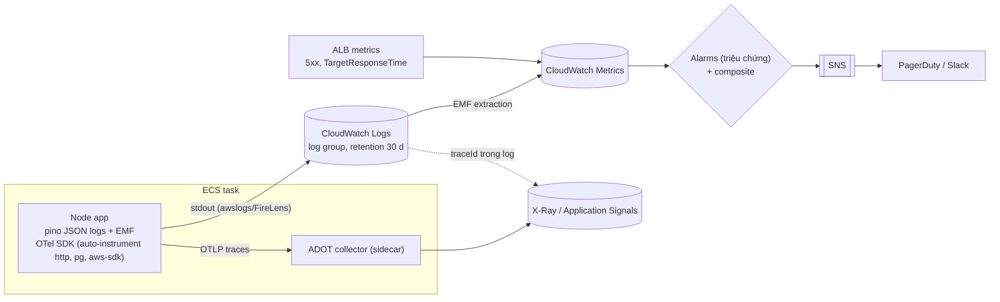
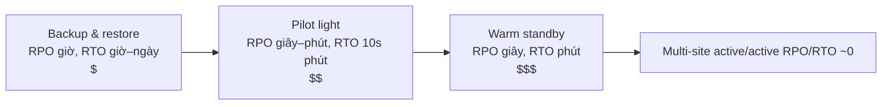

## Bối cảnh & vấn đề

Đêm thứ sáu, API đơn hàng trả 5xx cho 8% request. Alarm duy nhất là "CPU > 80%", và nó không kêu vì CPU chỉ 30%: service đang **chờ** một DB chậm. Kỹ sư on-call mở CloudWatch Logs và thấy hàng triệu dòng text không cấu trúc, không có request ID, không nối được sang trace. Sáng hôm sau, CTO hỏi: "nếu cả region Singapore sập thì mình mất bao lâu để chạy lại, và mất bao nhiêu dữ liệu?" Không ai trả lời được, vì chưa ai từng diễn tập.

Bài này gom ba thứ mà interviewer dùng để đo độ "production" của ứng viên: **observability** (biết hệ thống đang làm gì: logs, metrics, traces, alarm theo triệu chứng), **DNS và failover** (Route 53 routing policy, health check, TTL), và **disaster recovery** (RTO/RPO, bốn chiến lược, diễn tập). Cuối bài là cách dùng **Well-Architected Framework** để review một workload có thật. Observability tổng quát (SLO, RED/USE, OTel) ở [track observability](/tracks/observability).

## Khái niệm

### CloudWatch Logs và Logs Insights

Container trên ECS ghi ra **stdout/stderr**; log driver **awslogs** (hoặc **FireLens** với Fluent Bit để định tuyến tới nhiều đích) đẩy vào **log group** (`/ecs/orders-api`), mỗi task một **log stream**. **Logs Insights** truy vấn log bằng ngôn ngữ riêng; với log **JSON có cấu trúc** nó tự tách field, nên `filter level = "error" | stats count() by route` chạy được ngay. Chi phí chính là **ingestion** (theo GB, khoảng 0,50 USD/GB ở us-east-1, verify) và **retention**; log group mặc định giữ **vĩnh viễn**, nên luôn đặt retention.

Mỗi dòng log nên có: `timestamp`, `level`, `msg`, `service`, `requestId`, **`traceId`**, `tenantId` (nếu multi-tenant), `route`, `status`, `durationMs`. `traceId` là sợi chỉ nối log với trace.

**Interview angle:** log debug bật ở prod là một trong những thủ phạm hoá đơn tăng gấp đôi ([bài 12](/tracks/aws/learn/cost-reference-architecture)).

### Metrics, Embedded Metric Format và cardinality

**CloudWatch Metrics** có metric sẵn của service (ECS `CPUUtilization`/`MemoryUtilization` theo service, ALB `TargetResponseTime`, `HTTPCode_Target_5XX_Count`, `RequestCountPerTarget`, SQS `ApproximateAgeOfOldestMessage`, RDS `DatabaseConnections`). **Container Insights** thêm metric ở mức task/container. **Custom metric** gửi bằng `PutMetricData` (một API call, có thể block hoặc throttle), hoặc tốt hơn bằng **Embedded Metric Format (EMF)**: ghi một dòng log JSON có khối `_aws.CloudWatchMetrics`, CloudWatch tự trích metric từ log, không cần gọi API.

Mỗi tổ hợp giá trị **dimension** là **một metric riêng** và tính tiền riêng (theo bậc, khoảng 0,30 USD/metric/tháng cho 10.000 metric đầu, verify). Dimension có **cardinality cao** (`userId`, `orderId`, `requestId`) biến vài trăm metric thành hàng triệu. Thông tin cardinality cao đặt vào **thuộc tính log** (truy vấn bằng Logs Insights) hoặc trace, không đặt vào dimension.

**Interview angle:** follow-up "custom metric có dimension `userId` sao lại tệ" — chi phí theo số tổ hợp và metric vô dụng cho alarm; đáp án trong ví dụ chạy thật bên dưới.

### Alarms theo triệu chứng

**Alarm** theo dõi một metric qua ngưỡng trong N chu kỳ, chuyển trạng thái `OK/ALARM/INSUFFICIENT_DATA` và gửi tới **SNS** (rồi PagerDuty/Slack/Chatbot). Nguyên tắc: alarm theo **triệu chứng người dùng thấy** (tỉ lệ 5xx, latency p99, tuổi message cũ nhất, tỉ lệ checkout thất bại) để page người; alarm theo **nguyên nhân** (CPU, memory, connection) để chẩn đoán, thường không page. **Composite alarm** kết hợp nhiều alarm bằng AND/OR để giảm nhiễu (chỉ page khi 5xx cao **và** traffic không phải gần 0). **Metric math** tính tỉ lệ (`5xx / requests`) thay vì số tuyệt đối. Xử lý `missing data` có chủ đích (không có request lúc 3 giờ sáng không phải là "healthy").

**Interview angle:** câu chuyện "CPU 30% nhưng 8% lỗi" là lý do alarm phải theo triệu chứng.

### Tracing: X-Ray và OpenTelemetry

**Distributed tracing** ghi lại đường đi của một request qua nhiều service dưới dạng **trace** gồm các **span** (ALB → API → DB → SQS → worker), cho biết thời gian ở từng chặng. **AWS X-Ray** là backend tracing của AWS; hướng hiện tại là instrument bằng **OpenTelemetry** (chuẩn mở, vendor-neutral) qua **AWS Distro for OpenTelemetry (ADOT)** (SDK + collector chạy sidecar trên ECS), gửi trace tới X-Ray/CloudWatch, và xem qua **Application Signals** / trace map. AWS đã thông báo X-Ray SDK/daemon vào giai đoạn bảo trì, khuyến nghị chuyển sang OTel (verify thời hạn).

**Interview angle:** nói "instrument bằng OTel để không lock-in, backend có thể là X-Ray hoặc vendor khác" là câu trả lời hiện đại.

### Route 53: record, alias và routing policy

**Route 53** là DNS managed. **Alias record** là mở rộng của AWS trỏ tới tài nguyên AWS (ALB, CloudFront, S3 website, API Gateway): dùng được ở **zone apex** (`shop.com`, nơi CNAME không được phép), không tính phí query, và tự theo IP thay đổi của đích. Các **routing policy**: **simple**; **weighted** (chia phần trăm, ví dụ 90/10 để migrate hoặc canary ở tầng DNS); **latency-based** (trả record của region có latency thấp nhất tới resolver của user); **failover** (primary/secondary gắn **health check**, cho DR active-passive); **geolocation** (theo quốc gia/châu lục, cho compliance/nội dung); **geoproximity**; **multivalue answer** (nhiều IP có health check); **IP-based** (theo dải IP của resolver).

**Health check** của Route 53 gọi endpoint từ nhiều location trên thế giới; record failover chỉ chuyển khi health check báo unhealthy đủ số lần.

**Interview angle:** ba tình huống trong câu hỏi map thẳng: DR → failover; migrate dần → weighted; latency thấp nhất → latency-based.

### TTL và vì sao failover DNS chậm hơn trên giấy

DNS bị **cache theo TTL** ở resolver của ISP, OS, trình duyệt, runtime. Failover qua DNS tốn: thời gian health check phát hiện (interval × failure threshold, ví dụ 30 s × 3 = 90 s), cộng **TTL** (60 s), cộng resolver **không tôn trọng TTL** (một số giữ lâu hơn), cộng client giữ **kết nối đã mở** tới IP cũ (DNS chỉ ảnh hưởng kết nối mới). Một failover "60 giây" trên giấy có thể thành 5–10 phút với một phần người dùng.

Cải thiện: hạ TTL **trước** khi migrate (TTL thấp chỉ có hiệu lực sau khi TTL cũ hết hạn), health check interval 10 s, client đóng kết nối định kỳ; với yêu cầu chặt, dùng **Global Accelerator** (IP anycast tĩnh, chuyển region ở tầng mạng trong vài chục giây, không phụ thuộc DNS cache) hoặc **Application Recovery Controller** (routing control có quy trình, readiness check).

**Interview angle:** follow-up "vì sao DNS failover chậm hơn trên giấy" — liệt kê đủ bốn nguồn trễ là đủ điểm.

### RTO, RPO và bốn chiến lược DR

**RPO** (Recovery Point Objective): lượng dữ liệu tối đa chấp nhận mất, đo bằng thời gian (5 phút = mất tối đa 5 phút giao dịch cuối). **RTO** (Recovery Time Objective): thời gian tối đa từ sự cố tới khi dịch vụ chạy lại. Bốn chiến lược trong whitepaper DR của AWS, theo chi phí và độ phức tạp tăng dần:

- **Backup & restore**: backup (AWS Backup, snapshot) sao chép sang region khác; khi sự cố dựng lại toàn bộ bằng IaC rồi restore. RPO theo tần suất backup (giờ), RTO hàng giờ tới ngày. Rẻ nhất.
- **Pilot light**: dữ liệu **replicate liên tục** sang region DR (Aurora Global Database, S3 CRR, DynamoDB global tables); compute tắt hoặc tối thiểu, dựng/scale bằng IaC khi cần. RPO giây–phút, RTO hàng chục phút.
- **Warm standby**: một bản **thu nhỏ đầy đủ chức năng** chạy sẵn ở region DR, nhận traffic test; failover là scale lên và chuyển traffic. RTO phút.
- **Multi-site active/active**: cả hai region phục vụ traffic thật; RTO/RPO gần 0, đắt và phức tạp nhất (ghi đồng thời hai nơi, giải quyết xung đột, dữ liệu theo vùng).

**Replication không phải backup**: replication nhân bản **cả lỗi** (migration xoá nhầm, ransomware mã hoá dữ liệu) sang region DR trong vài giây. Cần **backup độc lập**, tốt nhất ở **account khác** với **vault lock**/Object Lock, có point-in-time recovery, và đã **test restore**.

**Interview angle:** follow-up "replication bảo vệ khỏi mất region, còn migration xoá dữ liệu ở cả hai region thì sao" — backup cross-account bất biến + PITR, không phải replica.

### Well-Architected Framework

**Well-Architected Framework** có **6 pillar**: **Operational Excellence**, **Security**, **Reliability**, **Performance Efficiency**, **Cost Optimization**, **Sustainability**. Mỗi pillar là một bộ câu hỏi và best practice; **Well-Architected Tool** trên console dẫn review theo các câu hỏi đó và ghi lại **high-risk issue (HRI)**; **lens** bổ sung cho workload cụ thể (Serverless, SaaS, Container Build). Dùng nó như **checklist có cấu trúc**, nhưng ưu tiên theo **rủi ro nghiệp vụ**, không đi đều 6 pillar.

**Interview angle:** câu review workload được chấm theo **thứ tự ưu tiên** bạn đưa ra và **output** (danh sách HRI có owner + deadline), không theo việc thuộc tên pillar.

## Cơ chế hoạt động

Luồng telemetry của một service Node trên ECS:



App chỉ ghi ra stdout và gửi OTLP tới sidecar; nó không gọi API CloudWatch trong đường request (EMF là log, không phải API call). Metric sinh ra từ EMF và metric có sẵn của ALB/ECS vào chung CloudWatch Metrics, nơi alarm theo triệu chứng đánh giá. Khi alarm kêu, on-call đi từ metric → log (lọc theo khoảng thời gian, route) → lấy `traceId` → trace để thấy chặng nào chậm.

Chiến lược DR theo trục RTO/RPO và chi phí:



Đi sang phải là trả nhiều tiền hơn để giảm RTO/RPO. Với **RTO 1 giờ, RPO 5 phút** cho e-commerce: backup & restore không đạt RPO 5 phút (trừ khi backup rất dày và vẫn khó đạt RTO 1 giờ khi dựng lại cả hệ thống), active/active là quá mức. Lựa chọn hợp lý là **pilot light** (nếu IaC dựng compute đáng tin trong < 30–40 phút) hoặc **warm standby** (nếu muốn an toàn hơn cho RTO): Aurora Global Database (lag thường dưới một giây), S3 Cross-Region Replication, ECR replication, secret replicate sang region DR, IaC sẵn sàng, Route 53 failover hoặc Application Recovery Controller, và **runbook đã diễn tập**.

## Ví dụ thực tế

### EMF và bài toán cardinality

Chạy thật (Node 24): hàm ghi một dòng EMF, và phép tính số metric/chi phí theo tổ hợp dimension với bậc giá custom metric (0,30 / 0,10 / 0,05 / 0,02 USD theo bậc, verify):

```ts
function emf(ns: string, dims: Record<string, string>, metrics: Record<string, [number, string]>, props = {}) {
  const line = { _aws: { Timestamp: Date.now(), CloudWatchMetrics: [{ Namespace: ns, Dimensions: [Object.keys(dims)],
    Metrics: Object.entries(metrics).map(([Name, [, Unit]]) => ({ Name, Unit })) }] },
    ...dims, ...Object.fromEntries(Object.entries(metrics).map(([k, [v]]) => [k, v])), ...props };
  process.stdout.write(JSON.stringify(line) + "\n");
}
emf("Shop/Checkout", { Service: "orders-api", Route: "POST /orders" }, { Latency: [182, "Milliseconds"], Errors: [0, "Count"] },
  { traceId: "1-66f3a2b1-5c2e9d0f8a7b6c5d4e3f2a1b", tenantTier: "enterprise", userId: "u-91822" });
```

```text
{"_aws":{"Timestamp":1790824269717,"CloudWatchMetrics":[{"Namespace":"Shop/Checkout","Dimensions":[["Service","Route"]],"Metrics":[{"Name":"Latency","Unit":"Milliseconds"},{"Name":"Errors","Unit":"Count"}]}]},"Service":"orders-api","Route":"POST /orders","Latency":182,"Errors":0,"traceId":"1-66f3a2b1-5c2e9d0f8a7b6c5d4e3f2a1b","tenantTier":"enterprise","userId":"u-91822"}
Service x Route (8 x 40)             320 metrics -> $96/month
+ tenantTier (x3)                    960 metrics -> $288/month
+ userId (50k active users)     16000000 metrics -> $364500/month
```

Chỉ `Service` và `Route` là dimension; `traceId`, `tenantTier`, `userId` là **thuộc tính** của dòng log: vẫn truy vấn được bằng Logs Insights, không tạo metric. Thêm `tenantTier` (3 giá trị) nhân số metric lên 3 lần, chấp nhận được. Thêm `userId` biến 320 metric thành 16 triệu metric, khoảng 364.500 USD/tháng theo giá list, và chẳng alarm nào dùng được metric theo từng user. Cùng ý: thư viện `aws-embedded-metrics` cho Node làm việc này với API gọn hơn.

### Logs Insights cho sự cố (minh hoạ)

```sql
fields @timestamp, route, status, durationMs, traceId
| filter service = "orders-api" and status >= 500
| stats count() as errors, pct(durationMs, 99) as p99 by route, bin(1m)
| sort errors desc
| limit 20
```

### Alarm theo tỉ lệ lỗi với metric math (CDK, minh hoạ)

```ts
const errorRate = new cw.MathExpression({
  expression: "100 * errors / MAX([errors, requests])",
  usingMetrics: { errors: tg.metrics.httpCodeTarget(elbv2.HttpCodeTarget.TARGET_5XX_COUNT), requests: tg.metrics.requestCount() },
  period: Duration.minutes(1),
});
const high5xx = errorRate.createAlarm(this, "Api5xxRate", { threshold: 2, evaluationPeriods: 3, datapointsToAlarm: 3,
  treatMissingData: cw.TreatMissingData.NOT_BREACHING });
const p99 = tg.metrics.targetResponseTime({ statistic: "p99" }).createAlarm(this, "ApiP99", { threshold: 1.5, evaluationPeriods: 5 });
new cw.CompositeAlarm(this, "ApiUserImpact", { alarmRule: cw.AlarmRule.anyOf(high5xx, p99) })
  .addAlarmAction(new cwActions.SnsAction(pagerTopic));
```

### Route 53 failover + weighted migration (Terraform, minh hoạ)

```hcl
resource "aws_route53_health_check" "primary" {
  fqdn              = "api-sg.shop.example"
  type              = "HTTPS"
  resource_path     = "/healthz"
  request_interval  = 10
  failure_threshold = 3
}
resource "aws_route53_record" "api_primary" {
  zone_id         = aws_route53_zone.main.zone_id
  name            = "api.shop.example"
  type            = "A"
  set_identifier  = "primary-ap-southeast-1"
  health_check_id = aws_route53_health_check.primary.id
  failover_routing_policy { type = "PRIMARY" }
  alias {
    name                   = aws_lb.sg.dns_name
    zone_id                = aws_lb.sg.zone_id
    evaluate_target_health = true
  }
}
# secondary record: same name, set_identifier "secondary-ap-northeast-1", failover type SECONDARY, alias to the DR ALB
```

Với migrate dần sang hạ tầng mới, đổi sang `weighted_routing_policy { weight = 10 }` cho record mới và `90` cho record cũ, rồi tăng dần; hạ TTL (record không alias) xuống 60 s trước đó ít nhất một chu kỳ TTL cũ.

### Review một workload theo Well-Architected: thứ tự thực tế

1. **Security** trước, vì một sự cố bảo mật có thể kết thúc công ty: access key dài hạn, resource public (S3, RDS, snapshot), secret trong code/image, root không MFA, thiếu CloudTrail/GuardDuty, dữ liệu không mã hoá.
2. **Reliability**: single-AZ (RDS không Multi-AZ, một NAT, một task), backup **chưa từng test restore**, không health check/autoscaling, không DLQ, không timeout/retry có jitter.
3. **Operational Excellence**: không có alarm theo triệu chứng, không runbook, deploy thủ công, không có rollback tự động.
4. **Cost**: tài nguyên idle, NAT/data transfer, log retention vô hạn, chưa right-size, chưa có Savings Plans cho baseline.
5. **Performance** và **Sustainability** khi bốn cái trên đã ổn (thường đi cùng cost: Graviton, right-size, cache).

Output là danh sách **HRI** có **owner, deadline và tiêu chí xong**, đưa vào backlog; một phát hiện như "snapshot RDS chia sẻ public" hoặc "root account không MFA" thì escalate ngay, kể cả làm chậm roadmap.

## Trade-offs & lựa chọn thay thế

| Nhu cầu | Lựa chọn AWS-native | Thay thế | Ghi chú |
|---|---|---|---|
| Logs | CloudWatch Logs + Insights | Datadog, Grafana Loki, OpenSearch | CloudWatch rẻ để bắt đầu; ingestion là chi phí chính |
| Metrics | CloudWatch + EMF | Prometheus (AMP) + Grafana (AMG) | Prometheus mạnh cho cardinality vừa, PromQL |
| Traces | X-Ray / Application Signals qua ADOT | Datadog APM, Honeycomb, Tempo | Instrument bằng OTel để đổi backend dễ |
| DNS failover | Route 53 failover + health check | Global Accelerator, ARC | GA tránh DNS cache; ARC cho quy trình failover có kiểm soát |
| DR | Backup / pilot light / warm standby / active-active | | Chọn theo RTO/RPO và chi phí; diễn tập quan trọng hơn chọn |

Chọn DR: bắt đầu từ RTO/RPO **do nghiệp vụ đặt** (không phải do kỹ sư đoán), tính chi phí downtime mỗi giờ, rồi chọn chiến lược rẻ nhất đạt mục tiêu. Mọi chiến lược đều vô giá trị nếu chưa diễn tập: secret/config ở region DR, quota service ở region DR (Lambda concurrency, số task Fargate), DNS, và **ai có quyền bấm nút**.

## Edge cases & failure modes

- **Log group không có retention**: tiền lưu trữ tăng mãi; đặt retention bằng IaC cho mọi log group (kể cả log group do Lambda tự tạo).
- **Alarm `INSUFFICIENT_DATA` lúc ít traffic** bị hiểu nhầm là OK hoặc gây page giả; chọn `treatMissingData` có chủ đích.
- **Health check Route 53 bị firewall/WAF chặn** (IP health checker không nằm trong allowlist) → primary bị coi là chết dù đang chạy; dùng prefix list của Route 53 health checkers.
- **Failover qua lại (flapping)** khi primary chập chờn; cần failback thủ công hoặc ngưỡng chặt.
- **Region DR thiếu quota**: Lambda concurrency mặc định, giới hạn vCPU Fargate, giới hạn EIP; xin trước, đừng phát hiện lúc sự cố.
- **Aurora Global Database switchover vs failover**: switchover (có kế hoạch) không mất dữ liệu; failover (sự cố) có thể mất phần lag; quy trình và lệnh khác nhau (verify).
- **Sampling trace quá thấp** làm request lỗi hiếm không có trace; dùng tail-based sampling ở collector để giữ trace lỗi.
- **Replication nhân bản lỗi**: DELETE nhầm ở primary xuất hiện ở DR sau vài giây; chỉ backup độc lập cứu được.

## Pitfalls

- ❌ Alarm chỉ trên CPU → ✅ alarm theo triệu chứng (tỉ lệ 5xx, p99, tuổi message), CPU để chẩn đoán.
- ❌ Log text không cấu trúc, không `traceId` → ✅ JSON log có `requestId`, `traceId`, `tenantId`.
- ❌ `userId`/`orderId` làm dimension → ✅ để thành thuộc tính log; dimension chỉ cho giá trị cardinality thấp.
- ❌ Gọi `PutMetricData` đồng bộ trong request → ✅ EMF qua log.
- ❌ Nghĩ failover DNS là tức thì → ✅ tính health check + TTL + resolver cache + kết nối đã mở; dùng Global Accelerator/ARC khi cần nhanh.
- ❌ Coi replication là backup → ✅ backup cross-account bất biến + PITR, test restore định kỳ.
- ❌ Chọn chiến lược DR mà chưa từng diễn tập → ✅ game day định kỳ, đo RTO/RPO thực tế.
- ❌ Review Well-Architected thành báo cáo PDF → ✅ danh sách HRI có owner, deadline, theo thứ tự rủi ro.

## Tóm tắt

- Logs: JSON có `traceId` vào CloudWatch Logs, Logs Insights để truy vấn, luôn đặt retention.
- Metrics: metric có sẵn + EMF cho custom; mỗi tổ hợp dimension là một metric tính tiền, tránh cardinality cao.
- Alarm theo triệu chứng, metric math cho tỉ lệ, composite alarm giảm nhiễu; tracing bằng OTel (ADOT) tới X-Ray/Application Signals.
- Route 53: alias cho tài nguyên AWS ở zone apex; failover cho DR, weighted cho migrate, latency cho hiệu năng; failover DNS chậm vì health check + TTL + cache + kết nối mở.
- DR: backup & restore → pilot light → warm standby → active/active; RTO 1h/RPO 5 phút → pilot light hoặc warm standby với Aurora Global Database, S3 CRR, IaC, runbook.
- Replication không phải backup; cần backup độc lập cross-account và test restore.
- Well-Architected: 6 pillar, review theo rủi ro (security → reliability → ops → cost), output là HRI có owner.
