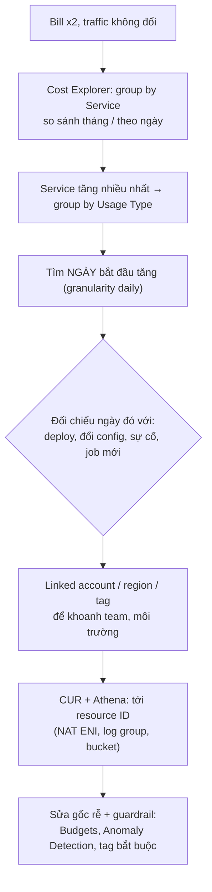
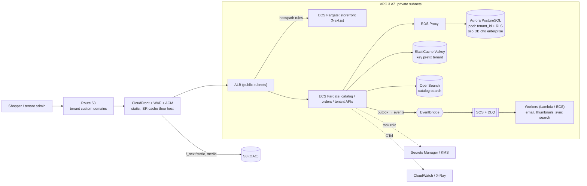

## Bối cảnh & vấn đề

Ngày 3 của tháng, kế toán gửi hoá đơn AWS tháng trước: gấp đôi tháng trước đó, trong khi traffic gần như không đổi. CTO hỏi hai câu: "tiền đi đâu?" và "cắt được 30% không, mà không làm hệ thống kém ổn định hơn?". Cùng tuần, bạn đi phỏng vấn cho một vị trí senior, được yêu cầu thiết kế AWS cho một platform e-commerce **B2B2C multi-tenant**, và nhận câu hỏi khó nhất: "bạn chưa chạy AWS production, vậy hãy nói xem hệ thống bạn đã xây sẽ đặt lên AWS thế nào".

Đây là bài tổng hợp của track: nó dùng mọi mảnh của các bài trước (IAM, VPC, compute, data, messaging, observability) để trả lời các câu ở mức **senior**: điều tra và tối ưu chi phí có phương pháp, thiết kế kiến trúc có lý do cho từng lựa chọn, và nói về kinh nghiệm của chính mình một cách trung thực. Phần multi-tenancy nền tảng (silo/pool, RLS, noisy neighbor) ở [track multi-tenancy](/tracks/multi-tenancy/learn/tenancy-models).

## Khái niệm

### Mô hình chi phí của AWS: trả cho cái gì

Hoá đơn AWS là tổng của các **usage type**: giờ chạy (instance, task, NAT, ALB, endpoint), lượng dùng (GB-giây Lambda, request, I/O), lưu trữ (GB-tháng S3/EBS/snapshot/log), và **data transfer** (ra internet, **giữa các AZ** khoảng 0,01 USD/GB mỗi chiều, giữa region, qua NAT). Hai loại hay gây bất ngờ: **chi phí theo GB đi qua một thành phần trung gian** (NAT Gateway processing, CloudWatch Logs ingestion, interface endpoint) và **chi phí của thứ bị quên** (EBS volume và snapshot mồ côi, Elastic IP/public IPv4, môi trường dev chạy 24/7, instance ở region không ai nhìn, version cũ trong bucket có versioning, multipart upload dở).

Công cụ: **Cost Explorer** (group theo service, usage type, linked account, region, tag; theo ngày), **Cost and Usage Report / Data Exports** (dòng chi tiết tới resource ID, truy vấn bằng Athena), **cost allocation tags** (phải bật trong Billing mới xuất hiện), **AWS Budgets** (cảnh báo theo ngưỡng, kể cả forecast), **Cost Anomaly Detection** (ML phát hiện bất thường theo service/tag, gửi cảnh báo trong ngày).

**Interview angle:** câu "bill tăng gấp đôi" được chấm theo **phương pháp** (thu hẹp theo chiều nào, theo thứ tự nào), không theo việc đoán trúng thủ phạm.

### Commitment: Savings Plans, Reserved Instances, Spot

**Compute Savings Plans** cam kết **X USD/giờ** chi tiêu compute trong 1 hoặc 3 năm, áp dụng linh hoạt cho EC2 (mọi family/region), **Fargate** và **Lambda**; **EC2 Instance Savings Plans** giảm sâu hơn nhưng gắn family + region. **RDS/ElastiCache/OpenSearch Reserved** cho database. **Spot** (EC2, Fargate Spot) giảm sâu cho workload chịu được bị thu hồi với thông báo 2 phút (worker, batch, CI runner).

Nguyên tắc chọn mức cam kết: cam kết theo **đáy ổn định** của chi tiêu theo giờ (gần p10 của 30–90 ngày gần nhất), không theo trung bình; phần dao động trả on-demand hoặc Spot. Cam kết cao hơn đáy nghĩa là có những giờ bạn trả tiền cho cam kết không dùng. Cam kết theo **lớp** (mua dần mỗi quý) tốt hơn một lần lớn.

**Interview angle:** follow-up "quyết định mức Savings Plan thế nào để không over-commit" — xem phép tính chạy thật bên dưới.

### Silo, pool, bridge trong multi-tenant

**Pool**: mọi tenant dùng chung hạ tầng (cùng service, cùng DB, phân tách bằng `tenant_id` + RLS): rẻ nhất trên mỗi tenant, vận hành một bản, nhưng noisy neighbor và blast radius chung. **Silo**: mỗi tenant (hoặc tenant lớn) có hạ tầng riêng (DB riêng, có khi account riêng): cô lập mạnh, đáp ứng yêu cầu compliance/region riêng, nhưng chi phí và vận hành nhân theo số silo. **Bridge**: lai, ví dụ compute pool nhưng DB silo cho tenant enterprise. Tier hoá tenant (free/pro/enterprise) thường đi kèm: tenant enterprise vào silo, phần còn lại pool.

**Interview angle:** follow-up "tenant enterprise đòi cô lập dữ liệu và region riêng" — chuyển tenant đó sang silo (DB hoặc cả stack, có thể account riêng ở region của họ), routing theo tenant ở edge, deploy pipeline phải triển khai được nhiều "cell".

### Strangler fig ở tầng routing

**Strangler fig** thay hệ thống cũ từng phần: đặt một lớp routing phía trước, chuyển dần từng endpoint sang service mới, rồi gỡ phần cũ. Trên AWS lớp đó là **ALB listener rule** (theo path/host: `/api/orders/*` sang service mới) hoặc **API Gateway route**, và **weighted target group** cho canary theo phần trăm (90% monolith, 10% service mới cho cùng path). Rollback là đổi weight hoặc rule, không cần redeploy.

**Interview angle:** câu migration microservices được chấm theo khả năng **rollback nhanh** và **so sánh hành vi** cũ/mới (shadow traffic, so sánh response, tracing).

## Cơ chế hoạt động

Phương pháp điều tra hoá đơn, theo thứ tự:



Mỗi bước thu hẹp một chiều. Service cho biết "cái gì", usage type cho biết "loại chi phí nào" (giờ hay GB hay request), ngày cho biết "từ khi nào" và nối sang **thay đổi** đã gây ra nó (gần như mọi bước nhảy chi phí đều do một thay đổi). Tag/account cho biết "của ai". CUR cho biết "tài nguyên nào". Kết thúc luôn bằng guardrail để lần sau phát hiện trong một ngày chứ không phải cuối tháng.

Kiến trúc tham chiếu cho platform B2B2C multi-tenant (Next.js storefront, Node API, SQL, search, cache, job async):



Lý do của từng lựa chọn: **CloudFront** gánh asset và trang cache được (ISR) theo **host** của tenant, giảm request chạm origin và là chỗ gắn WAF/rate limit; custom domain của tenant dùng ACM cert (nhiều SAN hoặc cert theo tenant). **ECS Fargate** cho storefront và API vì chúng chạy liên tục, giữ pool DB ổn định, team không muốn quản node ([bài 4](/tracks/aws/learn/compute-choices)); service tách theo domain (catalog, orders, tenant) với task role riêng. **Aurora PostgreSQL** cho dữ liệu nghiệp vụ quan hệ, pool với `tenant_id` + **RLS**, tenant enterprise có DB silo; **RDS Proxy** khi có Lambda hoặc nhiều task. **ElastiCache** với key prefix theo tenant; **OpenSearch** cho search catalog đồng bộ qua event. **EventBridge → SQS per consumer** cho async, publish qua outbox. Security: account theo môi trường, SCP, task role least privilege, Secrets Manager, KMS ([bài 2](/tracks/aws/learn/policy-evaluation-governance)). Ops: IaC (CDK/Terraform), CI với OIDC, rolling + circuit breaker, OTel, **cost tag theo tenant tier** để biết tenant nào lỗ.

## Ví dụ thực tế

### Điều tra hoá đơn: thu hẹp theo usage type và ngày

Script chạy thật (Node 24) trên **dữ liệu mẫu tổng hợp** có hình dạng giống output Cost Explorer theo ngày (service, usage type, ngày, USD); bước nhảy được cài vào ngày 18:

```ts
const byType = new Map<string, [number, number]>();
for (const r of rows) {
  const k = `${r.service} ${r.usageType}`; const v = byType.get(k) ?? [0, 0];
  if (r.day <= 14) v[0] += r.usd / 14; if (r.day >= 18) v[1] += r.usd / 13; byType.set(k, v);
}
```

```text
daily avg before day 15: $136   after day 18: $229
usage type                                          before/day  after/day   delta
AmazonEC2 APS1-NatGateway-Bytes                             $9        $71    +$62
AmazonCloudWatch APS1-DataProcessing-Bytes                  $6        $38    +$32
AmazonVPC APS1-PublicIPv4:InUseAddress                      $4         $4     +$0
AmazonS3 APS1-TimedStorage-ByteHrs                          $7         $7     +$0
AmazonECS APS1-Fargate-vCPU-Hours:perCPU                   $62        $62     -$0
AmazonRDS APS1-Aurora:ServerlessV2Usage                    $48        $48     -$0
first day NAT bytes > $30: 18 -> check deploys/config changes on that day
```

Lưu ý chi tiết dễ nhầm: phí NAT nằm dưới **service `AmazonEC2`** (usage type `NatGateway-Bytes`), không phải dưới VPC; ai chỉ nhìn "VPC" sẽ bỏ sót. Hai dòng tăng cùng ngày: NAT bytes và CloudWatch ingestion. Một giả thuyết hợp lý phải giải thích cả hai, ví dụ: deploy ngày 18 bật log level `debug` và đổi exporter gửi log/trace ra một vendor bên ngoài **qua NAT**. Sửa: trả log level về `info`, đặt retention, gửi telemetry qua endpoint/collector nội bộ; thêm Cost Anomaly Detection theo service và một budget cảnh báo theo **forecast** để lần sau biết trong một ngày.

Các thủ phạm thường gặp khác cần quét: data transfer cross-AZ (service gọi nhau chéo AZ liên tục), public IPv4, EBS/snapshot mồ côi, RDS storage/IOPS hoặc Aurora I/O, tài nguyên quên tắt ở region khác (nhóm theo region), version cũ trong S3 và multipart dở, Lambda chạy vòng lặp.

### Chọn mức Savings Plan: commit theo đáy

Cùng script, 30 ngày chi phí Fargate theo giờ (mẫu tổng hợp: nền 1,6 USD/h, đỉnh ban ngày thêm 1,4 USD/h), giả định Compute Savings Plan giảm ~20% cho Fargate (verify mức giảm thật theo term và payment option):

```text
Fargate $/hour: min 1.6  p10 1.66  p50 3.026  avg 2.51  max 3.3
commit $1.66/h -> month $1614 vs on-demand $1804, SP utilization 93%
commit $3.026/h -> month $2179 vs on-demand $1804, SP utilization 66%
```

Cam kết ở mức **p10** (1,66 USD/h) tiết kiệm ~190 USD/tháng với utilization 93%. Cam kết ở **p50** (3,03 USD/h, gần "giờ cao điểm") làm hoá đơn **cao hơn** on-demand ~375 USD/tháng vì một nửa số giờ trả cho cam kết không dùng (utilization 66%). Quy trình thực tế: xem gợi ý mua trong Cost Explorer (dựa trên 7/30/60 ngày), cam kết dưới mức gợi ý, mua thêm theo quý khi đáy tăng.

### Kế hoạch cắt 30% mà không giảm reliability

1. **Visibility trước** (tuần 1): bật cost allocation tags (`service`, `env`, `team`, `tenant_tier`), CUR + Athena, dashboard theo service/env; tìm **top 5 line item** (thường chiếm 70% trở lên).
2. **Quick wins** (tuần 1–2, rủi ro thấp): xoá EBS/snapshot/EIP mồ côi; tắt dev/staging ngoài giờ (Instance Scheduler, scale ECS về 0, Aurora min ACU thấp hoặc stop); log retention + log level; S3 lifecycle (Intelligent-Tiering, abort multipart, noncurrent version); S3/DynamoDB gateway endpoint; bỏ public IPv4 không cần.
3. **Right-size** (tuần 2–4): CPU/memory thực tế của task (Compute Optimizer, Container Insights), RDS instance class, chuyển sang **Graviton** (ARM) cho Node (thường rẻ hơn ~20% cùng hiệu năng, verify cho workload của bạn: native module phải build ARM).
4. **Commitment** (tháng 2): Compute Savings Plans cho baseline Fargate/Lambda/EC2, RDS Reserved cho DB ổn định, Fargate Spot/EC2 Spot cho worker và CI.
5. **Kiến trúc** (quý): cache ở CloudFront nhiều hơn, giảm chatty cross-AZ, batch job thay vì xử lý từng item, chuyển đường nóng ổn định từ Lambda sang container nếu phép tính break-even nói vậy.

Guardrail: đo **SLO trước và sau** mỗi thay đổi; không cắt Multi-AZ, backup hay NAT mỗi AZ của prod để lấy số. Theo dõi tiến độ bằng unit cost (USD trên 1.000 đơn hàng, trên mỗi tenant active) thay vì chỉ tổng hoá đơn, vì tổng có thể tăng do business tăng.

### Strangler fig với ALB weighted target groups (Terraform, minh hoạ)

```hcl
resource "aws_lb_listener_rule" "orders" {
  listener_arn = aws_lb_listener.https.arn
  priority     = 10
  condition {
    path_pattern { values = ["/api/orders*"] }
  }
  action {
    type = "forward"
    forward {
      target_group {
        arn    = aws_lb_target_group.monolith.arn
        weight = 90
      }
      target_group {
        arn    = aws_lb_target_group.orders_svc.arn
        weight = 10
      }
      stickiness {
        enabled  = true                      # keep a user on one side during the canary
        duration = 600
      }
    }
  }
}
```

Tăng weight theo bậc (10 → 25 → 50 → 100) khi tỉ lệ lỗi và p99 của service mới (trace OTel, so sánh theo route) không tệ hơn monolith; rollback là đổi weight về 0. Dữ liệu tách sau: bắt đầu với DB chung (service mới đọc, monolith vẫn ghi), dùng CDC (DMS hoặc Debezium) để đồng bộ sang DB riêng của service, rồi chuyển quyền ghi.

### Câu CV: map hệ thống đã xây sang AWS

Khung trả lời cho câu "bạn chưa chạy AWS production, hãy đặt hệ thống của bạn lên AWS" là **map từng thành phần đã vận hành thật** sang service AWS, nói lý do và ràng buộc, rồi nói thẳng phần chưa làm:

| Thành phần đã vận hành | Trên AWS | Lý do / ràng buộc phải nói |
|---|---|---|
| Next.js storefront + Express API | ECS Fargate sau ALB, CloudFront trước | Chạy liên tục, Socket.IO, pool DB ổn định; CloudFront cho static/ISR |
| SQL Server | RDS for SQL Server Multi-AZ, hoặc lý do migrate Aurora PostgreSQL | License (License Included theo edition, chi phí lớn), tính năng theo edition; migrate là dự án riêng |
| Redis | ElastiCache (Valkey/Redis OSS) | Cluster mode, Multi-AZ failover, TLS |
| Elasticsearch | Amazon OpenSearch Service | OpenSearch là fork; khác biệt version/API/license với Elasticsearch mới cần kiểm tra client |
| Kafka | Amazon MSK | Giữ semantics, ít rủi ro nhất cho migration ([bài 9](/tracks/aws/learn/messaging)) |
| Secret trong config server | Secrets Manager + task role | Không key dài hạn, rotation |
| CI/CD hiện tại | GitHub Actions + OIDC → ECS | Không access key trong CI |

Sau bảng, nói **phần chưa làm thật** và cách giảm rủi ro: staging dựng bằng IaC, load test, diễn tập failover, runbook. Thêm một hai điều đã học khi tự dựng lab (ví dụ hoá đơn NAT bất ngờ, lỗi OAC 403, keep-alive 502) với **trải nghiệm thật của bạn** (điền vào; không bịa số liệu). Red flag lớn nhất là giả vờ đã có kinh nghiệm production.

Với câu "khái niệm AWS nào thay đổi cách bạn thiết kế hệ thống đã xây": cấu trúc "**hiện tại hệ thống làm X → vấn đề đã gặp (sự cố/giới hạn thật) → trên AWS tôi sẽ làm Y → trade-off**". Ứng viên tốt chọn một khái niệm và đào sâu (ví dụ role + STS thay secret dài hạn; Multi-AZ + client failover so với cách hệ thống hiện tại xử lý DB restart; SQS + DLQ tách job nặng khỏi request path), điền sự cố thật của mình.

Với câu "dùng AWS để migrate microservices an toàn hơn": strangler fig bằng ALB rule/weight như trên, mỗi service một ECS service + task role + log group, tracing OTel để so sánh latency cũ/mới, Kafka → MSK, dữ liệu tách bằng CDC; nối với cách bạn đã giữ ổn định khi migrate thật (điền cách làm và số liệu thật).

## Trade-offs & lựa chọn thay thế

| Quyết định | Lựa chọn A | Lựa chọn B | Khi nào chọn gì |
|---|---|---|---|
| Tenancy | Pool (shared, RLS) | Silo (DB/stack riêng) | Pool mặc định; silo cho enterprise/compliance/region riêng |
| Compute storefront | ECS Fargate | Lambda (OpenNext) | Traffic ổn định, p99 nhạy → Fargate; traffic thưa → Lambda |
| Search | OpenSearch managed | Postgres full-text | Catalog lớn, facet, relevance → OpenSearch; nhỏ → Postgres |
| Async | EventBridge + SQS | MSK | Đã có Kafka, cần replay → MSK |
| Commitment | Savings Plans 1 năm | On-demand | Có đáy ổn định ≥ vài tháng → SP theo đáy |
| Tối ưu chi phí | Right-size, Graviton, endpoint | Cắt HA | Không bao giờ cắt HA/backup của prod để lấy số |

Đánh đổi lớn nhất của kiến trúc là **chi phí vs cô lập**: pool rẻ và đơn giản nhưng một tenant ồn ào ảnh hưởng tất cả (cần rate limit per tenant, query timeout, bulkhead); silo cô lập nhưng nhân chi phí và độ phức tạp deploy. Nói rõ đánh đổi này và cách hệ thống **chuyển** một tenant từ pool sang silo khi họ lớn lên là dấu hiệu senior.

## Edge cases & failure modes

- **Tag không được bật trong Billing** nên không xuất hiện trong Cost Explorer; và tag chỉ có hiệu lực từ lúc bật, không hồi tố.
- **Shared cost** (NAT, ALB, cluster) không gán được cho tenant bằng tag; cần mô hình phân bổ (theo request, theo GB).
- **Savings Plans không huỷ được**: đổi kiến trúc (từ EC2 sang Lambda) vẫn dùng được Compute SP, nhưng EC2 Instance SP thì không linh hoạt.
- **Spot bị thu hồi hàng loạt** trong giờ cao điểm của một instance family; đa dạng hoá family và có fallback on-demand.
- **Cắt chi phí làm hỏng DR**: tắt region DR "vì không dùng" hoặc giảm backup retention dưới yêu cầu RPO.
- **Silo tenant làm deploy chậm**: N stack phải nâng cấp; cần pipeline theo cell và version skew có kiểm soát.
- **Cross-AZ chatty**: service A ở AZ a gọi B ở AZ b hàng nghìn lần mỗi request; phí data transfer và latency; dùng zonal affinity khi hợp lý.

## Pitfalls

- ❌ Đoán thủ phạm hoá đơn → ✅ service → usage type → ngày → thay đổi → resource ID.
- ❌ Tìm phí NAT dưới "VPC" → ✅ nó nằm dưới `AmazonEC2`, usage type `NatGateway-Bytes`/`-Hours`.
- ❌ Mua Savings Plan theo chi tiêu trung bình hoặc đỉnh → ✅ theo đáy (≈ p10), mua dần.
- ❌ Cắt Multi-AZ/backup prod để đạt 30% → ✅ quick wins, right-size, Graviton, commitment, kiến trúc; đo SLO trước/sau.
- ❌ Không có budget/anomaly alert → ✅ Budgets theo forecast + Cost Anomaly Detection, cảnh báo trong ngày.
- ❌ Liệt kê service AWS không gắn với thành phần thật khi trả lời câu CV → ✅ map từng thành phần, lý do, ràng buộc (license SQL Server, OpenSearch vs Elasticsearch).
- ❌ Giả vờ đã chạy AWS production → ✅ nói thẳng phần đã làm (lab, staging) và cách giảm rủi ro.
- ❌ Big-bang migration → ✅ strangler fig với ALB weighted target group, rollback bằng đổi weight.

## Tóm tắt

- Chi phí AWS = giờ + lượng dùng + lưu trữ + data transfer; thủ phạm bất ngờ là phí theo GB qua thành phần trung gian và tài nguyên bị quên.
- Điều tra: Cost Explorer theo service → usage type → ngày, đối chiếu thay đổi, rồi CUR tới resource; kết thúc bằng Budgets + Anomaly Detection.
- Savings Plans cam kết theo đáy chi tiêu theo giờ, không theo trung bình; Spot cho workload chịu gián đoạn.
- Cắt 30%: visibility → quick wins → right-size/Graviton → commitment → kiến trúc; không cắt HA/backup.
- Kiến trúc B2B2C: CloudFront + WAF → ALB → ECS Fargate theo domain → Aurora (pool + RLS, silo cho enterprise) + RDS Proxy, ElastiCache, OpenSearch, EventBridge → SQS; account theo env, OIDC, OTel, cost tag theo tenant tier.
- Strangler fig bằng ALB rule và weighted target group; dữ liệu tách bằng CDC.
- Câu CV: map thành phần thật sang AWS có lý do, nói thẳng phần chưa làm, dùng trải nghiệm thật.
