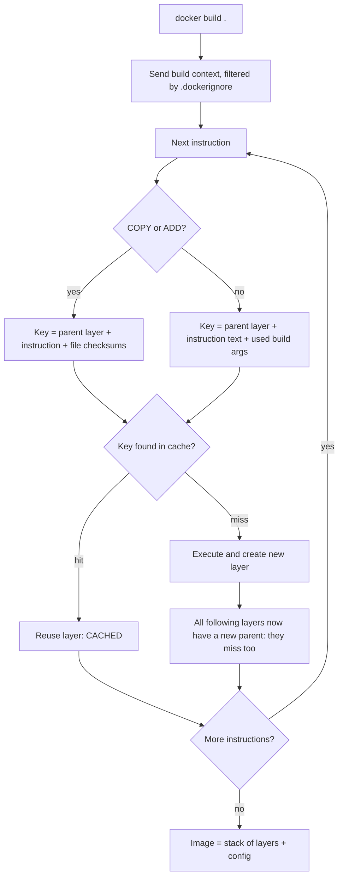

## Bối cảnh & vấn đề

Một team Node có Dockerfile "chạy được" từ ngày đầu: `FROM node`, `COPY . .`, `RUN npm install`, `RUN npm run build`. Mỗi lần developer sửa một dòng trong `src/`, CI build lại image mất 4 phút, trong đó 3 phút là tải và cài lại toàn bộ dependency dù `package.json` không hề đổi. Tệ hơn, thỉnh thoảng build trên CI ra kết quả khác máy local: hôm qua test xanh, hôm nay đỏ, không ai sửa code. Nguyên nhân là `npm install` đã âm thầm resolve một bản patch mới của một transitive dependency.

Hai vấn đề này có cùng gốc: team chưa hiểu **image được dựng từ các layer có cache như thế nào**, và chưa phân biệt **cài đặt tái lập được** (`npm ci` theo lockfile) với **cài đặt "cập nhật nếu có thể"** (`npm install`). Khi đã hiểu, chỉ cần đổi thứ tự 2 dòng trong Dockerfile và đổi một lệnh là build giảm từ vài phút xuống vài giây, và build hôm nay giống hệt build hôm qua.

Bài này đi từ khái niệm image/layer, cách BuildKit tính cache key, thứ tự Dockerfile đúng cho Node, `.dockerignore`, `npm ci`, cache mount, cache trong CI (nơi cache thường "biến mất"), rồi nối với nguyên tắc **build, release, run** của 12-factor. Bài sau, [multi-stage và non-root](/tracks/devops-cicd/learn/multi-stage-secure-images), dùng nền tảng này để làm image nhỏ và an toàn.

## Khái niệm

### Image và container

**Image** là một gói chỉ-đọc gồm filesystem (các layer) và metadata (lệnh chạy mặc định `CMD`, biến môi trường `ENV`, user, port). **Container** là một process chạy từ image, cộng thêm một lớp ghi (writable layer) mỏng ở trên cùng; mọi thay đổi file trong container nằm ở lớp đó và mất khi container bị xoá.

Vì image bất biến, cùng một image (xác định bằng **digest** `sha256:...`) chạy ở laptop, staging và production cho ra cùng filesystem. Đây là nền móng của "build once, deploy many": cái bạn test chính là cái bạn chạy.

```text
$ docker image inspect node:22-slim --format '{{index .RepoDigests 0}}'
node@sha256:43ac6c60b8f89723f746e8a92ce91abd5017e627ce1ddfe4238355d3a30b772c
```

Tag (`node:22-slim`) là một con trỏ có thể bị dời sang image khác khi upstream phát hành bản vá; digest thì không bao giờ đổi. Pin theo digest cho tái lập tuyệt đối, đổi lại phải chủ động cập nhật (Renovate/Dependabot làm việc này).

### Layer

Mỗi instruction thay đổi filesystem (`RUN`, `COPY`, `ADD`) tạo ra một **layer**: một tập file thêm/sửa/xoá so với layer bên dưới. Instruction chỉ đổi metadata (`ENV`, `CMD`, `WORKDIR`, `EXPOSE`) tạo layer rỗng hoặc chỉ cập nhật config. Image cuối cùng là chồng các layer xếp lên nhau (union filesystem).

Hệ quả quan trọng: **xoá file ở layer sau không làm image nhỏ đi và không xoá dữ liệu ở layer trước**. Nếu `RUN` thứ 3 ghi một token vào `.npmrc` và `RUN` thứ 4 xoá nó, token vẫn nằm nguyên trong layer thứ 3, ai pull image đều đọc được. Đây là lý do secret phải đi qua cơ chế riêng (secret mount), chi tiết ở [bài 02](/tracks/devops-cicd/learn/multi-stage-secure-images).

### Cache key

Khi build, BuildKit đi từ trên xuống và với mỗi instruction hỏi: "đã có layer nào được tạo từ **cùng layer cha** và **cùng instruction** chưa?". Với `RUN`, key là chuỗi lệnh (và các build arg nó dùng). Với `COPY`/`ADD`, key còn gồm **checksum nội dung** của các file được copy (không phải mtime). Nếu khớp, layer được tái sử dụng (`CACHED`); nếu không, instruction đó chạy lại.

Điểm then chốt: cache là một **chuỗi**. Khi một layer bị miss, **mọi layer phía sau** đều miss theo, vì layer cha của chúng đã khác. `RUN npm ci` không biết rằng dependency không đổi; nó chỉ biết layer cha (kết quả `COPY . .`) có checksum mới.

Ví dụ: với `COPY . . → RUN npm ci`, sửa `src/server.ts` làm đổi checksum của `COPY . .`, nên `npm ci` chạy lại. Với `COPY package*.json → RUN npm ci → COPY . .`, sửa `src/` chỉ làm miss từ `COPY . .` trở xuống.

**Interview angle:** câu "layer cache hoạt động thế nào" muốn nghe ba ý: key = instruction + layer cha (+ checksum file với COPY), miss lan xuống mọi layer sau, và vì vậy thứ tự Dockerfile đi từ thứ ít đổi nhất tới thứ đổi nhiều nhất.

### Build context và .dockerignore

**Build context** là tập file mà client gửi cho builder khi chạy `docker build .`. `COPY . .` chỉ có thể copy từ context. **`.dockerignore`** loại file khỏi context, giống `.gitignore`.

Thiếu `.dockerignore` gây ba vấn đề: context nặng (gửi cả `node_modules`, `.git`), cache vỡ vô cớ (mỗi commit đổi `.git/` làm `COPY . .` miss), và rò rỉ (`.env`, key local lọt vào image). Một vấn đề ít ai để ý: `node_modules` build trên macOS bị copy đè lên `node_modules` cài trong container Linux, native module (bcrypt, sharp) sẽ crash vì sai kiến trúc.

```text
# .dockerignore
node_modules
dist
.git
.env
Dockerfile*
```

### npm ci, npm install và lockfile

**Lockfile** (`package-lock.json`) ghi chính xác version và integrity hash của **mọi** package trong cây dependency, kể cả transitive. `package.json` chỉ ghi range (`^5.1.0`).

- **`npm install`**: resolve theo range trong `package.json`, có thể **sửa lockfile** nếu thấy cần (thêm package mới, range không khớp). Phù hợp khi developer thêm/nâng dependency.
- **`npm ci`** (clean install): xoá `node_modules` hiện có, cài **đúng** theo lockfile, không bao giờ ghi lockfile, và **fail** nếu `package.json` và lockfile lệch nhau. Phù hợp cho CI và Docker vì tái lập được và thường nhanh hơn (không phải resolve).

Tương đương ở các package manager khác: `pnpm install --frozen-lockfile`, `yarn install --immutable` (Yarn Berry). Cho image production, chỉ cài dependency runtime: `npm ci --omit=dev`, hoặc build xong rồi `npm prune --omit=dev`.

**Interview angle:** "`npm ci` khác `npm install`?" — câu trả lời đủ ý: tái lập theo lockfile, fail khi lệch thay vì tự sửa, xoá `node_modules` trước, và lockfile phải được commit. Follow-up hay gặp là `postinstall` script độc hại (xem [bảo mật pipeline](/tracks/devops-cicd/learn/pipeline-supply-chain-security)).

### BuildKit cache mount

Layer cache là "tất cả hoặc không": nếu lockfile đổi một dòng, `npm ci` chạy lại từ đầu và tải lại cả 93 package. **Cache mount** (`RUN --mount=type=cache,target=/root/.npm npm ci`) gắn một thư mục cache bền vững của builder vào lúc chạy lệnh. Thư mục này **không nằm trong image**, nhưng sống qua các lần build, nên npm lấy tarball từ cache cục bộ thay vì tải lại.

Hai cơ chế bổ sung cho nhau: layer cache bỏ qua cả bước khi không có gì đổi; cache mount làm bước đó nhanh hơn khi buộc phải chạy lại.

### 12-factor: build, release, run

**The Twelve-Factor App** là bộ 12 nguyên tắc cho ứng dụng chạy trên cloud. Ba nguyên tắc gắn trực tiếp với image:

- **V. Build, release, run** tách biệt: *build* biến code thành artifact (image), *release* = artifact + config của một môi trường, *run* = chạy release đó. Không sửa code ở bước run, không build lại khi đổi môi trường.
- **III. Config** nằm trong environment, không bake vào image, để cùng một image chạy ở mọi môi trường.
- **II. Dependencies** khai báo tường minh và cô lập: lockfile + `npm ci`, không dựa vào package cài sẵn trên máy.

Các nguyên tắc khác hay được hỏi cho service Node trong container: **VI. stateless processes** (session/upload không nằm trên disk local, để scale ngang), **XI. logs là event stream** (ghi stdout, platform thu gom), **IX. disposability** (start nhanh, shutdown êm khi SIGTERM, xem [PID 1 và signal](/tracks/devops-cicd/learn/pid1-signals-graceful-shutdown)), **X. dev/prod parity** và **IV. backing services** gắn qua URL.

12-factor ra đời trước Kubernetes nên có chỗ cần bổ sung: "config chỉ qua env var" không đủ cho secret (env dễ lộ qua crash dump, `/proc`, log debug), thực tế dùng secret manager hoặc file mount.

**Interview angle:** chọn 4–5 nguyên tắc và nói **vì sao** chúng quan trọng với container, kèm một hạn chế. Liệt kê đủ 12 cái không ghi điểm bằng giải thích tốt 4 cái.

## Cơ chế hoạt động

Khi chạy `docker build`, client gửi context (sau khi lọc `.dockerignore`) cho BuildKit. BuildKit duyệt từng instruction, tính cache key và quyết định dùng lại hay chạy lại.



Diễn giải theo hai Dockerfile cho cùng một app TypeScript:

1. **Thứ tự sai** (`COPY . .` rồi `RUN npm ci`): sửa `src/server.ts` đổi checksum của context → `COPY . .` miss → `npm ci` có layer cha mới nên miss → cài lại mọi dependency → build lại.
2. **Thứ tự đúng** (`COPY package.json package-lock.json` → `RUN npm ci` → `COPY . .` → build): sửa `src/` không đổi checksum của hai file manifest → `COPY` manifest hit → `npm ci` hit → chỉ `COPY . .` và `npm run build` chạy lại.

Quy tắc chung: xếp instruction theo **tần suất thay đổi tăng dần**: base image → system package → manifest + install → source → build. Mọi thứ hiếm đổi đặt trên, thứ đổi mỗi commit đặt dưới.

Trong CI, có thêm một tầng: runner thường là máy mới mỗi lần chạy, nên **cache cục bộ của builder trống**. Muốn có cache phải export/import nó qua một **cache backend**: registry (`--cache-to type=registry,ref=...:buildcache,mode=max`), GitHub Actions cache (`type=gha`), hoặc S3. `mode=max` lưu cả layer của stage trung gian (quan trọng với multi-stage), `mode=min` chỉ lưu layer của image cuối.

## Ví dụ thực tế

### Đo thật: thứ tự sai và thứ tự đúng

App: Express 5 + TypeScript, 93 package. Môi trường: Docker Engine 29.7.2 (Docker Desktop, arm64), buildx 0.36.1, base `node:22-slim` (Node 22.23.3, npm 10.9.9). Build lần đầu cả hai để làm nóng cache, sau đó sửa một dòng trong `src/server.ts` và build lại.

```dockerfile
# Dockerfile.bad
FROM node:22-slim
WORKDIR /app
COPY . .
RUN npm ci
RUN npm run build
CMD ["node", "dist/server.js"]
```

```dockerfile
# Dockerfile.good
FROM node:22-slim
WORKDIR /app
COPY package.json package-lock.json ./
RUN npm ci
COPY . .
RUN npm run build
CMD ["node", "dist/server.js"]
```

Output `--progress=plain` sau khi sửa một dòng code (rút gọn):

```text
== bad
#7 [3/5] COPY . .
#7 DONE 0.1s
#8 [4/5] RUN npm ci
#8 DONE 4.9s
#9 [5/5] RUN npm run build
#9 DONE 1.6s
real 11.71

== good
#7 [3/6] COPY package.json package-lock.json ./
#7 CACHED
#8 [4/6] RUN npm ci
#8 CACHED
#9 [5/6] COPY . .
#9 DONE 0.0s
#10 [6/6] RUN npm run build
#10 DONE 2.2s
real 3.66
```

Với 93 package và mạng tốt, chênh lệch là 11.7s so với 3.7s. Với một monorepo thật 1.500 package, bước `npm ci` dễ lên 1–3 phút, và đó chính là thời gian bạn lấy lại ở mỗi commit.

### Đo thật: .dockerignore

Cùng app, đã có `node_modules` (32 MB) và `dist/` ở máy local:

```text
không có .dockerignore:  #6 transferring context: 29.99MB 1.8s done
có .dockerignore:        #5 transferring context: 239B 0.1s done
```

30 MB gửi đi mỗi lần build, và `COPY . .` sẽ chép `node_modules` build trên macOS đè lên bản cài trong container.

### Đo thật: npm ci fail khi lockfile lệch

Thêm `"zod": "4.1.5"` vào `package.json` mà không chạy `npm install` để cập nhật lockfile:

```text
$ npm ci
npm error code EUSAGE
npm error
npm error `npm ci` can only install packages when your package.json and package-lock.json or npm-shrinkwrap.json are in sync. Please update your lock file with `npm install` before continuing.
npm error
npm error Missing: zod@4.1.5 from lock file
$ echo $?
1
```

Đây là hành vi mong muốn: CI fail sớm với thông báo rõ, thay vì `npm install` tự resolve và tạo ra một cây dependency chưa ai review.

### Đo thật: cache mount khi lockfile đổi

Đổi trường `version` trong `package.json` và lockfile (dependency giữ nguyên, nhưng checksum manifest đổi nên layer `npm ci` miss):

```dockerfile
# syntax=docker/dockerfile:1
FROM node:22-slim
WORKDIR /app
COPY package.json package-lock.json ./
RUN --mount=type=cache,target=/root/.npm npm ci
COPY . .
RUN npm run build
```

```text
không cache mount: #8 6.346 added 93 packages, and audited 94 packages in 6s
có cache mount:    #10 1.730 added 93 packages, and audited 94 packages in 1s
```

`npm ci` vẫn chạy (layer miss là đúng), nhưng tarball lấy từ `/root/.npm` đã có sẵn trong cache mount của builder.

### Cache trong GitHub Actions (minh hoạ)

```yaml
- uses: docker/setup-buildx-action@v3
- uses: docker/build-push-action@v6
  with:
    push: true
    tags: registry.example.com/api:${{ github.sha }}
    cache-from: type=gha
    cache-to: type=gha,mode=max
```

`type=gha` lưu cache vào GitHub Actions cache (có giới hạn dung lượng mỗi repo, cache cũ bị evict, verify giới hạn hiện tại). Với nhiều runner/nhiều repo, `type=registry` ổn định hơn vì không bị giới hạn đó. Lưu ý: cache mount (`type=cache`) **không** được export qua các backend này; trên runner ephemeral nó gần như luôn trống (verify; có action bên thứ ba để persist cache mount).

## Trade-offs & lựa chọn thay thế

| Lựa chọn | Mạnh | Yếu | Khi nào dùng |
|---|---|---|---|
| npm + `npm ci` | Mặc định, không cần cài thêm | `node_modules` lớn, cài chậm hơn pnpm | Đa số service đơn lẻ |
| pnpm `--frozen-lockfile` | Store dùng chung, cài nhanh, chặt chẽ về phantom dependency | Symlink layout làm một số tool/Docker copy phức tạp hơn (`pnpm deploy` giúp) | Monorepo lớn |
| Yarn Berry `--immutable` | PnP, zero-install | PnP không tương thích mọi tool | Team đã quen Yarn |
| Layer cache cục bộ | Tự động, không cấu hình | Mất trên runner ephemeral | Dev local, self-hosted runner |
| Cache mount | Nhanh khi layer buộc phải chạy lại | Không export sang CI backend | Bước install, `apt`, build tool có cache |
| Registry cache (`type=registry`) | Dùng chung giữa runner/branch, không giới hạn GHA | Thêm push/pull, cần registry | CI nhiều runner |
| GHA cache (`type=gha`) | Cấu hình 2 dòng | Giới hạn dung lượng, scope theo branch | Repo vừa và nhỏ trên GitHub |

Khi nào chọn gì: với một service Node trên GitHub Actions, bắt đầu bằng thứ tự Dockerfile đúng + `npm ci` + `type=gha,mode=max`. Khi cache hit rate thấp vì evict hoặc nhiều runner, chuyển sang registry cache. Chuyển npm sang pnpm chỉ khi monorepo đủ lớn để thời gian install là nút cổ chai thật (đo trước). Cache mount luôn nên thêm cho bước install vì chi phí gần bằng 0 ở local và self-hosted runner.

## Edge cases & failure modes

- **CI không bao giờ hit cache dù Dockerfile đúng**: runner ephemeral không có cache cục bộ và chưa cấu hình `cache-from`; hoặc `mode=min` nên layer của stage build không được lưu; hoặc `--no-cache`/`--pull` trong script; hoặc một `ARG` thay đổi mỗi build (ví dụ `ARG BUILD_DATE` hay `GIT_SHA` khai báo **trước** `npm ci`) làm mọi `RUN` sau nó miss. Đặt các ARG biến động càng muộn càng tốt.
- **Base image tag bị dời**: `node:22-slim` được cập nhật bản vá → layer `FROM` khác → toàn bộ cache miss một lần. Không phải lỗi, nhưng giải thích vì sao "đột nhiên build chậm" sau khi upstream phát hành.
- **`postinstall` script**: `npm ci` chạy lifecycle script của mọi package. Script có thể tải binary (sharp, prisma engines) làm build phụ thuộc mạng, hoặc chạy mã độc. `npm ci --ignore-scripts` an toàn hơn nhưng làm hỏng package cần build native; phải liệt kê ngoại lệ có chủ đích.
- **Native module và kiến trúc**: build image `linux/amd64` trên Mac arm64 qua emulation chậm gấp nhiều lần và native module có thể compile sai; dùng `--platform` rõ ràng hoặc build trên runner đúng kiến trúc.
- **Lockfile thiếu cho platform khác**: lockfile tạo trên macOS có thể thiếu optional dependency của Linux (ví dụ binary `@esbuild/linux-x64`), khiến `npm ci` trong container cài thiếu. Tái tạo lockfile trong môi trường Linux hoặc nâng npm (verify theo phiên bản npm).
- **Cache "đúng" nhưng sai ngữ nghĩa**: `RUN apt-get update` được cache vĩnh viễn, nên `apt-get install` sau đó cài package cũ từ index cũ. Gộp `apt-get update && apt-get install` trong cùng một `RUN`.

## Pitfalls

- ❌ `COPY . .` trước `npm ci` → ✅ copy `package.json` + lockfile, `npm ci`, rồi mới `COPY . .`. Nếu không, mọi commit đều cài lại dependency.
- ❌ Không có `.dockerignore` → ✅ loại `node_modules`, `.git`, `.env`, `dist`. Nếu không, context nặng, cache vỡ theo mỗi commit, và secret local lọt vào image.
- ❌ `npm install` trong Dockerfile/CI → ✅ `npm ci` (hoặc `--frozen-lockfile`/`--immutable`). `npm install` có thể đổi cây dependency giữa hai lần build.
- ❌ Không commit lockfile, hoặc `.gitignore` nó → ✅ lockfile là một phần của source; không có nó thì không có build tái lập.
- ❌ `FROM node:latest` → ✅ tag cụ thể (`node:22-slim`) hoặc digest, cập nhật qua bot. `latest` đổi major version không báo trước.
- ❌ Ghi token vào `.npmrc` trong một `RUN` rồi xoá ở `RUN` sau → ✅ secret mount. Layer cũ vẫn giữ file.
- ❌ `ARG GIT_SHA` ở đầu Dockerfile → ✅ khai báo ngay trước nơi dùng (thường ở stage cuối), để nó không làm miss cache của bước install.
- ❌ Build lại image riêng cho staging và prod → ✅ build một lần, promote cùng digest, config inject lúc run (12-factor build/release/run).

## Tóm tắt

- Image = chồng layer bất biến + config; container = process + lớp ghi mỏng. Digest định danh chính xác image, tag thì có thể dời.
- Cache key = layer cha + instruction (+ checksum file với `COPY`/`ADD`); một layer miss thì mọi layer sau miss theo.
- Thứ tự Dockerfile theo tần suất thay đổi: base → manifest + `npm ci` → source → build. Đo thật: 11.7s xuống 3.7s khi sửa một dòng code.
- `.dockerignore` giữ context nhỏ (30 MB xuống 239 B trong ví dụ), cache ổn định và không lọt `.env`/`node_modules` local.
- `npm ci` cài đúng lockfile, fail khi lệch, xoá `node_modules` trước; dùng nó ở CI và Docker, kèm `--omit=dev` cho runtime.
- Cache mount tăng tốc khi bước install buộc phải chạy lại; trong CI cần cache backend (`type=gha`/`type=registry`, `mode=max`) vì runner ephemeral không có cache.
- 12-factor build/release/run: build một artifact, release = artifact + config, run không sửa gì; config trong env (secret thì cần secret manager).
