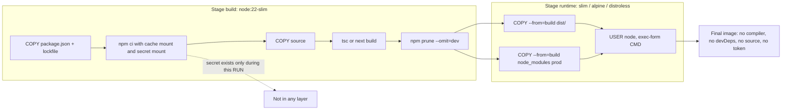

## Bối cảnh & vấn đề

Một API Node được đóng gói bằng Dockerfile một stage: `FROM node:22`, copy toàn bộ source, `npm install` (kể cả devDependencies), build TypeScript, chạy. Image nặng **1.68 GB**. Mỗi lần HPA scale out, node mới phải pull 1.68 GB trước khi pod khởi động được, nên scale out mất cả phút đúng lúc đang cần nhất. Image chứa compiler, `typescript`, `@types/*`, source `.ts`, test, và toàn bộ toolchain Debian đầy đủ: mỗi thứ là thêm CVE trong báo cáo scan.

Tệ hơn, để cài package private, Dockerfile nhận `ARG NPM_TOKEN`, ghi vào `.npmrc` rồi xoá. Một người có quyền pull image chạy `docker history --no-trunc` và đọc được token ngay trong dòng lệnh build. Container chạy bằng **root**, nên nếu app dính lỗi RCE (ví dụ một dependency deserialize không an toàn), kẻ tấn công có root trong container và gần hơn một bước tới host.

Ba vấn đề này (image to, secret lộ, chạy root) có lời giải chuẩn: **multi-stage build**, **secret mount** và **non-root user** kèm `securityContext` trên Kubernetes. Bài này dựa trên [layer và build cache](/tracks/devops-cicd/learn/images-layers-build-cache) và kết thúc bằng một Dockerfile production có thể bảo vệ trong buổi review.

## Khái niệm

### Multi-stage build

**Multi-stage build** là Dockerfile có nhiều `FROM`, mỗi `FROM` mở một **stage** mới với filesystem riêng. Stage sau có thể `COPY --from=<stage>` chọn lọc file từ stage trước. Chỉ stage cuối cùng (hoặc stage chỉ định bằng `--target`) trở thành image; mọi thứ ở stage khác bị bỏ lại.

Vì sao cần: build TypeScript cần `typescript`, `@types/*`, có khi cả `python3`/`g++` để compile native module. Runtime chỉ cần JavaScript đã biên dịch và dependency production. Không có multi-stage, bạn phải cài rồi xoá trong cùng một `RUN` (khó đọc, dễ sót) và layer vẫn mang theo lịch sử. Với multi-stage, stage build cứ "bẩn" thoải mái, stage runtime chỉ nhận **artifact**.

```dockerfile
FROM node:22-slim AS build
# ... npm ci, tsc, npm prune --omit=dev
FROM node:22-slim
COPY --from=build /app/dist ./dist
COPY --from=build /app/node_modules ./node_modules
```

**Interview angle:** câu "multi-stage là gì" cần nêu hai lợi ích tách bạch: **size** (pull nhanh, scale nhanh) và **attack surface** (không compiler, không devDependencies, không source). Nói thêm Next.js `standalone` là điểm cộng.

### Artifact và Next.js standalone

**Artifact** là đầu ra build cần để chạy: với API là `dist/` + `node_modules` production; với Next.js là output của `next build`. Khi đặt `output: "standalone"` trong `next.config`, Next.js dùng file tracing để chép vào `.next/standalone` một `server.js` tối thiểu cùng **chỉ những file trong `node_modules` thật sự được import**. Stage runtime copy `.next/standalone`, `.next/static` và `public` (hai thư mục sau không được chép tự động vì thường được serve qua CDN).

```dockerfile
FROM node:22-slim AS runner
WORKDIR /app
ENV NODE_ENV=production
COPY --from=build --chown=node:node /app/.next/standalone ./
COPY --from=build --chown=node:node /app/.next/static ./.next/static
COPY --from=build --chown=node:node /app/public ./public
USER node
CMD ["node", "server.js"]
```

Lưu ý `NEXT_PUBLIC_*` được **inline vào bundle lúc build**, nên image Next.js mặc định gắn với một môi trường. Muốn một image cho mọi môi trường phải dùng runtime config (đọc env ở server, truyền xuống client), chi tiết ở [thiết kế pipeline](/tracks/devops-cicd/learn/ci-pipeline-design).

### Base image: full, slim, alpine, distroless

**Base image** là `FROM` của stage runtime, quyết định phần lớn size và CVE.

- **`node:22`** (full Debian): có `git`, `gcc`, `python3`… tiện cho stage build, quá nặng cho runtime.
- **`node:22-slim`**: Debian tối giản, dùng **glibc**, có shell và `apt`. Lựa chọn mặc định an toàn.
- **`node:22-alpine`**: Alpine Linux dùng **musl libc** thay glibc, nhỏ hơn. Native module build sẵn cho glibc có thể không chạy; DNS resolver của musl khác glibc (từng gây lỗi với một số cấu hình DNS); Node trên Alpine được đánh dấu "experimental" trong bảng hỗ trợ build của Node.js (verify).
- **Distroless** (`gcr.io/distroless/nodejs22-debian12`): chỉ có runtime Node và thư viện cần thiết, **không có shell, không package manager**. Ít CVE nhất, nhưng debug khó (`kubectl exec sh` không được; dùng ephemeral debug container), và `CMD` phải ở dạng exec vì không có `/bin/sh`. Tag `:nonroot` chạy sẵn bằng uid 65532.

### Non-root user

Mặc định process trong container chạy với **uid 0 (root)**. Container cô lập bằng namespace và cgroup, không phải VM; root trong container vẫn là uid 0 với kernel. Khi có thêm một lỗ hổng runtime/kernel, một volume mount nhạy cảm (`/var/run/docker.sock`, hostPath), hay capability thừa, root trong container trở thành đường leo ra host. Ngay cả khi không thoát được, root ghi được mọi file trong container (sửa code, cài tool).

Image `node` chính thức có sẵn user **`node` (uid 1000)**. Dùng `USER node` ở stage runtime và `COPY --chown=node:node` để file thuộc user đó. App không cần quyền root vì listen port 3000/8080 (port < 1024 mới cần quyền đặc biệt).

```text
$ docker run --rm --entrypoint "" lab2/multi-slim id
uid=1000(node) gid=1000(node) groups=1000(node)
```

**Interview angle:** follow-up kinh điển là `readOnlyRootFilesystem` làm Next.js crash khi ghi `.next/cache`. Trả lời: mount `emptyDir` (hoặc volume) vào đúng đường dẫn cần ghi, và cấu hình cache ISR sang Redis/S3 khi có nhiều replica.

### securityContext trên Kubernetes

`USER` trong Dockerfile là lời hứa của image; **`securityContext`** là thứ cluster ép buộc. Các trường quan trọng:

- `runAsNonRoot: true`: kubelet từ chối chạy nếu image sẽ chạy bằng uid 0.
- `runAsUser: 1000`: ép uid cụ thể (cần khi image dùng tên user, vì kubelet không resolve được tên để kiểm tra non-root).
- `readOnlyRootFilesystem: true`: filesystem của container chỉ đọc; chỗ cần ghi thì mount `emptyDir`.
- `allowPrivilegeEscalation: false`: chặn setuid binary nâng quyền.
- `capabilities: { drop: ["ALL"] }`: bỏ toàn bộ Linux capability.
- `seccompProfile: { type: RuntimeDefault }`: lọc syscall nguy hiểm.

Pod Security Standards mức **restricted** yêu cầu gần như toàn bộ danh sách trên (verify chi tiết theo phiên bản Kubernetes).

### Secret lúc build: ARG/ENV và secret mount

**`ARG`** là biến chỉ tồn tại lúc build, **`ENV`** là biến lưu vào config image và có mặt lúc chạy. Cả hai đều **không an toàn cho secret**: giá trị `ENV` nằm trong `docker image inspect`; giá trị `ARG` được ghi vào lịch sử của mọi `RUN` dùng nó (`docker history`). Xoá file ở `RUN` sau cũng vô ích vì layer cũ vẫn giữ file.

**Secret mount** (`RUN --mount=type=secret,id=npmrc,target=/root/.npmrc npm ci`) đưa secret vào **chỉ trong thời gian chạy lệnh đó**, dưới dạng tmpfs, không ghi vào layer, không vào history, không làm đổi cache key. Truyền vào lúc build bằng `docker build --secret id=npmrc,src=$HOME/.npmrc`. Secret **runtime** (DB password) thì không bao giờ thuộc image: inject lúc chạy qua env/volume từ secret manager.

**Interview angle:** "làm sao chứng minh token không có trong image?" — `docker history --no-trunc`, `docker image inspect`, và `docker save image | grep` trên mọi layer; trong CI có thể chạy secret scanner (gitleaks/trivy secret) trên image.

## Cơ chế hoạt động

Multi-stage biến Dockerfile thành một đồ thị: BuildKit chỉ build những stage mà stage đích cần, chạy song song các stage độc lập, và chỉ những file được `COPY --from` mới đi vào image cuối.



Diễn giải từng bước:

1. Stage build cài **toàn bộ** dependency (cần devDependencies để compile). Token npm private đi qua **secret mount**, chỉ tồn tại trong lúc `npm ci` chạy.
2. Sau khi build, `npm prune --omit=dev` xoá devDependencies khỏi `node_modules` của stage build, để thư mục được copy sang runtime chỉ còn package production. Cách khác: một stage `deps` riêng chạy `npm ci --omit=dev`, giữ cache tốt hơn khi chỉ source đổi.
3. Stage runtime bắt đầu từ base image sạch, nhận đúng hai thư mục. Không có `src/`, test, `tsconfig`, `.npmrc`.
4. `USER node` và `CMD ["node", "dist/server.js"]` dạng exec để Node là PID 1 và nhận SIGTERM trực tiếp (vì sao quan trọng: [PID 1 và signal](/tracks/devops-cicd/learn/pid1-signals-graceful-shutdown)).

Trên Kubernetes, `securityContext` là lớp phòng thủ thứ hai: kể cả khi ai đó build image quên `USER`, `runAsNonRoot: true` làm pod fail ngay với lỗi `container has runAsNonRoot and image will run as root` thay vì âm thầm chạy root.

## Ví dụ thực tế

### Đo thật: size theo từng cách build

Cùng app Express 5 + TypeScript ở bài trước. Docker Engine 29.7.2 (arm64), `node:22` / `node:22-slim` / `node:22-alpine` (Node 22.23.3), `gcr.io/distroless/nodejs22-debian12:nonroot` (Node 22.22.0). Size là dung lượng local trong image store (chưa nén), nên số khi pull từ registry (đã nén) sẽ nhỏ hơn.

```dockerfile
# Dockerfile.multi-slim (alpine giống hệt, chỉ đổi tag)
# syntax=docker/dockerfile:1
FROM node:22-slim AS build
WORKDIR /app
COPY package.json package-lock.json ./
RUN --mount=type=cache,target=/root/.npm npm ci
COPY . .
RUN npm run build && npm prune --omit=dev

FROM node:22-slim
WORKDIR /app
ENV NODE_ENV=production
COPY --from=build --chown=node:node /app/node_modules ./node_modules
COPY --from=build --chown=node:node /app/dist ./dist
USER node
EXPOSE 3000
CMD ["node", "dist/server.js"]
```

```dockerfile
# Dockerfile.multi-distroless: stage build như trên, stage cuối:
FROM gcr.io/distroless/nodejs22-debian12:nonroot
WORKDIR /app
ENV NODE_ENV=production
COPY --from=build /app/node_modules ./node_modules
COPY --from=build /app/dist ./dist
EXPOSE 3000
CMD ["dist/server.js"]
```

```text
$ docker images --format 'table {{.Repository}}\t{{.Size}}' | grep lab2
lab2/multi-distroless   220MB
lab2/multi-alpine       243MB
lab2/multi-slim         354MB
lab2/naive              1.68GB
```

Kiểm tra user và shell:

```text
== multi-slim
uid=1000(node) gid=1000(node) groups=1000(node)
has-shell
== multi-alpine
uid=1000(node) gid=1000(node) groups=1000(node),1000(node)
has-shell
== multi-distroless
exec: "id": executable file not found in $PATH
exec: "sh": executable file not found in $PATH
```

Từ 1.68 GB xuống 220–354 MB chỉ bằng multi-stage và đổi base. Lưu ý image distroless có `ENTRYPOINT` là `node`, nên `CMD` chỉ là đường dẫn script; và vì không có shell, mọi `CMD npm start` hay `sh -c` đều không chạy được.

### Đo thật: ARG làm lộ token, secret mount thì không

```dockerfile
# Dockerfile.arg (SAI)
FROM node:22-slim
ARG NPM_TOKEN
RUN echo "//registry.npmjs.org/:_authToken=${NPM_TOKEN}" > /root/.npmrc && echo installing... && rm /root/.npmrc
ENV DATABASE_URL=postgres://admin:s3cret@db:5432/app
```

```text
$ docker build --build-arg NPM_TOKEN=npm_FAKE1234567890 -f Dockerfile.arg -t lab2/leak .
 1 warning found (use docker --debug to expand):
 - SecretsUsedInArgOrEnv: Do not use ARG or ENV instructions for sensitive data (ARG "NPM_TOKEN") (line 2)

$ docker history --no-trunc --format '{{.CreatedBy}}' lab2/leak | head -3
ENV DATABASE_URL=postgres://admin:s3cret@db:5432/app
RUN |1 NPM_TOKEN=npm_FAKE1234567890 /bin/sh -c echo "//registry.npmjs.org/:_authToken=${NPM_TOKEN}" > /root/.npmrc && echo installing... && rm /root/.npmrc # buildkit
ARG NPM_TOKEN=npm_FAKE1234567890

$ docker image inspect lab2/leak --format '{{json .Config.Env}}'
["PATH=/usr/local/sbin:...","NODE_VERSION=22.23.3","YARN_VERSION=1.22.22","DATABASE_URL=postgres://admin:s3cret@db:5432/app"]
```

Token nằm nguyên trong history dù file `.npmrc` đã bị `rm`; password DB nằm trong config. BuildKit đã cảnh báo bằng build check `SecretsUsedInArgOrEnv`, nhưng cảnh báo không làm build fail (có thể bật `--check` hoặc `# check=error=true` để biến nó thành lỗi, verify cú pháp).

```dockerfile
# Dockerfile.secret (ĐÚNG)
# syntax=docker/dockerfile:1
FROM node:22-slim
RUN --mount=type=secret,id=npmrc,target=/root/.npmrc cat /root/.npmrc | cut -c1-30 && echo installing...
```

```text
$ docker build --secret id=npmrc,src=npmrc.local -f Dockerfile.secret -t lab2/secret .
#7 [stage-0 2/2] RUN --mount=type=secret,id=npmrc,target=/root/.npmrc cat /root/.npmrc | cut -c1-30 && echo installing...
#7 0.823 installing...

$ docker history --no-trunc --format '{{.CreatedBy}}' lab2/secret | head -1
RUN /bin/sh -c cat /root/.npmrc | cut -c1-30 && echo installing... # buildkit

$ docker save lab2/secret | grep -a -c npm_FAKE
0
```

Secret dùng được trong lệnh, nhưng không xuất hiện trong history, config hay bất kỳ byte nào của image đã export.

### Review một Dockerfile production

Dockerfile cần review (câu devops-cicd-010):

```dockerfile
FROM node:latest
WORKDIR /app
COPY . .
ARG NPM_TOKEN
RUN echo "//registry.npmjs.org/:_authToken=$NPM_TOKEN" > .npmrc && npm install
ENV DATABASE_URL=postgres://admin:secret@db:5432/app
EXPOSE 3000
CMD npm run start
```

Danh sách lỗi, theo mức nghiêm trọng:

1. **Secret trong `ENV`**: password DB nằm trong image, ai pull cũng đọc được. Inject lúc run từ secret manager.
2. **Token qua `ARG` + ghi `.npmrc` vào `/app`**: token nằm trong history **và** file `.npmrc` còn trong image (không xoá). Dùng secret mount.
3. **Chạy root**: thiếu `USER node`.
4. **`node:latest`**: không tái lập, image full nặng. Pin `node:22-slim` hoặc digest.
5. **`COPY . .` trước install** và có thể thiếu `.dockerignore`: phá cache, copy `.env`/`.git`/`node_modules` local.
6. **`npm install`** thay vì `npm ci`; cài cả devDependencies; không multi-stage nên compiler và source vào image.
7. **`CMD npm run start`** dạng shell: PID 1 là `/bin/sh`, SIGTERM không tới Node, mỗi lần deploy request bị cắt sau grace period.
8. Thiếu `NODE_ENV=production` (Express và nhiều thư viện bật chế độ dev chậm hơn).

Phiên bản sửa:

```dockerfile
# syntax=docker/dockerfile:1
FROM node:22-slim AS build
WORKDIR /app
COPY package.json package-lock.json ./
RUN --mount=type=secret,id=npmrc,target=/root/.npmrc \
    --mount=type=cache,target=/root/.npm \
    npm ci
COPY . .
RUN npm run build && npm prune --omit=dev

FROM node:22-slim
WORKDIR /app
ENV NODE_ENV=production
COPY --from=build --chown=node:node /app/node_modules ./node_modules
COPY --from=build --chown=node:node /app/dist ./dist
USER node
EXPOSE 3000
CMD ["node", "dist/server.js"]
```

Manifest Kubernetes đi kèm (minh hoạ, cho service multi-tenant gồm API Express và storefront Next.js như câu devops-cicd-045):

```yaml
spec:
  securityContext:
    runAsNonRoot: true
    runAsUser: 1000
    seccompProfile: { type: RuntimeDefault }
  containers:
    - name: storefront
      image: registry.example.com/storefront@sha256:...
      securityContext:
        readOnlyRootFilesystem: true
        allowPrivilegeEscalation: false
        capabilities: { drop: ["ALL"] }
      volumeMounts:
        - { name: next-cache, mountPath: /app/.next/cache }
        - { name: tmp, mountPath: /tmp }
  volumes:
    - { name: next-cache, emptyDir: {} }
    - { name: tmp, emptyDir: {} }
```

Với câu devops-cicd-045, khung trả lời là: Next.js `standalone` + runtime config theo tenant/domain (không bake `NEXT_PUBLIC_*`), cache ISR dùng chung Redis/S3 khi nhiều replica; API multi-stage, `USER node`, exec form, SIGTERM đóng pool DB/Redis; K8s có probes `/livez` `/readyz`, requests/limits theo số đo thật, HPA, External Secrets, Ingress theo host tenant, PDB. Chỗ dễ vỡ khi container hoá hệ thống cũ: session lưu memory/sticky, upload ghi disk local, cron chạy trên mọi replica. Hãy điền số liệu thật của bạn, không bịa.

## Trade-offs & lựa chọn thay thế

| Base runtime | Size (đo ở trên) | libc | Shell/debug | CVE thường gặp | Rủi ro chính |
|---|---|---|---|---|---|
| `node:22` full | 1.68 GB (naive) | glibc | Đầy đủ | Nhiều nhất | Nặng, attack surface lớn |
| `node:22-slim` | 354 MB | glibc | `sh`, `apt` | Trung bình | Ít bất ngờ nhất |
| `node:22-alpine` | 243 MB | musl | `sh`, `apk` | Ít | Native module, DNS, hỗ trợ experimental |
| distroless nodejs22 | 220 MB | glibc | Không | Ít nhất | Debug khó, không chạy được script shell |
| Chainguard/Wolfi (không đo) | Nhỏ | glibc | Tuỳ variant | Rất ít, vá nhanh | Tag miễn phí giới hạn (verify) |

Khi nào chọn gì: **slim** là mặc định hợp lý cho team chưa có tooling debug container. Chọn **distroless** khi team đã quen ephemeral debug container (`kubectl debug`) và pipeline scan CVE đang bị "ngập" bởi package OS không dùng tới. Chọn **alpine** chỉ khi size thật sự quan trọng **và** không có native module phụ thuộc glibc (sharp, bcrypt bản prebuilt, Prisma engines cần chọn binary target đúng); nếu chọn, chạy test tích hợp trên chính image alpine. Stage **build** dùng image nào cũng được (thường `node:22` full hoặc slim + build-essential), miễn là cùng libc với runtime để native module tương thích.

Về secret lúc build: secret mount là chuẩn; **SSH mount** (`--mount=type=ssh`) cho git dependency private; nếu buộc phải dùng registry token dài hạn, giới hạn quyền read-only và rotate định kỳ.

## Edge cases & failure modes

- **Native module khác libc**: build ở stage `node:22` (glibc) rồi copy `node_modules` sang runtime alpine (musl) → lỗi `Error loading shared library ... ld-linux` hoặc `invalid ELF header`. Build và runtime phải cùng họ libc.
- **`readOnlyRootFilesystem` và ghi file**: Next.js ghi `.next/cache` (ISR, image optimization), nhiều thư viện ghi `/tmp`. Kết quả là `EROFS: read-only file system` lúc runtime, thường chỉ ở route ít dùng. Liệt kê mọi đường dẫn ghi và mount `emptyDir`; kiểm thử với cờ này bật ở staging.
- **`runAsNonRoot` với user theo tên**: image có `USER node` (tên, không phải số) → kubelet không xác minh được và từ chối với lỗi `image has non-numeric user (node), cannot verify user is non-root`. Dùng `USER 1000` hoặc đặt `runAsUser: 1000`.
- **Quyền file sau `COPY --from`**: quên `--chown` → file thuộc root, app chạy bằng `node` không ghi được thư mục upload/cache của chính nó.
- **preStop/healthcheck cần shell**: distroless không có `sh`, nên `exec: ["sh","-c","sleep 10"]` fail. Dùng `sleep` action native của Kubernetes hoặc HTTP preStop (xem [probes](/tracks/devops-cicd/learn/probes-pod-lifecycle)).
- **Secret mount bị cache "nhớ" kết quả**: secret không phải cache key; xoay token xong, layer `npm ci` vẫn CACHED (đúng ý muốn), nhưng nếu token cũ đã bị revoke và lockfile đổi, build sẽ fail 401 dù Dockerfile không đổi. Kiểm tra CI đang truyền đúng secret mới.
- **CVE trong base không có bản vá**: scan đỏ nhưng không có fix. Đánh giá exploitability (package có được dùng không), ghi nhận ngoại lệ có hạn, hoặc đổi base (chi tiết ở [supply chain](/tracks/devops-cicd/learn/pipeline-supply-chain-security)).

## Pitfalls

- ❌ Một stage, `npm install`, copy cả source vào runtime → ✅ multi-stage: build ở stage riêng, runtime chỉ nhận `dist/` + `node_modules` production (đo thật 1.68 GB xuống 354 MB với slim).
- ❌ `ARG NPM_TOKEN` + `rm .npmrc` → ✅ `RUN --mount=type=secret`. Layer và history giữ lại mọi thứ đã từng có.
- ❌ `ENV DATABASE_URL=...password...` trong Dockerfile → ✅ inject lúc run qua secret manager/External Secrets. Image được copy sang nhiều nơi hơn bạn nghĩ (registry, cache CI, laptop).
- ❌ Chạy root vì "trong container thì không sao" → ✅ `USER node` + `runAsNonRoot`, `allowPrivilegeEscalation: false`, drop ALL capabilities.
- ❌ Chọn alpine vì nhỏ rồi mới phát hiện native module crash ở prod → ✅ chọn slim mặc định; alpine chỉ sau khi chạy test trên chính image đó.
- ❌ `CMD npm run start` → ✅ `CMD ["node", "dist/server.js"]` exec form, để SIGTERM tới Node.
- ❌ Bật `readOnlyRootFilesystem` mà không mount chỗ ghi → ✅ `emptyDir` cho `/tmp`, `.next/cache`; cache dùng chung đặt ở Redis/S3.
- ❌ Chỉ tin cảnh báo build check → ✅ biến build check thành lỗi trong CI và thêm secret scan trên image cuối.

## Tóm tắt

- Multi-stage: stage build có toolchain và devDependencies; stage runtime chỉ nhận artifact. Lợi ích là size nhỏ (scale nhanh) và attack surface nhỏ.
- Next.js: `output: "standalone"` rồi copy `.next/standalone`, `.next/static`, `public`; `NEXT_PUBLIC_*` bị inline lúc build.
- Base runtime: slim (glibc, an toàn mặc định), alpine (musl, nhỏ, rủi ro native module), distroless (không shell, ít CVE nhất, debug khó). Build và runtime cùng libc.
- Non-root: `USER node` (uid 1000) + `--chown`; trên K8s ép bằng `runAsNonRoot`, `readOnlyRootFilesystem`, `allowPrivilegeEscalation: false`, drop capabilities.
- `ARG`/`ENV` không dành cho secret: đo thật thấy token trong `docker history` và password trong `image inspect`. Secret mount không để lại dấu vết trong image.
- Review Dockerfile theo thứ tự: secret → root → base tag → cache/`.dockerignore` → `npm ci`/multi-stage → exec form CMD → `NODE_ENV`.
