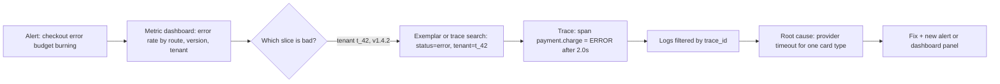
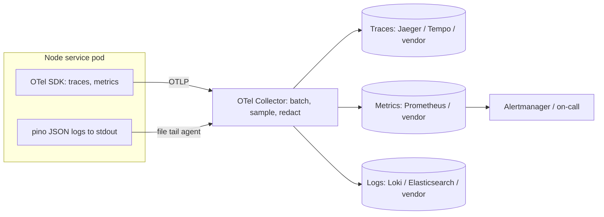

## Bối cảnh & vấn đề

Thứ Sáu, 16:40. Kênh support báo: "Khách của tenant `t_42` không checkout được." Team có một dashboard CPU/memory cho mỗi server, và mọi đường đều xanh. Log thì là `console.log` dạng text tự do nằm rải rác trên 12 pod. Một engineer SSH vào từng pod, `grep "checkout"`, thấy hàng nghìn dòng giống nhau, không biết dòng nào thuộc request lỗi. Sau 2 tiếng mới phát hiện payment service gọi sang một provider đang trả timeout cho riêng một loại thẻ. Không có gì sai trong cách engineer làm việc; hệ thống đơn giản là **không trả lời được câu hỏi** "request này đã đi đâu và chậm/lỗi ở đâu?".

Đây là khoảng cách giữa **monitoring** và **observability**. Dashboard CPU trả lời những câu hỏi mà ai đó đã nghĩ ra từ trước ("CPU có cao không?"). Sự cố thật hầu như luôn là câu hỏi chưa ai nghĩ ra: "chỉ tenant này, chỉ loại thẻ này, chỉ từ 16:20". Để trả lời được câu hỏi mới mà không phải deploy thêm code, telemetry phải đủ **giàu ngữ cảnh** (có `tenant_id`, `route`, `card_type`, `version`) và **liên kết được với nhau** (từ biểu đồ nhảy tới request cụ thể, từ request nhảy tới log).

Bài này đặt nền cho cả track: ba loại tín hiệu (logs, metrics, traces) mỗi loại mạnh ở đâu và đắt ở đâu, cách nối chúng, chọn stack nào, và một kế hoạch thực tế để đưa một team từ `console.log` tới mức có thể debug sự cố trong vài phút. Các bài sau đi sâu từng phần: [structured logging](/tracks/observability/learn/structured-logging), [metrics](/tracks/observability/learn/metrics-percentiles), [tracing](/tracks/observability/learn/tracing-opentelemetry), [SLO](/tracks/observability/learn/sli-slo-error-budget), [alerting](/tracks/observability/learn/alerting-burn-rate).

## Khái niệm

### Monitoring và observability

**Monitoring** là việc thu thập một tập chỉ số đã chọn trước và cảnh báo khi chúng vượt ngưỡng: error rate, latency, CPU, disk. Nó giỏi với "known unknowns": ta biết thứ gì có thể hỏng và theo dõi nó. **Observability** là một **thuộc tính của hệ thống**: mức độ mà ta có thể hiểu trạng thái bên trong chỉ bằng cách nhìn output (telemetry) của nó, kể cả cho những câu hỏi chưa từng nghĩ tới ("unknown unknowns").

Hai khái niệm không đối lập. Monitoring là một cách dùng telemetry (alert + dashboard); observability là việc telemetry đủ tốt để bạn **đặt câu hỏi tuỳ ý** rồi cắt lát dữ liệu theo bất kỳ chiều nào (tenant, version, region, loại thẻ) mà không cần deploy code mới. Một monolith nhỏ thường sống ổn với monitoring; một hệ thống phân tán nhiều service gần như bắt buộc cần observability vì một request đi qua 5–10 thành phần và lỗi thường là tổ hợp hiếm.

Ví dụ: "error rate `/checkout` > 1%" là câu hỏi monitoring. "Trong các request checkout lỗi từ 16:20, tỉ lệ nào là thẻ Amex của tenant enterprise chạy version 1.4.2?" là câu hỏi observability, và chỉ trả lời được nếu mỗi sự kiện mang các field đó.

**Interview angle:** đừng định nghĩa observability là "logs + metrics + traces". Interviewer muốn nghe "khả năng trả lời câu hỏi mới mà không deploy code mới", và ba tín hiệu chỉ là phương tiện.

### Metrics

**Metric** là một con số đo theo thời gian, đã được **tổng hợp** trước khi lưu: số request mỗi giây, tổng request lỗi, histogram latency. Mỗi tổ hợp tên metric + label (ví dụ `http_requests_total{route="/checkout",status_code="500"}`) là một **time series**: một dãy các cặp (timestamp, value). Vì đã tổng hợp, metric rất rẻ: một time series tốn vài byte mỗi mẫu bất kể có 10 hay 10 triệu request.

Metric mạnh nhất cho **alert và xu hướng**: "error rate của `/checkout` 10 phút qua là bao nhiêu?", "p99 latency tuần này so với tuần trước?". Điểm yếu: chi tiết bị mất khi tổng hợp. Bạn biết có 37 request lỗi, nhưng không biết request nào, của ai. Và mỗi label thêm vào nhân số time series lên, nên không được gắn label có hàng triệu giá trị như `user_id` (xem [cardinality](/tracks/observability/learn/metrics-percentiles)).

```text
http_requests_total{route="/checkout",status_code="200"} 120931
http_requests_total{route="/checkout",status_code="500"} 37
```

### Logs

**Log** là bản ghi của một **sự kiện rời rạc**, có timestamp và chi tiết: "order `o_123` fail lúc 10:02:11 vì `card_declined`". Log giữ ngữ cảnh đầy đủ nên là công cụ tốt nhất cho câu hỏi "vì sao chuyện này xảy ra với **đúng** request/order này?". Log tốt là **structured** (JSON có field cố định) để có thể filter và aggregate, không phải chuỗi tự do phải regex.

Điểm yếu là **chi phí theo volume**: mỗi request có thể sinh 5–20 dòng log, và vendor tính tiền theo GB ingest + thời gian lưu. Log cũng khó tổng hợp nhanh trên dữ liệu lớn. Vì vậy không nên dùng log để tính error rate cho alert khi đã có metric.

```json
{"level":"error","time":"2026-10-01T10:02:11.402Z","service":"payment-api","trace_id":"4f72f862eb211dcf562b63e41ff3bb45","tenant_id":"t_42","order_id":"o_123","err":{"type":"CardDeclined","code":"do_not_honor"},"msg":"charge failed"}
```

### Traces

**Trace** là đường đi của **một request** qua nhiều thành phần. Nó gồm nhiều **span**; mỗi span là một đơn vị công việc có tên, thời điểm bắt đầu/kết thúc, attribute và quan hệ cha-con. Trace trả lời câu hỏi mà log và metric đều khó trả lời: "trong 2 giây của request chậm này, bao nhiêu nằm ở DB, bao nhiêu ở payment provider, và chúng chạy tuần tự hay song song?".

Trace cần **context propagation**: mỗi service phải nhận `trace_id` từ caller (header `traceparent`) và truyền tiếp. Chỉ cần một service quên truyền là trace gãy làm hai. Trace cũng đắt nếu giữ 100%, nên thường phải **sampling** (xem [sampling](/tracks/observability/learn/sampling-pipeline-cost)).

```text
GET /checkout/:sku                 order-api       266.8ms
  GET                              order-api       207.8ms   (HTTP client)
    GET /stock/:sku                inventory-api   183.6ms
      pg-pool.connect              inventory-api    41.9ms
      pg.query:SELECT postgres     inventory-api   130.0ms
  price.calculate                  order-api        30.8ms
```

### Liên kết tín hiệu: trace_id, exemplar và chiều chung

Giá trị thật đến khi ba tín hiệu **nối được với nhau**. Có ba cơ chế:

- **`trace_id` trong mọi log line**: khi OpenTelemetry đang có span active, logger (pino + instrumentation) tự chèn `trace_id`, `span_id`. Từ một span trong UI tracing, bạn lọc log theo `trace_id` và thấy đúng các dòng của request đó.
- **Exemplar**: khi ghi một mẫu vào histogram metric, client lưu kèm `trace_id` của một request tiêu biểu. Trên biểu đồ latency, các điểm exemplar cho phép click từ "spike p99 lúc 14:03" thẳng sang một trace chậm cụ thể. Prometheus hỗ trợ lưu exemplar qua feature flag `exemplar-storage` (verify cho phiên bản bạn dùng).
- **Chiều chung (shared dimensions)**: cùng tên attribute ở cả ba tín hiệu: `service.name`, `service.version`, `deployment.environment`, `tenant.id`. Nhờ đó cùng một filter "version 1.4.2, tenant t_42" áp dụng được cho metric, log và trace.

**Interview angle:** câu followUp kinh điển là "từ spike latency trên dashboard, làm sao tới log của đúng request chậm?". Câu trả lời mạnh: exemplar (hoặc query trace theo khoảng thời gian + latency > X) → trace → log filter theo `trace_id`.

### Profiles và events: tín hiệu thứ tư

Ngoài ba tín hiệu kinh điển, **continuous profiling** (Pyroscope, Parca, Datadog Profiler) lấy mẫu stack trace liên tục ở production với overhead thấp, trả lời "function nào đang ăn CPU/heap?". OpenTelemetry đang chuẩn hoá profiles như một signal mới (trạng thái còn đang phát triển, verify). Một số team (Honeycomb) đi theo hướng **wide events**: mỗi request là một event lớn với hàng trăm field, và metric/trace được suy ra từ đó. Hai hướng không mâu thuẫn; điều quan trọng là dữ liệu có ngữ cảnh và nối được.

## Cơ chế hoạt động

Luồng chuẩn khi điều tra một sự cố là đi từ **rộng** (metric, rẻ, đầy đủ) tới **hẹp** (trace và log, chi tiết nhưng chỉ một phần).



Diễn giải: alert bắn từ **metric** vì metric được tính trên **toàn bộ** request (không bị sampling) và rẻ để đánh giá mỗi 30 giây. Dashboard cho phép cắt lát theo label có cardinality thấp (route, version, tenant tier). Khi đã biết lát nào hỏng, bạn chuyển sang **trace** của lát đó: exemplar trên biểu đồ hoặc tìm trace theo attribute. Trace chỉ ra **span nào** fail hoặc chậm. Cuối cùng, **log** theo `trace_id` cho chi tiết mà span không có: payload đã chuẩn hoá, error code của provider, nhánh logic đã chạy.

Mỗi bước giảm khối lượng dữ liệu nhưng tăng chi tiết. Nếu thiếu một mắt xích (log không có `trace_id`, metric không có label `version`), bạn rơi về grep thủ công. Đây là lý do mọi kế hoạch observability bắt đầu bằng việc **chuẩn hoá ngữ cảnh** chứ không phải mua tool.

Về mặt hạ tầng, ba tín hiệu thường đi qua một pipeline chung:



App chỉ biết **OTLP** và stdout; mọi quyết định về backend, sampling, redaction nằm ở Collector. Điều này cho phép đổi vendor mà không đụng code (chi tiết ở bài [sampling và Collector](/tracks/observability/learn/sampling-pipeline-cost)).

## Ví dụ thực tế

### Ba tín hiệu của cùng một request, đo thật

Hai service Node 24 (`order-api` gọi `inventory-api`, inventory query Postgres 16), instrument bằng OpenTelemetry SDK (`@opentelemetry/sdk-node` 0.222, auto-instrumentations 0.80) và export OTLP tới Jaeger 2.11 chạy trong Docker. Lệnh chạy:

```bash
docker run -d --name obs-jaeger -p 16686:16686 -p 4318:4318 jaegertracing/jaeger:2.11.0
SVC=inventory-api node --require ./tracing.cjs inventory.cjs &
SVC=order-api     node --require ./tracing.cjs order.cjs &
curl -s http://127.0.0.1:4101/checkout/SKU-1
```

**Log** của `order-api` (pino, không viết dòng nào để thêm `trace_id`; instrumentation pino tự chèn):

```text
{"level":30,"time":1790825238047,"service":"order-api","trace_id":"4f72f862eb211dcf562b63e41ff3bb45","span_id":"17b542b0f786296e","trace_flags":"01","sku":"SKU-1","msg":"checkout done"}
```

Header mà `inventory-api` nhận được (cùng trace id, span id là span HTTP client của caller):

```text
inventory got traceparent: 00-4f72f862eb211dcf562b63e41ff3bb45-c53d864a0a48e671-01
```

**Trace** lấy từ Jaeger API `GET /api/traces/4f72f862...` (rút gọn, thụt lề theo quan hệ cha-con):

```text
traceID 4f72f862eb211dcf562b63e41ff3bb45 spans 16
order-api      GET /checkout/:sku                     +   0.0ms   266.8ms
        order-api      GET                                    +  20.0ms   207.8ms
          inventory-api  GET /stock/:sku                        +  40.0ms   183.6ms
                  inventory-api  pg-pool.connect                        +  46.0ms    41.9ms
                  inventory-api  pg.query:SELECT postgres               +  89.0ms   130.0ms
        order-api      price.calculate                        + 231.0ms    30.8ms
```

Đọc kết quả: request mất 267 ms; 208 ms là chờ inventory; bên trong inventory, 42 ms là **mở connection Postgres** lần đầu (pool rỗng) và 130 ms là query. Không log hay metric nào cho bạn thấy ngay "42 ms là chờ pool". Ngược lại, trace không cho biết tỉ lệ lỗi của cả hệ thống; đó là việc của metric. Cùng một `trace_id` xuất hiện ở log, header và trace: đây chính là "liên kết".

### Chọn tín hiệu cho từng câu hỏi

| Câu hỏi | Tín hiệu tốt nhất | Vì sao |
| --- | --- | --- |
| Error rate `/checkout` 10 phút qua? | Metric | Tính trên 100% request, rẻ, alert được |
| Vì sao order `o_123` fail? | Log (theo `order_id` hoặc `trace_id`) | Cần chi tiết riêng của sự kiện |
| 2 giây của request chậm nằm ở đâu? | Trace | Thấy từng hop và critical path |
| p99 tuần này so với tuần trước? | Metric (histogram) | Lưu lâu, aggregate được |
| Tenant nào bị ảnh hưởng nhiều nhất? | Log/trace (high-cardinality) hoặc metric theo tier | `tenant_id` có thể quá nhiều giá trị cho metric |

### Trả lời câu hỏi CV: "bạn dùng tool gì, tìm request lỗi của một tenant thế nào?"

Câu hỏi kiểu observability-040 kiểm tra bạn có **chiến lược correlation** hay chỉ "xem log server". Một khung trả lời (điền số liệu và tool thật của bạn):

1. **Hiện trạng**: log đi đâu (ví dụ CloudWatch Logs hoặc Elasticsearch), format (JSON hay text), có `request_id`/`tenant_id` không, dashboard và alert gì.
2. **Luồng tìm một request**: user báo lỗi kèm thời gian và tenant → support lấy `x-request-id` từ response header hoặc từ màn hình lỗi → query log `tenant_id = X AND request_id = Y` → thấy service và exception → nếu có tracing, mở trace để thấy hop chậm/lỗi → kiểm tra DB (slow query log, lock).
3. **Khoảng trống thành thật**: ví dụ "chưa có distributed tracing nên giữa các service phải ghép theo `request_id` và thời gian", và bạn sẽ cải thiện bằng OTel + `AsyncLocalStorage` + `tenant_id` trên mọi log line.

## Trade-offs & lựa chọn thay thế

| Tín hiệu | Mạnh | Yếu | Chi phí tăng theo |
| --- | --- | --- | --- |
| Metrics | Rẻ, lưu lâu, alert, xu hướng; tính trên 100% traffic | Mất chi tiết; label high-cardinality làm nổ số series | Số time series active |
| Logs | Chi tiết đầy đủ, ngữ cảnh nghiệp vụ | Đắt khi volume lớn; khó aggregate nếu không structured | GB ingest + retention |
| Traces | Thấy latency qua nhiều service, critical path, song song/tuần tự | Cần propagation đúng ở mọi hop; phải sampling | Số span giữ lại |
| Profiles | Thấy function nào tốn CPU/heap ở prod | Ít tool chuẩn, khó nối với request cụ thể | Số mẫu, thời gian lưu |

**Chọn stack**: có ba họ lựa chọn chính.

| Tiêu chí | Self-hosted OSS (Prometheus, Grafana, Loki, Tempo/Jaeger) | SaaS (Datadog, New Relic, Honeycomb, Grafana Cloud) | Cloud-native (CloudWatch, X-Ray, Azure Monitor) |
| --- | --- | --- | --- |
| Chi phí license | Không, nhưng tốn hạ tầng + người vận hành | Theo host, custom metric, GB log, span: dễ vượt ngân sách | Theo usage, thường rẻ khi nhỏ |
| Công vận hành | Cao: scale Prometheus, retention, HA, upgrade | Gần như không | Thấp |
| UX, correlation | Tốt nếu cấu hình đúng (Grafana nối exemplar/log) | Rất mạnh, có sẵn APM, RUM | Hạn chế hơn, query kém linh hoạt |
| Lock-in | Thấp | Cao nếu dùng agent riêng; giảm bằng OTel | Cao, kém multi-cloud |
| Data residency | Tự quản | Phụ thuộc region của vendor | Theo region cloud |

Khi nào chọn gì: team nhỏ, chạy hoàn toàn trên một cloud, ngân sách hạn chế → bắt đầu với cloud-native và OTel. Team có platform/SRE và volume lớn (chi phí SaaS hàng trăm nghìn USD/năm) → self-hosted hoặc hybrid (metrics tự host, traces SaaS). Team cần tốc độ và UX, ít người vận hành → SaaS, nhưng **luôn instrument bằng OpenTelemetry và đi qua Collector** để giữ quyền chuyển đổi và kiểm soát volume trước khi dữ liệu tới vendor.

## Edge cases & failure modes

- **Observability sập cùng hệ thống**: Prometheus chạy trong cùng cluster bị OOM vì cardinality, hoặc logging agent làm đầy disk node. Tách monitoring stack (hoặc ít nhất alert "meta-monitoring": alert khi không nhận được dữ liệu) và đặt giới hạn tài nguyên cho agent.
- **Telemetry làm chậm app**: export đồng bộ, log `JSON.stringify` object khổng lồ, span cho mỗi vòng lặp. Luôn batch, async, và đo overhead (thường mục tiêu < 1–3% CPU).
- **Mất dữ liệu đúng lúc cần nhất**: khi pod bị OOMKilled, buffer span/log trong memory mất theo; khi traffic spike, Collector drop vì `memory_limiter`. Cần metric về chính pipeline (`otelcol_exporter_send_failed_spans`, dropped logs).
- **Clock skew** giữa các host làm span con nằm ngoài span cha, log sắp xếp sai thứ tự. Đồng bộ NTP/chrony, và tin vào quan hệ cha-con hơn là timestamp tuyệt đối.
- **Chiều không thống nhất**: service A dùng `tenantId`, B dùng `tenant_id`, C dùng `org`. Không filter chung được. Chuẩn hoá theo semantic conventions và một thư viện logging/telemetry nội bộ.
- **Sampling làm sai số liệu**: tính error rate từ trace đã sample 5% cho kết quả sai lệch (và nếu tail sampling giữ mọi lỗi thì error rate "từ trace" bị phóng đại). Metric phải tính trên 100% request.

## Pitfalls

- ❌ Định nghĩa observability là "có đủ ba tín hiệu" → ✅ khả năng hỏi câu hỏi mới mà không deploy code mới; ba tín hiệu chỉ có giá trị khi có ngữ cảnh và nối được.
- ❌ Dùng log để tính error rate cho alert → ✅ metric counter tính trên 100% request; log dùng để giải thích từng sự kiện.
- ❌ Mỗi team tự chọn tên field → ✅ một thư viện chung + semantic conventions (`service.name`, `deployment.environment`, `tenant.id`).
- ❌ Mua SaaS rồi cài agent riêng của vendor vào mọi service → ✅ OTel SDK + Collector, vendor chỉ là exporter.
- ❌ Bắt đầu bằng "dashboard đẹp cho mọi thứ" → ✅ bắt đầu từ sự cố gần nhất: lần đó mất bao lâu để tìm root cause, thiếu dữ liệu gì.
- ❌ Đặt monitoring stack trong cùng failure domain với app mà không có meta-monitoring → ✅ alert khi mất dữ liệu ("absent()"), heartbeat từ bên ngoài.

### Kế hoạch 90 ngày cho team chỉ có `console.log`

Câu hỏi senior observability-034 không có đáp án duy nhất, nhưng một kế hoạch tốt có thứ tự **giá trị trên công sức** và có số đo trước/sau:

- **Tuần 0**: hỏi "sự cố gần nhất mất bao lâu để phát hiện (MTTD) và khắc phục (MTTR)? thiếu dữ liệu gì?". Ghi lại làm baseline.
- **Tuần 1–3**: structured logging (pino) với `request_id`/`trace_id`, `tenant_id`, `service`, `version`; log ra stdout; redact PII. Dashboard RED cho 3–5 service chính. Xoá các alert CPU vô nghĩa, thêm alert theo triệu chứng (error rate, latency, synthetic check) có runbook.
- **Tuần 4–8**: OTel auto-instrumentation + Collector; trace cho luồng quan trọng nhất (checkout); runtime metrics Node (event loop delay, heap, pool); frontend error tracking + Web Vitals.
- **Tuần 8–12**: định nghĩa SLO với product cho 2–3 user journey, burn-rate alert, quy trình incident + template postmortem, on-call rotation.
- **Nguyên tắc**: làm cho developer **muốn** dùng (một package `@company/telemetry` cài là chạy, golden path), đo MTTD/MTTR lại sau 90 ngày, và thuyết phục product bằng chi phí của sự cố gần nhất (giờ engineer, doanh thu mất).

## Tóm tắt

- Monitoring trả lời câu hỏi biết trước; observability là khả năng trả lời câu hỏi **mới** từ telemetry giàu ngữ cảnh.
- **Metrics**: rẻ, tính trên 100% traffic, dùng cho alert và xu hướng; không chịu được label high-cardinality.
- **Logs**: chi tiết từng sự kiện; phải structured; chi phí theo GB.
- **Traces**: đường đi của một request qua nhiều service; cần propagation và sampling.
- Giá trị nằm ở **liên kết**: `trace_id` trong log, exemplar trên histogram, cùng tên attribute ở mọi tín hiệu.
- Điều tra đi từ rộng tới hẹp: metric → trace → log.
- Chọn stack theo volume, ngân sách, năng lực vận hành, data residency; luôn dùng OTel + Collector để tránh lock-in.
- Kế hoạch observability bắt đầu từ sự cố thật và đo MTTD/MTTR trước và sau.
