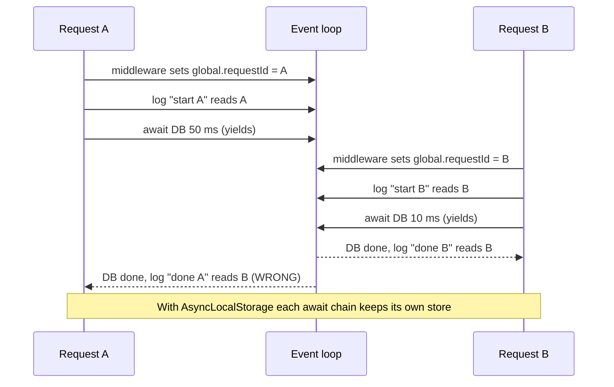
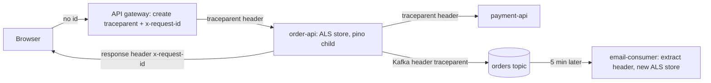

## Bối cảnh & vấn đề

Một service Express có đoạn middleware "đơn giản" để gắn request ID vào log:

```ts
app.use((req, _res, next) => {
  (global as any).requestId = req.headers["x-request-id"] ?? crypto.randomUUID();
  next();
});
export function log(msg: string) {
  console.log(`${new Date().toISOString()} [${(global as any).requestId}] ${msg}`);
}
```

Ở môi trường dev với một request một lúc, log trông hoàn hảo. Ở production, support điều tra order B của khách và thấy dòng `[req-A] done order B`: log gắn **nhầm** request ID. Kỹ sư đi theo `req-A` và mất một giờ đọc nhầm câu chuyện của một request khác. Log sai còn nguy hiểm hơn không có log, vì nó tạo ra niềm tin giả.

Nguyên nhân nằm ở mô hình của Node: **một thread JavaScript xử lý xen kẽ nhiều request**. Mỗi `await` là một điểm mà request khác có thể chạy, ghi đè biến global. Bài này giải thích cách làm đúng: log có cấu trúc (JSON với field cố định), correlation ID đi theo request qua mọi service và message, `AsyncLocalStorage` để giữ ngữ cảnh mà không phải truyền tham số qua mọi hàm, và thiết kế logging cho hệ thống multi-tenant sao cho support debug nhanh mà không lộ dữ liệu.

## Khái niệm

### Structured logging

**Structured logging** nghĩa là mỗi log line là một **object có field cố định** (thường là JSON một dòng), thay vì chuỗi tự do. So sánh:

```text
2026-10-01 10:02:11 ERROR payment failed for order o_123 tenant t_42 after 2010ms
{"level":"error","time":"2026-10-01T10:02:11.402Z","service":"payment-api","tenant_id":"t_42","order_id":"o_123","duration_ms":2010,"msg":"payment failed"}
```

Dòng đầu chỉ đọc được bằng mắt; muốn lọc theo tenant phải viết regex, và regex vỡ ngay khi ai đó đổi câu chữ. Dòng thứ hai query được: `level = "error" AND tenant_id = "t_42"`, aggregate được (`avg(duration_ms) by service`), và parse không cần đoán. Trong hệ thống microservices, structured log là điều kiện để **ghép** log từ 10 service theo cùng một field (`trace_id`, `order_id`).

Một bộ field nền tảng cho mọi dòng: `time`, `level`, `msg`, `service`, `version` (git SHA), `env`, `trace_id`, `span_id`, `request_id`, `tenant_id`; và cho lỗi: `err.type`, `err.message`, `err.stack`. Field nghiệp vụ (`order_id`, `payment_provider`) thêm theo ngữ cảnh.

**Interview angle:** interviewer muốn nghe "query/aggregate được, ghép được giữa các service", không chỉ "JSON đẹp hơn".

### Log level và log ra stdout

**Log level** phân loại mức nghiêm trọng: `fatal` (process sắp chết), `error` (thao tác thất bại cần người xem), `warn` (bất thường nhưng tự xử lý được, như retry thành công), `info` (sự kiện nghiệp vụ quan trọng: order created), `debug`/`trace` (chi tiết cho dev, tắt ở prod). Chọn level sai gây hai hậu quả: log `error` cho 404 bình thường làm alert trên log error vô nghĩa; log mọi thứ ở `info` làm hoá đơn logging tăng gấp đôi.

Theo **12-factor**, app ghi log ra **stdout** như một luồng sự kiện, và để platform (Docker, Kubernetes, agent Fluent Bit/Vector/OTel Collector) thu gom, gắn metadata (pod, node), và gửi đi. App không tự ghi file, không tự xoay vòng file, không tự gửi HTTP tới vendor. Lý do: tách quyết định "log đi đâu" khỏi code, và không để app chết vì vendor logging chậm.

### pino: logger JSON nhanh cho Node

**pino** là logger phổ biến nhất cho Node khi cần hiệu năng: mặc định ghi JSON một dòng ra stdout, rất ít allocation, và đẩy việc định dạng đẹp (`pino-pretty`) ra process khác. Các tính năng quan trọng:

- `base`: field có trong mọi dòng (`service`, `version`).
- `child(bindings)`: tạo logger con mang sẵn field (`request_id`, `tenant_id`). Rẻ, nên tạo một child cho mỗi request.
- `redact`: danh sách **đường dẫn** field cần che (`req.headers.authorization`, `*.password`), thay bằng `[Redacted]` hoặc xoá.
- `serializers`: chuẩn hoá object như `err`, `req`, `res` để không log nguyên object khổng lồ.

```ts
import pino from "pino";
export const logger = pino({
  base: { service: "order-api", version: process.env.GIT_SHA },
  redact: ["req.headers.authorization", "req.headers.cookie", "*.password", "*.cardNumber"],
  timestamp: pino.stdTimeFunctions.isoTime,
});
logger.info({ orderId: "o_123", tenantId: "t_42", durationMs: 41 }, "order created");
```

**Interview angle:** biết `redact` là **allowlist theo đường dẫn** (chỉ che field bạn liệt kê) là điểm cộng; nó không tự phát hiện email hay số thẻ ở field khác.

### Correlation ID

**Correlation ID** là một ID duy nhất gắn với một request hoặc một luồng nghiệp vụ, xuất hiện trong **mọi log line** liên quan và được **truyền tiếp** sang mọi service, queue, job mà request đó kích hoạt. Nhờ nó, một câu query trả về toàn bộ câu chuyện của request qua 6 service.

Có hai dạng phổ biến. `x-request-id` là header tự đặt, thường do gateway/load balancer tạo. **W3C Trace Context** (`traceparent`) là chuẩn của tracing: `00-<trace-id 32 hex>-<parent span-id 16 hex>-<flags>`. Khi đã dùng OpenTelemetry, nên dùng chính `trace_id` làm correlation ID: không phải duy trì hai hệ ID, và log nối thẳng với trace. Nhiều team giữ cả hai: `trace_id` cho kỹ thuật, `request_id` ngắn hơn để trả cho user/support.

Quy tắc truyền: HTTP dùng header; Kafka/SQS/RabbitMQ dùng **message header/attribute** (không nhét vào payload nghiệp vụ nếu tránh được); job queue (BullMQ) lưu trong job data. Trả ID trong **response header** để khi user báo lỗi, support có ngay ID để tra.

### AsyncLocalStorage

`AsyncLocalStorage` (module `node:async_hooks`) cho phép lưu một **store** gắn với **chuỗi thao tác bất đồng bộ** bắt đầu từ `als.run(store, fn)`. Mọi code chạy trong `fn` và mọi callback, promise, timer được tạo ra từ đó (dù qua bao nhiêu `await`) đều đọc được đúng store đó bằng `als.getStore()`. Request khác chạy `als.run` với store riêng, nên hai request xen kẽ không bao giờ thấy store của nhau.

Cơ chế bên dưới: Node gán ngữ cảnh cho mỗi **async resource** (promise, timer, socket callback) lúc nó được tạo, và khôi phục ngữ cảnh đó khi callback chạy. Từ Node 24, `AsyncLocalStorage` mặc định dùng triển khai dựa trên `AsyncContextFrame` thay vì async_hooks, nhanh hơn (verify theo phiên bản của bạn). OpenTelemetry Node cũng dùng chính cơ chế này (`AsyncLocalStorageContextManager`) để biết span nào đang active.

```ts
import { AsyncLocalStorage } from "node:async_hooks";
const als = new AsyncLocalStorage<{ requestId: string }>();
als.run({ requestId: "req-A" }, async () => {
  await new Promise((r) => setTimeout(r, 10));
  console.log(als.getStore()?.requestId); // "req-A", even after await
});
```

**Interview angle:** câu followUp "context bị mất ở đâu?" (xem Edge cases) phân biệt người đã dùng thật với người chỉ đọc docs.

## Cơ chế hoạt động

Sơ đồ dưới cho thấy vì sao biến global sai và `AsyncLocalStorage` đúng khi hai request xen kẽ trên cùng event loop.



Bước quan trọng là `await`: request A nhường event loop, B chạy middleware và **ghi đè** biến global. Khi A tiếp tục, nó đọc giá trị của B. Thứ tự cụ thể phụ thuộc vào thời gian I/O, nên lỗi xuất hiện ngẫu nhiên và chỉ dưới tải đồng thời, đúng loại bug khó tái hiện nhất. Với `AsyncLocalStorage`, store được gắn vào chuỗi async của A lúc `als.run`, và Node khôi phục đúng store khi callback của A chạy lại, bất kể B đã làm gì.

Luồng correlation ID qua nhiều service và một message bất đồng bộ:



Gateway tạo ID nếu client chưa gửi (và **không tin** ID từ internet một cách mù quáng: kiểm tra định dạng, giới hạn độ dài để tránh log injection). Mỗi service đọc header ở middleware, mở một `als.run` với child logger, và mọi HTTP client/producer truyền header tiếp. Consumer chạy 5 phút sau không có request HTTP nào; nó **extract** header từ message và mở store mới với cùng `trace_id` (hoặc tạo span link, xem bài [tracing](/tracks/observability/learn/tracing-opentelemetry)).

## Ví dụ thực tế

### Tái hiện bug biến global và sửa bằng AsyncLocalStorage + pino

Script chạy thật trên Node 24.21, express 5.2.1, pino 10.3.1. Hai request A (DB chậm 50 ms) và B (10 ms) được gửi đồng thời tới bản lỗi (port 4001) rồi tới bản sửa (port 4002).

```ts
import express from "express";
import { AsyncLocalStorage } from "node:async_hooks";
import pino from "pino";
const sleep = (ms: number) => new Promise((r) => setTimeout(r, ms));

// broken: global variable
const bad = express();
bad.use((req, _res, next) => { (globalThis as any).requestId = req.headers["x-request-id"]; next(); });
const badLog = (msg: string) => console.log(`[bad] [${(globalThis as any).requestId}] ${msg}`);
bad.get("/order/:id", async (req, res) => {
  badLog(`start order ${req.params.id}`);
  await sleep(req.params.id === "A" ? 50 : 10);
  badLog(`done order ${req.params.id}`);
  res.json({ ok: true });
});

// fixed: AsyncLocalStorage + pino child logger
const als = new AsyncLocalStorage<{ log: pino.Logger }>();
const base = pino({ base: { service: "order-api" }, timestamp: pino.stdTimeFunctions.isoTime,
  redact: ["req.headers.authorization", "*.password", "*.cardNumber"] });
const logger = () => als.getStore()?.log ?? base;
const good = express();
good.use((req, res, next) => {
  const requestId = (req.headers["x-request-id"] as string) ?? crypto.randomUUID();
  res.setHeader("x-request-id", requestId);
  als.run({ log: base.child({ request_id: requestId, tenant_id: req.headers["x-tenant-id"] }) }, next);
});
good.get("/order/:id", async (req, res) => {
  logger().info({ orderId: req.params.id }, "start order");
  await sleep(req.params.id === "A" ? 50 : 10);
  logger().info({ orderId: req.params.id, user: { email: "a@b.c", password: "hunter2" } }, "done order");
  res.json({ ok: true });
});
```

Output thật:

```text
[bad] [req-B] start order B
[bad] [req-A] start order A
[bad] [req-A] done order B
[bad] [req-A] done order A
{"level":30,"time":"2026-10-01T03:24:38.856Z","service":"order-api","request_id":"req-A","tenant_id":"t_42","orderId":"A","msg":"start order"}
{"level":30,"time":"2026-10-01T03:24:38.857Z","service":"order-api","request_id":"req-B","tenant_id":"t_42","orderId":"B","msg":"start order"}
{"level":30,"time":"2026-10-01T03:24:38.868Z","service":"order-api","request_id":"req-B","tenant_id":"t_42","orderId":"B","user":{"email":"a@b.c","password":"[Redacted]"},"msg":"done order"}
{"level":30,"time":"2026-10-01T03:24:38.907Z","service":"order-api","request_id":"req-A","tenant_id":"t_42","orderId":"A","user":{"email":"a@b.c","password":"[Redacted]"},"msg":"done order"}
```

Ba điểm đọc được từ output. Thứ nhất, dòng `[req-A] done order B` là bằng chứng bug: order B được gắn ID của A. Thứ hai, bản ALS gắn đúng `request_id` cho từng dòng dù hai request xen kẽ. Thứ ba, `password` bị che nhưng **`email` vẫn lộ**: `redact` chỉ che đúng đường dẫn đã liệt kê. Bài học: redaction ở logger là lớp đầu, cần thêm quy tắc "không log object user nguyên khối" và một lớp redaction ở Collector.

### Truyền correlation ID qua Kafka (minh hoạ)

Đoạn dưới minh hoạ cách producer gắn `traceparent` vào message header và consumer mở lại ngữ cảnh. Phần inject/extract bằng OpenTelemetry API đã được chạy thật trong bài [tracing](/tracks/observability/learn/tracing-opentelemetry); ở đây chỉ là khung code kafkajs (minh hoạ).

```ts
import { context, propagation } from "@opentelemetry/api";
// producer
const headers: Record<string, string> = {};
propagation.inject(context.active(), headers);       // adds traceparent (+ tracestate)
headers["x-request-id"] = currentRequestId();
await producer.send({ topic: "orders", messages: [{ key: order.id, value: JSON.stringify(order), headers }] });

// consumer
await consumer.run({
  eachMessage: async ({ message }) => {
    const carrier = Object.fromEntries(Object.entries(message.headers ?? {}).map(([k, v]) => [k, v?.toString() ?? ""]));
    const ctx = propagation.extract(context.active(), carrier);
    await context.with(ctx, () =>
      als.run({ log: base.child({ request_id: carrier["x-request-id"], kafka_offset: message.offset }) }, () => handle(message)));
  },
});
```

### Thiết kế logging cho nền tảng multi-tenant

Yêu cầu: support debug sự cố của một tenant trong vài phút, nhưng không rò dữ liệu giữa tenant và không lưu PII. Thiết kế gồm các lớp:

1. **Ngữ cảnh bắt buộc**: mọi log/span có `tenant_id`, `trace_id`, `request_id`; `user_id` dạng **pseudonymous** (ID nội bộ hoặc hash có salt), không email/tên/địa chỉ/số điện thoại. Middleware chung đặt các field này vào ALS store; dev không phải nhớ.
2. **Redaction hai lớp**: pino `redact` cho header nhạy cảm và field đã biết; Collector (`attributes`/`transform` processor) xoá hoặc hash field như `user.email`, `enduser.id` phòng khi dev quên. Ví dụ Collector đã chạy thật ở bài [sampling](/tracks/observability/learn/sampling-pipeline-cost): `user.email` bị xoá, `enduser.id` được hash.
3. **Phân quyền truy cập**: support xem log theo vai trò; nếu cho tenant tự xem log của họ, filter `tenant_id` phải được **áp cứng ở tầng query** (API của bạn thêm điều kiện), không để người dùng tự viết query.
4. **Log level động theo tenant**: bật `debug` cho riêng `t_42` trong 30 phút qua feature flag (logger kiểm tra flag trong ALS store) thay vì bật debug toàn hệ thống.
5. **Retention theo loại**: log ứng dụng 7–30 ngày ở hot storage, audit log lâu hơn theo quy định; nhớ GDPR "quyền được xoá": log chứa PII gần như không thể xoá chọn lọc, càng là lý do không log PII.
6. **Sampling có chọn lọc**: sample log `info` volume cao (health check, poll), **không** sample `error` và audit log.

Khi tenant yêu cầu "toàn bộ log liên quan tới tài khoản cho audit": trả lời bằng **audit log** (ai làm gì, khi nào) đã được thiết kế cho mục đích đó, không xuất raw application log (vì có thể chứa dữ liệu nội bộ hoặc metadata của hệ thống), và có quy trình phê duyệt.

## Trade-offs & lựa chọn thay thế

| Lựa chọn | Ưu | Nhược | Khi nào dùng |
| --- | --- | --- | --- |
| Truyền `requestId` qua tham số mọi hàm | Tường minh, không "ma thuật" | Làm bẩn mọi signature, dễ quên ở thư viện | Code nhỏ, hoặc ranh giới hàm thuần |
| Biến global / module-level | Đơn giản | **Sai** khi có request đồng thời | Không bao giờ cho dữ liệu per-request |
| `AsyncLocalStorage` tự viết | Không phụ thuộc, kiểm soát hoàn toàn | Phải tự lo propagation sang HTTP client, queue | Service chưa có OTel |
| OTel context (`trace_id` từ active span) | Chuẩn, nối log với trace, auto-instrumentation | Cần setup SDK đúng thứ tự load | Mặc định cho hệ thống nhiều service |
| pino | Rất nhanh, JSON mặc định, `redact`, child | Ít "transport" kiểu plugin trong process (chủ ý) | Hầu hết service Node |
| winston | Nhiều transport, format linh hoạt | Chậm hơn, dễ cấu hình ra text | Code cũ đã dùng, nhu cầu transport đặc biệt |

Khi nào chọn cái nào: service mới dùng pino + OTel, lấy `trace_id` từ active span làm correlation ID, và bổ sung `request_id` nếu cần ID ngắn cho support. Nếu chưa có OTel, dùng `AsyncLocalStorage` với `x-request-id`, nhưng đặt tên field giống semantic conventions để sau này chuyển sang OTel không phải sửa query.

## Edge cases & failure modes

- **Context bị mất**: thư viện dùng connection pool hoặc queue callback tự quản (một số driver cũ, `EventEmitter` được tạo **trước** `als.run` và emit sau) sẽ chạy callback trong ngữ cảnh của nơi tạo emitter. Dấu hiệu: log thiếu `request_id` hoặc mang `request_id` cũ. Phát hiện bằng cách đếm log line không có `request_id` trong các route có middleware, hoặc test song song hai request và assert ID. Sửa bằng `AsyncResource.bind(fn)` hoặc `als.run` lại tại điểm vào callback.
- **`enterWith` rò ngữ cảnh**: `als.enterWith(store)` gán store cho phần còn lại của tick hiện tại, có thể dính sang code không liên quan. Ưu tiên `als.run`.
- **Log injection**: ID hoặc message lấy từ user chứa `\n` và JSON giả. Structured logger escape chuỗi trong JSON nên an toàn hơn text; vẫn nên validate định dạng `x-request-id` và giới hạn độ dài.
- **Log object khổng lồ**: `logger.info({ body: req.body })` với payload 5 MB làm `JSON.stringify` block event loop và tăng hoá đơn. Log trường đã chọn, giới hạn kích thước, dùng serializer.
- **Stdout bị nghẽn**: khi đích nhận log chậm, pipe stdout đầy; pino ghi bất đồng bộ (`pino.destination({ sync: false })`) có thể **mất log cuối** khi process crash. Dùng `pino.final`/flush khi shutdown, và chấp nhận trade-off tốc độ vs độ bền.
- **Error log bùng nổ khi sự cố**: một dependency chết làm mỗi request log 3 dòng error kèm stack; volume tăng 50 lần đúng lúc pipeline cần ổn định nhất. Rate-limit log lặp lại hoặc log một lần với counter.

## Pitfalls

- ❌ Lưu request ID trong biến global hoặc module-level → ✅ `AsyncLocalStorage` hoặc OTel context, vì Node xen kẽ nhiều request trên một thread.
- ❌ `console.log` với chuỗi tự do → ✅ pino JSON với field cố định, vì chỉ structured log mới query và ghép được.
- ❌ Tin rằng `redact` che mọi dữ liệu nhạy cảm → ✅ nó chỉ che đường dẫn đã liệt kê; thêm quy tắc "không log object user/body nguyên khối" và redaction ở Collector.
- ❌ Log `error` cho 4xx do client → ✅ `warn` hoặc `info` cho lỗi dự kiến, `error` cho lỗi cần người xem; nếu không alert trên log error trở nên vô nghĩa.
- ❌ Tạo correlation ID mới ở mỗi service → ✅ đọc từ header, chỉ tạo khi không có, và truyền tiếp qua HTTP lẫn message header.
- ❌ Quên trả ID cho client → ✅ đặt `x-request-id` trong response header và hiển thị trên trang lỗi để support tra cứu.
- ❌ App tự gửi log HTTP tới vendor → ✅ ghi stdout, agent/Collector gửi đi; app không chết theo vendor.

## Tóm tắt

- Structured log = JSON một dòng với field cố định (`time`, `level`, `msg`, `service`, `version`, `trace_id`, `request_id`, `tenant_id`), query và ghép được giữa service.
- Log ra stdout; platform thu gom. Level đúng; không log PII/secret.
- Correlation ID đi theo request qua HTTP header (`traceparent`/`x-request-id`), message header, job data; trả lại trong response header.
- Biến global gắn nhầm ID dưới tải đồng thời; `AsyncLocalStorage` giữ store theo chuỗi async của từng request.
- pino `child` cho logger per request, `redact` theo đường dẫn (không tự phát hiện email).
- Multi-tenant: `tenant_id` mọi nơi, user ID pseudonymous, redaction hai lớp, filter tenant áp cứng, debug level theo tenant, retention theo loại.
- Context có thể mất qua emitter/pool tự quản; phát hiện bằng test song song và đếm log thiếu ID.
