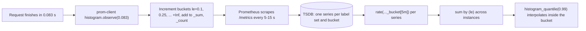
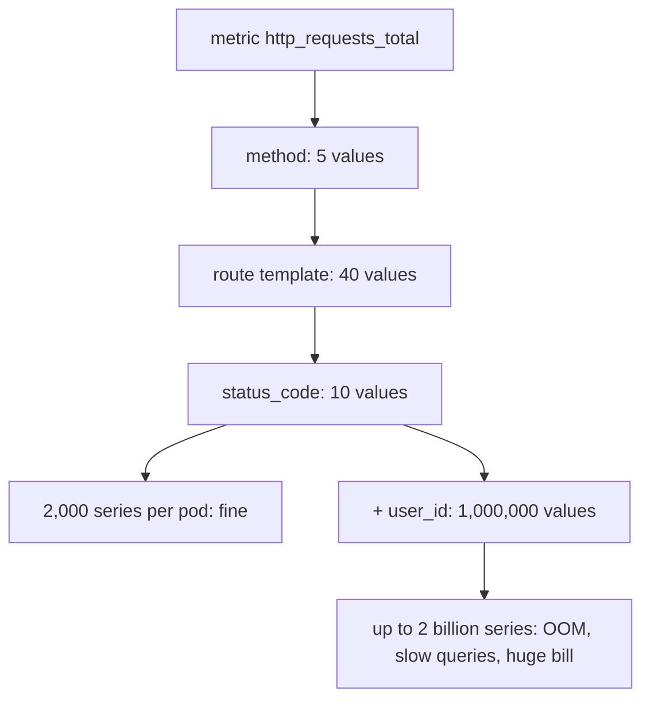

## Bối cảnh & vấn đề

Dashboard của API listing sản phẩm hiển thị "latency trung bình 176 ms", ổn định cả tuần. Trong khi đó, đội sales nhận phàn nàn từ một khách enterprise: "trang danh mục mất 5 giây". Cả hai đều đúng. 2% request (của những tenant có danh mục khổng lồ) mất 4–6 giây, 98% còn lại mất 80 ms, và trung bình cộng của hai nhóm cho ra một con số không mô tả **ai cả**.

Cùng tuần đó, một developer muốn "xem request của từng user" nên thêm label `userId` và `url` vào counter `http_requests_total`. Sau hai ngày, Prometheus dùng 3 lần RAM, query dashboard timeout, và hoá đơn vendor metric tăng vọt vì tính tiền theo số time series.

Hai sự cố này có chung gốc: không hiểu **metric được lưu và tổng hợp thế nào**. Bài này giải thích bốn loại metric, vì sao latency phải đo bằng percentile từ histogram, cách PromQL tính percentile đúng khi có nhiều instance, cardinality là gì và vì sao nó là biến số chi phí số một, và cách trả lời câu hỏi "làm sao biết API đủ nhanh?" bằng số đo thay vì cảm giác.

## Khái niệm

### Time series và label

Prometheus lưu dữ liệu dạng **time series**: mỗi series được xác định bởi **tên metric + tập label** (cặp key=value), và chứa một dãy mẫu (timestamp, float). `http_requests_total{route="/products",status_code="200",instance="pod-1"}` và cùng tên nhưng `instance="pod-2"` là hai series khác nhau. Prometheus **scrape** (kéo) endpoint `/metrics` của mỗi target theo chu kỳ (ví dụ 15 giây) và ghi mẫu mới vào từng series.

Mỗi series active tốn RAM ở head block (cỡ vài KB tuỳ phiên bản và số mẫu, verify), cộng index để tìm series theo label. Vì thế chi phí của metric tỉ lệ với **số series**, không phải số request. Một counter đếm 10 triệu request mỗi ngày vẫn chỉ là một series.

### Bốn loại metric

- **Counter**: chỉ tăng (reset về 0 khi process restart). Dùng cho số request, số lỗi, bytes gửi. Không bao giờ đọc giá trị thô; luôn dùng `rate()`/`increase()`, vì các hàm này tự xử lý reset.
- **Gauge**: giá trị lên xuống tự do tại một thời điểm: memory đang dùng, số connection đang mở, độ dài queue.
- **Histogram**: đếm quan sát vào các **bucket** cố định (`le` = less or equal). Với mỗi bucket là một counter `_bucket{le="0.25"}` (số quan sát ≤ 0.25s), cộng `_sum` và `_count`. Bucket là **tích luỹ**: bucket `le="0.5"` chứa cả các quan sát ≤ 0.25.
- **Summary**: client tự tính quantile (ví dụ p99) trên cửa sổ trượt rồi xuất con số đó. Không gộp được giữa instance (xem dưới).

```text
http_request_duration_seconds_bucket{le="0.1",route="/products"} 1037
http_request_duration_seconds_bucket{le="2.5",route="/products"} 1037
http_request_duration_seconds_bucket{le="5",route="/products"} 1040
http_request_duration_seconds_bucket{le="10",route="/products"} 1048
http_request_duration_seconds_bucket{le="+Inf",route="/products"} 1048
http_request_duration_seconds_count{route="/products"} 1048
```

Đọc: 1037 request ≤ 100 ms, 3 request trong (2.5s, 5s], 8 request trong (5s, 10s]. Không có request nào giữa 100 ms và 2.5 s.

### Percentile và vì sao trung bình nói dối

**Percentile pN** là giá trị mà N% quan sát nhỏ hơn hoặc bằng: p99 = 300 ms nghĩa là 99% request nhanh hơn 300 ms và 1% chậm hơn. Latency hầu như luôn có **phân phối lệch** (long tail): phần lớn request nhanh, một ít rất chậm (cache miss, GC pause, lock, tenant lớn). Trung bình cộng bị kéo bởi tail nhưng không cho biết tail lớn cỡ nào, và cũng không mô tả request điển hình.

p50 (median) mô tả trải nghiệm điển hình; p95/p99 mô tả **tail**, thường rơi vào khách hàng quan trọng nhất (nhiều dữ liệu nhất, giỏ hàng lớn nhất). Tail còn bị **khuếch đại** khi một trang gọi nhiều API: nếu mỗi call độc lập có 1% xác suất vượt p99, trang gọi 20 call có xác suất ít nhất một call chậm là `1 − 0.99^20 ≈ 18%`. Đây là luận điểm trung tâm của "The Tail at Scale".

### Không được lấy trung bình các percentile

Percentile **không cộng/trung bình được**. p99 của pod A là 5 s và của pod B là 0.1 s không có nghĩa p99 toàn hệ thống là 2.55 s; con số đúng phụ thuộc vào **bao nhiêu request** đi qua mỗi pod. Cách duy nhất để có percentile toàn fleet là gộp **phân phối** (bucket counts) rồi mới tính percentile. Đây là lý do Prometheus **histogram** gộp được (cộng các bucket counter giữa instance là phép toán hợp lệ), còn **summary** thì không (nó chỉ xuất con số p99 đã tính sẵn, không còn phân phối).

### histogram_quantile và độ chính xác của bucket

`histogram_quantile(φ, ...)` trong PromQL nhận các bucket (đã `rate()` và `sum by (le)`) và **nội suy tuyến tính** bên trong bucket chứa quantile. Nếu p99 rơi vào bucket (2.5s, 5s], kết quả là một điểm nội suy trong khoảng đó; độ chính xác bị giới hạn bởi **ranh giới bucket**. Bucket phải được chọn quanh ngưỡng bạn quan tâm (SLO 300 ms thì cần bucket 0.25 và 0.5, tốt hơn cả 0.3). **Native histograms** của Prometheus (bucket động theo hàm mũ) giải quyết phần lớn vấn đề chọn bucket; chúng đã ổn định ở Prometheus 3.x với cấu hình phù hợp (verify).

**Interview angle:** câu "vì sao histogram gộp được còn summary không?" cần trả lời bằng "cộng bucket counts là hợp lệ, cộng hay trung bình quantile thì không".

### Cardinality

**Cardinality** của một metric là số series nó tạo ra = tích số giá trị khác nhau của mỗi label (trên thực tế là số tổ hợp xuất hiện). `http_request_duration_seconds` với `method` (5) × `route` (40) × `status_code` (10) × `le` (12 bucket) × 30 pod = 720.000 series tiềm năng; con số này đã lớn mà chưa có label nào "vô hạn". Thêm `user_id` (1 triệu giá trị) là nhân thêm một triệu lần: **cardinality explosion**.

Hậu quả: RAM Prometheus tăng tới OOM, query chậm hoặc timeout, compaction chậm, hoá đơn vendor (tính theo custom metric/series) tăng theo cấp số nhân. Label chỉ được dùng cho giá trị **có giới hạn và nhỏ**: `method`, `route` dạng template (`/orders/:id`, không phải `/orders/123`), `status_code` hoặc class (`5xx`), `tenant_tier`, `region`. Dữ liệu theo user, order, URL cụ thể thuộc về **log và trace**, nơi high-cardinality là bình thường, hoặc dùng exemplar để nối từ metric sang trace.

## Cơ chế hoạt động

Từ request tới con số p99 trên dashboard:



Ở app, `observe()` chỉ tăng vài counter trong memory, chi phí gần như bằng không và không phụ thuộc số request. Khi scrape, Prometheus lưu giá trị tích luỹ của mỗi bucket. Lúc query, `rate()` tính tốc độ tăng của từng bucket trong cửa sổ (số quan sát mỗi giây rơi vào bucket đó), `sum by (le)` cộng các bucket cùng ranh giới của mọi instance thành **một phân phối gộp**, và `histogram_quantile` tìm bucket chứa 99% tổng rồi nội suy.

Thứ tự `rate → sum by (le) → histogram_quantile` là bắt buộc. Nếu bỏ `le` khỏi `by`, kết quả vô nghĩa; nếu tính `histogram_quantile` theo từng instance rồi `avg()`, bạn quay lại lỗi trung bình percentile.

Vì sao cardinality nhân lên:



Mỗi label mới **nhân** số series chứ không cộng. Đó là lý do review metric trong PR quan trọng: một dòng `labelNames: ["userId"]` có thể đánh sập backend monitoring.

## Ví dụ thực tế

### Trung bình và percentile trên dữ liệu long-tail (Node, deterministic)

```ts
// 9,000 requests on instance A: 98% ~80 ms, 2% ~5 s. 1,000 requests on B: all ~80 ms.
const q = (arr: number[], p: number) => { const s = [...arr].sort((a, b) => a - b); return s[Math.ceil(p * s.length) - 1]; };
const mean = (a: number[]) => a.reduce((x, y) => x + y, 0) / a.length;
console.log("mean A =", mean(A), " p50 A =", q(A, .5), " p99 A =", q(A, .99));
console.log("avg(p99A, p99B) =", (q(A, .99) + q(B, .99)) / 2, " true p99 =", q([...A, ...B], .99));
console.log("P(at least one of 20 calls > p99) =", 1 - 0.99 ** 20);
```

```text
mean A  = 176 ms   p50 A = 80  p99 A = 5085
p99 B   = 100
avg(p99A, p99B) = 2592 ms  <- wrong
true p99 of all = 4993 ms
P(at least one of 20 calls > p99) = 0.182
```

Trung bình 176 ms không mô tả nhóm nào: nhóm nhanh là 80 ms, nhóm chậm là 5 s. Trung bình hai p99 (2.6 s) sai lệch gần gấp đôi so với p99 thật (5 s) vì A phục vụ 90% traffic.

### prom-client + Prometheus 3.7: PromQL trên metric scrape thật

Hai instance của một service mô phỏng (Node 24, prom-client 15.1.3) được Prometheus v3.7.3 trong Docker scrape mỗi 5 giây. Instance `9101` nhận ~495 rps với 2% request chậm 4–6 s; instance `9102` nhận ~4.400 rps, tất cả ~80 ms.

```ts
import client from "prom-client";
const reg = new client.Registry();
client.collectDefaultMetrics({ register: reg });
const dur = new client.Histogram({
  name: "http_request_duration_seconds", help: "request latency",
  labelNames: ["method", "route", "status_code"],
  buckets: [0.05, 0.1, 0.25, 0.5, 1, 2.5, 5, 10], registers: [reg],
});
dur.observe({ method: "GET", route: "/products", status_code: "200" }, seconds);
```

```promql
# p99 per instance
histogram_quantile(0.99, sum by (instance, le) (rate(http_request_duration_seconds_bucket[1m])))
#   9102 -> 0.0995     9101 -> 4.9908

# WRONG: average of per-instance p99
avg(histogram_quantile(0.99, sum by (instance, le) (rate(http_request_duration_seconds_bucket[1m]))))
#   -> 2.5452

# RIGHT: merge buckets first, then compute the quantile
histogram_quantile(0.99, sum by (le) (rate(http_request_duration_seconds_bucket[1m])))
#   -> 0.0996
histogram_quantile(0.999, sum by (le) (rate(http_request_duration_seconds_bucket[1m])))
#   -> 4.995

# average latency per instance (sum/count) hides the tail
sum by (instance) (rate(http_request_duration_seconds_sum[1m])) / sum by (instance) (rate(http_request_duration_seconds_count[1m]))
#   9102 -> 0.08       9101 -> 0.1785

# SLI-style: share of requests under 250 ms
sum(rate(http_request_duration_seconds_bucket{le="0.25"}[1m])) / sum(rate(http_request_duration_seconds_count[1m]))
#   -> 0.998
```

Kết quả thật cho thấy ba điều. (1) Trung bình p99 (2.55 s) **phóng đại** gấp 25 lần so với p99 fleet thật (0.0996 s) vì instance chậm chỉ nhận 10% traffic; ở ví dụ Node trước đó thì ngược lại, nó **giảm nhẹ**. Sai theo hướng nào tuỳ phân bố traffic, nên đơn giản là không được dùng. (2) Tail vẫn hiện ra ở p99.9 = 5 s: 0.2% request toàn fleet rất chậm, và đó là những khách đang phàn nàn. (3) p99 instance 9101 là 4.99, sát ranh giới bucket 5: đó là nội suy, không phải giá trị đo chính xác.

### Cardinality explosion, đo thật

Cùng app có thêm một counter phản mẫu `bad_requests_by_user_total` với label `user_id` và `url` (giá trị ngẫu nhiên trong 1 triệu). Sau khoảng 2,5 phút chạy, API `/api/v1/status/tsdb` của Prometheus báo:

```text
headSeries 57968
{'name': 'bad_requests_by_user_total', 'value': 57726}
{'name': 'nodejs_gc_duration_seconds_bucket', 'value': 42}
{'name': 'http_request_duration_seconds_bucket', 'value': 36}
```

Histogram latency đầy đủ cho cả hai instance chỉ tốn **36 series**; một counter có `user_id` tạo **57.726 series** trong 150 giây và vẫn đang tăng tuyến tính. Sửa: bỏ `user_id`/`url`, dùng `route` template; nếu cần "request của user X", tìm trong log/trace theo `enduser.id`.

### Per-tenant latency cho 5.000 tenant

FollowUp của observability-012. Các lựa chọn, từ rẻ tới đắt:

- Label `tenant_tier` (free/pro/enterprise) trên histogram: 3 giá trị, đủ cho SLO theo hạng.
- Label `tenant_id` **chỉ cho top N tenant** (ví dụ 50 tenant lớn nhất, còn lại gộp `other`), quản lý bằng allowlist cấu hình.
- Recording rule tính sẵn p99 theo tenant ở tần suất thấp, hoặc dùng hệ thống chịu high-cardinality (ClickHouse, trace/log analytics) cho phân tích ad-hoc theo `tenant_id`.
- Exemplar trên histogram để nhảy từ spike sang trace có `tenant.id`.

### "Làm sao biết API đủ nhanh?" (câu hỏi CV)

Interviewer kiểm tra bạn **đo** hay chỉ cảm nhận. Một câu trả lời có cấu trúc (điền số thật của bạn, không bịa):

1. **Target**: ví dụ "p95 < 300 ms, p99 < 800 ms cho `GET /products`, đo trong 28 ngày", tốt nhất là SLO dạng "99% request < 300 ms".
2. **Đo ở đâu**: histogram ở app (prom-client/OTel), access log của load balancer (gần user hơn, bắt cả lỗi trước app), APM; theo **route template** và tenant tier.
3. **Một lần vượt target**: phát hiện bằng gì (alert burn rate, dashboard p99), nguyên nhân (N+1 query, cache miss sau deploy, Elasticsearch deep pagination), fix, và số đo trước/sau.
4. Nếu chưa có SLO chính thức, nói thẳng và mô tả bạn sẽ đặt thế nào (xem [SLO](/tracks/observability/learn/sli-slo-error-budget)).

## Trade-offs & lựa chọn thay thế

| Tiêu chí | Histogram (classic) | Summary | Native histogram | Average (sum/count) |
| --- | --- | --- | --- | --- |
| Gộp giữa instance | Có (cộng bucket) | **Không** | Có | Có, nhưng chỉ ra trung bình |
| Độ chính xác percentile | Theo ranh giới bucket | Chính xác trên một instance | Cao, bucket động | Không có percentile |
| Chi phí series | Số bucket × label set | Số quantile × label set | Một series phức hợp | 2 series |
| Đổi quantile sau khi đã ghi | Có (tính lúc query) | Không (cố định lúc code) | Có | Không |
| Dùng cho SLO "% dưới ngưỡng" | Có nếu có bucket đúng ngưỡng | Không | Có | Không |

Khi nào chọn cái nào: mặc định dùng **histogram** cho latency, chọn bucket bao quanh SLO; dùng native histogram nếu backend hỗ trợ và đã bật. Summary chỉ hợp khi cần quantile chính xác cho **một** process và không bao giờ cần gộp (hiếm trong hệ thống nhiều pod). Average chỉ là thông tin phụ, không bao giờ dùng để alert latency.

## Edge cases & failure modes

- **Bucket không có ranh giới ở ngưỡng SLO**: SLO 300 ms nhưng bucket là 0.25 và 0.5 → "% request < 300 ms" phải nội suy, sai số lớn. Thêm bucket 0.3.
- **p99 với ít dữ liệu**: 50 request/phút thì p99 dựa trên nửa request; rất nhiễu. Dùng cửa sổ dài hơn hoặc SLI dạng tỉ lệ.
- **`rate()` cửa sổ quá ngắn**: `rate(x[30s])` với scrape 15 s chỉ có 2 mẫu, dễ ra rỗng. Quy tắc: cửa sổ ≥ 4 lần scrape interval.
- **Counter reset khi restart**: `rate()` xử lý được, nhưng phép trừ thủ công giữa hai giá trị thô thì không.
- **Route template thiếu**: Express route không match (404) mà label dùng `req.path` thật → mỗi URL scan của bot thành một series. Gán `route="unmatched"`.
- **Label từ input người dùng**: `status_code` từ upstream không kiểm soát, header `x-client-version` tuỳ ý → cardinality không giới hạn. Chuẩn hoá về tập giá trị cố định.
- **Series churn**: pod autoscale liên tục tạo label `instance`/`pod` mới; mỗi lần là series mới. Ảnh hưởng RAM theo thời gian; giữ retention head hợp lý và cân nhắc bỏ label pod khỏi metric ứng dụng khi không cần.

## Pitfalls

- ❌ Alert theo average latency (`_sum / _count`) → ✅ percentile từ histogram hoặc SLI "% request < ngưỡng", vì trung bình che tail.
- ❌ `avg(histogram_quantile(...))` theo instance → ✅ `histogram_quantile(φ, sum by (le) (rate(..._bucket[5m])))`, vì percentile không trung bình được.
- ❌ Dùng summary rồi cố gộp p99 giữa 30 pod → ✅ histogram; summary không gộp được.
- ❌ Label `user_id`, `order_id`, URL thật → ✅ route template, status class, tier; chi tiết theo user vào log/trace hoặc exemplar.
- ❌ Đọc giá trị thô của counter → ✅ `rate()`/`increase()`.
- ❌ Giữ bucket mặc định của thư viện khi SLO là 300 ms → ✅ đặt bucket quanh ngưỡng SLO.
- ❌ Không có guardrail → ✅ giới hạn series per target (`sample_limit`, `label_limit` trong scrape config), dashboard số series theo metric, review metric trong PR.

## Tóm tắt

- Mỗi tổ hợp tên + label là một time series; chi phí tỉ lệ với số series, không phải số request.
- Counter (dùng `rate`), gauge, histogram (bucket tích luỹ + `_sum` + `_count`), summary (quantile tính sẵn, không gộp được).
- Latency lệch đuôi: dùng p50/p95/p99, không dùng average; tail khuếch đại khi một trang gọi nhiều API (20 call → ~18% chạm p99).
- Không bao giờ trung bình các percentile; gộp bucket rồi mới tính: `histogram_quantile(0.99, sum by (le) (rate(..._bucket[5m])))`.
- Độ chính xác percentile phụ thuộc ranh giới bucket; đặt bucket quanh ngưỡng SLO.
- Cardinality = tích số giá trị label; `user_id`/URL làm label gây explosion (57.726 series trong 150 giây trong demo).
- Per-tenant: tier, top-N allowlist, recording rule, hoặc log/trace analytics.
