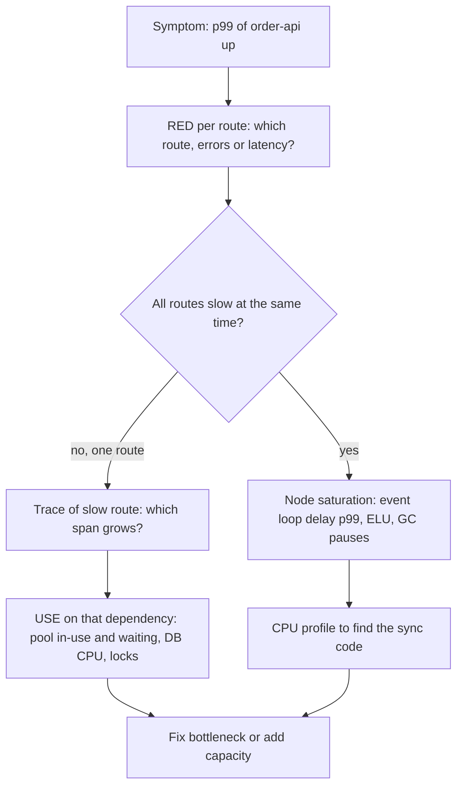
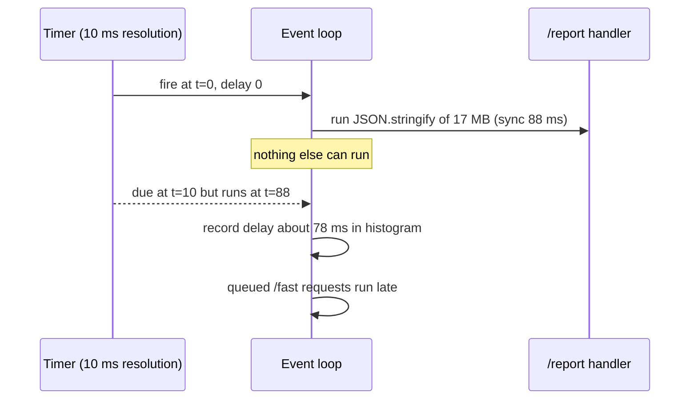

## Bối cảnh & vấn đề

Một API Node có dashboard với 40 biểu đồ: CPU, memory, disk, network, GC, số request theo 15 endpoint, và vài chục metric khác. Khi p99 tăng từ 200 ms lên 3 s, on-call mở dashboard và không biết nhìn vào đâu trước. CPU trung bình chỉ 45%. Memory ổn. Sau 40 phút mới thấy: connection pool Postgres (`max: 10`) đã đầy và có 50 request đang **chờ** lấy connection. Không biểu đồ nào hiển thị "số request đang chờ pool".

Vấn đề không phải thiếu dữ liệu mà thiếu **phương pháp**. Hai framework đơn giản giải quyết việc này: **RED** cho biết **service nào** đang làm người dùng khổ, **USE** cho biết **resource nào** là nút thắt. Bài này giải thích cả hai, bốn golden signals của Google SRE, và đặc biệt là **saturation trong Node.js**: vì Node chạy JavaScript trên một thread, một hàm đồng bộ chậm làm chậm **mọi** request, và CPU trung bình không cho thấy điều đó. Cuối bài là ba tình huống hay gặp trong phỏng vấn: memory leak làm pod bị OOMKilled, Kafka consumer lag tăng theo giờ cao điểm, và giám sát Socket.IO.

## Khái niệm

### RED: Rate, Errors, Duration

**RED** (Tom Wilkie đặt tên) áp dụng cho mọi **service xử lý request** (HTTP API, gRPC, consumer xử lý message):

- **Rate**: số request mỗi giây (`sum(rate(http_requests_total[5m])) by (route)`).
- **Errors**: số hoặc tỉ lệ request thất bại (5xx, timeout, message vào DLQ).
- **Duration**: phân phối latency, đọc bằng percentile từ histogram.

RED đo từ góc nhìn của **caller**: nó trả lời "service này có đang phục vụ tốt không?". Mỗi service nên có một dashboard RED chuẩn, giống nhau giữa các service, để on-call không phải học lại cho từng service. Ví dụ: `order-api` 1.2k rps, 0.3% 5xx, p99 450 ms.

### USE: Utilization, Saturation, Errors

**USE** (Brendan Gregg) áp dụng cho từng **resource**: CPU, memory, disk, network interface, connection pool, thread pool, queue.

- **Utilization**: phần trăm thời gian (hoặc dung lượng) resource bận. CPU 85%, pool dùng 10/10 connection.
- **Saturation**: lượng công việc **đang chờ** vì resource không phục vụ kịp: run queue của CPU, số request chờ pool, swap, queue depth. Saturation > 0 kéo dài gần như luôn đồng nghĩa latency tăng.
- **Errors**: lỗi của resource: disk I/O error, packet drop, connection refused, `ECONNRESET` từ pool.

Điểm tinh tế: utilization 100% chưa chắc xấu (resource đang được tận dụng), nhưng **saturation** thì gần như luôn xấu, vì có người đang xếp hàng. Trong ví dụ mở đầu, utilization của pool là 100% và saturation là 50 request chờ.

### Bốn golden signals

Google SRE Book đề xuất bốn tín hiệu cho mọi hệ thống phục vụ người dùng: **Latency** (tách latency của request thành công và thất bại, vì lỗi nhanh làm latency "đẹp"), **Traffic**, **Errors**, **Saturation** (mức "đầy" của hệ thống, thường đo bằng resource bị ràng buộc nhất). Nó gần như RED cộng thêm saturation. Dùng golden signals làm dashboard mặc định; dùng RED cho từng service và USE khi đào xuống resource.

**Interview angle:** câu trả lời mạnh nêu cách dùng kết hợp: "RED cho biết service nào bị ảnh hưởng, USE cho biết resource nào là nút thắt", kèm một ví dụ cụ thể như p99 tăng → pool saturation.

### Saturation trong Node.js: event loop

Node chạy JavaScript trên **một thread** với **event loop**: mỗi vòng, nó lấy callback sẵn sàng (I/O xong, timer tới hạn) và chạy tới hết. Nếu một callback chạy đồng bộ 100 ms (`JSON.stringify` payload lớn, regex backtracking, `crypto.pbkdf2Sync`, vòng lặp trên mảng lớn), **mọi** request khác phải chờ 100 ms đó. Với server thread-per-request (Java, .NET truyền thống), một request chậm chỉ chiếm một thread; các request khác vẫn chạy trên thread khác.

Hai metric đo saturation của event loop:

- **Event loop delay** (`perf_hooks.monitorEventLoopDelay()`): histogram độ trễ giữa lúc một timer **nên** chạy và lúc nó **thật sự** chạy. p99 delay 100 ms nghĩa là có lúc mọi callback bị trễ 100 ms.
- **Event loop utilization (ELU)** (`performance.eventLoopUtilization()`): tỉ lệ thời gian event loop **bận** chạy code so với thời gian rảnh chờ I/O, từ 0 tới 1. ELU gần 1 nghĩa là loop bão hoà dù CPU của máy (nhiều core) trông thấp.

Ngoài event loop, Node còn **libuv threadpool** (mặc định 4 thread, `UV_THREADPOOL_SIZE`) cho `fs`, `dns.lookup`, `crypto` async, `zlib`: khi 4 thread bận, các thao tác đó xếp hàng. Và các pool ở tầng ứng dụng: connection pool DB (`pg.Pool` có `totalCount`, `idleCount`, `waitingCount`), HTTP agent `maxSockets`.

### Memory: heap, RSS và leak

**Heap** (`process.memoryUsage().heapUsed`) là bộ nhớ V8 quản lý cho object JavaScript. **RSS** (resident set size) là toàn bộ bộ nhớ process đang chiếm trong RAM: heap + code + stack + **native memory** (Buffer, thư viện C++ như zlib, sharp, driver). Kubernetes OOMKill dựa trên memory của container (gần RSS), không phải heap.

**Memory leak** trong JavaScript là khi object không còn cần nhưng vẫn **reachable** từ root (global, closure còn sống, cache), nên GC không thu hồi. Dấu hiệu: heap sau mỗi lần GC (baseline) tăng đơn điệu theo thời gian hoặc theo số request. Nếu RSS tăng mà heap phẳng, nghi native memory (Buffer giữ lại, thư viện native, fragmentation của allocator).

### Kafka consumer lag

**Consumer lag** của một partition = offset mới nhất đã ghi (log end offset) − offset consumer group đã commit. Lag tăng nghĩa là tốc độ consume < tốc độ produce. Đo theo **partition** (lag đều hay dồn vào một partition, dấu hiệu hot key) và nên quy đổi thành **lag theo thời gian** (message cũ nhất chưa xử lý đã chờ bao lâu), vì người dùng cảm nhận "đơn hàng chậm 8 phút", không phải "lag 120.000 message".

## Cơ chế hoạt động

Quy trình đi từ triệu chứng tới resource:



Nhánh "mọi route chậm cùng lúc" là đặc trưng của Node: nếu event loop bị block, endpoint đơn giản như `/health` cũng chậm. Nếu chỉ một route chậm, vấn đề nằm ở dependency của route đó (query, pool, API ngoài), và trace cho biết span nào dài ra; USE trên resource đó xác nhận.

Event loop delay được đo như sau: Node đặt một timer lặp lại theo `resolution` (ví dụ 10 ms); mỗi lần timer chạy, nó ghi lại độ trễ so với thời điểm dự kiến vào histogram. Nếu một callback đồng bộ chạy 88 ms, timer bị trễ ~88 ms và histogram ghi một mẫu lớn.



## Ví dụ thực tế

### Đo event loop bị block (Node 24, chạy thật)

Server có `/fast` (trả "ok" ngay) và `/report` (đồng bộ `JSON.stringify` mảng 300.000 object, ra 17 MB). Client là **process riêng** (để chính client không bị block), gọi `/fast` 100 lần, trong pha cuối có `/report` chạy mỗi 300 ms.

```ts
import http from "node:http";
import { monitorEventLoopDelay, performance } from "node:perf_hooks";
const h = monitorEventLoopDelay({ resolution: 10 }); h.enable();
let elu0 = performance.eventLoopUtilization();
const big = Array.from({ length: 300_000 }, (_, i) => ({ id: i, name: "product " + i, tags: ["a", "b", "c"] }));
http.createServer((req, res) => {
  if (req.url === "/report") { const t = performance.now(); const s = JSON.stringify(big); res.end(`${s.length} bytes in ${(performance.now() - t).toFixed(0)}ms`); return; }
  if (req.url === "/stats") {
    const out = { loopDelayP99ms: +(h.percentile(99) / 1e6).toFixed(1), loopDelayMaxMs: +(h.max / 1e6).toFixed(1),
                  elu: +performance.eventLoopUtilization(elu0).utilization.toFixed(2) };
    h.reset(); elu0 = performance.eventLoopUtilization(); res.end(JSON.stringify(out)); return;
  }
  res.end("ok");
}).listen(4201);
```

```text
idle    /fast p50=1.4ms p99=9.3ms   | server: {"loopDelayP99ms":13.3,"loopDelayMaxMs":13.8,"elu":0.08}
idle    /fast p50=1.1ms p99=5.9ms   | server: {"loopDelayP99ms":12.5,"loopDelayMaxMs":12.9,"elu":0.05}
blocked /fast p50=1.5ms p99=105.6ms | server: {"loopDelayP99ms":110.9,"loopDelayMaxMs":148.2,"elu":0.38} | /report 17477781 bytes in 88ms
```

Đọc kết quả: endpoint `/fast` không làm gì cả, nhưng p99 của nó tăng từ ~6–9 ms lên **106 ms** chỉ vì endpoint khác block event loop 88 ms. Event loop delay p99 nhảy từ ~12 ms lên 111 ms, khớp với p99 của `/fast`. Lưu ý baseline ~12 ms khi idle phần lớn là **resolution 10 ms** của chính bộ đo; khi alert, so với baseline chứ không so với 0. ELU chỉ 0.38: loop không bận liên tục, nhưng mỗi lần bận thì bận lâu. Đó là lý do cần delay p99, không chỉ ELU hay CPU trung bình.

Tìm thủ phạm trong production: `node --cpu-prof` hoặc `--cpu-prof-dir` (ghi `.cpuprofile` mở bằng Chrome DevTools), clinic.js flame / 0x, hoặc continuous profiler. Trên trace, block event loop hiện ra như **span cha dài mà không có span con** nào giải thích. Sửa: stream JSON, chia nhỏ công việc (`setImmediate` giữa các batch), đưa sang `worker_threads`, hoặc chuyển thành job nền.

### Memory leak: cache không giới hạn và so sánh heap snapshot

```ts
import v8 from "node:v8";
class CachedQuote { constructor(public id: string) { this.payload = "x".repeat(2000); } payload: string; }
const cache = new Map<string, CachedQuote>();      // no max size, no TTL, key = request id
const handle = (reqId: string) => cache.set(reqId, new CachedQuote(reqId));
// 3 rounds of 20,000 requests; gc() + memoryUsage() after each; heap snapshot after round 1 and 3
```

Output thật (Node 24, `--expose-gc`; phần đếm theo constructor là script tự parse file `.heapsnapshot`):

```text
after 20000 requests: heapUsed=14.4MB rss=68.7MB cache.size=20000
after 40000 requests: heapUsed=24.8MB rss=209.2MB cache.size=40000
after 60000 requests: heapUsed=34.4MB rss=116.7MB cache.size=60000
top constructors by count delta (snapshot 1 -> 3): [ [ 'CachedQuote', 40000 ], [ 'Float64Array', 0 ], [ 'global', 0 ] ]
```

Heap **sau GC** tăng đều ~10 MB mỗi 20.000 request: dấu hiệu leak kinh điển. RSS nhảy lên 209 MB rồi xuống 117 MB vì chính việc ghi heap snapshot tốn bộ nhớ tạm, nên RSS đơn lẻ là tín hiệu nhiễu; nhìn xu hướng heap sau GC. So sánh hai snapshot chỉ thẳng thủ phạm: `CachedQuote` tăng đúng 40.000 object. Trong Chrome DevTools, chế độ **Comparison** cho cùng thông tin kèm **retainer path** (`Map` → `cache` → module scope).

Quy trình đầy đủ cho "pod bị OOMKilled mỗi ~6 giờ": (1) xác nhận là leak: heap sau GC tăng đơn điệu theo request, so `heapUsed` với RSS; (2) tái hiện bằng soak test ở staging; (3) chụp 2–3 heap snapshot cách nhau (`node --heapsnapshot-signal=SIGUSR2` rồi `kill -USR2 <pid>`, hoặc `v8.writeHeapSnapshot()` sau endpoint admin có bảo vệ); lưu ý snapshot **dừng** process vài giây và tốn bộ nhớ gần bằng heap, nên lấy pod ra khỏi load balancer trước; (4) nghi phạm hay gặp: cache `Map` không giới hạn, listener không gỡ (`MaxListenersExceededWarning`), closure giữ `req`, `setInterval` không clear, metric với label cardinality cao trong prom-client, room Socket.IO không dọn; (5) fix (LRU có `max` và TTL) và guardrail (alert theo xu hướng memory, soak test định kỳ). Nếu heap phẳng mà RSS tăng: Buffer bị giữ (`process.memoryUsage().arrayBuffers`), thư viện native, hoặc fragmentation của glibc malloc (thử `MALLOC_ARENA_MAX=2` hoặc jemalloc).

### Kafka consumer lag tăng theo giờ cao điểm

Triệu chứng: lag tăng đều từ 9:00 tới 18:00, đêm thì hồi phục. Nghĩa là năng lực consume nằm giữa tải đêm và tải ngày. Phân tích:

- **Đo**: lag theo partition (`kafka-consumer-groups.sh --describe --group billing` cho cột `LAG` từng partition), produce rate vs consume rate, thời gian xử lý mỗi message (histogram), số rebalance, số retry/lỗi.
- **Nếu lag đều mọi partition**: consumer quá chậm. Thường do gọi DB/API **tuần tự cho từng message**. Fix: xử lý theo batch (`eachBatch`, bulk insert), song song có kiểm soát trong partition nhưng giữ thứ tự theo key, tối ưu downstream.
- **Nếu lag dồn một partition**: **hot key** (một tenant lớn). Thêm consumer không giúp vì một partition chỉ được một consumer trong group đọc. Fix: đổi partition key (tenant + sub-key), tách tenant lớn sang topic riêng.
- **Vì sao thêm consumer không giúp**: số consumer active tối đa bằng **số partition**; consumer thứ 13 với 12 partition ngồi không. Hoặc nút thắt nằm ở downstream (DB) nên song song thêm chỉ làm DB chậm hơn. Hoặc rebalance liên tục vì xử lý một batch vượt `max.poll.interval.ms` (mặc định 5 phút), consumer bị đá khỏi group, partition chuyển qua lại và không ai tiến triển.
- **Retry nội tuyến** chặn partition: một message lỗi retry 10 lần với backoff giữ cả partition. Tách retry topic và DLQ.
- **Alert** theo lag tính bằng **thời gian** (ví dụ "message cũ nhất chờ > 5 phút"), không phải số message.

### Socket.IO: metric cho real-time

Metric cần theo dõi (theo instance): số connection hiện tại, tốc độ connect/disconnect (một đỉnh disconnect rồi connect là **reconnect storm**), message rate in/out theo event, latency emit → ack, event loop delay (một handler chậm làm trễ mọi socket trên pod), memory theo số connection (bytes/connection ổn định hay tăng), lỗi auth trong handshake, kích thước room, và latency của Redis adapter khi chạy nhiều node.

```ts
// illustrative (minh hoạ): Socket.IO metrics with prom-client
const connected = new client.Gauge({ name: "socketio_connected_clients", help: "current sockets" });
const events = new client.Counter({ name: "socketio_events_total", help: "events", labelNames: ["event", "direction"] });
io.on("connection", (socket) => {
  connected.inc();
  socket.onAny((event) => events.inc({ event, direction: "in" }));
  socket.on("disconnect", () => connected.dec());
});
```

Sự cố điển hình: sau deploy, mọi client bị ngắt cùng lúc và reconnect đồng loạt vào số pod mới ít hơn; handshake + auth + join room làm pod mới quá tải và chết, lại gây reconnect tiếp. Phòng: client reconnect với **backoff + jitter** (Socket.IO client có `randomizationFactor`), rolling deploy chậm (drain dần), giới hạn tốc độ handshake, và kiểm tra sticky session khi dùng transport polling. (Điền metric và sự cố thật của bạn khi trả lời câu hỏi CV, không bịa số.)

### Đo gì trong một load test

Ngoài response time, một load test có giá trị khi bạn nhìn cả hai phía: phía client (throughput thật, error rate theo loại, p50/p95/p99, request timeout/dropped) và phía server theo RED + USE: CPU, RSS, **event loop delay**, GC pause, pool in-use/waiting, libuv threadpool; DB: CPU, active connection, lock wait, slow query, cache hit ratio, replication lag; cache/queue: Redis latency/evictions, queue depth, consumer lag; autoscaling: thời gian scale out. Mục tiêu là tìm **nút thắt đầu tiên** và "knee" của đường latency theo throughput (xem [load testing](/tracks/observability/learn/load-testing) và [capacity planning](/tracks/observability/learn/capacity-planning)).

## Trade-offs & lựa chọn thay thế

| Framework | Áp dụng cho | Trả lời câu hỏi | Điểm mù |
| --- | --- | --- | --- |
| RED | Service xử lý request/message | Người dùng có đang bị ảnh hưởng không, ở route nào? | Không chỉ ra resource gây ra |
| USE | Resource (CPU, pool, disk, queue) | Resource nào là nút thắt? | Không biết người dùng có bị ảnh hưởng không |
| Golden signals | Hệ thống phục vụ user | Dashboard mặc định 4 panel | Saturation phải tự chọn resource đại diện |
| Runtime metrics Node | Process Node | Event loop, heap, GC có ổn không? | Không nói gì về dependency bên ngoài |

| Metric saturation trong Node | Ưu | Nhược |
| --- | --- | --- |
| Event loop delay p99 | Phản ánh trực tiếp độ trễ mọi callback | Có baseline bằng resolution; cần cửa sổ đủ dài |
| ELU | Rẻ, cho biết loop bận bao nhiêu % | Trung bình theo thời gian, che các lần block ngắn mà nặng |
| CPU % của process | Có sẵn mọi nơi | Một core 100% trên máy 8 core trông như 12% |

Khi nào dùng gì: dashboard mỗi service = RED (theo route) + runtime Node (event loop delay p99, heap sau GC, GC pause) + USE cho pool quan trọng (DB pool in-use/waiting). Alert trên RED/SLO; runtime và USE dùng để điều tra và cho ticket, trừ saturation đã chứng minh dẫn tới sự cố.

## Edge cases & failure modes

- **CPU trung bình che core nóng**: process Node dùng tối đa ~1 core cho JavaScript; trên container 4 vCPU, "25%" có thể là loop bão hoà. Đo theo process hoặc ELU.
- **CPU throttling trong Kubernetes**: CPU limit (CFS quota) làm process bị dừng vài chục ms mỗi chu kỳ 100 ms khi vượt quota; latency tail tăng mà CPU usage trông thấp. Theo dõi `container_cpu_cfs_throttled_periods_total`.
- **GC pause**: heap lớn gần `--max-old-space-size` làm GC chạy liên tục (major GC), event loop delay tăng, rồi `JavaScript heap out of memory`. Theo dõi `nodejs_gc_duration_seconds`.
- **Pool chờ vô hạn**: `pg.Pool` với `connectionTimeoutMillis: 0` làm request treo; waiting count tăng nhưng không có lỗi nào, chỉ timeout ở upstream.
- **Heap snapshot ở production**: dừng process (stop-the-world) vài giây và cần thêm bộ nhớ gần bằng heap; pod có thể bị OOMKill ngay khi chụp. Rút pod khỏi traffic, đảm bảo memory headroom.
- **Lag giả**: consumer commit offset thưa (mỗi 5 giây hoặc mỗi batch lớn) làm lag dao động răng cưa; alert trên trung bình hoặc cửa sổ.

## Pitfalls

- ❌ Dashboard 40 biểu đồ không có thứ tự → ✅ RED trước (service nào), USE sau (resource nào).
- ❌ Đọc CPU trung bình để kết luận Node "rảnh" → ✅ event loop delay p99 và ELU, vì JavaScript chỉ chạy trên một thread.
- ❌ Theo dõi utilization của pool mà bỏ qua saturation → ✅ alert/ticket trên `waitingCount` hoặc thời gian chờ pool.
- ❌ Kết luận leak từ RSS đơn lẻ → ✅ heap sau GC theo thời gian, so với RSS, rồi so sánh heap snapshot.
- ❌ `Map` làm cache không giới hạn → ✅ LRU với `max` và TTL.
- ❌ Thêm consumer khi lag dồn một partition → ✅ xử lý hot key; số consumer active không vượt số partition.
- ❌ Alert lag theo số message → ✅ theo thời gian chờ của message cũ nhất.

## Tóm tắt

- RED (Rate, Errors, Duration) cho service; USE (Utilization, Saturation, Errors) cho resource; golden signals = latency, traffic, errors, saturation.
- Saturation (công việc đang chờ) là tín hiệu quý nhất của USE; utilization 100% chưa chắc xấu.
- Node chạy JS trên một thread: một callback đồng bộ 88 ms đẩy p99 của endpoint không liên quan từ ~6 ms lên 106 ms (demo).
- Đo bằng `monitorEventLoopDelay` (p99, trừ baseline resolution) và `eventLoopUtilization`; tìm thủ phạm bằng CPU profile.
- Leak: heap sau GC tăng đơn điệu; heap snapshot comparison chỉ ra constructor tăng (40.000 `CachedQuote`) và retainer path.
- Kafka lag: đo theo partition và theo thời gian; consumer active ≤ số partition; hot key, rebalance, retry nội tuyến.
- Socket.IO: connections, connect/disconnect rate, emit→ack latency, event loop delay, memory per connection; phòng reconnect storm bằng backoff + jitter.
