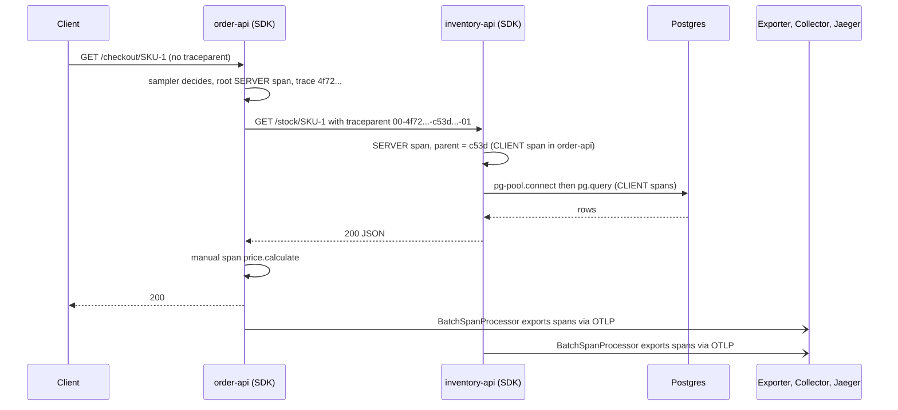
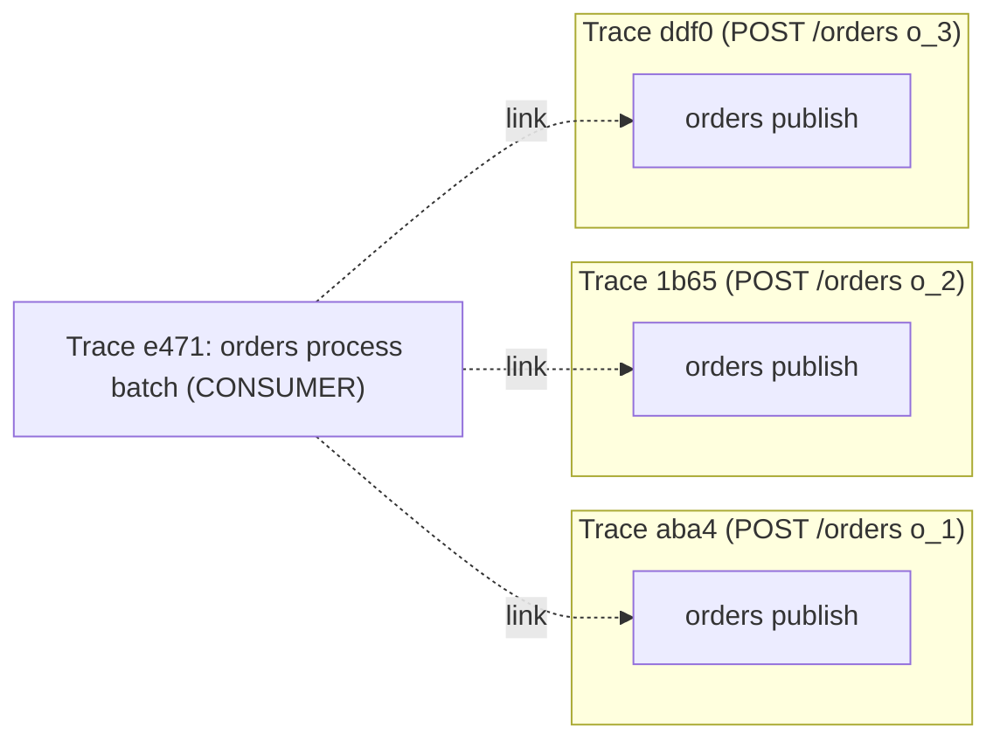

## Bối cảnh & vấn đề

Request `POST /checkout` mất 2,3 giây. Nó đi qua gateway, `order-api`, `inventory-api`, `payment-api`, Postgres, Redis và một payment provider bên ngoài. Mỗi service có log riêng và metric riêng, và mỗi team đều nói "service của tôi nhanh": p99 của từng service đều dưới 300 ms. Vậy 2,3 giây ở đâu? Có thể ở các lần gọi **tuần tự** mà lẽ ra chạy song song, ở retry ẩn trong HTTP client, ở thời gian chờ connection pool, hoặc ở chính network giữa các hop. Không log hay metric riêng lẻ nào trả lời được, vì câu hỏi là về **một request cụ thể đi qua nhiều nơi**.

**Distributed tracing** giải quyết đúng câu hỏi này: ghi lại từng bước của một request dưới dạng cây span, có thời gian bắt đầu/kết thúc và quan hệ cha-con, nối qua các service bằng một trace ID chung. **OpenTelemetry** (OTel) là chuẩn mở, vendor-neutral để tạo và gửi dữ liệu đó. Bài này giải thích mô hình dữ liệu của trace, cách context đi qua HTTP và Kafka, cách instrument một service Node/Express (và lỗi phổ biến nhất: load SDK quá muộn, đã chạy thật bên dưới), những cách trace "nói dối", và cách nối frontend với backend.

## Khái niệm

### Span và trace

**Span** là một đơn vị công việc có tên (`GET /checkout/:sku`, `pg.query:SELECT`), thời điểm bắt đầu và kết thúc, **attributes** (cặp key-value như `http.response.status_code=200`, `db.system=postgresql`), **events** (sự kiện có timestamp bên trong span, ví dụ exception), **status** (`UNSET`, `OK`, `ERROR`), và **kind**: `SERVER` (nhận request), `CLIENT` (gọi ra ngoài), `PRODUCER`/`CONSUMER` (gửi/nhận message), `INTERNAL`.

**Trace** là tập các span có cùng **trace ID** (16 byte, 32 ký tự hex), tạo thành cây qua quan hệ `parent span ID`. Span gốc (root) thường là span SERVER đầu tiên ở gateway. Span cha bao trọn thời gian các span con chạy tuần tự hoặc song song; nhìn waterfall, bạn thấy ngay **critical path**: chuỗi span quyết định tổng thời gian.

### W3C Trace Context

**W3C Trace Context** chuẩn hoá cách truyền context qua HTTP bằng hai header:

```text
traceparent: 00-4f72f862eb211dcf562b63e41ff3bb45-c53d864a0a48e671-01
             |  |                                |                |
             |  trace-id (32 hex)                parent-id (16)   flags (01 = sampled)
             version
tracestate: vendor1=abc,vendor2=xyz
```

Service nhận request đọc `traceparent`, tạo span SERVER với **cùng trace ID** và `parent = parent-id` trong header, rồi khi gọi đi tiếp, đặt `traceparent` mới với parent-id là span CLIENT của mình. Bit `sampled` trong flags truyền **quyết định sampling** xuống mọi hop, để cả trace được giữ hoặc bỏ cùng nhau. `tracestate` mang dữ liệu riêng của vendor. Ngoài ra **Baggage** (`baggage` header) truyền cặp key-value nghiệp vụ (ví dụ `tenant.id`) qua các hop; cẩn thận vì baggage đi ra cả request tới bên thứ ba nếu không lọc.

### OpenTelemetry: các thành phần

OpenTelemetry là dự án CNCF (đang ở mức **incubating**; dự án đã nộp hồ sơ graduation, verify trạng thái hiện tại), hợp nhất OpenTracing và OpenCensus. Nó gồm:

- **API**: interface để instrument code (`trace.getTracer`, `startActiveSpan`). Thư viện chỉ phụ thuộc API; nếu không có SDK, API là no-op gần như miễn phí.
- **SDK**: triển khai thật: sampler, span processor (batch), exporter, resource.
- **Instrumentation libraries**: patch sẵn thư viện phổ biến (`http`, `undici`/fetch, `express`, `pg`, `ioredis`, `kafkajs`, `pino`...). Gói `@opentelemetry/auto-instrumentations-node` gom tất cả.
- **OTLP** (OpenTelemetry Protocol): giao thức truyền telemetry qua gRPC (port 4317) hoặc HTTP/protobuf (4318).
- **Collector**: process riêng nhận OTLP (và nhiều định dạng khác), xử lý (batch, sampling, redaction, thêm attribute) và export tới một hoặc nhiều backend.
- **Semantic conventions**: tên attribute chuẩn (`service.name`, `http.request.method`, `http.response.status_code`, `db.system`, `messaging.system`) để mọi backend hiểu cùng một ngôn ngữ.

Lợi ích cốt lõi: **instrument một lần**, đổi backend (Jaeger, Tempo, Datadog, X-Ray, Honeycomb) bằng cấu hình exporter/Collector, không sửa code.

### Resource

**Resource** mô tả **thực thể sinh ra telemetry**: `service.name`, `service.version`, `deployment.environment.name` (tên mới; bản cũ là `deployment.environment`, verify theo semconv bạn dùng), `host.name`, `k8s.pod.name`. Thiếu `service.name` thì mọi span hiện là `unknown_service:node`, và bạn không lọc được theo service. `service.version` là chìa khoá để so sánh trước/sau deploy.

### Auto-instrumentation trong Node và vì sao thứ tự load quan trọng

Instrumentation của Node hoạt động bằng cách **patch module lúc nó được `require`/`import`**: hook (require-in-the-middle cho CJS, loader hook `import-in-the-middle` cho ESM) bọc các hàm như `http.Server.emit`, `express.Router.handle`, `pg.Client.query`. Nếu `express` đã được load **trước** khi SDK đăng ký hook, module đó đã nằm trong cache và không bao giờ bị patch. Một số thư viện dùng **diagnostics_channel** (như `undici`/global `fetch`) thì vẫn được instrument dù load sớm, nên bạn có trace "một nửa", rất khó hiểu.

Cách đúng: SDK chạy **trước mọi thứ**, bằng `node --require ./tracing.cjs app.cjs` (CommonJS) hoặc `node --import ./tracing.mjs app.mjs` (ESM, file tracing phải đăng ký loader hook của `@opentelemetry/instrumentation`, verify cách đăng ký theo phiên bản). Không `import "./tracing"` ở dòng đầu `app.ts` rồi hy vọng bundler/TS giữ đúng thứ tự.

### Propagation qua message: parent-child và span links

Với Kafka/SQS, producer **inject** context vào **message headers**; consumer **extract** ra. Có hai cách nối:

- **Parent-child**: span CONSUMER là con của span PRODUCER. Hợp lý khi một message được xử lý ngay và riêng lẻ.
- **Span links**: span CONSUMER bắt đầu một trace **mới** (hoặc thuộc trace của consumer) và chứa **links** tới span context của các message. Dùng khi xử lý **batch** 100 message (một span không thể có 100 cha), hoặc khi xử lý muộn (5 phút sau): bạn không muốn trace của request HTTP kéo dài 5 phút, nhưng vẫn muốn nhảy qua lại được.

## Cơ chế hoạt động

Đường đi của context và span qua hai service:



Mỗi service **tự** export span của mình, độc lập và bất đồng bộ. Backend (Jaeger) ghép chúng lại thành một cây dựa trên trace ID và parent ID. Vì vậy một service export lỗi chỉ làm **mất một nhánh**, không mất cả trace, và span có thể tới backend lệch nhau vài giây. `BatchSpanProcessor` gom span trong memory và gửi theo lô (mặc định mỗi 5 giây hoặc khi đủ 512 span, verify), nên khi process thoát mà không gọi `sdk.shutdown()`, span cuối cùng bị mất.

Context trong một process được giữ bằng **context manager** dựa trên `AsyncLocalStorage` (xem [structured logging](/tracks/observability/learn/structured-logging)): `startActiveSpan` đặt span vào context; mọi span tạo trong callback (kể cả qua `await`) tự nhận nó làm cha; logger đọc active span để chèn `trace_id`.

Kafka batch với span links:



## Ví dụ thực tế

### Instrument hai service Express với OTel SDK và Jaeger (chạy thật)

Phiên bản: Node 24.21, `@opentelemetry/sdk-node` 0.222.0, `@opentelemetry/auto-instrumentations-node` 0.80.0, `@opentelemetry/api` 1.9.1, Express 5.2.1, pg 8.23, Postgres 16, Jaeger 2.11 (all-in-one, nhận OTLP ở 4317/4318).

```ts
// tracing.cjs — node --require ./tracing.cjs order.cjs
const { NodeSDK } = require("@opentelemetry/sdk-node");
const { getNodeAutoInstrumentations } = require("@opentelemetry/auto-instrumentations-node");
const { OTLPTraceExporter } = require("@opentelemetry/exporter-trace-otlp-http");
const { resourceFromAttributes } = require("@opentelemetry/resources");
const sdk = new NodeSDK({
  resource: resourceFromAttributes({
    "service.name": process.env.SVC, "service.version": "1.4.2", "deployment.environment.name": "local",
  }),
  traceExporter: new OTLPTraceExporter({ url: "http://localhost:4318/v1/traces" }),
  instrumentations: [getNodeAutoInstrumentations({ "@opentelemetry/instrumentation-fs": { enabled: false } })],
});
sdk.start();
const stop = () => sdk.shutdown().finally(() => process.exit(0));
process.on("SIGTERM", stop); process.on("SIGINT", stop);
```

```ts
// order.cjs (excerpt) — a manual span for business logic
const { trace, SpanStatusCode } = require("@opentelemetry/api");
const tracer = trace.getTracer("order-api");
app.get("/checkout/:sku", async (req, res) => {
  const stock = await (await fetch(`http://localhost:4102/stock/${req.params.sku}`)).json();
  await tracer.startActiveSpan("price.calculate", async (span) => {
    span.setAttribute("tenant.id", "t_42");
    span.setAttribute("cart.items", 3);
    await computePrice();
    if (req.query.fail) { span.recordException(new Error("coupon expired")); span.setStatus({ code: SpanStatusCode.ERROR }); }
    span.end();
  });
  log.info({ sku: stock.sku }, "checkout done");
  res.status(req.query.fail ? 500 : 200).json({ ok: !req.query.fail });
});
```

Trace lấy từ Jaeger HTTP API (đầy đủ 16 span, thụt lề theo cha-con):

```text
traceID 4f72f862eb211dcf562b63e41ff3bb45 spans 16
order-api      GET /checkout/:sku                     +   0.0ms   266.8ms
  order-api      middleware - patched                   +   2.0ms   265.5ms
    order-api      request handler - /checkout/:sku       +   2.0ms   265.0ms
      order-api      request handler - /checkout/:sku       +   3.0ms   264.8ms
        order-api      GET                                    +  20.0ms   207.8ms
        order-api      tcp.connect                            +  21.0ms    11.1ms
          inventory-api  GET /stock/:sku                        +  40.0ms   183.6ms
            inventory-api  middleware - patched                   +  43.0ms   181.0ms
              inventory-api  request handler - /stock/:sku          +  44.0ms   180.1ms
                inventory-api  request handler - /stock/:sku          +  44.0ms   179.8ms
                  inventory-api  pg-pool.connect                        +  46.0ms    41.9ms
                    inventory-api  pg.connect                             +  47.0ms    40.0ms
                      inventory-api  tcp.connect                            +  48.0ms     6.6ms
                      inventory-api  dns.lookup                             +  50.0ms     3.0ms
                  inventory-api  pg.query:SELECT postgres               +  89.0ms   130.0ms
        order-api      price.calculate                        + 231.0ms    30.8ms
```

Ghi chú khi đọc: span tên `middleware - patched` là cách instrumentation Express hiện đặt tên cho middleware không có tên ở Express 5 (chi tiết hiển thị có thể khác giữa các phiên bản, verify). `pg-pool.connect` 41,9 ms là **thời gian lấy connection** từ pool (ở đây là mở connection mới). Đây chính là loại "thời gian chờ" mà nhiều setup không có span, sẽ nói ở phần Edge cases.

### Lỗi phổ biến nhất: load SDK sau Express (chạy thật)

```ts
// order-bad.cjs — ❌ express (and therefore http) is loaded before the SDK starts
const express = require("express");
require("./tracing.cjs");
const app = express();
app.get("/ping", async (_req, res) => { await fetch("http://127.0.0.1:4102/stock/X"); res.send("pong"); });
```

Trace của service `order-bad` trong Jaeger:

```text
10 ['GET', 'GET /stock/:sku', 'dns.lookup', 'middleware - patched', 'pg-pool.connect', 'pg.connect',
    'pg.query:SELECT postgres', 'request handler - /stock/:sku', 'tcp.connect']
```

Không có span `GET /ping` (SERVER) nào và không có span Express của `order-bad`: `http` và `express` đã nằm trong module cache trước khi hook được đăng ký. Span `GET` (CLIENT, từ global `fetch`) vẫn xuất hiện vì `undici` được instrument qua diagnostics_channel. Kết quả là một trace bắt đầu bằng một **client span mồ côi**, không route, không status của request gốc. Đây là dạng lỗi "trace trông có dữ liệu nên không ai nghi ngờ". Sửa: `node --require ./tracing.cjs`.

### Inject/extract qua message header và span links (chạy thật)

```ts
const { W3CTraceContextPropagator } = require("@opentelemetry/core");
api.propagation.setGlobalPropagator(new W3CTraceContextPropagator());
// producer, inside the active span of POST /orders
const headers = {};
api.propagation.inject(api.context.active(), headers);   // headers.traceparent
messages.push({ key: orderId, headers });

// consumer A: one message, parent-child
const ctx = api.propagation.extract(api.ROOT_CONTEXT, messages[0].headers);
tracer.startActiveSpan("orders process", { kind: api.SpanKind.CONSUMER }, ctx, (s) => s.end());

// consumer B: batch, new root with one link per message
const links = messages.map((m) => ({ context: api.trace.getSpanContext(api.propagation.extract(api.ROOT_CONTEXT, m.headers)) }));
tracer.startActiveSpan("orders process batch", { kind: api.SpanKind.CONSUMER, links }, (s) => s.end());
```

```text
message headers: [
  '00-aba436a34b5224c0656e610b0a4de048-d2564f7a52a50315-01',
  '00-1b654cec0e0c408b3e593c562efffc3d-96c0590c2ad2f925-01',
  '00-ddf047b02bb2f6376b31293a924147a5-4f52e16c52288b1e-01'
]
orders process         trace aba436a3 parent d2564f7a links []
orders process batch   trace e4719ed0 parent - links [ 'aba436a3', '1b654cec', 'ddf047b0' ]
```

Consumer đơn lẻ nằm **trong** trace `aba436a3`, làm con của span publish. Consumer batch có trace riêng `e4719ed0` và ba link tới ba trace gốc. Với kafkajs thật, header là `Buffer`, nên phải `toString()` trước khi extract; `@opentelemetry/instrumentation-kafkajs` làm việc này tự động (verify độ phủ cho thư viện Kafka bạn dùng).

### Frontend: RUM và nối với backend trong Next.js

Backend p99 tốt nhưng user kêu trang sản phẩm chậm: thời gian user cảm nhận gồm DNS, TLS, TTFB, tải JS bundle, hydrate, render, và các call API từ browser. Cần **RUM** (Real User Monitoring):

- **Core Web Vitals**: LCP (tải nội dung chính), INP (độ phản hồi tương tác), CLS (độ xô lệch layout), cộng TTFB; theo route, thiết bị, quốc gia. Next.js có `useReportWebVitals` (từ `next/web-vitals`) để gửi metric đi.
- **Error tracking**: exception JS có source map (Sentry, v.v.), unhandled rejection, error boundary, lỗi hydration; network error phía client (CORS, timeout trên mạng di động).
- **Nối với backend**: OTel Web SDK tạo span trong browser và gửi `traceparent` trong fetch tới API (cần cho phép header trong CORS), nên trace đi từ click tới DB. Nếu chưa có, ít nhất gửi `x-request-id` và log ở cả hai phía.
- **Server side của Next.js**: file `instrumentation.ts` (hàm `register()`, ví dụ `registerOTel({ serviceName: "next-app" })` từ `@vercel/otel`) cho span của SSR/route handler; `onRequestError` để báo lỗi server; `instrumentation-client.ts` chạy trước code frontend để khởi tạo analytics/error tracking (Next 15.3+/16, verify).
- **Privacy**: không gửi PII; session replay phải mask input và lấy mẫu.

```ts
// app/web-vitals.tsx (illustrative, minh hoạ)
"use client";
import { useReportWebVitals } from "next/web-vitals";
export function WebVitals() {
  useReportWebVitals((m) => navigator.sendBeacon("/rum", JSON.stringify({ name: m.name, value: m.value, id: m.id, route: location.pathname })));
  return null;
}
```

### Thiết kế tracing khi tách monolith sang microservices qua Kafka

Mục tiêu: so sánh **đường cũ** (monolith) và **đường mới** (service + Kafka) cho cùng endpoint trong suốt quá trình strangler.

1. **W3C Trace Context ở mọi nơi**; cùng một package telemetry nội bộ cho monolith và service mới, cùng semantic conventions, `service.version` bắt buộc.
2. **Gateway/strangler proxy** tạo root span và ghi attribute quyết định định tuyến: `migration.route = legacy | new`, `migration.reason = canary_10pct`.
3. **Kafka**: inject `traceparent` vào message header ở producer; consumer dùng parent-child cho xử lý ngay, **span links** cho batch hoặc xử lý muộn.
4. **Dashboard RED so sánh** cũ vs mới, theo `migration.route`, cho cùng endpoint: p50/p99, error rate, và **độ trễ end-to-end** của luồng bất đồng bộ (thời điểm event được tạo tới khi read model cập nhật).
5. **Tail sampling** giữ mọi trace lỗi và chậm của **cả hai** đường.
6. **Verify trước khi chuyển traffic**: baseline của monolith trước khi tách; shadow traffic (gửi bản sao request sang đường mới, bỏ kết quả, so sánh response và latency) hoặc canary theo phần trăm; tiêu chí dừng/rollback viết sẵn (ví dụ p99 mới > cũ 20% trong 30 phút hoặc error rate > 0,5%). Điều thường gây bất ngờ: latency tăng vì thêm hop mạng và serialize, consumer lag ở giờ cao điểm, và "eventually consistent" nghĩa là user có thể không thấy đơn vừa đặt trong vài giây; đo khoảng trễ đó bằng metric riêng (timestamp event vs timestamp áp dụng).

## Trade-offs & lựa chọn thay thế

| Cách instrument | Ưu | Nhược | Khi nào |
| --- | --- | --- | --- |
| Auto-instrumentation | Nhanh, phủ HTTP/DB/cache/queue | Tên span chung chung, overhead của module không cần (tắt `fs`) | Mặc định cho mọi service |
| Manual span | Logic nghiệp vụ có tên, attribute riêng (`tenant.id`) | Tốn công, dễ quên `span.end()` | Bước quan trọng: pricing, fraud check |
| Agent của vendor | Cài một lần, nhiều tính năng | Lock-in, khó đổi backend | Khi đã cam kết vendor và cần tính năng riêng |
| Service mesh (Envoy/Istio) tạo span | Không sửa code | Chỉ thấy hop mạng, vẫn cần app truyền header | Bổ sung, không thay thế SDK |

| Nối consumer | Parent-child | Span links |
| --- | --- | --- |
| Hiển thị | Một trace liền mạch | Trace riêng, có liên kết |
| Batch nhiều message | Không làm được (một cha) | Tự nhiên |
| Xử lý muộn | Trace kéo dài bất thường | Gọn |
| Hỗ trợ UI | Mọi backend | Tuỳ backend (đa số đã hỗ trợ) |

## Edge cases & failure modes

- **Instrumentation thiếu**: driver không có instrumentation (một số driver SQL Server, HTTP client tự viết bằng `net`), hoặc SDK load muộn: span cha dài với khoảng trống không có con.
- **Context bị mất**: callback qua emitter/pool tự quản, `setTimeout` trong thư viện cũ, worker thread: span con trở thành **orphan** (trace riêng không có cha). Đếm số root span ở service lẽ ra không phải root.
- **Thời gian chờ không phải span**: event loop bị block, chờ connection pool, chờ lock DB, GC pause. Chúng hiện ra như span cha dài mà con ngắn. Thêm manual span cho "acquire connection" (nếu instrumentation không có, như `pg-pool.connect` ở trên), bật runtime metrics (event loop delay), và đối chiếu log theo `trace_id`.
- **Clock skew**: span của host khác có đồng hồ lệch làm span con bắt đầu trước span cha. Một số UI tự điều chỉnh; đồng bộ NTP.
- **Sampling không nhất quán**: service A dùng `ParentBased`, service B tự lấy mẫu 10% bỏ qua flag của cha → trace thiếu nửa. Mọi service dùng sampler `ParentBased`.
- **Mất span khi shutdown**: không gọi `sdk.shutdown()` khi SIGTERM; Kubernetes gửi SIGKILL sau `terminationGracePeriodSeconds` (mặc định 30 s).
- **Header bị proxy xoá**: một số proxy/WAF bỏ header lạ; CORS chặn `traceparent` từ browser nếu không có trong `Access-Control-Allow-Headers`.

## Pitfalls

- ❌ `import "./tracing"` trong `app.ts` sau khi import express → ✅ `node --require`/`--import` để SDK chạy trước mọi module.
- ❌ Không set `service.name`, `service.version` → ✅ resource đầy đủ, vì lọc theo service và so sánh deploy dựa vào chúng.
- ❌ Dùng `SimpleSpanProcessor` ở production → ✅ `BatchSpanProcessor` (mặc định của NodeSDK) để không export đồng bộ mỗi span.
- ❌ Quên `sdk.shutdown()` khi SIGTERM → ✅ flush trước khi thoát.
- ❌ Không truyền context qua Kafka → ✅ inject/extract message header; span links cho batch.
- ❌ Tin trace là đầy đủ → ✅ tìm khoảng trống span cha dài/con ngắn, orphan span, và đối chiếu với runtime metric.
- ❌ Gửi baggage chứa dữ liệu nghiệp vụ ra bên thứ ba → ✅ lọc baggage ở egress.

## Tóm tắt

- Span = đơn vị công việc (tên, thời gian, attributes, events, status, kind); trace = cây span cùng trace ID.
- `traceparent: 00-<trace-id>-<parent-id>-<flags>` truyền context và quyết định sampling qua mọi hop.
- OTel = API + SDK + instrumentation + OTLP + Collector + semantic conventions; instrument một lần, đổi backend bằng cấu hình. Trạng thái CNCF: incubating (verify).
- SDK phải load trước module được instrument; load muộn cho ra trace thiếu span SERVER và Express (đã chạy thật).
- Kafka: inject/extract header; parent-child cho xử lý đơn lẻ, span links cho batch/xử lý muộn.
- Trace giấu thời gian chờ (pool, lock, event loop, GC) và mất context qua emitter; bù bằng manual span và runtime metric.
- Frontend: Web Vitals, error tracking có source map, `traceparent` từ browser; Next.js có `instrumentation.ts`, `onRequestError`, `useReportWebVitals`.
- Tách monolith: attribute `migration.route`, dashboard cũ vs mới, shadow/canary với tiêu chí rollback rõ ràng.
