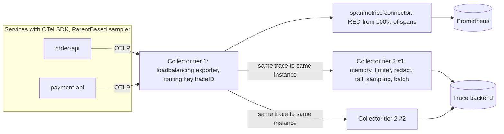
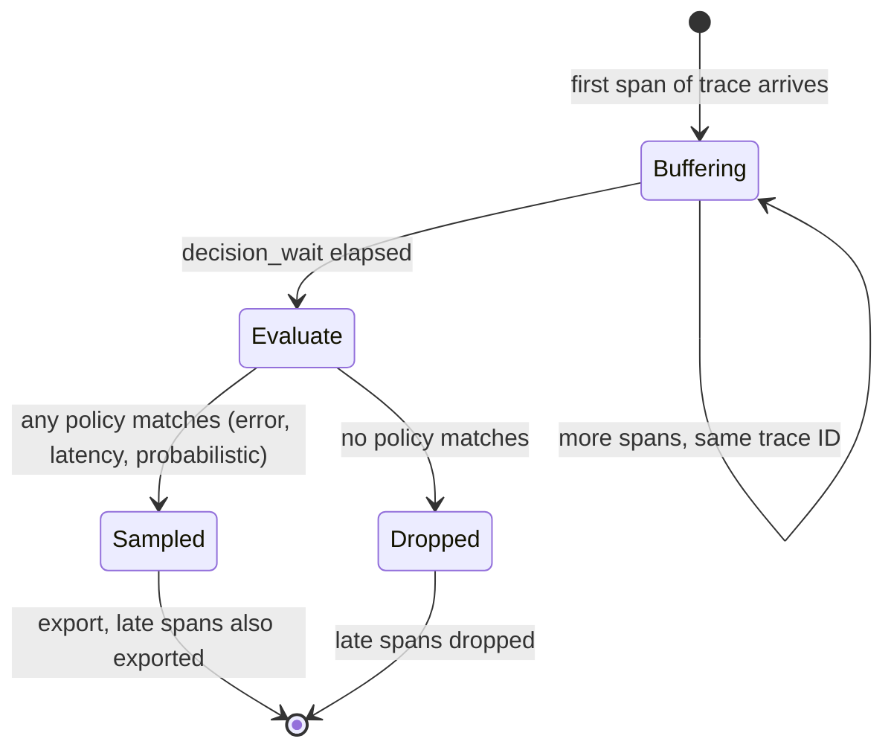

## Bối cảnh & vấn đề

Một nền tảng e-commerce bật tracing 100% cho 40 service. Tháng đầu, hoá đơn APM vượt hoá đơn compute của chính các service. Team hoảng hốt hạ sampling xuống 1% ở mọi SDK. Hai tuần sau có sự cố: 0,3% request checkout lỗi `card_declined` sai. On-call tìm trace của request lỗi và gần như không có: 1% của 0,3% là 3 trên 100.000 request, và chúng không rơi vào khung thời gian cần xem.

Đây là trade-off trung tâm của observability ở quy mô lớn: **chi phí tăng theo volume, giá trị debug tập trung ở số ít sự kiện hiếm** (lỗi, chậm, tenant đặc biệt). Sampling ngẫu nhiên giảm chi phí đều tay nhưng vứt bỏ đúng thứ quý nhất. Bài này giải thích hai họ sampling (head và tail) với số đo thật, vai trò của **OpenTelemetry Collector** như điểm kiểm soát chi phí, redaction và routing, cách chọn stack, và các đòn bẩy để giữ chi phí khi traffic tăng 10 lần mà không mất khả năng debug.

## Khái niệm

### Head sampling

**Head sampling** quyết định giữ hay bỏ một trace **ngay ở đầu**, khi span gốc được tạo, trước khi biết request sẽ thành công hay lỗi, nhanh hay chậm. OTel cung cấp `TraceIdRatioBasedSampler(0.1)`: dựa trên trace ID (ngẫu nhiên) để giữ khoảng 10%, deterministic theo trace ID nên mọi service có cùng ratio sẽ ra cùng quyết định. Bọc nó trong **`ParentBasedSampler`**: span có cha thì **theo quyết định của cha** (đọc bit `sampled` trong `traceparent`), chỉ span gốc mới lấy mẫu theo ratio. Nhờ vậy cả trace được giữ hoặc bỏ cùng nhau.

Ưu: gần như miễn phí (span không được sample thì không ghi, không export), đơn giản, giảm cả overhead trong app. Nhược: mù với kết quả; trace lỗi hiếm bị bỏ cùng tỉ lệ với trace thường.

### Tail sampling

**Tail sampling** quyết định **sau khi trace kết thúc**: Collector buffer mọi span của một trace trong một khoảng `decision_wait` (ví dụ 5–30 giây), rồi áp policy: giữ mọi trace có span `ERROR`, giữ trace có latency > 1 s, giữ mọi trace của tenant enterprise, và lấy mẫu 5% phần còn lại. Giá trị debug rất cao vì giữ đúng trace quan trọng.

Cái giá: Collector phải giữ toàn bộ span trong memory trong thời gian chờ (memory ≈ throughput span × decision_wait × kích thước span), và **mọi span của cùng một trace phải tới cùng một Collector instance**. Với nhiều instance phía sau load balancer thường, span của một trace bị chia ra và mỗi instance chỉ thấy một mảnh. Giải pháp là hai tầng: tầng 1 dùng **load-balancing exporter** định tuyến theo trace ID tới tầng 2, tầng 2 chạy `tail_sampling`.

### Metric không được tính từ trace đã sample

Error rate, throughput, latency percentile phải tính từ **100% request**: bằng metric ở SDK (OTel metrics, prom-client) hoặc `spanmetrics` connector ở Collector **đặt trước** sampling. Tính từ trace sau head sampling 5% cho sai số lớn khi sự kiện hiếm; tính sau tail sampling (giữ 100% lỗi, 5% thường) còn **phóng đại** error rate lên hàng chục lần.

### OpenTelemetry Collector

**Collector** là một binary (bản core và bản contrib nhiều component hơn) chạy pipeline:

- **Receivers**: nhận dữ liệu (OTLP gRPC/HTTP, Prometheus scrape, filelog, Jaeger, Zipkin...).
- **Processors**: xử lý theo thứ tự: `memory_limiter` (chặn OOM, nên đứng đầu), `attributes`/`transform` (xoá, hash, đổi tên attribute), `resource` (thêm `k8s.cluster.name`), `filter` (bỏ span health check), `tail_sampling`, `batch` (gom lô, nên đứng gần cuối).
- **Exporters**: gửi tới backend (OTLP tới Jaeger/Tempo/vendor, Prometheus remote write, Loki...).
- **Connectors**: nối hai pipeline (ví dụ `spanmetrics` đọc trace và sinh metric RED).

Hai mô hình triển khai: **agent** (DaemonSet/sidecar cạnh app, nhận local, thêm metadata host/pod) và **gateway** (cụm Collector trung tâm, nơi làm tail sampling, redaction tập trung, giữ credential của vendor). Lý do dùng Collector thay vì export thẳng từ app: app không phải giữ API key vendor, không phải retry/buffer khi vendor chậm, đổi backend hoặc gửi song song hai backend mà không deploy lại app, và **chặn dữ liệu nhạy cảm/thừa trước khi nó rời hạ tầng** (thứ quyết định hoá đơn).

## Cơ chế hoạt động

Pipeline hai tầng có tail sampling:



Diễn giải: SDK dùng `ParentBased(AlwaysOn)` hoặc head ratio vừa phải để giới hạn overhead. Tầng 1 không giữ trạng thái, chỉ băm trace ID để chọn instance tầng 2, đảm bảo mọi span của một trace gặp nhau. Metric RED được sinh **trước** tail sampling nên phản ánh toàn bộ traffic. Tầng 2 buffer theo trace ID, chờ `decision_wait`, đánh giá policy theo thứ tự OR (bất kỳ policy nào "sample" thì giữ), rồi batch và export.

Vòng đời một trace trong `tail_sampling`:



Span đến **sau** khi quyết định đã đưa ra (consumer chạy chậm, batch export trễ) theo quyết định đã cache cho trace đó trong một thời gian; nếu cache hết, chúng có thể bị xử lý như trace mới. Chọn `decision_wait` dài hơn độ dài trace điển hình cộng độ trễ export.

## Ví dụ thực tế

### Head sampling 10% bỏ mất bao nhiêu trace lỗi? (chạy thật)

```ts
const { BasicTracerProvider, SimpleSpanProcessor, InMemorySpanExporter, ParentBasedSampler, TraceIdRatioBasedSampler } = require("@opentelemetry/sdk-trace-base");
const sampler = new ParentBasedSampler({ root: new TraceIdRatioBasedSampler(0.1) });
const provider = new BasicTracerProvider({ sampler, spanProcessors: [new SimpleSpanProcessor(new InMemorySpanExporter())] });
const tracer = provider.getTracer("s");
let kept = 0, errorsKept = 0;
for (let i = 0; i < 10000; i++) {
  const span = tracer.startSpan("req");
  const isErr = i % 500 === 0;               // 20 error requests in 10,000
  if (span.isRecording()) { kept++; if (isErr) errorsKept++; }
  span.end();
}
console.log(`head sampling 10%: kept ${kept}/10000 traces, kept ${errorsKept}/20 error traces`);
```

```text
head sampling 10%: kept 939/10000 traces, kept 2/20 error traces
```

Đúng như kỳ vọng: giữ ~10% mọi thứ, kể cả lỗi. 18 trên 20 trace lỗi biến mất. Với lỗi hiếm hơn (1/100.000), bạn thường không có trace nào.

### Tail sampling ở Collector 0.139 + redaction (chạy thật)

Cấu hình Collector contrib (Docker `otel/opentelemetry-collector-contrib:0.139.0`), export về Jaeger 2.11:

```yaml
receivers:
  otlp:
    protocols:
      http: { endpoint: 0.0.0.0:4318 }
processors:
  memory_limiter: { check_interval: 1s, limit_mib: 400 }
  attributes/redact:
    actions:
      - { key: user.email, action: delete }
      - { key: enduser.id, action: hash }
  tail_sampling:
    decision_wait: 5s
    num_traces: 50000
    policies:
      - { name: errors, type: status_code, status_code: { status_codes: [ERROR] } }
      - { name: slow, type: latency, latency: { threshold_ms: 1000 } }
      - { name: baseline, type: probabilistic, probabilistic: { sampling_percentage: 5 } }
  batch: {}
exporters:
  otlp/jaeger:
    endpoint: host.docker.internal:4317
    tls: { insecure: true }
service:
  pipelines:
    traces:
      receivers: [otlp]
      processors: [memory_limiter, attributes/redact, tail_sampling, batch]
      exporters: [otlp/jaeger]
```

Một script gửi 1.000 trace (mỗi trace 2 span): 10 trace lỗi, 10 trace chậm 1,6 s, 980 trace bình thường 50 ms; mỗi span gốc mang `user.email` và `enduser.id`. Đếm trong Jaeger sau 15 giây:

```text
sent 1000 traces
traces stored in Jaeger: 75 {'ok': 55, 'slow': 10, 'error': 10}
root tags sample: {'demo.kind': 'ok', 'enduser.id': '69199bc0b62cc80231f8d830b7981605999428af9bf2ae7b4a93c8889da5e2e7'}
```

**100% trace lỗi và chậm được giữ**, trong khi tổng volume giảm còn 7,5%. 55 trace bình thường là ~5,6% của 980, đúng policy probabilistic 5%. `user.email` biến mất hoàn toàn, `enduser.id` được hash (SHA-256): vẫn nhóm được theo user mà không lưu ID thật. Đây là lớp redaction thứ hai đã nhắc ở bài [structured logging](/tracks/observability/learn/structured-logging).

Chú ý: nếu tính error rate từ 75 trace này, bạn được 10/75 = 13%, trong khi error rate thật là 1%. Error rate phải đến từ metric.

### Kiểm soát chi phí khi traffic tăng 10x

Các đòn bẩy, xếp theo mức giảm chi phí trên mức mất khả năng debug:

1. **Metric cho alert và xu hướng** (rẻ nhất): RED từ SDK hoặc `spanmetrics`; không tính số liệu từ log.
2. **Trace: tail sampling** giữ 100% lỗi/chậm/tenant quan trọng, 1–5% còn lại; head sampling vừa phải ở SDK nếu overhead trong app là vấn đề.
3. **Log**: bỏ noise (health check, readiness probe, log mỗi vòng lặp), chuyển log "đếm" thành metric, sample `info`/`debug` volume cao, **không sample** error và audit log; log level động theo tenant thay vì debug toàn cục.
4. **Retention phân tầng**: hot 3–7 ngày (query nhanh), cold (S3/object storage) 30–90 ngày, query khi cần; metric downsample cho lưu dài.
5. **Cardinality và quota**: giới hạn series per service, dashboard chi phí theo team (showback), review metric/log mới trong PR.
6. **Đo giá trị**: telemetry nào đã thật sự được dùng trong 10 incident gần nhất? Dashboard không ai mở, log không ai query là ứng viên cắt.

Trade-off phải nói rõ: cắt quá tay thì sự cố tiếp theo kéo dài; **MTTR là chi phí thật** (giờ engineer, doanh thu mất). Telemetry không bao giờ nên sample: error log, audit/security log, metric dùng cho SLO, trace của request lỗi.

Khi hoá đơn SaaS (ví dụ Datadog) tăng nhanh gấp 3 traffic: kiểm tra custom metric cardinality (tag mới có ID), log ingest theo service (một service debug log bị bật quên), số host/container (sidecar đếm như host?), indexed spans vs ingested spans, retention mặc định. Đưa Collector vào giữa để lọc trước khi tới vendor.

## Trade-offs & lựa chọn thay thế

| Tiêu chí | Head sampling | Tail sampling | Không sampling |
| --- | --- | --- | --- |
| Giữ trace lỗi/chậm hiếm | Theo tỉ lệ (mất phần lớn) | Giữ 100% theo policy | Giữ hết |
| Chi phí trong app | Thấp nhất (span bỏ không export) | Như không sampling (export hết tới Collector) | Cao |
| Chi phí Collector | Thấp | Memory buffer theo `decision_wait`, cần routing theo trace ID | Trung bình |
| Độ phức tạp | Rất thấp | Cao: hai tầng, tuning policy | Thấp |
| Chi phí backend | Thấp | Thấp | Cao nhất |

| Stack | Hợp khi | Rủi ro |
| --- | --- | --- |
| Self-hosted (Prometheus, Grafana, Loki, Tempo/Jaeger) | Volume lớn, có platform/SRE, yêu cầu data residency | Tốn người vận hành, HA và scale tự lo |
| SaaS (Datadog, New Relic, Honeycomb, Grafana Cloud) | Cần tốc độ, UX, ít người vận hành | Hoá đơn tăng theo volume, lock-in nếu dùng agent riêng |
| Cloud-native (CloudWatch, X-Ray) | Toàn bộ trên một cloud, team nhỏ | Query/UX hạn chế, multi-cloud kém |

Khi nào chọn gì: hệ thống nhỏ, lỗi không quá hiếm → head sampling 10–100% là đủ. Hệ thống lớn, lỗi hiếm và đắt → tail sampling ở gateway Collector, head sampling nhẹ hoặc không ở SDK. Với stack: quyết định theo volume, ngân sách, năng lực team, data residency; trong mọi trường hợp dùng OTel + Collector để giữ quyền chuyển và kiểm soát volume.

## Edge cases & failure modes

- **Collector OOM**: tail sampling với `decision_wait` dài và traffic spike làm memory vượt; không có `memory_limiter` thì process chết và mất toàn bộ buffer. Đặt `memory_limiter` đầu pipeline và theo dõi `otelcol_processor_refused_spans`.
- **Trace bị chia cắt**: nhiều Collector instance tầng 2 sau LB thường → mỗi instance thấy một phần trace, policy latency/error đánh giá sai. Dùng load-balancing exporter theo trace ID.
- **Scale tầng 2 làm đổi hash ring**: thêm/bớt instance làm một phần trace bị định tuyến lại giữa chừng. Chấp nhận mất mát nhỏ trong lúc scale; tránh autoscale quá giật.
- **Span tới muộn**: consumer Kafka xử lý sau `decision_wait` → span của nó có thể bị bỏ hoặc thành trace "mới" không đầy đủ. Dùng span links và trace riêng cho xử lý bất đồng bộ.
- **Sampler không nhất quán giữa service**: một service bỏ qua flag `sampled` của cha → trace thiếu mảnh. Mọi service dùng `ParentBased`.
- **Redaction đặt sai thứ tự**: processor redaction đặt sau exporter thứ hai (pipeline khác) → dữ liệu nhạy cảm vẫn đi tới backend kia. Mỗi pipeline phải có redaction riêng.

## Pitfalls

- ❌ Hạ head sampling xuống 1% ở mọi SDK để tiết kiệm → ✅ tail sampling giữ lỗi/chậm, sample thấp phần bình thường.
- ❌ Tính error rate/throughput từ trace đã sample → ✅ metric từ 100% request (SDK hoặc `spanmetrics` trước sampling).
- ❌ Chạy tail sampling trên nhiều Collector sau LB round-robin → ✅ load-balancing exporter routing theo trace ID.
- ❌ App export thẳng tới vendor với API key trong mọi service → ✅ Collector gateway giữ credential, retry, redaction.
- ❌ Bỏ `memory_limiter` → ✅ đặt đầu pipeline, `batch` gần cuối.
- ❌ Sample error log và audit log → ✅ giữ đủ; chỉ sample log volume cao giá trị thấp.
- ❌ Cắt telemetry theo cảm tính → ✅ đo cái gì đã dùng trong incident thật, coi MTTR là chi phí.

## Tóm tắt

- Head sampling quyết định ở đầu trace, rẻ nhưng mù; `ParentBased(TraceIdRatio)` giữ trace nhất quán. Demo: 10% giữ chỉ 2/20 trace lỗi.
- Tail sampling quyết định sau khi trace xong, giữ 100% lỗi/chậm; cần buffer memory và routing theo trace ID. Demo: giữ 10/10 lỗi, 10/10 chậm, chỉ 7,5% volume.
- Metric RED phải tính từ 100% request, không từ trace đã sample.
- Collector: receivers → processors (`memory_limiter`, redaction, sampling, `batch`) → exporters; mô hình agent + gateway.
- Collector là điểm kiểm soát chi phí, redaction (xoá `user.email`, hash `enduser.id`) và chống lock-in.
- Đòn bẩy chi phí: metric cho alert, tail sampling, bỏ log noise, retention phân tầng, quota cardinality, đo giá trị; không sample error/audit/SLO.
