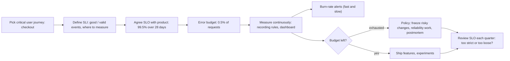
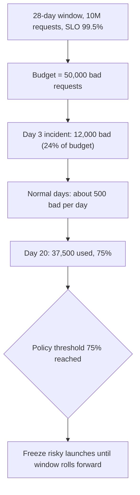

## Bối cảnh & vấn đề

Product manager hỏi: "Hệ thống có đủ ổn định để mình ra tính năng mới tuần sau không?". Engineering trả lời: "Tháng này có 3 sự cố, nhưng đều nhỏ". Product: "Nhỏ là bao nhiêu?". Không ai trả lời được bằng một con số mà cả hai bên đồng ý. Kết quả là mỗi cuộc họp release thành một cuộc tranh luận cảm tính: engineering muốn dừng để "làm cho ổn", product muốn ship vì "khách đang chờ".

Song song, team cam kết với khách enterprise một SLA 99,95% trong hợp đồng, trong khi nội bộ chưa từng đo availability thực tế là bao nhiêu. Khi một sự cố 40 phút xảy ra, phòng pháp chế mới hỏi "vậy mình có phải trả credit không?".

**SLI, SLO và error budget** biến "độ ổn định" thành một con số đo được, có mục tiêu thống nhất trước, và một **quy tắc ra quyết định** khi mục tiêu bị đe doạ. Bài này giải thích từng khái niệm, cách tính error budget, cách chọn SLI cho một nền tảng B2B2C nhiều tenant, các bẫy thường gặp (SLO 100%, đo ở sai chỗ, một tenant chết mà SLO tổng vẫn xanh), và cách trả lời câu hỏi phỏng vấn "API của bạn nhanh đủ chưa?".

## Khái niệm

### SLI: Service Level Indicator

**SLI** là một chỉ số đo chất lượng dịch vụ **từ góc nhìn người dùng**, tốt nhất ở dạng **tỉ lệ sự kiện tốt / tổng sự kiện hợp lệ**, cho ra một số từ 0 tới 100%. Dạng tỉ lệ có hai lợi ích: dễ hiểu ("99,7% request checkout thành công và nhanh"), và cùng một khung cho mọi loại SLI.

Các loại SLI phổ biến:

- **Availability**: `request không 5xx / tổng request` (loại trừ 4xx do client).
- **Latency**: `request hoàn thành < ngưỡng / tổng request`. Viết dạng tỉ lệ ("99% request < 300 ms") thay vì "p99 < 300 ms", vì tỉ lệ cộng dồn được qua thời gian và tính được error budget.
- **Correctness**: tỉ lệ response đúng (ví dụ giá hiển thị khớp giá tính khi checkout).
- **Freshness**: tỉ lệ dữ liệu được cập nhật trong ngưỡng (tồn kho cập nhật trong 1 phút; order event xử lý trong 5 phút).
- **Durability**: tỉ lệ dữ liệu ghi vào được đọc lại (cho storage).

Ví dụ cho checkout API: `số request POST /checkout trả 2xx và < 1 s / tổng request POST /checkout (trừ 4xx)`.

### SLO: Service Level Objective

**SLO** là **mục tiêu** cho một SLI trong một **cửa sổ thời gian**: "99,5% request checkout tốt trong 28 ngày trượt". SLO là cam kết **nội bộ**, do engineering, product (và thường SRE/ops) cùng thống nhất. Cửa sổ trượt (rolling 28/30 ngày) phản ánh trải nghiệm gần đây; cửa sổ lịch (theo tháng) khớp với báo cáo và SLA.

SLO không bao giờ nên là 100%. Lý do: (1) người dùng không phân biệt được 99,99% và 100% vì mạng di động, Wi-Fi, ISP của họ đã kém tin cậy hơn thế; (2) mỗi số 9 thêm vào đắt gấp nhiều lần (multi-region, đội on-call, quy trình release chậm); (3) SLO 100% nghĩa là **không bao giờ được thay đổi gì**, vì mọi thay đổi đều mang rủi ro.

### SLA: Service Level Agreement

**SLA** là **hợp đồng** với khách hàng, có **hậu quả** khi vi phạm: service credit, hoàn tiền, quyền chấm dứt hợp đồng. Ví dụ "availability hàng tháng ≥ 99,0%; dưới mức đó hoàn 10% phí tháng". SLA luôn nên **lỏng hơn** SLO (SLO 99,5%, SLA 99,0%) để có vùng đệm: khi SLO bị vi phạm, team hành động trước khi chạm SLA. SLA thường do sales/legal soạn; engineering phải đảm bảo định nghĩa đo lường trong hợp đồng (đo ở đâu, loại trừ gì, cửa sổ nào) khớp với cái mình đo được.

**Interview angle:** câu trả lời ngắn mà interviewer muốn: "SLI là cái đo, SLO là mục tiêu nội bộ, SLA là hợp đồng có phạt; SLA lỏng hơn SLO".

### Error budget

**Error budget** = `1 − SLO`: lượng "hỏng được phép" trong cửa sổ. Với SLO 99,9% trong 30 ngày:

- Theo thời gian: 30 × 24 × 60 = 43.200 phút × 0,1% = **43,2 phút** "tương đương downtime".
- Theo request: nếu tháng có 10 triệu request, được phép 10.000 request xấu.

SLO theo request thường công bằng hơn cho API: 10 phút lỗi lúc 3 giờ sáng (ít traffic) tốn ít budget hơn 10 phút lỗi giờ cao điểm, đúng với tác động thật lên người dùng.

### Error budget policy

Error budget chỉ có giá trị nếu có **chính sách** thống nhất trước khi cần: còn budget thì team được ship nhanh, thử nghiệm, chấp nhận rủi ro; budget cạn (hoặc đang cháy nhanh) thì **freeze thay đổi rủi ro**, ưu tiên công việc reliability, bắt buộc postmortem cho sự cố tiêu > X% budget. Chính sách biến tranh luận cảm tính thành quy tắc: product và engineering đã ký vào cùng một con số. Error budget **không phải KPI để phạt** người hay team; dùng nó để phạt sẽ khiến người ta giấu sự cố hoặc nới SLI.

Câu hỏi hay gặp: dependency bên ngoài (payment provider) tiêu phần lớn budget thì có tính không? Người dùng không quan tâm lỗi của ai, nên SLI **vẫn tính**. Nhưng hành động khác: bạn không "freeze deploy" để sửa provider; bạn đầu tư vào graceful degradation, retry hợp lý, provider dự phòng, và có thể thêm một SLI riêng cho phần bạn kiểm soát để phân biệt. Hợp đồng với provider (SLA của họ) là đầu vào để chọn SLO thực tế.

## Cơ chế hoạt động

Vòng đời từ người dùng tới quyết định:



Bước khó nhất là bước đầu: chọn **user journey** và **nơi đo**. SLI đo càng gần người dùng càng phản ánh đúng trải nghiệm, nhưng càng khó thu thập. Thứ tự từ gần người dùng tới xa: RUM trong browser (thấy cả lỗi mạng, JS), synthetic check từ nhiều vùng, log của CDN/load balancer (thấy request trước khi tới app, kể cả 502 khi app chết), metric trong app (chỉ thấy request đã tới app). Một chiến lược phổ biến: SLI chính đo ở load balancer/gateway, bổ sung synthetic đa vùng và RUM để bắt những gì LB không thấy.

Error budget tiêu thụ theo thời gian:



Với cửa sổ trượt, budget "hồi" dần khi ngày có sự cố trượt ra khỏi cửa sổ 28 ngày; với cửa sổ lịch, budget reset đầu tháng.

## Ví dụ thực tế

### Bảng error budget theo số 9 (Node, chạy thật)

```ts
const windowH = 30 * 24;
for (const slo of [0.99, 0.995, 0.999, 0.9995, 0.9999])
  console.log(`SLO ${(slo * 100).toFixed(2)}%  budget = ${((1 - slo) * windowH * 60).toFixed(1)} min/30d`);
```

```text
SLO 99.00%  budget = 432.0 min/30d
SLO 99.50%  budget = 216.0 min/30d
SLO 99.90%  budget = 43.2 min/30d
SLO 99.95%  budget = 21.6 min/30d
SLO 99.99%  budget = 4.3 min/30d
```

99,99% chỉ cho 4,3 phút mỗi tháng: một lần rollback chậm, một lần failover DB là hết. Đó là lý do mỗi số 9 thay đổi cả kiến trúc và quy trình (canary tự động, multi-AZ, rollback tự động), không chỉ "cố gắng hơn".

### SLI từ metric thật bằng PromQL

Với histogram `http_request_duration_seconds` và counter `http_requests_total` scrape thật từ hai instance (xem bài [metrics](/tracks/observability/learn/metrics-percentiles)), Prometheus 3.7 trả về:

```promql
# latency SLI: share of requests under 250 ms
sum(rate(http_request_duration_seconds_bucket{le="0.25"}[1m])) / sum(rate(http_request_duration_seconds_count[1m]))
#   -> 0.998

# availability SLI: 1 - error ratio
sum(rate(http_requests_total{status_code=~"5.."}[1m])) / sum(rate(http_requests_total[1m]))
#   -> 0.0029   (availability 99.71%)
```

Với SLO latency "99% < 250 ms", 0,998 đạt; với SLO availability 99,9%, error ratio 0,29% đang **cháy budget gấp 2,9 lần** tốc độ cho phép (burn rate 2,9, xem bài [alerting](/tracks/observability/learn/alerting-burn-rate)). Trong production, các tỉ lệ này được lưu bằng **recording rule** ở nhiều cửa sổ (5m, 1h, 6h, 30d) để dashboard và alert rẻ.

```yaml
# recording rules (excerpt) for a checkout SLO, validated with promtool check rules
- record: job:slo_errors_per_request:ratio_rate1h
  expr: sum by (job) (rate(http_requests_total{route="/checkout",status_code=~"5.."}[1h]))
      / sum by (job) (rate(http_requests_total{route="/checkout"}[1h]))
```

### SLI/SLO cho nền tảng e-commerce B2B2C

B2B2C: merchant (B2B) dùng nền tảng để bán cho người mua cuối (B2C). Hai nhóm người dùng với kỳ vọng khác nhau.

| Journey | SLI | Đo ở đâu | SLO (ví dụ) |
| --- | --- | --- | --- |
| Xem catalog/sản phẩm | % request 2xx và < 500 ms | CDN + LB log | 99,5% / 28 ngày |
| Search | % search 2xx và < 800 ms | Gateway | 99% / 28 ngày |
| Add-to-cart | % 2xx và < 300 ms | Gateway | 99,5% |
| Checkout/payment | % checkout thành công (không tính card declined do ngân hàng) và < 2 s | Gateway + event `order_placed` | 99,9% |
| Đăng nhập | % login 2xx và < 1 s | IdP + gateway | 99,9% |
| Admin merchant (B2B) | % 2xx và < 2 s | Gateway | 99% |
| Freshness tồn kho | % cập nhật tồn kho hiện trên storefront trong 60 s | Event timestamp vs read model | 99% |
| Order pipeline | % order event xử lý trong 5 phút | Consumer, lag theo thời gian | 99,5% |

Nguyên tắc: (1) SLO khác nhau theo journey; checkout chặt nhất vì là doanh thu. (2) Loại trừ traffic không phải người dùng: health check, bot đã nhận diện, synthetic (hoặc đo riêng). (3) Định nghĩa rõ "sự kiện hợp lệ": `card_declined` là kết quả đúng của hệ thống, không phải lỗi; `401` do token hết hạn không tính. (4) Cửa sổ 28 ngày, error budget policy được product ký.

**Multi-tenant**: SLO tổng có thể xanh trong khi một tenant 100% lỗi, vì tenant đó chỉ chiếm 0,2% traffic. Bổ sung: theo dõi SLI cho **top N tenant** (theo doanh thu/traffic) và tenant có SLA riêng; alert "bất kỳ tenant lớn nào có error ratio > X% trong 15 phút"; hoặc SLI dạng "% tenant có trải nghiệm tốt" (tenant được tính là tốt nếu SLI của họ ≥ ngưỡng). Đây chính là followUp "top tenant đang có ngày tệ mà SLO tổng xanh".

### Trả lời câu hỏi CV về latency target

"Làm sao bạn biết API nhanh đủ, target là bao nhiêu?" Interviewer kiểm tra bạn có đo hay chỉ cảm nhận. Cấu trúc trả lời (điền số thật của bạn):

1. Target cụ thể: "99% `GET /products` < 300 ms trong 28 ngày" hoặc ít nhất "p95 < 300 ms, p99 < 800 ms".
2. Đo ở đâu: histogram app theo route template, access log LB, APM; theo tenant tier.
3. Một lần vượt target: phát hiện bằng gì, nguyên nhân, fix, số trước/sau.
4. Nếu không có SLO chính thức: nói thật, rồi mô tả cách bạn sẽ đặt (lấy baseline p99 4 tuần, thảo luận với product ngưỡng nào làm user bỏ đi, chọn SLO hơi chặt hơn hiện trạng).

## Trade-offs & lựa chọn thay thế

| Lựa chọn | Ưu | Nhược | Khi nào |
| --- | --- | --- | --- |
| SLO theo request (good/total) | Phản ánh tác động thật, hợp API | Ít traffic thì nhiễu | API traffic đều, đủ lớn |
| SLO theo thời gian (phút tốt / tổng phút) | Dễ hiểu, khớp SLA truyền thống | Phút ít traffic tính như phút cao điểm | Batch, hệ thống ít request, SLA hợp đồng |
| Cửa sổ trượt 28/30 ngày | Luôn phản ánh gần đây | Khó khớp báo cáo tháng | Vận hành, alert |
| Cửa sổ lịch (tháng) | Khớp SLA, báo cáo | Reset đầu tháng làm "hết lo" giả | Báo cáo khách hàng |
| Đo ở LB/gateway | Gần user, thấy lỗi trước app | Không thấy lỗi mạng/JS phía client | SLI chính |
| RUM / synthetic | Thấy trải nghiệm thật / đa vùng | RUM nhiễu, synthetic không phải user thật | Bổ sung |

Khi nào chọn gì: SLI chính dạng request-based đo ở gateway, cửa sổ trượt 28 ngày cho vận hành; báo cáo SLA dùng cửa sổ lịch với định nghĩa trong hợp đồng. Bắt đầu với 2–3 journey quan trọng nhất thay vì SLO cho mọi endpoint.

## Edge cases & failure modes

- **Traffic thấp**: 200 request/ngày thì một lỗi = 0,5%, SLO 99,9% vô nghĩa. Dùng cửa sổ dài hơn, gộp endpoint, hoặc synthetic probe tạo traffic đều.
- **Lỗi trước khi tới chỗ đo**: app chết hẳn thì metric trong app không có request nào, error rate "0%" (chia 0/0). Đo ở LB hoặc alert khi `absent()` dữ liệu.
- **Lỗi nhanh làm latency đẹp**: request 5xx trả ngay trong 2 ms kéo p99 xuống. Latency SLI chỉ tính request thành công, hoặc SLI kết hợp "thành công và nhanh".
- **Retry che lỗi**: client retry thành công thì người dùng không thấy lỗi, nhưng server log 3 lỗi. Đo ở điểm phản ánh người dùng (sau retry) cho SLI, giữ metric server cho debug.
- **SLO bị nới để "đẹp"**: mỗi lần vi phạm lại hạ SLO. Có quy trình review SLO theo quý, dựa trên phản hồi người dùng và chi phí, không dựa trên việc "lỡ vi phạm".
- **Batch job làm méo SLI**: job nội bộ gọi API hàng triệu lần với tỉ lệ lỗi khác; tách theo client hoặc loại trừ.

## Pitfalls

- ❌ SLO 100% → ✅ mục tiêu thấp hơn mức người dùng nhận biết, để có budget cho thay đổi.
- ❌ SLI là CPU hoặc memory → ✅ SLI đo trải nghiệm người dùng: thành công, nhanh, đúng, mới.
- ❌ "p99 < 300 ms" làm SLO mà không có cách tính budget → ✅ "99% request < 300 ms" dạng tỉ lệ, cộng dồn được.
- ❌ SLA bằng SLO → ✅ SLA lỏng hơn để có vùng đệm.
- ❌ Có SLO nhưng không có error budget policy → ✅ policy ký trước bởi product và engineering.
- ❌ Dùng error budget để phạt team → ✅ dùng để quyết định ưu tiên.
- ❌ Chỉ có SLO tổng cho nền tảng multi-tenant → ✅ theo dõi thêm top tenant và tenant có SLA riêng.

## Tóm tắt

- SLI = tỉ lệ sự kiện tốt / hợp lệ, đo từ góc người dùng (availability, latency, correctness, freshness).
- SLO = mục tiêu cho SLI trong cửa sổ (99,5% / 28 ngày), cam kết nội bộ; SLA = hợp đồng có hậu quả, lỏng hơn SLO.
- Error budget = 1 − SLO: 99,9%/30 ngày ≈ 43,2 phút; 99,95% ≈ 21,6; 99,99% ≈ 4,3; theo request là 0,1% số request.
- Error budget policy biến tranh luận thành quy tắc: còn budget thì ship, cạn thì freeze và làm reliability; không dùng để phạt.
- Chọn journey quan trọng, đo gần người dùng (LB/gateway + synthetic + RUM), loại trừ bot/health check, định nghĩa rõ sự kiện hợp lệ.
- Multi-tenant: SLO tổng có thể xanh khi một tenant chết; theo dõi top tenant riêng.
- Dependency bên ngoài vẫn tính vào SLI vì người dùng vẫn chịu; hành động là degrade/fallback, không phải freeze.
