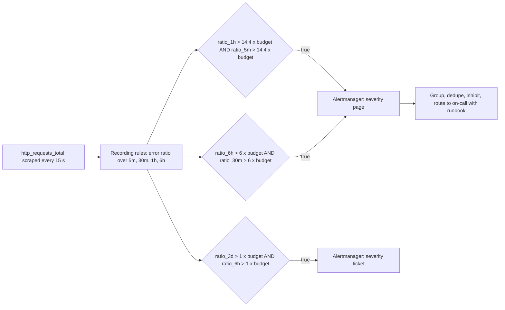
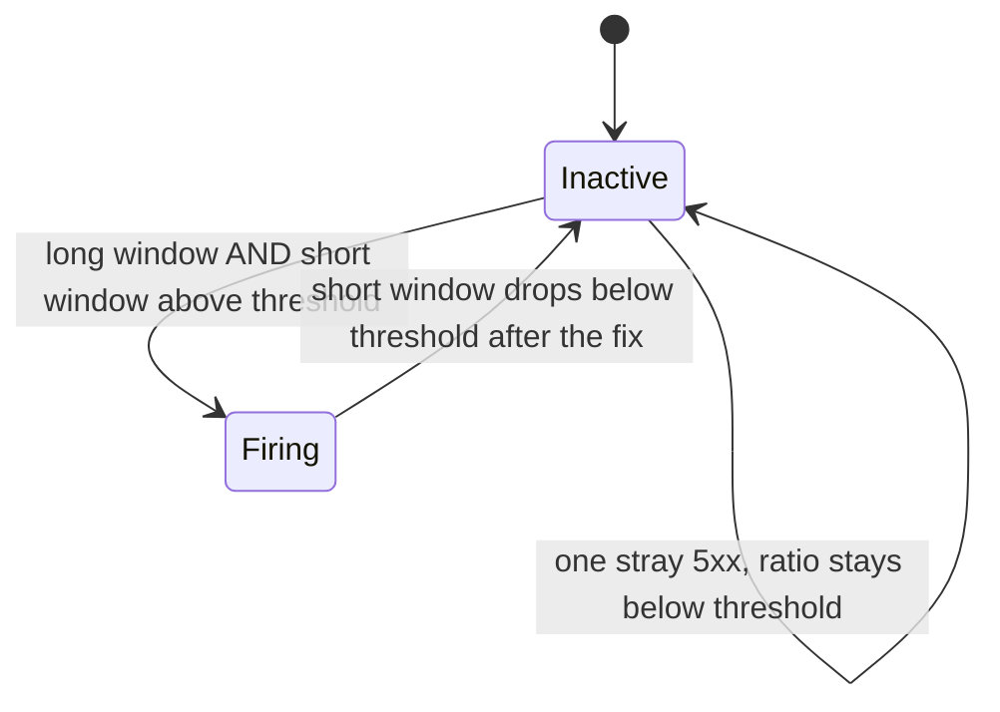

## Bối cảnh & vấn đề

On-call của một team nhận 40 page mỗi tuần. Phần lớn là `HighCPU` lúc batch job chạy, `AnyError` vì một request 5xx lẻ lúc 3 giờ sáng, và `SlowRequests` dao động quanh ngưỡng. Sau vài tuần, mọi người tắt âm thanh điện thoại vào ban đêm và quen tay bấm "acknowledge" mà không mở dashboard. Rồi một đêm checkout thật sự hỏng 40 phút; alert có bắn, nhưng lẫn giữa 6 alert vô nghĩa khác và không ai phản ứng tới khi khách hàng gọi điện. Đây là **alert fatigue**, và nó nguy hiểm hơn việc không có alert, vì nó tạo ảo giác "chúng ta có monitoring".

Gốc rễ là alert được thiết kế theo **nguyên nhân có thể có** ("CPU cao có thể làm chậm") thay vì theo **tác động lên người dùng**. Bài này giải thích nguyên tắc "page on symptoms, not causes", khái niệm **burn rate** dựa trên error budget (xem [SLO](/tracks/observability/learn/sli-slo-error-budget)), chiến lược **multi-window multi-burn-rate** của Google SRE Workbook, cách viết và **unit test** rule Prometheus bằng `promtool` với số đo thật, và cách xây dựng văn hoá on-call bền vững.

## Khái niệm

### Triệu chứng và nguyên nhân

**Triệu chứng (symptom)** là điều người dùng cảm nhận: checkout lỗi, trang chậm, dữ liệu cũ. **Nguyên nhân (cause)** là điều bên trong có thể dẫn tới triệu chứng: CPU cao, memory gần đầy, một pod restart, disk 80%. Một nguyên nhân có thể không gây triệu chứng nào (CPU 90% lúc batch nhưng latency vẫn tốt), và một triệu chứng có thể đến từ nguyên nhân bạn chưa từng nghĩ tới (một rule WAF mới, chứng chỉ hết hạn).

Nguyên tắc: **page** (đánh thức con người ngay) chỉ khi người dùng **đang hoặc sắp** bị ảnh hưởng đáng kể; mọi alert theo nguyên nhân chuyển thành **ticket** (xử lý giờ hành chính), **dashboard** (để điều tra), hoặc bỏ. Ngoại lệ hợp lệ: nguyên nhân chắc chắn dẫn tới sự cố trong thời gian ngắn mà triệu chứng tới quá muộn để kịp phản ứng, ví dụ disk sẽ đầy trong 4 giờ (`predict_linear`), chứng chỉ TLS hết hạn trong 7 ngày (ticket), primary DB mất replica cuối cùng.

### Alert phải actionable

Mỗi page phải trả lời được: người nhận cần **làm gì**, ngay bây giờ? Một alert tốt có severity rõ (`page` vs `ticket`), mô tả tác động ("checkout đang tiêu 2% error budget mỗi giờ"), **runbook link** (bước kiểm tra đầu tiên, cách mitigate), dashboard link, và được nhóm/khử trùng lặp để một sự cố ra một thông báo, không phải 50. Nếu nhận alert mà phản ứng đúng là "không làm gì, chờ nó tự hết", alert đó cần bị xoá hoặc chỉnh.

### Burn rate

**Burn rate** là tốc độ tiêu error budget so với tốc độ "vừa đủ hết đúng cuối cửa sổ". Với SLO 99,9% (error budget 0,1%), nếu error ratio hiện tại là 0,1% thì burn rate = 1: cứ đà này budget hết đúng ngày thứ 30. Error ratio 1,44% thì burn rate = 14,4: hết budget trong 30 × 24 / 14,4 = 50 giờ.

```text
burn_rate = error_ratio_observed / (1 - SLO)
budget_consumed_in_window_W = burn_rate * W / SLO_window
```

Ý nghĩa của burn rate: nó chuẩn hoá alert theo **tác động lên cam kết**, không theo con số tuỳ ý. "Error rate > 1%" với SLO 99% là bình thường, với SLO 99,99% là thảm hoạ; "burn rate > 14,4" có cùng ý nghĩa ở mọi SLO.

### Multi-window, multi-burn-rate

Một alert burn-rate với một cửa sổ đơn có trade-off khó chịu: cửa sổ dài (1 giờ) thì chính xác nhưng **tắt chậm** (sau khi đã fix, error ratio của 1 giờ còn cao thêm cả giờ); cửa sổ ngắn (5 phút) thì nhạy nhưng nhiễu. SRE Workbook đề xuất:

- **Multi-window**: mỗi alert yêu cầu **cả** cửa sổ dài **và** cửa sổ ngắn (thường bằng 1/12 cửa sổ dài) vượt ngưỡng. Cửa sổ dài đảm bảo tiêu đủ budget đáng kể; cửa sổ ngắn đảm bảo vấn đề **vẫn đang diễn ra**, nên alert tự tắt nhanh khi đã hết.
- **Multi-burn-rate**: nhiều cặp ngưỡng cho mức độ khác nhau. Bộ khuyến nghị cho SLO 30 ngày: page khi tiêu **2% budget trong 1 giờ** (burn rate 14,4; cửa sổ ngắn 5 phút); page khi tiêu **5% trong 6 giờ** (burn rate 6; cửa sổ ngắn 30 phút); ticket khi tiêu **10% trong 3 ngày** (burn rate 1; cửa sổ ngắn 6 giờ).

**Interview angle:** nói được "14,4 là vì 2% của 720 giờ chia cho 1 giờ" cho thấy bạn hiểu chứ không chép số.

## Cơ chế hoạt động

Từ request tới page:



Recording rule tính sẵn error ratio ở nhiều cửa sổ để alert rule rẻ và dễ đọc. Mỗi alert là phép `and` của hai cửa sổ. Alertmanager gom các alert cùng nhóm (theo `service`, `slo`), khử trùng lặp, **inhibit** (nếu `DatabaseDown` đang bắn thì ức chế các alert của service phụ thuộc DB), và định tuyến theo severity: page tới PagerDuty/Opsgenie, ticket tới Jira/Slack.

Thời gian phát hiện của một alert burn-rate: với error ratio thực tế `e` và ngưỡng `b × budget` trên cửa sổ `W`, nếu lỗi bắt đầu đột ngột thì ratio trên cửa sổ dài tăng dần tuyến tính, và alert bắn sau khoảng `W × (b × budget) / e`. Lỗi càng nặng, alert càng nhanh. Đây là tính chất mong muốn: sự cố 100% lỗi được phát hiện trong ~1 phút; sự cố 3% lỗi trong ~29 phút (đo thật bên dưới); lỗi 0,5% không bao giờ page mà để alert chậm/ticket bắt.



## Ví dụ thực tế

### Rule set tệ và vì sao

```yaml
- alert: HighCPU
  expr: avg(rate(process_cpu_seconds_total[1m])) > 0.8
  for: 0m
  labels: { severity: page }
- alert: AnyError
  expr: increase(http_requests_total{status=~"5.."}[1m]) > 0
  labels: { severity: page }
- alert: SlowRequests
  expr: avg(http_request_duration_seconds_sum / http_request_duration_seconds_count) > 0.5
  labels: { severity: page }
```

- **HighCPU**: nguyên nhân, không phải triệu chứng; `for: 0m` nên mỗi dao động là một page; `avg` toàn fleet che một instance nóng 100% (và ngược lại, batch job làm trung bình cao mà không ai bị ảnh hưởng).
- **AnyError**: một 5xx đơn lẻ cũng page. Phải theo **tỉ lệ** lỗi trên tổng, tốt nhất là burn rate. Thêm nữa, `increase` trên cửa sổ 1 phút với scrape 15 giây rất nhiễu.
- **SlowRequests**: dùng **average latency** (`sum/count`) che tail; lại còn `avg` của tỉ số giữa các series (không trọng số theo traffic) và tính trên counter thô **không có `rate()`**, tức là trung bình từ lúc process khởi động, gần như không bao giờ đổi. Dùng `histogram_quantile(0.99, sum by (le) (rate(..._bucket[5m])))` cho dashboard, và SLI "% request < 500 ms" cho alert.
- Chung: không có `for`, không có annotation/runbook, mọi thứ đều `page`, không có ticket.

`promtool check rules` sẽ báo các rule này **hợp lệ về cú pháp**: cái sai là ngữ nghĩa, nên phải review bằng nguyên tắc chứ không trông vào công cụ.

### Viết lại: multi-window burn-rate cho checkout SLO 99,9%

Tính ngưỡng (Node, chạy thật):

```text
--- burn rate needed to spend X% of the budget in window W
2% in 1h -> burn rate 14.4 -> error-rate threshold at 99.9% SLO = 1.44%
5% in 6h -> burn rate 6.0 -> error-rate threshold at 99.9% SLO = 0.60%
10% in 72h -> burn rate 1.0 -> error-rate threshold at 99.9% SLO = 0.10%
--- time to exhaust a full budget at burn rate b:
b=1: 720.0 h
b=6: 120.0 h
b=14.4: 50.0 h
b=100: 7.2 h
```

Rule (đã kiểm bằng `promtool check rules`: `SUCCESS: 6 rules found`):

```yaml
groups:
  - name: checkout-slo-recording
    rules:
      - record: job:slo_errors_per_request:ratio_rate5m
        expr: sum by (job) (rate(http_requests_total{route="/checkout",status_code=~"5.."}[5m]))
            / sum by (job) (rate(http_requests_total{route="/checkout"}[5m]))
      - record: job:slo_errors_per_request:ratio_rate1h
        expr: sum by (job) (rate(http_requests_total{route="/checkout",status_code=~"5.."}[1h]))
            / sum by (job) (rate(http_requests_total{route="/checkout"}[1h]))
      # ... ratio_rate30m and ratio_rate6h are defined the same way
  - name: checkout-slo-alerts
    rules:
      - alert: CheckoutErrorBudgetFastBurn
        expr: |
          job:slo_errors_per_request:ratio_rate1h > (14.4 * 0.001)
          and
          job:slo_errors_per_request:ratio_rate5m > (14.4 * 0.001)
        labels: { severity: page }
        annotations:
          summary: "Checkout burning 2% of the 30d error budget per hour"
          runbook_url: "https://runbooks.example.com/checkout-slo"
      - alert: CheckoutErrorBudgetSlowBurn
        expr: |
          job:slo_errors_per_request:ratio_rate6h > (6 * 0.001)
          and
          job:slo_errors_per_request:ratio_rate30m > (6 * 0.001)
        labels: { severity: page }
```

### Unit test rule bằng promtool (chạy thật, Prometheus 3.7.3)

Test dựng dữ liệu tổng hợp: 1.000 request/phút; khoẻ trong 60 phút đầu, rồi 3% lỗi (burn rate 30) trong 60 phút, rồi khoẻ lại. Trường hợp thứ hai: một request 5xx duy nhất trong một giờ (cái mà `AnyError` sẽ page).

```yaml
rule_files: [slo.yml]
evaluation_interval: 1m
tests:
  - interval: 1m
    input_series:
      - series: 'http_requests_total{job="checkout",route="/checkout",status_code="200"}'
        values: '0+1000x60 60970+970x59 118200+1000x60'
      - series: 'http_requests_total{job="checkout",route="/checkout",status_code="500"}'
        values: '0x60 30+30x59 1800x60'
    alert_rule_test:
      - { eval_time: 80m, alertname: CheckoutErrorBudgetFastBurn, exp_alerts: [] }
      - eval_time: 95m
        alertname: CheckoutErrorBudgetFastBurn
        exp_alerts:
          - exp_labels: { severity: page, job: checkout }
            exp_annotations:
              summary: "Checkout burning 2% of the 30d error budget per hour"
              runbook_url: "https://runbooks.example.com/checkout-slo"
      - { eval_time: 130m, alertname: CheckoutErrorBudgetFastBurn, exp_alerts: [] }
  - interval: 1m
    input_series:
      - series: 'http_requests_total{job="checkout",route="/checkout",status_code="200"}'
        values: '0+1000x60'
      - series: 'http_requests_total{job="checkout",route="/checkout",status_code="500"}'
        values: '0x30 1x30'
    alert_rule_test:
      - { eval_time: 45m, alertname: CheckoutErrorBudgetFastBurn, exp_alerts: [] }
```

```text
$ docker run --rm -v $PWD/rules:/r -w /r --entrypoint promtool prom/prometheus:v3.7.3 test rules slo_test.yml
  SUCCESS
```

Chạy thêm với `eval_time` ở từng phút để tìm thời điểm bắt đầu bắn:

```text
85:   FAILED      (not firing yet)
88:   FAILED
89:   SUCCESS     (firing)
90:   SUCCESS
```

Lỗi bắt đầu ở phút 60, alert bắn ở **phút 89**: 29 phút, khớp công thức `60 phút × 1,44% / 3% = 28,8 phút`. Sau khi lỗi dừng ở phút 120, tới phút 130 alert **đã tắt** dù error ratio 1 giờ vẫn còn ~2,5%, nhờ điều kiện cửa sổ 5 phút. Trường hợp một 5xx lẻ không bao giờ bắn. Lần đầu viết test, tôi đặt lỗi bắt đầu từ phút 0 và test "không bắn ở phút 3" **fail**: khi chưa có lịch sử, `rate()` trên cửa sổ 1 giờ chỉ dựa trên vài phút dữ liệu nên đã vượt ngưỡng ngay. Đây cũng là hành vi thật khi một service mới deploy: chuẩn bị tâm lý cho alert sớm, hoặc thêm `for` ngắn.

Unit test cho alert rule nên chạy trong CI: một thay đổi ngưỡng hay đổi tên label sai sẽ fail build thay vì phát hiện lúc 3 giờ sáng.

### Sửa một team bị 40 page/tuần

1. **Đo trước**: xuất danh sách page 4 tuần qua; với mỗi alert, đếm số lần bắn, số lần có hành động thật, số lần ngoài giờ.
2. **Xoá hoặc hạ cấp**: alert không có hành động → xoá; alert theo nguyên nhân → ticket hoặc dashboard.
3. **Thay bằng SLO burn-rate** cho 2–3 journey chính; giữ vài alert nguyên nhân "chắc chắn dẫn tới sự cố" (disk đầy trong 4 giờ).
4. **Runbook cho mọi page** và review hàng tuần: mỗi page tuần qua có đáng không?
5. **Alert lặp lại mỗi đêm rồi tự hết**: hoặc là nhiễu (xoá/nâng ngưỡng), hoặc là triệu chứng của một vấn đề thật theo lịch (backup, batch, cron) cần fix gốc; không được để nó thành "tiếng ồn quen thuộc".

### Văn hoá on-call trưởng thành

- Page ít và chất: theo dõi page/tuần/người, page ngoài giờ, tỉ lệ false positive làm metric của chính đội.
- Rotation công bằng có primary và secondary, handover có ghi chú, có bù giờ hoặc phụ cấp.
- "You build it, you run it": người viết code on-call cho service của mình, tạo động lực fix gốc.
- Sau incident: postmortem blameless và action item được ưu tiên thật (error budget policy cho phép đẩy việc reliability lên trước feature).
- Toil (công việc thủ công lặp lại) được đo và tự động hoá dần; game day/diễn tập để người mới tự tin.

## Trade-offs & lựa chọn thay thế

| Kiểu alert | Ưu | Nhược | Khi nào |
| --- | --- | --- | --- |
| Ngưỡng tĩnh theo nguyên nhân (CPU > 80%) | Dễ viết | Nhiễu, không liên quan người dùng | Ticket/dashboard, không page |
| Ngưỡng tĩnh theo triệu chứng (error rate > 1% trong 5 phút) | Gần người dùng, dễ hiểu | Không gắn với SLO; nhạy/chậm tuỳ ngưỡng | Khi chưa có SLO |
| Burn-rate một cửa sổ | Gắn với SLO | Tắt chậm hoặc nhiễu | Bước đầu |
| Multi-window multi-burn-rate | Chính xác, phát hiện nhanh khi nặng, tự tắt nhanh | Nhiều rule, cần recording rule, khó với traffic thấp | Mặc định cho journey có SLO |
| Anomaly detection (ML) | Bắt pattern lạ | Khó giải thích, false positive | Bổ sung, ít khi để page |

Khi nào chọn gì: có SLO thì dùng multi-window multi-burn-rate cho page và ticket. Chưa có SLO thì bắt đầu với ngưỡng triệu chứng có `for` hợp lý và runbook, rồi chuyển dần. Alert nguyên nhân chỉ page khi nó dự báo chắc chắn một sự cố mà triệu chứng tới quá muộn.

## Edge cases & failure modes

- **Traffic thấp**: 10 request/giờ thì 1 lỗi = 10% error ratio, burn rate 100, page vô lý. Thêm điều kiện số request tối thiểu, dùng cửa sổ dài hơn, hoặc synthetic traffic.
- **Không có dữ liệu**: service chết hẳn, counter biến mất, phép chia trả rỗng và alert **không bắn**. Thêm `absent(up{job="checkout"} == 1)` hoặc alert từ LB/synthetic.
- **Alert storm**: một DB chết làm 30 service bắn alert. Dùng grouping và inhibition trong Alertmanager; đặt alert ở tầng triệu chứng gần người dùng.
- **Alertmanager hoặc Prometheus chết**: không ai biết. Dead man's switch: một alert luôn bắn (`vector(1)`) gửi tới dịch vụ bên ngoài; nếu nó ngừng tới, dịch vụ đó page bạn.
- **Label thay đổi**: đổi `status` thành `status_code` trong code làm rule im lặng mãi mãi. Unit test rule + test metric contract trong CI.
- **Bắt đầu với lịch sử ngắn**: như test trên cho thấy, cửa sổ dài chưa đủ dữ liệu sẽ phản ứng như cửa sổ ngắn.

## Pitfalls

- ❌ Page vì CPU 85% → ✅ page theo triệu chứng/SLO; CPU lên dashboard hoặc ticket.
- ❌ `increase(5xx[1m]) > 0` → ✅ tỉ lệ lỗi trên tổng, tốt nhất là burn rate.
- ❌ Alert latency trung bình → ✅ SLI "% request < ngưỡng" hoặc percentile từ histogram.
- ❌ Một cửa sổ duy nhất → ✅ cửa sổ dài và ngắn kết hợp bằng `and`.
- ❌ Alert không runbook → ✅ annotation `runbook_url`, `summary` nêu tác động.
- ❌ Không test rule → ✅ `promtool test rules` trong CI.
- ❌ Chấp nhận alert "tự hết mỗi đêm" → ✅ xoá hoặc fix gốc; tiếng ồn quen thuộc làm on-call bỏ lỡ alert thật.

## Tóm tắt

- Page theo **triệu chứng người dùng thấy**; nguyên nhân là ticket/dashboard, trừ khi dự báo chắc chắn sự cố.
- Mọi page phải actionable, có severity, runbook, dashboard; được group và inhibit.
- Burn rate = error ratio / (1 − SLO); burn rate 1 hết budget đúng cuối cửa sổ.
- Multi-window multi-burn-rate (SLO 30 ngày): 14,4 trong 1h + 5m (page), 6 trong 6h + 30m (page), 1 trong 3d + 6h (ticket).
- Demo promtool: 3% lỗi với SLO 99,9% bắn sau 29 phút (khớp 60 × 1,44 / 3), tắt trong 10 phút sau khi hết lỗi; một 5xx lẻ không bắn.
- Unit test rule trong CI; dead man's switch cho chính hệ thống alert.
- On-call bền vững: đo page/tuần, rotation công bằng, you build it you run it, postmortem có action item thật, giảm toil.
