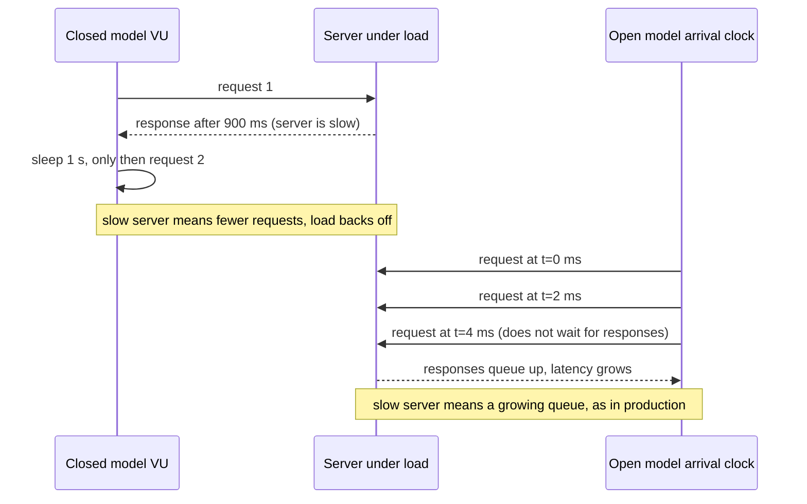
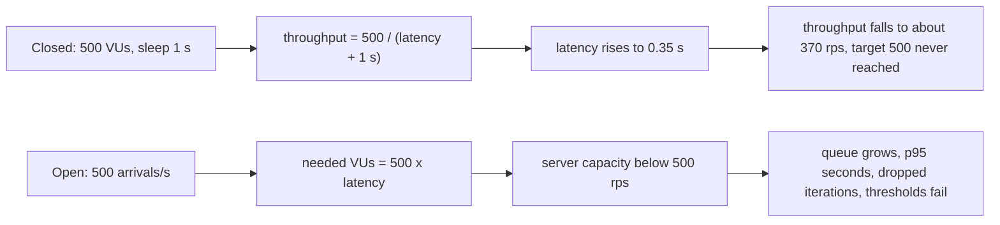

## Bối cảnh & vấn đề

Trước đợt khuyến mãi, team chạy một script k6 "chứng minh API chịu được 500 request/giây":

```js
import http from "k6/http";
import { sleep } from "k6";
export const options = { vus: 500, duration: "5m" };
export default function () {
  http.get("https://staging.example.com/api/products");
  sleep(1);
}
```

Kết quả: 0% lỗi, p95 khoảng 500 ms. Mọi người yên tâm. Ngày khuyến mãi, API sập sau 4 phút. Điều team không để ý là dòng `http_reqs` trong báo cáo: hệ thống chưa bao giờ nhận 500 request/giây trong test. Khi API chậm đi, 500 VU (virtual user) **tự động gửi chậm lại**, vì mỗi VU phải chờ response trước khi gửi request tiếp. Load test đo một tải dễ chịu hơn thực tế đúng vào lúc hệ thống yếu nhất.

Hiện tượng này có tên: **coordinated omission**, và nó là lỗi phổ biến nhất của load testing. Bài này giải thích các loại load test và khi nào chạy loại nào, **closed model vs open model**, chạy thật cùng một server bằng hai mô hình để thấy số liệu khác nhau thế nào, cách viết k6 đúng (executor arrival-rate, thresholds), cần đo gì ở phía server, và danh sách những cách load test đánh lừa bạn.

## Khái niệm

### Các loại load test

- **Smoke test**: vài VU, vài chục giây. Mục đích: script chạy đúng, môi trường sống, có baseline. Luôn chạy trước test lớn.
- **Average-load test**: tải bình thường mong đợi (ví dụ peak của ngày thường), ramp lên rồi giữ 15–60 phút. Xác nhận đạt SLO ở tải thường.
- **Stress test**: tải **vượt** peak (1,5–3 lần). Xem hệ thống degrade thế nào (chậm dần hay sập đột ngột), có load shedding không, và có **hồi phục** khi tải giảm không.
- **Spike test**: tăng đột ngột trong vài giây (flash sale, push notification gửi tới 2 triệu user). Kiểm tra autoscaling có kịp không, cache/queue/connection pool có chịu được cú sốc không.
- **Soak (endurance) test**: tải vừa trong nhiều giờ. Lộ memory leak, connection leak, disk đầy, log rotation, cache expiry, degrade theo thời gian. Đây là test bắt được memory leak chậm của một server Socket.IO; đo RSS/heap sau GC, số connection, event loop delay theo thời gian.
- **Breakpoint test**: tăng dần không ngừng tới khi vỡ. Mục đích: biết giới hạn thật cho [capacity planning](/tracks/observability/learn/capacity-planning).

Mỗi loại trả lời một câu hỏi khác nhau; một chiến lược tốt chạy nhiều loại, theo thứ tự smoke → average → stress/spike → soak.

### Virtual user, iteration và think time

**VU** trong k6 là một vòng lặp độc lập chạy hàm `default` (một **iteration**) lặp đi lặp lại. `sleep()` mô phỏng **think time**: thời gian người dùng đọc trang trước khi click tiếp. Throughput tạo ra bởi N VU phụ thuộc vào thời gian một iteration: `throughput ≈ N / (latency + think time)`.

### Closed model và coordinated omission

**Closed model**: số người dùng cố định, mỗi người chờ response rồi mới gửi request tiếp. Throughput bị **quyết định bởi latency** của chính hệ thống được test. Khi hệ thống chậm đi, tải tự giảm, hệ thống "được thở", và latency đo được thấp hơn thực tế. Thêm nữa, những request **lẽ ra** đã được gửi trong lúc VU đang chờ không bao giờ được gửi, nên không ai đo latency của chúng: các phép đo bị **bỏ sót có hệ thống** đúng vào lúc tệ nhất. Đó là **coordinated omission** (thuật ngữ của Gil Tene): bộ sinh tải "phối hợp" với hệ thống để bỏ qua dữ liệu xấu.

**Open model**: request **đến** theo tốc độ cố định, độc lập với việc hệ thống trả lời nhanh hay chậm, giống người dùng thật trên internet (người dùng mới không chờ người cũ xong mới tới). Nếu hệ thống chậm, request xếp hàng và latency tăng vọt: đúng điều sẽ xảy ra ở production. Trong k6, open model dùng executor **`constant-arrival-rate`** (tốc độ cố định) hoặc **`ramping-arrival-rate`** (tốc độ thay đổi theo stage).

Closed model không sai trong mọi trường hợp: nó phù hợp khi số client thật sự cố định và chờ nhau (một pool worker nội bộ gọi API, một ứng dụng desktop với số session cố định). Với traffic web công cộng, open model mới mô tả đúng.

### Thresholds

**Thresholds** là tiêu chí pass/fail của test, biểu diễn SLO thành điều kiện máy kiểm tra được: `http_req_failed: ["rate<0.01"]`, `http_req_duration: ["p(95)<300", "p(99)<800"]`. Khi vượt ngưỡng, k6 thoát với mã lỗi khác 0, nên test có thể chặn pipeline CI. Không có thresholds, test không bao giờ "fail"; con người đọc báo cáo và thường thấy điều mình muốn thấy.

### Dropped iterations

Với executor arrival-rate, k6 cần VU rảnh để bắt đầu iteration đúng lịch. Nếu mọi VU đang bận chờ response và đã chạm `maxVUs`, iteration bị bỏ và đếm vào **`dropped_iterations`**. Số này khác 0 nghĩa là bạn **không tạo ra** được tải mục tiêu: hoặc hệ thống quá chậm (thông tin quý), hoặc generator thiếu VU/tài nguyên.

## Cơ chế hoạt động

Hai mô hình khác nhau ở **ai quyết định thời điểm gửi request tiếp theo**:



Ở closed model, độ chậm của server kéo dài vòng lặp của VU, nên tần suất request giảm. Ở open model, đồng hồ tiếp tục phát request đúng lịch; nếu server không theo kịp, hàng đợi tăng và latency đo được phản ánh thời gian chờ trong hàng đợi.

Quan hệ giữa VU, latency và throughput (cùng là Little's Law, xem bài [capacity planning](/tracks/observability/learn/capacity-planning)):



## Ví dụ thực tế

### Cùng một server, hai mô hình (chạy thật)

Server Node mô phỏng một service có 16 "worker" và thời gian phục vụ 40 ms, tức năng lực tối đa khoảng `16 / 0,04 = 400` request/giây; request vượt năng lực vào hàng đợi. Load generator: k6 v2.3.0 chạy trong Docker (`grafana/k6`), cùng máy.

```ts
// capacity-server.mjs: 16 workers, 40 ms each -> about 400 req/s
import http from "node:http";
const WORKERS = 16, SERVICE_MS = 40; let busy = 0; const queue: Array<() => void> = []; let maxQ = 0;
const work = (done: () => void) => { busy++; setTimeout(() => { busy--; done(); if (queue.length) work(queue.shift()!); }, SERVICE_MS); };
http.createServer((req, res) => {
  if (req.url === "/stats") { res.end(JSON.stringify({ maxQueue: maxQ })); maxQ = 0; return; }
  const done = () => res.end("ok");
  if (busy < WORKERS) work(done); else { queue.push(done); maxQ = Math.max(maxQ, queue.length); }
}).listen(4401);
```

**Closed model** (script gốc của team, 30 giây):

```text
http_req_duration..............: avg=311.95ms min=73.72ms med=285.71ms max=1.07s p(90)=416.14ms p(95)=505.65ms
http_reqs......................: 11581  369.773018/s
vus_max........................: 500    min=500        max=500
server: {"maxQueue":396}
```

**Open model** với thresholds:

```js
import http from "k6/http";
export const options = {
  scenarios: {
    target_500_rps: {
      executor: "constant-arrival-rate",
      rate: 500, timeUnit: "1s", duration: "30s",
      preAllocatedVUs: 200, maxVUs: 2000,
    },
  },
  thresholds: {
    http_req_failed: ["rate<0.01"],
    http_req_duration: ["p(95)<300", "p(99)<800"],
  },
};
export default function () {
  http.get("http://host.docker.internal:4401/api/products", { timeout: "10s" });
}
```

```text
http_req_duration
✗ 'p(95)<300' p(95)=3.61s
✗ 'p(99)<800' p(99)=3.76s
http_req_failed
✓ 'rate<0.01' rate=0.00%
http_req_duration..............: avg=2.04s min=41.53ms med=2.06s max=3.81s p(90)=3.44s p(95)=3.61s
http_reqs......................: 13258  391.989216/s
dropped_iterations.............: 1743   51.533957/s
vus_max........................: 1478   min=200        max=1478
level=error msg="thresholds on metrics 'http_req_duration' have been crossed"
server: {"maxQueue":1460}
```

So sánh: closed model báo p95 **506 ms, 0% lỗi** và một người đọc vội sẽ kết luận "đạt". Nhưng throughput chỉ là **370 rps**, không phải 500: mục tiêu của test chưa bao giờ được tạo ra. Open model với cùng server: p95 **3,61 s**, hàng đợi tối đa 1.460, 1.743 iteration bị drop vì không đủ VU, thresholds fail và k6 trả exit code lỗi. Đây mới là điều xảy ra khi 500 người dùng/giây thật sự tới. Lưu ý thêm: `http_req_failed` vẫn 0% vì server không trả lỗi, chỉ chậm; nếu chỉ đặt threshold cho lỗi, test vẫn "xanh".

### Script k6 tốt hơn cho một journey thật (minh hoạ)

```js
// illustrative (minh hoạ): mixed journey, varied data, open model, thresholds per endpoint
import http from "k6/http";
import { check } from "k6";
import { SharedArray } from "k6/data";
const products = new SharedArray("p", () => JSON.parse(open("./product-ids.json"))); // 50k real ids
export const options = {
  scenarios: {
    browse:   { executor: "constant-arrival-rate", rate: 400, timeUnit: "1s", duration: "20m", preAllocatedVUs: 300, maxVUs: 3000, exec: "browse" },
    checkout: { executor: "constant-arrival-rate", rate: 20,  timeUnit: "1s", duration: "20m", preAllocatedVUs: 50,  maxVUs: 500,  exec: "checkout" },
  },
  thresholds: {
    "http_req_failed": ["rate<0.01"],
    "http_req_duration{scenario:browse}": ["p(95)<300", "p(99)<800"],
    "http_req_duration{scenario:checkout}": ["p(95)<1500"],
    "dropped_iterations": ["count<100"],
  },
};
export function browse() {
  const id = products[Math.floor(Math.random() * products.length)];
  check(http.get(`${__ENV.BASE}/api/products/${id}`, { tags: { name: "GET /api/products/:id" } }), { "200": (r) => r.status === 200 });
}
export function checkout() { /* login, add to cart, pay against a payment sandbox or stub */ }
```

Điểm chính: trộn journey theo tỉ lệ thật, dữ liệu đa dạng (tránh cache hit 100%), tag `name` theo route template (tránh mỗi URL thành một metric riêng), threshold cho `dropped_iterations`.

### Đo gì ngoài response time

- **Phía client**: throughput đạt được so với mục tiêu, error rate theo loại (timeout, 5xx, connection refused), p50/p95/p99, dropped iterations.
- **Phía server** (RED + USE, xem [RED/USE](/tracks/observability/learn/red-use-runtime)): CPU, RSS, event loop delay p99, GC pause, pool DB in-use/waiting, libuv threadpool, HTTP agent sockets.
- **DB**: CPU, active connections, lock waits, slow queries (`pg_stat_statements`), cache hit ratio, replication lag.
- **Cache/queue**: Redis latency và evictions, queue depth, consumer lag.
- **Hạ tầng**: autoscaling (bao lâu để scale out, số replica), load balancer 5xx, CDN hit ratio.

Mục tiêu không phải "đạt X rps" mà là tìm **nút thắt đầu tiên** và "knee" của đường latency theo throughput: điểm mà latency bắt đầu tăng dốc vì một resource bắt đầu bão hoà. Latency phẳng tới 800 rps rồi bùng nổ nghĩa là tại 800 rps một resource (pool, CPU, DB lock) đạt 100% và hàng đợi bắt đầu tích luỹ.

### Trả lời câu hỏi CV về load test (khung)

(Điền số liệu thật của bạn.) Công cụ và vì sao (k6 vì script JS, open model, chạy trong CI; JMeter/Gatling/Artillery/Locust tuỳ team); mục tiêu có số (target rps, SLO latency, thời lượng); kịch bản (journey, dữ liệu, open/closed, mức giống production của môi trường); kết quả (nút thắt đầu tiên: pool DB, event loop, Socket.IO broadcast, một query thiếu index; fix gì; số trước/sau); hạn chế của test. Câu followUp "làm sao biết generator không phải nút thắt": theo dõi CPU/network của máy generator (dưới ~70–80%), số VU và dropped iterations, và so sánh kết quả khi chạy phân tán trên nhiều máy.

## Trade-offs & lựa chọn thay thế

| Tiêu chí | Closed model (`vus` + `sleep`, `constant-vus`, `ramping-vus`) | Open model (`constant-arrival-rate`, `ramping-arrival-rate`) |
| --- | --- | --- |
| Mô phỏng | Số client cố định chờ nhau | Người dùng đến độc lập (web công cộng) |
| Khi hệ thống chậm | Tải tự giảm (coordinated omission) | Tải giữ nguyên, hàng đợi tăng |
| Đặt mục tiêu theo | Số người dùng đồng thời | Request (iteration) mỗi giây |
| Rủi ro | Kết quả đẹp giả | Cần đủ VU; generator có thể thành nút thắt |
| Khi nào | Worker pool nội bộ, số session cố định | Hầu hết API/web public, SLO theo rps |

| Công cụ | Mạnh | Hạn chế |
| --- | --- | --- |
| k6 | Script JS, open model sẵn, thresholds, CI, distributed (k6 operator, cloud) | Không phải Node runtime (không dùng npm module tuỳ ý) |
| JMeter | GUI, nhiều plugin, giao thức đa dạng | Nặng, XML, closed model mặc định |
| Gatling | Hiệu năng cao, open model tốt | Scala/Java DSL |
| Artillery | YAML/JS, WebSocket/Socket.IO | Ít mạnh với tải rất lớn |
| Locust | Python, dễ viết logic | Closed model theo user, GIL hạn chế mỗi worker |

Khi nào chọn gì: chọn mô hình theo cách người dùng **thật** đến; với API public, mặc định open model. Chọn công cụ theo ngôn ngữ của team và giao thức cần test; quan trọng hơn công cụ là kịch bản, dữ liệu và việc đo phía server.

## Edge cases & failure modes

- **Generator là nút thắt**: CPU generator 100% làm k6 gửi request trễ và đo latency sai (gồm cả thời gian chờ trong chính generator); ephemeral port cạn, băng thông NIC đầy. Theo dõi tài nguyên generator, chạy phân tán, đặt gần hạ tầng.
- **Cache hit 100%**: luôn gọi cùng một product ID → CDN/Redis trả hết, DB không bao giờ bị test. Dùng tập dữ liệu thật và phân phối truy cập thật (nhiều item nóng, đuôi dài).
- **DB staging nhỏ**: bảng 10.000 row thay vì 50 triệu → query nhanh giả, plan khác production. Dùng dữ liệu cỡ thật (đã ẩn danh).
- **Test quá ngắn**: 5 phút không thấy leak, GC tích tụ, connection churn, cache TTL hết đồng loạt. Có soak test.
- **Lỗi nhanh làm latency đẹp**: server trả 503 trong 2 ms khi quá tải làm p95 giảm. Luôn đọc latency cùng error rate, và lọc latency theo `expected_response:true`.
- **Bên thứ ba**: gọi payment provider thật trong test có thể vi phạm điều khoản và bị rate limit; sandbox có giới hạn khác production. Dùng stub/mock server có latency và lỗi mô phỏng, cộng một test nhỏ với sandbox.
- **Thiếu WAF/CDN/autoscaling** trong môi trường test → bỏ qua thành phần có thể là nút thắt (hoặc là lớp bảo vệ) ở production.
- **Load test vô tình trên production**: chạy nhầm `BASE` URL. Bảo vệ bằng allowlist host trong script, và đánh dấu traffic test bằng header để lọc khỏi SLO và analytics.

## Pitfalls

- ❌ `vus: 500` + `sleep(1)` để "chứng minh 500 rps" → ✅ `constant-arrival-rate` với `rate: 500`, đủ `preAllocatedVUs`/`maxVUs`.
- ❌ Không có thresholds → ✅ thresholds từ SLO (`p(95)`, `p(99)`, `http_req_failed`, `dropped_iterations`).
- ❌ Một endpoint, một ID → ✅ trộn journey, dữ liệu đa dạng cỡ thật.
- ❌ Chạy từ laptop qua VPN → ✅ generator đủ mạnh gần hạ tầng, theo dõi tài nguyên của nó.
- ❌ Chỉ nhìn báo cáo k6 → ✅ dashboard server (RED, USE, event loop, pool, DB) trong suốt test.
- ❌ Chỉ đọc average → ✅ percentile, throughput đạt được và error rate cùng lúc.
- ❌ Test một lần rồi tin → ✅ chạy lặp lại, so sánh baseline sau mỗi thay đổi lớn.

## Tóm tắt

- Smoke (script chạy đúng), average-load (đạt SLO ở tải thường), stress (vượt peak), spike (tăng đột ngột), soak (leak theo thời gian), breakpoint (tìm giới hạn).
- Closed model: throughput = VU / (latency + think time), hệ thống chậm thì tải tự giảm → coordinated omission.
- Open model (`constant-arrival-rate`) giữ tốc độ đến bất kể latency, giống người dùng thật.
- Demo: cùng server ~400 rps; closed model báo p95 506 ms và 370 rps (không đạt mục tiêu mà vẫn "xanh"); open model 500 rps cho p95 3,61 s, 1.743 dropped iterations, thresholds fail.
- Thresholds biến SLO thành tiêu chí pass/fail; theo dõi `dropped_iterations`.
- Đo cả phía server (RED, USE, event loop, pool, DB, queue, autoscaling) để tìm nút thắt đầu tiên và knee.
- Kết quả đánh lừa vì: coordinated omission, generator nghẽn, cache hit giả, DB nhỏ, test ngắn, lỗi nhanh, môi trường khác production, bên thứ ba.
