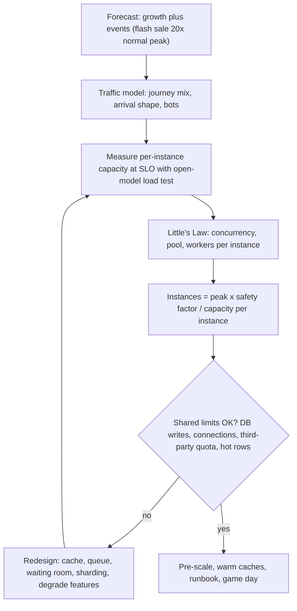
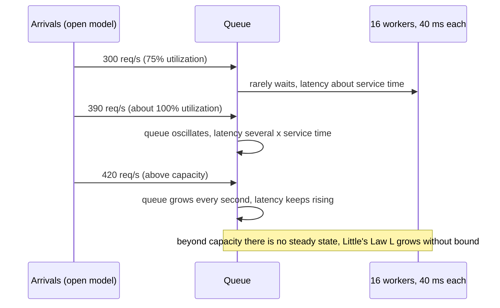

## Bối cảnh & vấn đề

Ba tuần trước Black Friday, CTO hỏi: "Chúng ta có chịu được 20 lần traffic bình thường không? Cần thêm bao nhiêu server?". Một engineer trả lời "autoscaling sẽ lo", một người khác "nhân đôi số pod cho chắc". Không ai có con số. Ngày sự kiện, app pod scale từ 10 lên 80 rất đẹp, nhưng database (không scale theo) nhận 8 lần số connection và sập ở phút thứ 6; payment provider bắt đầu trả `429 Too Many Requests` vì hạn mức của tài khoản là 200 request/giây.

**Capacity planning** là việc dự đoán tài nguyên cần cho tải tương lai, có headroom, dựa trên **số đo thật** chứ không dựa trên cảm giác. Công cụ toán học quan trọng nhất ở đây rất đơn giản: **Little's Law**. Bài này giải thích Little's Law và cách dùng nó để tính concurrency, pool size, số instance; "knee" của đường latency theo throughput với số đo thật; vì sao **giới hạn dùng chung** (DB, third-party, hot row) quyết định trần thật chứ không phải số pod; và một chiến lược đầy đủ cho flash sale 20 lần.

## Khái niệm

### Little's Law

**Little's Law**: trong một hệ thống ổn định (tốc độ vào bằng tốc độ ra trong dài hạn), số phần tử trung bình **đang ở trong hệ thống** bằng tốc độ đến nhân thời gian trung bình mỗi phần tử ở trong hệ thống:

```text
L = λ × W
L: average number of requests in flight (concurrency)
λ: arrival rate = throughput (requests per second)
W: average time in system (latency, including queueing)
```

Ví dụ: 2.000 request/giây, mỗi request mất trung bình 50 ms → `L = 2000 × 0,05 = 100` request đang được xử lý cùng lúc. Nếu mỗi request giữ một DB connection trong 20 ms, nhu cầu connection trung bình là `2000 × 0,02 = 40`. Cùng công thức cho Lambda concurrency, số worker consumer, số thread, số VU cần cho k6 open model (`VU ≈ rate × latency`).

Điểm mạnh của Little's Law là không quan tâm phân phối, không cần giả định gì về hình dạng traffic; chỉ cần **trung bình** và hệ thống ổn định. Điểm cần nhớ: đó là **trung bình**; peak tức thời cao hơn, nên pool cần headroom.

### Năng lực, utilization và knee

**Năng lực (capacity)** của một resource là throughput tối đa nó phục vụ được, ví dụ 16 worker × (1 / 40 ms) = 400 request/giây. **Utilization** = throughput / capacity. Lý thuyết hàng đợi cho thấy thời gian chờ **tăng phi tuyến** khi utilization tiến tới 100%: với mô hình M/M/1 đơn giản, thời gian trong hệ thống tỉ lệ với `1 / (1 − ρ)`, nên ở 50% utilization latency gấp 2 thời gian phục vụ, ở 90% gấp 10, ở 99% gấp 100.

Hệ quả thực tế là đường cong latency theo throughput có một **knee** (khuỷu): phẳng ở tải thấp, rồi bẻ cong lên dốc khi resource bị ràng buộc nhất tiến tới bão hoà. Capacity "dùng được" là throughput tại đó latency vẫn đạt SLO, thường ở 60–80% utilization của resource đó, **không phải** điểm sập.

### Headroom và hệ số an toàn

**Headroom** là phần năng lực dự phòng trên peak dự báo: cho dự báo sai, cho mất một AZ (N+1), cho cú spike vài giây mà autoscaling chưa kịp, cho deploy (rolling update rút bớt pod). Quy tắc khởi điểm: dự báo peak × 1,5–2, và chịu được mất một zone.

### Giới hạn dùng chung

App stateless scale ngang dễ, nhưng mọi pod cùng dùng một số thứ **không scale theo**: database primary (write path), connection limit của DB (`max_connections`), Redis một shard, hạn mức API bên thứ ba, hot row (một sản phẩm, một bản ghi tồn kho mà mọi checkout cùng cập nhật), license, giới hạn của tài khoản cloud. Trần thật của hệ thống là `min` của các giới hạn đó. Scale app khi DB đã bão hoà chỉ làm DB chậm hơn.

## Cơ chế hoạt động

Quy trình capacity planning:



Diễn giải: bắt đầu từ dự báo (tăng trưởng + sự kiện), chuyển thành **mô hình traffic** (tỉ lệ browse/search/cart/checkout, hình dạng tải: người dùng vào đúng giây mở bán). Đo năng lực **mỗi instance ở mức đạt SLO** bằng load test open model, không phải tới khi vỡ. Dùng Little's Law để suy ra concurrency và pool; chia peak × hệ số an toàn cho năng lực mỗi instance. Rồi kiểm tra các giới hạn dùng chung; nếu không đạt, thay đổi thiết kế và đo lại.

Vì sao latency bùng nổ ở knee, nhìn từ hàng đợi:



## Ví dụ thực tế

### Đo knee bằng k6 (chạy thật)

Cùng server ở bài [load testing](/tracks/observability/learn/load-testing): 16 worker, mỗi request 40 ms (thực tế ~41,5 ms vì độ trễ của timer), năng lực lý thuyết ~385–400 rps. Mỗi mức chạy k6 `constant-arrival-rate` 20 giây.

```bash
for R in 200 300 360 390 420; do
  docker run --rm -e RATE=$R -v $PWD:/s grafana/k6:latest run --quiet /s/open-rate.js
done
```

```text
rate=200  avg=43.43ms  med=41.66ms  p(95)=52.84ms   http_reqs 199.6/s                         maxQueue 6
rate=300  avg=45.06ms  med=41.38ms  p(95)=67.49ms   http_reqs 299.5/s                         maxQueue 35
rate=360  avg=132.96ms med=52.41ms  p(95)=453.54ms  http_reqs 337.1/s  dropped 441           maxQueue 163
rate=390  avg=167.8ms  med=183.91ms p(95)=237.8ms   http_reqs 385.0/s                         maxQueue 82
rate=420  avg=532.83ms med=541.63ms p(95)=887.93ms  http_reqs 388.9/s  dropped 284           maxQueue 327
```

Đọc kết quả:

- 200 → 300 rps: latency gần như bằng thời gian phục vụ (p95 53 → 67 ms). Đây là vùng phẳng.
- 390 rps: sát năng lực; median nhảy lên 184 ms (gấp 4,4 lần thời gian phục vụ). Knee nằm giữa 300 và 390.
- 420 rps: vượt năng lực; throughput đạt được **dừng ở ~389 rps** dù mục tiêu là 420, median 542 ms và tiếp tục tăng theo thời gian test, có dropped iterations.
- Lần chạy 360 rps có p95 453 ms và 441 dropped, **xấu hơn** lần 390. Đó là nhiễu thật (warm-up JIT, scheduling của Docker trên cùng máy). Bài học: chạy lặp lại mỗi mức, dùng generator riêng, và đừng kết luận từ một lần chạy.

Kiểm tra Little's Law trên số đo: ở 200 rps, `L = 200 × 0,0434 ≈ 8,7` request trong hệ thống, tức ~8,7 trên 16 worker bận (utilization ~54%). Ở 390 rps, `L = 385 × 0,168 ≈ 65`: 16 đang được phục vụ và ~49 đang **chờ**, khớp với `maxQueue` dao động quanh 82. Với SLO "p95 < 300 ms", năng lực dùng được của instance này là khoảng 300–350 rps, không phải 400.

### Tính toán cho Black Friday (số minh hoạ)

Giả định (minh hoạ, thay bằng số đo của bạn): peak thường 1.000 rps, flash sale dự báo 20x = 20.000 rps trong 15 phút đầu; mỗi pod đạt SLO tới 300 rps (đo bằng load test như trên); mỗi request giữ DB connection trung bình 8 ms; 10% request là checkout, mỗi checkout gọi payment provider một lần.

```text
pods        = 20,000 x 1.5 (safety) / 300            = 100 pods
in flight   = 20,000 rps x 0.060 s (p50 at load)    = 1,200 concurrent requests
DB conns    = 20,000 x 0.008 s                      = 160 busy connections on average -> pooler needed
payments    = 20,000 x 10%                          = 2,000 req/s  vs provider quota 200 req/s  -> 10x over
inventory   = all checkouts of the hero product update one row -> serialized by the row lock
```

Ba giới hạn dùng chung lộ ra: (1) DB connection: 100 pod × `pool.max` 10 = 1.000 connection tiềm năng, phải có PgBouncer/RDS Proxy và pool nhỏ (xem [connection pooling](/tracks/sql-postgres/learn/connection-pooling)); (2) payment provider: hạn mức 200 rps, phải đàm phán tăng quota trước, xếp hàng checkout, hoặc dùng provider phụ; (3) **hot row** tồn kho: mọi checkout của sản phẩm "hero" cập nhật cùng một row nên bị tuần tự hoá bởi row lock; với 2 ms mỗi lần update, trần là ~500 checkout/giây cho sản phẩm đó.

Redesign cho hot row (followUp của observability-036): chia tồn kho thành N "bucket" row (mỗi row giữ 1/N số lượng, checkout chọn ngẫu nhiên một bucket còn hàng); giảm tồn kho trong Redis bằng `DECR` nguyên tử rồi ghi DB bất đồng bộ qua queue với cơ chế đối soát; hoặc **reservation** có TTL (giữ chỗ khi vào checkout, xác nhận khi thanh toán). Mỗi cách đánh đổi độ đơn giản và tính nhất quán; chọn theo việc oversell có chấp nhận được không.

### Chiến lược load test và chuẩn bị flash sale 20x

1. **Mô hình hoá traffic**: tỉ lệ journey (ví dụ 70% browse, 15% search, 10% cart, 5% checkout), hình dạng spike (người dùng vào đúng 20:00:00, từ 1x lên 20x trong 30 giây), bot/scalper, phân phối sản phẩm (vài sản phẩm hero chiếm phần lớn).
2. **Test**: spike (`ramping-arrival-rate` lên 20x trong 30 giây), stress (25–30x để biết điểm vỡ và cách vỡ), soak (giờ đầu sự kiện kéo dài), trên môi trường cỡ production hoặc production ngoài giờ với traffic được đánh dấu; generator phân tán, open model.
3. **Tìm nút thắt theo thứ tự**: CDN/cache hit ratio (trang sản phẩm phải ra từ cache), tốc độ autoscaling (có kịp trong 30 giây không, thường là không), DB write path và hot row, connection pool, third-party (payment, SMS, email), queue và consumer lag.
4. **Chuẩn bị**: **pre-scale** (không chờ autoscale), warm cache, **waiting room/virtual queue** cho lượt vào checkout, rate limit per user/IP, chặn bot, feature degrade (tắt recommendation, review, search gợi ý), kill switch qua feature flag, đàm phán quota bên thứ ba.
5. **Ngày D**: war room, dashboard riêng cho sự kiện (RED theo journey, DB, queue, provider), runbook với **ngưỡng quyết định** viết trước (ví dụ "p95 checkout > 2 s trong 3 phút → bật waiting room"), người có quyền quyết định rõ ràng.

### Kiểm chứng hiệu năng khi tách monolith

Trước khi chuyển traffic từ monolith sang service mới, cần bằng chứng "ít nhất tốt bằng":

- **Baseline** của monolith: p50/p99, error rate, throughput theo endpoint, đo trong 2–4 tuần.
- **Shadow traffic**: nhân bản request thật sang service mới, bỏ response, so sánh latency và nội dung (cẩn thận với request có side effect: chỉ shadow đọc, hoặc dùng sandbox).
- **Canary theo phần trăm** (1% → 5% → 25% → 100%) với tiêu chí dừng/rollback viết trước.
- **End-to-end**: tính thêm các hop mạng và Kafka; với luồng bất đồng bộ, đo **độ trễ nhất quán** (từ lúc event tạo ra tới lúc read model cập nhật) bằng metric riêng.
- Load test service mới ở mức peak × hệ số an toàn **trước** khi canary vượt mức có ý nghĩa.

## Trade-offs & lựa chọn thay thế

| Cách tăng năng lực | Ưu | Nhược | Khi nào |
| --- | --- | --- | --- |
| Pre-scale (provision trước) | Chắc chắn, không chờ | Tốn tiền khi không dùng | Sự kiện biết trước giờ |
| Autoscaling theo CPU/rps | Tự động, tiết kiệm | Chậm (phút), không giúp spike giây | Tăng trưởng dần |
| Cache/CDN | Giảm tải backend nhiều lần | Dữ liệu cũ, invalidation | Trang đọc nhiều |
| Queue + xử lý bất đồng bộ | Hấp thụ spike, bảo vệ DB | Trễ, phức tạp, cần idempotency | Write path, notification |
| Waiting room | Giữ hệ thống trong năng lực | Trải nghiệm chờ | Flash sale, mở bán vé |
| Load shedding / degrade | Giữ chức năng cốt lõi | Mất tính năng phụ | Mọi hệ thống có peak |
| Scale DB (read replica, sharding) | Tăng trần dùng chung | Đắt, lâu, phức tạp | Tăng trưởng dài hạn |

Khi nào chọn gì: sự kiện biết trước → pre-scale + cache + waiting room + degrade; tăng trưởng dần → autoscaling + capacity review hàng quý. Giới hạn dùng chung giải quyết bằng thiết kế (cache, queue, chia hot row), không bằng thêm pod.

## Edge cases & failure modes

- **Autoscaling không kịp**: HPA phản ứng theo metric trễ 30–60 giây, pod mới cần thời gian khởi động, warm-up JIT, kéo image; spike 30 giây đã qua trước khi pod mới sẵn sàng. Pre-scale.
- **Scale làm hỏng dependency**: thêm pod làm số connection DB tăng tuyến tính; retry của nhiều pod cộng lại thành retry storm.
- **Cold cache sau deploy hoặc failover**: hit ratio từ 95% về 0% nhân tải DB 20 lần. Warm cache, deploy trước sự kiện đủ lâu, không deploy trong sự kiện.
- **Hệ thống quá tải không hồi phục** (metastable): khi vượt năng lực, timeout và retry giữ tải cao ngay cả khi traffic gốc đã giảm. Cần load shedding, retry budget, circuit breaker (xem [circuit breaker và shedding](/tracks/distributed-systems/learn/circuit-breaker-bulkhead-shedding)).
- **Little's Law bị dùng ngoài trạng thái ổn định**: khi λ > capacity, không có trạng thái ổn định, L tăng không giới hạn; công thức chỉ dùng để tính cho tải dưới năng lực.
- **Đo năng lực tới lúc vỡ**: chọn "1 pod chịu 400 rps" từ điểm sập thay vì từ điểm đạt SLO dẫn tới thiếu năng lực ở ngày D.

## Pitfalls

- ❌ "Autoscaling sẽ lo" → ✅ pre-scale cho sự kiện biết trước, autoscaling cho tăng trưởng dần.
- ❌ Năng lực mỗi instance đo tới lúc vỡ → ✅ đo ở mức còn đạt SLO, giữ headroom.
- ❌ Chỉ tính số pod → ✅ kiểm tra mọi giới hạn dùng chung: DB, connection, quota bên thứ ba, hot row.
- ❌ Pool size theo cảm tính → ✅ Little's Law: throughput × thời gian giữ connection, cộng headroom.
- ❌ Một lần chạy load test là đủ → ✅ chạy lặp lại mỗi mức; nhiễu giữa các lần là thật (demo 360 rps).
- ❌ Không có ngưỡng quyết định viết trước → ✅ runbook "nếu X thì bật waiting room/degrade", ai có quyền quyết.

## Tóm tắt

- Capacity planning dựa trên số đo: dự báo × hệ số an toàn / năng lực mỗi instance ở mức đạt SLO.
- Little's Law `L = λ × W`: 2.000 rps × 50 ms = 100 request đồng thời; dùng cho pool, worker, concurrency, VU.
- Latency tăng phi tuyến khi utilization tới 100%: knee thường ở 60–80%; demo: p95 67 ms ở 300 rps, median 542 ms ở 420 rps, throughput dừng ~389 rps.
- Trần thật là min của các giới hạn dùng chung: DB write, connection, quota bên thứ ba, hot row.
- Flash sale: mô hình traffic, test spike/stress/soak open model, pre-scale, warm cache, waiting room, rate limit, degrade, kill switch, ngưỡng quyết định viết trước.
- Hot row tồn kho: chia bucket, Redis `DECR` + ghi bất đồng bộ, hoặc reservation có TTL.
- Tách monolith: baseline, shadow, canary với tiêu chí rollback, đo độ trễ nhất quán của luồng bất đồng bộ.
