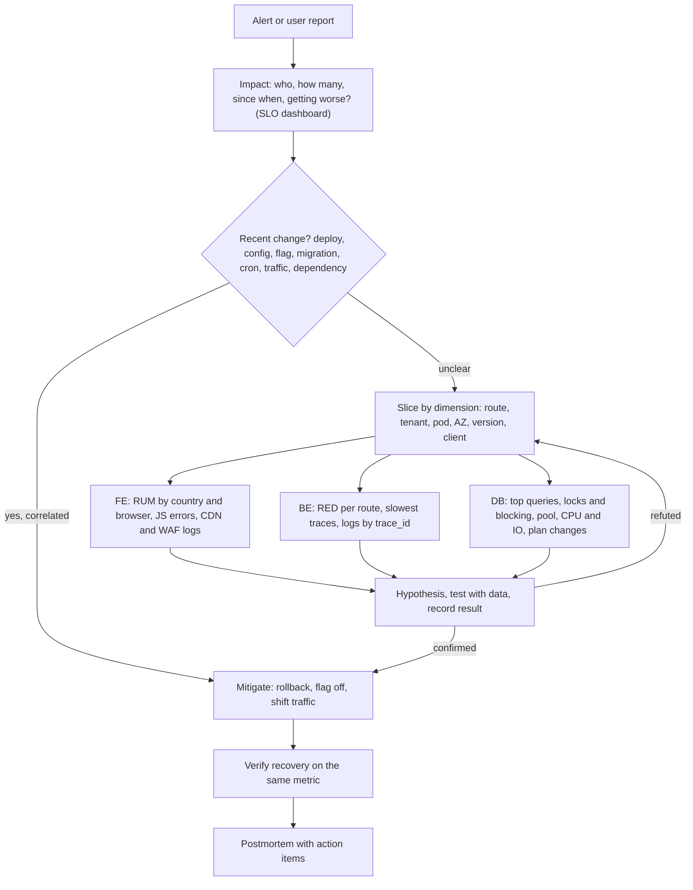

## Bối cảnh & vấn đề

Câu hỏi phỏng vấn senior hay gặp nhất của track này là: "Kể sự cố production khó nhất bạn từng debug". Câu trả lời yếu nghe như thế này: "Hệ thống bị chậm, mình xem log thì thấy lỗi, sửa xong thì hết". Câu trả lời mạnh cho thấy một **phương pháp**: xác nhận tác động bằng dữ liệu, loại trừ từng giả thuyết bằng bằng chứng cụ thể, mitigate trước khi tìm root cause, và để lại một cải tiến để lần sau phát hiện nhanh hơn.

Ở production thật cũng vậy. Một sự cố kéo dài 3 giờ thường không phải vì bug khó, mà vì team **nhảy từ giả thuyết này sang giả thuyết khác** theo linh cảm: "chắc do Redis", restart Redis; "chắc do deploy hôm qua", rollback (nhưng không có deploy nào liên quan); trong khi dữ liệu để khoanh vùng đã có sẵn trên dashboard. Bài này trình bày một phương pháp có thể lặp lại, rồi áp dụng nó vào năm kịch bản phổ biến nhất, hai trong số đó được tái hiện thật: lỗi `ECONNRESET` ngẫu nhiên do keep-alive và query chậm vì lock blocking trong Postgres.

## Khái niệm

### Tác động trước, nguyên nhân sau

Bước đầu tiên luôn là **định lượng tác động**: ai bị ảnh hưởng (tất cả, một tenant, một region, một loại thiết bị), bao nhiêu (tỉ lệ request, số user), từ khi nào (thời điểm bắt đầu chính xác), và có đang xấu đi không. Thông tin này quyết định mức độ nghiêm trọng (SEV), ai cần được gọi, và **thu hẹp không gian giả thuyết**. Thời điểm bắt đầu chính xác tới phút là manh mối giá trị nhất, vì có thể đối chiếu với deploy, config change, cron, traffic.

### Thay đổi gần đây

Phần lớn sự cố production đến từ **thay đổi**: deploy code, thay đổi config, feature flag, migration, thay đổi hạ tầng (version node pool, rule WAF, chứng chỉ), thay đổi của dependency (provider đổi API, thư viện auto-update), thay đổi traffic (chiến dịch marketing, bot, tenant mới onboard), và các thay đổi "theo lịch" (cron, batch, cache TTL hết đồng loạt, rotate key). "Không có deploy" không có nghĩa "không có thay đổi". Một **timeline thay đổi** chung (deploy, flag, config, infra) đặt cạnh biểu đồ là công cụ debug rẻ nhất.

### Mitigate trước root cause

**Mitigation** là hành động giảm tác động ngay, kể cả khi chưa hiểu nguyên nhân: rollback, tắt feature flag, chuyển traffic khỏi instance/region lỗi, scale, rate limit traffic xấu, failover. Root cause tìm sau, khi người dùng đã thôi chịu thiệt. Ngoại lệ: thu thập bằng chứng **dễ mất** trước khi mitigate nếu rẻ (heap snapshot, thread dump, `pg_stat_activity` lúc đang chặn), vì restart sẽ xoá chúng.

### Khoanh vùng theo chiều (dimensional slicing)

Khi một chỉ số xấu đi, cắt nó theo từng **chiều** để xem phần xấu có tập trung không: endpoint/route, tenant, instance/pod, AZ/region, version, loại client (browser, app version), tham số request (page size, filter), dependency. Một vấn đề "toàn hệ thống" và một vấn đề "chỉ một pod" có hướng điều tra hoàn toàn khác. Đây là lý do metric cần label `version`, `instance`, `route`, và log/trace cần `tenant_id`: không có chiều thì không cắt được.

### Giả thuyết và bằng chứng

Mỗi bước là một vòng: đưa ra giả thuyết **có thể bác bỏ** ("nếu là pool cạn thì `waitingCount` > 0 và thời gian `pg-pool.connect` trong trace tăng"), kiểm tra bằng dữ liệu, ghi lại kết quả (kể cả giả thuyết sai). Tránh hai bẫy: **confirmation bias** (chỉ tìm dữ liệu ủng hộ giả thuyết yêu thích) và **tương quan giả** (một metric lạ trùng thời điểm nhưng cũng lạ cả tuần trước). So sánh với baseline (cùng giờ hôm qua, tuần trước) trước khi gọi một thứ là bất thường.

## Cơ chế hoạt động



Diễn giải: tác động và thời điểm bắt đầu dẫn tới câu hỏi "có thay đổi gì không"; nếu có và thời điểm khớp, mitigate bằng cách đảo thay đổi đó (nhanh nhất, ít rủi ro nhất). Nếu không rõ, khoanh vùng theo chiều rồi theo tầng. Mỗi tầng có công cụ riêng. Vòng giả thuyết lặp tới khi có bằng chứng. Sau mitigate, xác nhận hồi phục trên **cùng** metric đã báo động (không phải "có vẻ ổn rồi"), rồi postmortem.

## Ví dụ thực tế

### Kịch bản 1: p99 từ 300 ms lên 4 s lúc 14:00, p50 không đổi, không có deploy

p50 không đổi nghĩa là **phần lớn** request vẫn bình thường; chỉ một **phần** (≥ 1%) bị ảnh hưởng nặng. Đây là manh mối định hướng: tìm lát cắt.

1. **Theo endpoint/params/tenant**: lọc trace có duration > 2 s, nhóm theo `tenant.id`, `page.size`, filter. Một tenant lớn với danh mục 2 triệu sản phẩm? Một filter mới từ frontend?
2. **Theo instance/AZ**: p99 theo `instance`. Một pod bị GC liên tục, CPU throttling, noisy neighbor trên cùng node?
3. **Theo dependency**: trong trace chậm nhất, span nào chiếm thời gian: DB, Elasticsearch, Redis miss rồi gọi DB?
4. **Thay đổi không phải deploy lúc 14:00**: job batch (báo cáo, reindex) chạy 14:00 chiếm CPU của DB/Elasticsearch; cache TTL 24 giờ được set lúc 14:00 hôm qua hết đồng loạt (stampede); crawler/bot bắt đầu quét; statistics của bảng cập nhật làm plan đổi.
5. **Mitigate** khi đã khoanh vùng: rate limit bot, dời batch, cấp cache; rồi fix gốc.

Nếu mọi trace chậm đều đi qua Elasticsearch với **deep pagination** (`from: 10000, size: 50`): Elasticsearch phải lấy và sắp xếp `from + size` document trên **mỗi shard** rồi gộp, chi phí tăng tuyến tính theo độ sâu, và mặc định giới hạn `index.max_result_window = 10000`. Fix: `search_after` với sort ổn định (kèm point-in-time), giới hạn độ sâu trang trên UI, hoặc chuyển sang cursor.

### Kịch bản 2: lỗi 500 ngẫu nhiên ở checkout, khoảng 1/200 request

"Ngẫu nhiên" là từ mà dữ liệu chưa được cắt đủ. Quy trình:

1. **Định lượng**: error rate theo thời gian, endpoint, tenant, **instance**, version, region. Tập trung ở một pod → pod hỏng. Đều mọi nơi → vấn đề hệ thống hoặc dữ liệu.
2. **Lấy mẫu**: trace và log của request lỗi (`status_code=500`, theo `trace_id`) → exception thật và span nào fail.
3. **Giả thuyết thường gặp** cho lỗi hiếm tỉ lệ thấp: một instance hỏng trong pool; connection keep-alive bị đóng phía bên kia (`ECONNRESET`); pool cạn khi burst; deadlock/serialization failure trong DB; timeout với dependency ngoài ở tail; dữ liệu đặc biệt (null, unicode, số lượng 0) của một số order.
4. **Kiểm chứng** bằng tương quan với pod/tenant/payload, tái hiện ở staging.
5. **Fix** và thêm alert/test.

Nếu mọi lỗi là `ECONNRESET` khi gọi một service nội bộ, giả thuyết hàng đầu là **keep-alive idle timeout mismatch**: client giữ connection idle trong pool lâu hơn thời gian bên server (hoặc proxy/LB ở giữa) chịu giữ nó. Server đóng socket idle đúng lúc client vừa gửi request mới trên socket đó, và client nhận RST. Tái hiện thật (Node 24, upstream đóng socket idle sau 200 ms mà không gửi header `Keep-Alive: timeout`, client gửi request mỗi 190–210 ms trên agent keep-alive với `maxSockets: 1`):

```ts
import http from "node:http"; import net from "node:net";
const IDLE = Number(process.argv[2]), PORT = Number(process.argv[3]), CLIENT_FREE = Number(process.argv[4]);
const server = net.createServer((sock) => {               // minimal HTTP upstream (think proxy / LB)
  sock.setTimeout(IDLE, () => sock.destroy());              // closes idle keep-alive sockets after IDLE ms
  sock.on("data", () => sock.write("HTTP/1.1 200 OK\r\nContent-Length: 2\r\nConnection: keep-alive\r\n\r\nok"));
  sock.on("error", () => {});
});
await new Promise<void>((r) => server.listen(PORT, r));
const agent = new http.Agent({ keepAlive: true, maxSockets: 1, timeout: CLIENT_FREE });
const get = () => new Promise<string>((resolve) => {
  http.get({ host: "127.0.0.1", port: PORT, agent }, (res) => { res.resume(); res.on("end", () => resolve("ok")); })
    .on("error", (e: NodeJS.ErrnoException) => resolve(e.code ?? e.message));
});
const counts: Record<string, number> = {};
for (let i = 0; i < 300; i++) {
  const r = await get(); counts[r] = (counts[r] ?? 0) + 1;
  await new Promise((res) => setTimeout(res, 190 + Math.random() * 20));
}
console.log(`upstream idle close=${IDLE}ms, client socket timeout=${CLIENT_FREE}ms ->`, counts);
```

```text
upstream idle close=200ms, client socket timeout=15000ms -> { ok: 253, ECONNRESET: 47 }
upstream idle close=200ms, client socket timeout=150ms -> { ok: 300 }
```

47/300 request lỗi `ECONNRESET` khi client giữ socket lâu hơn upstream; **0** lỗi khi timeout idle của client **ngắn hơn** của upstream. Ở production, tỉ lệ thấp hơn nhiều (vì khoảng idle hiếm khi khớp chính xác ranh giới) nên trông "ngẫu nhiên 1/200". Fix: đặt idle timeout của client < của server; ở chiều ALB → Node, đặt `server.keepAliveTimeout` của Node **lớn hơn** idle timeout của ALB (mặc định 60 s, verify), vì Node mặc định 5 s và ALB sẽ tái dùng connection Node đã đóng, trả `502` cho user; retry an toàn cho request idempotent. Một lần tái hiện trước đó với Node server chuẩn **không** ra lỗi nào: `http.Agent` của Node đọc header `Keep-Alive: timeout=N` từ server Node và tự hết hạn socket sớm hơn (verify phiên bản), nên lỗi chủ yếu xuất hiện khi ở giữa là proxy/LB hoặc server khác không gửi gợi ý đó.

### Kịch bản 3: query 20 ms trong nhiều tháng bỗng mất 8 s, CPU DB 100%, không có deploy

Các nhánh cần kiểm tra:

- **Plan thay đổi**: statistics được cập nhật (hoặc lỗi thời), data vượt ngưỡng khiến optimizer chọn sequential scan, **parameter sniffing** (SQL Server cache plan theo giá trị tham số đầu tiên; một giá trị bất thường tạo plan tệ cho mọi giá trị khác), hoặc Postgres chuyển từ custom plan sang generic plan sau 5 lần thực thi prepared statement (verify). Xem [planner và EXPLAIN](/tracks/sql-postgres/learn/planner-explain).
- **Blocking/lock**: transaction dài, migration giữ lock, job batch. SQL Server: `sys.dm_exec_requests.blocking_session_id`; Postgres: `pg_stat_activity` + `pg_blocking_pids()`.
- **Index bị drop/disabled**, bloat do autovacuum không theo kịp.
- **Tải thay đổi**: tenant mới cực lớn, cache miss hàng loạt đổ về DB.

Công cụ: `pg_stat_statements` (top query theo `total_exec_time`), `EXPLAIN (ANALYZE, BUFFERS)` so với plan cũ, Query Store (SQL Server) để so sánh và **force** plan cũ. Mitigate: force plan (Query Store), `ANALYZE` lại bảng, kill session đang chặn, tạm rate limit, rồi fix gốc.

Tái hiện thật nhánh blocking (Postgres 16.15): một session `nightly-report` mở transaction, update một row tồn kho rồi giữ transaction (mô phỏng job làm việc khác bên trong transaction); `checkout-api` cập nhật cùng row.

```sql
-- session 1 (nightly-report)
BEGIN;
UPDATE products SET stock = stock - 1 WHERE id = 1;
SELECT pg_sleep(20);          -- long work inside the transaction
-- session 2 (checkout-api)
UPDATE products SET stock = stock - 1 WHERE id = 1;   -- waits
-- diagnosis
SELECT pid, application_name AS app, state, wait_event_type AS wtype, wait_event,
       pg_blocking_pids(pid) AS blocked_by, date_trunc('second', now() - query_start) AS running, left(query, 45) AS query
FROM pg_stat_activity
WHERE backend_type = 'client backend' AND pid <> pg_backend_pid()
ORDER BY query_start;
```

```text
 pid |      app       | state  |  wtype  |  wait_event   | blocked_by | running  |                     query
-----+----------------+--------+---------+---------------+------------+----------+-----------------------------------------------
 106 | nightly-report | active | Timeout | PgSleep       | {}         | 00:00:03 | SELECT pg_sleep(20);
 113 | checkout-api   | active | Lock    | transactionid | {106}      | 00:00:03 | UPDATE products SET stock = stock - 1 WHERE i
```

`checkout-api` đang chờ `Lock/transactionid` và `blocked_by = {106}`: chính là session report. Đặt `application_name` cho mỗi service (connection string `?application_name=checkout-api`) làm cột này đọc được ngay. Mitigate: `SELECT pg_terminate_backend(106)` (sau khi xác nhận an toàn), đặt `lock_timeout` cho checkout để fail nhanh thay vì treo, `idle_in_transaction_session_timeout` và tách công việc dài ra khỏi transaction.

### Kịch bản 4: người dùng một region báo "site hỏng", mọi dashboard xanh

Dashboard xanh trong khi người dùng kêu là dấu hiệu **khoảng mù** của monitoring: các chỉ số đo ở server chỉ thấy request **đã tới server**.

- **Trước backend**: DNS (resolver của ISP, TTL), CDN edge/PoP của region đó, WAF rule chặn nhầm (geo, bot score), chứng chỉ TLS (chain thiếu trên một số client), routing của ISP. Kiểm tra log CDN/WAF theo country.
- **Frontend**: JS error chỉ trên một browser/phiên bản; chunk JS 404 sau deploy vì CDN của region đó cache HTML cũ trỏ tới file đã xoá; third-party script (payment widget, consent banner) lỗi hoặc bị chặn ở region đó.
- **Hành động**: tái hiện từ region đó (synthetic check đa vùng, VPN, thiết bị thật), xin HAR và console log từ user, xem RUM theo country (Web Vitals, JS error rate).
- **Bài học**: thêm synthetic monitoring đa vùng và RUM error rate vào SLO; trả lời rõ "phần nào của monitoring đo trải nghiệm người dùng (RUM, synthetic, CDN log) và phần nào chỉ đo server của mình".

### Kịch bản 5: backend p99 tốt nhưng trang sản phẩm chậm

Thời gian người dùng cảm nhận ≠ latency của API. Nhìn **RUM**: TTFB (CDN, SSR), LCP (ảnh hero chưa tối ưu, font chặn render, ảnh lazy-load sai cho phần trên màn hình), INP (JS nặng chặn main thread khi hydrate), CLS; số call API tuần tự từ client (waterfall: call 2 chờ call 1); bundle size; third-party script. Với Next.js: so sánh server timing của route (span từ `instrumentation.ts`) với LCP thực tế; nếu TTFB tốt mà LCP tệ, vấn đề nằm ở client.

### Kể câu chuyện debug trong phỏng vấn (khung)

(Điền chi tiết và số liệu thật của bạn, không bịa.)

- **Situation**: triệu chứng người dùng thấy và tác động (bao nhiêu tenant/user, bao lâu).
- **Khoanh vùng**: tầng nào loại trừ trước, **bằng dữ liệu gì** (log theo request ID, metric theo pod, query plan, network tab).
- **Giả thuyết sai đã loại bỏ**: cho thấy tư duy thật, không phải may mắn.
- **Root cause**, mitigate ngắn hạn và fix dài hạn.
- **Phòng ngừa**: alert/test/runbook đã thêm; MTTD lần đó là bao lâu và cải tiến nào sẽ rút ngắn nó.
- Nêu **tên công cụ cụ thể**; interviewer sẽ hỏi tiếp về chúng.

## Trade-offs & lựa chọn thay thế

| Hành động | Ưu | Nhược | Khi nào |
| --- | --- | --- | --- |
| Rollback ngay | Nhanh, đảo thay đổi nghi ngờ | Mất bằng chứng; vô ích nếu không phải do deploy; migration không đảo được | Thời điểm khớp với deploy, rollback an toàn |
| Tắt feature flag | Nhanh hơn rollback, chọn lọc | Chỉ khi thay đổi nằm sau flag | Tính năng mới gắn flag |
| Restart pod/service | Thường "chữa" được leak, deadlock | Xoá bằng chứng, sự cố quay lại | Sau khi lấy snapshot/dump nếu có thể |
| Scale out | Mua thời gian khi quá tải | Vô ích nếu nút thắt là dùng chung (DB) | Nút thắt ở tầng stateless |
| Điều tra tiếp trước khi mitigate | Hiểu đúng nguyên nhân | Người dùng chịu thiệt lâu hơn | Tác động nhỏ, không có mitigation an toàn |

Khi nào chọn gì: tác động lớn và có mitigation an toàn → mitigate trước, lấy bằng chứng rẻ trước nếu có thể. Tác động nhỏ và đang ổn định → điều tra kỹ hơn để không đoán mò. Luôn ghi lại hành động trong timeline.

## Edge cases & failure modes

- **Nhiều thay đổi cùng lúc**: deploy, flag, migration trong cùng giờ; rollback một cái không hết. Hạn chế thay đổi đồng thời; timeline thay đổi giúp thấy.
- **Bằng chứng biến mất**: restart xoá state, log rotate, trace bị sample; `pg_stat_activity` chỉ thể hiện hiện tại. Lấy snapshot sớm; tail sampling giữ trace lỗi.
- **Giả thuyết "trùng thời điểm"**: CPU tăng lúc 14:00 mỗi ngày (batch bình thường) bị đổ lỗi. So với baseline cùng giờ hôm trước.
- **Retry che lỗi**: client retry thành công, nên error rate phía user thấp trong khi server lỗi nhiều và tải tăng gấp đôi. Xem metric cả hai phía.
- **Sự cố chỉ ở tail của một chiều hiếm**: một tenant chiếm 0,2% traffic hỏng 100%, SLO tổng xanh. Theo dõi top tenant riêng.
- **Hiệu ứng quan sát**: bật debug log hoặc profiler nặng làm hệ thống chậm thêm. Dùng log level theo tenant, profiler sampling.

## Pitfalls

- ❌ Nhảy vào giả thuyết yêu thích ("chắc do Redis") → ✅ định lượng tác động, cắt theo chiều, rồi mới đặt giả thuyết.
- ❌ "Không có deploy nên không có thay đổi" → ✅ kiểm tra config, flag, cron, traffic, dependency, cert, TTL.
- ❌ Tìm root cause khi người dùng đang chịu thiệt → ✅ mitigate trước, lấy bằng chứng rẻ trước khi restart.
- ❌ Gọi một lỗi là "ngẫu nhiên" → ✅ cắt theo pod, tenant, payload; "ngẫu nhiên" thường là "chưa cắt đúng chiều".
- ❌ Tin dashboard server xanh nghĩa là user ổn → ✅ RUM, synthetic đa vùng, log CDN/WAF.
- ❌ Client giữ keep-alive lâu hơn server/LB → ✅ idle timeout client < server; Node sau ALB: `keepAliveTimeout` > idle timeout của ALB.
- ❌ Không đặt `application_name` cho kết nối DB → ✅ đặt theo service để đọc `pg_stat_activity` ngay.

## Tóm tắt

- Phương pháp: tác động (ai, bao nhiêu, từ khi nào) → thay đổi gần đây → khoanh vùng theo chiều và tầng → giả thuyết có thể bác bỏ + bằng chứng → mitigate → xác nhận trên cùng metric → postmortem.
- Mitigate trước root cause; lấy bằng chứng dễ mất trước khi restart.
- p99 tăng mà p50 không đổi: một phần request bị ảnh hưởng; tìm lát cắt (tenant, params, pod, dependency, batch, stampede, bot).
- Lỗi "ngẫu nhiên" `ECONNRESET`: keep-alive mismatch; demo 47/300 lỗi khi client giữ socket lâu hơn upstream, 0 khi ngắn hơn.
- Query đột ngột chậm: plan đổi, parameter sniffing, lock blocking (`pg_blocking_pids`, demo), bloat, tải mới; Query Store/`pg_stat_statements`/`EXPLAIN (ANALYZE, BUFFERS)`.
- Dashboard xanh mà user kêu: khoảng mù trước backend (DNS, CDN, WAF, TLS) và frontend; thêm synthetic đa vùng và RUM.
- Kể chuyện debug: phương pháp, bằng chứng, giả thuyết sai, công cụ cụ thể, cải tiến phát hiện.
