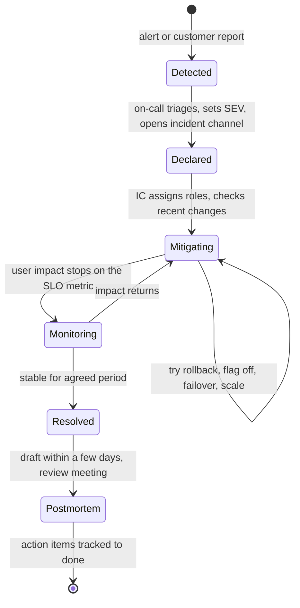
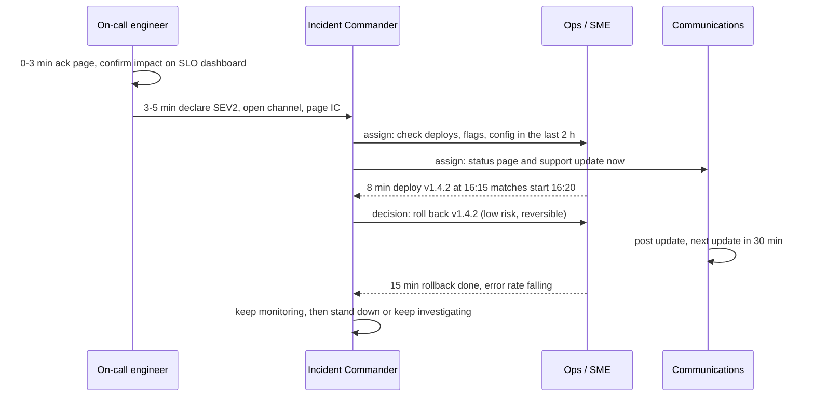

## Bối cảnh & vấn đề

16:41, alert checkout burn rate bắn. Trong 10 phút, kênh Slack `#general` có 25 người: ba senior engineer cùng SSH vào production và chạy lệnh khác nhau, một người rollback trong khi người kia đang restart DB proxy, sales hỏi "khi nào xong" mỗi 2 phút, CEO nhắn riêng cho từng người. Không ai biết ai đang làm gì, không ai cập nhật status page, và lệnh restart chồng lên rollback làm sự cố kéo dài thêm 20 phút. Sau khi hết, buổi họp "tìm hiểu nguyên nhân" biến thành tìm người có lỗi; engineer đã merge thay đổi im lặng suốt buổi. Ba tháng sau, sự cố gần giống hệt lặp lại, vì không có action item nào được làm.

Sự cố sẽ luôn xảy ra; khác biệt giữa team trưởng thành và team không trưởng thành nằm ở **cách phản ứng** và **cách học**. Bài này trình bày incident response có cấu trúc (vai trò, 15 phút đầu, mitigate trước, giao tiếp), postmortem **blameless** và action item thật sự được làm, các số đo (MTTD, MTTR, budget đã tiêu), văn hoá on-call không làm người ta kiệt sức, và cách kể một incident trong phỏng vấn senior.

## Khái niệm

### Incident và mức độ nghiêm trọng

**Incident** là sự kiện làm (hoặc đe doạ làm) suy giảm dịch vụ cho người dùng tới mức cần phản ứng có phối hợp, khác với một bug thường được xử lý theo quy trình bình thường. Team định nghĩa **severity (SEV)** từ trước, theo tác động, để không phải tranh luận lúc đang cháy. Ví dụ: SEV1 = chức năng cốt lõi (checkout, login) hỏng cho phần lớn người dùng hoặc mất/rò dữ liệu; SEV2 = suy giảm đáng kể cho một phần người dùng hoặc tenant lớn; SEV3 = suy giảm nhỏ có workaround. Severity quyết định ai được gọi, tần suất cập nhật, và có cần postmortem không. Khi nghi ngờ, **khai báo cao hơn** rồi hạ xuống; hạ cấp rẻ hơn nhiều so với phản ứng chậm.

### Các vai trò

- **Incident Commander (IC)**: điều phối, ra quyết định, giữ bức tranh tổng thể, phân việc, và **không tự debug**. IC có quyền cuối cùng trong incident, kể cả với người có chức vụ cao hơn. Khi hai senior tranh luận có rollback hay không, IC lắng nghe ngắn gọn, cân nhắc rủi ro của mỗi lựa chọn (rollback thường rủi ro thấp và đảo được) và **quyết định**, thay vì để tranh luận kéo dài.
- **Operations / SME (subject matter expert)**: điều tra và thực thi thay đổi, theo phân công của IC. Chỉ một người (hoặc một nhóm được chỉ định) thay đổi production tại một thời điểm.
- **Communications lead**: cập nhật stakeholder nội bộ, support, status page, khách hàng lớn; che chắn cho người đang điều tra khỏi câu hỏi.
- **Scribe**: ghi timeline (thời điểm, quan sát, quyết định, hành động). Timeline này là nguyên liệu chính của postmortem.

Với team nhỏ, một người có thể giữ nhiều vai, nhưng IC và người debug nên tách khi có thể: người đang nhìn chằm chằm vào log không thể đồng thời thấy toàn cảnh.

### Mitigate trước, root cause sau

Mục tiêu đầu tiên là **chặn thiệt hại cho người dùng**: rollback, tắt feature flag, failover, chuyển traffic, scale, chặn traffic xấu, bật degrade mode. Root cause có thể để sau, khi hệ thống đã ổn định và mọi người tỉnh táo. Lý do: mỗi phút tìm hiểu là một phút người dùng chịu thiệt và budget bị tiêu; nhiều mitigation (rollback) không cần biết nguyên nhân để hiệu quả.

### Postmortem blameless

**Postmortem** là tài liệu và buổi review sau incident để hiểu chuyện gì đã xảy ra và thay đổi hệ thống để nó không lặp lại (hoặc ít tác động hơn). **Blameless** nghĩa là giả định mọi người đã hành động hợp lý dựa trên thông tin, công cụ và áp lực họ có lúc đó; câu hỏi là "hệ thống và quy trình nào cho phép lỗi này xảy ra và không bị chặn lại?", không phải "ai sai?". Lý do không phải để "tử tế": nếu lỗi dẫn tới phạt, người ta **giấu thông tin**, và tổ chức mất đúng dữ liệu cần để cải thiện. Blameless không có nghĩa không có trách nhiệm: trách nhiệm chuyển sang việc sửa hệ thống.

Thay "ai đó đã chạy nhầm lệnh xoá trên production" bằng câu hỏi hệ thống: vì sao lệnh xoá production không cần xác nhận, vì sao credential production có trên laptop, vì sao không có backup đã kiểm thử khôi phục?

### Root cause và contributing factors

Sự cố phức tạp hiếm khi có **một** root cause. Thường là chuỗi **contributing factors**: một thay đổi config (trigger), một alert thiếu (phát hiện chậm), một runbook lỗi thời (mitigate chậm), một dependency không có timeout (lan rộng). Kỹ thuật "5 Whys" hữu ích nhưng dễ dẫn tới một chuỗi tuyến tính và dừng ở "lỗi con người"; tốt hơn là hỏi riêng cho từng giai đoạn: vì sao nó **xảy ra**, vì sao **không phát hiện sớm hơn**, vì sao **mitigate mất lâu**, vì sao **tác động rộng**.

### Số đo của incident

- **MTTD** (mean time to detect): từ lúc bắt đầu tác động tới lúc phát hiện.
- **MTTA** (acknowledge): từ alert tới khi có người nhận.
- **MTTM/MTTR** (mitigate / restore): tới khi tác động lên người dùng chấm dứt; R đôi khi là "resolve" (đã fix gốc), nên định nghĩa rõ.
- **Budget tiêu thụ**: bao nhiêu % error budget của cửa sổ SLO.

Trung bình của số ít incident rất nhiễu; dùng chúng để thấy xu hướng và để so sánh trước/sau một cải tiến, không làm KPI cá nhân.

## Cơ chế hoạt động

Vòng đời một incident:



15 phút đầu, theo thời gian:



Diễn giải: on-call xác nhận tác động **bằng metric** trước khi kéo người khác vào (tránh báo động giả), khai báo SEV và mở kênh riêng (không dùng kênh chung). IC phân vai ngay, và câu hỏi đầu tiên luôn là "có gì thay đổi gần đây?". Khi có ứng viên khớp thời gian và mitigation có rủi ro thấp, IC quyết định nhanh. Communications cập nhật **định kỳ** kể cả khi chưa có tin mới ("đang điều tra, cập nhật tiếp lúc 17:15"); im lặng làm stakeholder tự đi hỏi engineer. Kết thúc: xác nhận hồi phục trên chính metric SLO, theo dõi một khoảng thời gian, rồi giải tán và lên lịch postmortem.

## Ví dụ thực tế

### Tính số đo từ timeline (Node, chạy thật)

```ts
const t = (s: string) => new Date(`2026-09-18T${s}:00Z`).getTime();
const ev = { start: t("16:20"), detected: t("16:41"), acked: t("16:44"), mitigated: t("17:05"), resolved: t("17:40") };
const min = (a: keyof typeof ev, b: keyof typeof ev) => (ev[b] - ev[a]) / 60000;
console.log({ timeToDetect: min("start", "detected"), timeToAck: min("detected", "acked"),
  timeToMitigate: min("start", "mitigated"), timeToResolve: min("start", "resolved") });
const monthlyRequests = 12_000_000, budget = monthlyRequests * 0.001;   // SLO 99.9%
const badRequests = 45 * 60 * 9 * 0.3;  // 45 min of impact, ~9 checkout req/s, 30% failing
console.log(`bad requests ~${badRequests.toFixed(0)} of budget ${budget} -> ${(100 * badRequests / budget).toFixed(1)}% of the monthly error budget`);
```

```text
{
  timeToDetect: 21,
  timeToAck: 3,
  timeToMitigate: 45,
  timeToResolve: 80
}
bad requests ~7290 of budget 12000 -> 60.8% of the monthly error budget
```

Đọc: phát hiện mất 21 phút trong tổng 45 phút tác động, gần một nửa. Đây là chỗ đầu tư có lợi nhất (alert burn-rate nhanh hơn, synthetic check cho checkout), quan trọng hơn việc debug nhanh hơn vài phút. Sự cố tiêu 61% budget tháng: theo error budget policy, đủ để freeze thay đổi rủi ro cho checkout tới cuối cửa sổ.

### Một postmortem mẫu (rút gọn)

```markdown
# Postmortem: checkout failures for card payments, 2026-09-18 (SEV2)

## Summary
From 16:20 to 17:05 UTC, about 30% of card checkouts failed with HTTP 502. ~7,300 failed attempts,
61% of the monthly checkout error budget. Mitigated by rolling back order-api v1.4.2.

## Impact
Buyers on all tenants; enterprise tenant t_42 contacted support. Estimated lost orders: (fill in).

## Timeline (UTC)
16:15 order-api v1.4.2 deployed (new HTTP client for payment-api)
16:20 502 rate on /checkout rises from 0.1% to 30%
16:41 CheckoutErrorBudgetFastBurn pages on-call (21 min after start)
16:44 acked; 16:47 SEV2 declared, IC assigned
16:53 deploy at 16:15 identified as correlated
17:05 rollback complete, error rate back to baseline
17:40 root cause confirmed in staging

## Root cause and contributing factors
- Trigger: the new client kept idle keep-alive sockets for 60 s; payment-api's proxy closes them after 30 s,
  so reused sockets got ECONNRESET, surfaced as 502.
- Detection: the burn-rate alert has a 1 h long window; no synthetic check for checkout.
- Spread: the client retried non-idempotent POSTs zero times, so every reset became a user-visible failure.
- Canary: v1.4.2 went to 100% at once; the canary stage was skipped for "small" changes.

## What went well / where we got lucky
Rollback took 12 min and was clean. Lucky: the incident started outside the evening peak.

## Action items
| Action | Type | Owner | Due |
| --- | --- | --- | --- |
| Set client idle timeout below upstream idle timeout; add a config test | prevent | @payments-team | 2026-09-25 |
| Synthetic checkout probe every minute from 3 regions | detect | @sre | 2026-09-30 |
| Canary mandatory for all order-api deploys (pipeline gate) | mitigate | @platform | 2026-10-07 |
| Idempotency key on payment POST so it can be retried safely | prevent | @payments-team | 2026-10-14 |
```

Đặc điểm của postmortem tốt: timeline chính xác, tác động có số, nhiều contributing factors theo từng giai đoạn (xảy ra, phát hiện, lan rộng), có cả "đi tốt" và "may mắn", và action item là **thay đổi hệ thống** (test, alert, gate, idempotency) với owner và deadline. Không có action item kiểu "cẩn thận hơn khi deploy" hay "review kỹ hơn".

### Đảm bảo action item được làm

- Action item là ticket trong backlog thật của team, có owner (một người, không phải "team"), deadline, và gắn nhãn `postmortem`.
- Review tiến độ định kỳ (họp ops hàng tuần hoặc tháng); báo cáo tỉ lệ hoàn thành theo team.
- Error budget policy cho phép ưu tiên chúng trên feature khi budget bị tiêu nhiều.
- Ưu tiên ít item có tác động lớn hơn nhiều item nhỏ; item quá lớn tách thành bước đầu cụ thể.
- Kiểm tra hiệu quả: sự cố tương tự có tái diễn không? Nếu có, postmortem lần sau hỏi vì sao item trước không ngăn được.

### Kể một incident trong phỏng vấn (khung STAR)

(Điền chi tiết thật; không bịa số liệu.)

- **Situation**: hệ thống, triệu chứng người dùng thấy, tác động (bao nhiêu user/tenant, bao lâu, doanh thu nếu biết).
- **Task**: vai trò của bạn: người điều tra, IC, người viết postmortem?
- **Action**: timeline phát hiện → mitigate → fix; bạn khoanh vùng thế nào, bằng dữ liệu gì; giả thuyết sai đã loại; quyết định khó (rollback hay không).
- **Result**: root cause và contributing factors; postmortem có blameless không; action item nào, **đã làm chưa**, có hiệu quả không.
- **Reflection**: làm lại thì mitigate nhanh hơn ở bước nào; item nào không bao giờ được làm và vì sao (câu followUp hay gặp; trả lời thành thật cho thấy sự trưởng thành).

### Văn hoá on-call bền vững

- **Alert ít và chất**: mọi page actionable, có runbook; theo dõi số page/tuần/người, page ngoài giờ, tỉ lệ false positive (xem [alerting](/tracks/observability/learn/alerting-burn-rate)).
- **Rotation công bằng**: primary + secondary, ca 1 tuần, handover có ghi chú về các vấn đề đang theo dõi, bù giờ hoặc phụ cấp, không on-call liên tục quá lâu; đủ người trong rotation (Google SRE gợi ý tối thiểu khoảng 6–8 người cho rotation một site, verify).
- **You build it, you run it**: team viết code on-call cho service của mình, nên có động lực sửa gốc thay vì chuyển việc cho "ops".
- **Giới hạn toil**: đo thời gian dành cho công việc thủ công lặp lại; tự động hoá dần; SRE Book đặt mục tiêu toil dưới 50% thời gian.
- **Diễn tập**: game day, chaos experiment nhỏ, đóng vai IC; người mới shadow trước khi làm primary.
- **Sau đêm bị page**: cho phép nghỉ bù; postmortem cho page vô ích cũng quan trọng như cho incident thật.

## Trade-offs & lựa chọn thay thế

| Lựa chọn | Ưu | Nhược | Khi nào |
| --- | --- | --- | --- |
| Vai trò IC chính thức | Một người quyết định, ít hỗn loạn | Cần đào tạo, overhead cho sự cố nhỏ | SEV1/SEV2 |
| Tất cả cùng debug | Nhanh với sự cố nhỏ | Hỗn loạn, thay đổi chồng chéo | SEV3, một người là đủ |
| Rollback ngay | Rủi ro thấp, đảo được | Không giúp nếu không phải do deploy; migration khó đảo | Thời điểm khớp deploy |
| Fix forward | Không mất tính năng mới | Rủi ro thay đổi dưới áp lực | Rollback không thể (migration đã chạy) |
| Postmortem cho mọi incident | Học tối đa | Tốn thời gian, "postmortem fatigue" | Tiêu chí rõ: SEV1–2, tiêu > X% budget, mất dữ liệu, can thiệp thủ công |
| Postmortem nhẹ (template ngắn) | Rẻ | Ít chiều sâu | SEV3, near-miss |

Khi nào chọn gì: đặt tiêu chí trước (SEV nào cần IC, cần postmortem) để không phải quyết định lúc đang cháy. Mặc định rollback khi có ứng viên khớp thời gian và rollback an toàn; fix forward khi rollback không khả thi và fix đơn giản, được review bởi người thứ hai.

## Edge cases & failure modes

- **Không khai báo incident vì "chắc nhỏ thôi"**: sự cố lớn dần trong im lặng. Khai báo sớm, hạ cấp sau.
- **Nhiều người thay đổi production cùng lúc**: rollback chồng restart chồng scale, không biết hành động nào có tác dụng. Chỉ người được IC chỉ định mới thay đổi; mọi hành động vào timeline.
- **Người cấp cao "chiếm quyền"**: CTO vào kênh và ra lệnh trực tiếp cho engineer. IC lịch sự nhưng giữ quyền điều phối; người cấp cao có thể đổi IC một cách chính thức nếu cần.
- **Mitigation gây sự cố thứ hai**: failover DB làm mất dữ liệu chưa replicate; scale làm cạn connection. Runbook ghi rõ rủi ro của từng mitigation.
- **Sự cố kéo dài nhiều giờ**: mệt mỏi làm quyết định kém. IC sắp xếp đổi ca, ghi handover.
- **Postmortem bị trì hoãn**: sau 3 tuần, không ai nhớ chi tiết. Viết bản nháp trong vài ngày từ timeline của scribe.
- **Blameless thành "không ai chịu trách nhiệm"**: không có owner cho action item. Blameless về con người, nhưng có owner rõ ràng cho mỗi thay đổi hệ thống.

## Pitfalls

- ❌ Mọi người cùng debug trong kênh chung → ✅ kênh incident riêng, IC phân vai, một người thay đổi production.
- ❌ Tìm root cause trước khi chặn thiệt hại → ✅ mitigate trước (rollback, flag, failover), root cause sau.
- ❌ Im lặng tới khi có tin → ✅ cập nhật định kỳ theo lịch đã hứa.
- ❌ Postmortem tìm người có lỗi → ✅ blameless, hỏi hệ thống nào cho phép lỗi xảy ra và không chặn lại.
- ❌ Một root cause duy nhất → ✅ contributing factors cho từng giai đoạn: xảy ra, phát hiện, mitigate, lan rộng.
- ❌ Action item "cẩn thận hơn" → ✅ thay đổi hệ thống có owner và deadline, theo dõi tới khi xong.
- ❌ Đo MTTR như KPI cá nhân → ✅ dùng số đo để thấy xu hướng và chọn chỗ đầu tư (thường là phát hiện).

## Tóm tắt

- Định nghĩa SEV trước theo tác động; khi nghi ngờ khai báo cao rồi hạ.
- Vai trò: Incident Commander (điều phối, quyết định, không debug), Ops/SME, Communications, scribe.
- 15 phút đầu: xác nhận tác động bằng metric, khai báo SEV, mở kênh, kiểm tra thay đổi gần đây, mitigate trước, cập nhật định kỳ.
- Postmortem blameless: tóm tắt, tác động có số, timeline, contributing factors theo giai đoạn, đi tốt/may mắn, action item hệ thống có owner + deadline.
- Đo MTTD/MTTA/MTTR và budget tiêu thụ; trong ví dụ, phát hiện chiếm 21/45 phút nên đầu tư vào phát hiện.
- Action item phải được theo dõi như việc thật; error budget policy cho phép ưu tiên chúng.
- On-call bền vững: alert ít và chất, rotation công bằng, you build it you run it, giảm toil, diễn tập.
