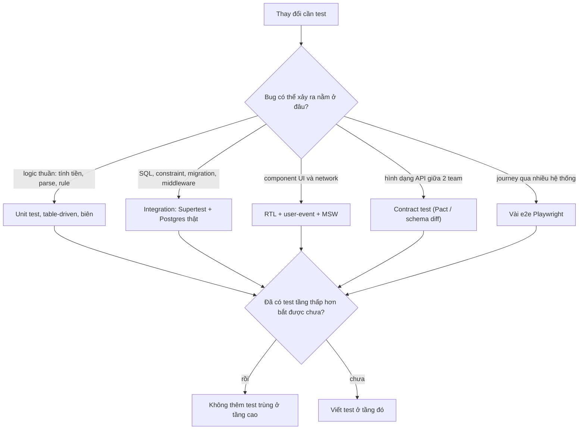
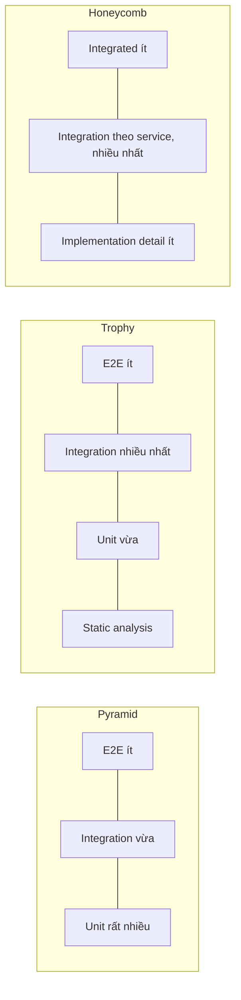

## Bối cảnh & vấn đề

Một team e-commerce có 3.000 unit test, coverage 88%, CI chạy 4 phút và lúc nào cũng xanh. Sprint này họ đổi tên cột `price` thành `price_cents` trong bảng `products`, sửa repository, sửa luôn các mock trong test cho khớp. Mọi thứ xanh. Deploy lên production, trang checkout trả 500: một query trong module khuyến mãi vẫn đọc `price`, và module đó chỉ có unit test với repository bị mock. Không một test nào từng chạy câu SQL đó vào một Postgres thật.

Team kế bên đi theo hướng ngược lại: 400 test Playwright bấm qua UI cho mọi tính năng, mỗi lần merge mất 70 phút, tuần nào cũng có 5–10% test fail ngẫu nhiên. Developer học được phản xạ "fail thì bấm re-run". Một lần, test fail thật vì bug race condition, và cũng bị re-run cho tới khi xanh.

Cả hai team đều "có test" nhưng không có **sự tự tin**. Bài này đặt nền cho cả track: test tồn tại để làm gì, bốn loại test khác nhau ở **ranh giới** nào, và ba "hình dạng" phổ biến (pyramid, trophy, honeycomb) thực ra đang tranh luận về điều gì. Các lesson sau đi sâu từng loại: [test doubles](/tracks/testing/learn/test-doubles), [integration với DB thật](/tracks/testing/learn/api-integration-real-db), [e2e với Playwright](/tracks/testing/learn/e2e-playwright), [contract test](/tracks/testing/learn/contract-testing-pact).

## Khái niệm

### Test để làm gì: confidence, feedback, design pressure

Mục tiêu của một bộ test không phải là coverage hay số lượng test, mà là **tự tin để thay đổi code và deploy**. Một test có giá trị khi nó thoả ba điều: nó **fail khi có bug thật** (bắt được regression), nó **pass khi code đúng** (không fail ngẫu nhiên, không fail vì refactor vô hại), và nó **cho phản hồi đủ nhanh** để developer chạy nó trước khi push. Mất một trong ba, test trở thành chi phí: test không bắt bug là gánh nặng bảo trì, test hay fail ngẫu nhiên làm mọi người bỏ qua kết quả, test chậm thì không ai chạy local.

Có một lợi ích phụ hay bị bỏ quên: **design pressure**. Code khó test thường là code dính chặt vào I/O (gọi `Date.now()`, `fetch`, `pool.query` rải rác trong logic). Khi buộc phải viết test, ta có động lực tách logic thuần ra khỏi I/O và truyền dependency vào (dependency injection). Đó là lý do TDD được nhắc như một công cụ thiết kế chứ không chỉ là công cụ kiểm tra ([lesson chiến lược](/tracks/testing/learn/strategy-legacy-culture)).

**Interview angle:** khi được hỏi "test tốt là gì", câu trả lời mạnh nói về **khả năng bắt bug, độ ổn định và tốc độ phản hồi**, không mở đầu bằng "coverage 80%".

### Unit test

**Unit test** kiểm tra một đơn vị logic **cô lập khỏi I/O**: một hàm, một class, một module nhỏ. Nó chạy trong process, không mở socket, không đọc file, không chạm DB, nên chạy trong vài mili-giây và cho kết quả xác định. Ví dụ e-commerce: `applyCoupon(cart, coupon, now)` trả tổng tiền đúng khi coupon hợp lệ, hết hạn, hay đơn chưa đủ giá trị tối thiểu.

"Đơn vị" không nhất thiết là một hàm. Trường phái **classical** (Detroit) coi đơn vị là một hành vi, có thể đi qua nhiều class thật, chỉ thay thế những thứ chậm hoặc không xác định. Trường phái **mockist** (London) cô lập từng class, mock mọi collaborator. Cách thứ hai cho test rất nhỏ nhưng dễ gắn chặt vào cấu trúc nội bộ, nên refactor là vỡ test hàng loạt (chi tiết ở [test doubles](/tracks/testing/learn/test-doubles)).

### Integration test

**Integration test** kiểm tra **nhiều thành phần thật phối hợp với nhau** qua ranh giới thật: HTTP layer + middleware + service + SQL vào một Postgres thật. Ví dụ: gọi `POST /orders` bằng Supertest, kiểm tra response 201, kiểm tra row trong bảng `orders` có đúng `tenant_id`, và nếu có outbox thì kiểm tra event đã được ghi. Nó chậm hơn unit (hàng chục mili-giây mỗi test, cộng vài giây khởi động container), nhưng bắt được những lỗi mà unit test không thể thấy: sai tên cột, thiếu constraint, migration hỏng, middleware sắp sai thứ tự.

Thuật ngữ này bị dùng lỏng lẻo. Có người gọi "integration" cho test gọi một service khác đang chạy trên staging. Để tránh nhầm, nhiều team dùng thêm từ **component test** (Notion và Spotify gọi vậy): bật **toàn bộ một service** trong process hoặc container, dependency thuộc service đó (DB, cache) là thật, còn **service khác** thì được thay bằng stub hoặc contract.

### End-to-end (e2e) test

**E2E test** đi qua **toàn bộ hệ thống như người dùng thật**: browser thật, frontend thật, các API thật, DB thật, thường trên môi trường staging hoặc một môi trường tạm cho mỗi PR. Ví dụ: Playwright đăng nhập, tìm "Running Shoe", thêm vào giỏ, thanh toán bằng thẻ sandbox, thấy trang "Cảm ơn". Đây là test cho độ tự tin cao nhất về một **journey**, nhưng chậm (vài giây tới vài chục giây mỗi test), có nhiều nguồn gây flaky (mạng, dữ liệu, timing, môi trường) và khi fail thì khó chỉ ra lỗi nằm ở tầng nào.

### Contract test

**Contract test** kiểm tra rằng **hai bên của một ranh giới** (consumer và provider của một API hoặc một message) **đồng ý về hình dạng** của request/response, mà **không cần dựng cả hai cùng lúc**. Ví dụ: `order-service` (consumer) ghi lại rằng nó gọi `GET /products/42` và dùng ba field `id`, `name`, `price_cents`; `catalog-service` (provider) chạy lại đúng các request đó vào code thật của mình trong CI và chứng minh vẫn trả về ba field ấy. Nếu provider đổi `price_cents` thành `price.amount`, pipeline của provider đỏ trước khi deploy. Cơ chế chi tiết ở [contract testing với Pact](/tracks/testing/learn/contract-testing-pact).

### Static analysis: tầng "test" rẻ nhất

TypeScript `strict`, ESLint, và schema validation (zod) ở ranh giới không phải test theo nghĩa chạy code, nhưng chúng **loại bỏ cả một lớp bug** trước khi test nào chạy: gọi sai tên field, quên xử lý `undefined`, `await` thiếu (`@typescript-eslint/no-floating-promises`). Testing trophy đặt static analysis làm **đế** vì nó rẻ nhất và chạy ngay trong editor.

### Pyramid, trophy, honeycomb

Ba "hình dạng" là ba lời khuyên về **tỉ lệ** đầu tư giữa các loại test:

- **Test pyramid** (Mike Cohn, *Succeeding with Agile*, 2009): đáy rộng là unit test, giữa là service/integration, đỉnh nhọn là UI/e2e. Lập luận: test càng cao càng chậm, càng đắt, càng giòn, nên viết nhiều test ở tầng thấp.
- **Testing trophy** (Kent C. Dodds, 2018): đế là static analysis, trên đó là một lớp unit vừa phải, **phần phình to nhất là integration**, đỉnh là một ít e2e. Lập luận: integration test cho độ tự tin gần e2e với chi phí gần unit, đặc biệt với frontend (render component thật với React Testing Library) và backend gọi DB.
- **Test honeycomb** (Spotify, 2018): cho microservices. Phần lớn là **integration tests** (kiểm tra một service qua API của nó, với dependency thật hoặc giả lập ở ranh giới), một ít **implementation detail tests** (unit cho logic phức tạp), và rất ít **integrated tests** (test mà kết quả phụ thuộc vào việc một hệ thống *khác* có đúng hay không).

| Hình dạng | Nhiều nhất | Ít nhất | Bối cảnh ra đời |
|---|---|---|---|
| Pyramid | Unit | UI/e2e | 2009, UI test bằng Selenium rất chậm, chưa có container |
| Trophy | Integration (+ static) | E2E | 2018, frontend React, RTL, TypeScript |
| Honeycomb | Integration theo service | Integrated (cross-service) | 2018, microservices nhỏ, ít logic, nhiều ranh giới |

**Interview angle:** câu `testing-001` không chấm điểm việc bạn chọn phe, mà chấm việc bạn giải thích **vì sao** chúng khác nhau (chi phí của integration đã giảm) và **điểm chung** (e2e ít, chọn theo tỉ lệ tự tin/chi phí).

## Cơ chế hoạt động

### Chọn tầng test cho một thay đổi

Thay vì hỏi "nên có bao nhiêu % unit", câu hỏi thực tế hơn là: **với thay đổi này, test rẻ nhất mà vẫn bắt được bug có thể xảy ra là gì?** Sơ đồ dưới là quy trình quyết định mà các lesson sau dùng lại.



Đọc sơ đồ từ trên xuống. Bước đầu tiên không phải là chọn công cụ mà là **đoán bug**: nếu rủi ro là một phép làm tròn sai, unit test bắt được với chi phí 1 ms; nếu rủi ro là quên `WHERE tenant_id = $1`, chỉ một test chạy SQL thật mới bắt được; nếu rủi ro là hai service hiểu khác nhau về một field, chỉ contract test (hoặc e2e đắt tiền) bắt được. Bước cuối là **chống trùng lặp**: một rule validation đã được integration test phủ thì không cần thêm một e2e chỉ để kiểm tra thông báo lỗi của rule đó. Phần lớn suite e2e chậm là do vi phạm bước này.

### Vì sao chi phí thay đổi theo tầng

Chi phí của một test không chỉ là thời gian chạy. Nó gồm: thời gian viết, thời gian chạy, **xác suất fail giả** (flaky), **chi phí chẩn đoán** khi fail (fail ở unit chỉ thẳng vào một hàm; fail ở e2e có thể do 6 service), và **chi phí bảo trì** khi code đổi. Unit test với logic thuần rẻ ở mọi mặt. Unit test mock nhiều thì rẻ khi chạy nhưng đắt khi bảo trì, vì gắn vào cách code gọi nhau. Integration với DB thật đắt hơn khi chạy (vài giây khởi động), nhưng rẻ khi bảo trì vì chỉ phụ thuộc vào API công khai. E2E đắt ở mọi mặt, đổi lại là thứ duy nhất chứng minh **cả hệ thống** hoạt động.

Pyramid ra đời khi integration và e2e rất đắt: dựng DB cho test là việc của DBA, Selenium mất 30 giây mở một trang. Từ khoảng 2018, Docker và **Testcontainers** cho Postgres thật trong 2–3 giây, React Testing Library render component thật trong jsdom, MSW giả lập network ở tầng HTTP. Integration test rẻ đi nhiều, nên tỉ lệ tối ưu dịch lên giữa. Đó là toàn bộ "bất đồng": hai hình dạng tối ưu cùng một hàm (tự tin / chi phí) với **bảng giá khác nhau**.



Sơ đồ thứ hai chỉ để so sánh: đọc mỗi khối từ trái sang phải là từ đỉnh xuống đáy. Điểm cả ba **đồng ý**: e2e và integrated test luôn là phần nhỏ nhất.

## Ví dụ thực tế

Cùng một rule giảm giá, test ở hai tầng, chạy thật với Vitest 5.0.3, Supertest 7.3, Express 5.2, Postgres 18 (Testcontainers 12.2), Node 24.21.

Rule: coupon giảm `percent`% khi tổng ≥ `minTotal` và **trước** thời điểm `expiresAt`; tiền tính bằng cent (số nguyên) để tránh lỗi float.

```ts
// src/pricing.ts
export function applyCoupon(cart: Cart, coupon: Coupon | null, now: Date): number {
  const total = subtotal(cart);
  if (!coupon) return total;
  if (now >= coupon.expiresAt) return total;
  if (total < coupon.minTotal) return total;
  return total - Math.round((total * coupon.percent) / 100);
}
```

**Tầng unit**: table-driven, tập trung vào **biên** (đúng bằng `minTotal`, đúng thời điểm hết hạn, 1 ms trước hết hạn). `now` được truyền vào thay vì đọc `new Date()` bên trong, nên test không phụ thuộc giờ chạy.

```ts
it.each([
  ["no coupon", cart(20_000), null, before, 20_000],
  ["eligible", cart(20_000), coupon, before, 18_000],
  ["exactly at minTotal", cart(10_000), coupon, before, 9_000],
  ["below minTotal", cart(9_999), coupon, before, 9_999],
  ["at expiry instant", cart(20_000), coupon, coupon.expiresAt, 20_000],
  ["1 ms before expiry", cart(20_000), coupon, new Date(coupon.expiresAt.getTime() - 1), 18_000],
])("%s", (_name, c, cp, now, want) => {
  expect(applyCoupon(c, cp, now)).toBe(want);
});
```

```text
 ✓ |unit| test/pricing.test.ts > applyCoupon > no coupon 1ms
 ✓ |unit| test/pricing.test.ts > applyCoupon > eligible 0ms
 ✓ |unit| test/pricing.test.ts > applyCoupon > exactly at minTotal 0ms
 ✓ |unit| test/pricing.test.ts > applyCoupon > below minTotal 0ms
 ✓ |unit| test/pricing.test.ts > applyCoupon > at expiry instant 0ms
 ✓ |unit| test/pricing.test.ts > applyCoupon > 1 ms before expiry 0ms
      Tests  6 passed (6)
   Duration  152ms
```

**Tầng integration**: cùng thư mục test, một project Vitest khác có `globalSetup` khởi động Postgres trong container, chạy migration thật, rồi gọi API qua Supertest với JWT ký bằng key test (không tắt middleware auth).

```ts
it("stores the order for the caller's tenant", async () => {
  const res = await request(createApp({ pool })).post("/orders")
    .set("Authorization", `Bearer ${await as("t1")}`).send({ items: [{ price: 1500, qty: 2 }] });
  expect(res.status).toBe(201);
  const { rows } = await pool.query("SELECT tenant_id, total_cents FROM orders");
  expect(rows).toEqual([{ tenant_id: "t1", total_cents: "3000" }]);
});

it("a zero-price order violates the CHECK constraint (a mock would never see this)", async () => {
  const res = await request(createApp({ pool })).post("/orders")
    .set("Authorization", `Bearer ${await as("t1")}`).send({ items: [{ price: 0, qty: 1 }] });
  expect(res.status).toBe(500);
});
```

```text
[global-setup] postgres up + migrated in 2464 ms
 ✓ |int| test/orders.int.test.ts > POST /orders > rejects an order without items 150ms
 ✓ |int| test/orders.int.test.ts > POST /orders > stores the order for the caller's tenant 10ms
 ✓ |int| test/orders.int.test.ts > POST /orders > a zero-price order violates the CHECK constraint (a mock would never see this) 9ms
      Tests  3 passed (3)
```

Đọc hai output: unit test mỗi cái dưới 1 ms; integration test **mỗi cái** chỉ 10–150 ms (test đầu chậm hơn vì warm-up), chi phí chính là **2,5 giây khởi động container một lần** cho cả suite. Integration test bắt được hai thứ unit không thể thấy: `total_cents` là `bigint` nên driver `pg` trả về **chuỗi** `"3000"` chứ không phải số (một mock viết tay gần như chắc chắn trả `3000`), và `CHECK (total_cents > 0)` trong migration thực sự chặn đơn giá 0. Test thứ ba cũng lộ một **thiết kế cần sửa**: lỗi constraint đang thành 500, lẽ ra API nên validate trước và trả 400/422. Test tốt không chỉ xanh hay đỏ, nó cho bạn thấy hành vi thật.

Đây cũng là câu trả lời cho follow-up của `testing-001` ("Node API chủ yếu là CRUD trên SQL thì tỉ lệ nào?"): logic thuần ít, nên unit chỉ dành cho vài rule như coupon; phần lớn đầu tư vào integration với DB thật, vì bug có khả năng xảy ra nhất nằm ở SQL, constraint, auth và tenant filter; e2e chỉ vài journey.

## Trade-offs & lựa chọn thay thế

| Loại test | Tốc độ | Độ tự tin | Chi phí bảo trì | Hay vỡ vì | Chẩn đoán khi fail |
|---|---|---|---|---|---|
| Unit, logic thuần | < 1 ms | Vừa (chỉ logic) | Thấp | Đổi requirement | Rất dễ |
| Unit, mock nhiều | < 1 ms | Thấp | Cao | Refactor | Dễ nhưng hay báo sai |
| Integration (DB thật) | 10–200 ms + vài giây setup | Cao | Vừa | Schema, fixture | Dễ vừa |
| Contract | Giây | Cao cho ranh giới | Vừa (cần broker, quy trình) | Đổi API | Dễ (chỉ rõ field) |
| E2E UI | Giây tới chục giây | Cao nhất cho journey | Cao | Selector, timing, dữ liệu, môi trường | Khó |

**Khi nào nghiêng về pyramid**: domain có nhiều logic thuần phức tạp (engine tính giá, tính thuế, rule bảo hiểm, thư viện), nơi phần lớn bug là bug tính toán. Ở đây hàng nghìn unit test table-driven và property-based test là khoản đầu tư hiệu quả nhất.

**Khi nào nghiêng về trophy/honeycomb**: backend CRUD trên SQL, microservice mỏng chủ yếu điều phối I/O, frontend React. Bug nằm ở chỗ nối (query, serialization, auth, network), nên integration test với dependency thật cho tỉ lệ tốt nhất.

**Lựa chọn thay thế cho "hình dạng"**: Martin Fowler (2021) cho rằng tranh luận về hình dạng phần lớn là tranh luận về **định nghĩa** "unit" và "integration"; điều quan trọng là test **nhanh, ổn định, bắt bug và dễ hiểu**. Google phân loại theo **size** (small: một process, không I/O; medium: một máy, được dùng localhost và container; large: nhiều máy) thay vì theo tên gọi, vì size quyết định tốc độ và độ ổn định một cách khách quan. Đây là cách diễn đạt rất tốt trong phỏng vấn senior: "tôi phân loại theo size và theo ranh giới, không cãi nhau về tên".

## Edge cases & failure modes

- **Ranh giới integration/e2e mờ**: test gọi API của staging, nơi 5 service khác đang chạy version không xác định, là e2e (integrated) dù không có browser. Nó fail khi service khác deploy hỏng, không phải khi code của bạn sai. Quy tắc: test **chặn merge** chỉ nên phụ thuộc vào thứ bạn kiểm soát (code của PR + container dựng trong test).
- **"Unit test" gọi DB thật**: không sai, nhưng nếu nó dùng chung một DB với mọi test khác và không cô lập, nó trở thành nguồn flaky ([cô lập & flaky](/tracks/testing/learn/isolation-test-data-flaky)).
- **Ice-cream cone**: hình nón ngược, nhiều e2e/manual, ít unit. Triệu chứng: CI 1 giờ, flaky 10%, regression bắt bằng QA thủ công. Thường sinh ra khi codebase khó unit test (logic dính I/O) nên mọi người test từ ngoài vào.
- **Hourglass**: nhiều unit, nhiều e2e, gần như không có integration. Triệu chứng: e2e phải phủ cả những case validation lẽ ra integration làm, suite chậm và trùng lặp.
- **Định nghĩa "đủ" sai thước đo**: đếm số test hoặc coverage tổng thay vì hỏi "bug gần đây nhất lọt ra prod, test nào lẽ ra bắt được nó?".

## Pitfalls

- ❌ Mở đầu chiến lược bằng con số coverage → ✅ mở đầu bằng rủi ro và loại bug có khả năng xảy ra, rồi chọn tầng test rẻ nhất bắt được nó.
- ❌ Coi pyramid là luật → ✅ coi nó là kết quả tối ưu chi phí trong một bối cảnh; khi integration rẻ đi, tỉ lệ thay đổi.
- ❌ Viết e2e cho mọi validation rule → ✅ đẩy validation, permission matrix, edge case xuống API integration; e2e chỉ giữ journey trọng yếu.
- ❌ Gọi mọi test có DB là "e2e" và né chúng → ✅ phân biệt integration (dependency thật **bạn sở hữu**, dựng trong test) với integrated (phụ thuộc hệ thống người khác).
- ❌ Đánh đồng "nhiều test" với "tự tin" → ✅ đo bằng việc dám refactor và deploy giờ hành chính, và bằng change failure rate.
- ❌ Khi kể về dự án (`testing-043`), bịa con số tỉ lệ cho đẹp → ✅ nói số thật hoặc ước lượng có ghi rõ là ước lượng, rồi tự đánh giá điểm yếu (thiếu integration với DB thật? e2e flaky?) và thứ tự cải thiện.

## Tóm tắt

- Test tồn tại để cho **tự tin thay đổi và deploy**: bắt bug thật, không fail giả, phản hồi nhanh.
- Unit = logic cô lập khỏi I/O; integration = nhiều thành phần thật qua ranh giới thật (HTTP + DB); e2e = toàn hệ thống như người dùng; contract = hai bên một API đồng ý về hình dạng mà không cần dựng cùng lúc.
- Pyramid (nhiều unit), trophy (nhiều integration + static), honeycomb (integration theo service) tối ưu cùng một thứ với **bảng giá khác nhau**; cả ba đồng ý **e2e ít**.
- Chọn tầng bằng câu hỏi "bug có thể xảy ra nằm ở đâu" và "đã có test rẻ hơn bắt được chưa".
- Integration với Postgres thật tốn ~2,5 s khởi động một lần, mỗi test chỉ vài chục ms, và bắt được thứ mock không thấy (kiểu `bigint` → chuỗi, `CHECK` constraint).
- Phân loại theo size (small/medium/large) và ranh giới giúp tránh cãi nhau về tên gọi.
