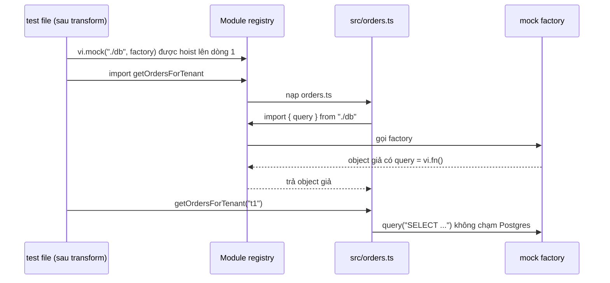

## Bối cảnh & vấn đề

Đây là một test có thật trong rất nhiều codebase Node:

```ts
jest.mock("../src/db", () => ({
  query: jest.fn().mockResolvedValue({ rows: [{ id: 1, total: 100 }] }),
}));
import { query } from "../src/db";
import { getOrdersForTenant } from "../src/orders";

it("returns orders for tenant", async () => {
  const orders = await getOrdersForTenant("t1");
  expect(query).toHaveBeenCalled();
  expect(orders).toHaveLength(1);
});
```

Test xanh. Code thật thì quên `WHERE tenant_id = $1`, nên endpoint trả về đơn hàng của **mọi tenant**. Test không bắt được vì câu SQL không bao giờ chạy: `query` là một hàm giả trả đúng thứ test mong đợi. `toHaveBeenCalled()` không kiểm tra tham số. Assertion `toHaveLength(1)` chỉ chứng minh mock trả về một phần tử, tức là test đang kiểm tra **chính cái mock** (một tautology).

Vấn đề không phải là "mock là xấu". Thay thế dependency là kỹ thuật cần thiết: không ai muốn test checkout gọi thẻ tín dụng thật. Vấn đề là **thay thế cái gì, bằng loại double nào, và kiểm tra điều gì**. Bài này định nghĩa năm loại test double, chỉ ra `vi.fn()`/`jest.fn()` thực chất là gì, đi qua các gotcha của module mocking, và chạy thật ví dụ trên với Vitest và Postgres để thấy chính xác test mock bỏ sót gì.

## Khái niệm

### Test double và SUT

**SUT** (system under test) là đoạn code bạn đang kiểm tra. **Collaborator** (hay dependency) là thứ SUT gọi tới: repository, payment gateway, mailer, clock. **Test double** (Gerard Meszaros, *xUnit Test Patterns*) là tên chung cho bất kỳ vật thay thế nào của collaborator trong test, giống "diễn viên đóng thế" trong phim. Meszaros chia chúng thành năm loại theo **mục đích**, không theo thư viện.

### Dummy

**Dummy** là object được truyền vào chỉ để cho đủ tham số, SUT **không dùng** nó trên đường code đang test. Ví dụ: `CheckoutService` nhận một `Logger` nhưng nhánh thanh toán không log gì; ta truyền `{ info: () => { throw new Error("not used") } }`. Việc nó ném lỗi khi bị gọi là một mẹo hay: nếu sau này code bắt đầu dùng logger, test sẽ nói cho bạn biết.

### Stub

**Stub** trả về **câu trả lời định sẵn** để đẩy SUT vào một nhánh cụ thể. Ví dụ: `paymentGateway.charge` luôn trả `{ status: "declined" }` để test nhánh "thẻ bị từ chối". Stub không quan tâm nó được gọi bao nhiêu lần hay với tham số nào; test kiểm tra **kết quả** của SUT (đơn vẫn `pending`, không có email). Đây gọi là **state verification**: assert trạng thái/đầu ra sau khi hành động.

### Spy

**Spy** là stub có **ghi chép**: nó ghi lại mọi lời gọi (tham số, số lần, thứ tự) để test assert sau. Ví dụ: `mailer.send` là spy, sau khi thanh toán ta assert nó được gọi đúng một lần với địa chỉ của khách. Spy hữu ích khi tác dụng phụ là **output thật sự** của SUT (gửi email, publish event, gọi webhook) và không có trạng thái nào khác để quan sát.

### Mock

**Mock** theo định nghĩa gốc là object được **lập trình sẵn kỳ vọng** về lời gọi ("phải gọi `charge(4950, 'order:o1')` đúng một lần, không gọi gì khác") và **tự fail** khi kỳ vọng bị vi phạm. Đây là **behaviour verification**. Trong thực tế JS/TS, thư viện kiểu này (sinon mocks, testdouble.js `td.verify`) ít phổ biến; người ta dùng spy + assert sau, và gọi chung mọi thứ là "mock".

### Fake

**Fake** là implementation **hoạt động thật** nhưng đơn giản hơn bản production: `InMemoryOrderRepository` dùng `Map`, SMTP server giả (MailHog/Mailpit), clock giả có thể tua. Fake có hành vi (lưu rồi đọc lại được), nên test viết theo kiểu state verification và **không gắn vào việc SUT gọi repository bao nhiêu lần**. Rủi ro của fake là nó **lệch** khỏi bản thật (Map không có unique constraint, không có transaction); vì vậy fake hợp với dependency có hành vi đơn giản, hoặc phải có **contract test chung** chạy cho cả fake lẫn bản thật.

### vi.fn() và jest.fn() thực chất là gì

`vi.fn()` / `jest.fn()` tạo một **function spy**: mặc định trả `undefined`, ghi mọi lời gọi vào `.mock.calls`; khi thêm `.mockResolvedValue(x)` nó thành **stub + spy**. Không có kỳ vọng nào được kiểm tra tự động, nên về mặt Meszaros nó **không phải mock**; mọi kiểm tra nằm ở `expect(fn).toHaveBeenCalledWith(...)` bạn tự viết. `vi.spyOn(obj, "method")` bọc một method **có thật**: mặc định vẫn gọi implementation gốc và ghi lại lời gọi, và bạn có thể override bằng `.mockImplementation`. `vi.mock(path, factory)` / `jest.mock(path, factory)` thay **cả một module** trong module registry của test runner.

| Loại | Trả lời | Ghi lại lời gọi | Có hành vi thật | Kiểu kiểm tra | Ví dụ |
|---|---|---|---|---|---|
| Dummy | Không dùng | Không | Không | Không | Logger không dùng |
| Stub | Định sẵn | Không cần | Không | State | `charge` → declined |
| Spy | Định sẵn hoặc thật | Có | Tuỳ | Behaviour (assert sau) | `mailer.send` |
| Mock | Định sẵn | Có, tự verify | Không | Behaviour (kỳ vọng trước) | `td.verify(...)` |
| Fake | Tính toán thật | Không cần | Có (đơn giản) | State | `InMemoryOrderRepo` |

**Interview angle:** `testing-003` hỏi định nghĩa, nhưng follow-up "khi nào fake tốt hơn mock?" mới là phần chấm điểm: fake tốt hơn khi SUT tương tác nhiều lần với dependency (đọc-ghi-đọc), vì test không phải mô tả từng lời gọi và không vỡ khi refactor thứ tự gọi.

## Cơ chế hoạt động

### Module mocking: hoisting và module registry

Test runner (Vitest, Jest) giữ một **module registry** riêng cho mỗi file test: khi file import `../src/orders`, runner nạp module đó, và khi `orders` import `./db`, runner tra registry. `vi.mock("./db", factory)` đăng ký "khi ai đó xin `./db`, trả về object do factory tạo". Để điều này có tác dụng, đăng ký phải xảy ra **trước** khi bất kỳ module nào import `./db`. Vì `import` tĩnh được thực thi trước mọi dòng code khác trong file, runner **hoist** (kéo) lời gọi `vi.mock`/`jest.mock` lên đầu file khi transform.



Sơ đồ giải thích hai gotcha lớn nhất. Thứ nhất, factory chạy **trước** phần thân file, nên nếu nó tham chiếu một biến khai báo bằng `const` ở trên trong code nguồn, biến đó chưa được khởi tạo (temporal dead zone). Jest chặn việc này ngay lúc transform (babel-plugin-jest-hoist chỉ cho phép biến có tiền tố `mock`), Vitest báo lỗi khi chạy; cách chuẩn ở Vitest là `vi.hoisted(() => ...)`. Thứ hai, factory thay **toàn bộ** module: export nào bạn không trả về sẽ không tồn tại.

### State của mock giữa các test

Một `vi.fn()` khai báo ở module scope sống suốt file. Nếu test 1 gọi nó, test 2 sẽ thấy cả lời gọi cũ, trừ khi runner xoá lịch sử giữa các test. Ba mức xoá: **clear** (xoá `.mock.calls`, giữ implementation), **reset** (xoá cả implementation về `undefined`), **restore** (trả method gốc cho `spyOn`). Mặc định của hai runner **khác nhau** và đây là nguồn bug khi migrate: trong lần chạy ở phần Ví dụ, Vitest 5.0.3 có `clearMocks: true` mặc định (verify với version bạn dùng; các bản Vitest cũ hơn mặc định `false`), còn Jest 30.5 vẫn `clearMocks: false`.

## Ví dụ thực tế

Chạy thật với Vitest 5.0.3, Jest 30.5.2, Postgres 18 trong Docker, `pg` 8.23, Node 24.21.

### Năm loại double trong một test checkout

```ts
const dummyLogger: Logger = { info: () => { throw new Error("not used in this path"); } };   // DUMMY

it("charges once, saves paid, emails the buyer", async () => {
  const repo = new InMemoryOrderRepo(); await repo.save(order);                       // FAKE
  const gateway = { charge: vi.fn().mockResolvedValue({ status: "succeeded" }) };     // STUB + SPY
  const mailer = { send: vi.fn().mockResolvedValue(undefined) };                      // SPY
  const svc = new CheckoutService(repo, gateway, mailer, dummyLogger);

  await svc.pay("o1", "a@shop.test");
  await svc.pay("o1", "a@shop.test");                                                 // client retries

  expect((await repo.get("o1"))?.status).toBe("paid");                                // state verification
  expect(gateway.charge).toHaveBeenCalledExactlyOnceWith(4950, "order:o1");           // behaviour verification
  expect(mailer.send).toHaveBeenCalledOnce();
});
```

```text
 ✓ |unit| test/doubles/checkout.test.ts > charges once, saves paid, emails the buyer 2ms
 ✓ |unit| test/doubles/checkout.test.ts > declined card: nothing saved, no email 1ms
```

Để ý cách chọn: repository dùng **fake** vì SUT đọc rồi ghi rồi (ở lần gọi thứ hai) đọc lại; gateway và mailer dùng **spy** vì lời gọi ra ngoài chính là output cần kiểm tra (charge đúng **một** lần dù client retry, đúng idempotency key); logger là **dummy**. Đây cũng là nguyên tắc "chỉ double ranh giới bạn không sở hữu": payment và email là hệ thống bên ngoài, còn logic `CheckoutService` chạy thật.

### Mock DB vs Postgres thật (câu testing-009)

Bug: hàm quên điều kiện tenant.

```ts
// src/doubles/orders.ts
export async function getOrdersForTenant(tenantId: string) {
  const { rows } = await query("SELECT id, total_cents FROM orders ORDER BY id");   // forgot WHERE tenant_id = $1
  return rows;
}
```

Test thứ nhất là bản mock ở đầu bài (viết lại bằng `vi.mock`). Test thứ hai chạy vào Postgres thật, seed **hai tenant**:

```ts
it("returns only the caller tenant's orders (real Postgres)", async () => {
  await pool.query(`INSERT INTO orders (tenant_id, buyer_id, total_cents) VALUES ('t1','u1',100), ('t2','u9',999)`);
  const orders = await getOrdersForTenant("t1");
  expect(orders).toEqual([{ id: "1", total_cents: "100" }]);
});
```

```text
 ✓ |unit| test/doubles/orders-mocked.test.ts > returns orders for tenant (mocked DB) 2ms
 × |int| test/doubles/orders.int.test.ts > returns only the caller tenant's orders (real Postgres) 53ms
   → expected [ …(2) ] to deeply equal [ { id: '1', total_cents: '100' } ]
- Expected
+ Received
  [
    {
      "id": "1",
      "total_cents": "100",
    },
+   {
+     "id": "2",
+     "total_cents": "999",
+   },
  ]
```

Bản mock xanh, bản thật đỏ và chỉ đúng vào dòng rò rỉ. Output còn lộ thêm một **mock drift**: Postgres trả `id` và `total_cents` (kiểu `bigserial`/`bigint`) dưới dạng **chuỗi**, trong khi mock trả số `1` và `100`. Code nào làm `orders[0].total_cents + shipping` sẽ ra `"100" + 15000 = "10015000"` ở production, và mock không bao giờ cho bạn thấy điều đó. Trong lần thử đầu, khi code vẫn truyền `[tenantId]` nhưng SQL không có `$1`, Postgres còn từ chối luôn: `bind message supplies 1 parameters, but prepared statement "" requires 0`, một lỗi mà mock cũng không thể tái hiện.

Fix đúng cho `testing-009` vì vậy không phải là đổi sang `toHaveBeenCalledWith(expect.stringContaining("tenant_id"))` (đó là assert vào **chuỗi SQL**, vẫn không chạy SQL), mà là: integration test với DB thật, seed hai tenant, assert chỉ nhận dữ liệu của tenant gọi. Unit test giữ cho phần logic thuần trên kết quả (tính tổng, map DTO).

### Gotcha của vi.mock / jest.mock (câu testing-020)

**Hoisting.** Vitest:

```ts
const sendMock = vi.fn(() => "mocked");
vi.mock("../../src/gotchas/mailer", () => ({ send: sendMock }));
```

```text
Error: [vitest] There was an error when mocking a module. If you are using "vi.mock" factory, make sure there are no top level variables inside, since this call is hoisted to top of the file.
Caused by: ReferenceError: Cannot access 'sendMock' before initialization
```

Jest bắt cùng lỗi ngay khi transform:

```text
ReferenceError: .../hoist.test.js: The module factory of `jest.mock()` is not allowed to reference any out-of-scope variables.
Invalid variable access: sendFn
```

Cách sửa: Vitest dùng `const { sendMock } = vi.hoisted(() => ({ sendMock: vi.fn() }))`; Jest cho phép biến có tiền tố `mock` (`const mockSend = jest.fn()`), với điều kiện factory chỉ **tham chiếu lười** tới nó (bọc trong arrow function).

**Mock cả module, quên một export.** `signup.ts` dùng cả `send` và `formatAddress` từ `mailer.ts`; factory chỉ trả `send`:

```text
Error: [vitest] No "formatAddress" export is defined on the "../../src/gotchas/mailer" mock. Did you forget to return it from "vi.mock"?
```

Vitest báo lỗi rõ ràng; Jest với CJS thì cho `undefined` và bạn nhận `TypeError: formatAddress is not a function` ở đâu đó sâu bên trong. Mock một phần: Vitest `vi.mock(import("./mailer"), async (importOriginal) => ({ ...(await importOriginal()), send: sendMock }))`, Jest `jest.mock("./mailer", () => ({ ...jest.requireActual("./mailer"), send: mockSend }))`.

```text
 ✓ importOriginal keeps the real formatAddress
```

**State rò giữa test.** Cùng một file ở hai runner:

```ts
const fn = vi.fn();   // jest.fn() trong bản Jest
it("first test calls it", () => { fn("a"); expect(fn).toHaveBeenCalledTimes(1); });
it("second test sees calls from the first", () => { fn("b"); expect(fn).toHaveBeenCalledTimes(1); });
```

```text
Vitest 5.0.3:  ✓ first test calls it   ✓ second test sees calls from the first
Jest 30.5.2:   ● second test sees calls from the first
               Expected number of calls: 1
               Received number of calls: 2
```

Cùng code, kết quả khác nhau chỉ vì mặc định `clearMocks`. Đặt tường minh `clearMocks: true` (và `restoreMocks: true` nếu dùng `spyOn`) trong config của **cả hai** runner để test không phụ thuộc default.

**ESM ở Jest.** Với native ESM, `jest.mock` không hoist được qua `import` tĩnh; phải dùng `jest.unstable_mockModule(path, factory)` rồi `await import(...)` **sau** đó, và chạy Jest với `NODE_OPTIONS=--experimental-vm-modules`. Lần chạy thật: không có flag thì `Must use import to load ES Module`, có flag thì pass kèm `ExperimentalWarning: VM Modules is an experimental feature` (chi tiết ở [lesson runner](/tracks/testing/learn/jest-vitest-time-snapshots)).

**`spyOn` thay vì `mock`** (follow-up `testing-020`): khi chỉ muốn quan sát hoặc thay **một method** của một object có thật (`vi.spyOn(console, "error")`, `vi.spyOn(Date, "now")`, `vi.spyOn(repo, "save").mockRejectedValueOnce(new Error("deadlock"))` để test nhánh lỗi), và muốn khôi phục bản gốc sau test. Lưu ý `spyOn` trên **named export của ESM** thường không hoạt động vì namespace object là read-only; khi đó cần `vi.mock` hoặc, tốt hơn, dependency injection.

## Trade-offs & lựa chọn thay thế

| Cách thay dependency | Cách làm | Ưu | Nhược | Hợp khi |
|---|---|---|---|---|
| Dependency injection + fake/stub | Truyền `PaymentGateway` vào constructor | Rõ ràng, không phụ thuộc runner, type-safe | Phải thiết kế seam từ đầu | Logic nghiệp vụ, service layer |
| Module mock (`vi.mock`) | Thay module trong registry | Không cần sửa code | Gắn vào đường dẫn file, hoisting, ESM phức tạp | Code legacy chưa có seam, module bên thứ ba khó inject |
| `spyOn` | Bọc một method có thật | Một chỗ, khôi phục được | Không dùng được với ESM export read-only | Quan sát `console`, `Date.now`, một lỗi hiếm |
| Network mock (MSW, nock) | Chặn ở tầng HTTP | Code dùng client thật, kiểm tra cả serialization | Cần handler giữ cho đúng API thật | Ranh giới HTTP với bên thứ ba ([lesson RTL/MSW](/tracks/testing/learn/frontend-rtl-msw)) |
| Dependency thật (container) | Postgres, Redis, Kafka thật | Không có drift | Chậm hơn, cần Docker | Thứ bạn sở hữu: DB của service, cache, queue |

**Nên mock**: hệ thống bạn không sở hữu và không kiểm soát (payment, email, SMS, API đối tác), thứ không xác định (clock, random, UUID), và thứ cực chậm hoặc có chi phí (gọi LLM, gửi SMS). **Không nên mock**: database, cache và queue của chính service, vì chính chúng là chỗ bug nằm (SQL, constraint, serialization), và code nội bộ của bạn (mock module nội bộ = test gắn vào cấu trúc file).

Khi nào mock repository **là đúng** (follow-up `testing-009`): khi bạn test một use case có logic phức tạp **phía trên** repository (rule chuyển trạng thái, tính toán, quyết định gọi ai), và repository đã có integration test riêng chạy SQL thật. Khi đó stub/fake repository làm test use case nhanh và tập trung. Sai là khi mock repository là **lớp test duy nhất** chạm tới dữ liệu.

## Edge cases & failure modes

- **Mock drift**: mock mô tả API theo hiểu biết lúc viết; provider đổi `status` thành `state`, mock vẫn trả `status`, test xanh mãi. Phòng: contract test, hoặc validate response bằng schema (zod) ở ranh giới để lỗi lộ ra ngay khi chạy thật ([contract testing](/tracks/testing/learn/contract-testing-pact)).
- **Kiểu dữ liệu khác**: driver thật trả `bigint` thành chuỗi, `numeric` thành chuỗi, `timestamptz` thành `Date` theo timezone của process; mock viết tay hầu như luôn trả số và chuỗi ISO.
- **Fake thiếu ràng buộc**: `InMemoryUserRepo` không có unique constraint trên email, nên test "đăng ký trùng email trả 409" pass trên fake nhưng code thật ném lỗi `23505` không được xử lý. Phòng: một bộ contract test chung chạy cho cả fake và Postgres repo.
- **Mock trả Promise khi code thật đồng bộ (hoặc ngược lại)**: `mockReturnValue(x)` cho hàm async khiến `await` vẫn chạy nhưng `.then` trên kết quả sẽ fail; `mockResolvedValue` cho hàm sync làm code nhận một Promise.
- **Assert quá chặt vào tương tác**: `expect(repo.save).toHaveBeenCalledTimes(2)` vỡ khi ai đó gộp hai lần save thành một (refactor đúng). Chỉ assert tương tác khi nó là **output có ý nghĩa nghiệp vụ** (charge đúng một lần).

## Pitfalls

- ❌ Mock DB/ORM để test repository → ✅ chạy repository vào engine thật trong container; mock repository chỉ khi test logic phía trên và repository đã có integration test.
- ❌ `expect(query).toHaveBeenCalled()` là assertion duy nhất → ✅ assert kết quả nghiệp vụ (đúng dữ liệu, đúng tenant); nếu phải assert tương tác thì dùng `toHaveBeenCalledWith` với tham số đầy đủ.
- ❌ Tham chiếu biến thường trong factory của `vi.mock`/`jest.mock` → ✅ `vi.hoisted` (Vitest) hoặc biến tiền tố `mock` + tham chiếu lười (Jest).
- ❌ Mock cả module rồi quên export → ✅ `importOriginal`/`requireActual` để mock một phần, hoặc chuyển sang DI.
- ❌ Dựa vào default `clearMocks` của runner → ✅ đặt `clearMocks`/`restoreMocks` tường minh trong config.
- ❌ Gọi mọi thứ là "mock" khi trả lời phỏng vấn → ✅ nói rõ stub (trả lời), spy (ghi lại), fake (hành vi đơn giản) và lý do chọn.
- ❌ Khi kể chuyện "test xanh mà prod hỏng" (`testing-045`) chỉ kết luận "thiếu test" → ✅ chỉ ra **lớp test sai** (mock thay vì DB thật, mock lệch API thật) và thay đổi cụ thể sau đó (integration với DB thật, contract test, schema validation ở ranh giới).

## Tóm tắt

- Năm loại double theo mục đích: dummy (cho đủ tham số), stub (trả lời định sẵn), spy (ghi lời gọi), mock (kỳ vọng tự verify), fake (hành vi thật đơn giản).
- `vi.fn()`/`jest.fn()` là stub + spy; "mock" trong JS thường là cách gọi chung, kiểm tra nằm ở assertion bạn viết.
- State verification (kiểm tra kết quả) bền hơn behaviour verification (kiểm tra lời gọi); chỉ assert tương tác khi nó là output nghiệp vụ.
- Chỉ double ranh giới bạn không sở hữu hoặc không xác định; DB, cache, queue của chính bạn nên chạy thật.
- `vi.mock`/`jest.mock` được hoist và thay cả module: dùng `vi.hoisted`/tiền tố `mock`, `importOriginal`/`requireActual`, và đặt `clearMocks` tường minh.
- Chạy thật cho thấy mock DB bỏ sót cả bug thiếu tenant filter lẫn kiểu `bigint` trả về dạng chuỗi.
