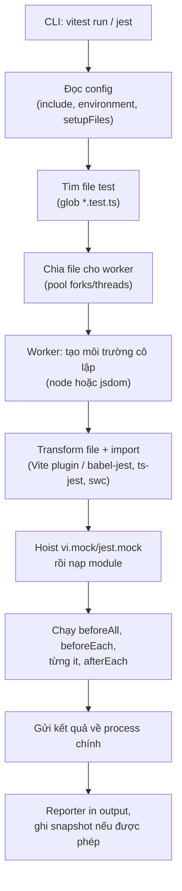
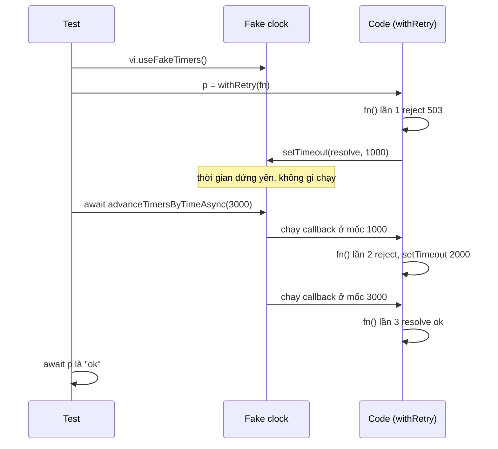

## Bối cảnh & vấn đề

Một team fintech có test `isTokenExpired` chạy xanh suốt sáu tháng. Một đêm, job CI lúc 00:03 đỏ: test so sánh "hôm nay" với "ngày hết hạn" bằng `new Date()` thật, và đúng thời khắc qua ngày thì `expiresAt` tính lúc đầu test đã thành "hôm qua". Sáng hôm sau ai đó bấm re-run, xanh, và không ai điều tra. Tháng sau, cũng test đó đỏ vào ngày đổi giờ mùa hè (DST) trên máy một developer ở New York, vì code cộng "một ngày" bằng `setDate(+1)` trong khi test kỳ vọng `+24h`.

Cùng tuần đó, một developer khác thêm `vi.useFakeTimers()` để test logic retry có backoff. Test **treo** cho tới timeout mà không có thông báo nào dễ hiểu: code đang `await` một `setTimeout` mà đồng hồ giả không bao giờ tự chạy. Và trong lúc migrate từ Jest sang Vitest, nửa suite đỏ với `ReferenceError: it is not defined`, nửa còn lại xanh nhưng một vài test bắt đầu "tự xanh" vì Vitest xoá lịch sử mock giữa các test còn Jest thì không.

Ba sự cố này có chung một gốc: **không hiểu runner làm gì với code của mình** (transform, module, isolation, defaults) và **không kiểm soát nguồn không xác định** (thời gian). Bài này giải thích test runner hoạt động ra sao, Jest khác Vitest ở đâu, cách kiểm soát thời gian bằng clock injection và fake timers, và khi nào snapshot là công cụ tốt hay là cái bẫy. Mọi output trong bài được chạy thật với Vitest 5.0.3, Jest 30.5.2, Node 24.21 và Postgres 18.

## Khái niệm

### Test runner, worker và isolation

**Test runner** là chương trình tìm file test, nạp chúng, chạy từng `it`/`test`, thu kết quả và in báo cáo. Để chạy nhanh trên máy nhiều core, cả Jest lẫn Vitest chia file test cho nhiều **worker** (process con hoặc worker thread). Mỗi file test mặc định chạy trong một **môi trường cô lập**: module registry riêng, biến global riêng, nên biến module-level của file A không rò sang file B. Isolation này tốn chi phí khởi động (nạp lại module cho mỗi file), và cả hai runner đều cho tắt nó (`--no-isolate` ở Vitest) để nhanh hơn, đổi lại phải tự đảm bảo không có state chia sẻ.

Lưu ý quan trọng: isolation là **giữa các file**, không phải giữa các test trong cùng file. Hai `it` trong cùng file dùng chung module, chung biến, chung `vi.fn()` khai báo ở đầu file. Đó là lý do default `clearMocks` lại quan trọng (phần dưới).

**Interview angle:** câu "test pass khi chạy riêng, fail khi chạy cả suite" gần như luôn là state chia sẻ trong cùng worker hoặc trong DB, không phải do runner "lỗi" (xem [bài cô lập test](/tracks/testing/learn/isolation-test-data-flaky)).

### Transform: vì sao Jest cần cấu hình cho TS/ESM

Node chỉ hiểu JavaScript. Một file `.ts` có `import` cần hai bước: **bỏ type** (TypeScript → JS) và **xử lý module** (ESM `import`/`export` hay CommonJS `require`). Bước biến đổi source trước khi chạy gọi là **transform**.

**Jest** ra đời thời CommonJS. Mặc định nó chạy code test trong `vm` context dạng CJS và dùng `babel-jest` để transform; ESM thật sự (native) vẫn cần cờ `--experimental-vm-modules` của Node. Muốn chạy TypeScript có `enum` hay decorator, bạn cấu hình `ts-jest`, `@swc/jest` hoặc `babel-jest` + preset TypeScript. **Vitest** chạy trên pipeline của Vite: mọi file đi qua plugin transform của Vite (esbuild/oxc cho TS), ESM là mặc định, và dùng chung `vite.config` (alias, plugin React) với app. Đây là lý do Vitest "chạy ngay" với dự án TS/ESM, còn Jest cần một lớp cấu hình.

### Defaults khác nhau giữa hai runner

API của Vitest được thiết kế gần Jest (`describe/it/expect`, `vi.fn` tương ứng `jest.fn`, `vi.mock` tương ứng `jest.mock`), nhưng **default** khác, và đây là nơi migrate hay vỡ:

- **Globals**: Jest inject sẵn `describe/it/expect` vào global; Vitest mặc định `globals: false`, bạn phải `import { it, expect } from "vitest"` hoặc bật `globals: true`.
- **clearMocks**: Vitest 5 mặc định `clearMocks: true` (xoá `.mock.calls` trước mỗi test), Jest 30 mặc định `false` (verify với version bạn dùng; Vitest bản cũ hơn mặc định `false`).
- **Fake timers**: Vitest mặc định **không** fake `process.nextTick` và `queueMicrotask`; Jest "modern" fake timers fake cả `nextTick` trừ khi `doNotFake` (verify).
- **Snapshot trong CI**: cả hai không tự ghi snapshot mới khi chạy với `CI=true`, snapshot thiếu là fail.

### Thời gian là input không xác định

Code đọc `new Date()` hay `Date.now()` có một **input ẩn**: đồng hồ hệ thống. Test chạy lúc 23:59 và 00:01 nhận input khác nhau, nên có thể cho kết quả khác nhau với cùng code. Mọi thứ phụ thuộc thời gian (token hết hạn, "đơn quá 30 ngày", cron, debounce, retry backoff, cut-off giao dịch cuối ngày) cần cách để test **chọn** thời điểm.

### Clock injection

**Clock injection** là truyền nguồn thời gian vào code như một dependency: `isExpired(expiresAt, now: () => Date = () => new Date())`. Production dùng default; test truyền `() => new Date("2026-03-01T00:00:00Z")`. Cách này không phụ thuộc runner, đọc rất rõ ý đồ ("tại thời điểm X thì…"), và an toàn với code async vì không đụng tới event loop. Nhược điểm: phải thiết kế seam từ đầu, và không áp dụng được cho `setTimeout` bên trong thư viện.

### Fake timers

**Fake timers** thay `setTimeout`, `setInterval`, `Date` (và tuỳ cấu hình `setImmediate`, `performance.now`, `nextTick`) bằng bản giả do thư viện `@sinonjs/fake-timers` cung cấp. Thời gian **đứng yên** cho tới khi test gọi `vi.advanceTimersByTime(ms)` / `jest.advanceTimersByTime(ms)`; `vi.setSystemTime(date)` đặt giá trị cho `Date`. Lợi ích: test debounce 300 ms hay backoff 1–2–4 giây chạy trong 1 ms. Nguy cơ: code `await` một timer mà test không tua thì Promise không bao giờ resolve.

### Snapshot

**Snapshot test** ghi output của lần chạy đầu vào file (`__snapshots__/x.snap`) hoặc ngay trong source (**inline snapshot**), và các lần sau so sánh với bản đã lưu. Snapshot trả lời câu hỏi "output có **đổi** không?", không trả lời "output có **đúng** không?". Lần chạy đầu tiên luôn xanh, dù output sai.

| Khái niệm | Một câu | Ví dụ |
|---|---|---|
| Worker | Process/thread chạy một nhóm file test | 8 core → ~7 worker |
| Transform | Biến đổi source trước khi chạy | TS → JS, ESM → CJS |
| Clock injection | Truyền `now()` như dependency | `isExpired(exp, () => fixed)` |
| Fake timers | Thay timer/Date bằng bản điều khiển được | `vi.advanceTimersByTime(300)` |
| Inline snapshot | Snapshot ghi ngay trong file test | `toMatchInlineSnapshot()` |

**Interview angle:** `testing-004` không chỉ hỏi "cái nào nhanh hơn"; câu follow-up "migrate từ Jest sang Vitest thì cái gì vỡ?" kiểm tra bạn biết globals, `vi.hoisted`, `importOriginal` thay `requireActual`, default `clearMocks`, và `done` callback không còn được hỗ trợ.

## Cơ chế hoạt động

### Pipeline của một lần chạy test



Đọc sơ đồ từ trên xuống: runner chính chỉ điều phối, việc nặng nằm ở worker. Bước **transform** là nơi Jest và Vitest khác nhau nhiều nhất: Vitest đi qua plugin của Vite (cùng plugin app dùng, nên alias `@/` và JSX hoạt động giống app), Jest dùng transformer riêng theo `transform` trong config. Bước **hoist** giải thích vì sao `vi.mock` phải có `vi.hoisted` khi tham chiếu biến (xem [lesson test doubles](/tracks/testing/learn/test-doubles)). Bước cuối giải thích chuyện snapshot: ghi snapshot là việc của process chính, và nó từ chối ghi khi chạy ở chế độ CI.

### Fake clock vận hành thế nào



Fake clock giữ một **hàng đợi timer** sắp theo thời điểm hẹn. `advanceTimersByTime(3000)` không chờ 3 giây thật; nó lấy lần lượt các timer có hạn ≤ now+3000, đặt `now` bằng hạn của timer đó rồi chạy callback. Điểm tinh tế là bản **Async**: sau mỗi callback, `advanceTimersByTimeAsync` nhường cho microtask queue chạy (các `await` bên trong code), nhờ vậy timer **thứ hai** (được tạo **sau** khi Promise của lần 1 settle) cũng kịp được đăng ký và chạy trong cùng lần tua. Bản đồng bộ `advanceTimersByTime` chỉ chạy timer đã có trong hàng đợi lúc gọi, nên với code async nhiều bước thì timer sau bị bỏ lỡ.

Nếu test `await withRetry(fn)` **trước** khi tua, test đứng chờ Promise; Promise đứng chờ timer; timer đứng chờ test tua. Đó là deadlock, và runner chỉ báo được "test timed out".

**Interview angle:** follow-up của `testing-015` ("fake timers làm test treo khi code await DB") muốn nghe đúng cơ chế này: driver, pool hoặc code của bạn có một timer (retry, backoff, acquire timeout, keepalive, `setImmediate`/`nextTick` nếu runner fake chúng) nằm trong chuỗi `await`, và không ai tua đồng hồ.

## Ví dụ thực tế

### Clock injection và fake timers (Vitest 5.0.3)

```ts
// src/token.ts
export type Clock = () => Date;
export function isExpired(expiresAt: Date, now: Clock = () => new Date()): boolean {
  return now().getTime() >= expiresAt.getTime();
}
export async function withRetry<T>(fn: () => Promise<T>, attempts = 3, delayMs = 1000): Promise<T> {
  let last: unknown;
  for (let i = 0; i < attempts; i++) {
    try { return await fn(); } catch (e) { last = e; await new Promise((r) => setTimeout(r, delayMs * 2 ** i)); }
  }
  throw last;
}
export function debounce<A extends unknown[]>(fn: (...a: A) => void, ms: number) {
  let t: ReturnType<typeof setTimeout> | undefined;
  return (...a: A) => { clearTimeout(t); t = setTimeout(() => fn(...a), ms); };
}
```

```ts
afterEach(() => { vi.useRealTimers(); });

it("1 ms before expiry is still valid", () => {
  expect(isExpired(exp, () => new Date(exp.getTime() - 1))).toBe(false);
});
it("debounce fires once after 300ms", () => {
  vi.useFakeTimers();
  const spy = vi.fn();
  const d = debounce(spy, 300);
  d("s"); d("sh"); d("shoe");
  vi.advanceTimersByTime(299);
  expect(spy).not.toHaveBeenCalled();
  vi.advanceTimersByTime(1);
  expect(spy).toHaveBeenCalledExactlyOnceWith("shoe");
});
it("retry with backoff: advanceTimersByTimeAsync", async () => {
  vi.useFakeTimers();
  const fn = vi.fn().mockRejectedValueOnce(new Error("503")).mockRejectedValueOnce(new Error("503")).mockResolvedValue("ok");
  const p = withRetry(fn);
  await vi.advanceTimersByTimeAsync(1000 + 2000);
  await expect(p).resolves.toBe("ok");
  expect(fn).toHaveBeenCalledTimes(3);
});
it("HANGS: awaiting the retry before advancing the fake clock", async () => {
  vi.useFakeTimers();
  const fn = vi.fn().mockRejectedValueOnce(new Error("503")).mockResolvedValue("ok");
  await expect(withRetry(fn)).resolves.toBe("ok"); // waits for a setTimeout nobody advances
}, 1500);
```

```text
 ❯ l03/test/time.test.ts (7 tests | 2 failed) 1572ms
   ❯ fake timers (4)
     × HANGS: awaiting the retry before advancing the fake clock 1507ms

 FAIL  l03/test/time.test.ts > fake timers > HANGS: awaiting the retry before advancing the fake clock
Error: Test timed out in 1500ms.
If this is a long-running test, pass a timeout value as the last argument or configure it globally with "testTimeout".
```

Test retry chạy 3 lần gọi `fn` với tổng backoff 3 giây trong vài mili giây, vì đồng hồ được tua. Test "HANGS" là đúng kịch bản sự cố ở đầu bài: lỗi chỉ là "timed out", không có chữ nào nhắc tới fake timers. Khi thấy timeout trong test có `useFakeTimers`, câu hỏi đầu tiên luôn là "có timer nào trong chuỗi await mà chưa được tua?". Ngoài ra để ý `afterEach(() => vi.useRealTimers())`: thiếu dòng này, fake timers rò sang test sau trong cùng file.

### Fake timers và database thật

Hai thí nghiệm với Postgres 18 thật. Thứ nhất, `vi.useFakeTimers()` (default) rồi `await pool.query("select 1")`, và bản Jest với `jest.useFakeTimers()` (default, có fake `nextTick`): **cả hai đều pass**, `pg` 8.23 không treo. Socket I/O của driver đến từ libuv, không đi qua timer giả, nên bản thân một query không treo. Thứ treo là **timer trong chuỗi await** như ví dụ retry ở trên (verify với driver bạn dùng: driver hay pool khác có thể dùng `setImmediate`/timer nội bộ khi acquire connection).

Thứ hai, và quan trọng hơn: fake timers **không** ảnh hưởng tới đồng hồ của database.

```ts
it("app clock and database clock disagree", async () => {
  vi.useFakeTimers({ toFake: ["Date"] });
  vi.setSystemTime(new Date("2020-01-01T00:00:00Z"));
  const { rows } = await pool.query("select now() as db_now");
  console.log("app now:", new Date().toISOString(), "| db now:", rows[0].db_now.toISOString().slice(0, 4) + "-…");
  expect(rows[0].db_now.getUTCFullYear()).toBe(2020);
});
```

```text
app now: 2020-01-01T00:00:00.000Z | db now: 2026-…
AssertionError: expected 2026 to be 2020 // Object.is equality
- 2020
+ 2026
```

Nếu query của bạn viết `WHERE created_at < now() - interval '30 days'`, fake timers phía Node không giúp được. Hai cách: truyền mốc thời gian từ app làm tham số (`WHERE created_at < $1`, với `$1` lấy từ clock đã inject), hoặc seed dữ liệu **tương đối** với `now()` của DB (`INSERT ... VALUES (now() - interval '31 days')`). Cách đầu tiên còn có lợi ở production: một request dùng **một** mốc `now` nhất quán cho mọi query.

### DST: "một ngày" không phải 24 giờ

```ts
const start = new Date("2026-03-07T12:00:00-05:00"); // New York, ngày trước khi DST bắt đầu (2026-03-08)
const plus24h = new Date(start.getTime() + 24 * 3600_000);
const nextDay = new Date(start); nextDay.setDate(nextDay.getDate() + 1);
```

```text
TZ           : America/New_York
start        : 3/7/2026, 12:00:00
+24h         : 3/8/2026, 13:00:00
setDate(+1)  : 3/8/2026, 12:00:00
TZ           : UTC
start        : 3/7/2026, 12:00:00
+24h         : 3/8/2026, 13:00:00
setDate(+1)  : 3/8/2026, 13:00:00
```

Dòng cuối cùng (chạy với `TZ=UTC`) cho `3/8/2026, 13:00:00`: cùng code `setDate(+1)` cho kết quả khác nhau tuỳ **timezone của process chạy test**. Máy dev ở New York thấy 12:00, CI chạy UTC thấy 13:00. Bài học: fix `TZ` cho test runner (`TZ=UTC` trong script CI và local), lưu và tính toán bằng UTC, và khi rule nghiệp vụ nói "cuối ngày của tenant" thì chuyển timezone **tường minh** bằng thư viện có tz database (Temporal, date-fns-tz, Luxon), rồi test riêng các ngày chuyển giờ.

### Jest với ESM và TypeScript

Cùng một file `money.test.ts` (ESM, có type annotation) trong package `"type": "module"`:

```text
--- jest, no config
  ● Test suite failed to run
    Must use import to load ES Module: .../l03esm/money.test.ts
    The file contains ESM syntax (import/export) that could not be executed as CommonJS. Either:
      - Configure a transform (e.g. babel-jest) that compiles this file to CommonJS
      - If the file is in "node_modules", allow it to be transformed by adjusting "transformIgnorePatterns"
      - Use Node v24.9+ where Jest supports require(esm) natively

--- jest + NODE_OPTIONS=--experimental-vm-modules, no extensionsToTreatAsEsm
    SyntaxError: Cannot use import statement outside a module

--- jest + vm-modules + { "extensionsToTreatAsEsm": [".ts"], "transform": {} }
Tests:       1 passed, 1 total
(node) ExperimentalWarning: VM Modules is an experimental feature and might change at any time

--- same config, file has an enum
    jest: failed to strip TypeScript types from .../enum.test.ts
    TypeScript enum is not supported in strip-only mode
    Node.js only erases type annotations - it cannot compile TypeScript features that emit code,
    such as `enum`, `namespace` and parameter properties. Configure a `transform` using
    `@babel/preset-typescript` or `ts-jest` to handle this file.

--- vitest, same file
ReferenceError: it is not defined
```

Bốn lần chạy kể đủ câu chuyện của `testing-004`. Jest 30.5 trên Node 24 đã tiến bộ: với `transform: {}` nó dùng **type stripping** của Node để chạy file `.ts` chỉ có type annotation (verify: hành vi mới, phụ thuộc version Jest và Node), nhưng `enum`/`namespace`/parameter properties vẫn cần transformer thật (`@swc/jest` chạy pass trong 0,2 s ở lần thử). ESM native vẫn là "experimental". Vitest chạy file TS/ESM không cần cấu hình gì, và lỗi duy nhất là **globals**: file viết theo kiểu Jest (không import `it`) cần `globals: true` hoặc thêm import.

### Inline snapshot: có ích và có hại

```ts
it("problem+json shape for an invalid email", () => {
  expect(toProblem("invalid_email", "email")).toMatchInlineSnapshot();
});
```

Lần chạy đầu, Vitest **ghi** output vào chính file test (`Snapshots 1 written`):

```ts
  expect(toProblem("invalid_email", "email")).toMatchInlineSnapshot(`
    {
      "errors": [
        {
          "code": "invalid_email",
          "field": "email",
        },
      ],
      "status": 422,
      "title": "Validation failed",
      "type": "https://errors.shop.test/invalid_email",
    }
  `);
```

Ai đó đổi `status` thành 400:

```text
Error: Snapshot `problem+json shape for an invalid email 1` mismatched
-   "status": 422,
+   "status": 400,
```

Đây là trường hợp snapshot **tốt**: output nhỏ, là một hợp đồng (shape của lỗi API mà client dựa vào), diff một dòng đọc hiểu ngay. Reviewer thấy `422 → 400` trong PR và hỏi "client có đang check 422 không?". Với một component React 300 dòng markup, diff sẽ là 40 dòng `className`, và phản xạ của mọi người là `vitest -u`. Thêm một quan sát khi chạy với `CI=true`: snapshot **mới** không được ghi, test fail với `Snapshot ... mismatched`. Đây là hành vi đúng: snapshot phải được tạo và review ở local, rồi commit.

### Áp dụng cho tính toán tiền (câu testing-041)

Câu cv về nền tảng tài chính chấm điểm ở chỗ bạn có test đúng **loại rủi ro** của tiền và thời gian không. Một bộ unit test tốt cho phần này thường gồm: tiền lưu bằng số nguyên nhỏ nhất (cent, đồng) hoặc decimal, **không** float (`0.1 + 0.2 = 0.30000000000000004`); làm tròn theo rule ghi rõ (half-up, banker's rounding) với case biên `x.5`; chia tiền (phí chia 3 người) không mất hay thừa 1 đơn vị; cut-off "giao dịch trước 17:00 giờ tenant" được test bằng clock injection tại 16:59:59.999 và 17:00:00.000; và các ngày đặc biệt (cuối tháng, năm nhuận, DST). Câu trả lời mạnh nêu tên runner, nêu một bug cụ thể test đã bắt hoặc đã lọt, và không bịa số liệu.

## Trade-offs & lựa chọn thay thế

| Tiêu chí | Jest 30 | Vitest 5 |
|---|---|---|
| TS/ESM | Cần transform cho TS có emit; ESM native vẫn experimental | Native qua Vite, không cần cấu hình |
| Tốc độ watch | Ổn, chạy lại theo dependency graph | Rất nhanh nhờ module graph của Vite và HMR-style rerun |
| Config | `jest.config` riêng, alias khai báo lại | Dùng chung `vite.config` (alias, plugin) |
| Globals | Có sẵn | Tắt mặc định |
| `clearMocks` mặc định | `false` | `true` (verify) |
| Ecosystem | Rất lớn, React Native, nhiều preset có sẵn | Lớn, tương thích phần lớn matcher Jest; browser mode |
| Migrate | Không cần nếu đang ổn | `vi.*` thay `jest.*`, `vi.hoisted`, `importOriginal` |

**Khi nào chọn cái nào.** Dự án mới TS/ESM, hoặc đã dùng Vite (React SPA, thư viện) thì chọn Vitest: ít cấu hình, nhanh, dùng chung pipeline với app. Codebase lớn đang chạy Jest ổn định, đặc biệt CommonJS hoặc React Native, thì giữ Jest; migrate chỉ đáng khi chi phí cấu hình ESM/TS và thời gian chạy đang gây đau thật. Next.js có hướng dẫn cho cả hai.

| Kiểm soát thời gian | Ưu | Nhược | Hợp khi |
|---|---|---|---|
| Clock injection | Rõ ràng, an toàn với async, không phụ thuộc runner | Phải có seam trong code | Logic nghiệp vụ: hết hạn, cut-off, "quá 30 ngày" |
| Fake timers | Không sửa code; tua được `setTimeout`/`setInterval` | Dễ treo với async; rò sang test khác nếu quên restore | Debounce, retry/backoff, polling, cron trong process |
| `vi.setSystemTime` với `toFake: ["Date"]` | Chỉ fake `Date`, timer vẫn thật | Không tua được timer | Code đọc `new Date()` rải rác, legacy |
| Tham số thời gian vào SQL | Một mốc `now` nhất quán cho cả app và DB | Phải sửa query | Query có `now()`, báo cáo theo kỳ |

Hai kỹ thuật kết hợp tốt: clock injection cho logic nghiệp vụ, fake timers cho cơ chế dựa trên timer (debounce, backoff). Fake timers với `toFake` hẹp (chỉ những gì cần) an toàn hơn fake tất cả.

| Snapshot | Hợp | Không hợp |
|---|---|---|
| Inline, nhỏ | Shape lỗi API, serializer, message CLI | Object có timestamp/ID ngẫu nhiên (cần `expect.any`) |
| File snapshot lớn | CDK/Terraform template sinh ra, email HTML (kèm review) | Component React lớn, page markup |
| Visual (`toHaveScreenshot`) | Layout, CSS regression | Môi trường render không ổn định (xem [Playwright](/tracks/testing/learn/e2e-playwright)) |

## Edge cases & failure modes

- **Nửa đêm, cuối tháng, năm nhuận**: test tạo `expiresAt = today + 30` rồi kiểm tra ở một lần gọi `new Date()` khác; giữa hai lần gọi có thể qua ngày. Lấy `now` **một lần** và truyền đi.
- **DST và timezone của máy**: `setDate`, `getHours`, `toLocaleDateString` phụ thuộc `TZ` của process. CI (UTC) và laptop (UTC+7, hay New York) cho kết quả khác. Cố định `TZ=UTC` cho test, và test riêng ngày 2026-03-08 / 2026-11-01 nếu có tenant ở Mỹ.
- **Fake timers + Promise**: dùng `advanceTimersByTimeAsync`/`runAllTimersAsync` khi code có `await` giữa các timer; `runAllTimers` với `setInterval` vô hạn sẽ dừng ở `loopLimit` (Vitest mặc định 10.000) và báo lỗi.
- **Fake `nextTick`/`setImmediate`**: thư viện I/O dựa vào chúng có thể treo nếu runner fake chúng. Vitest không fake mặc định; Jest có. Dùng `doNotFake: ["nextTick", "setImmediate"]` khi gặp treo với Jest (verify).
- **Fake timers rò giữa test**: quên `useRealTimers()` thì test sau dùng đồng hồ giả, timeout của thư viện không bao giờ bắn, test treo ở chỗ không liên quan.
- **SQL `now()` và `DEFAULT now()`**: không bị fake. Row mới tạo có `created_at` là giờ thật, test lọc theo giờ giả sẽ không thấy nó.
- **Snapshot có dữ liệu động**: ID, timestamp, thứ tự key từ `Object.keys` của Map. Dùng property matcher (`toMatchSnapshot({ id: expect.any(String) })`) hoặc chuẩn hoá trước khi snapshot.
- **Snapshot obsolete**: test bị xoá nhưng file `.snap` vẫn giữ entry cũ; runner báo "obsolete", cần dọn định kỳ để file không phình.

## Pitfalls

- ❌ `new Date()` rải rác trong logic nghiệp vụ → ✅ inject clock hoặc truyền `now` vào hàm; production dùng default, test truyền giá trị cố định.
- ❌ `await` Promise của code có timer rồi mới tua đồng hồ → ✅ giữ Promise, `await vi.advanceTimersByTimeAsync(ms)`, rồi mới `await` Promise.
- ❌ Bật fake timers trong `beforeEach` mà không tắt → ✅ `afterEach(() => vi.useRealTimers())`, hoặc config `fakeTimers` ở mức project có chủ đích.
- ❌ Dựa vào default `clearMocks`/`globals` khi migrate → ✅ ghi tường minh trong config của cả hai runner trong lúc chuyển tiếp.
- ❌ Snapshot cả component lớn rồi `-u` mỗi khi đỏ → ✅ assertion rõ ràng cho hành vi (`getByRole(...)`), inline snapshot nhỏ cho hợp đồng dữ liệu, review diff snapshot như code.
- ❌ Test tiền bằng `toBeCloseTo` vì đang dùng float → ✅ đổi kiểu dữ liệu (số nguyên cent, decimal), assert bằng `toBe` chính xác tới đơn vị nhỏ nhất.
- ❌ Fake timers cho mọi test "cho chắc" → ✅ chỉ dùng khi test cơ chế timer; logic thời gian dùng clock injection.

## Tóm tắt

- Runner chia file cho worker, mỗi file một môi trường cô lập; test trong **cùng file** chia sẻ module và mock.
- Jest cần transform cho TS có emit và ESM native vẫn experimental; Vitest chạy TS/ESM trên pipeline Vite, nhưng tắt globals mặc định.
- Default khác nhau (`globals`, `clearMocks`, fake `nextTick`) là nguồn vỡ chính khi migrate; ghi tường minh trong config.
- Thời gian là input ẩn: clock injection cho logic, fake timers cho cơ chế timer, tham số thời gian cho SQL.
- Fake timers treo khi code `await` một timer chưa được tua; dùng `advanceTimersByTimeAsync` và luôn `useRealTimers()` sau test.
- Fake timers không chạm `now()` của database và không sửa được lỗi timezone; cố định `TZ` và test ngày DST.
- Snapshot chỉ phát hiện **thay đổi**: tốt cho output nhỏ, ổn định, có ý nghĩa hợp đồng; có hại khi lớn và bị `-u` mà không đọc.
