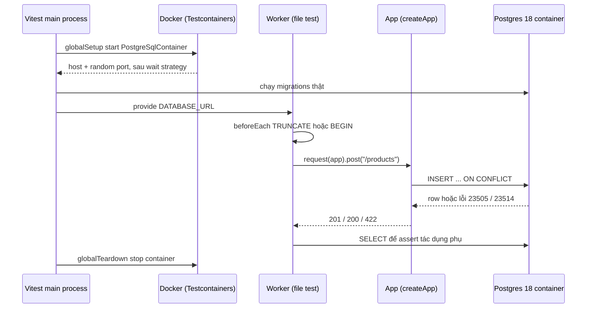

## Bối cảnh & vấn đề

Một service catalog có endpoint `POST /products` làm "upsert": tạo mới nếu `sku` chưa có, cập nhật nếu đã có. Bộ test gồm 40 unit test với repository bị mock, chạy 1,2 giây, coverage 92%. Lần deploy đầu tiên lên staging, endpoint trả 500 cho mọi request: câu `ON CONFLICT (sku)` cần một **unique constraint** trên `sku`, và migration quên tạo nó. Mock không biết gì về constraint. Lần deploy thứ hai, migration mới `ADD COLUMN currency char(3) NOT NULL` chạy ngon trên DB trống của developer nhưng **fail trên production** vì bảng đã có 2 triệu dòng, và cột `NOT NULL` không default không thể thêm vào bảng có dữ liệu.

Team kế bên đã "học bài" bằng cách chuyển sang SQLite in-memory: nhanh, không cần Docker. Test xanh, nhưng SQLite chấp nhận chuỗi `'12abc'` vào cột `INTEGER`, và không hỗ trợ `FOR UPDATE SKIP LOCKED` mà worker queue của họ dựa vào. Test xanh với một engine **khác** engine production không chứng minh được gì về production.

Bài này đi qua cách test API ở tầng HTTP bằng **Supertest**, chạy nó vào **Postgres thật** trong container bằng **Testcontainers**, so sánh ba cách xử lý database trong test, và cách test chính **migration**. Lần chạy thật dùng Vitest 5.0.3, Supertest 7.3, Express 5.2, Testcontainers 12.2, Postgres 18, Node 24.21.

## Khái niệm

### Integration test ở tầng HTTP

**API integration test** gửi request HTTP vào app thật (router, middleware auth, validation, error handler, service, repository) và kiểm tra response cùng tác dụng phụ (row trong DB, event được publish). Nó khác e2e ở chỗ không có UI và thường không có các service khác: chỉ một service với dependency nó **sở hữu** (DB, cache) chạy thật, còn hệ thống bên ngoài (payment, email) được double ở ranh giới. Đây là tầng cho tỉ lệ tự tin/chi phí tốt nhất với backend CRUD (xem [bài pyramid/trophy](/tracks/testing/learn/goals-and-test-shapes)).

### Supertest

**Supertest** nhận một `http.Server` hoặc một request handler (app Express, Koa callback) và trả về một builder kiểu `request(app).post("/x").set(...).send(...)`. Nếu bạn truyền app chưa listen, Supertest tự gọi `listen(0)`: port 0 nghĩa là **OS chọn port trống**, nên nhiều worker chạy song song không bao giờ va port. Vì vậy quy ước là tách `createApp()` (tạo app, không listen) khỏi `server.ts` (gọi `listen(3000)`). Kết quả trả về có `status`, `headers`, `body` đã parse JSON.

Ví dụ: `const res = await request(createApp({ pool })).get("/products/1").set("Authorization", \`Bearer ${token}\`)`. Token được **ký bằng key test** thật, middleware auth chạy thật: tắt middleware trong test nghĩa là route quên auth sẽ không bao giờ bị phát hiện ([bài auth](/tracks/testing/learn/auth-tenant-isolation)).

### Testcontainers

**Testcontainers** là thư viện khởi động container Docker từ code test: `await new PostgreSqlContainer("postgres:18-alpine").start()` kéo image, chạy container trên **port ngẫu nhiên** của host, chờ tới khi Postgres thật sự nhận kết nối (wait strategy: log "ready to accept connections" hoặc health check), rồi trả connection string. Một container phụ tên **Ryuk** theo dõi phiên test và xoá container khi process test chết, kể cả khi bị kill giữa chừng, nên không để lại rác.

Điểm mấu chốt: bạn chạy **đúng engine và đúng major version** như production (Postgres 18, không phải "một Postgres nào đó"), với migration thật của dự án.

### globalSetup

**globalSetup** là file chạy **một lần** trong process chính trước khi bất kỳ worker nào bắt đầu, và teardown sau khi tất cả xong. Đây là chỗ đúng để khởi động container và chạy migration, vì khởi động container tốn 1–3 giây; làm trong `beforeAll` của từng file sẽ nhân chi phí đó lên theo số file. Vì globalSetup chạy ở process khác worker, nó truyền connection string qua `process.env` hoặc API `provide`/`inject` của Vitest (verify tên API theo version).

### In-memory database: pg-mem và SQLite

**pg-mem** là một bản giả lập Postgres viết bằng JS chạy trong process; **SQLite in-memory** là một engine khác hẳn. Cả hai nhanh và không cần Docker, nhưng chúng là **fake** của database: chỉ đúng tới mức người viết fake đã hiện thực. Mọi khác biệt về dialect (JSONB, `ON CONFLICT`, system column `xmax`, locking, isolation level, collation, kiểu dữ liệu, RLS, trigger) là chỗ test xanh mà production đỏ.

### Migration

**Migration** là file thay đổi schema (và đôi khi dữ liệu) có thứ tự, chạy một lần trên mỗi môi trường. Migration là **code chạy trên production với dữ liệu thật**, nên nó cần được test như code: chạy từ đầu trên DB trống, chạy trên schema giống production, đo thời gian và lock.

**Interview angle:** `testing-006` follow-up "vì sao tắt auth middleware trong test là ý tồi?" — vì test không còn đi đúng đường của request thật; route quên `requireAuth`, claim `tenantId` bị đọc sai, hay error handler trả 500 thay vì 401 đều không bị bắt.

## Cơ chế hoạt động



Đọc theo thứ tự: chi phí đắt nhất (khởi động container, migration) xảy ra **một lần** ở process chính. Mỗi worker chỉ nhận connection string. Mỗi test bắt đầu bằng bước dọn dữ liệu (truncate hoặc mở transaction để rollback; so sánh chi tiết ở [bài cô lập test](/tracks/testing/learn/isolation-test-data-flaky)), rồi gọi app qua Supertest. Request đi qua **mọi lớp thật**: parser JSON, middleware, service, câu SQL thật, constraint thật. Lỗi của Postgres (mã `23505` unique violation, `23514` check violation) quay về app, và test kiểm tra app dịch nó thành HTTP status đúng.

Vì sao thiết kế như vậy? Vì bug của API CRUD tập trung ở **mối nối**: SQL sai, thiếu constraint, mapping lỗi DB sang HTTP, serialization (`bigint` thành chuỗi), auth. Unit test với mock không chạm mối nối nào trong số đó. Còn e2e qua UI chạm hết nhưng chậm và mơ hồ khi fail. Integration ở tầng HTTP chạm đúng mối nối với chi phí vài mili giây mỗi test sau khi container đã chạy.

Với **parallel workers**, một container dùng chung có thể chia thành **database riêng cho mỗi worker**: globalSetup tạo `app_template` đã migrate, mỗi worker chạy `CREATE DATABASE test_<workerId> TEMPLATE app_template` (copy file-level, nhanh hơn chạy lại migration). Chi tiết ở bài cô lập test.

**Interview angle:** follow-up của `testing-011` ("DB thật làm CI mất 12 phút, tăng tốc mà không quay lại mock") — câu trả lời là chính sơ đồ này: một container cho cả suite, migration một lần, template database cho mỗi worker, dọn bằng transaction/truncate thay vì tạo lại, `tmpfs` cho data dir, và tắt `fsync` trong container test (chỉ test).

## Ví dụ thực tế

App upsert sản phẩm và hai migration. Migration 2 là migration "nguy hiểm" ở đầu bài.

```ts
// app.ts
export function createApp(pool: pg.Pool) {
  const app = express(); app.use(express.json());
  app.post("/products", async (req, res) => {
    const { sku, name, priceCents } = req.body;
    try {
      const { rows } = await pool.query(
        `INSERT INTO products (sku, name, price_cents) VALUES ($1,$2,$3)
         ON CONFLICT (sku) DO UPDATE SET name = EXCLUDED.name, price_cents = EXCLUDED.price_cents
         RETURNING id, sku, price_cents, (xmax <> 0) AS updated`, [sku, name, priceCents]);
      res.status(rows[0].updated ? 200 : 201).json(rows[0]);
    } catch (e: any) {
      if (e.code === "23514") return res.status(422).json({ error: "PRICE_INVALID" });
      throw e;
    }
  });
  return app;
}
export const migrations = [
  `CREATE TABLE products (id bigserial PRIMARY KEY, sku text UNIQUE NOT NULL, name text NOT NULL,
     price_cents bigint NOT NULL CHECK (price_cents > 0))`,
  `ALTER TABLE products ADD COLUMN currency char(3) NOT NULL`,
];
```

`(xmax <> 0) AS updated` là một mẹo đặc thù Postgres: row vừa được `UPDATE` qua nhánh `ON CONFLICT` có `xmax` khác 0, row mới insert thì bằng 0. Đây đúng là loại chi tiết mà chỉ engine thật trả lời được.

```ts
let c: StartedPostgreSqlContainer; let pool: pg.Pool;
beforeAll(async () => {
  const t = Date.now();
  c = await new PostgreSqlContainer("postgres:18-alpine").start();
  pool = new pg.Pool({ connectionString: c.getConnectionUri() });
  await pool.query(migrations[0]);
  console.log(`container + migration ${Date.now() - t} ms`);
}, 60_000);
afterAll(async () => { await pool.end(); await c.stop(); });
beforeEach(async () => { await pool.query("TRUNCATE products RESTART IDENTITY"); });

it("creates then upserts (ON CONFLICT)", async () => {
  const app = createApp(pool);
  const a = await request(app).post("/products").send({ sku: "SH-1", name: "Shoe", priceCents: 1500 });
  const b = await request(app).post("/products").send({ sku: "SH-1", name: "Shoe v2", priceCents: 1700 });
  expect([a.status, b.status]).toEqual([201, 200]);
  expect(b.body).toEqual({ id: "1", sku: "SH-1", price_cents: "1700", updated: true });
});
it("CHECK constraint becomes 422", async () => {
  const res = await request(createApp(pool)).post("/products").send({ sku: "X", name: "Free", priceCents: 0 });
  expect(res.status).toBe(422);
});
it("migration 2 fails on a table that already has rows", async () => {
  await pool.query(`INSERT INTO products (sku, name, price_cents) VALUES ('OLD-1','Legacy',100)`);
  await expect(pool.query(migrations[1])).rejects.toThrow(/contains null values/);
});
```

```text
container + migration 1682 ms
 ✓ l04/products.int.test.ts > creates then upserts (ON CONFLICT) 25ms
 ✓ l04/products.int.test.ts > CHECK constraint becomes 422 5ms
 ✓ l04/products.int.test.ts > migration 2 fails on a table that already has rows 12ms
      Tests  3 passed (3)
   Duration  2.87s (tests 69%, import 30%, transform 1%)
```

(Ví dụ gói gọn container trong `beforeAll` cho dễ đọc; với nhiều file, chuyển phần này vào globalSetup như sơ đồ.) Đọc output: container cộng migration tốn **1,7 giây một lần**; ba test sau đó mỗi cái 5–25 ms. Ba thứ mock không thể cho bạn thấy: `id` và `price_cents` về dưới dạng **chuỗi** `"1"`, `"1700"` (vì `bigint`), `ON CONFLICT` cần unique constraint thật, và `ADD COLUMN ... NOT NULL` không default **fail** khi bảng có dữ liệu (Postgres báo `column "currency" of relation "products" contains null values`). Test thứ ba là dạng tối thiểu của "test migration trên dữ liệu": seed trước, migrate sau.

Cùng câu upsert và một câu queue, chạy trên pg-mem 3.0 và SQLite (`node:sqlite` của Node 24):

```text
pg-mem ERR: column "xmax" does not exist
pg-mem ERR: 🔨 Not supported 🔨 : The query you ran generated an AST which parts have not been read by the query planner. This means that those parts could be ignored:
sqlite row: [{"sku":"B","price_cents":"12abc","t":"text"}]
```

pg-mem không có system column `xmax` và không hiểu `FOR UPDATE SKIP LOCKED`. SQLite thì nhận `'12abc'` vào cột khai báo `INTEGER` và lưu thành `text` (type affinity, trừ khi bảng là `STRICT`), và `CHECK (price_cents > 0)` vẫn qua vì so sánh text với số theo luật của SQLite. Đây là câu trả lời bằng bằng chứng cho `testing-011`: engine khác cho bạn cảm giác an toàn sai.

### Test migration trong CI (câu testing-035)

Một pipeline migration tối thiểu nhưng đủ:

1. **Từ đầu**: Postgres trống → chạy toàn bộ migration → chạy suite integration. Bắt migration hỏng, sai thứ tự, phụ thuộc vào trạng thái tay.
2. **Từ schema production**: restore `pg_dump --schema-only` của production (hoặc snapshot đã anonymize nếu cần dữ liệu) → chạy migration **mới** → chạy suite. Bắt migration giả định bảng trống như ví dụ trên.
3. **Tương thích ngược**: sau khi migrate, chạy **test của phiên bản code trước** (đang chạy trên production lúc rolling deploy). Nếu migration đổi tên cột, code cũ vỡ: dấu hiệu cần expand/contract (thêm cột mới, dual-write, backfill, rồi mới xoá cột cũ).
4. **Lint migration**: cấm `ADD COLUMN ... NOT NULL` không default trên bảng lớn, `CREATE INDEX` không `CONCURRENTLY`, `ALTER COLUMN TYPE` viết lại bảng; đặt `lock_timeout` trong migration.
5. **Đo** thời gian và lock trên dữ liệu cỡ thật cho migration có backfill, và test backfill với dữ liệu bẩn (null, trùng, encoding lạ).

Về down-migration (follow-up): nhiều team không viết hoặc không dựa vào chúng, vì rollback schema sau khi dữ liệu mới đã được ghi thường mất dữ liệu; chiến lược an toàn hơn là migration **luôn tương thích ngược** + roll-forward. Nếu team có down-migration, hãy test chúng (up → down → up trên DB có dữ liệu), vì down-migration không được test thì không dùng được lúc 2 giờ sáng.

## Trade-offs & lựa chọn thay thế

| Cách | Tốc độ | Cần Docker | Bắt được SQL/constraint/migration | Rủi ro |
|---|---|---|---|---|
| Mock repository | Nhanh nhất (µs) | Không | Không | Tautology, mock drift |
| pg-mem / SQLite in-memory | Nhanh (ms) | Không | Một phần, theo dialect của fake | Test xanh vì engine khác; tính năng thiếu |
| Engine thật trong container | Khởi động 1–3 s, mỗi test ms | Có | Có, gồm RLS, lock, kiểu dữ liệu | Chậm hơn, cần quản lý isolation |
| DB dùng chung (staging) | Phụ thuộc mạng | Không | Có | State chia sẻ, flaky, không chạy song song được |

**Khi nào chọn cái nào.** Logic thuần (tính giá, rule trạng thái) dùng unit test, không cần DB. Repository, query, transaction, migration dùng **engine thật** trong container, đây là mặc định cho backend có SQL. Mock repository hợp lý khi test use case có logic phức tạp **phía trên** repository và repository đã có integration test riêng. In-memory engine chỉ hợp khi production **cũng** dùng engine đó (app SQLite thật) hoặc cho prototype; không dùng để "giả" Postgres/SQL Server. DB staging dùng chung không nên là nơi chạy test tự động chặn merge.

| Supertest vs alternatives | Ghi chú |
|---|---|
| `supertest(app)` | Không cần listen, port 0, chạy được mọi middleware |
| `fetch` vào server đã `listen(0)` | Tương đương, cần tự quản lý server và đóng nó |
| `app.inject()` (Fastify) | Không qua socket, nhanh hơn; Fastify-only |
| NestJS `Test.createTestingModule` + Supertest | Override provider (ví dụ payment) nhưng giữ module thật |

## Edge cases & failure modes

- **Docker không có trong CI**: Testcontainers cần Docker socket (hoặc runtime tương thích). Trên GitHub Actions runner Linux có sẵn; trên runner không có Docker, dùng service container của CI (`services: postgres`) với cùng image và vẫn chạy migration thật.
- **Pull image lần đầu chậm**: 30–60 giây cho image lớn; cache image trong CI, pin tag cụ thể (`postgres:18.x-alpine`) thay vì `latest` để không đổi engine ngầm.
- **Timeout khởi động**: `beforeAll` mặc định 10 s (Vitest `hookTimeout`, verify) không đủ cho lần pull đầu; đặt timeout riêng như `60_000` hoặc đưa vào globalSetup.
- **Nhiều worker cùng chạy migration**: nếu mỗi worker tự migrate cùng một DB, hai migration chạy song song gây lỗi trùng bảng. Migration tool tử tế dùng **advisory lock** để chỉ một tiến trình migrate (verify với tool của bạn); tốt hơn là migrate một lần ở globalSetup.
- **Migration lock trên production**: `ALTER TABLE` lấy `ACCESS EXCLUSIVE` lock; nếu có transaction dài đang giữ lock yếu hơn, ALTER đứng chờ, và mọi query sau nó cũng xếp hàng sau ALTER. Test không tái hiện được tải production, nên dùng `lock_timeout` và lint.
- **Kiểu dữ liệu từ driver**: `bigint`/`numeric` về dạng chuỗi, `timestamptz` thành `Date` theo timezone của process, `json` đã parse. Assert theo dạng thật, và quyết định parse ở repository.
- **Connection leak**: quên `pool.end()` làm runner không thoát (Jest in "did not exit one second after the test run"); đóng pool trong `afterAll`.
- **Dialect của SQL Server**: nếu production là SQL Server, cũng dùng container SQL Server thật; khác biệt collation (case-insensitive mặc định) và `MERGE` còn lớn hơn giữa Postgres và SQLite.

## Pitfalls

- ❌ `app.listen(3000)` trong cùng module export app → ✅ tách `createApp()` và `server.ts`; Supertest tự bind port 0.
- ❌ Tắt middleware auth hoặc mock `req.user` → ✅ ký JWT bằng key test và đi qua middleware thật.
- ❌ SQLite/pg-mem thay cho Postgres "vì nhanh" → ✅ engine thật trong container, tối ưu tốc độ bằng globalSetup, template DB, truncate/rollback.
- ❌ Khởi động container trong `beforeAll` của mỗi file → ✅ globalSetup một lần, truyền URL qua `provide`/env.
- ❌ Seed dữ liệu chung khổng lồ cho mọi test → ✅ mỗi test tự tạo dữ liệu qua factory, dọn giữa các test.
- ❌ Chỉ chạy migration trên DB trống → ✅ chạy thêm trên schema giống production có dữ liệu, chạy test của code cũ trên schema mới.
- ❌ Assert chỉ status code → ✅ assert status, body và tác dụng phụ trong DB (row, không có row thừa của tenant khác).
- ❌ Image `postgres:latest` → ✅ pin đúng major version production.

## Tóm tắt

- API integration test gửi request HTTP vào app thật với DB thật; double chỉ hệ thống bên ngoài.
- Supertest nhận app chưa listen và dùng port 0; tách `createApp()` khỏi `listen`.
- Testcontainers chạy đúng engine/version production trên port ngẫu nhiên; Ryuk dọn container.
- Khởi động container và migrate một lần ở globalSetup; mỗi test vài ms.
- pg-mem/SQLite khác dialect: thiếu `xmax`, `SKIP LOCKED`, nhận `'12abc'` vào cột INTEGER; test xanh không chứng minh gì về production.
- Test migration từ đầu, từ schema production có dữ liệu, và với code phiên bản trước; lint migration nguy hiểm.
- Engine thật bắt những gì mock bỏ sót: constraint, kiểu dữ liệu, mapping lỗi DB sang HTTP.
